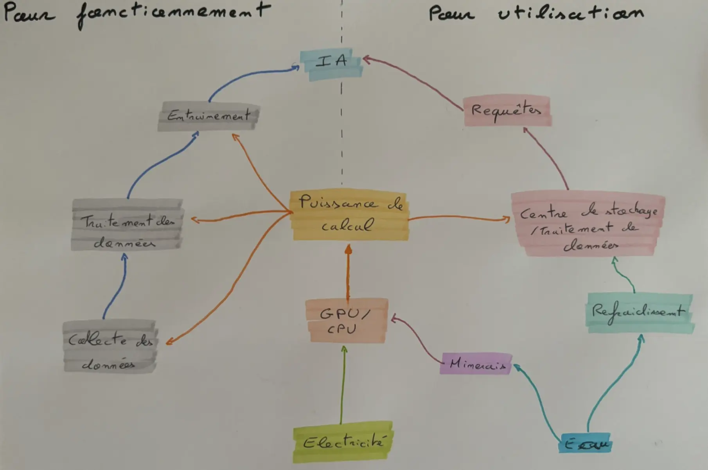
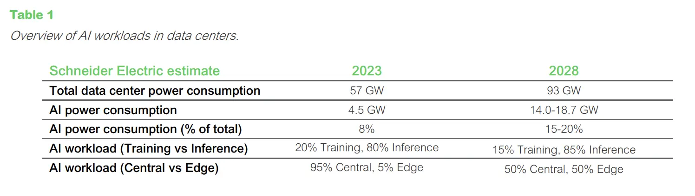
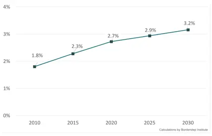
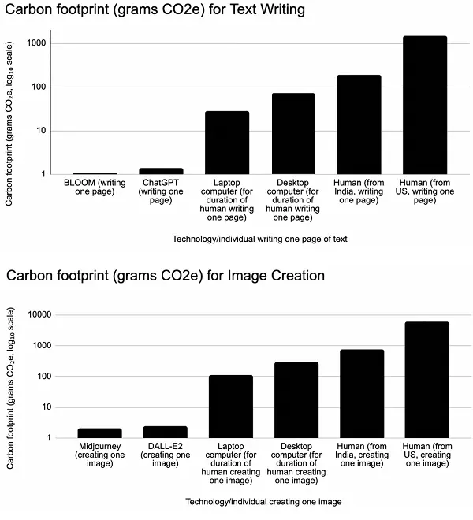



| Date           | Heures passées | Indications          |
| -------------- | -------------- | -------------------- |
| Jeudi 3/10     | 1H             | TO DO et objectif    |
| Lundi 7/10     | 2H             | Recherche            |
| Vendredi 10/10 | 3H             | Etude de cas ChatGPT |
| lundi 14/10    | 3H             | Rédaction MON        |
|                |                |                      |
| Total          | 9H             |                      |

Bonne gestion de mon temps, mais mes MON sont trop théoriques et deviennent un peu lassants. J'aimerais dans le temps 2 faire plus de pratiques, comme mettre en application les cours sur Bubble ou créer un petit jeu.


## 💡 Introduction

L'intelligence artificielle a pour promesse de répondre à de nombreux problèmes :

- coder plus rapidement
- conduire davantage en sécurité
- accomplir les tâches quotidiennes avec moins d'effort.

Mais qu'en est-il de la consommation énergétique d'une IA comparée à une solution standard ?

Cette question est d'autant plus importante lorsque l'on sait que Google a augmenté en 2024 son empreinte carbone de plus de 67 % par rapport à 2019, son année de référence (16,1 MTCO2 en 2024 contre 9,66 MTCO2 en 2019) [1]. L'entreprise a expliqué qu'à mesure qu'elle intègre l’IA dans ses produits, la réduction des émissions pourrait s’avérer difficile.

De plus, cette consommation grandissante d'énergie est couplée à une dépense plus importante en eau. En effet, ce n'est pas moins de 6,4 milliards de litres d'eau qui ont été consommés par Microsoft en 2022, soit une augmentation de 34 % par rapport à 2021 [2]. Cette augmentation est, en revanche, expliquée par l'utilisation de l'IA. Enfin, une étude a estimé que 25 à 50 questions échangées avec le chatbot ChatGPT-3 nécessitent un demi-litre d’eau. Les modèles plus récents, comme GPT-4, seraient encore plus gourmands en eau [3].

Ceci est une véritable inquiétude au vu de notre situation mondiale actuelle : un réchauffement climatique de plus en plus important dû aux émissions de carbone et des conflits de plus en plus violents et fréquents à cause du stress hydrique. La réalité de l'intelligence artificielle semble bien loin des promesses qu'elle promettait.

## ❓ Mais pourqoui l'IA conssomme t-elle autant : Etude de cas OpenAI ?

Pour répondre à cette question, il faut revenir aux sources et comprendre quels sont les besoins d'une IA pour fonctionner.

    
     
    <u> Image 1 : Fresque IA </u>

 

En effet, pour fonctionner, l'IA a besoin d'être entraînée ; cet entraînement nécessite une grande puissance de calcul. Pour l'entraînement de GPT-3, ce ne sont pas moins de 10 000 GPU qui ont été utilisés pendant 6 mois non-stop [4]. Ceci représente 1 287 MWh, l'équivalent de la consommation de 274 foyers français pendant une année entière [5]. Cet entraînement s'est fait à partir d'une base de données de plus de 570 Go. En plus de sa forte consommation d'électricité, les centres de traitement de données nécessitent un refroidissement permanent de leurs composants. Ainsi, ce ne sont pas moins de 700 000 litres d'eau qui ont été dépensés pour l'entraînement, ce qui est équivalent à la piscine de refroidissement d'un réacteur nucléaire.

De plus, une fois l'entraînement terminé, ils peuvent commencer la phase d'exploitation, et l'utilisation n'est pas moins consommatrice en énergie. Au contraire, des chercheurs ont estimé que l’énergie utilisée pour l’entraînement n’est que 40 % de l’électricité consommée pour l’usage du modèle. Nous pouvons donc estimer à près de 206 GWh la consommation annuelle d’électricité de ChatGPT, soit à peu près autant que la République centrafricaine, le Bénin ou le Sierra Leone.

Enfin, comme nous l'avons évoqué en introduction, il a été estimé qu'une requête consomme environ 0,2 L d'eau. Cela est inquiétant lorsque l'on sait que le site écoule plus de 14 milliards de visites par an [6]. Soit, si l'on estime qu'à chaque visite l'on effectue 5 requêtes, c'est 14 milliards de litres d'eau. Cela ne prend en compte que le refroidissement des data centers. À cela s'ajoute l'eau nécessaire pour l'extraction minière des minerais pour les composants.

Tout cela ne se fait pas sans coût et représente des dépenses astronomiques. Il a été estimé que, pour faire fonctionner ChatGPT correctement, ce ne sont pas moins de 700 000 dollars dépensés chaque jour [7] !

Ceci ne concerne qu'un acteur parmi de nombreux autres. Au final, pour résumer :

|                 | Besoins          | Coût énergétique   | Coût en eau             | Coût en $              |
| :-------------- | :--------------- | :----------------- | :---------------------- | :--------------------- |
| Entrainement IA | 10000 GPU        | 1287 MWh           | 700 000 L               | 10 000 000 $           |
| ChatGPT         | 5 Data center    | 206 GWh par an     | 14 000 000 000 L par an | 700 000 $ par jour     |
| IA mondial      | 100 Data centers | Environ 300 TWh/an | 150 000 000 000 L/an    | 40 - 50 milliards $/an |

## ⚠️ Les risques

Ces chiffres mettent en relief le fait que l'utilisation de l'IA doit susciter certaines préoccupations. Si aucune mesure n'est mise en place et si son expansion continue, l'IA pourrait contribuer de manière significative à l'augmentation des émissions de carbone, à l'épuisement des ressources naturelles comme l'eau, et à une hausse importante des coûts énergétiques mondiaux, aggravant ainsi les défis environnementaux et économiques déjà existants.

Un des principaux risques liés à cette technologie est qu'elle peut nous rendre "paresseux" dans l'effort. Une tâche qui, traditionnellement, nécessite du temps pour être comprise et traitée peut être résolue facilement par une IA, sans réelle compréhension du sujet. Cependant, cette approche n'est pas sans conséquences pour l'environnement. C'est là le problème actuel : l'IA est devenue une tendance, et tout le monde veut l'utiliser sans toujours savoir pourquoi. On l'implémente partout, même pour des problèmes qui ont déjà des solutions moins polluantes. L'IA doit rester un outil destiné à résoudre des défis adaptés à ses capacités. Si nous continuons à l'intégrer de manière excessive, non seulement nous risquons d'aggraver les conditions climatiques, mais nous pourrions aussi freiner notre propre évolution en privilégiant des solutions superficielles plutôt que des approches réfléchies, qui ouvrent la voie à de nouvelles découvertes.

Inquiète, l'entreprise Schneider a publié une estimation des dépenses en énergie de l'IA dans son rapport "The AI Disruption: Challenges and Guidance for Data Center Design".

    
     
    <u> Image 2 : Estimation des consommations électriques des datacenters en 2028 [8] </u>

 

Soit une augmentation de 400 % pour l'IA d'ici 2028 !

    
     
    <u> Image 3 : Estimation des consommations électriques des datacenters en 2030 [10] </u>

 

Et représentera plus de 3 % de la consommation mondiale en 2030.

En supposant que nous observons la même augmentation dans les rejets de carbone causés par l'IA (hypothèse minimaliste), d'ici 2028, le bilan carbone de l'IA serait de 64,4 MTCO2, ce qui équivaut aux émissions de carbone de la France sur une année.

Tout n'est pas mauvais dans cette technologie. Bien que son entraînement et son utilisation requièrent une grande puissance de calcul, elle permet de simplifier et d'automatiser des tâches qui demandaient plus de temps et de ressources, permettant ainsi de réduire les émissions de carbone de ces tâches. En effet, une étude semble suggérer que l'IA pourrait produire moins d'émissions de carbone que les humains, ce qui la rendrait plus durable.

    
     
    <u> Image 4 : Comparaison des empreintes carbone pour une même tâche réalisée par un humain et des IA [9] </u>

 

Ainsi, ce qui est inquiétant, ce n'est pas la technologie en elle-même, mais les réactions qu'elle suscite, et comment les gens l'intégreront dans leur vie : l'utiliseront-ils de façon raisonnée ou à tort et à travers. Ce qui est à craindre, c'est l'effet rebond.  

## ⌛ Conclusion

Les avantages de l'intelligence artificielle sont indéniables : elle promet d'accélérer la résolution de problèmes complexes, de simplifier les tâches du quotidien, et d'améliorer la sécurité dans plusieurs domaines. Cependant, ces bénéfices s'accompagnent d'une consommation énergétique et en ressources naturelles préoccupante, bien plus élevée que celle des solutions traditionnelles.

Les chiffres actuels montrent que l'expansion de l'IA, sans une gestion adéquate, pourrait aggraver la crise environnementale mondiale en augmentant considérablement les émissions de carbone et en épuisant les ressources en eau. Si nous continuons à généraliser son usage sans discernement, nous risquons non seulement d'accentuer ces problématiques écologiques, mais aussi de compromettre notre capacité à innover durablement.

Ainsi, il devient urgent de limiter l'usage de l'IA aux tâches qui lui sont réellement adaptées et de développer des approches plus durables. L'IA doit rester un outil puissant, mais son déploiement doit être raisonné et respectueux des ressources naturelles, afin d'éviter qu'elle ne devienne elle-même une source majeure de dégradation climatique.



**[1] -** [Augmentation des emission CO2 IA](https://wearegreen.io/bilan-carbone/google)

**[2] -** [Augmentation de la consommation en eau IA](https://www.geo.fr/environnement/eau-ia-generative-a-t-elle-fait-exploser-consommation-eau-geants-de-la-tech-openai-microsoft-google-chatgpt-216592)

**[3] -** [20 requêtes GPT coûtent 50 mL d'eau !?](https://www.bfmtv.com/tech/intelligence-artificielle/une-bouteille-par-conversation-chat-gpt-est-un-gouffre-de-consommation-d-eau-fraiche_AV-202304120278.html)

**[4] -** [Dépenses énergétiques entrainement GPT-3](https://www.lebigdata.fr/argent-energie-vrai-cout-chatgpt)

**[5] -** [Énergie nécessaire pour entraîner GPT-3 ?](ttps://www.revolution-energetique.com/voici-la-consommation-delectricite-phenomenale-de-lintelligence-artificielle/#:~:text=Nous%20pouvons%20donc%20estimer%20à,Bénin%20ou%20le%20Sierra-Leone)

**[6] -** [Nombre de visites annuelles de ChatGPT](https://www.solutions-numeriques.com/chatgpt-champion-incontestable-des-chatbots-avec-146-milliards-de-visites-au-cours-de-lannee-ecoulee/#:~:text=Chatbot%20-%20ChatGPT-,ChatGPT%2C%20champion%20incontestable%20des%20chatbots%20avec%2014%2C6%20milliards%20de,cours%20de%20l%27année%20écoulée%20!&text=Writerbuddy.ai%2C%20une%20entreprise%20californienne,les%20plus%20visités%20de%202023)

**[7] -** [Coût jounalier serveurs OpenIA](https://www.20minutes.fr/high-tech/4034128-20230424-chatgpt-fonctionnement-chatbot-coute-pres-700-000-dollars-jour-openai#:~:text=Selon%20une%20étude%20menée%20par,33%20centimes%20à%20l%27entreprise)

**[8] -** [Etude Schneider electric](https://www.se.com/us/en/download/document/SPD_WP110_EN/)

**[9] -** [Gains observés grâce à l'IA !?](https://intelligence-artificielle.developpez.com/actu/356207/Les-emissions-de-carbone-liees-a-l-ecriture-et-a-l-illustration-sont-plus-faibles-pour-l-IA-que-pour-l-homme-selon-une-etude-sur-l-empreinte-environnementale-relative-de-l-IA-et-de-l-homme/)

**[10] -** [Simulation des dépenses énergétiques 2030](https://cloud-computing.developpez.com/actu/310748/La-consommation-d-electricite-des-datacenters-dans-l-Union-europeenne-pourrait-atteindre-jusqu-a-98-5-TWh-d-ici-2030-selon-une-etude-menee-par-la-Commission-europeenne/)


