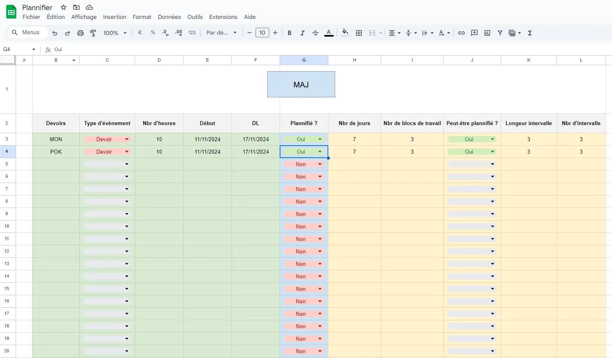
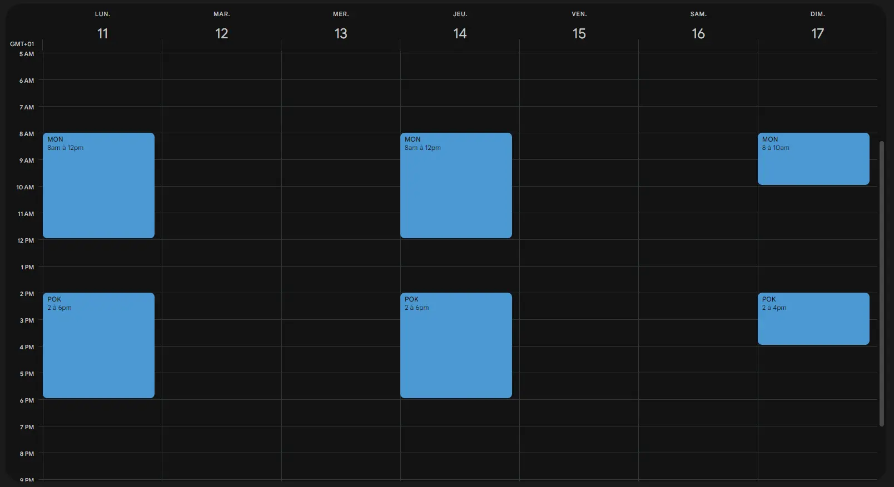



- [Google Sheet du projet](https://docs.google.com/spreadsheets/d/1ZDfEpIXLgIXsJeGU5F7v9NztJjGoHtkYlqHFdQQd0kI/edit?usp=sharing)





| Date          | Heures passées | Indications                 |
| ------------- | -------------- | --------------------------- |
| Samedi 9/11   | 1H             | Prise en main de App Script |
| Samedi 16/11  | 4H             | Interface + App Script      |
| Dimache 17/11 | 4H             | App Script + Débogage       |
| lundi 18/11   | 1H             | Rédaction MON               |
|               |                |                             |
| Total         | 10H            |                             |



## ✔️ Objectifs de ce MON

Lors de périodes de révision ou de périodes chargées, j'ai l'habitude de réaliser un planning afin de mieux optimiser mon temps de travail. La réalisation de ce planning me prend du temps, c'est pourquoi j'ai essayé d'automatiser cette tâche via les applications de Google afin de pouvoir directement implémenter le planning dans mon calendrier.

- [x] Créer une interface permettant de plannifier mes devoirs.
- [x] Automatiser la planification des tâches simples.
- [ ] Automatiser la planification des révisions selon la méthode des J.

## 📄 Partie 1 : Création d'une interface sur Google Sheet

Dans l'idée de pouvoir automatiser la planification d'événements, il faut tout de même avoir une interface permettant de définir les caractéristiques de ces événements. Selon moi, les caractéristiques définissant une tâche sont :

- Le nom
- Le nombre d'heures estimés
- La date de début
- La date limite

On met en forme cela sous forme de tableau et on obtient notre interface !

    
     
    <u> Image 1 : Interface Planning </u>

## 💻 Partie 2 : Automatisation de la plannification avec App Script

Afin d'automatiser la création de planning dans mon calendrier Google, j'ai utilisé l'API de Google Calendar via App Script. J'ai décomposé mon code en 9 fonctions :

1) **Nbr_lignes** : C'est une fonction très simple qui retourne la dernière ligne complète dans mon interface.
2) **Nbr_heures_dispo** : C'est une fonction qui trouve le nombre d'heures disponibles sur une plage donnée.
3) **Nbr_heure_dispo_jour** : C'est une fonction qui prend en entrée un jour et retourne le nombre d'heures disponibles dans la journée, une journée étant de 8h à 12h et de 14h à 22h.
4) **Nbr_heure_dispo_intervale** : C'est une fonction qui prend en entrée un jour de départ et le nombre de jours suivants, et retourne le nombre d'heures disponibles sur cette plage horaire.
5) **Trouve_creneau_jour** : C'est une fonction qui prend en entrée un jour et retourne le premier créneau de 4h de la journée disponible.
6) **Test_taches_realisable** : C'est un test qui prend en entrée une ligne de notre interface et vérifie si nous avons suffisamment de temps pour réaliser la tâche associée.
7) **Plannifie_ligne** : C'est une fonction qui prend une ligne de notre interface en entrée et la planifie dans le calendrier selon la règle suivante : sur la plage de temps possible, on essaie de répartir le travail en blocs de 4h espacés au maximum entre eux.
8) **Plannifier** : C'est une fonction qui parcourt toute la liste de notre interface, effectue les tests et planifie les tâches planifiables.
9) **MAJ** : C'est une fonction qui trie par ordre croissant de date limite (DL) et lance la fonction Plannifier.

Une fois ces fonctions codées, il ne reste plus qu'à créer un bouton qui exécute la fonction MAJ lorsqu'on clique dessus. On lance et on obtient :

    
     
    <u> Image 2 : Résultat dans Calendar</u>

## ❌ Difficultés rencontrées

Je n'ai pas réussi à réaliser l'ensemble des objectifs que je me suis fixés. En effet, je n'ai pas eu le temps de coder la fonction qui planifie les apprentissages selon la méthode des J. Plusieurs raisons expliquent cela :

1) Découverte de App Script et du JavaScript : La phase de prise en main de cette plateforme n'a pas été immédiate. Étant un grand habitué d'Excel et du VBA, j'ai été étonné de rencontrer certains bugs dus à la façon dont est structuré mon code, qui était adapté pour VBA mais pas pour App Script.
2) Gros bug causé par une mauvaise gestion des autorisations qui m'a obligé à reprendre tout mon code pour rien. :/
3) 
Finalement, ce projet m'a permis de découvrir le potentiel de Sheets par rapport à Excel et d'explorer les différents outils proposés par Google.