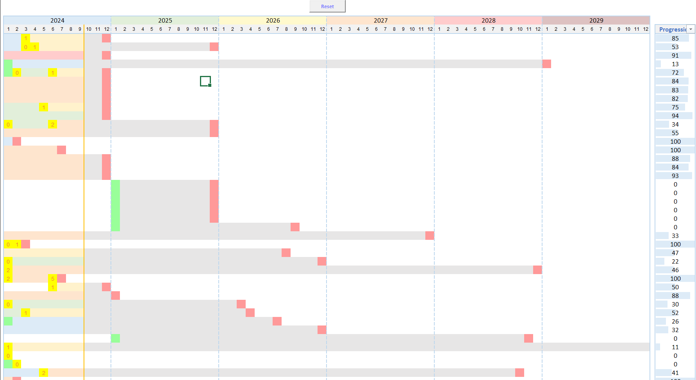
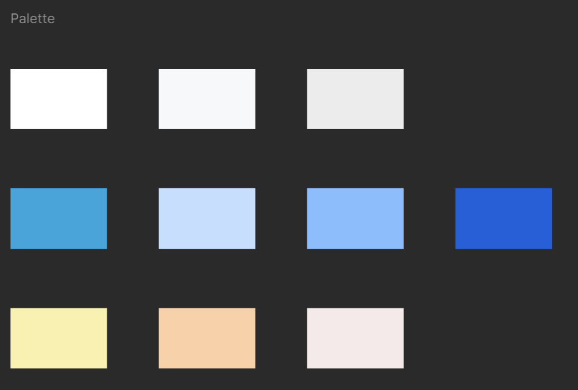
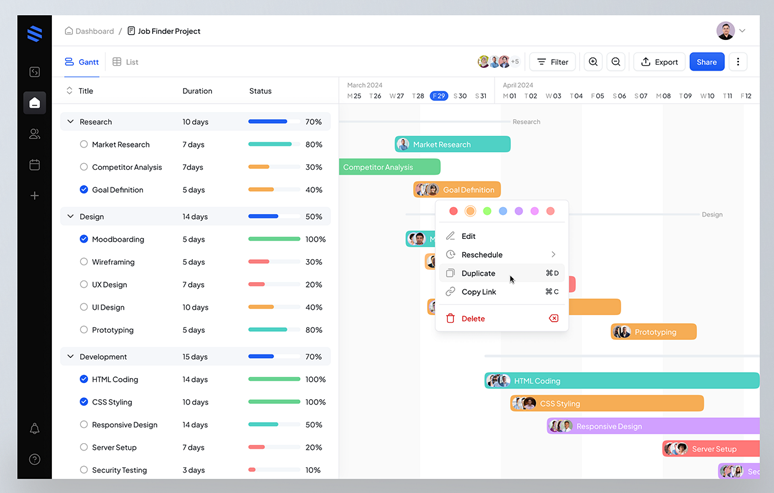
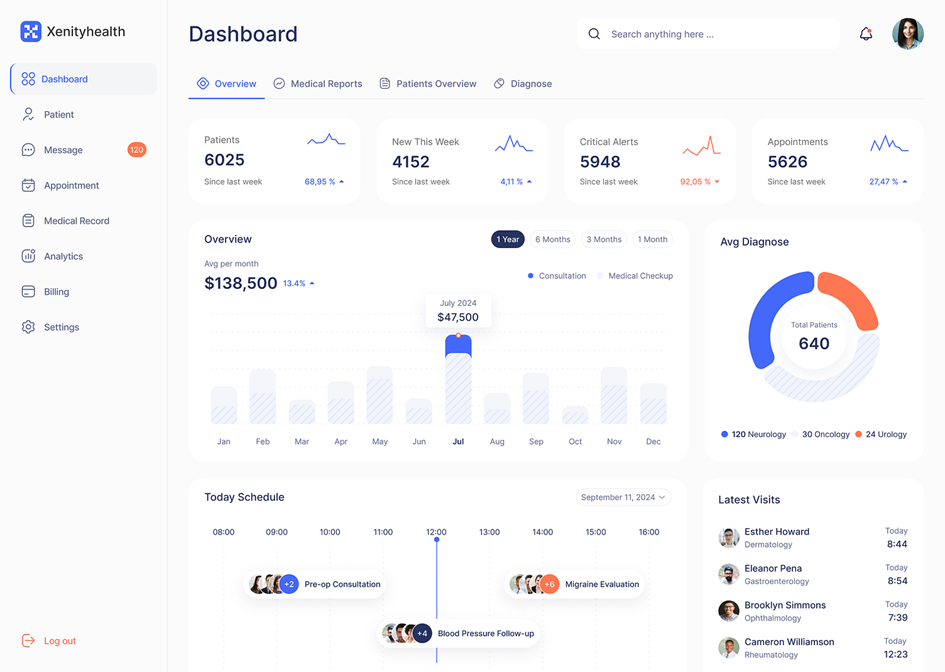
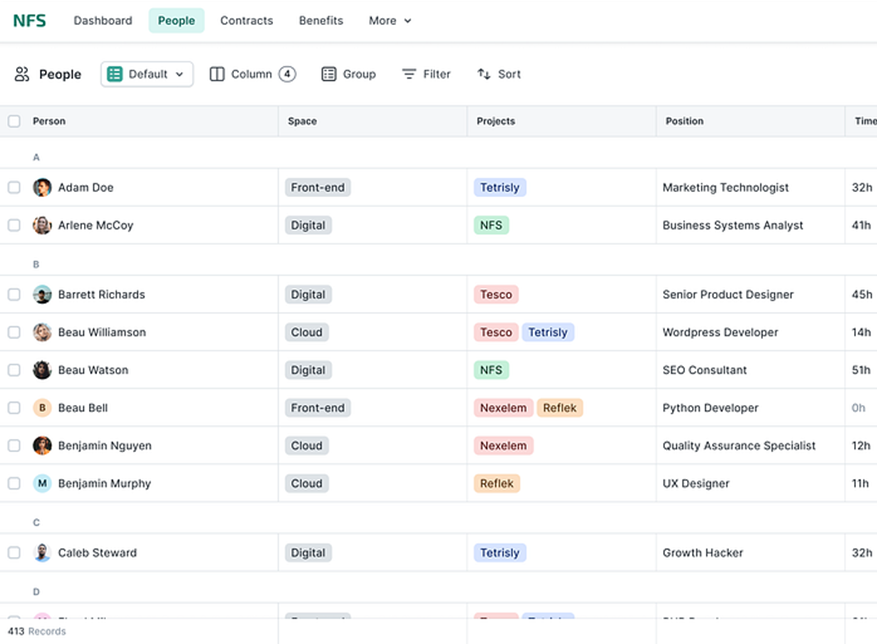



[Maquette Figma](https://www.figma.com/proto/HhEltVYEaK8SI7pjgoneH2/Planning-RTE?node-id=0-1&t=BmqacADg3OVew0cF-1)





| Date           | Heures passées | Indications                  |
| -------------- | -------------- | ---------------------------- |
| Mercredi 27/11 | 2H             | Définition du besoin + UI/UX |
| Samedi 30/11   | 4H             | Figma                        |
| Jeudi 12/12    | 3H             | Figma                        |
| lundi 15/12    | 1H30           | Rédaction MON                |
|                |                |                              |
| Total          | 10H30          |                              |

J'ai un peu dépassé le temps à cause de la rédaction du MON, sinon bonne gestion du temps et des objectifs



## 💡 Introduction

Suite aux cours de no/low code et UI/UX design, j'ai eu envie de créer mon propre site internet à l'aide des outils présentés : Figma / Bubble / Dribble. Plus précisément j'avais envie d'améliorer le tableau de bord que j'ai mis en place dans mon entreprise. Ce tableau a pour but de présenter l'avancement des projets de nos services afin d'estimer la charge de travail des collaborateurs. Actuellement, il s'agit d'un outil Excel qui présente de nombreuses limites : mise à jour de la BDD non automatique / bugs liés à Excel / pas très esthétique.

    
    <u> Image 1 : Aperçu planning Excel </u>

Ainsi, j'aimerais proposer une version améliorée de ce tableau sous forme d'application web.


Ce projet n'est pas une demande ni une mission de mon entreprise, je mène ce projet de ma propre initiative.


## ✏️ UI / UX

_Fonctionnalités clés_

- Avoir un aperçu de l'avancement des projets
- Pouvoir identifier facilement les jalons et livrables
- Pouvoir avoir facilement le descriptif d’un projet : équipe / lieu / rapide présentation
- Pouvoir filtrer / trier
- Pouvoir analyser la production d'un service
- Pouvoir gérer les affectations des effectifs aux projets

_Utilisateurs cibles_

- Salariés = session courte de 10-30 min / lecture seulement
- CODIR = session plus longue 30-60 min / lecture et écriture

_Charte graphique_

- Police = Roboto
- Couleur = bleu / blanc / gris

    
    <u> Image 2 : Palette de couleur utilisée </u>

_Inspirations_

Pour le design du site j'ai opté pour la présentation suivante :

    
    
 [Source Dribble](https://dribbble.com/shots/23393705-Atos-Task-Management-Dashboard-List-View) 

Afin de répondre à toutes les exigences l'application se décompose en trois onglets:

1. Planning : Gantt présentant les avancements des projets

    
    
 [Source Dribble](https://dribbble.com/shots/23913594-Dashboard-Gantt-Chart) 

1. Production : Dashboard présentant les livrables à produire

    
    
 [Source Dribble](https://dribbble.com/shots/24852217-Xenity-Health-Medical-Dashboard) 

1. Affectation : Tableau permettant d'affecter les équipes aux projets

    
    
 [Source Dribble](https://dribbble.com/shots/23047845-NFS-Spreadsheet-Table-View) 

Pour voir le rendu final de la maquette [cliquez ici !](https://www.figma.com/proto/HhEltVYEaK8SI7pjgoneH2/Planning-RTE?node-id=0-1&t=BmqacADg3OVew0cF-1)
