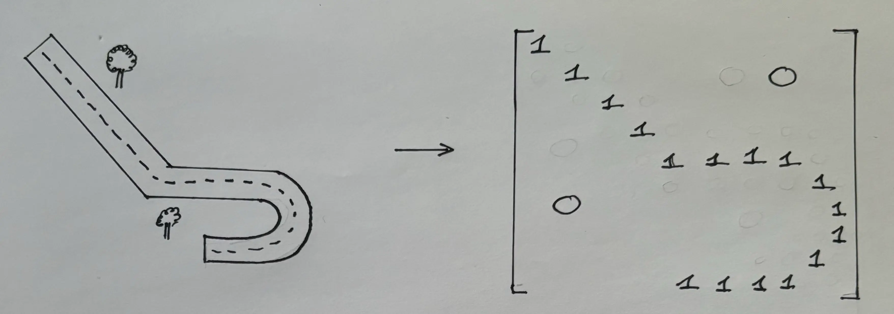
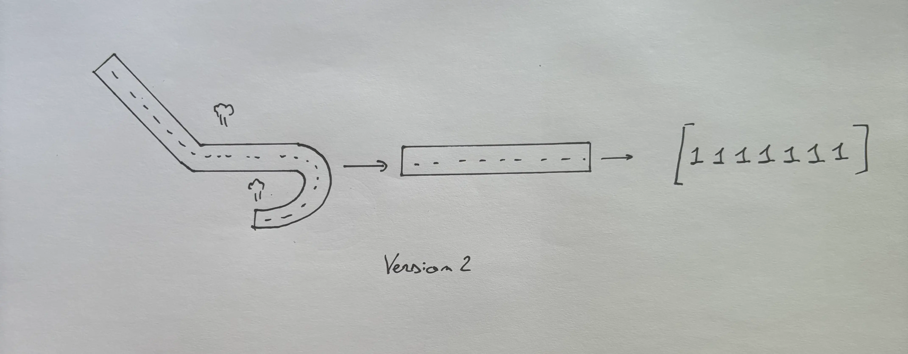
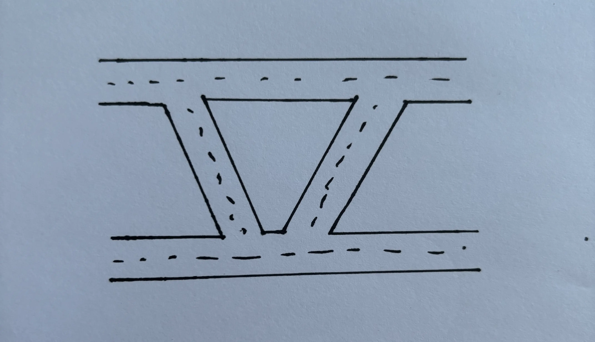
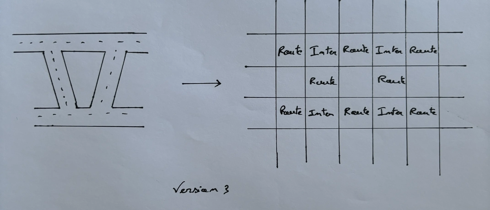
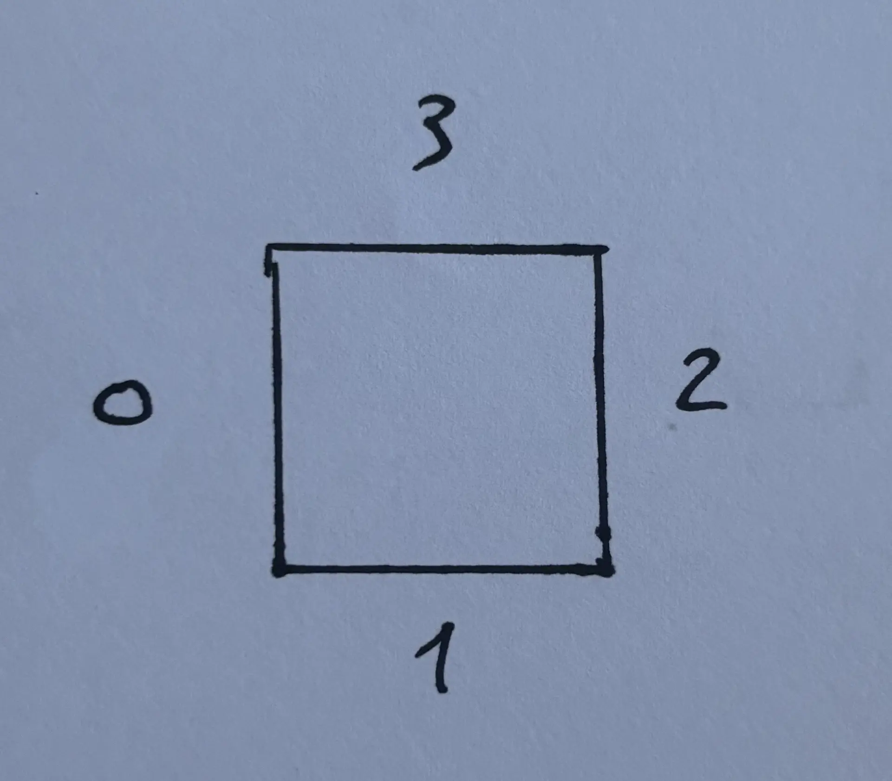
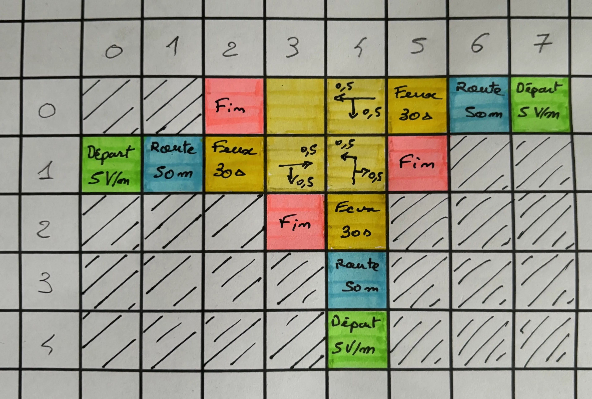



- Base en python
- Code de la route





- [GitHub du projet](https://github.com/Mathisadi/CTZ)



## Project Management



- [x] Documentation
- [x] Définir un cas d'étude
- [x] Définir quels sont les élements constitutifs d'une route
- [x] Définir comment on modélisera notre route
- [x] Traduire notre cas d'étude en code
- [x] Détailler le résumer pour que tout le monde comprennent la réflexion





| Date           | Heures passées | Indications                                          |
| -------------- | -------------- | ---------------------------------------------------- |
| Mercredi 4/09  | 1H             | Initialisation du projet / Définission des objectifs |
| Samedi 7/09    | 2H             | Documentation et liste des éléments d'une route      |
| Dimanche 8/09  | 1H             | Modéle 1 (abandoné)                                  |
| Mercredi 11/09 | 1H             | Modèle 2 (abandonné)                                 |
| Mercredi 11/09 | 2H             | Modèle 3 (retenu) + theory thinking                  |
| Samedi 14/09   | 30min          | Création du projet                                   |
| Samedi 14/09   | 1H             | Traduction de notre étude en code                    |
| Dimanche 15/09 | 1H30           | Rédaction POK                                        |
|                |                |                                                      |
| Total          | 10H            |                                                      |

Bonne gestion de mon temps mais beaucoup de tâches à faire dans le prochain sprint





- [x] Définir les régles du traffic
- [x] GitHub
- [x] Coder la simulation
- [x] Coder les priorités
- [x] Coder les mouvement
- [x] Coder les feux rouges
- [x] Coder les départ
- [x] Coder les fin
- [x] Coder les directions avec les probas
- [x] Coder les chemins intersection pour 2 voies
- [x] Debuger





| Date                   | Heures passées | Indications                       |
| ---------------------- | -------------- | --------------------------------- |
| Mercredi 20/09         | 1H             | Création d'une TO DO list         |
| Samedi 21/09           | 2H             | Dévellopement update route        |
| Dimanche 22/09         | 2H             | Dévellopement intentions          |
| Samedi 28/09           | 1H             | Développement mouvements          |
| Dimanche 29/09         | 1H30           | Debug 1                           |
| Mardi 01/10            | 1H             | Debug 2                           |
| Samedi 05/10           | 1H             | Simulation                        |
| Samedi 12/10           | 1H30           | Rédaction POK                     |
| (Bonus) Dimanche 06/09 | 2H             | Refonte projet / Bonnes pratiques |
| (Bonus) Dimanche 06/09 | 4H             | Commentaire code + GitHub         |
|                        |                |                                   |
| Total                  | 11H            |                                   |

J'ai sous-estimé le temps de débogage, j'ai donc privilégié le fonctionnement au cas par cas pour ce POK. Il me revient de modifier mon code pour gérer l'ensemble des cas possibles dans le prochain POK.



## Objectif : Modéliser et visualiser le traffic sur un cas donné

<div style="text-align: center;">
    
    <br>
    <u> Image 1 : Cas d'étude</u>
</div>
<br>

## Partie 0 : 💡 Introduction et plan d'action

Dans un monde en pleine croissance, les gestionnaires des infrastructures routières ont du mal à suivre l'évolution du nombre d'usagers, causant ainsi des embouteillages plus longs et plus fréquents.

Ces bouchons sont à l'origine de nombreux problèmes pour les individus de notre société moderne : stress, pollution sonore, fatigue, etc. Mais constituent surtout une énorme perte de temps et donc d'argent ; on estime la perte à 5,9 M€ par an [1].

Il est donc essentiel de maîtriser ces phénomènes afin de mieux les contrôler et de mettre en place des actions pour minimiser leur apparition.

De ce constat, les mathématiciens s'essayent à la modélisation du trafic routier depuis plus de 100 ans et proposent régulièrement des relations se rapprochant le plus possible de la réalité. Cependant, la multitude de paramètres rend l'évolution du trafic presque imprévisible.

Par conséquent, l'ordinateur se révèle être le seul capable de modéliser le trafic routier.

## Partie 1 : 🚦 Modélisation de la route

### Choix du modèle

Afin d'assurer le bon fonctionnement de notre simulation, nous avons besoin d'une route ! Cela paraît évident, mais la manière dont nous modéliserons notre route déterminera la complexité de notre projet : plus le modèle sera simple, plus la simulation sera facile à mettre en place.
<br>

Ma première approche (naïve) a été de prendre une route quelconque et de la reproduire dans une matrice où chaque élément serait un rectangle de largeur la route et de longueur arbitraire que l'on aurait pu choisir pour affiner le modèle. Les éléments possibles seraient : les 2 pour une voiture, les 1 pour une route, et les 0 pour les cases vides.

<div style="text-align: center;">
    
    <br>
    <u> Image 2 : Première version de la modélisation de la route</u>
</div>
<br>

✅ Certes, cette approche permet de retranscrire au mieux notre route étudiée.

❌ Mais elle rend la manipulation de notre modèle complexe. Notamment dans les virages et routes inclinées où le sens de circulation serait difficile à identifier.
<br>

Ainsi, pour que cette solution fonctionne, il faudrait que toutes les routes soient droites ! Même si cela paraît surprenant, ce n'est pas en soi une mauvaise idée. En effet, notre objectif principal est de faire une simulation du trafic routier, mais a-t-on besoin pour cela de reproduire la route à l'identique ? La réponse à cette question est non, et une approche plus simple serait de transformer toutes les routes courbées et virages en lignes droites de même dimension. Cela n'influencerait pas les résultats mais simplifierait nettement la modélisation. En suivant ce raisonnement, j'ai imaginé un modèle où tous les virages seraient dépliés pour devenir des lignes droites :

<div style="text-align: center;">
    
    <br>
    <u> Image 3 : Seconde version de la modélisation de la route</u>
</div>
<br>

✅ Cette approche apporte de nombreux avantages dans la modélisation de notre route :

- Simple à mettre en place
- Sens de circulation facilement devinable
- Manipulation simple par un programme tiers

❌ Cependant, mettre en place cette modélisation revient à s'assurer que toutes les routes peuvent être "dépliées" pour devenir une ligne droite, ce qui n'est pas le cas en général.

<div style="text-align: center;">
    
    <br>
    <u> Image 4 : Contre exemple</u>
</div>
<br>

Pour contourner ce problème, j'ai eu l'idée de découper la route par blocs. Chaque bloc correspondrait à un élément de la route : une intersection, une route, un feu rouge, une priorité, un passage piéton, etc...

<div style="text-align: center;">
    
    <br>
    <u> Image 5 : Troisième version de la modélisation de la route</u>
</div>
<br>

L'avantage de ce modèle est qu'il reprend tous les avantages de la méthode précédente et résout le problème des routes non orthogonalisables.



Ce modéle à ces limites car un bloc n'a que 4 cotés ce qui sous-entend dans notre cas qu'il n'existe pas d'intersection à plus de 4 voies ce qui n'est pas le cas.

<div style="text-align: center;">
    
    <br>
    <u> Image 6 : Intersection à 5 voies [2] </u>
</div>
<br>



Ce qui est sûr, c'est que ce genre d'intersections est rare, alors nous choisirons cette approche pour modéliser notre route dans tout le reste de notre projet.

### Structure du modéle

Comme décrit précédemment, notre modèle sera un assemblage de blocs que l'on représentera dans une matrice. Chaque élément de la matrice sera donc un élément de la route et devra respecter la syntaxe suivante :

```python
Element = ["Type" = str, sens de circulation = {0,1,2,3}, Caractéristique du type = int]
```

Détail pour chaque élements :

```python
Route = ['Route', sens de circulation, longeur]
Intersection = ['Intersection']
Feux rouges = ['Feu', sens de circulation, cycles en secondes, Vert/Rouge]
Priorité = ['Priorite']
Passage piéton = ['Passage', sens de circulation, débit H/m]
Début = ['Debut', sens de circulation, débit V/m]
Fin = ['Fin']
```



<div style="text-align: center;">
    
    <br>
    <u> Image 7 : Explication sens de circulation </u>
</div>
<br>


Cependant, ces éléments ne permettent pas de représenter ni de traiter l'évolution du trafic. C'est pourquoi il faut joindre à cette matrice une matrice 'traffic' permettant de modéliser l'évolution du trafic en temps réel.

Pour chaque élément, on associera une liste qui représentera le trafic de la manière suivante :

```python
Traffic_élément = [0,0,0,0,0,0,0,0,0,0,0,1,0,0,0,0,0,0,0,0,0,0,1,0,0,0,0,0,0,0,1]
```

Les 0 sont des espaces vides et les 1 des emplacements occupés.

La taille des listes est définie de la manière suivante :

```
Si route alors:
    taille = longeur_route/4,36
Sinon:
    taille = 1
```


4,36 m = longeur moyenne des voitures [3]


Enfin, il faut prendre en compte les intentions des utilisateurs : plutôt à gauche, à droite ou tout droit ?

Pour cela, on créera une matrice 'direction' qui, pour chaque élément, indiquera la probabilité d'aller dans chaque direction {0, 1, 2, 3}, ainsi que la direction choisie.

```python
Direction_élément = [Proba = [0,0,0,0], Direction = 0]
```

En appliquant ces régles on obtient le découpage suivant :

<div style="text-align: center;">
    
    <br>
    <u> Image 8 : Découpage de notre cas d'étude </u>
</div>
<br>


**Traduction de notre cas d'étude en code**




```python
# Cas 1 : feux rouges

Route_02 = ["Fin"]
Route_03 = ["Intersection"]
Route_04 = ["Intersection"]
Route_05 = ['Feu', 0, 30, True]
Route_06 = ["Route", 0]
Route_07 = ["Depart", 0, 5]
Route_10 = ["Depart", 2, 5]
Route_11 = ["Route", 2]
Route_12 = ['Feu', 2, 30, True]
Route_13 = ["Intersection"]
Route_14 = ["Intersection"]
Route_15 = ["Fin"]
Route_23 = ["Fin"]
Route_24 = ["Feu", 3, 30, False]
Route_34 = ["Route", 3]
Route_44 = ["Depart", 3, 5]

Traffic_02 = [0]
Traffic_03 = [0]
Traffic_04 = [0]
Traffic_05 = [0]
Traffic_06 = [0, 0, 0, 0, 0, 0, 0, 0, 0, 0, 0, 0, 0, 0, 0, 0, 0, 0, 0, 0, 0, 0, 0]
Traffic_07 = [0]
Traffic_10 = [0]
Traffic_11 = [0, 0, 0, 0, 0, 0, 0, 0, 0, 0, 0, 0, 0, 0, 0, 0, 0, 0, 0, 0, 0, 0, 0]
Traffic_12 = [0]
Traffic_13 = [0]
Traffic_14 = [0]
Traffic_15 = [0]
Traffic_23 = [0]
Traffic_24 = [0]
Traffic_34 = [0, 0, 0, 0, 0, 0, 0, 0, 0, 0, 0, 0, 0, 0, 0, 0, 0, 0, 0, 0, 0, 0, 0]
Traffic_44 = [0]

Direction_02 = []
Direction_03 = []
Direction_04 = []
Direction_05 = [[0.5, 0.5, 0, 0], 0]
Direction_06 = [[1, 0, 0, 0], 0]
Direction_07 = [[1, 0, 0, 0], 0]
Direction_10 = [[0, 0, 1, 0], 0]
Direction_11 = [[0, 0, 1, 0], 0]
Direction_12 = [[0, 0.5, 0.5, 0], 0]
Direction_13 = []
Direction_14 = []
Direction_15 = []
Direction_23 = []
Direction_24 = [[0.5, 0, 0, 0.5], 0]
Direction_34 = [[0, 0, 0, 1], 0]
Direction_44 = [[0, 0, 0, 1], 0]

Route_etude = [
    [0, 0, Route_02, Route_03, Route_04, Route_05, Route_06, Route_07],
    [Route_10, Route_11, Route_12, Route_13, Route_14, Route_15, 0, 0],
    [0, 0, 0, Route_23, Route_24, 0, 0, 0],
    [0, 0, 0, 0, Route_34, 0, 0, 0],
    [0, 0, 0, 0, Route_44, 0, 0, 0],
]

Traffic_etude = [
    [0, 0, Traffic_02, Traffic_03, Traffic_04, Traffic_05, Traffic_06, Traffic_07],
    [Traffic_10, Traffic_11, Traffic_12, Traffic_13, Traffic_14, Traffic_15, 0, 0],
    [0, 0, 0, Traffic_23, Traffic_24, 0, 0, 0],
    [0, 0, 0, 0, Traffic_34, 0, 0, 0],
    [0, 0, 0, 0, Traffic_44, 0, 0, 0],
]

Direction_etude = [
    [0, 0, Direction_02, Direction_03, Direction_04, Direction_05, Direction_06, Direction_07],
    [Direction_10, Direction_11, Direction_12, Direction_13, Direction_14, Direction_15, 0, 0],
    [0, 0, 0, Direction_23, Direction_24, 0, 0, 0],
    [0, 0, 0, 0, Direction_34, 0, 0, 0],
    [0, 0, 0, 0, Direction_44, 0, 0, 0],
]

duree = 0
```



## Partie 2 : 🚗 Modélisation du traffic

Avant toute chose, maintenant que nous avons une route, nous devons la faire vivre. Cela consiste à faire évoluer les différents éléments de la route au fil du temps. Notamment, il faut mettre à jour les feux rouges à la fin de leur cycle. Pour cela, on peut considérer le programme suivant :


**MAJ feux rouges**




```python

def update_feux_rouges(route, temps):
    """Cette fonction permet de mettre à jour les feux rouges de notre route

    Args:
        route (2D list): Liste des élements de notre route
        temps (int): Temps depuis début de la simulation en seconde

    Returns:
        route (2D list): Retourne la route avec les feux rouges modifiés
    """
    for i in range(len(route)):
        for j in range(len(route[i])):
            if route[i][j] != 0:
                if route[i][j][0] == "Feu":
                    if (temps % route[i][j][2]) == 0:
                        route[i][j][3] = not (route[i][j][3])

    return route
```



Une fois cela fait, il faut tenir compte du fait qu'au niveau des intersections, le choix de la direction doit respecter les probabilités définies plus haut.


**MAJ directions**




```python

def update_direction(route, direction):
    """Cette fonction modifie les choix de trajet des utilisateurs de manière aléatoire afin de respecter les
    probas observées sur le terrain

    Args:
        route (2D list): Liste des élements de notre route
        direction (2D list): Liste des préferences de direction des utilisateur pour chaque élement et la direction choisie

    Returns:
        direction (2D list): Retourne la liste des direction modifiée
    """

    for i in range(len(route)):
        for j in range(len(route[i])):
            if route[i][j] != 0:
                if route[i][j][0] != "Fin" and route[i][j][0] != "Intersection":
                    direction[i][j][1] = random.choices(
                        [0, 1, 2, 3], weights=direction[i][j][0], k=1
                    )[0]

    return direction
```



Ce code met à jour les directions choisies pour les éléments de la route à chaque itération. Le choix des directions se fait de manière aléatoire parmi les directions possibles, en respectant leur poids. Enfin, il faut créer des voitures sur les blocs de départ en respectant le débit.


**Création d'un traffic flows**




```python

def update_départ(route, traffic):
    """Cette fonction permet de générer des voitures dans les cases départ de manière aléatoire,
    tout en respectant le débit d'entrée

    Args:
        route (2D list): Liste des élements de notre route
        traffic (2D list): Liste resprésentant le traffic de notre route 0 = vide / 1 = voiture

    Returns:
        traffic (2D list): Ajoute les voitures générées sur les cases départs
    """

    for i in range(len(route)):
        for j in range(len(route[i])):
            if route[i][j] != 0:
                if route[i][j][0] == "Depart":
                    if random.random() <= route[i][j][2] / 60:
                        traffic[i][j][0] += 1

    return traffic
```



Maintenant que notre route est vivante, nous pouvons commencer à manipuler les véhicules. Pour cela, nous devons comprendre comment les voitures interagissent entre elles. Or, notre comportement sur la route est défini par des règles simples : le code de la route et les distances de sécurité. En tenant compte de ces règles, il a été possible d'imaginer un algorithme simple pour la gestion du trafic routier :

<div style="text-align: center;">
    
    <br>
    <u> Image 9 : Diagramme en blocs traffic routier </u>
</div>
<br>

Maintenant nous pouvons commencer à travailler !

L'objectif est de concevoir une fonction qui prend en argument une route avec des véhicules et qui retourne cette route mise à jour avec les nouveaux emplacements des véhicules. Il faut donc mettre en mouvement les voitures ! Attention, avec notre modèle, on distingue deux types de mouvements : les mouvements à l'intérieur des blocs et les mouvements entre blocs. Ces deux types de mouvements nécessitent d'être traités de manière indépendante. C'est pourquoi j'ai bâti deux fonctions :

<br>

1. Intention : Fonction qui, pour une situation de trafic, retournera l'ensemble des mouvements possibles entre les blocs. Cette fonction permet de retranscrire le code de la route dans notre programme. Par exemple, une des conditions est que si une voiture se trouve sur une intersection et qu'à sa droite se trouve une voiture sur une route (priorité à droite), alors elle laisse passer la voiture (elle n'a pas d'intention de déplacement).


**Gestion des intentions des utilisateurs**




- Pour les blocs de route, de départ et d'intersection, il faut respecter la priorité à droite.
- Pour les blocs de priorité, on doit vérifier qu'il n'y a personne sur les routes traversées avant de traverser.
- Pour les blocs de feu, on peut avancer si le feu est vert et qu'il n'y a plus personne sur l'intersection (on ignore la priorité à droite).
  



```python

def intentions(route, direction, traffic):
    """Cette fonction permet de faire la liste de l'ensemble des mouvement entre les différents éléments de la route
    possible, pour cela les utilisateurs doivents respecter des régles : le code de la route. Ainsi cette fonction
    retranscrit ces règles.

    Args:
        route (2D list): Liste des élements de notre route
        direction (2D list): Liste des préferences de direction des utilisateur pour chaque élement et la direction choisie
        traffic (2D list): Liste resprésentant le traffic de notre route 0 = vide / 1 = voiture

    Returns:
        res (2D list): Retourne l'ensemble des changement de blocs en indiquant le point de départ et l'arrivée
    """

    res = []

    for i in range(len(route)):
        for j in range(len(route[i])):
            if route[i][j] != 0:
                if traffic[i][j][-1] >= 1:
                    # * Pour la route et les départ la voiture voudra toujour suivre la direction aucune perturbation n'est à prévoir
                    # ! Les questions de priorité se pose généralement sur les bloc intersections ou feu rouge ou priorité
                    if route[i][j][0] == "Route" or route[i][j][0] == "Depart":
                        dir_route = route[i][j][1]
                        if dir_route == 0:
                            res.append([i, j, i, j - 1])
                        elif dir_route == 1:
                            res.append([i, aj, i + 1, j])
                        elif dir_route == 2:
                            res.append([i, j, i, j + 1])
                        else:
                            res.append([i, j, i - 1, j])

                    # ! Pour les intersections ca se complique en effet il faut faire attention au priorité à droite
                    # * La prioirité à droite s'applique si le bloc à droite de la destination est une route occupée
                    # * De ce fait sur une intersection on peut avancer si le bloc à droite de la destination n'est pas une route
                    # * Ou alors c'est une route non occupée
                    # * Dépend de la direction et c'est la où c'est plus chaud matrice des chemins
                    if route[i][j][0] == "Intersection":
                        if traffic[i][j][0] == 1:
                            dir_inter = direction[i][j][0]
                            if dir_inter == 0:
                                if 0 <= i - 1 <= len(route) and 0 <= j - 1 <= len(
                                    route[i]
                                ):
                                    if route[i - 1][j - 1] != 0:
                                        if route[i - 1][j - 1][0] != "Route":
                                            res.append([i, j, i, j - 1])
                                        elif traffic[i - 1][j - 1][-1] == 0:
                                            res.append([i, j, i, j - 1])
                                    else:
                                        res.append([i, j, i, j - 1])
                                else:
                                    res.append([i, j, i, j - 1])
                            elif dir_inter == 1:
                                if 0 <= i + 1 <= len(route) and 0 <= j - 1 <= len(
                                    route[i]
                                ):
                                    if route[i + 1][j - 1] != 0:
                                        if route[i + 1][j - 1][0] != "Route":
                                            res.append([i, j, i + 1, j])
                                        elif traffic[i + 1][j - 1][-1] == 0:
                                            res.append([i, j, i + 1, j])
                                    else:
                                        res.append([i, j, i + 1, j])
                                else:
                                    res.append([i, j, i + 1, j])
                            elif dir_inter == 2:
                                if 0 <= i + 1 <= len(route) and 0 <= j + 1 <= len(
                                    route[i]
                                ):
                                    if route[i + 1][j + 1] != 0:
                                        if (
                                            route[i + 1][j + 1][0] != "Route"
                                            or traffic[i + 1][j + 1][-1] == 0
                                        ):
                                            res.append([i, j, i, j + 1])
                                    else:
                                        res.append([i, j, i, j + 1])
                                else:
                                    res.append([i, j, i, j + 1])
                            else:
                                if 0 <= i - 1 <= len(route) and 0 <= j + 1 <= len(
                                    route[i]
                                ):
                                    if route[i - 1][j + 1] != 0:
                                        if (
                                            route[i - 1][j + 1][0] != "Route"
                                            or traffic[i - 1][j + 1][-1] == 0
                                        ):
                                            res.append([i, j, i - 1, j])
                                    else:
                                        res.append([i, j, i - 1, j])
                                else:
                                    res.append([i, j, i - 1, j])

                    # * Feux rouges : pour les feux rouges il va dans la direction si le feu est vert
                    # * Attention execption si le feu rouge est relier à une intersection
                    # ! Et que celle-ci est pleine (voiture sur la gauche) alors on le laisse passer = évite les blocages"""
                    if route[i][j][0] == "Feu":
                        if route[i][j][-1] == True:
                            dir_feu = route[i][j][1]
                            if dir_feu == 0:
                                if 0 <= i + 1 <= len(route) and 0 <= j - 1 <= len(
                                    route[i]
                                ):
                                    if route[i][j - 1] != 0:
                                        if (
                                            route[i][j - 1][0] == "Intersection"
                                            and traffic[i + 1][j - 1][-1] == 0
                                        ):
                                            res.append([i, j, i, j - 1])
                                    else:
                                        res.append([i, j, i, j - 1])
                                else:
                                    res.append([i, j, i, j - 1])
                            elif dir_feu == 1:
                                if 0 <= i + 1 <= len(route) and 0 <= j + 1 <= len(
                                    route[i]
                                ):
                                    if route[i + 1][j] != 0:
                                        if (
                                            route[i + 1][j][0] == "Intersection"
                                            and traffic[i + 1][j + 1][-1] == 0
                                        ):
                                            res.append([i, j, i + 1, j])
                                    else:
                                        res.append([i, j, i + 1, j])
                                else:
                                    res.append([i, j, i + 1, j])
                            elif dir_feu == 2:
                                if 0 <= i - 1 <= len(route) and 0 <= j + 1 <= len(
                                    route[i]
                                ):
                                    if route[i][j + 1] != 0:
                                        if (
                                            route[i][j + 1][0] == "Intersection"
                                            and traffic[i - 1][j + 1][-1] == 0
                                        ):
                                            res.append([i, j, i, j + 1])
                                    else:
                                        res.append([i, j, i, j + 1])
                                else:
                                    res.append([i, j, i, j + 1])
                            else:
                                if 0 <= i - 1 <= len(route) and 0 <= j - 1 <= len(
                                    route[i]
                                ):
                                    if route[i - 1][j] != 0:
                                        if (
                                            route[i - 1][j][0] == "Intersection"
                                            and traffic[i - 1][j - 1][-1] == 0
                                        ):
                                            res.append([i, j, i - 1, j])
                                    else:
                                        res.append([i, j, i - 1, j])
                                else:
                                    res.append([i, j, i - 1, j])

                    # * Pour les priorités suivant la direction il faut :
                    # * Si le choix de la desico, implique de couper 1 seule route alors il faut qu'il n'y est personne sur la voie coupé
                    # ! 0n estime qu'une voie est libre si il y a 3 emplacement vacants
                    # * Si le choix implique de couper
                    if route[i][j][0] == "Priorite":
                        sens_prio = route[i][j][1]
                        dir_prio = direction[i][j][1]
                        """Cas 1 voie coupé """
                        if dir_prio == (sens_prio + 1) % 4:
                            if sens_prio == 0:
                                if (
                                    0 <= i + 1 <= len(route)
                                    and 0 <= i + 2 <= len(route)
                                    and 0 <= j - 1 <= len(route[i])
                                ):
                                    if (
                                        traffic[i + 1][j - 1][-1] == 0
                                        and traffic[i + 2][j - 1][-1] == 0
                                        and traffic[i + 2][j - 1][-2] == 0
                                    ):  # ! ATTENTION NE MARCHE QUE POUR NOTRE CAS A MODIFIER SI GENERALISATION
                                        res.append([i, j, i, j - 1])
                            elif sens_prio == 1:
                                if (
                                    0 <= i + 1 <= len(route)
                                    and 0 <= j + 1 <= len(route)
                                    and 0 <= j + 2 <= len(route[i])
                                ):
                                    if (
                                        traffic[i + 1][j + 1][-1] == 0
                                        and traffic[i + 1][j + 2][-1] == 0
                                        and traffic[i + 1][j + 2][-2] == 0
                                    ):  # ! ATTENTION NE MARCHE QUE POUR NOTRE CAS A MODIFIER SI GENERALISATION
                                        res.append([i, j, i + 1, j])
                            elif sens_prio == 2:
                                if (
                                    0 <= i - 1 <= len(route)
                                    and 0 <= i - 2 <= len(route)
                                    and 0 <= j + 1 <= len(route[i])
                                ):
                                    if (
                                        traffic[i - 1][j + 1][-1] == 0
                                        and traffic[i - 2][j + 1][-1] == 0
                                        and traffic[i - 2][j + 1][-2] == 0
                                    ):  # ! ATTENTION NE MARCHE QUE POUR NOTRE CAS A MODIFIER SI GENERALISATION
                                        res.append([i, j, i, j + 1])
                            else:
                                if (
                                    0 <= i - 1 <= len(route)
                                    and 0 <= j - 1 <= len(route)
                                    and 0 <= j - 2 <= len(route[i])
                                ):
                                    if (
                                        traffic[i - 1][j - 1][-1] == 0
                                        and traffic[i - 1][j - 2][-1] == 0
                                        and traffic[i - 1][j - 2][-2] == 0
                                    ):  # ! ATTENTION NE MARCHE QUE POUR NOTRE CAS A MODIFIER SI GENERALISATION
                                        res.append([i, j, i - 1, j])

    return res
```





- Cette fonction ne fonctionne que dans le cas d'une route à une seule voie.
- Dans le cas d'une intersection d'une largeur d'un bloc, on ne gère pas la priorité à droite pour les routes.
- Nous ne gérons pas les passages piétons.
  
  <br>

2. Mouvement : C'est une fonction qui met en mouvement l'ensemble des véhicules d'une route. Pour cela, elle utilise les informations de la fonction précédente et, pour chaque intention et chaque véhicule, elle vérifie que la destination souhaitée est disponible et qu'elle l'était une itération avant (cela permet de prendre en compte le temps de réaction de l'humain).


**Mise en mouvement des véhicules**



On met à jour la route, puis nous prenons la liste des intentions et vérifions si la destination est libre depuis deux tours. Enfin, nous faisons avancer les voitures qui le peuvent (places libres depuis deux tours) dans la matrice de trafic.




```python

def mouvement(route, direction, traffic, temps):
    """Cette fonction a pour but de faire avancer les voitures et de mettre à jour le traffic,
    1 itération correspond à 1 seconde.

    Args:
        route (2D list): Liste des élements de notre route
        direction (2D list): Liste des préferences de direction des utilisateur pour chaque élement et la direction choisie
        traffic (2D list): Liste resprésentant le traffic de notre route 0 = vide / 1 = voiture
        temps (int): Temps depuis début de la simulation en seconde

    Returns:
        route (2D list): Element de la route mis à jour à t = temps
        traffic (2D list): Traffic mis à jour aprés mouvement des voitures
        direction (2D list): Mise à jour des directions dans les intersections
    """

    # Update des éléments
    direction = update_direction(route, direction)
    traffic = update_départ(route, traffic)
    route = update_feux_rouges(route, temps)

    # On garde en copie le traffic
    ref_traffic = copy.deepcopy(traffic)

    intention = intentions(route, direction, traffic)

    for i in range(len(intention)):
        x = intention[i][0]
        y = intention[i][1]
        nx = intention[i][2]
        ny = intention[i][3]

        # Cas particulier départ autres blocs
        if route[x][y][0] == "Depart":
            if traffic[nx][ny][0] == 0:
                traffic[nx][ny][0] += 1
                traffic[x][y][-1] -= 1

        # Cas particulier intersection->intersection
        elif route[nx][ny][0] == "Intersection" and route[x][y][0] == "Intersection":
            if traffic[nx][ny][0] == 0 and ref_traffic[nx][ny][0] == 0:
                direction[nx][ny] = direction[x][y][1::]
                direction[x][y] = []
                traffic[nx][ny][0] += 1
                traffic[x][y][-1] -= 1

            # Cas particulier non/intersection->intersection
        elif route[nx][ny][0] == "Intersection" and route[x][y][0] != "Intersection":
            if traffic[nx][ny][0] == 0 and ref_traffic[nx][ny][0] == 0:
                direction[nx][ny] = chemin_intersection(route, direction, x, y)
                traffic[nx][ny][0] += 1
                traffic[x][y][-1] -= 1

        # Cas particulier intersection->non-intersection
        elif route[nx][ny][0] != "Intersection" and route[x][y][0] == "Intersection":
            if route[nx][ny][0] == "Fin":
                direction[x][y] = []
                traffic[nx][ny][0] += 1
                traffic[x][y][-1] -= 1
            elif traffic[nx][ny][0] == 0 and ref_traffic[nx][ny][0] == 0:
                direction[x][y] = []
                traffic[nx][ny][0] += 1
                traffic[x][y][-1] -= 1

            # Cas général
        else:
            if route[nx][ny][0] == "Fin":
                traffic[nx][ny][0] += 1
                traffic[x][y][-1] -= 1
            elif traffic[nx][ny][0] == 0 and ref_traffic[nx][ny][0] == 0:
                traffic[nx][ny][0] += 1
                traffic[x][y][-1] -= 1

    for i in range(len(route)):
        for j in range(len(route[i])):
            if route[i][j] != 0:
                if route[i][j][0] == "Route":
                    for k in range(2, len(traffic[i][j]) + 1):
                        if (
                            traffic[i][j][-k] == 1
                            and traffic[i][j][-k + 1] == 0
                            and ref_traffic[i][j][-k + 1] == 0
                        ):
                            traffic[i][j][-k + 1] += 1
                            traffic[i][j][-k] -= 1

    return route, direction, traffic
```



## Partie 3 : 💻 Simulation

Cela étant fait, on obtient des résultats brut quasiment inintérprétable :



```python
[[0, 0, ['Fin'], ['Intersection'], ['Intersection'], ['Feu', 0, 30, False], ['Route', 0], ['Depart', 0, 5]], [['Depart', 2, 5], ['Route', 2], ['Feu', 2, 30, False], ['Intersection'], ['Intersection'], ['Fin'], 0, 0], [0, 0, 0, ['Fin'], ['Feu', 3, 30, True], 0, 0, 0], [0, 0, 0, 0, ['Route', 3], 0, 0, 0], [0, 0, 0, 0, ['Depart', 3, 5], 0, 0, 0]] [[0, 0, [], [], [], [[0.5, 0.5, 0, 0], 1], [[1, 0, 0, 0], 0], [[1, 0, 0, 0], 0]], [[[0, 0, 1, 0], 2], [[0, 0, 1, 0], 2], [[0, 0.5, 0.5, 0], 1], [], [], [], 0, 0], [0, 0, 0, [], [[0.5, 0, 0.5, 0], 2], 0, 0, 0], [0, 0, 0, 0, [[0, 0, 0, 1], 3], 0, 0, 0], [0, 0, 0, 0, [[0, 0, 0, 1], 3], 0, 0, 0]] [[0, 0, [0], [0], [0], [0], [0, 0, 0, 0, 0, 0, 0, 0, 0, 0, 0, 0, 0, 0, 0, 0, 0, 0, 0, 0, 0, 0, 0], [0]], [[0], [0, 0, 0, 0, 0, 0, 0, 0, 0, 0, 0, 0, 0, 0, 0, 0, 0, 0, 0, 0, 0, 0, 0], [0], [0], [0], [0], 0, 0], [0, 0, 0, [0], [0], 0, 0, 0], [0, 0, 0, 0, [0, 0, 0, 0, 0, 0, 0, 0, 0, 0, 0, 0, 0, 0, 0, 0, 0, 0, 0, 0, 0, 0, 0], 0, 0, 0], [0, 0, 0, 0, [0], 0, 0, 0]]
```



Afin de pouvoir vérifier la cohérence de notre programme, il faut avoir une interprétation visuelle. Pour cela, nous pouvons utiliser la bibliothèque Matplotlib, qui propose un module permettant de faire des simulations. J'ai demandé de l'aide à ChatGPT pour cette tâche, ce qui n'était pas vraiment la meilleure idée, car j'ai passé plus de temps à déboguer et à corriger les erreurs qu'il avait faites.


**Simulation**




```python

def simulation(frame, ax, traffic_matrix, n_rows, n_cols):
    ax.clear()  # Effacer l'axe pour le prochain frame

    # Parcourir la matrice et ajouter des éléments graphiques
    for i in range(n_rows):
        for j in range(n_cols):
            value = traffic_matrix[i][j]

            # Si c'est une case vide (0)
            if value == 0:
                ax.add_patch(
                    patches.Rectangle(
                        (j, n_rows - 1 - i), 1, 1, fill=True, color="white"
                    )
                )

            # Si c'est une voiture simple (1)
            elif value == [1]:
                ax.add_patch(
                    patches.Rectangle(
                        (j, n_rows - 1 - i), 1, 1, fill=True, color="black"
                    )
                )

            # Si c'est une route (liste avec plusieurs valeurs)
            elif isinstance(value, list) and len(value) > 1:
                route_len = len(value)
                sub_w = 1 / route_len  # Largeur de la sous-case

                # Diviser la case en plusieurs sous-cases pour chaque élément de la route
                for k, sub_value in enumerate(value):
                    sub_x = j + (k * sub_w)  # Position en x de la sous-case
                    color = "Grey" if sub_value == 1 else "white"
                    ax.add_patch(
                        patches.Rectangle(
                            (sub_x, n_rows - 1 - i), sub_w, 1, fill=True, color=color
                        )
                    )

            # Si c'est une zone de départ ou fin (nombre > 1)
            elif isinstance(value, list) and value[0] > 1:
                ax.add_patch(
                    patches.Rectangle(
                        (j, n_rows - 1 - i), 1, 1, fill=True, color="lightblue"
                    )
                )
                ax.text(
                    j + 0.5,
                    n_rows - 1 - i + 0.5,
                    str(value[0]),
                    color="red",
                    weight="bold",
                    ha="center",
                    va="center",
                )

    # Réglages de la grille
    ax.set_xlim(0, n_cols)
    ax.set_ylim(0, n_rows)
    ax.set_xticks(np.arange(0, n_cols, 1))
    ax.set_yticks(np.arange(0, n_rows, 1))
    ax.set_xticklabels([])
    ax.set_yticklabels([])
    ax.grid(True)

    ax.set_aspect("equal", adjustable="box")
    ax.set_title("Simulation du traffic au temps : " + str(frame))


# Fonction pour générer une animation en mettant à jour la matrice de trafic
def update(frame, ax, route, direction, traffic):
    # Simuler le mouvement des véhicules (fonction fictive)
    r = Modele.mouvement(route, direction, traffic, frame)
    direction, traffic = r[1], r[2]

    # Taille de la matrice
    n_rows = len(traffic)
    n_cols = len(traffic[0])

    # Appeler la fonction de simulation pour mettre à jour le graphique
    simulation(frame, ax, traffic, n_rows, n_cols)


# Initialisation de la simulation
fig, ax = plt.subplots()
n_rows = len(traffic_etude)
n_cols = len(traffic_etude[0])

# Créer l'animation
ani = FuncAnimation(
    fig,
    update,
    frames=duree,
    fargs=(ax, route_etude, direction_etude, traffic_etude),
    repeat=False,
)

# Afficher l'animation
plt.show()
```



On lance le programme et on obtient le résulat final suivant :

<video controls src="Simu.mp4" title="Title"></video>



**[1] -** [Coûts des embouteillages en France](https://www.leparisien.fr/societe-transport-les-embouteillages-coutent-6-milliards-d-euros-par-an-a-l-economie-17-12-2013-3417529.php)

**[2] -** [Intersection à 5 voies](https://blog.northgate.fr/category/dans-le-coin/region-parisienne/)

**[3] -** [Longeur moyenne d'une voiture](https://journalauto.com/constructeurs/la-taille-et-le-poids-des-voitures-ont-explose-en-vingt-ans)

**[4] -** [Traffic Flow Theory - A State-of-the-Art Report](https://www.google.com/url?sa=t&rct=j&q=&esrc=s&source=web&cd=&ved=2ahUKEwjskb-gtJGJAxUfT6QEHWrGDDgQFnoECBkQAQ&url=https%3A%2F%2Frosap.ntl.bts.gov%2Fview%2Fdot%2F35775%2Fdot_35775_DS1.pdf&usg=AOvVaw2Q359lomip20POa9pRyv5C&opi=89978449)


