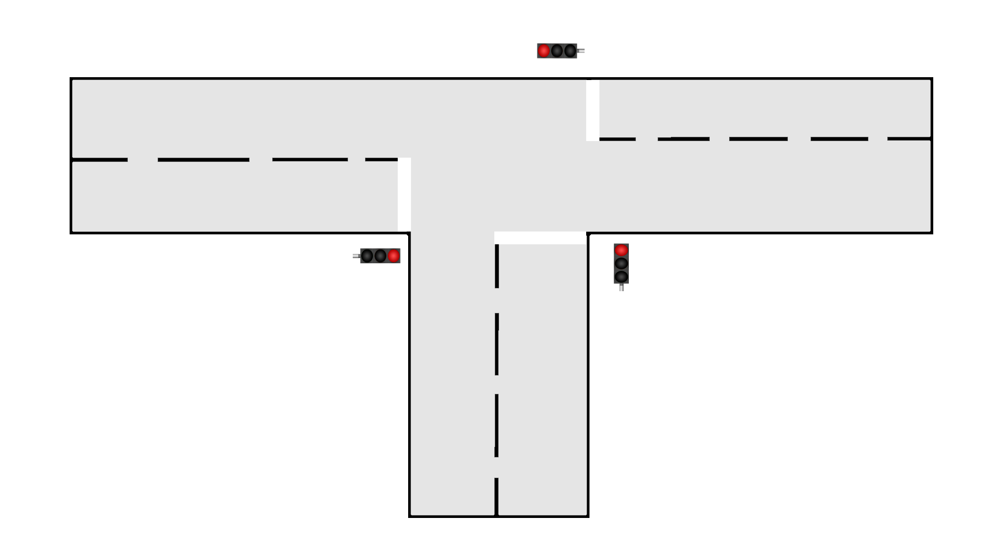
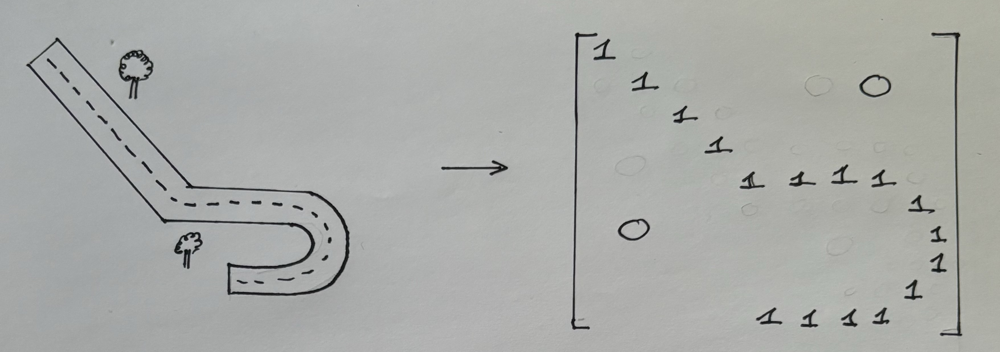
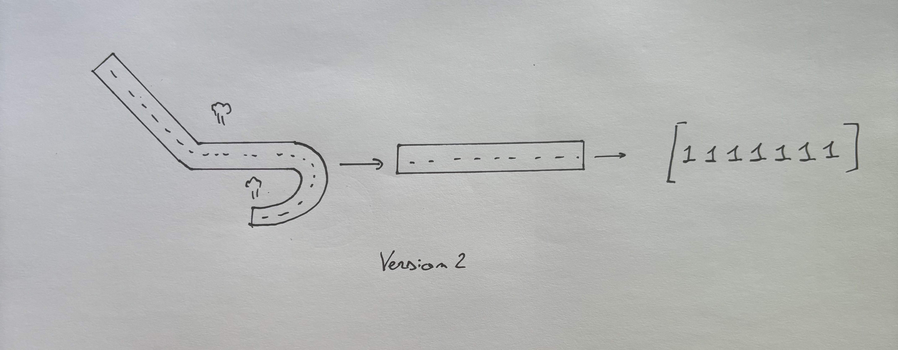
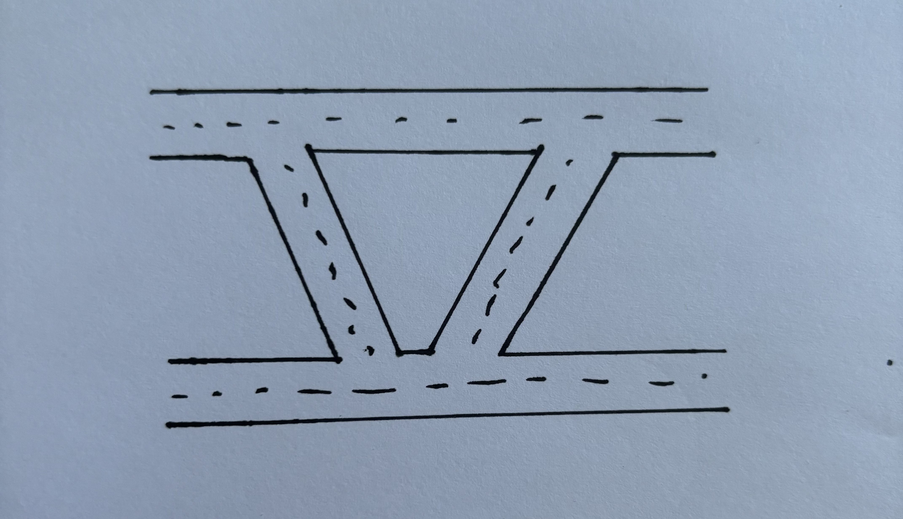
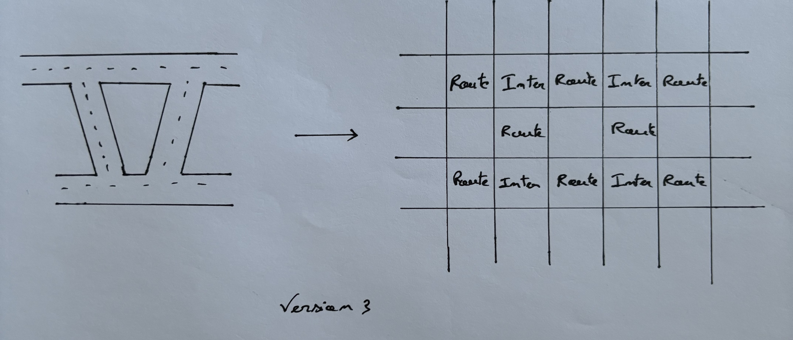
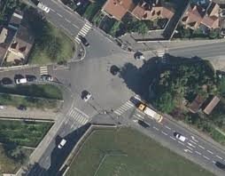
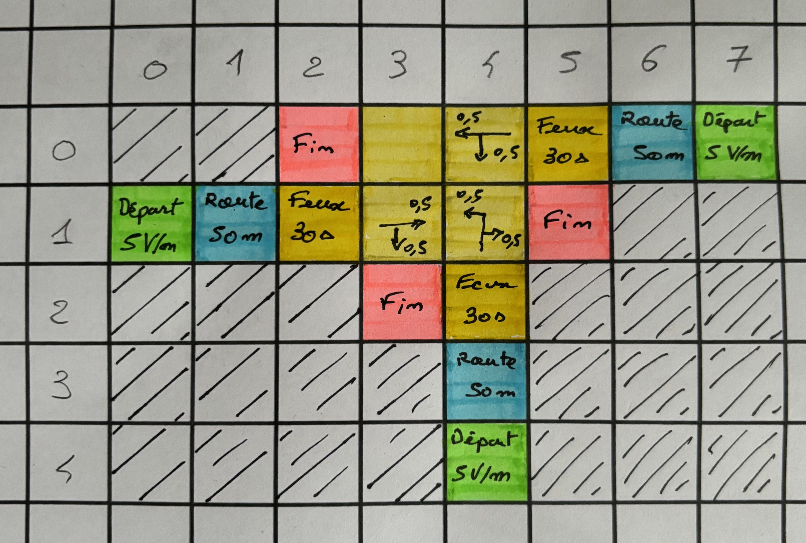

## To-Do Sprint 1

- [x] Documentation
- [x] Définir un cas d'étude
- [x] Définir quels sont les élements constitutifs d'une route
- [x] Définir comment on modélisera notre route
- [x] Traduire notre cas d'étude en code
- [x] Détailler le résumer pour que tout le monde comprennent la réflexion

## To-Do Sprint 2

- [ ] Définir les régles du traffic
- [ ] Coder la simulation
- [ ] Coder les priorités
- [ ] Coder les mouvement
- [ ] Coder les feux rouges
- [ ] Coder les départ
- [ ] Coder les fin
- [ ] Coder les directions avec les probas
- [ ] Coder les chemins intersection
- [ ] Debuger
  
## Objectif final : Modéliser et visualiser le traffic sur un cas donné

<div style="text-align: center;">
    
    <br>
    <u> Image 1 : Cas d'étude</u>
</div>
<br>

## Partie 0 : Introduction et plan d'action

Dans un monde en pleine croissance, les gestionnaires des infrastructures routières ont du mal à suivre l'évolution du nombre d'usagers, causant ainsi des embouteillages plus longs et plus fréquents.

Ces bouchons sont à l'origine de nombreux problèmes pour les individus de notre société moderne : stress, pollution sonore, fatigue, etc. Mais constituent surtout une énorme perte de temps et donc d'argent ; on estime la perte à 5,9 M€ par an (https://www.leparisien.fr/societe-transport-les-embouteillages-coutent-6-milliards-d-euros-par-an-a-l-economie-17-12-2013-3417529.php).

Il est donc essentiel de maîtriser ces phénomènes afin de mieux les contrôler et de mettre en place des actions pour minimiser leur apparition.

De ce constat, les mathématiciens s'essayent à la modélisation du trafic routier depuis plus de 100 ans et proposent régulièrement des relations se rapprochant le plus possible de la réalité. Cependant, la multitude de paramètres rend l'évolution du trafic presque imprévisible.

Par conséquent, l'ordinateur se révèle être le seul capable de modéliser le trafic routier.

## Partie 1 : Modélisation de la route

Afin d'assurer le bon fonctionnement de notre simulation, nous avons besoin d'une route ! Cela paraît évident, mais la manière dont nous modéliserons notre route déterminera la complexité de notre projet : plus le modèle sera simple, plus la simulation sera facile à mettre en place.
<br>

Ma première approche (naïve) a été de prendre une route quelconque et de la reproduire dans une matrice où chaque élément serait un rectangle de largeur la route et de longueur arbitraire que l'on aurait pu choisir pour affiner le modèle. Les éléments possibles seraient : les 2 pour une voiture, les 1 pour une route, et les 0 pour les cases vides.

<div style="text-align: center;">
    
    <br>
    <u> Image 2 : Première version de la modélisation de la route</u>
</div>
<br>

Certes, cette approche permet de retranscrire au mieux notre route étudiée, mais elle rend la manipulation de notre modèle complexe. Notamment dans les virages et routes inclinées où le sens de circulation serait difficile à identifier.
<br>

Ainsi, pour que cette solution fonctionne, il faudrait que toutes les routes soient droites ! Même si cela paraît surprenant, ce n'est pas en soi une mauvaise idée. En effet, notre objectif principal est de faire une simulation du trafic routier, mais a-t-on besoin pour cela de reproduire la route à l'identique ? La réponse à cette question est non, et une approche plus simple serait de transformer toutes les routes courbées et virages en lignes droites de même dimension. Cela n'influencerait pas les résultats mais simplifierait nettement la modélisation. En suivant ce raisonnement, j'ai imaginé un modèle où tous les virages seraient dépliés pour devenir des lignes droites :

<div style="text-align: center;">
    
    <br>
    <u> Image 3 : Seconde version de la modélisation de la route</u>
</div>
<br>

Cette approche apporte de nombreux avantages dans la modélisation de notre route :  

- Simple à mettre en place  
- Sens de circulation facilement devinable  
- Manipulation simple par un programme tiers  
  
Cependant, mettre en place cette modélisation revient à s'assurer que toutes les routes peuvent être "dépliées" pour devenir une ligne droite, ce qui n'est pas le cas en général.  

<div style="text-align: center;">
    
    <br>
    <u> Image 4 : Contre exemple</u>
</div>
<br>

Pour contourner ce problème, j'ai eu l'idée de découper la route par blocs. Chaque bloc correspondrait à un élément de la route : une intersection, une route, un feu rouge, une priorité, un passage piéton, etc...

<div style="text-align: center;">
    
    <br>
    <u> Image 5 : Troisième version de la modélisation de la route</u>
</div>
<br>

L'avantage de ce modèle est qu'il reprend tous les avantages de la méthode précédente et résout le problème des routes non orthogonalisables.

*Limites:*

Ce modéle à ces limites car un bloc n'a que 4 cotés ce qui sous-entend dans notre cas qu'il n'existe pas d'intersection à plus de 4 voies ce qui n'est pas le cas. 

<div style="text-align: center;">
    
    <br>
    <u> Image 6 : Intersection à 5 voies </u>
    <br>
    [Source: https://blog.northgate.fr/category/dans-le-coin/region-parisienne/]
</div>
<br>

Ce qui est sûr, c'est que ce genre d'intersections est rare, alors nous choisirons cette approche pour modéliser notre route dans tout le reste de notre projet.

### Structure du modéle

Comme décrit précédemment, notre modèle sera un assemblage de blocs que l'on représentera dans une matrice. Chaque élément de la matrice sera donc un élément de la route et devra respecter la syntaxe suivante :

```
Element = ["Type" = str, sens de circulation = {0,1,2,3}, Caractéristique du type = int]  
```

<div style="text-align: center;">
    
    <br>
    <u> Image 7 : Explication sens de circulation </u>
</div>
<br>

Ainsi, si un usager veut aller vers le 0 alors le sens de ciculation sera 0.

Détail pour chaque élements :

```
Route = ['Route', sens de circulation, longeur]
Intersection = ['Intersection']
Feux rouges = ['Feu', sens de circulation, cycles en secondes, Vert/Rouge]
Priorité = ['Priorite']
Passage piéton = ['Passage', sens de circulation, débit H/m]
Début = ['Debut', sens de circulation, débit V/m]
Fin = ['Fin']
```

Cependant, ces éléments ne permettent pas de représenter ni de traiter l'évolution du trafic. C'est pourquoi il faut joindre à cette matrice une matrice 'traffic' permettant de modéliser l'évolution du trafic en temps réel.

Pour chaque élément, on associera une liste qui représentera le trafic de la manière suivante :

```
Traffic_élément = [0,0,0,0,0,0,0,0,0,0,0,1,0,0,0,0,0,0,0,0,0,0,1,0,0,0,0,0,0,0,1]
```

Les 0 sont des espaces vides et les 1 des emplacements occupés. 

La taille des listes est définie de la manière suivante : 

```
Si route alors:
    taille = longeur_route/4,36  
Sinon:
    taille = 1
```

*Note : 
4,36 m = longeur moyenne des voitures [Source : https://journalauto.com/constructeurs/la-taille-et-le-poids-des-voitures-ont-explose-en-vingt-ans]*

Enfin, il faut prendre en compte les intentions des utilisateurs : plutôt à gauche, à droite ou tout droit ?

Pour cela, on créera une matrice 'direction' qui, pour chaque élément, indiquera la probabilité d'aller dans chaque direction {0, 1, 2, 3}, ainsi que la direction choisie.

```
Direction_élément = [Proba = [0,0,0,0], Direction = 0]
```

En appliquant ces régles on obtient le découpage suivant :

<div style="text-align: center;">
    
    <br>
    <u> Image 8 : Découpage de notre cas d'étude </u>
</div>
<br>

Et en code on obtient : 

```python
# Cas 1 : feux rouges

Route_02 = ["Fin"]
Route_03 = ["Intersection"]
Route_04 = ["Intersection"]
Route_05 = ['Feu', 0, 30, True]
Route_06 = ["Route", 0]
Route_07 = ["Depart", 0, 5]
Route_10 = ["Depart", 2, 5]
Route_11 = ["Route", 2]
Route_12 = ['Feu', 2, 30, True]
Route_13 = ["Intersection"]
Route_14 = ["Intersection"]
Route_15 = ["Fin"]
Route_23 = ["Fin"]
Route_24 = ["Feu", 3, 30, False]
Route_34 = ["Route", 3]
Route_44 = ["Depart", 3, 5]

Traffic_02 = [0]
Traffic_03 = [0]
Traffic_04 = [0]
Traffic_05 = [0]
Traffic_06 = [0, 0, 0, 0, 0, 0, 0, 0, 0, 0, 0, 0, 0, 0, 0, 0, 0, 0, 0, 0, 0, 0, 0]
Traffic_07 = [0]
Traffic_10 = [0]
Traffic_11 = [0, 0, 0, 0, 0, 0, 0, 0, 0, 0, 0, 0, 0, 0, 0, 0, 0, 0, 0, 0, 0, 0, 0]
Traffic_12 = [0]
Traffic_13 = [0]
Traffic_14 = [0]
Traffic_15 = [0]
Traffic_23 = [0]
Traffic_24 = [0]
Traffic_34 = [0, 0, 0, 0, 0, 0, 0, 0, 0, 0, 0, 0, 0, 0, 0, 0, 0, 0, 0, 0, 0, 0, 0]
Traffic_44 = [0]

Direction_02 = []
Direction_03 = []
Direction_04 = []
Direction_05 = [[0.5, 0.5, 0, 0], 0]
Direction_06 = [[1, 0, 0, 0], 0]
Direction_07 = [[1, 0, 0, 0], 0]
Direction_10 = [[0, 0, 1, 0], 0]
Direction_11 = [[0, 0, 1, 0], 0]
Direction_12 = [[0, 0.5, 0.5, 0], 0]
Direction_13 = []
Direction_14 = []
Direction_15 = []
Direction_23 = []
Direction_24 = [[0.5, 0, 0, 0.5], 0]
Direction_34 = [[0, 0, 0, 1], 0]
Direction_44 = [[0, 0, 0, 1], 0]

Route_etude = [
    [0, 0, Route_02, Route_03, Route_04, Route_05, Route_06, Route_07],
    [Route_10, Route_11, Route_12, Route_13, Route_14, Route_15, 0, 0],
    [0, 0, 0, Route_23, Route_24, 0, 0, 0],
    [0, 0, 0, 0, Route_34, 0, 0, 0],
    [0, 0, 0, 0, Route_44, 0, 0, 0],
]

Traffic_etude = [
    [0, 0, Traffic_02, Traffic_03, Traffic_04, Traffic_05, Traffic_06, Traffic_07],
    [Traffic_10, Traffic_11, Traffic_12, Traffic_13, Traffic_14, Traffic_15, 0, 0],
    [0, 0, 0, Traffic_23, Traffic_24, 0, 0, 0],
    [0, 0, 0, 0, Traffic_34, 0, 0, 0],
    [0, 0, 0, 0, Traffic_44, 0, 0, 0],
]

Direction_etude = [
    [0, 0, Direction_02, Direction_03, Direction_04, Direction_05, Direction_06, Direction_07],
    [Direction_10, Direction_11, Direction_12, Direction_13, Direction_14, Direction_15, 0, 0],
    [0, 0, 0, Direction_23, Direction_24, 0, 0, 0],
    [0, 0, 0, 0, Direction_34, 0, 0, 0],
    [0, 0, 0, 0, Direction_44, 0, 0, 0],
]

temps = 0
```