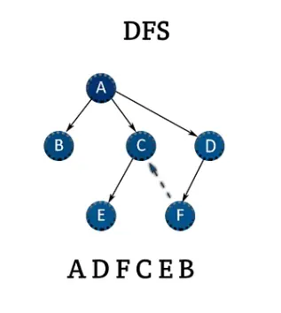
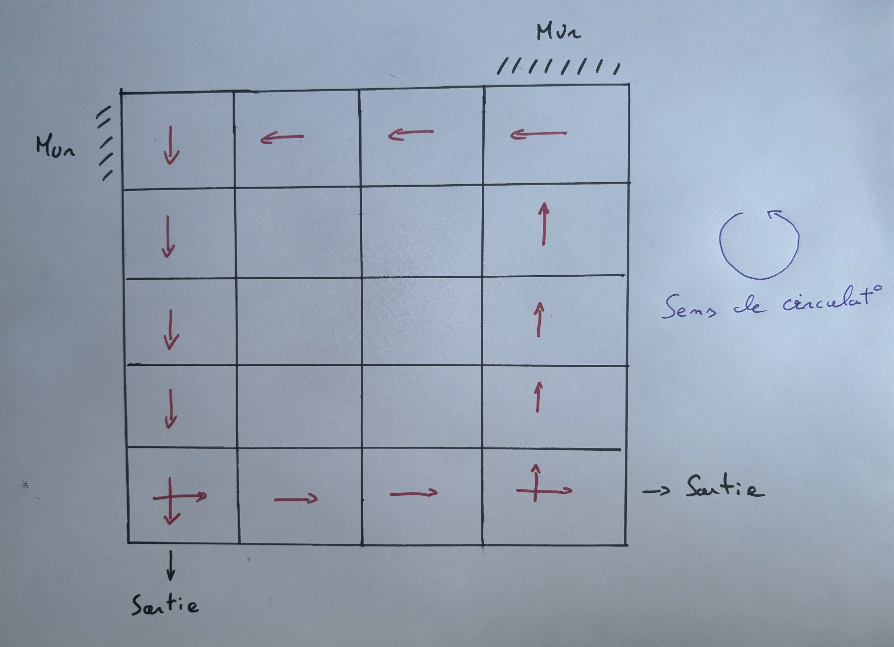
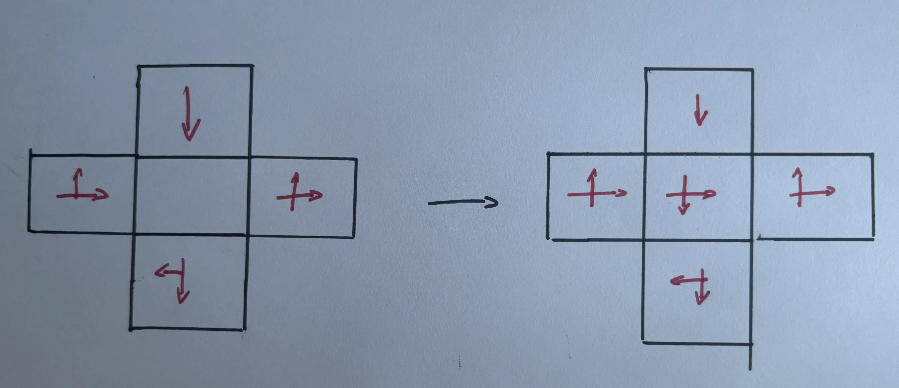
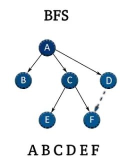
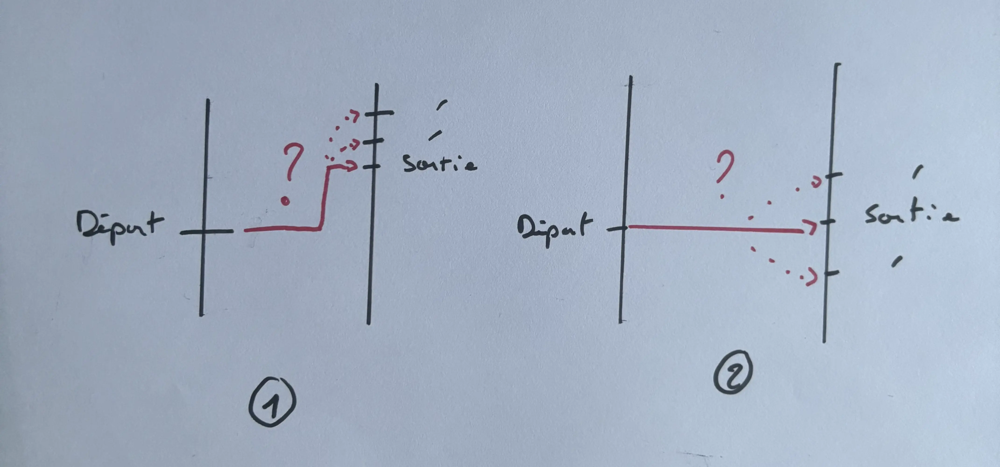
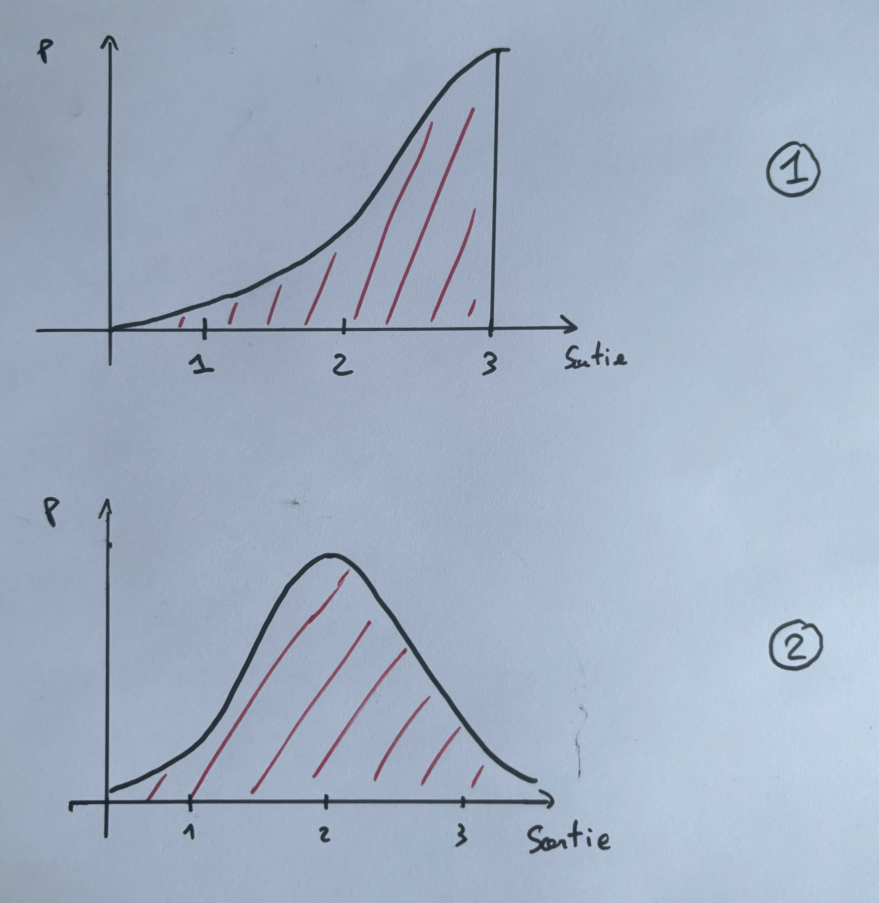
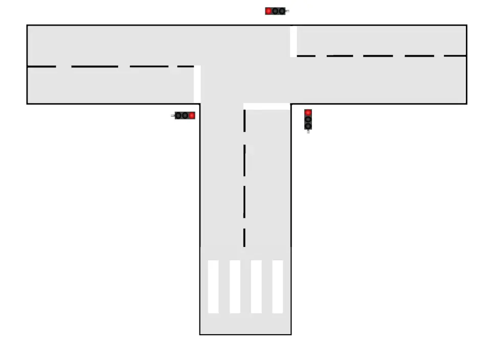



- [GitHub du projet](https://github.com/Mathisadi/CTZ)



## Project Management



- [x] Identifier les parties de code à améliorer
- [x] Trouver les directions possibles dans une intersection
- [x] Trouver le chemin emprunté par une voiture dans une intersection
- [ ] Commenter le code
- [x] Débogage
- [ ] Implementer les passages piétons
- [ ] Gérér les voies coupées lors d'une sortie de priorité 
- [ ] Tests
  




- [x] Commenter et reformat le code
- [x] Implementer les passages piétons
- [x] Gérér les voies coupées lors d'une sortie de priorité
- [x] Tests
  




| Date           | Heures passées | Indications                                    |
| -------------- | -------------- | ---------------------------------------------- |
| Vendredi 8/11  | 1H             | Identification des améliorations a effectuées  |
| Dimanche 10/11 | 2H             | Init_variable.py                               |
| Lundi 11/11    | 1H30           | Trouve chemin le plus court et moins de virage |
| Mercredi 13/11 | 3H             | Trouve la sortie                               |
| Jeudi 14/11    | 2H             | Débogage                                       |
| Dimanche 15/09 | 1H             | Rédaction POK                                  |
|                |                |                                                |
| Total          | 10H30          |                                                |

Sur ce sprint, j'ai sous-estimé la charge de travail à fournir pour atteindre l'ensemble de mes objectifs. Il est préférable que je me concentre sur l'accomplissement ces objectifs sur le second sprint et faire l'interface graphique pendant le POK 3. En revanche je m'en sorti mieux sorti avec l'étape débogage car effectué des tests tout au long de mon travail.





| Date          | Heures passées | Indications        |
| ------------- | -------------- | ------------------ |
| Dimanche 1/12 | 3H             | Reformat code      |
| Lundi 2/12    | 1H             | Fin reformat code  |
| Vendredi 6/12 | 3h             | Passage piéton     |
| Samedi 7/12   | 2H             | Fin passage piéton |
| Mardi 17/12   | 30min          | Feux rouges        |
| Mardi 17/12   | 30min          | Rédaction POK      |
|               |                |                    |
| Total         | 10H            |                    |

Bonne gestion des objectifs j'ai pût finaliser ce que je n'avais pas eu le temps de faire au sprint 1. On peut passer à la dernière étape interface graphique.



## ✅ Obejectifs du POK

L'objectif de ce POK est d'améliorer la simulation du traffic routier réalisée lors du [POK 1](../temps-1) qui n'est adpatée qu'à un seul type de situation, afin que mon programme puisse traiter tous les cas possibles. Pour cela, j'ai d'abord identifié l'ensemble des actions qui ne sont pas effectuées automatiquement :

1) Dans les intersections, trouver le chemin en fonction du point de départ et d'arrivée.
2) Ajouter les passages piétons.
3) Pour les sorties de priorité, identifier les routes coupées.

Voilà les 3 tâches que je vais traiter dans ce POK.

## 🔧 Partie 1 : Paramétrage automatique des intersections

Afin de pouvoir trouver mon chemin dans une intersection, il me fallait, dans un premier temps, déterminer pour chaque case de l'intersection quelles directions sont possibles. Cela se fait en trois étapes :

1) Je dois identifier sur ma grille de route les intersections et les numéroter afin de pouvoir les distinguer. Pour cela, j'ai utilisé une fonction dite de depth-first search (DFS), qui parcourt l'ensemble de ma route, trouve un élément intersection, puis explore toutes les intersections adjacentes pour leur attribuer un numéro [1]. Ainsi, les intersections adjacentes peuvent être regroupées en un même groupe, ce qui sera utile pour la suite.

    
    <u> Image 1 : Fonctionnement algo DFS [Source](https://medium.com/@jwbtmf/dfs-vs-bfs-algorithms-for-graph-database-5948f0fd2057)</u>

 

1) Une fois les intersections regroupées entre elles, on parcourt les bords des intersections dans le sens antihoraire. Si ce sens peut être suivi, on l'ajoute à la direction. Mais pourquoi faire cela ? L'objectif est de définir le sens de circulation dans une intersection ou un rond-point, en partant du principe qu'il est toujours possible de longer les bords d'une intersection. 

Petit schéma explicatif :

    
    <u> Image 2 : Schéma explicatif initialisation sens de circulation</u>

 

1) Enfin, pour chaque case de notre intersection, on examine les cases adjacentes. Si une direction pointe vers nous, on l'ajoute aux directions possibles. Cette opération est répétée tant que de nouvelles directions apparaissent.

Petit schéma explicatif :
   

    
    <u> Image 3 : Schéma explicatif construction des directions possibles</u>

 

En suivant ce processus, on arrive à obtenir pour chaque intersection un matrice indiquant les directions possibles, il ne reste plus qu'à insérer celle-ci dans nos variables.

## 📉 Partie 2 : Pour un départ et une arrivée donnés trouver le chemin emprunté dans une intersection

Une fois les directions possibles trouvées, il faut maintenant parvenir à trouver le chemin parcouru par les voitures dans une intersection. Pour cela, j'ai utilisé un algorithme de recherche en largeur ou breadth first search [1].

    
    <u> Image 4 : Fonctionnement algo BFS [Source](https://medium.com/@jwbtmf/dfs-vs-bfs-algorithms-for-graph-database-5948f0fd2057)</u>

 

Cet algorithme a pour objectif de trouver le chemin le plus court et qui fait le moins de virages pour aller du départ à l'arrivée, en respectant les directions possibles de chaque case. Cette partie a été intéressante car j'ai pu m'intéresser aux algorithmes de recherche, notamment à l'algorithme A-star, qui propose une alternative plus rapide en moyenne que les autres algorithmes de recherche [2].

## 💡 Partie 3 : Pour un départ donné trouver le point d'arrivée dans une intersection

Enfin, pour un départ donné et une direction souhaitée, il faut trouver le point d'arrivée. Cependant, il faut tenir compte de nombreux critères afin de respecter au mieux les réactions et choix humains. Afin de bien cerner la problématique, voici deux exemples :

    
    <u> Image 5 : Comment choisir la sortie ?</u>

 

On remarque dans les deux cas que le chemin privilégié est celui le plus court entre l'entrée et la sortie, mais rien n'empêche qu'un conducteur emprunte une autre sortie. Cela est possible, mais plus rare. Afin de tenir compte de ce phénomène, j'ai pensé qu'il est concevable de modéliser le choix de la sortie comme une distribution normale, dont la moyenne serait la position de la sortie la plus proche et un écart-type de 1. Ainsi, en reprenant les deux exemples et en numérotant les sorties du haut vers le bas, on aurait les distributions suivantes :

    
    <u> Image 6 : Distribution pour choix de la sortie</u>

 

Finalement, pour les sorties qui ne se situent pas en face de l'entrée, on peut, par un jeu de rotation, se rapporter au cas précédent. Je passe la partie codage et débogage, mais en implémentant toutes les fonctions dans le bon ordre, on a réussi notre premier objectif.

## 🚧 Partie 4 : Implementer les passages piétons

Il faut pas seulement prendre en compte les voitures, en effet la route est un lieu de partage entre les automobilistes et les piétons.

Mon objectif est donc d'implementer un nouvau bloc : le passage piéton. 

Pour cela j'ai fais plusieurs hypothèses:

- Une voiture ne peut pas avancer si il y a un piéton en face de lui = non prise en compte de la courtoisie
- Un piéton met 4 sec à traverser une voie (calcul : largeur moy 6m / vitesse moy 5 km/h)

Pour mettre en place cette nouvelle fonction, j'ai reformat le code pour une meilleure clarté et ajouté des docstings.

J'ai également crée la nouvelle route pour le test, repris les règles de priorités et définit le mouvement d'un piéton. 

    
    <u> Image 7 : Nouveau cas d'étude</u>

 

## 🚦 Partie 5 : Cycles des feux variables

Actuellement il est possible uniquement de définir un cycle fixe pour les feux rouges, ex : si 30 sec rouge alors 30 sec vert. 

L'objectif est de pouvoir définir des cycles plus souples, par exemple il serait intéressant de pouvoir avoir un feu 30 sec rouge et 10 sec vert.

Pour cela j'ai légèrement modifié les structures des code update et des variables.

Finalement voici la simulation finale :

<video controls src="Simu_V2.mp4"></video>



**[1] -** [Mais c'est quoi un algo de parcours !?](https://www.jesuisundev.com/comprendre-les-algorithmes-de-parcours-en-8-minutes/)  
**[2] -** [Explication A-star](https://www.geeksforgeeks.org/a-search-algorithm/)


