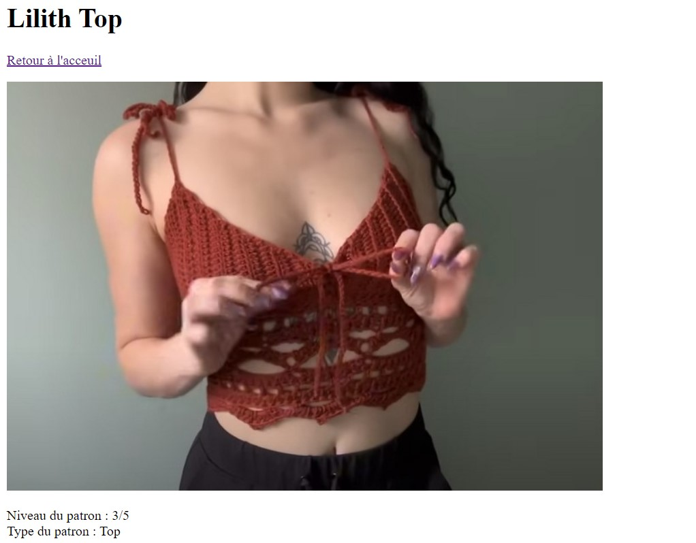
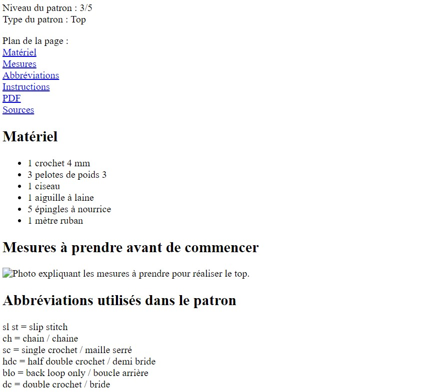
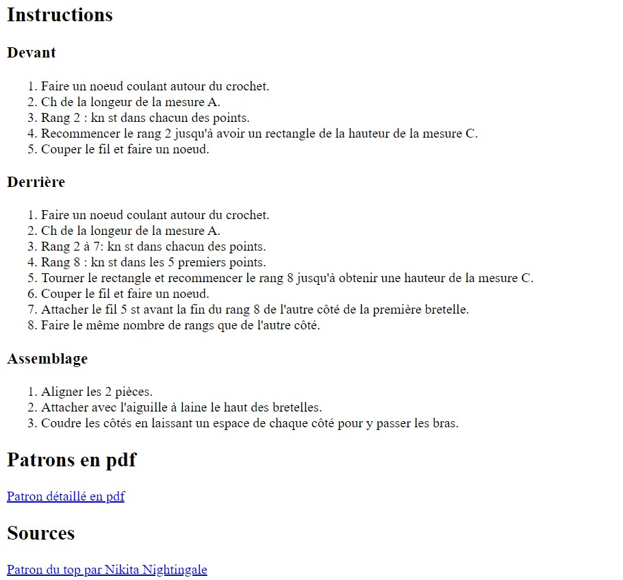

Dans l'objectif de mieux comprendre les enjeux du dev, je vais me former en front end. Dans ce but, je vais dev un site web dont l'objectif sera de regrouper des patrons en crochet.

## Pré-requis : 



Pré-requis :

- Bases en css et en html

 

## Tâches

### Sprints

#### Sprint 1

L'objectif du premier sprint est de sortir une première version épurée du site. L'ajout de fonctionnalités se fera dans un second temps. Pour cela, j'ai prévu de compléter les tâches suivantes :

- [x] Définition de la structure du site
- [x] Remise à jour de mes connaissances en html et css
- [x] Développement de la base du site

Pendant ce sprint, j'ai globalement eu le temps de remplir la plupart de mes objectifs. Je suis cependant un peu en retard sur le développement de la base du site. Par cela, j'entendais code html complet et début du css, il me reste encore un peu de travail sur le html pour avoir un contenu du site cohérent et je n'ai pas eu le temps de commencer le css.

Après ce sprint, je me suis rendu compte que j'avais bien démarré sur les premiers jours avec un travail efficace. Mais que comme j'ai fait une pause pour me concentrer sur le MON, je me suis retrouvé bloqué par moi même ne sachant plus par où commencer les prochaines tâches. Et ainsi, je me suis retrouver à devoir rusher sur la fin du sprint pour compléter le travail. Pour le prochain sprint, je pense m'organiser mieux pour jongler entre le POK et le MON et ne pas me retrouver encore une fois à finir mon POK en retard et dans le stress.

#### Sprint 2

En perspective du premier sprint, les tâches que je prévois de remplir pour le prochain sprint sont les suivantes : 
- [ ] Finaliser le contenu du site
- [ ] Ecrire le code css des pages
- [ ] Ajouter de nouvelles fonctionalités comme une fiche contact et une barre de recherche

### Horodatage

Toutes les séances et le nombre d'heure que l'on y a passé.

| Date | Heures passées | Indications |
| -------- | -------- |-------- |
| 6/09 | 2h | Apprentissage de l'html et première base du code |
| 7/09 | 1h30 | Code html de toute la structure du site |
| 9/09 | 1h15 | Approfondissement des connaissances en html |
| 9/09 | 2h30 | Apprentissage du css |
| 17/09 | 2h45 | Enrichissement du contenu du site |

## Contenu

### Premier Sprint

Le premier sprint a été dédiée à la conception du site.

J'ai d'abord revu mes bases en html et css grâce aux POK de Louise Bourdon et Vladimir Jeantroux ainsi que le cours d'[OpenClassroom](https://openclassrooms.com/fr/courses/1603881-creez-votre-site-web-avec-html5-et-css3).

Ensuite, j'ai défini ce que je voulais comme base du site : une page d'acceuil emmenant sur les différents patrons existants dans le site et des fiches patrons. Dans les fiches patrons, elles doivent être simple mais contenir les mesures à prendre, une photo du résultat, le matériel nécessaire, la source et les instructions afin de réaliser le patron.

J'ai ensuite consacré le reste de mon sprint 1 à crée la structure de ces pages : 

#### Page d'acceuil

Le design de la page d'acceuil est assez sommaire pour l'instant. Il s'agit d'une page rappelant le nom du site et montrant les différents patrons disponibles. 

Pour cela, j'ai codé avec html un code assez simple avec en titre de la page le nom du site ainsi qu'un petit paragraphe de bienvenu et un lien pour apprendre les bases du crochet : 

```
<h1>Capitaine crochet</h1>
    <p>Bienvenue sur le site du Capitaine crochet! Ici vous pourrez suivre de superbes patrons pour réaliser vos propres oeuvres en crochet.</p>

    <p>Si vous avez besoin de revoir les bases du crochet ou les aborder pour la première fois, munissez vous de votre meilleur crochet, d'un peu de coton et visionnez la série de <a href = "https://www.youtube.com/watch?v=oJtFRE6V0I8&t=600s" target = "_blank">4 vidéos réalisées par Retropically.</a></p>
```

J'ai continué en ajoutant une image et le lien de chaque page de patron que j'ai pu crée : 
```
<p>
        
    </p>
    <a href = "patron3.html">Lilith Top</a>
```

Voici donc le résultat de la page pour le moment : 


#### Page patron typique

La page patron à une structure typique à chaque fois : 
- Titre du patron
```
<h1>Lilith Top</h1>
```
- Bouton de retour vers la page d'acceuil
```
<a href = "Acceuil.html">Retour à l'acceuil</a>
```
- Image du résultat attendu
```
    <p>
        
    </p>
```
- Quelques informations de type niveau, type de projet,...
```
    <p>
        Niveau du patron : 3/5 <br>
        Type du patron : Top
    </p>
```
- Le sommaire de la page
```
    <p>
        Plan de la page :<br>
            <a href="#matériel>">Matériel</a><br>
            <a href="#mesures">Mesures</a><br>
    </p>
```
- Le matériel nécessaire
```
    <h2 id = "matériel">Matériel</h2>
    <ul>
        <li>1 crochet 4 mm</li>
        <li>3 pelotes de poids 3</li>
        <li>1 ciseau</li>
    </ul>
```
- Les mesures à prendre sous forme d'image
```
<h2 id = "mesures">Mesures à prendre avant de commencer</h2>
    
```
- Les abréviations utilisées dans le patron
```
 <h2 id = "abbréviations">Abbréviations utilisés dans le patron</h2>
    <p>
        sl st = slip stitch<br>
        ch = chain / chaine<br>
    </p>
```
- Les instructions du patron
```
<h2 id = "instructions">Instructions</h2>
        <h3>Bas du Top</h3>
            <ol>
                <li>Faire un noeud coulant autour du crochet.</li>
                <li>Ch 3, yarn over, insérrer le crochet dans la première chaîne, ch 1, yarn over, tirer à travers une boucle,yarn over, tirer à travers 2 boucles, yarn over, tirer à travers 2 boucles </li>
            </ol>
```
- La fiche pdf du patron si elle existe
```
    <h2 id = "pdf">Patrons en pdf</h2>
        <a href = "patron3.pdf">Patron détaillé en pdf</a>
```
- La source
```
<h2 id = "sources">Sources</h2>
    <a href = "https://www.youtube.com/watch?v=sjY9wFO0sU8" target = "_blank">Patron du Lilith Top par Made by BJax</a>
```

Le résultat final du sprint donne quelque chose comme ça : 




Pour l'instant le visuel n'est pas incroyable mais cela devrait s'arranger avec le sprint 2 et l'ajout du code css.

### Second Sprint
