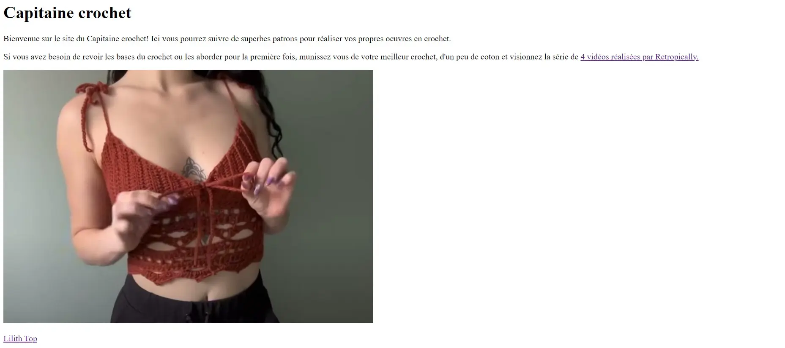
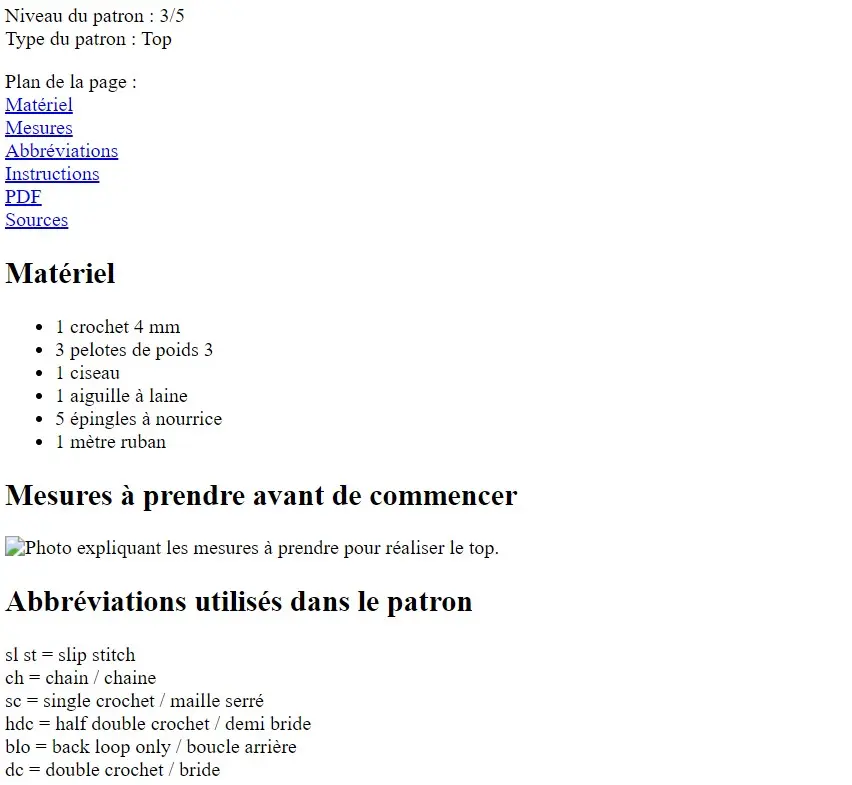
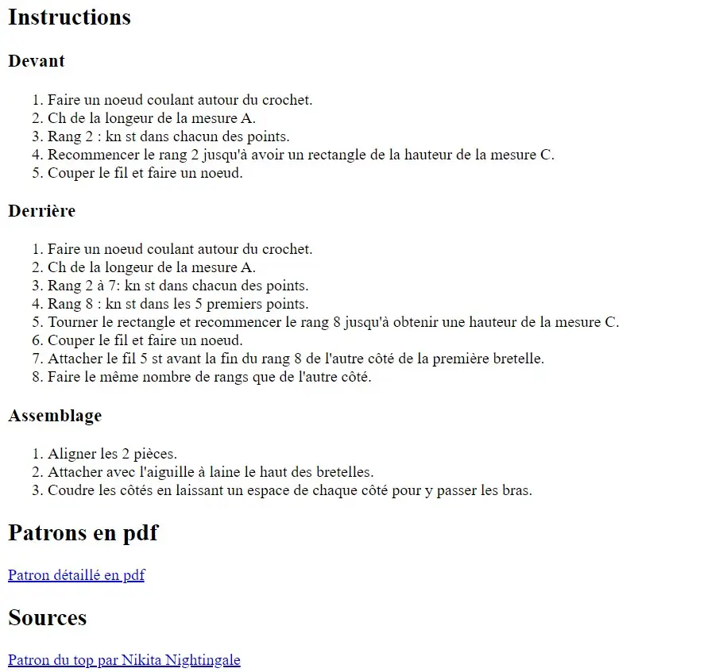
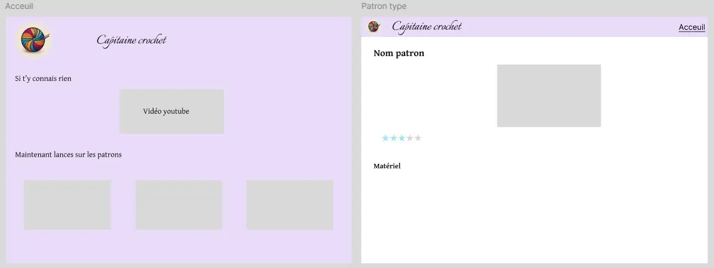
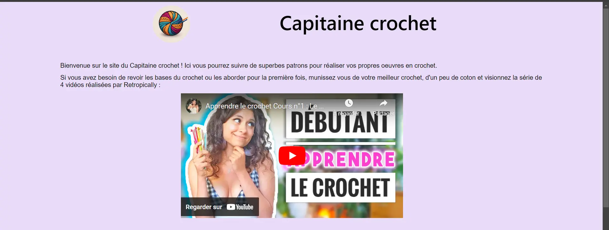
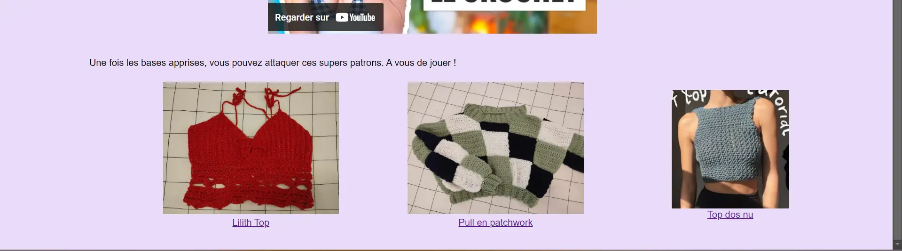
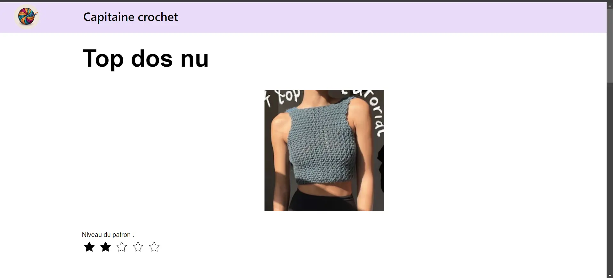
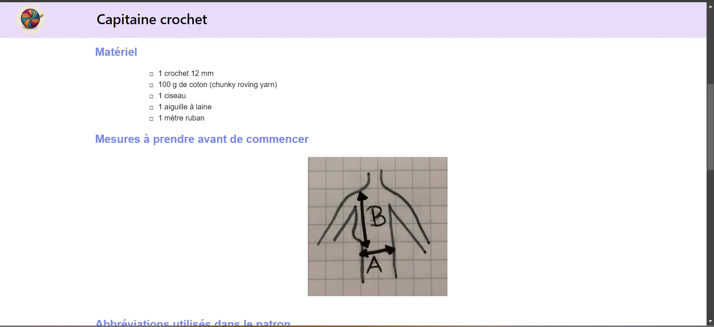
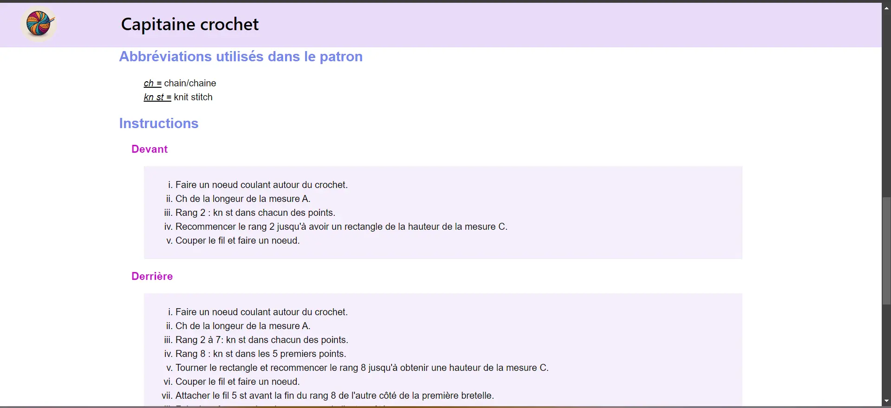
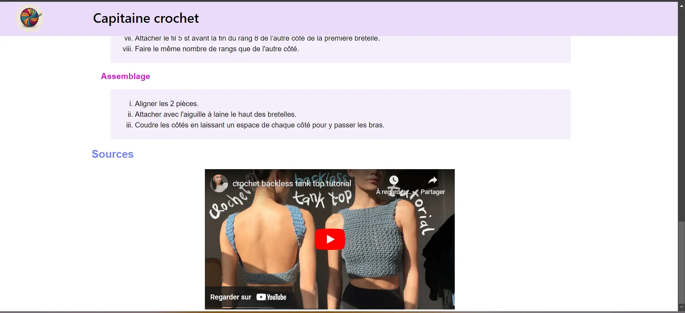

Dans l'objectif de mieux comprendre les enjeux du dev, je vais me former en front end. Dans ce but, je vais dev un site web dont l'objectif sera de regrouper des patrons en crochet.

## Pré-requis : 



Pré-requis :

- Bases en css et en html

 

## Tâches

### Sprints

#### Sprint 1

L'objectif du premier sprint est de sortir une première version épurée du site. L'ajout de fonctionnalités se fera dans un second temps. Pour cela, j'ai prévu de compléter les tâches suivantes :

- [x] Définition de la structure du site
- [x] Remise à jour de mes connaissances en html et css
- [x] Développement de la base du site

Pendant ce sprint, j'ai globalement eu le temps de remplir la plupart de mes objectifs. Je suis cependant un peu en retard sur le développement de la base du site. Par cela, j'entendais code html complet et début du css, il me reste encore un peu de travail sur le html pour avoir un contenu du site cohérent et je n'ai pas eu le temps de commencer le css.

Après ce sprint, je me suis rendu compte que j'avais bien démarré sur les premiers jours avec un travail efficace. Mais que comme j'ai fait une pause pour me concentrer sur le MON, je me suis retrouvé bloqué par moi même ne sachant plus par où commencer les prochaines tâches. Et ainsi, je me suis retrouver à devoir rusher sur la fin du sprint pour compléter le travail. Pour le prochain sprint, je pense m'organiser mieux pour jongler entre le POK et le MON et ne pas me retrouver encore une fois à finir mon POK en retard et dans le stress.

#### Sprint 2

En perspective du premier sprint, les tâches que je prévois de remplir pour le prochain sprint sont les suivantes : 
- [x] Finaliser le contenu du site
- [x] Ecrire le code css des pages
- [ ] Ajouter de nouvelles fonctionalités comme une fiche contact et une barre de recherche

Je n'ai pas eu le temps d'accomplir toutes les tâches prévues lors de ce sprint. La raison est très simple, j'ai sous-estimé la difficulté du css et d'obtenir un rendu propre. En effet, lors du rendu précédent, je pensais avoir toutes les bases pour faire rapidement quelque chose de propre. Au final, certains éléments m'ont pris pas mal de temps à comprendre comment les disposer correctement.

### Horodatage

Toutes les séances et le nombre d'heure que l'on y a passé.

| Date | Heures passées | Indications |
| -------- | -------- |-------- |
| 6/09 | 2h | Apprentissage de l'html et première base du code |
| 7/09 | 1h30 | Code html de toute la structure du site |
| 9/09 | 1h15 | Approfondissement des connaissances en html |
| 9/09 | 2h30 | Apprentissage du css |
| 17/09 | 2h45 | Enrichissement du contenu du site |
| 09/10 | 1h30 | Maquette du site et revu du html |
| 10/10 | 2h | Code css du header |
| 11/10 | 3h | Css de la page d'accueil |
| 12/10 | 3h30 | Css des pages patrons |

## Contenu

### Premier Sprint

Le premier sprint a été dédiée à la conception du site.

J'ai d'abord revu mes bases en html et css grâce aux POK de Louise Bourdon et Vladimir Jeantroux ainsi que le cours d'[OpenClassroom](https://openclassrooms.com/fr/courses/1603881-creez-votre-site-web-avec-html5-et-css3).

Ensuite, j'ai défini ce que je voulais comme base du site : une page d'acceuil emmenant sur les différents patrons existants dans le site et des fiches patrons. Dans les fiches patrons, elles doivent être simple mais contenir les mesures à prendre, une photo du résultat, le matériel nécessaire, la source et les instructions afin de réaliser le patron.

J'ai ensuite consacré le reste de mon sprint 1 à crée la structure de ces pages : 

#### Page d'acceuil

Le design de la page d'acceuil est assez sommaire pour l'instant. Il s'agit d'une page rappelant le nom du site et montrant les différents patrons disponibles. 

Pour cela, j'ai codé avec html un code assez simple avec en titre de la page le nom du site ainsi qu'un petit paragraphe de bienvenu et un lien pour apprendre les bases du crochet : 

```
<h1>Capitaine crochet</h1>
    <p>Bienvenue sur le site du Capitaine crochet! Ici vous pourrez suivre de superbes patrons pour réaliser vos propres oeuvres en crochet.</p>

    <p>Si vous avez besoin de revoir les bases du crochet ou les aborder pour la première fois, munissez vous de votre meilleur crochet, d'un peu de coton et visionnez la série de <a href = "https://www.youtube.com/watch?v=oJtFRE6V0I8&t=600s" target = "_blank">4 vidéos réalisées par Retropically.</a></p>
```

J'ai continué en ajoutant une image et le lien de chaque page de patron que j'ai pu crée : 
```
<p>
        
    </p>
    <a href = "patron3.html">Lilith Top</a>
```

Voici donc le résultat de la page pour le moment : 


#### Page patron typique

La page patron à une structure typique à chaque fois : 
- Titre du patron
```
<h1>Lilith Top</h1>
```
- Bouton de retour vers la page d'acceuil
```
<a href = "Acceuil.html">Retour à l'acceuil</a>
```
- Image du résultat attendu
```
    <p>
        
    </p>
```
- Quelques informations de type niveau, type de projet,...
```
    <p>
        Niveau du patron : 3/5 <br>
        Type du patron : Top
    </p>
```
- Le sommaire de la page
```
    <p>
        Plan de la page :<br>
            <a href="#matériel>">Matériel</a><br>
            <a href="#mesures">Mesures</a><br>
    </p>
```
- Le matériel nécessaire
```
    <h2 id = "matériel">Matériel</h2>
    <ul>
        <li>1 crochet 4 mm</li>
        <li>3 pelotes de poids 3</li>
        <li>1 ciseau</li>
    </ul>
```
- Les mesures à prendre sous forme d'image
```
<h2 id = "mesures">Mesures à prendre avant de commencer</h2>
    
```
- Les abréviations utilisées dans le patron
```
 <h2 id = "abbréviations">Abbréviations utilisés dans le patron</h2>
    <p>
        sl st = slip stitch<br>
        ch = chain / chaine<br>
    </p>
```
- Les instructions du patron
```
<h2 id = "instructions">Instructions</h2>
        <h3>Bas du Top</h3>
            <ol>
                <li>Faire un noeud coulant autour du crochet.</li>
                <li>Ch 3, yarn over, insérrer le crochet dans la première chaîne, ch 1, yarn over, tirer à travers une boucle,yarn over, tirer à travers 2 boucles, yarn over, tirer à travers 2 boucles </li>
            </ol>
```
- La fiche pdf du patron si elle existe
```
    <h2 id = "pdf">Patrons en pdf</h2>
        <a href = "patron3.pdf">Patron détaillé en pdf</a>
```
- La source
```
<h2 id = "sources">Sources</h2>
    <a href = "https://www.youtube.com/watch?v=sjY9wFO0sU8" target = "_blank">Patron du Lilith Top par Made by BJax</a>
```

Le résultat final du sprint donne quelque chose comme ça : 




Pour l'instant le visuel n'est pas incroyable mais cela devrait s'arranger avec le sprint 2 et l'ajout du code css.

### Second Sprint

Pendant le second sprint, je me suis concentrée sur l'apparence de mon site web.

Pour cela, j'ai commencé par réaliser une maquette sommaire du rendu que je voulais afin de mieux cerner sur quoi travailler et dans quelle direction me tourner.



Une fois cette maquette terminée, j'ai pu me lancer dans le code, d'abord en html pour ajouter les classes de mes éléments et les balises ```<div>``` et ```<span>``` qui sont utiles pour séparer les éléments de la page et les disposer aux bons endroits.

Mon code final en html donne ceci :



```html
    <!DOCTYPE html>
    <html lang="fr">
    
    <head>
        <meta charset="utf-8">
        <title>Capitaine Crochet</title>
        <link href="Acceuil.css" rel="stylesheet">
    </head>
    
    <body>
        <header role="banner">
            <div class="header-left">
                
            </div>
            <div class="header-center">
                <h1>Capitaine crochet</h1>
            </div>
        </header>
    
        <main>
            <p>Bienvenue sur le site du Capitaine crochet ! Ici vous pourrez suivre de superbes patrons pour réaliser vos propres oeuvres en crochet.</p>
    
            <p class="Aide">Si vous avez besoin de revoir les bases du crochet ou les aborder pour la première fois, munissez vous de votre meilleur crochet, d'un peu de coton et visionnez la série de 4 vidéos réalisées par Retropically :</p>
            
            <div class="video-responsive">
                <iframe width="560" height="315" src="https://www.youtube.com/embed/oJtFRE6V0I8?si=K_iq7vbUODj8tr3Z" title="YouTube video player" frameborder="0" allow="accelerometer; autoplay; clipboard-write; encrypted-media; gyroscope; picture-in-picture; web-share" referrerpolicy="strict-origin-when-cross-origin" allowfullscreen>
                </iframe>
            </div>
            
            <p class="intro">Une fois les bases apprises, vous pouvez attaquer ces supers patrons. A vous de jouer !</p>
    
                <div class="gallerie">
                    <div class="Lilith">
                        
                        <a href = "patron3.html">Lilith Top</a>
                    </div>
                    <div class="Pull">
                        
                        <a href = "patron1.html">Pull en patchwork</a>
                    </div>
                    <div class="Top">
                        
                        <a href = "patron2.html">Top dos nu</a>
                    </div>
                    </div>
    
        </main>
    
    </body>
    
    </html>
```




```html
    <!DOCTYPE html>
    <html lang="fr">
    
    <head>
        <meta charset="utf-8">
        <title>Capitaine Crochet - Top dos nu</title>
        <link href="patron2.css" rel="stylesheet">
    </head>
    
    <body>
        <header role="banner">
            <div class="header-left">
                <a href="Acceuil.html">
                    
                </a>
            </div>
    
            <div class="header-center">
                <p>Capitaine crochet</p>
            </div>
        </header>
    
        <main>
            <h1>Top dos nu</h1>
            
            
            
            
    
            <div class="Niveau">
                <p>Niveau du patron : </p>
                
                
                
                
                
            </div>
    
            <div class="Corps">
            <h2 id = "matériel">Matériel</h2>
            <ul>
                <li><span>1 crochet 12 mm</span></li>
                <li><span>100 g de coton (chunky roving yarn)</span></li>
                <li><span>1 ciseau</span></li>
                <li><span>1 aiguille à laine</span></li>
                <li><span>1 mètre ruban</span></li>
            </ul>
    
            <h2 id = "mesures">Mesures à prendre avant de commencer</h2>
            
    
            <h2 id = "abbréviations">Abbréviations utilisés dans le patron</h2>
                <p>
                    <em>ch =</em> chain/chaine<br>
                    <em>kn st =</em> knit stitch
                </p>
    
            <h2 id = "instructions">Instructions</h2>
                <h3>Devant</h3>
                <ol>
                    <li>Faire un noeud coulant autour du crochet.</li>
                    <li>Ch de la longeur de la mesure A.</li>
                    <li>Rang 2 : kn st dans chacun des points.</li>
                    <li>Recommencer le rang 2 jusqu'à avoir un rectangle de la hauteur de la mesure C.</li>
                    <li>Couper le fil et faire un noeud.</li>
                </ol>
    
                <h3>Derrière</h3>
                <ol>
                    <li>Faire un noeud coulant autour du crochet.</li>
                    <li>Ch de la longeur de la mesure A.</li>
                    <li>Rang 2 à 7: kn st dans chacun des points.</li>
                    <li>Rang 8 : kn st dans les 5 premiers points.</li>
                    <li>Tourner le rectangle et recommencer le rang 8 jusqu'à obtenir une hauteur de la mesure C.</li>
                    <li>Couper le fil et faire un noeud.</li>
                    <li>Attacher le fil 5 st avant la fin du rang 8 de l'autre côté de la première bretelle.</li>
                    <li>Faire le même nombre de rangs que de l'autre côté.</li>
                </ol>
    
                <h3>Assemblage</h3>
                <ol>
                    <li>Aligner les 2 pièces.</li>
                    <li>Attacher avec l'aiguille à laine le haut des bretelles.</li>
                    <li>Coudre les côtés en laissant un espace de chaque côté pour y passer les bras.</li>
                </ol>
    
            <h2 id = "sources">Sources</h2>
            <div class="video-responsive">
                <iframe width="560" height="315" src="https://www.youtube.com/embed/Vv_IyfO5d4I?si=a1n5uhzUBixNq3fC" title="YouTube video player" frameborder="0" allow="accelerometer; autoplay; clipboard-write; encrypted-media; gyroscope; picture-in-picture; web-share" referrerpolicy="strict-origin-when-cross-origin" allowfullscreen></iframe>
        </div>   
    </div> 
        </main>
    
    </body>
    
    </html>
```


Quand le code html est structuré et les balises correctement placé, on peut utilisé le css afin de donner un look un peu plus sympa à la page. Pour cela, on utilise différentes propriétés comme ````position```` ou ````display```` qui nous permettent de placer les éléments les uns par rapport aux autres, des propriétés comme ````color```` qui permettent de changer la couleur et plein d'autres encore.

- Mon code final en css donne ceci :


    
```css
    /*Supprimer marges verticale et horizontale*/
    html, body, p{ 
    	margin:0; 
    	padding:0; 
        background-color: #E9DCF9;
    }
    
    /*Mise en place du header (couleur et position)*/
    header{
        background-color: #E9DCF9;/*Couleur de fond*/
        position:fixed;
        width:100%;
        top:0%;
        height: 16%;
        line-height: 350%;
    }
    
    /*Placement du logo*/
    .header-left {
        float:left;
        padding: 5px;
        margin-left: 25%;
        margin-top: 0.25%;
      }
    
    /*Placement du nom du site*/
    .header-center {
        padding: 5px;
        align-items: center;
        margin-top: -1%;
      }
    
    /*Définition police titre header*/ 
    header h1{
        font-family: system-ui, -apple-system, BlinkMacSystemFont, 'Segoe UI', Roboto, Oxygen, Ubuntu, Cantarell, 'Open Sans', 'Helvetica Neue', sans-serif;
        font-weight:500;
        text-align: left;
        font-size: 50px;
        margin-left: -15%;
    }
    
    /*Taille du logo*/
    #logo{
        width: 30%;
        height: auto;
    }
    
    /*Définition police page*/ 
    body{
        font-family: Arial, Helvetica, sans-serif;
        font-size: 16px;
    }
    
    /*Placement du corps de la page*/
    main{
        background-color: #E9DCF9;
        margin-left: 10%;
        margin-right: 10%;
        margin-top: 10%;
    }
    
    /*Saut de ligne*/
    main p{
        margin-top: 1%;
    }
    
    /*Placement de la vidéo*/
    .video-responsive {
        margin-left:25%;
        height:50%;
        width:auto;
        margin-top:1%;
        margin-bottom: 3%;
    }
    
    /*Placement texte*/
    .aide{
        display: block;
        margin: auto;
    }
    
    /*Placement de la galerie*/
    .gallerie{
        display:flex;
        margin-top: 2%;
        align-items: center;
        margin-bottom: 3%;
    }
    
    .Lilith{
        display: flex;
        flex-direction: column;
        align-items: center;
        margin-left: -2%;
    }
    
    .Pull{
        display: flex;
        flex-direction: column;
        align-items: center;
        margin-left: -15%;
    }
    
    .Top{
        display: flex;
        flex-direction: column;
        align-items: center;
        margin-right: 2%;
    }
    
    .gallerie a{
        margin-top: 1%;
    }
    
    /*Taille des images du corps de texte*/
    main img{
        width:50%;
        height: auto;
        min-width:200px;
    }
```



```css
    /*Supprimer marges verticale et horizontale*/
    html, body, p{ 
    	margin:0; 
    	padding:0; 
    }
    
    /*Mise en place du header (couleur et position)*/
    header{
        background-color: #E9DCF9;
        position:fixed;
        width:100%;
        top:0%;
        height: 11%;
        line-height: 350%;
    }
    
    /*Placement du logo*/
    .header-left {
        float:left;
        padding: 5px;
        margin-left: 2%;
      }
    
    /*Placement du nom du site*/
    .header-center {
        float:left;
        font-size: 30px;
        padding: 5px;
        margin-left: -10%;
        align-items: center;
        margin-top: 0.5%;
      }
    
    /*Définition police titre header*/ 
    header p{
        font-family: system-ui, -apple-system, BlinkMacSystemFont, 'Segoe UI', Roboto, Oxygen, Ubuntu, Cantarell, 'Open Sans', 'Helvetica Neue', sans-serif;
        font-weight:500;
    }
    
    /*Définition lien header*/ 
    header a{
        text-decoration: none;
        font-family: 'Times New Roman', Times, serif;
        font-size: 20px;
        color:black
    }
    
    /*Taille du logo*/
    #logo{
        width: 20%;
        height: auto;
    }
    
    /*Définition police page*/ 
    body{
        font-family: Arial, Helvetica, sans-serif;
        font-size: 16px;
    }
    
    /*Placement du corps de la page*/
    main{
        margin-top: 7%;
        margin-left: 7%;
    }
    
    /*Taille des images du corps de texte*/
    main img{
        display: block;
        margin: auto;
        width:40%;
        height: auto;
        max-width: 300px;
        padding:5px;
        margin-bottom: 3%;
    }
    
    /*Placement des images*/
    main h1{
        font-size: 60px;
        margin-left: 7%;
    }
    
    .etoile{
        width:2%;
        height: auto;
        display:inline;
    }
    
    .Niveau{
        margin-left: 7%;
    }
    
    /*Couleur titres*/
    main h2{
        color:#7486ed
    }
    
    main h3{
        color:#c80cce;
    }
    
    main h4{
        color: #ad7fe5;
    }
    
    /*Placement du texte*/
    
    .Corps li, p {
        line-height: 1.5;
    }
    
    .Corps p, ul, ol{
        margin-left: 10%;
    }
    
    .Corps h2{
        margin-left: 7%;
    }
    
    .Corps h3{
        margin-left: 8.5%;
    }
    
    .Corps h4{
        margin-left: 9.5%;
    }
    
    /*Souligner du texte*/
    
    em{
        text-decoration: underline;
    }
    
    /*Style des listes*/
    
    ul{
        list-style-type: "\0025A1";
    }
    
    li span {
        position: relative;
        left: 10px;
    }
    
    ol{
        list-style-type: lower-roman;
        background-color: #f5effc;
        padding: 20px;
        margin-right:17%;
    }
    
    li{
        margin-left: 3.5%;
    }
    
    /*Placement de la vidéo*/
    
    .video-responsive {
        margin-left:25%;
        height:50%;
        width:auto;
        margin-top:1%;
    }
```

    
Tout ce code me permet d'obtenir un résultat beaucoup plus sympathique que lorsque l'on a juste un code html. Voici une plus jolie vision de ce que mon code a pu donné :
    

    

    

    

    

    
