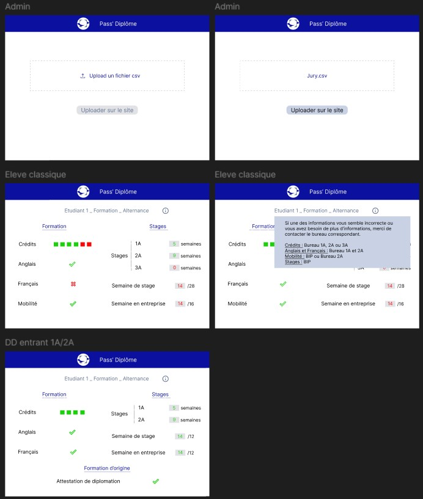
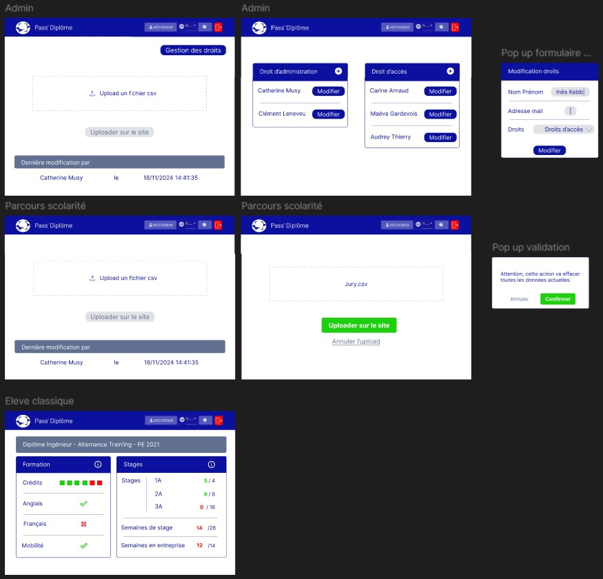



Pour ce POK, je me suis basé sur des connaissances en React, HTML, JS et Figma.





Ce POK est en lien avec mon [MON du temps 2.1](https://francoisbrucker.github.io/do-it/promos/2024-2025/Alix-Dureault/mon/temps-2.1/).



## Objectifs

Nous avons pu remarquer qu'il arrive chaque année que des élèves ne sont pas au clair de ce qui leur reste à valider, que des erreurs se glissent dans les preuves de validation mais ne sont remarquées que peut avant le jury. Suite à ce constat, nous avons discuter avec Catherine Musy pour voir si il était possible de rendre ce type d'informations accessibles aux élèves. Le problème est que toutes ces informations ne sont regroupées qu'au dernier moment, juste avant les jurys.

L'objectif de ce POK est donc de réaliser un système d'information sur un exemple concret, via une base de données (excel et site internet) tout en respectant des contraintes RGPD. Concrètement, les élèves doivent pouvoir consulter les éléments qui les concernent exclusivement.

Ce projet a aussi pour but d'observer les enjeux de management de l'information au sein des services de l'école dans le cadre d'un projet, notamment pour la mise en place d'un process qui se veut durable.

À noter, nous nous sommes engagées en termes de moyens et non de résultat.

## Tâches

### Sprint 1

- [ ] Réalisation d'un excel et étude de l'automatisation possible
- [x] Réalisation d'une maquette du site souhaité
- [x] Etude des technologies compatibles avec la DSI de Centrale
- [x] Initialisation d'une base de données test

Après la réunion de cadrage et la réunion avec la DSI, nous avons pu constater que nous n'avions pas besoin de faire un excel détaillé et automatisé. Le coeur de notre tâche ce concentre donc surtout sur le site web qui permet à la gestion de scolarité de mettre à disposition des élèves les informations concernant leurs critères de validation pour leurs diplômes.

### Sprint 2

- [ ] Front-end du site
- [ ] Proposition du nouveau process aux équipes
- [ ] Back-end du site (+ connexion au CAS si accepté par la DSI)
- [ ] Mise en conformité RGPD
- [ ] Communication à destination des élèves sur le projet

### Horodatage

| Date | Heures passées | Indications |
| -------- | -------- |-------- |
| Réunion de cadrage | 1h | 18/10/2024 |
| Réunion avec le CRI | 1h | 24/10/2024 |
| Première maquette rapide du site | 20 min | 24/10/2024 |
| Mise en forme base de donnée test | 40 min | 13/11/2024 |
| Recherche sur la database | 50 min | 15/11/2024 |
| Travail sur la maquette | 50 min | 16/11/2024 |
| Travail sur la maquette | 1h10 min | 17/11/2024 |
| Recherche sur la database | 20 min | 17/11/2024 |
| Création du repository github et initialisation du front sur React | 30 min | 17/11/2024 |
| Réunion de mi-parcours (validation maquette) | 1h | 18/11/2024 |
| Travail sur la maquette | 40 min | 18/11/2024 |
| Ajout de la validation de donnée sur l'excel | 10 min | 18/11/2024 |
| Traitement des infos des différentes réunions | 30 min | 18/11/2024 |
| Receuil d’avis des élèves sur le design | 1h | 19/11/2024 |

## Premier Sprint

### Choix des technologies

Nous avons pu choisir les technologies suite à notre réunion avec la DSI.

Pour pouvoir nous aider, ils nous ont conseillé d'utiliser des frameworks JavaScript comme React ou Angular ou des frameworks Python.

Pour le front, nous utilisons toutes les deux React pour nos projets, il nous a donc semblé une bonne idée de l'utiliser aussi lors de ce projet. 

### Quelle forme aura la base de donnée du site ?

Actuellement la gestion de la scolarité travaille sur un excel sur lequel sont présents tous les élèves. Pour faciliter l'implémentation du site, nous voulions changer leurs habitudes le moins possible. Ainsi nous voulions garder le travail sur excel pour ces personnes. Après discussion avec la DSI, nous avons compris l'importance d'avoir un chemin entre cet excel et la base de donnée et une validation de donnée sur l'excel, les erreurs pouvant être trop fréquentes.

Ainsi, nous avons opté pour une solution où l'excel sera rempli comme précédemment mais une fois que cela est fait, la personne référente peut le télécharger en csv et aller l'importer sur le site directement.

Cela implique plusieurs choses derrière sur notre travail :
- Devoir coder une interface pour ces interlocuteurs
- Prévoir une gestion des droits afin de palier au turn over des personnes référentes
- Trouver la solution technique pour importer un fichier csv sur le site et remplacer la base de donnée

### Solution technique pour la base de donnée

J'ai pu exercé quelques recherches sur le sujet en décomposant le sujet en plusieurs étapes : 
1. Upload d'un fichier csv à partir de l'interface du site web

Au cours de mes recherches, j'ai pu trouvé plusieurs ressources qui pourront nous aider dans cette tâche : [Upload un fichier dans React](https://www.youtube.com/watch?v=ijx0Uqlo3NA), [Upload un fichier dans React avec une barre de progrès ](https://www.youtube.com/watch?v=edR6Az7shv8) et [Upload un fichier avec une API drag and drop](https://www.youtube.com/watch?v=vEkf9JgJV00).

2. Effacement de la base de donnée existante

Cela sera à priori assez simple. J'ai tout de même trouver une ressource au cas où : [UPDATE et DELETE de la donnée dans une table MySQL](https://www.youtube.com/watch?v=OB2leB2iZ6U&pp=ygUXZGVsZXRlIGRhdGEgaW4gZGF0YWJhc2U%3D).

3. Lecture du fichier csv pour remplacer la base de donnée

Au moment où j'ai fais les recherches, je ne savais pas encore quelle technologie nous allons utiliser, j'ai donc trouver des ressources sur différentes options : [Importer un fichier CSV sur MySQL](https://www.youtube.com/watch?v=INtejSjK5w0) et [Importer un fichier CSV sur SQLServer](https://www.youtube.com/watch?v=8HWXjh6eBjc).

### Quel sera le visuel des différentes interfaces du site ?

Pour cela, j'ai travaillé sur une première visualisation sur les différentes vues élèves (elles dépendent du parcours à Centrale) et sur la vue admin.

Ensuite Ines a pu travaillé sur une deuxième version plus élaboré.

Enfin après les retours de Catherine Musy, j'ai pu reprendre quelques éléments et ajouter la vue administrateur.

### Initialisation de l'excel côté gestion de la scolarité

Pour se donner une bonne idée de à quoi ressemble l'excel avec lequel travaille la gestion de la scolarité, Catherine Muzy a pu nous envoyé un extrait anonymosé du tableau de diplomation de cette année. 

Je l'ai par la suite modifié pour qu'il convienne plus aux différents service (BIP et Bureau 2A). J'ai aussi pu ajouter plusieurs lignes tests d'élèves consentants qui nous permettront de mener les tests de connexion à la fin du projet.

### Comment le visuel est reçu par des élèves et la gestion de la scolarité ?

Enfin, après le travail de maquette, je suis aller voir un petite dizaine d'étudiants afin d'obtenir leur avis sur la maquette. Le but de ce travail était de comprendre si elle était lisible et compréhensible et quel type de légende est nécessaire.

Inès a pu travaillé sur la prise en compte de ces avis. Globalement, ces avis nous amènent à retravailler la présentation des crédits ECTS, quelques formulations et la présence du stage de deuxième année en fonction du parcours de l'élève.

## Second Sprint
