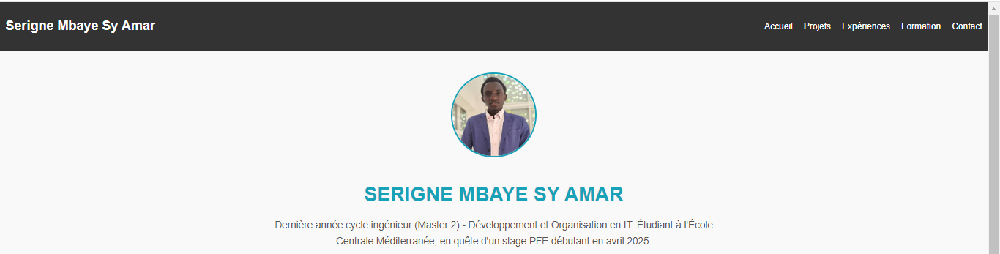
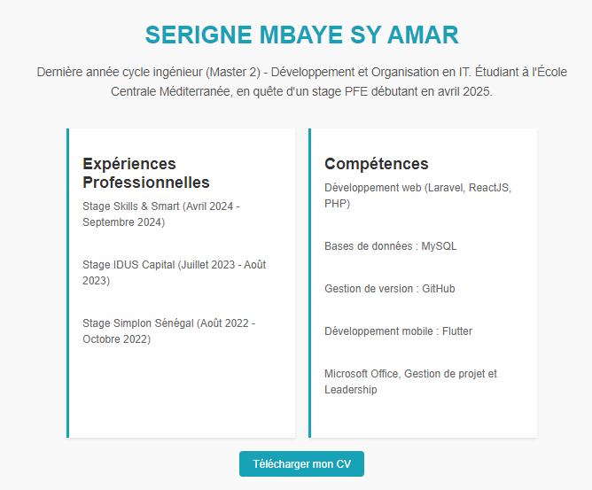
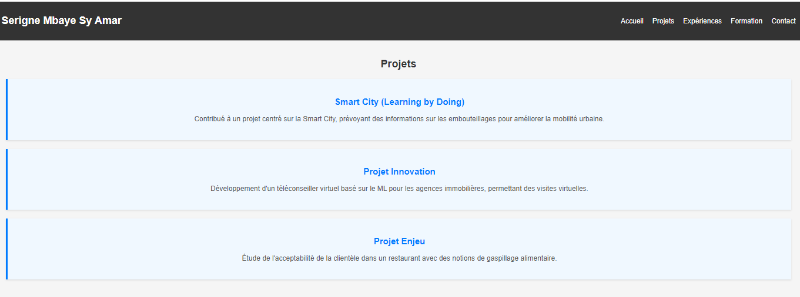
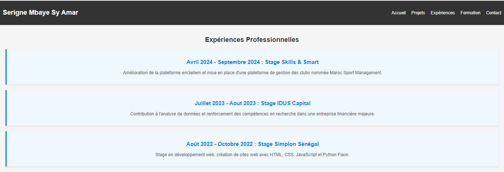
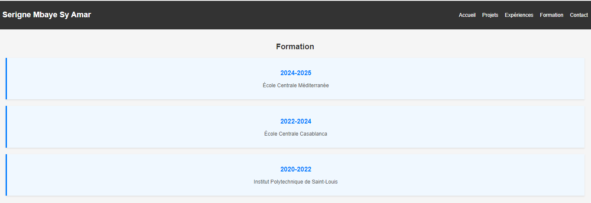
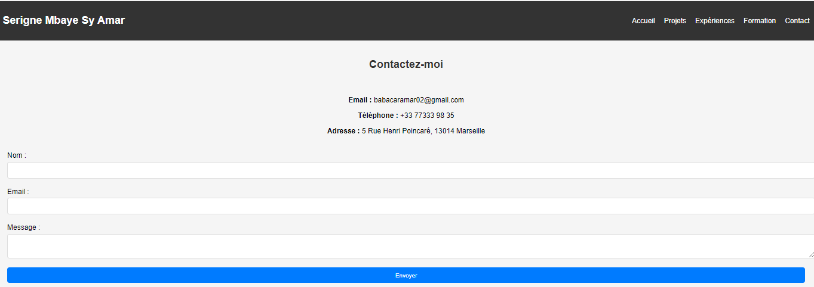
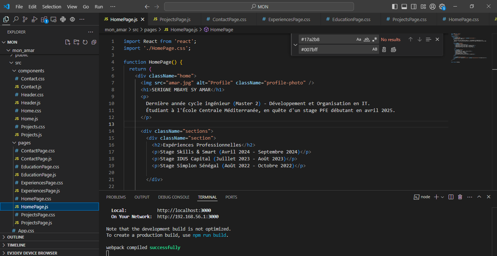



Prérequis : JavaScript, HTML et CSS




[Les lien utiles pour la compréhension de celui-ci.](https://react.dev/)
[Vous pouvez consulter les codes sources ici ](https://github.com/MbayeSyAmar/mon_amar.git)


## Pourquoi React ?
J'ai choisi d'apprendre **React** car c'est une bibliothèque JavaScript très populaire pour la création d'interfaces utilisateur. Elle permet de **réutiliser des composants**, de gérer efficacement l'état de l'application, et de rendre des pages dynamiques tout en améliorant les performances. Un portfolio est une bonne première application car il comprend plusieurs pages qui bénéficient de la modularité et des composants réutilisables.

## Objectifs
Mon objectif était de créer un **portfolio simple** avec **React**, en me concentrant sur la séparation des différentes sections comme l'accueil, les projets, les expériences professionnelles, et un formulaire de contact. Le but est de mettre en avant mes compétences techniques et mes projets en utilisant une **navigation fluide**.

## Méthode
Voici les étapes générales que j'ai suivies pour construire ce portfolio :

- [X] Utiliser `create-react-app` pour créer la structure de base du projet.
- [X] Créer des composants React pour chaque section du portfolio (Accueil, Projets, Expériences professionnelles, Formation, Contact).
- [X] Utiliser **React Router** pour naviguer entre les sections de manière fluide.
- [X] Ajouter des images pour personnaliser le portfolio.
- [X] Utiliser du CSS pour styliser chaque page et rendre l'interface plus attrayante.

---

## Structure du Projet

J'ai structuré mon projet de manière claire et logique, avec une séparation des composants dans des dossiers distincts.

```
mon_amar/
│
├── /public
│   ├── index.html        // Fichier de base HTML
│   ├── amar.jpg       // Photo de profil
│   └── cv.pdf            // Fichier CV téléchargeable
│
├── /src
│   ├── /components
│   │   ├── Header.js     // Composant de navigation
│   │   ├── Home.js       // Composant de la page d'accueil
│   │   ├── Projects.js   // Composant de la section Projets
│   │   ├── Experience.js // Composant pour les expériences professionnelles
│   │   ├── Education.js  // Composant pour la formation
│   │   └── Contact.js    // Formulaire de contact
│   │
│   ├── /pages
│   │   ├── HomePage.js       // Page d'accueil complète
│   │   ├── ProjectsPage.js   // Page des projets
│   │   ├── ExperiencePage.js // Page des expériences
│   │   ├── EducationPage.js  // Page de la formation
│   │   └── ContactPage.js    // Page de contact
│   │
│   ├── App.js        // Composant principal pour la gestion de l'application
│   ├── App.css       // Styles globaux de l'application
│   └── index.js      // Point d'entrée de l'application
│
└── package.json      // Fichier de configuration du projet
```
---
## Concepts Clés de mon projet
### Les Composants
Les composants sont les blocs de construction de toute application React. Ils permettent de diviser l'interface utilisateur en morceaux réutilisables.

**Exemple : Composant Header**
```javascript
import React from 'react';
import { Link } from 'react-router-dom';
import './Header.css';

function Header() {
  return (
    <header className="header">
      <nav className="navbar">
        <h1 className="logo">Serigne Mbaye Sy Amar</h1>
        <ul className="nav-links">
          <li><Link to="/">Accueil</Link></li>
          <li><Link to="/projects">Projets</Link></li>
          <li><Link to="/experiences">Expériences</Link></li>
          <li><Link to="/education">Formation</Link></li>
          <li><Link to="/contact">Contact</Link></li>
        </ul>
      </nav>
    </header>
  );
}

export default Header;
```
 Ce morceau a pour but de gerer la navigation entre les diferentes pages. 

---
**Composants Principaux :** 
***1. Header.js***
Le composant Header est responsable de la navigation dans le portfolio. Il affiche les liens vers les différentes sections (Accueil, Projets, Expériences, Formation, Contact) et assure une navigation fluide.

Détails :

Utilisation de React Router pour la navigation entre les pages.
Style de base avec CSS pour un affichage propre et fonctionnel.
***2. Home.js***
Le composant Home est la page d'accueil du portfolio. Il introduit le visiteur avec une photo de profil et un texte d'accueil.

Détails :

Affichage d'une image de profil et d'un texte de bienvenue.
Lien pour télécharger le CV.
Utilisation de CSS pour définir les styles de mise en page.
***3. Projects.js***
Le composant Projects présente une liste de projets. Chaque projet est affiché avec une image, une description et un lien vers le dépôt GitHub.


***4. Experience.js***
Le composant Experience affiche les expériences professionnelles sous forme de liste. Chaque élément de la liste inclut la période, l'entreprise et une brève description des responsabilités.

Détails techniques :

Affichage dynamique des expériences à l'aide d'un tableau.
Mise en forme des éléments avec des balises HTML et du CSS.
***5. Education.js***
Le composant Education liste les diplômes et les institutions fréquentées. Chaque élément de la liste comprend l'année, le nom de l'institution et le diplôme obtenu.

***6. Contact.js***
Le composant Contact contient un formulaire permettant aux visiteurs de m'envoyer un message. Le formulaire comprend des champs pour le nom, l'email et le message, avec validation intégrée.

### Pages
Ce répertoire contient les vues ou les pages complètes de l'application. Une page est généralement une vue entière que l'utilisateur peut voir lorsqu'il accède à une route spécifique dans l'application. Par exemple, la page d'accueil, la page des projets, et la page de contact sont des pages distinctes.
Les pages sont souvent composées de plusieurs composants et peuvent être considérées comme des "containers" pour ces composants.
**Exemple : HomePage**
```javascript
import React from 'react';
import './HomePage.css';

function HomePage() {
  return (
    <div className="home">
      
      <h1>SERIGNE MBAYE SY AMAR</h1>
      <p>
        Dernière année cycle ingénieur (Master 2) - Développement et Organisation en IT.
        Étudiant à l'École Centrale Méditerranée, en quête d'un stage PFE débutant en avril 2025.
      </p>

      <div className="sections">
        <div className="section">
          <h2>Expériences Professionnelles</h2>
          <p>Stage Skills & Smart (Avril 2024 - Septembre 2024)</p>
          <p>Stage IDUS Capital (Juillet 2023 - Août 2023)</p>
          <p>Stage Simplon Sénégal (Août 2022 - Octobre 2022)</p>

        </div>
        
        <div className="section">
          <h2>Compétences</h2>
          <p>Développement web (Laravel, ReactJS, PHP)</p>
          <p>Bases de données : MySQL</p>
          <p>Gestion de version : GitHub</p>
          <p>Développement mobile : Flutter</p>
          <p>Microsoft Office, Gestion de projet et Leadership</p>
        </div>
      </div>

      <div className="button-container">
        <a href="/cv.pdf" download="Mon-CV.pdf" className="download-button">Télécharger mon CV</a>
      </div>
    </div>
  );
}

export default HomePage;
```
---
**Pages Principales :** 
***1. HomePage.js***
La page d'accueil complète est assemblée en utilisant le composant Home. Elle affiche la vue d'ensemble avec tous les éléments d'accueil.

***2. ProjectsPage.js***
Cette page utilise le composant Projects pour afficher tous les projets avec les images, descriptions, et liens pertinents.

***3. ExperiencePage.js***
La page des expériences professionnelles est construite avec le composant Experience pour afficher toutes les expériences en détail.

***4. EducationPage.js***
La page de formation est rendue avec le composant Education pour présenter les diplômes et les institutions fréquentées.

***5. ContactPage.js***
Cette page affiche le formulaire de contact à l'aide du composant Contact, permettant aux utilisateurs de me contacter directement.

### Resultats









### Conclusion
En développant ce portfolio avec React, j'ai appliqué les concepts clés de cette bibliothèque, notamment les composants et la navigation entre les pages. Ce projet est un excellent moyen d'apprendre les bases tout en créant une application fonctionnelle.
À suivre pour mon MON 2 sur l'étude de comment intégrer React dans Laravel.


[Vous pouvez consulter les codes sources ici ](https://github.com/MbayeSyAmar/mon_amar.git)



## Sources :


[Documentation React ](https://react.dev/)
[Cours complet sur ReactJS dans 5 heures | tuto fr ](https://www.youtube.com/watch?v=GeIFHYVTyik)
[[Cours / Tuto] Apprendre React de Zéro (débutant) ](https://www.youtube.com/watch?v=f0X1Tl8aHtA)


