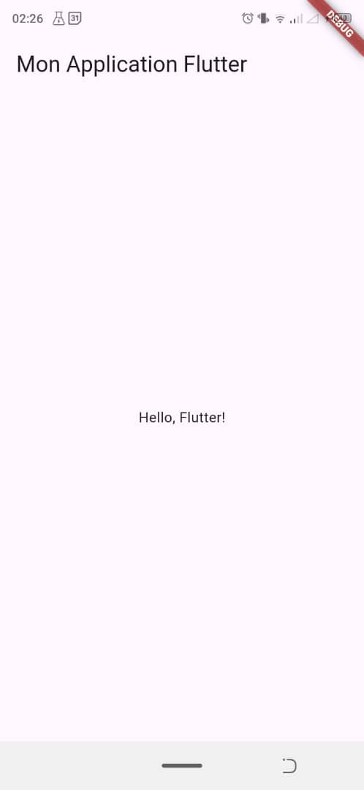
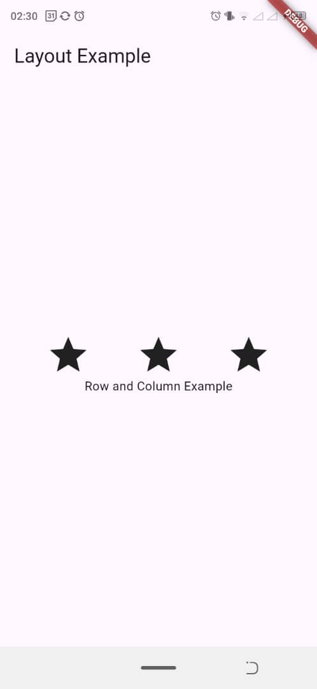
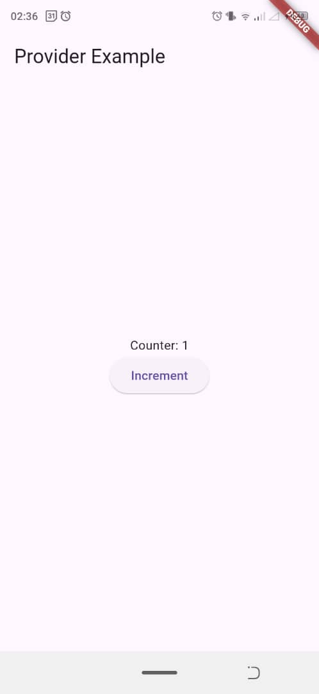
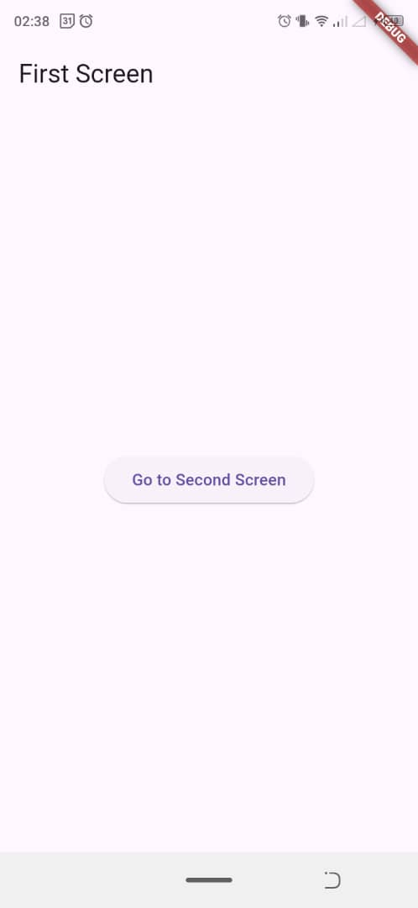
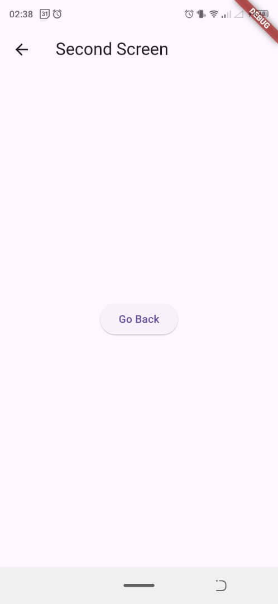
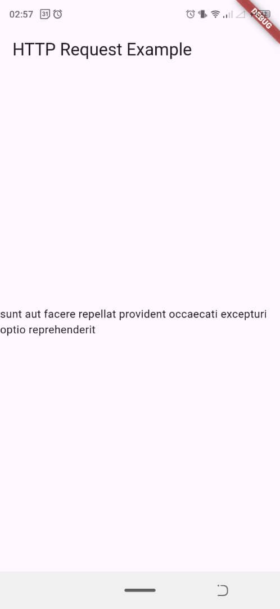



- Connaissance de base en programmation (de préférence en Dart, mais pas obligatoire).



Les lien utiles pour la compréhension de celui-ci: 

[Documentation officielle Flutter](https://docs.flutter.dev) 

[API Flutter Documentation](https://api.flutter.dev)




## Table des matières

[Introduction](#introduction)  
  
1. [Installation et Configuration de l'Environnement](#installation-et-configuration)  
 
2. [Les Widgets : Le cœur de Flutter](#widgets)  

3. [Organisation de l'Interface : Les Layouts](#layouts)   

4. [Gestion de l'État avec Provider](#gestion-etat)   

5. [Navigation dans Flutter](#navigation)    

6. [Appels HTTP et Interactions avec une API](#appels-http)   

[Conclusion](#conclusion)


## Introduction  

**Flutter** est un framework open-source développé par Google. Il permet de créer des applications multiplateformes (Android, iOS, Web, Desktop) à partir d'une seule base de code, ce qui réduit le coût et le temps de développement. L'un des principaux atouts de Flutter est sa performance proche du natif, grâce au langage Dart et à son moteur graphique optimisé. 

  
**Dart**, le langage derrière Flutter, est un langage moderne et rapide pour le développement client. Avec Flutter, tout est un widget, permettant ainsi une personnalisation et un contrôle total sur l'interface utilisateur. 

---  

## 1. Installation et Configuration de l'Environnement 

### Installation d'Android Studio 


- On télécharger [Android Studio](https://developer.android.com/studio) et on l'instale. C'est l'IDE recommandé par Google pour développer des applications Android, et il fournit un émulateur Android intégré pour tester tes projets Flutter. 

- Sans oublier l'option pour installer le **SDK Android** est cochée pendant l'installation. 

   
### Installation des plugins Flutter 

  
- Une fois Android Studio installé, on l'ouvre et on navigue vers **File > Settings > Plugins**. 

- Ici on recherche **Flutter** et **Dart**, puis on les installe. Ces plugins te permettent de développer des applications Flutter directement depuis Android Studio. 

  
### Installation de Flutter 

  
- On télécharge Flutter depuis le site officiel : [flutter.dev](https://flutter.dev/docs/get-started/install). 

- Puis on suis les instructions qui varient par rapport au système d'exploitation (Windows, macOS, Linux)(mets le lien ici). 

- Après l'installation, on exécute la commande **flutter doctor** pour vérifier que toutes les dépendances sont bien installées (SDK Android, émulateur, etc.). 


### Création d'un projet Flutter 

  
- Une fois Flutter configuré, on peut créer un premier projet. Dans Android Studio, on clique sur **New Flutter Project**, on choisi un nom et spécifie le chemin d'installation de Flutter. 

- L'arborescence du projet sera générée automatiquement, avec des dossiers pour Android, iOS, et d'autres plateformes.


### Création d'un émulateur Android 

  
- Dans Android Studio, on navigue vers **AVD Manager** (Android Virtual Device) et on configure un nouvel appareil virtuel. Cela nous permet de tester l'application sur un émulateur Android pour mon cas j'utilise mon telephone.

--- 

## 2. Les Widgets : Le cœur de Flutter 

  
### Qu'est-ce qu'un widget ? 

  
Dans Flutter, **tout est un widget**. Cela signifie que chaque composant visuel ou structure est un widget, que ce soit un texte, une image, un bouton ou même un conteneur. Flutter repose sur une architecture basée sur les widgets pour permettre une construction des interfaces utilisateur. 


Il existe deux types principaux de widgets : 

  
- **StatelessWidget** : Un widget sans état, c'est-à-dire que son contenu est fixe et ne change pas au cours de l'exécution. 

- **StatefulWidget** : Un widget avec un état mutable, capable de se mettre à jour lorsque des changements surviennent. 

  
### Exemple de StatelessWidget 


Un widget qui affiche du texte statique. 


```dart 

// Importation du package Flutter qui contient tout ce qui est nécessaire pour créer une interface utilisateur
import 'package:flutter/material.dart';

// Fonction principale de l'application Flutter, c'est le point d'entrée de l'application
void main() {
  // La fonction runApp() lance l'application en exécutant le widget MyApp
  runApp(MyApp());
}

// Définition de la classe MyApp qui hérite de StatelessWidget, ce qui signifie que l'interface utilisateur ne changera pas (pas d'état mutable)
class MyApp extends StatelessWidget {
  
  // Le constructeur build est appelé pour créer l'interface utilisateur
  @override
  Widget build(BuildContext context) {
    
    // Retourne un MaterialApp, qui est un widget Flutter pour les applications utilisant le design Material (style Android)
    return MaterialApp(
      
      // La propriété home définit l'interface principale de l'application (la page d'accueil)
      home: Scaffold(
        
        // La propriété appBar permet d'afficher une barre d'application en haut de l'écran
        appBar: AppBar(
          // Titre de la barre d'application
          title: Text('Mon Application Flutter'),
        ),
        
        // La propriété body définit le contenu principal de la page
        body: Center(
          // Affichage d'un texte au centre de la page
          child: Text('Hello, Flutter!'),
        ),
      ),
    );
  }
}


``` 

  

### Exemple de StatefulWidget 

Un widget qui peut changer son contenu, ici un compteur qui s'incrémente. 

  
```dart 

// Importation du package Flutter qui contient les widgets nécessaires pour créer une interface utilisateur
import 'package:flutter/material.dart';

// Fonction principale de l'application Flutter, c'est le point d'entrée de l'application
void main() {
  // La fonction runApp() démarre l'application en exécutant le widget MyApp
  runApp(MyApp());
}

// Création de la classe MyApp, un StatefulWidget, ce qui signifie que cet écran peut avoir un état qui change
class MyApp extends StatefulWidget {
  
  // Cette méthode crée l'état associé au StatefulWidget
  @override
  _MyAppState createState() => _MyAppState();
}

// Classe représentant l'état de MyApp, c'est ici que nous allons gérer les changements d'état
class _MyAppState extends State<MyApp> {
  
  // Déclaration d'une variable entière _counter pour stocker la valeur du compteur, initialisée à 0
  int _counter = 0;

  // Fonction qui permet d'incrémenter la valeur de _counter et de rafraîchir l'interface utilisateur
  void _incrementCounter() {
    // La méthode setState() informe Flutter que l'interface doit être mise à jour
    setState(() {
      _counter++; // Incrémente la valeur du compteur
    });
  }

  // Méthode build qui construit l'interface utilisateur
  @override
  Widget build(BuildContext context) {
    // Retourne un MaterialApp pour définir l'application avec une structure en Material Design
    return MaterialApp(
      // Scaffold fournit une structure de base pour la page avec une appBar et un body
      home: Scaffold(
        // Barre d'application en haut avec un titre
        appBar: AppBar(title: Text('StatefulWidget Example')),
        
        // Contenu principal de la page
        body: Center(
          // Utilisation d'un widget Column pour organiser les widgets verticalement
          child: Column(
            // Alignement des widgets au centre de l'axe vertical
            mainAxisAlignment: MainAxisAlignment.center,
            children: <Widget>[
              // Texte qui affiche la valeur actuelle du compteur
              Text('Counter: $_counter'),
              
              // Bouton qui, lorsqu'il est pressé, appelle la fonction _incrementCounter pour augmenter le compteur
              ElevatedButton(
                // La fonction onPressed définit l'action lorsque le bouton est pressé
                onPressed: _incrementCounter,
                // Le texte affiché sur le bouton
                child: Text('Increment'),
              ),
            ],
          ),
        ),
      ),
    );
  }
}

``` 

  
--- 

  
## 3. Organisation de l'interface : Les Layouts 

Les **layouts** dans Flutter permettent d'organiser les widgets à l'écran. Il existe plusieurs types de widgets pour les layouts, mais les plus courants sont : 


- **Row** : Organise les widgets horizontalement. 

- **Column** : Organise les widgets verticalement. 

  
### Exemple : Utilisation de Row et Column 

  
```dart 

// Importation du package Flutter qui contient les widgets nécessaires pour créer l'interface utilisateur
import 'package:flutter/material.dart';

// Fonction principale de l'application Flutter, point d'entrée de l'application
void main() {
  // La fonction runApp() lance l'application avec le widget MyApp
  runApp(MyApp());
}

// Définition de la classe MyApp, un widget stateless (sans état mutable)
class MyApp extends StatelessWidget {
  
  // La méthode build est appelée pour construire l'interface utilisateur
  @override
  Widget build(BuildContext context) {
    
    // Retourne un MaterialApp, qui est l'enveloppe de base de l'application pour le design Material (style Android)
    return MaterialApp(
      
      // Scaffold fournit une structure de base avec une barre d'application et un corps (body)
      home: Scaffold(
        
        // AppBar est la barre d'application en haut de l'écran, elle contient un titre
        appBar: AppBar(title: Text('Layout Example')),
        
        // Le corps de l'application, on utilise Column pour disposer les enfants verticalement
        body: Column(
          
          // Centrage des widgets enfants verticalement
          mainAxisAlignment: MainAxisAlignment.center,
          
          // Liste des widgets enfants dans la colonne
          children: <Widget>[
            
            // Un Row pour disposer les éléments horizontalement
            Row(
              // Les éléments dans la ligne sont espacés de manière égale
              mainAxisAlignment: MainAxisAlignment.spaceEvenly,
              
              // Liste des widgets enfants dans la ligne
              children: <Widget>[
                
                // Icône en forme d'étoile avec une taille de 50 pixels
                Icon(Icons.star, size: 50),
                
                // Une deuxième icône étoile de même taille
                Icon(Icons.star, size: 50),
                
                // Une troisième icône étoile de même taille
                Icon(Icons.star, size: 50),
              ],
            ),
            
            // Un widget Text qui affiche du texte sous la ligne
            Text('Row and Column Example'),
          ],
        ),
      ),
    );
  }
}


``` 

  
--- 


## 4. Gestion de l'état avec Provider 


La gestion de l'état est important dans une application Flutter. **Provider** est l'un des packages les plus utilisés pour simplifier cette gestion. 

  
### Installation de Provider 

  

On ajoute la dépendance suivante dans le fichier **pubspec.yaml** : 

  

```yaml 

dependencies: 

  provider: ^6.1.2  

``` 
la derniere version (6.1.2) est sortie il y a 7 mois.

### Exemple d'utilisation de Provider 

  
Voici comment utiliser **Provider** pour gérer un compteur : 


```dart 

// Importation des packages Flutter nécessaires pour créer l'interface utilisateur
import 'package:flutter/material.dart';

// Importation du package Provider pour la gestion de l'état
import 'package:provider/provider.dart';

// Fonction principale de l'application, point d'entrée
void main() {
  // runApp lance l'application Flutter
  runApp(
    // ChangeNotifierProvider est utilisé pour fournir une instance de Counter à l'application
    ChangeNotifierProvider(
      // create permet de créer une nouvelle instance de la classe Counter
      create: (context) => Counter(),
      // MyApp est le widget enfant qui va utiliser ce provider
      child: MyApp(),
    ),
  );
}

// Création de la classe Counter, qui est un ChangeNotifier
// Cette classe sera responsable de la gestion de l'état du compteur
class Counter extends ChangeNotifier {
  
  // Variable privée pour stocker la valeur du compteur
  int _count = 0;

  // Getter pour accéder à la valeur actuelle de _count
  int get count => _count;

  // Méthode pour incrémenter le compteur
  void increment() {
    _count++; // Incrémente le compteur
    // notifyListeners() notifie les widgets qui écoutent ce provider de mettre à jour leur état
    notifyListeners();
  }
}

// Classe MyApp, un StatelessWidget qui ne change pas d'état directement
class MyApp extends StatelessWidget {
  
  // La méthode build crée l'interface utilisateur
  @override
  Widget build(BuildContext context) {
    
    // Retourne un MaterialApp avec une structure de base (Scaffold)
    return MaterialApp(
      home: Scaffold(
        // Barre d'application avec un titre
        appBar: AppBar(title: Text('Provider Example')),
        
        // Le corps de la page, centré
        body: Center(
          // Utilisation d'un widget Column pour organiser les éléments verticalement
          child: Column(
            // Les enfants de la colonne sont centrés verticalement
            mainAxisAlignment: MainAxisAlignment.center,
            children: <Widget>[
              // Texte qui affiche la valeur actuelle du compteur
              // Provider.of<Counter>(context).count récupère la valeur du compteur depuis le provider
              Text('Counter: ${Provider.of<Counter>(context).count}'),
              
              // Bouton qui permet d'incrémenter le compteur
              ElevatedButton(
                // La méthode onPressed est déclenchée lorsqu'on appuie sur le bouton
                onPressed: () {
                  // Provider.of<Counter>(context, listen: false).increment() appelle la méthode increment
                  // listen: false signifie que ce widget n'a pas besoin d'être mis à jour lorsque l'état change
                  Provider.of<Counter>(context, listen: false).increment();
                },
                // Texte affiché sur le bouton
                child: Text('Increment'),
              ),
            ],
          ),
        ),
      ),
    );
  }
}


``` 

  
--- 

  
## 5. Navigation dans Flutter 


Flutter permet de gérer facilement la navigation entre différentes pages avec le widget **Navigator**. 

  
### Exemple de navigation entre deux pages 

  
```dart 

// Importation du package Flutter nécessaire pour créer des interfaces utilisateur
import 'package:flutter/material.dart';

// Fonction principale de l'application, point d'entrée
void main() {
  // runApp lance l'application Flutter en exécutant le widget MyApp
  runApp(MyApp());
}

// MyApp est un StatelessWidget (ne change pas d'état)
class MyApp extends StatelessWidget {

  // La méthode build est utilisée pour construire l'interface utilisateur
  @override
  Widget build(BuildContext context) {
    // MaterialApp est le widget de base pour une application Material Design
    return MaterialApp(
      // La propriété home définit l'écran principal (FirstScreen)
      home: FirstScreen(),
    );
  }
}

// Première classe d'écran (FirstScreen) qui est également un StatelessWidget
class FirstScreen extends StatelessWidget {

  // La méthode build construit l'interface utilisateur du premier écran
  @override
  Widget build(BuildContext context) {
    // Scaffold fournit la structure de base d'une page (AppBar, body, etc.)
    return Scaffold(
      // AppBar pour afficher une barre d'application avec un titre
      appBar: AppBar(title: Text('First Screen')),
      // Le corps (body) de la page, ici un widget centré
      body: Center(
        // ElevatedButton est un bouton surélevé avec du texte
        child: ElevatedButton(
          // onPressed est la fonction appelée quand on appuie sur le bouton
          onPressed: () {
            // Navigator.push permet de naviguer vers un nouvel écran
            Navigator.push(
              context, // Le contexte actuel de l'application
              // MaterialPageRoute crée la transition vers un autre écran (SecondScreen)
              MaterialPageRoute(builder: (context) => SecondScreen()),
            );
          },
          // Le texte affiché sur le bouton
          child: Text('Go to Second Screen'),
        ),
      ),
    );
  }
}

// Deuxième classe d'écran (SecondScreen), également un StatelessWidget
class SecondScreen extends StatelessWidget {

  // La méthode build construit l'interface utilisateur du second écran
  @override
  Widget build(BuildContext context) {
    // Scaffold fournit la structure de base de la page (comme FirstScreen)
    return Scaffold(
      // AppBar pour afficher la barre d'application avec un titre
      appBar: AppBar(title: Text('Second Screen')),
      // Le corps de la page avec un widget centré
      body: Center(
        // Un bouton surélevé pour permettre à l'utilisateur de revenir en arrière
        child: ElevatedButton(
          // onPressed est la fonction appelée quand on appuie sur ce bouton
          onPressed: () {
            // Navigator.pop permet de revenir à l'écran précédent
            Navigator.pop(context);
          },
          // Texte affiché sur le bouton
          child: Text('Go Back'),
        ),
      ),
    );
  }
}

``` 



  

--- 

  

## 6. Appels HTTP et interactions avec une API 

  
Flutter peut facilement faire des appels réseau avec le package **http**. Cela est utile pour interagir avec des API externes et récupérer des données. 

  
### Exemple de requête HTTP 

  
```dart 

// Importation du package Flutter pour créer des interfaces utilisateur
import 'package:flutter/material.dart';

// Importation du package http pour effectuer des requêtes HTTP
import 'package:http/http.dart' as http;

// Importation du package dart:convert pour convertir des données JSON
import 'dart:convert'; 

// Fonction principale de l'application, point d'entrée
void main() {
  // runApp lance l'application Flutter en exécutant le widget MyApp
  runApp(MyApp());
}

// MyApp est un StatefulWidget, ce qui signifie que l'état peut changer au cours de l'exécution
class MyApp extends StatefulWidget {
  @override
  _MyAppState createState() => _MyAppState();
}

// _MyAppState gère l'état de MyApp
class _MyAppState extends State<MyApp> {
  
  // Déclaration d'une variable 'data' qui va contenir les données récupérées, initialisée avec un message
  String data = "Fetching data...";

  // initState est une méthode appelée lors de la création initiale de l'état
  @override
  void initState() {
    super.initState();
    
    // Appel de la méthode fetchData pour récupérer des données dès le démarrage de l'application
    fetchData();
  }

  // Méthode fetchData pour récupérer des données à partir d'une API
  void fetchData() async {
    // Utilisation de http.get pour envoyer une requête GET à une URL spécifique
    final response = await http.get(Uri.parse('https://jsonplaceholder.typicode.com/posts/1'));

    // Vérifie si la requête a réussi (statut 200)
    if (response.statusCode == 200) {
      // Si la requête réussit, on décode la réponse JSON et on met à jour la variable 'data' avec le titre récupéré
      setState(() {
        data = json.decode(response.body)['title'];
      });
    } else {
      // Si la requête échoue, on met à jour 'data' avec un message d'erreur
      setState(() {
        data = "Failed to load data";
      });
    }
  }

  // La méthode build crée l'interface utilisateur
  @override
  Widget build(BuildContext context) {
    // Retourne l'interface de l'application en utilisant MaterialApp
    return MaterialApp(
      // Scaffold structure l'interface avec une barre d'application (AppBar) et un corps (body)
      home: Scaffold(
        // AppBar avec un titre
        appBar: AppBar(title: Text('HTTP Request Example')),
        // Le corps de la page, centré, contenant le texte (data)
        body: Center(
          // Le texte affiche soit les données récupérées, soit un message d'attente/erreur
          child: Text(data),
        ),
      ),
    );
  }
}

``` 



--- 


  ## Horodatage 

| Date                       | Heures passées | Indications                                                     |
| -------------------------- | -------------- | --------------------------------------------------------------- |
| Lundi 30/09                | 2h00           | *Début des recherches et installations nécessaires* |
| Samedi & Dimanche 05-06/10 | 4h00           | *[Cours / Tuto] Apprendre à coder pour les vrais débutants avec Dart et Flutter sur YouTube* |
| Jeudi 10/10                | 3h00           | *Approfondissement de mes recherches sur le sujet* |
| Samedi 12/10               | 1h00           | *Restitution des idées* |


--- 


## Conclusion 

Flutter est une solution pour le développement d'applications multiplateformes. Si on maitrise les concepts de base et en approfondissant un peu des sujets comme la gestion de l'état avec **Provider**, la navigation, et les appels réseau, on sera capable de créer des applications modernes. 


## Sources :

[Apprendre à coder pour les vrais débutants avec Dart et Flutter sur Youtube ](https://www.youtube.com/watch?v=Nc8Rlz1tjH8)

 
