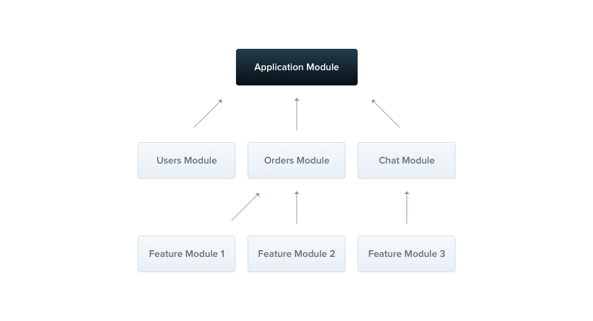
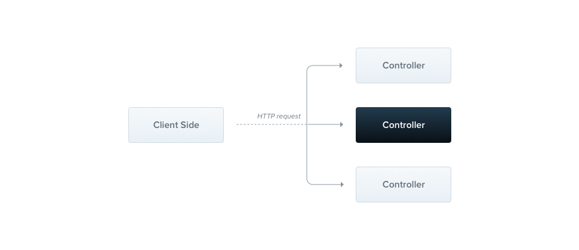
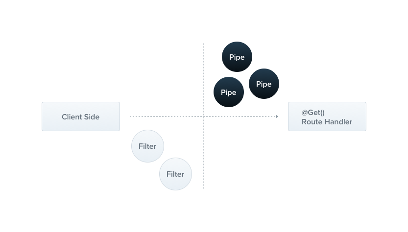
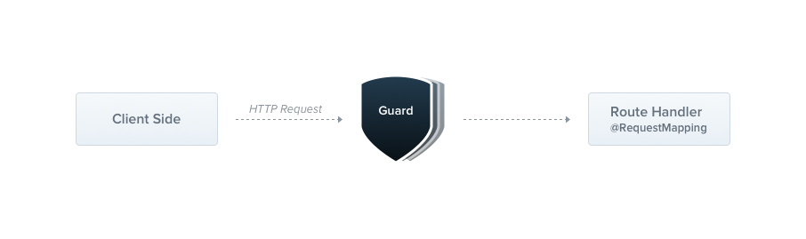


- Connaissance en JavaScript  et TypeScript.




Le lien utile pour la compréhension de NestJS: 
[Documentation officielle de NestJS](https://docs.nestjs.com) 



## Table des matières
- [Table des matières](#table-des-matières)
- [Introduction](#introduction)
- [**1. Les Modules**](#1-les-modules)
    - [**Qu'est-ce qu'un Module dans NestJS ?**](#quest-ce-quun-module-dans-nestjs-)
- [**2. Les Contrôleurs**](#2-les-contrôleurs)
    - [**Qu'est-ce qu'un Contrôleur dans NestJS ?**](#quest-ce-quun-contrôleur-dans-nestjs-)
- [**3. Les Services**](#3-les-services)
    - [**Qu'est-ce qu'un Service dans NestJS ?**](#quest-ce-quun-service-dans-nestjs-)
- [**4. Les DTOs (Data Transfer Objects)**](#4-les-dtos-data-transfer-objects)
    - [**Qu'est-ce qu'un DTO dans NestJS ?**](#quest-ce-quun-dto-dans-nestjs-)
- [**5. Modèles**](#5-modèles)
    - [**Qu'est-ce qu'un Modèle dans NestJS ?**](#quest-ce-quun-modèle-dans-nestjs-)
- [**6. Les Filtres, Pipes et Guards**](#6-les-filtres-pipes-et-guards)
    - [**Filtres d'Exception**](#filtres-dexception)
    - [**Pipes**](#pipes)
    - [**Guards**](#guards)
- [**7. Le Point d’Entrée (`main.ts`)**](#7-le-point-dentrée-maints)
    - [**Qu'est-ce que le Point d’Entrée dans NestJS ?**](#quest-ce-que-le-point-dentrée-dans-nestjs-)
  - [**Horodatage**](#horodatage)
- [Sources :](#sources-)

## Introduction 
J'apprends NestJs dans le but de me familiariser avec un langage backend autre que Laravel. Pour tout ce qui est en rapport avec l'installation et les autres étapes, je vous invite à consulter ce site web [1ère étape NestJs](https://docs.nestjs.com/first-steps). Pour voir également une application concrète de NestJs, veuillez consulter mon POK du temps 2 [POK Temps 2](https://francoisbrucker.github.io/do-it/promos/2024-2025/Amar-Mbaye/pok/temps-2/). J'ai commencé par visiter le site **Créer un CRUD avec NestJs**, dont le lien est au niveau de mes références, ce qui m'a permis de connaître les éléments les plus importants en NestJs. Je vais procéder ainsi par question, et tous mes exemples ont été basés sur mon forum de discussion. 

## **1. Les Modules**

#### **Qu'est-ce qu'un Module dans NestJS ?**
Un **module** est une unité de base dans NestJS. Il regroupe des **contrôleurs**, des **services** et d'autres éléments liés à une fonctionnalité spécifique. Par exemple, si tu construis un forum, tu pourrais avoir un module `PostsModule` pour gérer les posts, un `UsersModule` pour gérer les utilisateurs, etc. J'ai été aidé par la vidéo **NestJs 7 Les modules NestJs, création de module et module global** mentionnée dans mes sources pour comprendre cette partie.

Chaque application NestJS a un module principal (généralement `AppModule`) qui importe tous les autres modules.

  
Image explicite trouvée sur le site de la documentation de NestJs.

---

## **2. Les Contrôleurs**

#### **Qu'est-ce qu'un Contrôleur dans NestJS ?**
Les **contrôleurs** sont responsables de gérer les **requêtes HTTP**. Ils définissent les endpoints (routes) de l’API et mappent chaque requête à une méthode spécifique.

  Ils ont comme responsabilité de :
  - Recevoir les requêtes HTTP (GET, POST, PUT, DELETE, etc.).
  - Extraire les paramètres ou le corps de la requête.
  - Appeler les services pour effectuer la logique métier.
  - Retourner une réponse au client.



- Un contrôleur `PostsController` gère les routes liées aux posts.
  - **GET `/posts`** : Récupérer tous les posts.
  - **POST `/posts`** : Créer un nouveau post.
  - **DELETE `/posts/:id`** : Supprimer un post par ID.


Image explicite trouvée sur le site de la documentation de NestJs.

> **Rôle important :** Le contrôleur ne contient pas de logique complexe. Il délègue les opérations au **service**.

Le point n°4, expliqué par **Webeleon** sur le site **dev.to**, m'a aidé à comprendre les contrôleurs. Le lien se trouve dans la partie sources.

---

## **3. Les Services**

#### **Qu'est-ce qu'un Service dans NestJS ?**
Les **services** contiennent la **logique métier** de l'application. Ce sont des classes où tu définis tout ce qui doit être fait pour manipuler ou traiter les données.

  Ils ont comme responsabilité de :
  - Interagir avec la base de données (via un modèle comme Mongoose pour MongoDB).
  - Effectuer des calculs ou des validations complexes.
  - Fournir des données au contrôleur.



- Un service `PostsService` inclut des méthodes comme :
  - `findAll` : Récupérer tous les posts depuis la base de données.
  - `create` : Ajouter un nouveau post à la base.
  - `delete` : Supprimer un post par ID.


> **Rôle important :** Les services permettent de garder les contrôleurs simples et centrés sur la gestion des requêtes.

L'explication de la partie service de **Créer un CRUD avec NestJs** était explicite pour moi. Le lien se trouve dans la partie sources.
 
---

## **4. Les DTOs (Data Transfer Objects)**

#### **Qu'est-ce qu'un DTO dans NestJS ?**
Les **DTOs** définissent la structure des données qui transitent entre le client et le serveur. Ils sont utilisés pour valider les données envoyées dans les requêtes HTTP.

Ils ont comme responsabilité de :
  - Assurer que les données reçues ou envoyées respectent un format spécifique.
  - Faciliter la validation des données avec des outils comme `class-validator`.



- Un DTO `CreatePostDto` pourrait spécifier que chaque post doit avoir un `title` et un `content`.
- Si le client oublie de fournir un champ obligatoire, le serveur retourne une erreur claire.


> **Rôle important :** Les DTOs aident à sécuriser et structurer les interactions entre le client et le serveur.

Pour cette partie, j'ai consulté l'explication de **David Ekete** sur **dev.to**, ainsi que le site web **GeeksforGeeks**. Les liens se trouvent dans la partie sources.

---

## **5. Modèles**

#### **Qu'est-ce qu'un Modèle dans NestJS ?**
Un **modèle** représente la structure des données dans la base de données. Avec MongoDB, les modèles sont définis à l'aide de **Mongoose**.

- Ils ont comme responsabilité de :
  - Définir les champs d'un document (par exemple : titre, contenu, date de création).
  - Définir les règles de validation pour la base de données (par exemple : `title` est obligatoire).



- Un modèle `Post` pourrait inclure les champs :
  - `title` (chaîne obligatoire).
  - `content` (chaîne obligatoire).
  - `author` (référence à un utilisateur).


> **Rôle important :** Les modèles servent d’interface entre l’application et la base de données.
 
L'article de **SFEIR** sur **dev.to** m'a permis de comprendre cette partie. Le lien se trouve dans la partie sources.  

---

## **6. Les Filtres, Pipes et Guards**

#### **Filtres d'Exception**
- **Qu'est-ce que c'est ?** : Les filtres interceptent les erreurs dans l'application.
- **Utilité** : Fournir des messages d'erreur personnalisés au client.
- **Exemple** : Si un ID de post est invalide, retourner un message `Post not found`.

#### **Pipes**
- **Qu'est-ce que c'est ?** : Les pipes transforment ou valident les données avant qu'elles n'atteignent un contrôleur ou un service.
- **Utilité** : Valider les données reçues dans une requête (par exemple, vérifier qu'un champ `title` n'est pas vide).

Image explicite trouvée sur le site de la documentation de NestJs.

#### **Guards**
- **Qu'est-ce que c'est ?** : Les guards protègent les routes en contrôlant l'accès.
- **Utilité** : Implémenter l'authentification (JWT) ou des permissions.

Image explicite trouvée sur le site de la documentation de NestJs.

  
L'article de **SFEIR** sur **dev.to** m'a permis de comprendre cette partie. Le lien se trouve dans la partie sources.  

---

## **7. Le Point d’Entrée (`main.ts`)**

#### **Qu'est-ce que le Point d’Entrée dans NestJS ?**
Le fichier `main.ts` initialise l'application NestJS et configure son comportement global.

- Il a comme responsabilité de :
  - Lancer le serveur.
  - Configurer les middlewares globaux (par exemple : activer CORS).
  - Intégrer des outils comme Swagger pour la documentation.



- Activer le middleware pour la documentation des API avec Swagger.
- Activer `enableCors()` pour autoriser les requêtes depuis le frontend React.


L'article **Construire un serveur backend robuste avec NestJS** sur la partie initiation est la seule source explicite que j'ai trouvée pour cette partie. Le lien se trouve dans la partie sources. 

---



Voici un résumé de ce que j'ai compris sur NestJS :
| **Composant**    | **Rôle**                                                                                 |
|-------------------|------------------------------------------------------------------------------------------|
| **Module**        | Organise les contrôleurs, services et autres composants liés à une fonctionnalité.       |
| **Contrôleur**    | Gère les requêtes HTTP et délègue les tâches au service.                                 |
| **Service**       | Contient la logique métier et interagit avec la base de données.                        |
| **DTO**           | Définit la structure et valide les données échangées entre le client et le serveur.     |
| **Modèle**        | Définit la structure des données dans la base de données.                               |
| **Filtre**        | Intercepte les erreurs et personnalise les réponses d'erreur.                           |
| **Pipe**          | Transforme ou valide les données avant qu'elles n'atteignent le contrôleur.             |
| **Guard**         | Protège les routes en contrôlant l'accès (authentification, permissions).               |


### **Horodatage**
Voici à peu près (pas exactement, car parfois cela dépasse de quelques minutes) comment j’organise mon temps d’étude.

| **Étape**                              | **Durée**   |
|----------------------------------------|-------------|
| Introduction à NestJS                  | 1h          |
| Installation de NestJS et Configuration| 1h30        |
| Comprendre les Modules                 | 1h30        |
| Travailler avec les Contrôleurs        | 1h30        |
| Comprendre les Services                | 1h30        |
| Introduction aux DTOs                  | 1h          |
| Modèles et Schémas avec Mongoose       | 1h30        |
| Filtres, Pipes et Guards               | 1h          |
| Rédaction sur le site               | 1h15 min          |

## Sources :

- [Créer une CRUD avec NestJs](https://www.next-decision.fr/wiki/creer-une-crud-avec-nestjs)
- [NestJs 7 Les modules NestJs, création de module et module global](https://www.youtube.com/watch?v=awl-TE0tpkU&t=22s)
- [Webeleon](https://dev.to/webeleon/cursus-nestjs-les-controllers-4bm0)
- [David Ekete](https://dev.to/davidekete/understanding-data-transfer-objects-dto-and-data-validation-in-typescript-nestjs-1j2b)
- [geeksforgeeks](https://www.geeksforgeeks.org/why-do-we-need-dtos-and-interfaces-both-in-nest-js/)
- [SFEIR](https://dev.to/sfeircode/nestjs-un-framework-nodejs-complet--428)
- [Guards](https://docs.nestjs.com/guards)
- [Pipes](https://docs.nestjs.com/pipes)
- [Construire Un Serveur Backend Robuste Avec NestJS](https://dmnchzl.medium.com/construire-un-serveur-backend-robuste-avec-nestjs-9e08bc855b4b)
 