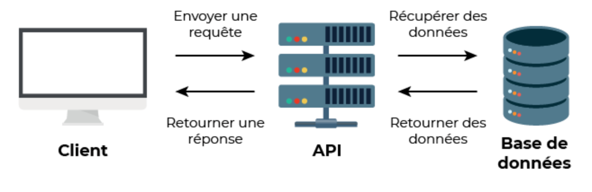



Les lien utiles pour la compréhension de celui-ci.


## Introduction
A travers ce MON j'ai pu découvrir le fonctionnement et les utilisations des API REST.
  J'ai donc suivi deux cours en ligne sur le sujet :
- Ce premier [cours](https://openclassrooms.com/fr/courses/6031886-debutez-avec-les-api-rest) qui permet de découvrir er débuter avec les API REST
- Et ce second [cours](https://openclassrooms.com/fr/courses/6573181-adoptez-les-api-rest-pour-vos-projets-web) qui forme sur les mises en application des API REST dans des projets web
  
## Sommaire
1. Qu'est-ce qu'une API ?
2. Fonctionnement d'une API REST
3. Inrégration dans des projets web
## 1. Qu'est-ce qu'une API ?
#### Définition
 API ou Application Programming Interface est une interface de programmation, c'est-à-dire un ensemble de classes, de fonctions et de méthodes qui servent de façade à un logiciel. D'autres logiciels pourront donc accéder aux services de ce logiciel grâce à cette interface.
 

#### Utilisation
L’API permet de faciliter la communication entre 2 produits ou services, comme par exemple une application et un service de géolocalisation. L’API permet à ces 2 entités d’échanger des données sans en connaître les détails de mise en œuvre. Elle permet donc un immense gain de temps pour les développeurs et un gain d’argent pour les entreprises.
  Il existe différents types d'API, par la suite nous allons nous focaliser sur l'API REST. 

## 2. Fonctionnement d'une API REST
#### Principes clés
REST est un type d'architecture qui signifie ***RE**presentational **S**tate **T**ransfer* et qui s'articule autour de 4 principes clés :
 
+ une ressource distribuée sur un serveur distant (mécanisme client-serveur)
+ un identifiant de la ressource (les URL et protocole HTTP)
+ des « verbes » HTTP non inclus dans l'URL permettant d’agir sur la ressource :
  + GET - Lire une ressource
  + POST - Créer une ressource
  + PUT - Modifier la valeur d'une ressource
  + DELETE - Supprimer une ressource 
+ une représentation de la ressource (la réponse peut avoir plusieurs représentations possibles : HTML, JSON, XML)
 
Ces principes permettent de structurer les interactions entre les clients (par exemple, des applications ou des navigateurs) et les serveurs en utilisant des requêtes HTTP. Le client envoie des requêtes au serveur en fonction des verbes HTTP et des URLs, et le serveur renvoie une réponse sous la forme d’une représentation de la ressource. Cette approche rend les APIs REST faciles à comprendre et à utiliser indépendamment des plateformes (Linux, Windows, ...) et langages (Python, Java, ...).
 
Il existe d'autres types d'API, comme SOAP (Simple Object Access Protocol), qui est un protocole plus strict basé sur XML pour échanger des données entre applications, mais REST est souvent privilégié en raison de sa simplicité, de son utilisation des standards web comme HTTP, et de sa flexibilité à s'adapter à différents formats de données tels que JSON ou XML, ce qui le rend plus léger et facile à implémenter dans la plupart des cas.

#### Confidentialité
#### Exemple de requête avec POSTMAN
## 3. Intégration dans un script Python
