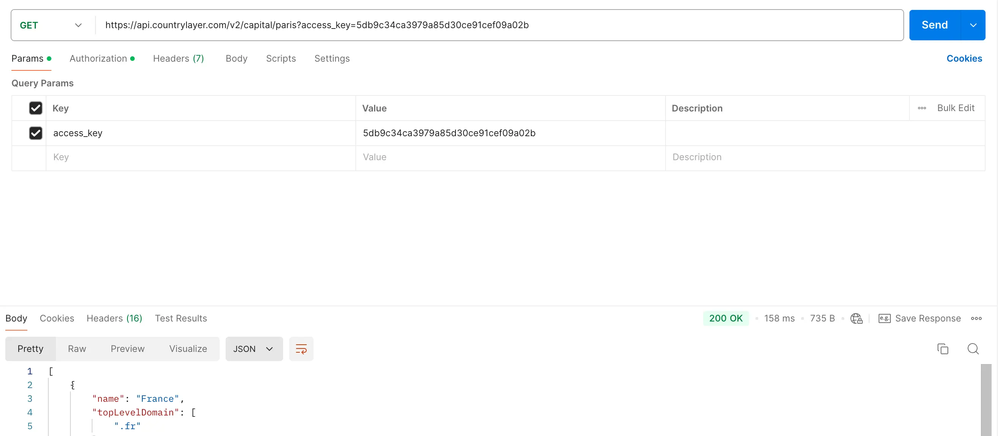

## Introduction
A travers ce MON j'ai pu découvrir le fonctionnement et les utilisations des API REST.
<br> J'ai donc suivi deux cours en ligne sur le sujet :
- Ce premier [cours](https://openclassrooms.com/fr/courses/6031886-debutez-avec-les-api-rest) qui permet de découvrir et débuter avec les API REST
- Et ce second [cours](https://openclassrooms.com/fr/courses/6573181-adoptez-les-api-rest-pour-vos-projets-web) qui forme sur les mises en application des API REST dans des projets web
  
## Sommaire
1. Qu'est-ce qu'une API ?
2. Fonctionnement d'une API REST
3. Intégration dans des projets web
## 1. Qu'est-ce qu'une API ?
#### Définition
 API ou Application Programming Interface est une interface de programmation, c'est-à-dire un ensemble de classes, de fonctions et de méthodes qui servent de façade à un logiciel. D'autres logiciels pourront donc accéder aux services de ce logiciel grâce à cette interface.
 <div></div>

#### Utilisation
L’API permet de faciliter la communication entre 2 produits ou services, comme par exemple une application et un service de géolocalisation. L’API permet à ces 2 entités d’échanger des données sans en connaître les détails de mise en œuvre. Elle permet donc un immense gain de temps pour les développeurs et un gain d’argent pour les entreprises.
<br> Il existe différents types d'API, par la suite nous allons nous focaliser sur l'API REST qui est la plus commune et facile d'utilisation.

## 2. Fonctionnement d'une API REST
#### Principes clés
REST est un type d'architecture qui signifie ***RE**presentational **S**tate **T**ransfer* et qui s'articule autour de 4 principes clés :
<br>
+ une ressource distribuée sur un serveur distant (mécanisme client-serveur)
+ un identifiant de la ressource (les URL et protocole HTTP)
+ des « verbes » HTTP non inclus dans l'URL permettant d’agir sur la ressource :
  + GET - Lire une ressource
  + POST - Créer une ressource
  + PUT - Modifier la valeur d'une ressource
  + DELETE - Supprimer une ressource 
+ une représentation de la ressource (la réponse peut avoir plusieurs représentations possibles : HTML, JSON, XML)
<br>
Ces principes permettent de structurer les interactions entre les clients (par exemple, des applications ou des navigateurs) et les serveurs en utilisant des requêtes HTTP. Le client envoie des requêtes au serveur en fonction des verbes HTTP et des URLs, et le serveur renvoie une réponse sous la forme d’une représentation de la ressource. Cette approche rend les APIs REST faciles à comprendre et à utiliser indépendamment des plateformes (Linux, Windows, ...) et langages (Python, Java, ...).
<br>
Il existe d'autres types d'API, comme SOAP (Simple Object Access Protocol), qui est un protocole plus strict basé sur XML pour échanger des données entre applications, mais REST est souvent privilégié en raison de sa simplicité, de son utilisation des standards web comme HTTP, et de sa flexibilité à s'adapter à différents formats de données tels que JSON ou XML, ce qui le rend plus léger et facile à implémenter dans la plupart des cas.

#### Sécurité

La sécurité est un enjeu crucial lorsqu'on utilise des API. Une API non sécurisée peut entraîner des fuites de données sensibles, comme les informations bancaires des clients, et rendre responsable l'utilisateur de l'API en cas de problème. Il est donc essentiel de choisir des API certifiées ou sécurisées, voire d'en acheter si nécessaire.

Dans un premier temps, il faut que l'API utilise le protocole HTTPS, comme c'est le cas pour l'API de CDiscount, qui est fiable et sécurisée, car utilisée en interne par l'entreprise. Enfin, avant d'intégrer une API dans un système il faut toujours la tester avec des outils comme POSTMAN.

#### Exemple de requête avec POSTMAN

Voici un exemple de requête avec POSTMAN, j'ai choisi l'API [countrylayer](https://countrylayer.com/documentation/) qui est libre d'accès. Pour la tester on regarde dans la documentation, par exemple il y a une requête qui nous donne le nom d'un pays en fonction de sa capitale. Avant de l'exécuter il faut générer une clé d'accès unique afin de s'authentifier lors de la requête. On peut désormais exécuter la requête :

<div></div>


## 3. Intégration dans un script Python
 
### Utilisation de l'API CountryLayer avec Python

#### Définition des variables globales

Nous définissons d'abord les variables globales nécessaires pour faire des requêtes à l'API CountryLayer. Cela inclut la clé d'API et l'URL de base de l'API.

```python
import requests

# Définition des variables globales
countrylayer_TOKEN = "5db9c34ca3979a85d30ce91cef09a02b"
countrylayer_URL = "https://api.countrylayer.com/v2"
```

Ensuite, en parcourant la documentation de countrylayer on peut regarder toutes les requêtes possbles avec les paramètres requis pour faire la requête.

#### Fonction pour obtenir des pays par capitale

La fonction `get_country_by_capital` permet de récupérer des informations sur les pays en utilisant le nom de leur capitale. Elle construit l'URL pour la requête et inclut la clé d'API dans les paramètres.

```python
# Fonction pour obtenir des pays par capitale
def get_country_by_capital(capital: str):
    url = f"{countrylayer_URL}/capital/{capital}"
    params = {
        "access_key": countrylayer_TOKEN
    }
    return requests.get(url, params=params)
```

#### Fonction pour obtenir des pays par devise

La fonction `get_country_by_currency` permet de rechercher des pays en fonction de leur devise. Elle utilise l'URL spécifique à cette recherche et inclut la clé d'API en paramètre.

```python
# Fonction pour obtenir des pays par devise
def get_country_by_currency(currency: str):
    url = f"{countrylayer_URL}/currency/{currency}"
    params = {
        "access_key": countrylayer_TOKEN
    }
    return requests.get(url, params=params)
```
#### Execution
On peut maintenant éxecuter les requêtes

```python
get_country_by_capital("paris").json()
```
```json
[{'name': 'France',
  'topLevelDomain': ['.fr'],
  'alpha2Code': 'FR',
  'alpha3Code': 'FRA',
  'callingCodes': ['33'],
  'capital': 'Paris',
  'altSpellings': ['FR', 'French Republic', 'République française'],
  'region': 'Europe'}]
```
On obtient bien la réponse *France* avec différents paramètres sur le pays.
```python
get_country_by_currency("usd")
```
```json
[{'name': 'American Samoa',
  'topLevelDomain': ['.as'],
  'alpha2Code': 'AS',
  'alpha3Code': 'ASM',
  'callingCodes': ['1'],
  'capital': 'Pago Pago',
  'altSpellings': ['AS', 'Amerika Sāmoa', 'Amelika Sāmoa', 'Sāmoa Amelika'],
  'region': 'Oceania'},
 {'name': 'Bonaire, Sint Eustatius and Saba',
  'topLevelDomain': ['.an', '.nl'],
  'alpha2Code': 'BQ',
  'alpha3Code': 'BES',
  'callingCodes': ['599'],
  'capital': 'Kralendijk',
  'altSpellings': ['BQ', 'Boneiru'],
  'region': 'Americas'},
 {'name': 'British Indian Ocean Territory',
  'topLevelDomain': ['.io'],
  'alpha2Code': 'IO',
  'alpha3Code': 'IOT',
  'callingCodes': ['246'],
  'capital': 'Diego Garcia',
  'altSpellings': ['IO'],
  'region': 'Africa'},
 {'name': 'United States Minor Outlying Islands',
  'topLevelDomain': ['.us'],
  'alpha2Code': 'UM',
  'alpha3Code': 'UMI',
  'callingCodes': ['1'],
  'capital': '',
  'altSpellings': ['UM'],
  'region': 'Americas'},
 {'name': 'Virgin Islands (British)',
  'topLevelDomain': ['.vg'],
  'alpha2Code': 'VG',
  'alpha3Code': 'VGB',
  'callingCodes': ['1'],
  'capital': 'Road Town',
  'altSpellings': ['VG'],
  'region': 'Americas'},
 {'name': 'Virgin Islands (U.S.)',
  'topLevelDomain': ['.vi'],
  'alpha2Code': 'VI',
  'alpha3Code': 'VIR',
  'callingCodes': ['1 340'],
  'capital': 'Charlotte Amalie',
  'altSpellings': ['VI',
   'USVI',
   'American Virgin Islands',
   'U.S. Virgin Islands'],
  'region': 'Americas'},
 {'name': 'Cambodia',
  'topLevelDomain': ['.kh'],
  'alpha2Code': 'KH',
  'alpha3Code': 'KHM',
  'callingCodes': ['855'],
  'capital': 'Phnom Penh',
  'altSpellings': ['KH', 'Kingdom of Cambodia'],
  'region': 'Asia'},
 {'name': 'Ecuador',
  'topLevelDomain': ['.ec'],
  'alpha2Code': 'EC',
  'alpha3Code': 'ECU',
  'callingCodes': ['593'],
  'capital': 'Quito',
  'altSpellings': ['EC', 'Republic of Ecuador', 'República del Ecuador'],
  'region': 'Americas'},
 {'name': 'El Salvador',
  'topLevelDomain': ['.sv'],
  'alpha2Code': 'SV',
  'alpha3Code': 'SLV',
  'callingCodes': ['503'],
  'capital': 'San Salvador',
  'altSpellings': ['SV',
   'Republic of El Salvador',
   'República de El Salvador'],
  'region': 'Americas'},
 {'name': 'Guam',
  'topLevelDomain': ['.gu'],
  'alpha2Code': 'GU',
  'alpha3Code': 'GUM',
  'callingCodes': ['1'],
  'capital': 'Hagåtña',
  'altSpellings': ['GU', 'Guåhån'],
  'region': 'Oceania'},
 {'name': 'Marshall Islands',
  'topLevelDomain': ['.mh'],
  'alpha2Code': 'MH',
  'alpha3Code': 'MHL',
  'callingCodes': ['692'],
  'capital': 'Majuro',
  'altSpellings': ['MH',
   'Republic of the Marshall Islands',
   'Aolepān Aorōkin M̧ajeļ'],
  'region': 'Oceania'},
 {'name': 'Micronesia (Federated States of)',
  'topLevelDomain': ['.fm'],
  'alpha2Code': 'FM',
  'alpha3Code': 'FSM',
  'callingCodes': ['691'],
  'capital': 'Palikir',
  'altSpellings': ['FM', 'Federated States of Micronesia'],
  'region': 'Oceania'},
 {'name': 'Northern Mariana Islands',
  'topLevelDomain': ['.mp'],
  'alpha2Code': 'MP',
  'alpha3Code': 'MNP',
  'callingCodes': ['1'],
  'capital': 'Saipan',
  'altSpellings': ['MP',
   'Commonwealth of the Northern Mariana Islands',
   'Sankattan Siha Na Islas Mariånas'],
  'region': 'Oceania'},
 {'name': 'Palau',
  'topLevelDomain': ['.pw'],
  'alpha2Code': 'PW',
  'alpha3Code': 'PLW',
  'callingCodes': ['680'],
  'capital': 'Ngerulmud',
  'altSpellings': ['PW', 'Republic of Palau', 'Beluu er a Belau'],
  'region': 'Oceania'},
 {'name': 'Panama',
  'topLevelDomain': ['.pa'],
  'alpha2Code': 'PA',
  'alpha3Code': 'PAN',
  'callingCodes': ['507'],
  'capital': 'Panama City',
  'altSpellings': ['PA', 'Republic of Panama', 'República de Panamá'],
  'region': 'Americas'},
 {'name': 'Puerto Rico',
  'topLevelDomain': ['.pr'],
  'alpha2Code': 'PR',
  'alpha3Code': 'PRI',
  'callingCodes': ['1'],
  'capital': 'San Juan',
  'altSpellings': ['PR',
   'Commonwealth of Puerto Rico',
   'Estado Libre Asociado de Puerto Rico'],
  'region': 'Americas'},
 {'name': 'Timor-Leste',
  'topLevelDomain': ['.tl'],
  'alpha2Code': 'TL',
  'alpha3Code': 'TLS',
  'callingCodes': ['670'],
  'capital': 'Dili',
  'altSpellings': ['TL',
   'East Timor',
   'Democratic Republic of Timor-Leste',
   'República Democrática de Timor-Leste',
   'Repúblika Demokrátika Timór-Leste'],
  'region': 'Asia'},
 {'name': 'Turks and Caicos Islands',
  'topLevelDomain': ['.tc'],
  'alpha2Code': 'TC',
  'alpha3Code': 'TCA',
  'callingCodes': ['1'],
  'capital': 'Cockburn Town',
  'altSpellings': ['TC'],
  'region': 'Americas'},
 {'name': 'United States of America',
  'topLevelDomain': ['.us'],
  'alpha2Code': 'US',
  'alpha3Code': 'USA',
  'callingCodes': ['1'],
  'capital': 'Washington, D.C.',
  'altSpellings': ['US', 'USA', 'United States of America'],
  'region': 'Americas'},
 {'name': 'Zimbabwe',
  'topLevelDomain': ['.zw'],
  'alpha2Code': 'ZW',
  'alpha3Code': 'ZWE',
  'callingCodes': ['263'],
  'capital': 'Harare',
  'altSpellings': ['ZW', 'Republic of Zimbabwe'],
  'region': 'Africa'}]
  ```
  Ici, on obtient la liste des pays ayant le dollar comme monnaie mais ce résultat est pollué par tous les paramètres, on va chercher à obtenir la liste de ces pays :

  ```python
  dollar = get_country_by_currency("usd").json()
  [dollar[k]['name'] for k in range(len(dollar))]
  ```

  ```python
  ['American Samoa',
 'Bonaire, Sint Eustatius and Saba',
 'British Indian Ocean Territory',
 'United States Minor Outlying Islands',
 'Virgin Islands (British)',
 'Virgin Islands (U.S.)',
 'Cambodia',
 'Ecuador',
 'El Salvador',
 'Guam',
 'Marshall Islands',
 'Micronesia (Federated States of)',
 'Northern Mariana Islands',
 'Palau',
 'Panama',
 'Puerto Rico',
 'Timor-Leste',
 'Turks and Caicos Islands',
 'United States of America',
 'Zimbabwe']
 ```

Cette application n'était qu'un exemple illustrant l'intégration d'une API REST dans un script Python. Selon les besoins spécifiques d'un projet, des recherches ainsi que le parcours des documentations peuvent aider à trouver une API adaptée. 
## Conclusion

Au cours de ce MON j'ai pu apprendre les fondamentaux des API REST ainsi que leur utilisation à travers l'API CountryLayer et des exemples pratiques en Python. L'intégration d'API REST simplifie la récupération et l'analyse des données facilitant ainsi leurs utilisations. Pour le sprint 2 de mon POK, je prévois d'intégrer une API REST en VBA dans Excel afin d'en explorer les manipulations avec ce langage.