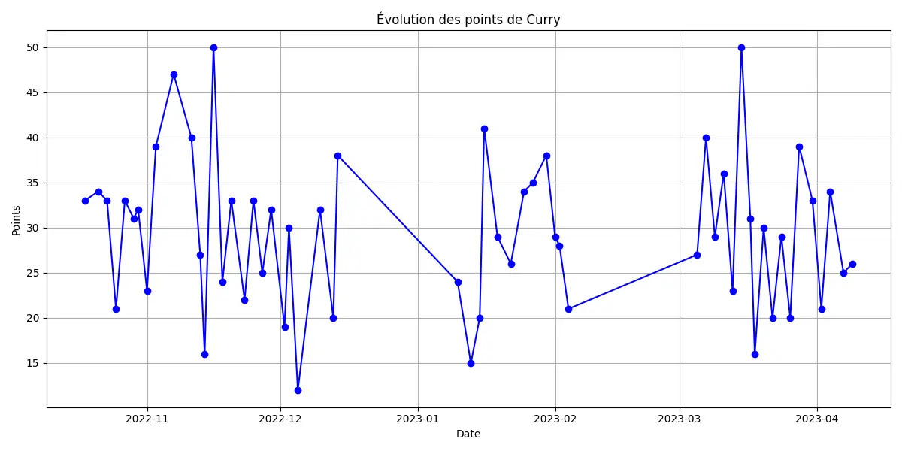
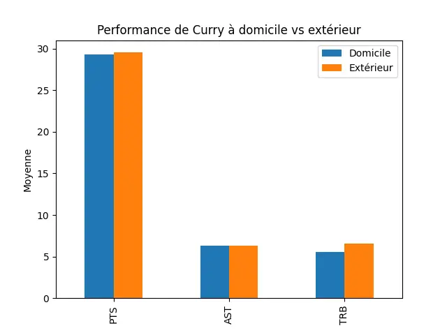
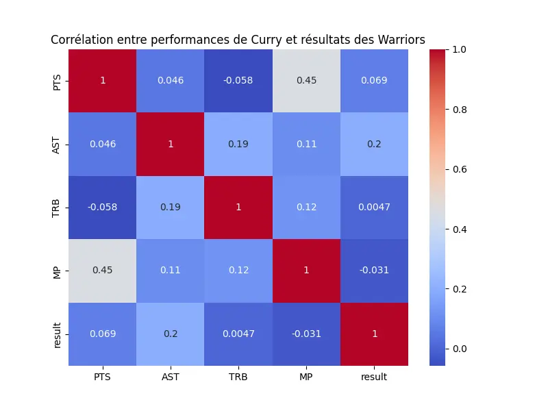
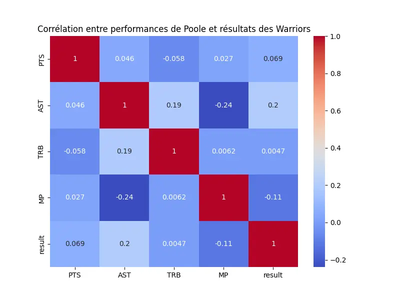
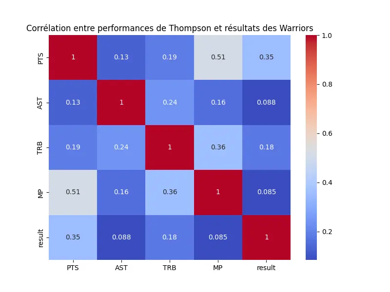



* [Real python](https://realpython.com/python-for-data-analysis/)
* [sklearn](https://scikit-learn.org/stable/)




## Introduction

A travers ce MON, je souhaitait apprendre à manipuler et analyser des données sur python. Après quelques recherches notamment sur le site [Real python](https://realpython.com/python-for-data-analysis/) et sur Youtube je me suis lancer dans l'analyse des données de l'équipe de basketball de Golden State lors de la saison 2022/2023 et plus particulièrement de l'influence d'un joueur sur son équipe : Stephen Curry.

##  Sommaire

1. Importation des données
2. Nettoyage des données
3. Performances de Curry
4. Influence de Curry sur les performances de son équipe
5. Comparaison avec d'autres joueurs
6. Modélisation prédictive des résultats des Warriors

## 1. Importation des données

Pour faire ces analyses, il me fallait les statistiques de tous les matchs des Golden State Warriors los de la saison 2022/2023 ainsi que ceux des joueurs de l'effectif. Après quelques recherches, j'ai trouvé le site [Basketball Reference](https://www.basketball-reference.com) qui contient toutes ces données et bien plus encore. J'ai donc récupérer et téléchargé ces données pour commencer le projet.

```python
import panda as pd

warriors_data = pd.read_excel('GSW_season.xlsx')
curry_data = pd.read_csv('Regular_curry.csv')

# Aperçu des données
print("Données des Warriors :")
print(warriors_data.head())
print("\nDonnées de Stephen Curry :")
print(curry_data.head())
```
On joint maintenant les deux tables en utilisant la date comme clé primaire avant de passer aux nettoyage des données.

```python
curry_data['Date'] = pd.to_datetime(curry_data['Date'])
warriors_data['game_date'] = pd.to_datetime(warriors_data['game_date'])

merged_data = pd.merge(warriors_data, curry_data, left_on='game_date', right_on='Date', how='inner')
merged_data.head()
```

## 2. Nettoyage des données

Dans cette partie nous allons nettoyer les données afin d'en faciliter la manipulation. Certaines colonnes contiennent des éléments de types $string$ ce qui peut compromettre certains calculs, pour les matchs où Curry ne joue pas nous allons remplacer *'Inactive'* par *'Nan'* afin de pouvoir calculer les corrélations entre ses performances et celles de son équipe. De plus, ces calculs sont possible seulement avec des float on va donc remplacer les *'W'* et *'L'* qui signifient victoire ou défaite par des booléens, 1 pour une Win et 0 pour une Loose.

```python
merged_data['PTS'] = merged_data['PTS'].replace('Inactive', np.nan)
merged_data['AST'] = merged_data['AST'].replace('Inactive', np.nan)
merged_data['TRB'] = merged_data['TRB'].replace('Inactive', np.nan)

merged_data['wl_home'] = merged_data['wl_home'].replace({'W': 1, 'L': 0})
merged_data['wl_away'] = merged_data['wl_away'].replace({'W': 1, 'L': 0})

# Fonction pour convertir 'MM:SS' en minutes, avec gestion des valeurs comme 'Inactive'
def convert_to_minutes(time_str):
    try:
        if isinstance(time_str, str) and ':' in time_str:
            minutes, seconds = map(int, time_str.split(':'))
            return minutes + seconds / 60
        else:
            return 0  # Si le joueur est inactif ou la valeur est invalide
    except ValueError:
        return 0  # Si la valeur est autre que du texte attendu ou format erroné

# Appliquer cette fonction sur la colonne 'MP'
merged_data['MP'] = merged_data['MP'].apply(convert_to_minutes)
```
Nous avons également besoin d'une colonne qui nous donne les résultats des Warriors.

```python
result = [0]*len(merged_data['wl_home'])
for k in range(len(result)):
  if merged_data['team_abbreviation_home'][k] == 'GSW' :
    result[k] = merged_data['wl_home'][k]
  else :
    result[k] = merged_data['wl_away'][k]

merged_data['result'] = result
merged_data.head()
```

Enfin, nous ajoute au tableau le nombre de points marqués par l'équipe.

```python
points = [0]*len(merged_data['pts_home'])
for k in range(len(points)) :
  if merged_data['team_abbreviation_home'][k] == 'GSW' :
    points[k] = merged_data['pts_home'][k]
  else :
    points[k] = merged_data['pts_away'][k]

merged_data['points'] = points
```

## 3. Performances de Curry

Dans cette partie nous allons simplement visualiser les performances du joueur tout au long de la saison. Pour le premier graphe on regarde l'évolution des points du joueur sur la saison.

```python
# On prend seulement les matchs où Curry a joué

curry_played = merged_data[merged_data['MP'] > 0]
curry_played['PTS'] = pd.to_numeric(curry_played['PTS'], errors='coerce')
curry_played = curry_played.sort_values(by='game_date')


Y = curry_played['PTS']
X = curry_played['game_date']


plt.figure(figsize=(12, 6))
plt.plot(X, Y, marker='o', linestyle='-', color='blue')  # Ajout de marqueurs pour chaque point
plt.xlabel('Date')
plt.ylabel('Points')
plt.title('Évolution des points de Curry')
plt.grid()  # Ajout d'une grille pour faciliter la lecture
plt.tight_layout()  # Ajuste la mise en page pour éviter le chevauchement
plt.show()
```
 <div></div>

Le graphe suivant permet de faire une distinction entre les performances à domicile et à l'exterieur afin de savoir si ce paramètre à une influence sur le joueur.

```python
home_games = merged_data[merged_data['team_abbreviation_home'] == 'GSW']
away_games = merged_data[merged_data['team_abbreviation_away'] == 'GSW']

# Conversion des données en float
home_games[['PTS', 'AST', 'TRB']] = home_games[['PTS', 'AST', 'TRB']].apply(pd.to_numeric, errors='coerce')
away_games[['PTS', 'AST', 'TRB']] = away_games[['PTS', 'AST', 'TRB']].apply(pd.to_numeric, errors='coerce')

# Calcul des moyennes
home_avg = home_games[['PTS', 'AST', 'TRB']].mean()
away_avg = away_games[['PTS', 'AST', 'TRB']].mean()

comparison = pd.DataFrame({'Domicile': home_avg, 'Extérieur': away_avg})

comparison.plot(kind='bar')
plt.title("Performance de Curry à domicile vs extérieur")
plt.ylabel("Moyenne")
plt.show()
```
 <div></div>

Au vu de ces derniers résultats, on peut conclure que les statistiques du joueurs ont été constante cette saison et surtout les lieux de matchs n'ont eux aucun impacte sur lui.

## 4. Influence de Curry sur les performances de son équipe

Nous allons visualiser dans cette partie la matrice de corrélation entre les performances de Stephen Curry (points, passes décisives, rebonds, minutes jouées) et les résultats des Warriors (victoires ou défaites)

```python
correlation = merged_data[['PTS', 'AST', 'TRB', 'MP', 'result']].corr()

plt.figure(figsize=(8, 6))
sns.heatmap(correlation, annot=True, cmap="coolwarm")
plt.title("Corrélation entre performances de Poole et résultats des Warriors")
plt.show()
```
 <div></div>

#### Analyse des corrélations :
- **Points (PTS) et Victoires (result)** : La corrélation entre les points de Curry et les victoires des Warriors est faible (0.069), ce qui indique que le nombre de points marqués par Curry n'a pas un impact direct sur les résultats de l'équipe.
- **Passes décisives (AST) et Victoires (result)** : Une corrélation plus forte (0.202) est observée entre les passes décisives de Curry et les victoires, suggérant que la capacité de Curry à faire des passes contribue davantage aux succès de l'équipe.
- **Minutes jouées (MP) et Victoires (result)** : Étonnamment, la corrélation entre les minutes jouées et les victoires est légèrement négative (-0.031), ce qui peut signifier que le simple fait que Curry passe plus de temps sur le terrain ne garantit pas toujours une victoire.
- **Autres corrélations** : Les corrélations entre les rebonds (TRB) et les victoires sont quasiment nulles (0.004), soulignant que les rebonds de Curry n'influencent pas significativement le résultat du match.

Dans la suite, nous allons comparer ces résultats avec ceux de deux autres joueurs clés des Warriors pour mieux comprendre l'impact des différentes contributions individuelles sur les victoires de l'équipe. Cela permettra de voir comment les performances collectives influencent les résultats.

## 5. Comparaison avec d'autres joueurs

Après avoir récupéré les données de deux autres joueurs majeurs de l'équipe (Jordan Poole et Klay Thompson) sur le même site [Basketball Reference](https://www.basketball-reference.com), j'ai effectué les mêmes manipulations sur leurs statistiques et voici les matrices obtenues :

 <div></div>
 <div></div>

#### Analyse

Poole et Thompson, montrent des corrélations plus importantes (surtout Thompson) dans des aspects du jeu qui impactent directement les résultats des matchs, notamment les points de Thompson et les passes de Poole. Curry, en tant que joueur constant semble moins "déterminant" dans les victoires ce qui s'explique par le fait que son niveau est toujours élevé. 

En résumé, bien que Curry soit essentiel pour la stabilité de l’équipe, les victoires des Warriors semblent davantage liées aux performances de Poole et surtout Thompson.

## 6. Modélisation prédictive des résultats des Warriors

Dans cette partie j'ai voulu m'iintéresser au Machine Learning et plus particulièrement aux méthodes de modélisation prédictive, c'est à dire qu'avec un jeu de donnée dites "d'entrainement", on va pouvoir prédir le reste des données dites de "test". Ici, pour déterminer encore une fois l'influence de curry sur les performances de son équipe nous allons utiliser différentes méthodes de la bibliothèque [sklearn](https://scikit-learn.org/stable/) afin de voir à partir des performances de Curry à quel point on peut prédire le résultat du match.

```python
from sklearn.model_selection import train_test_split
from sklearn.ensemble import RandomForestClassifier, GradientBoostingClassifier
from sklearn.linear_model import LogisticRegression
from sklearn.svm import SVC
from sklearn.tree import DecisionTreeClassifier
from sklearn.neighbors import KNeighborsClassifier
from sklearn.metrics import accuracy_score


features = curry_played[['PTS', 'AST', 'TRB', 'FG%', '3P%']]
labels = curry_played['result']

# Séparation des données en données d'entraînements et de tests
X_train, X_test, y_train, y_test = train_test_split(features, labels, test_size=0.2, random_state=42)


score = {}

# Modèle de régression logistique
logistic_model = LogisticRegression(max_iter=200)
logistic_model.fit(X_train, y_train)
y_pred_logistic = logistic_model.predict(X_test)
accuracy_logistic = accuracy_score(y_test, y_pred_logistic)
score['Régression Logistique'] = accuracy_logistic

# Modèle SVM
svm_model = SVC()
svm_model.fit(X_train, y_train)
y_pred_svm = svm_model.predict(X_test)
accuracy_svm = accuracy_score(y_test, y_pred_svm)
score['SVM'] = accuracy_svm

# Modèle d'arbre de décision
decision_tree_model = DecisionTreeClassifier()
decision_tree_model.fit(X_train, y_train)
y_pred_tree = decision_tree_model.predict(X_test)
accuracy_tree = accuracy_score(y_test, y_pred_tree)
score['Arbre de Décision'] = accuracy_tree

# Modèle KNN
knn_model = KNeighborsClassifier(n_neighbors=5)
knn_model.fit(X_train, y_train)
y_pred_knn = knn_model.predict(X_test)
accuracy_knn = accuracy_score(y_test, y_pred_knn)
score['KNN'] = accuracy_knn

# Modèle de Random Forest
rf_model = RandomForestClassifier()
rf_model.fit(X_train, y_train)
y_pred_rf = rf_model.predict(X_test)
accuracy_rf = accuracy_score(y_test, y_pred_rf)
score['Random Forest'] = accuracy_rf

# Modèle de Gradient Boosting
gb_model = GradientBoostingClassifier()
gb_model.fit(X_train, y_train)
y_pred_gb = gb_model.predict(X_test)
accuracy_gb = accuracy_score(y_test, y_pred_gb)
score['Gradient Boosting'] = accuracy_gb

# Affichage des précisions des modèles
for model, accuracy in score.items():
    print(f"Précision du modèle {model} : {accuracy * 100:.2f}%")
```
- Précision du modèle Régression Logistique : 41.67%
- Précision du modèle SVM : 41.67%
- Précision du modèle Arbre de Décision : 58.33%
- Précision du modèle KNN : 41.67%
- Précision du modèle Random Forest : 41.67%
- Précision du modèle Gradient Boosting : 58.33%

#### Commentaires

On voit ici que les meilleurs résultats sont obtenus par les méthodes arbres de décision, Random Forest et Gradient Boosting avec un taux de prédiction de 58,33% ce qui reste assez faible. Ces scores renforce ce que montrait la matrice de corrélations entre les performances de Curry et les résultats de son équipe.

Regardons quel score nous obtenons avec les performances de Thompson qui sempleit être plus déterminant dans les victoires de son équipe :

```python
thompson_played = merged_data_thompson[merged_data_thompson['MP'] > 0]
thompson_played['PTS'] = pd.to_numeric(thompson_played['PTS'], errors='coerce')
thompson_played = thompson_played.sort_values(by='game_date')


features = thompson_played[['PTS', 'AST', 'TRB', 'FG%', '3P%']]
labels = thompson_played['result']


X_train, X_test, y_train, y_test = train_test_split(features, labels, test_size=0.2, random_state=42)


thompson_score = {}

# Modèle de régression logistique
logistic_model = LogisticRegression(max_iter=200)
logistic_model.fit(X_train, y_train)
y_pred_logistic = logistic_model.predict(X_test)
accuracy_logistic = accuracy_score(y_test, y_pred_logistic)
thompson_score['Régression Logistique'] = accuracy_logistic

# Modèle SVM
svm_model = SVC()
svm_model.fit(X_train, y_train)
y_pred_svm = svm_model.predict(X_test)
accuracy_svm = accuracy_score(y_test, y_pred_svm)
thompson_score['SVM'] = accuracy_svm

# Modèle d'arbre de décision
decision_tree_model = DecisionTreeClassifier()
decision_tree_model.fit(X_train, y_train)
y_pred_tree = decision_tree_model.predict(X_test)
accuracy_tree = accuracy_score(y_test, y_pred_tree)
thompson_score['Arbre de Décision'] = accuracy_tree

# Modèle KNN
knn_model = KNeighborsClassifier(n_neighbors=5)
knn_model.fit(X_train, y_train)
y_pred_knn = knn_model.predict(X_test)
accuracy_knn = accuracy_score(y_test, y_pred_knn)
thompson_score['KNN'] = accuracy_knn

# Modèle de Random Forest
rf_model = RandomForestClassifier()
rf_model.fit(X_train, y_train)
y_pred_rf = rf_model.predict(X_test)
accuracy_rf = accuracy_score(y_test, y_pred_rf)
thompson_score['Random Forest'] = accuracy_rf

# Modèle de Gradient Boosting
gb_model = GradientBoostingClassifier()
gb_model.fit(X_train, y_train)
y_pred_gb = gb_model.predict(X_test)
accuracy_gb = accuracy_score(y_test, y_pred_gb)
thompson_score['Gradient Boosting'] = accuracy_gb

for model, accuracy in thompson_score.items():
    print(f"Précision du modèle {model} : {accuracy * 100:.2f}%")
```
- Précision du modèle Régression Logistique : 50.00%
- Précision du modèle SVM : 50.00%
- Précision du modèle Arbre de Décision : 57.14%
- Précision du modèle KNN : 71.43%
- Précision du modèle Random Forest : 42.86%
- Précision du modèle Gradient Boosting : 28.57%

Pour Thompson, les résultats entre les différentes méthodes sont beaucoup plus hétérogène mais avec la méthode des k plus proches voisins (KNN) le score est de 71,43% ce qui est bien plus que pour son coéquipier. Là encore, les résultats mettent en avant le caractère déterminant des performances du joueur sur son équipe.

## Conclusion

En conclusion, ce projet m’a permis de découvrir l’analyse de données avec Python et d’explorer différentes méthodes de modélisation prédictive. En appliquant ces techniques à des données sportives. Avec davantage de statistiques, notamment celles des autres joueurs de l’équipe, il serait possible de réaliser des analyses plus poussées, comme, par exemple, l'optimisation du temps de jeu pour maximiser les performances collectives des Warriors.
