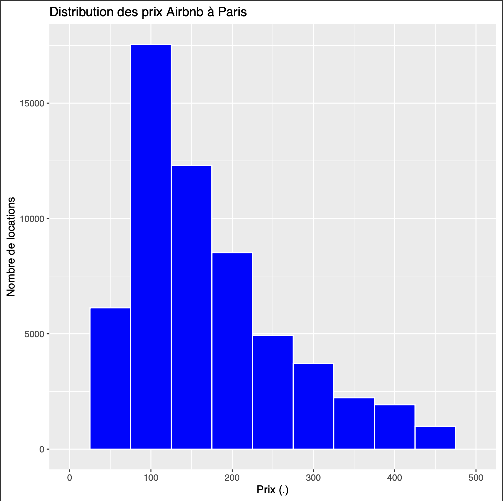
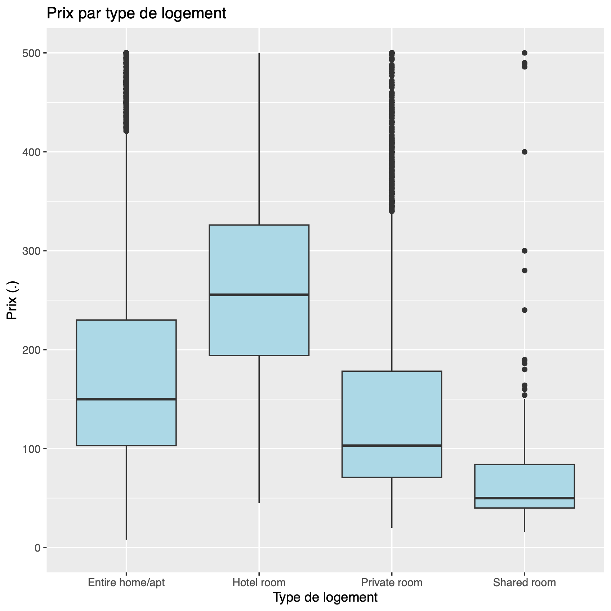
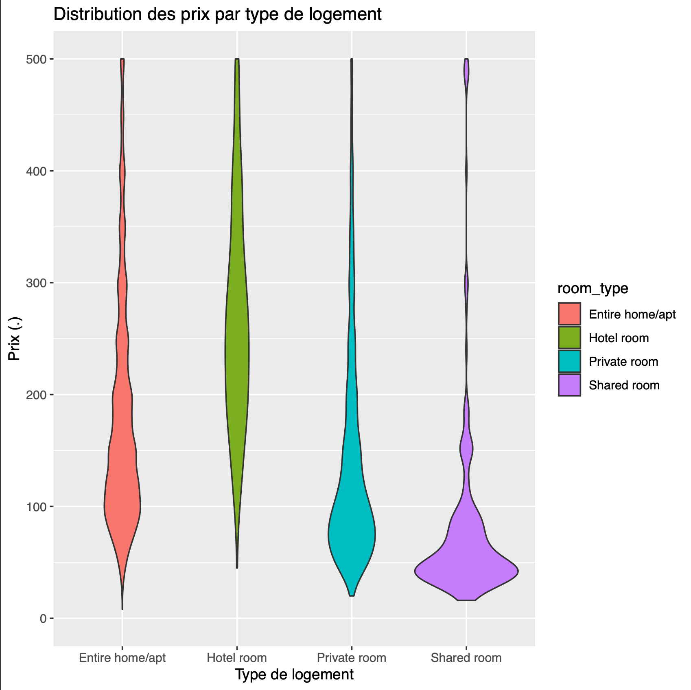
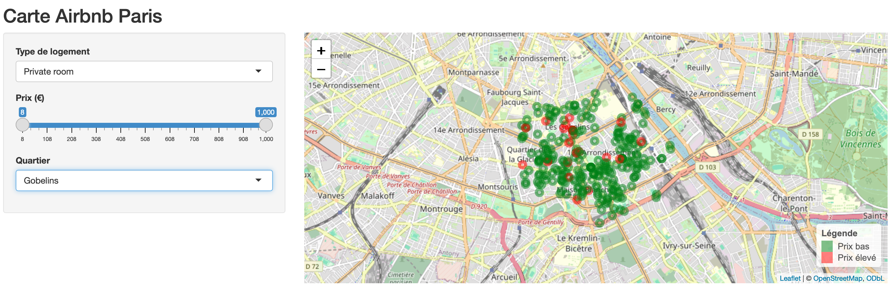



Aucun prérequis




- [Site du MTECT](https://mtes-mct.github.io/parcours_r_socle_introduction/)
- [Inside Airbnb](https://insideairbnb.com/get-the-data/)
- [Mon Github](https://github.com/baptiste7905/MON.2.2)



A travers ce mode j'ai voulu découvrir **R** qui est un langage de programmation important et connu dans le monde de l'analyse de données et des statistiques. Après m'être documenté sur le Github du ministère j'ai chercher un type de données sur lesquelles je pouvais m'exercer et j'ai trouvé le site [Inside Airbnb](https://insideairbnb.com/get-the-data/) qui fournit tous types de données sur les offres postées sur le site **Airbnb**.J'ai donc cécidéde travailler sur les données des offres à Paris et de visualiser des données de prix, de types de logement et de localisation à l'aide de tableaux, graphiques et cartes. 

## Sommaire
  
  1. **Chargement et nettoyage des données**
  2. **Manipulation des données**
  3. **Visualisation des données**
  4. **Création de cartes avec la librairie *leaflet* and *shiny***

### 1. Chargement et nettoyage des données

Dans cette première partie j'ai chargé les données *.csv* des annonces à Paris sur le site ['Inside Airbnb'](https://insideairbnb.com/get-the-data/). Ensuite, à l'aide de la librairie de base de manipulations de données *dplyr*, j'ai supprimé les colonnes inutile à mon analyse et j'ai convertit certaines données comme les prix et les textes au bon format. 
Maintenant, avec ce nouveau dataset nettoyé, nous pouvons passer à la suite.





### 2. Manipulation des données

Dans un premier temps j'ai voulu créer  desnouveaux tableaux qui vont nous données des détails sur les données, comme si on faisait des requêtes. J'ai pu générer des tableaux comme les prix moyens par quartiers, les prix par types de logements ou encore les nombre d'annonces et prix moyen par types de chambre et quartier.

### 3. Visualisation des données

Dans cette  partiej'ai voulu me familiariser avec la librairie *ggplot2* qui permet de visualiser les données à partir de graphiques. 
Ci-dessous un histogramme des prix des offres à Paris ainsi que la répartition des prix en fonction des types de logement sous deux formes  différentes :

### 4. Création de cartes avec la librairie *leaflet* and *shiny*

Enfin, au cours de mes recherches sur les différentes libraires R j'ai trouvé la librairie *leaflet* qui permet de visualiser des données géographiques sur des cartes en créant des fichers .html.
Voici le résultat d'un graphique indiquant toutes les offres disponibles avec en vert les logements les moins chers et en rouge les plus chers : 

Cette carte n'étant pas très visible j'ai voulu en créer une plus complète et interactives avec des filtres sur les prix, types d'offres et quartiers. J'ai alors trouvé la librairie *shiny* qui permet de créer des interfaces interactives avec des filtres et voici le résultat, par exemple ici, pour les *private room* du quartiers des Gobelins : 

### 5. Conclusion

Ce projet m’a permis de découvrir **R** et ses principales librairies pour manipuler, visualiser et cartographier des données. J’ai exploré les prix moyens par quartiers et types de logements avec des tableaux, graphiques et cartes interactives. 

J’ai aussi essayé d’appliquer des **modèles de machine learning** pour prédire les prix, mais les résultats n’étaient pas très parlants. Des jeux de données plus adaptés seraient nécessaires pour aller plus loin.