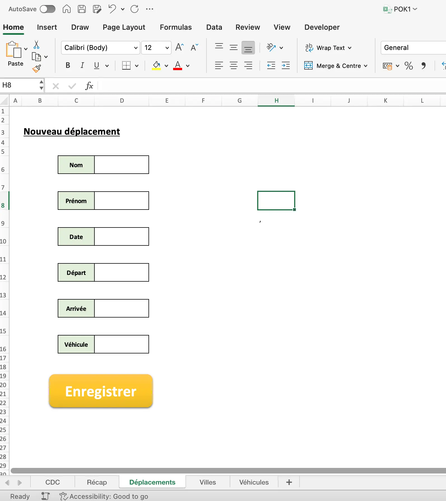
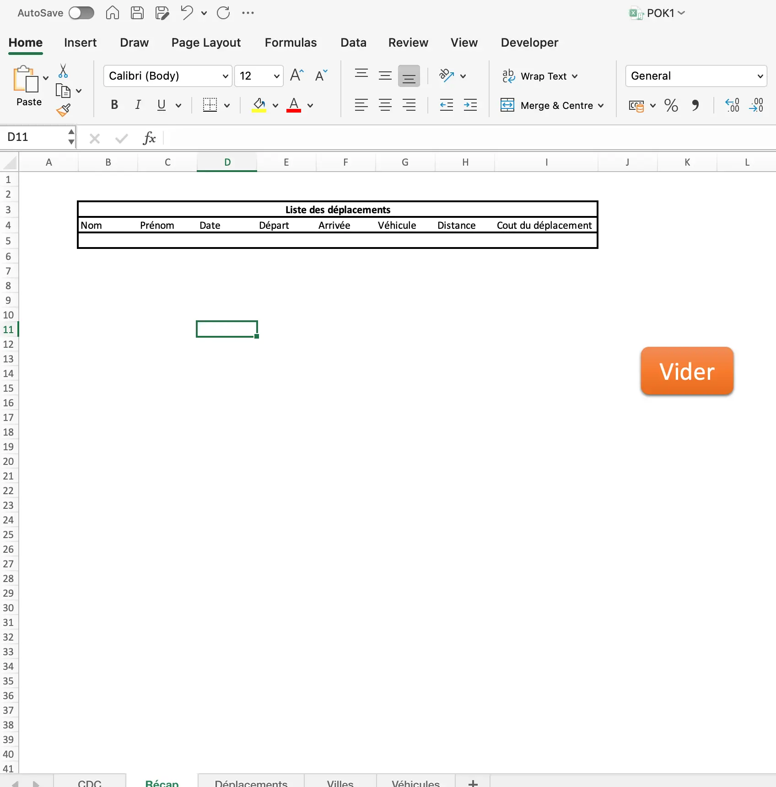


- Connaissances de base en Excel
- Ce POK est très peu compatible avec les mac



[Excel pratique](https://excel-pratique.com)
[Bases de données véhiculaires](https://voiture.car2db.com) 
[Bases de données géographiques](https://www.data.gouv.fr/fr/datasets/villes-de-france/#/resources)
[API Open Route Service](https://openrouteservice.org)



J'aimerai à travers se POK me former au langage VBA qui est très souvent utilisé en entreprise.
En mise en application j'aimerai créer un outil permettant aux commerciaux d'une entreprise de calculer les coûts de leurs déplacements afin de créer des notes de frais. 
## Tâches
##### Sprint 1 :
- [ ] Découvrir et me former en VBA *(Temps estimé : 4h)*
- [ ] Définir le visuel et les fonctionnalités du rendu final *(Temps estimé : 1h)*
- [ ] Ecrire une première version du code avec les éléments de base *(Temps estimé : 4h)* 
- [ ] Tester les fonctionnalités et réfléchir à des améliorations à réaliser lors du second sprint *(Temps estimé : 1h)*

##### Sprint 2 :
- [ ] Définir les améliorations à implémenter *(Temps estimé : 1h)*
- [ ] Améliorer et compléter l'outil avec les améliorations définies *(Temps estimé : 2h30)*
- [ ] Appliquer les connaissances acquises lors du MON 1 avec une connexion API REST *(Temps estimé : 5h)* 
- [ ] Documenter le projet et préparer la présentation finale *(Temps estimé : 1h30)*
## Premier Sprint : découverte de VBA et première version de l'outil
###  Horodatage  :
Dans ce premier sprint j'ai pu réaliser toutes les tâches prévues pour une durée d'environ dix heures :
| Tâches | Heures passées | Heures prévues |
| -------- | -------- |-------- |
| Découvrir et me former en VBA | 4h | 4h |
| Définir le visuel et les fonctionnalités du rendu final | 2h | 1h |
| Ecrire une première version du code avec les éléments de base | 3h30 | 4h |
| Tester les fonctionnalités et réfléchir à des améliorations à réaliser lors du second sprint | 45min | 1h |

### 1. Formation VBA
J'ai commencé ce sprint par me documenter et me former en VBA. J'avais déjà utilisé des fichiers Excel avec des macro mais sans coder et apprendre ce langage. J'ai donc suivi les cours du site [Excel pratique](https://excel-pratique.com) sur les [variables](https://excel-pratique.com/fr/vba/variables), les [boucles](https://excel-pratique.com/fr/vba/boucles) mais aussi sur les [UserForm](https://excel-pratique.com/fr/formation/creation_userform) avant de découvrir que ceux-ci n'étaient pas disponible sur mac...
### 2. Définitions des fonctionnalités de la premiere version
Voici les différents points que j'ai retenu durant cette seconde tâche pour définir les premières fonctionnalités :
* Formulaire avec les champs nom, prénom, date, ville de départ, ville d'arrivée, véhicule.
* Utilisation de deux bases de données :
  * Véhicules : utilisation de cette [base de données](https://voiture.car2db.com) qui permet de répertorier plus d'une centaine de véhicules avec leur type de carburant ainsi que leur consommation en vue des calculs de frais de déplacements.
  * Villes de France avec les coordonnées : utilisation des [données](https://www.data.gouv.fr/fr/datasets/villes-de-france/#/resources) disponibles sur le site du gouvernement.
### 3. Première version
La première version de l'outil utilise deux feuilles Excel, une feuille *Déplacements* où l'utilisateur remplis ses déplacements et une seconde feuille *Récap* qui récapitule tous les déplacements :
<div>
  
  
</div>

Le bouton *Enregistrer*fait référence à la première macro du projet qui, lors d'un clique, va remplir le tableau sur la page Récap en ajoutant une ligne et en la remplissant suivant les données entrées dans le formulaire.
Voici une explication détaillée du code VBA en utilisant un format Markdown :
Ce code est coposé d'une macro principale `new_drive` qui utilise également une autre macro que j'ai créé `add_empty_row`. 

#### `Sub add_empty_row()`
Ce code ajoute une ligne vide en dessous de la dernière ligne non-vide dans le tableau de la feuille `Récap`.
- **Déclaration des variables** :  
  - `ligne` est un entier long qui permet de parcourir les lignes de la feuille.
  - `feuille` est un objet représentant la feuille `Récap`.
  - `r_min` stocke la première ligne vide trouvée.

```vba
Dim ligne As Long
Dim feuille As Worksheet
Dim r_min As Long
Set feuille = Sheets("Récap")
```
- **Insertion d'une nouvelle ligne en bas de tableau'** :  
  Le programme parcourt le tableau de la feuille `Récap` en cherchant le dernière ligne non-vide avant d'en ajouter une en dessous.
```vba
For ligne = 3 To feuille.Rows.Count
    If IsEmpty(feuille.Cells(ligne, 2).Value) Then
        r_min = ligne
        Exit For
    End If
Next ligne
feuille.Rows(r_min).Insert Shift:=xlDown, CopyOrigin:=xlFormatFromLeftOrAbove
```
#### `Sub new_drive()`
Une fois la macro `add_empty_row` créée, on peut code la macro générale `new_drive`.
- **Définition des feuilles** :  
  Les objets `sourceFeuille` et `destinationFeuille` sont assignés aux feuilles respectives.
```vba
Set sourceFeuille = Sheets("Déplacements")
Set destinationFeuille = Sheets("Récap")
```
- **Initialisation de la variable `ligne`** :  
  Le programme commence à chercher une ligne vide à partir de la ligne 5 dans la feuille `Récap`.  
  La procédure `add_empty_row` est appelée pour ajouter une ligne vide.
```vba
ligne = 4
Call add_empty_row
```
- **Boucle de recherche de la première ligne vide** :  
  Cette boucle vérifie la colonne B à partir de la ligne 5 pour trouver la première cellule vide, puis stocke le numéro de cette ligne.
```vba
Do While destinationFeuille.Range("b" & ligne) <> ""
    ligne = ligne + 1
Loop
```
- **Copie des valeurs** :  
  Le programme copie les valeurs des cellules D6, D8, D10, etc. de la feuille `Déplacements` vers les colonnes B, C, D, etc. de la feuille `Récap`, à la ligne trouvée.
```vba
destinationFeuille.Range("b" & ligne) = sourceFeuille.Range("D6").Value
destinationFeuille.Range("c" & ligne) = sourceFeuille.Range("D8").Value
...
```
- **Nettoyage des données sources** :  
  Après avoir copié les données, le contenu des cellules D6, D8, D10, etc. de la feuille `Déplacements` est effacé pour les préparer à de nouvelles entrées.
```vba
sourceFeuille.Range("D6").ClearContents
sourceFeuille.Range("D8").ClearContents
...
```
Ainsi, cette macro permet d'envoyer les informations du formulaire dans le tableau récapitulatif.
### 4. Améliorations pour le second sprint
Comme prévue lors de la définition des tâches de mon POK j'avais prévu un temps de relecture et de réflexion pour les futures améliorations envisagées dans le second sprint :

*  Revoir le visuel de l'outil
*  Intégrer une API pour avoir le calcul d'itinéraire
*  Recherche d'une API pour avoir le prix du carburant actualisé
*  Calcul du coût de déplacement
*  Intégrer un envoie automatique de mail
  
## Second Sprint : Intégration d'API et automatisation d'envoie de mail en VBA
###  Horodatage  :
Dans ce second sprint j'ai été énormément ralenti par l'incompatibilité entre mac et Excel qui bloque l'utilisation d'API et l'envoie de mail. J'ai tout de même réussi à avancer en utilisant un autre ordinateur :
| Tâches | Heures passées | Heures prévues |
| -------- | -------- |-------- |
| Intégrer une API pour avoir le calcul d'itinéraire | 3h | 4h |
| Intégrer un envoi automatique de mail | 3h | 5h |
| Calcul du coût de déplacement | 1h | 45min |
| Recherche et intégration d'une API pour obtenir le prix du carburant actualisé | 3h | x |
| Revoir le visuel de l'outil | 1h | x |
| Rédaction | 1h | 1h |

### 1. Intégration d'une API
Comme évoqué précédemment, cette partie m'a pris beaucoup plus de temps que prévu mais, en utilisant un autre ordinateur j'ai pu la réaliser.
Après quelques recherches j'ai choisi l'API [Open Route Service](https://openrouteservice.org) qui permet de faire des requêtes de navigation et donc de donner la distance en km d'un itinéraire entre deux villes et non de la distance à vol d'oiseau comme calculée jusque là.
Voici le code correspondant à cette requête où la fonction `GetDirections`prend en argument une ligne et renvoie la distance entre les deux villes entrées dans les cellules de cette ligne. Cette fonction sera appelée dans notre fonction `new_drive` et appliquée à la ligne qui vient d'être ajoutée dans le tableau de la feuille `Recap` afin d'afficher la distance du trajet.
```vba
Sub GetDirections(ligne As Integer)
    'Definition des coordonnees
    Dim startcoord As String
    Dim endcoord As String
    
    'Attribution des coordonnées
    startcoord = Application.WorksheetFunction.Index(Sheets("Villes").Range("L:L"), Application.WorksheetFunction.Match(Sheets("Recap").Range("e" & ligne).Value, Sheets("Villes").Range("D:D"), 0))
    endcoord = Application.WorksheetFunction.Index(Sheets("Villes").Range("L:L"), Application.WorksheetFunction.Match(Sheets("Recap").Range("f" & ligne).Value, Sheets("Villes").Range("D:D"), 0))
    ' Creer la requete HTTP vers l'API OpenRouteService
    Dim request As Object
    Set request = CreateObject("MSXML2.ServerXMLHTTP.6.0")
    request.Open "GET", "https://api.openrouteservice.org/v2/directions/driving-car?api_key=5b3ce3597851110001cf624851d78afb034647d69ce565d480d3b168&start=&startcoord&&end=&endcoord&", False
    ' Definir les en-tetes de la requete
    request.setRequestHeader "Accept", "application/json, application/geo+json, application/gpx+xml, img/png; charset=utf-8"
    
    ' Envoyer la requete
    request.Send
    ' Recuperer et traiter la reponse
    Dim responseContent As String
    responseContent = request.responseText
    
    ThisWorkbook.Sheets("Parametres").Range("F6").Value = responseContent
End Sub
```
### 2. Intégrer l'envoie automatique de mail
D'après mes recherches lors de la fin du sprint 1, il est possible d'automatiser l'envoie de mail avec des macros en utilisant l'application **Outlook** de **Microsoft**. Cependant, la configuration d'Outlook ainsi que l'élaboration du code m'ont pris beaucoup plus de temps que ce que j'avais envisagé.
Le code suivant permet d'envoyer par mail le tableau de la feuille `recap` après avoir cliqué sur le bouton envoyer présent sur cette même page :
```vba
  Sub EnvoyerMailAvecTableau(tableau As Range)
      Dim OutlookApp As Object
      Dim OutlookMail As Object
      Dim Feuille As Workshee
      Dim CorpsMessage As String
      Dim i As Integer, j As Integer
      ' Initialiser la feuille et le tableau
      Set Feuille = ThisWorkbook.Sheets("Recap")
      Set tableau = Feuille.Range(tableau)
      ' Creer un nouveau mail
      Set OutlookMail = OutlookApp.CreateItem(0)
      ' on intègre le tableau au corps du mail
      CorpsMessage = "<html><body><table border=1 cellspacing=0 cellpadding=3>"
      For i = 1 To tableau.Rows.Count
          CorpsMessage = CorpsMessage & "<tr>"
          For j = 1 To tableau.Columns.Count
              CorpsMessage = CorpsMessage & "<td>" & tableau.Cells(i, j).Value & "</td>"
          Next j
          CorpsMessage = CorpsMessage & "</tr>"
      Next i
      CorpsMessage = CorpsMessage & "</table></body></html>"
      ' Configurer les proprietes du mail
      With OutlookMail
          .To = "baptisteaudouin.ba@gmail.com" '
          .CC = ""
          .BCC = ""
          .Subject = "Note de frais"
          .Send
      End With
      ' Nettoyage des objets
      Set OutlookMail = Nothing
      Set OutlookApp = Nothing
      MsgBox "E-mail evoyé avec succès  !"
  End Sub
```
### 3. Calcul du coût de déplacement
Il était prévu d'utiliser également une API afin d'avoir le prix du carburant actualisé en temps réel mais en vu du temps restant j'ai choisi de prendre un prix fixe (celui du 13/10/2024) et privilégier le calcul du prix du trajet qui est le but même de ce projet.
Voici la formule que j'applique dans la cellule correspondant au coût du trajet à l'aide de la macro :
```vba
destinationFeuille.Range("i" & ligne).Formula = "= (INDEX(Parametres!$H$2:$H$4, MATCH(INDEX(Véhicules!AT:AT, MATCH(Recap!G" & ligne & ", Véhicules!C:C, 0)), Parametres!$G$2:$G$4, 0)) * Recap!H" & ligne & " / 100) * INDEX(Véhicules!AW:AW, MATCH(Recap!G" & ligne & ", Véhicules!C:C, 0))"
```
Voici quelques explications concernant cette formule :
 - `INDEX(Véhicules!AT:AT, MATCH(Recap!G" & ligne & ", Véhicules!C:C, 0))` : Cette séquence permet d'obtenir le type du carburant utilisé
 - `INDEX(Parametres!$H$2:$H$4, MATCH(INDEX(Véhicules!AT:AT, MATCH(Recap!G" & ligne & ", Véhicules!C:C, 0)), Parametres!$G$2:$G$4, 0))`: Ici on réutulise la formule précédente pour obtenir le prix du Litre de carburant.
 - `INDEX(Véhicules!AW:AW, MATCH(Recap!G" & ligne & ", Véhicules!C:C, 0))`: Cette dernière partie permet d'avoir la consomation du véhicule pour 100km.
 - `Recap!H" & ligne & " / 100` : Enfin on mutiplie par la distance parcourue divisé par 100 pour homogénéisée la formule et avoir le résultat souhaité.
Notre tableau est donc finalement complété automatiquement à chaque fois que l'utilisateur entre un déplacement dans le formulaire de la feuille du même nom.

### 4. Intégration des nouvelles fonctions dans `new_drive()`

Maintenant que toutes nos fonctionnalités ont été implémenter, on peut appeler les nouvelles fonctions et obtenir le code final qui s'execute à chaque clique sur le bouton `Enregistrer`:
```vba
Sub new_drive()
    Dim ligne As Integer
    Dim sourceFeuille As Worksheet
    Dim destinationFeuille As Worksheet
    
    ' Définir la feuille source (Deplacements)
    Set sourceFeuille = Sheets("Deplacements")
    
    ' Définir la feuille de destination (Recap)
    Set destinationFeuille = Sheets("Recap")
    
    ' Commencer à la ligne 5
    ligne = 4
    'Ajout d'une ligne vide
    Call add_empty_row
    ' Boucle pour trouver la première ligne vide dans la colonne F de la feuille Récap
    Do While destinationFeuille.Range("b" & ligne) <> ""
        ligne = ligne + 1
    Loop
    
    ' Copier les valeurs depuis la feuille Sheet1 et les coller dans la feuille Récap
    destinationFeuille.Range("b" & ligne) = sourceFeuille.Range("D6").Value
    destinationFeuille.Range("c" & ligne) = sourceFeuille.Range("D8").Value
    destinationFeuille.Range("d" & ligne) = sourceFeuille.Range("D10").Value
    destinationFeuille.Range("e" & ligne) = sourceFeuille.Range("D12").Value
    destinationFeuille.Range("f" & ligne) = sourceFeuille.Range("D14").Value
    destinationFeuille.Range("g" & ligne) = sourceFeuille.Range("D16").Value
    
    'Vide les valeurs du formulaire

    sourceFeuille.Range("D6").ClearContents
    sourceFeuille.Range("D8").ClearContents
    sourceFeuille.Range("D10").ClearContents
    sourceFeuille.Range("D12").ClearContents
    sourceFeuille.Range("D14").ClearContents
    sourceFeuille.Range("D16").ClearContents
    
    'Appel de l'API pour calculer la distance
    
    Call GetDirections(ligne)
    
    destinationFeuille.Range("h" & ligne) = Sheets("Parametres").Range("F12").Value
    destinationFeuille.Range("i" & ligne).Formula = "= (INDEX(Parametres!$H$2:$H$4, MATCH(INDEX(Véhicules!AT:AT, MATCH(Recap!G" & ligne & ", Véhicules!C:C, 0)), Parametres!$G$2:$G$4, 0)) * Recap!H" & ligne & " / 100) * INDEX(Véhicules!AW:AW, MATCH(Recap!G" & ligne & ", Véhicules!C:C, 0))"
    
End Sub
```
## Conclusion
Après un premier sprint concluant avec toutes les tâches réalisées sans réelles difficultés, le second fut plus compliqué notamment à cause des problèmes d'incompatibilités entre mac et Excel que je n'avais pas anticipé. Cependant, si on récapitule les fonctionnalités de l'outil, elles sont en accord avec la définition du projet :

 - **1. Feuille `Deplacements`** : L'utilisateur entre son déplacement avec l'aide des bases de données `Villes` et `Véhicules` puis le valide avec le bouton `Enregistrer`.
 - **2. Feuille `Recap`** : Après que l'utilisateur ait enregistrer un déplacement, une nouvelle ligne apparait dans le tableau avec la distance de l'itinéraire calculée à l'aide d'une requête API REST ainsi que le calcul complet du coût du trajet grâce aux paramètres du véhicule utilisé présent dans la base de donnée `Véhicules`.
  
 - **3. Feuille `Recap`** : Une fois ces deux dernières étapes réalisées autant de fois que l'utilisateur a de trajets à entrer, le bouton `Envoyer` permet d'envoyer le tableau récapitulatif de tous les trajets par mail.
