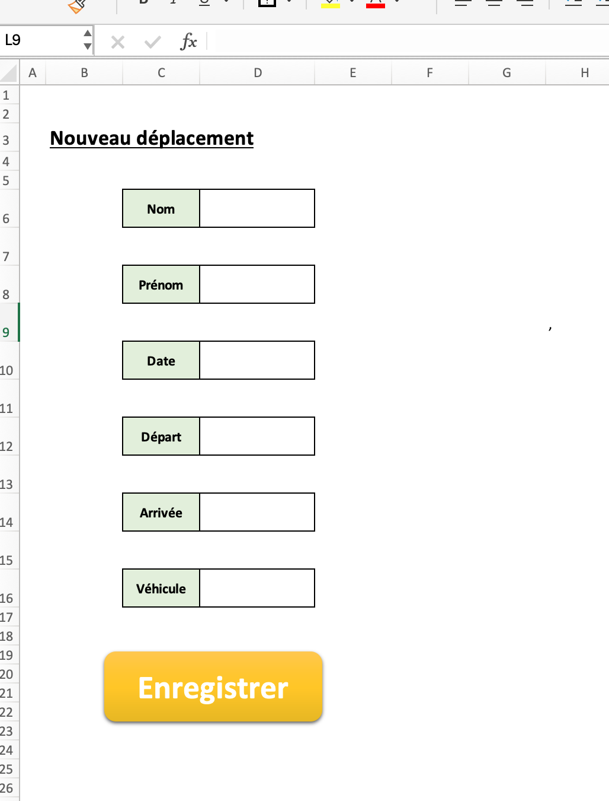
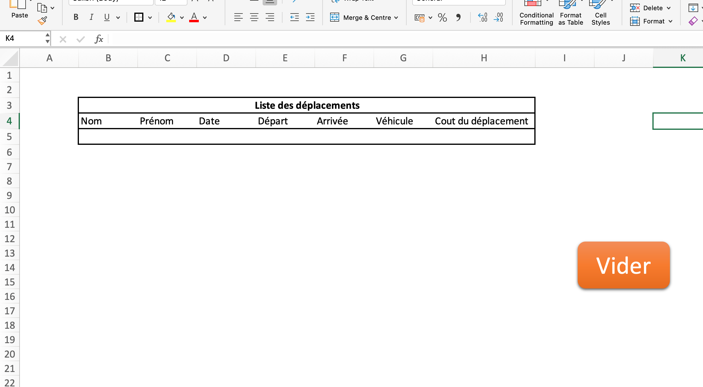



Liste des prérequis du POK ET/OU MON




Les lien utiles pour la compréhension de celui-ci.



J'aimerai à travers se POK me former au langage VBA qui est très souvent utilisé en entreprise.
En mise en application j'aimerai créer un outil permettant aux commerciaux d'une entreprise de calculer les coûts de leurs déplacements afin de créer des notes de frais. 

## Tâches

##### Sprint 1 :

- [ ] Découvrir et me former en VBA *(Temps estimé : 4h)*
- [ ] Définir le visuel et les fonctionnalités du rendu final *(Temps estimé : 1h)*
- [ ] Ecrire une première version du code avec les éléments de base *(Temps estimé : 2h30)* 
- [ ] Tester les fonctionnalités et réfléchir à des améliorations à réaliser lors du second sprint *(Temps estimé : 30min)*


##### Sprint 2 :

- [ ] Définir les améliorations à implémenter *(Temps estimé : 1h)*
- [ ] Améliorer et compléter l'outil avec les améliorations définies *(Temps estimé : 2h30)*
- [ ] Appliquer les connaissances acquises lors du MON 1 avec une connexion API REST *(Temps estimé : 5h)* 
- [ ] Documenter le projet et préparer la présentation finale *(Temps estimé : 1h30)*

## Premier Sprint : découverte de VBA et première version de l'outil

###  Tâches effectuées  :

Dans ce premier sprint j'ai pu réaliser toutes les tâches prévues pour une durée d'environ dix heures :

- [x] Découvrir et me former en VBA *4h vs 4h prévues*
- [x] Définir le visuel et les fonctionnalités du rendu final *(2h vs 1h prévue)*
- [x] Ecrire une première version du code avec les éléments de base *(1h30 vs 2h30 prévues)* 
- [x] Tester les fonctionnalités et réfléchir à des améliorations à réaliser lors du second sprint *(45 min vs 30 min prévues)*

### 1. Formation VBA

J'ai commencé ce sprint par me documenter et me former en VBA. J'avais déjà utilisé des fichiers Excel avec des macro mais sans coder et apprendre ce langage. J'ai donc suivi les cours du site [Excel pratique](https://excel-pratique.com) sur les [variables](https://excel-pratique.com/fr/vba/variables), les [boucles](https://excel-pratique.com/fr/vba/boucles) mais aussi sur les [UserForm](https://excel-pratique.com/fr/formation/creation_userform) avant de découvrir que ceux-ci n'étaient pas disponible sur mac...

### 2. Définitions des fonctionnalités de la premiere version

Voici les différents points que j'ai retenu durant cette seconde tâche pour définir les premières fonctionnalités :

* Formulaire avec les champs nom, prénom, date, ville de départ, ville d'arrivée, véhicule.
* Utilisation de deux bases de données :
  * Véhicules : utilisation de cette [base de données](https://voiture.car2db.com) qui permet de répertorier plus d'une centaine de véhicules avec leur type de carburant ainsi que leur consommation en vue des calcules de frais de déplacements.
  * Villes de France avec les coordonnées : utilisation des [données](https://www.data.gouv.fr/fr/datasets/villes-de-france/#/resources) disponibles sur le site du gouvernement.

### 3. Première version

La première version de l'outil utilise deux feuilles Excel, une feuille $Déplacement$ où l'utilisateur remplis ses déplacements et une seconde feuille $Récap$ qui récapitule tous les déplacements :

<div style="text-align: center;">
  
  
</div>

Le bouton fait référence à la première macro du projet qui, lors d'un clique, va remplir le tableau sur la page Récap en ajoutant une ligne et en la remplissant suivant les données entrées dans le formulaire.

Voici une explication détaillée du code VBA en utilisant un format Markdown :

Ce code est coposée d'une macro principale `new_drive` qui utilise également une autre macro que j'ai créé `add_empty_row`. 

#### `Sub add_empty_row()`

Ce code ajoute une ligne vide en dessous de la dernière ligne non-vide dans le tableau de la feuille `Récap`.

- **Déclaration des variables** :  
  - `ligne` est un entier long qui permet de parcourir les lignes de la feuille.
  - `feuille` est un objet représentant la feuille `Récap`.
  - `r_min` stocke la première ligne vide trouvée.

```vba
Dim ligne As Long
Dim feuille As Worksheet
Dim r_min As Long
Set feuille = Sheets("Récap")
```

- **Insertion d'une nouvelle ligne en bas de tableau'** :  
  Le programme parcourt le tableau de la feuille `Récap` en cherchant le dernière ligne non-vide avant d'en ajouter une en dessous.

```vba
For ligne = 3 To feuille.Rows.Count
    If IsEmpty(feuille.Cells(ligne, 2).Value) Then
        r_min = ligne
        Exit For
    End If
Next ligne

feuille.Rows(r_min).Insert Shift:=xlDown, CopyOrigin:=xlFormatFromLeftOrAbove
```
#### `Sub new_drive()`

Une fois la macro `add_empty_row` créée, on peut code la macro générale `new_drive`.

- **Définition des feuilles** :  
  Les objets `sourceFeuille` et `destinationFeuille` sont assignés aux feuilles respectives.

```vba
Set sourceFeuille = Sheets("Déplacements")
Set destinationFeuille = Sheets("Récap")
```

- **Initialisation de la variable `ligne`** :  
  Le programme commence à chercher une ligne vide à partir de la ligne 5 dans la feuille `Récap`.  
  La procédure `add_empty_row` est appelée pour ajouter une ligne vide.

```vba
ligne = 4
Call add_empty_row
```

- **Boucle de recherche de la première ligne vide** :  
  Cette boucle vérifie la colonne B à partir de la ligne 5 pour trouver la première cellule vide, puis stocke le numéro de cette ligne.

```vba
Do While destinationFeuille.Range("b" & ligne) <> ""
    ligne = ligne + 1
Loop
```

- **Copie des valeurs** :  
  Le programme copie les valeurs des cellules D6, D8, D10, etc. de la feuille `Déplacements` vers les colonnes B, C, D, etc. de la feuille `Récap`, à la ligne trouvée.

```vba
destinationFeuille.Range("b" & ligne) = sourceFeuille.Range("D6").Value
destinationFeuille.Range("c" & ligne) = sourceFeuille.Range("D8").Value
...
```

- **Nettoyage des données sources** :  
  Après avoir copié les données, le contenu des cellules D6, D8, D10, etc. de la feuille `Déplacements` est effacé pour les préparer à de nouvelles entrées.

```vba
sourceFeuille.Range("D6").ClearContents
sourceFeuille.Range("D8").ClearContents
...
```

Ainsi, cette macro permet d'envoyer les informations du formulaire dans le tableau récapitulatif.

### 4. Améliorations pour le second sprint

Comme prévue lors de la définition des tâches de mon POK j'avais prévu un temps de relecture et de réflexion pour les futures améliorations envisagées dans le second sprint :

** Revoir le visuel de l'outil
** Intégrer l'API google qui permet d'obtenir l'itinéraire et non la distance à vol d'oiseau 
** Recherche d'une API pour avoir le prix du carburant actualisé
** Intégrer un envoie automatique de mail

