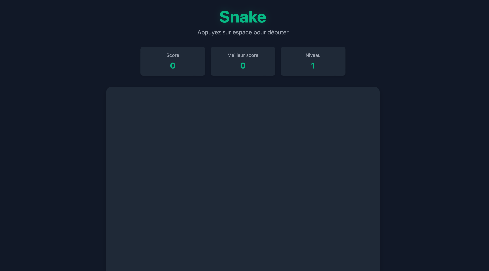


Pas de prérequis particuliers.


 - [Site Do_it](https://francoisbrucker.github.io/do-it/)
 - [Cours DevWeb](https://francoisbrucker.github.io/cours_informatique/enseignements/ecm/2A/option-web/)
 - [developer mozilla](https://developer.mozilla.org/en-US/)


## Tâches

| Tâches | Heures prévues |
| --------|-------- |
| S1 : Recherche documentaire  sur les jeux déjà réalisé en do_it | 1h |
| S1 : Revoir les bases html css | 3h |
| S1 : Définir et Réaliser un premier visuel | 3h |
| S1 : Découvrir JavaScript | 3h |
| S2: Implémentation du jeu | 6h |
| S2 : Amélioration du visuel | 2h (en fonction de la durée de la partie précédente) |
| S2 : Restitution et publication du jeu | 2h |

## Premier Sprint

Ce premier sprint est surtout consacré à des révisions et découvertes des bases des langages dont j'aurais besoin pour ce projet.

Dans un premier temps j'ai repris [le cours de deuxième année](https://francoisbrucker.github.io/cours_informatique/enseignements/ecm/2A/option-web/) afin de pouvoir par la suite créer un premier visuel pour jeu. 
Après ce cours j'ai réaliser une "maquette" afin de définir un premier visuel simple de ma page web que je prévois de faire évoluer en fonction de mes avancées durant les prochaines étapes.





Après cette maquette j'ai commencé à réaliser le visuel, en voici le résultat :

 

Pour le reste du temps de ce prmier sprint j'ai regardé les anciens projets similaire sur le site do_it et notamment le [memory](https://francoisbrucker.github.io/do-it/promos/2023-2024/William%20Lalanne/pok/temps-1/). J'ai ensuite commencé à découvrir et m'exercer sur javaScript notamment avec le site web [developer mozilla](https://developer.mozilla.org/en-US/).

Le prochain sprint era consacré au code du jeu en javaScript puis, en fontion du temps passé, j'aimerai ajouter des fonctionnalités supplémentaires comme des niveaux différents en jouant sur la vitesse de déplacement mais aussi un classement des scores réalisées sur ce jeu.

### Horodatage sprint 1
| Tâches | Heures prévues | Heures passées |
| --------|-------- |-------- |
| Recherche docu  sur les jeux déjà réalisé en do_it | 1h | 30min |
| Revoir les bases html css | 3h | 2h |
| Définir et Réaliser un premier visuel | 3h | 5h |
| Découvrir JavaScript | 3h | 3h |
