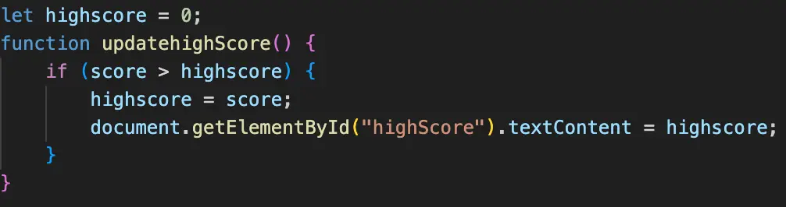


Pas de prérequis particuliers.


 - [Site Do_it](https://francoisbrucker.github.io/do-it/)
 - [Cours DevWeb](https://francoisbrucker.github.io/cours_informatique/enseignements/ecm/2A/option-web/)
 - [Developer mozilla](https://developer.mozilla.org/en-US/)
 - [Jeu snake](https://www.snake.fr)


## Tâches

| Tâches | Heures prévues |
| --------|-------- |
| S1 : Recherche documentaire  sur les jeux déjà réalisés en do_it | 1h |
| S1 : Revoir les bases html css | 3h |
| S1 : Définir et Réaliser un premier visuel | 3h |
| S1 : Découvrir JavaScript | 3h |
| S2: Implémentation du jeu | 6h |
| S2 : Amélioration du visuel | 2h (en fonction de la durée de la partie précédente) |
| S2 : Restitution et publication du jeu | 1h |

## Premier Sprint

Ce premier sprint est surtout consacré à des révisions et découvertes des bases des langages dont j'aurais besoin pour ce projet.

Dans un premier temps j'ai repris [le cours de deuxième année](https://francoisbrucker.github.io/cours_informatique/enseignements/ecm/2A/option-web/) afin de pouvoir par la suite créer un premier visuel pour jeu. 
Après ce cours j'ai réalisé une "maquette" afin de définir un premier visuel simple de ma page web que je prévois de faire évoluer en fonction de mes avancées durant les prochaines étapes.





Après cette maquette j'ai commencé à réaliser le visuel, en voici le résultat :

 

Pour le reste du temps de ce premier sprint j'ai regardé les anciens projets similaires sur le site do_it et notamment le [memory](https://francoisbrucker.github.io/do-it/promos/2023-2024/William%20Lalanne/pok/temps-1/). J'ai ensuite commencé à découvrir et m'exercer sur JavaScript notamment avec le site web [developer mozilla](https://developer.mozilla.org/en-US/).

Le prochain sprint sera consacré au code du jeu en JavaScript puis, en fonction du temps passé, j'aimerais ajouter des fonctionnalités supplémentaires comme des niveaux différents en jouant sur la vitesse de déplacement mais aussi des calculs de record.

### Horodatage sprint 2
| Tâches | Heures prévues | Heures passées |
| --------|-------- |-------- |
| Recherche docu sur les jeux déjà réalisés en do_it | 1h | 30min |
| Revoir les bases html css | 3h | 2h |
| Définir et Réaliser un premier visuel | 3h | 5h |
| Découvrir JavaScript | 3h | 3h |

## Second Sprint

Pour ce second sprint le but était d'implémenter le code JavaScript du jeu, après avoir trouvé le code "simple" du [jeu](https://www.snake.fr) sur un blog j'ai compris la logique à suivre et les différents éléments indispensables pour réussir mon projet. Après avoir compris ce code j'ai défini toutes les améliorations que je voulais faire afin d'ajouter des éléments à ce premier exemple : 

 - 1. Accélération progressive
 - 2. Calcul de record
 - 3. Apparition d'obstacles
 - 4. Création de 2 ou 3 modes différents avec interface
 
### 1. Accélération progressive

Pour ce premier point, j'ai choisi d'augmenter la vitesse à chaque fois que le serpent mangeait la pomme. Dans le code, ce qui créé le mouvement est l'exécution répétitive du code, l'initialisation se fait à *120ms*, ce qui signifie que toutes les 120ms le serpent avance. Pour augmenter cette vitesse et après plusieurs tests j'ai décidé de réaliser le calcul suivant à chaque rencontre avec une pomme : *speed* = *speed* *-* *0.1* * *score*.
Ce qui signifie que quand le score est de 1 la boucle s'effectue toutes les 119,9ms ensuite 119,7ms et ainsi de suite. Bien évidemment, pour ne pas rendre le jeu impossible j'ai limité cette vitesse à 50ms.





### 2. Calcul de record

Pour implémenter le calcul et l'affichage du record il fallait créer une fonction *updatehighScore()* qui allait comparer le score actuel au record et l'actualiser si ce score est supérieur. Au début, je voulais appeler cette fonction à chaque pomme mangée puis, pour des raison de complexité, j'ai décidé de l'appeler à chaque fin de jeu.





### 3. Apparition d'obstacles

L'apparition d'obstacles a été l'amélioration la plus compliquée à implémenter. Il y avait plusieurs problèmes à gérer, comme éviter de faire apparaître un obstacle sur la pomme, sur le serpent ou encore sur un obstacle déjà présent. Il fallait également calculer les collisions avec le serpent et terminer la partie si nécessaire.
J'ai donc créé une fonction isPositionValid(x, y) qui permet de vérifier si les coordonnées (x, y) du cadre de jeu sont vides, puis une fonction addObstacle() qui génère un obstacle sur une case disponible. Enfin, j'ai ajouté à la fonction qui gère les collisions une vérification des collisions avec les obstacles. J'ai également inclus une liste pour stocker toutes les coordonnées des obstacles déjà générés.
Pour des questions de jouabilité, j'ai choisi de faire apparaître un obstacle supplémentaire chaque fois que le score du joueur atteint un multiple de cinq.





### 4. Création de 2 ou 3 modes différents avec interface

Ce dernier point m'est venu à l'idée car, en ayant déjà créé un jeu fonctionnel, il était possible, en changeant seulement quelques lignes de code, de créer de nouveaux modes. J'ai donc décidé de créer les modes speedmode et reverse, qui sont respectivement des modes où la vitesse est bien plus élevée et où les touches sont inversées. J'ai donc créé un script pour chaque mode de jeu ainsi qu'un nouveau script pour gérer la sélection des modes.
J'ai également ajouté un visuel au début pour que l'utilisateur puisse choisir le mode auquel il souhaite jouer.








### Horodatage sprint 1
| Tâches | Heures prévues | Heures passées |
| --------|-------- |-------- |
| Implémentation du jeu | 6h | 4h |
| Ajout de fonctionnalités| 0h | 2h |
| Amélioration du visuel | 2h | 2h |
| Restitution et publication du jeu | 1h | 1h |

## Conclusion

Ce projet m'a permis de redécouvrir les bases du développement web en utilisant HTML, CSS et JavaScript tout en réalisant un jeu complet et fonctionnel. En partant d'un code de base, j'ai pu implémenter des fonctionnalités avancées telles que l'accélération progressive, le calcul du record, l'apparition d'obstacles et la création de différents modes de jeu.
Ces ajouts m'ont permis de comprendre en profondeur la logique du code. Enfin, la mise en place d'une interface pour la sélection des modes a apporté une touche finale au jeu, le rendant plus interactif et attractif pour l'utilisateur.