

Pas de prérequis




<b>SOURCES</b>

- [Tutoriel](https://www.youtube.com/watch?v=HZuk6Wkx_Eg)
- [Librairies](https://www.youtube.com/watch?v=ewwwX6N8oO8)



<!-- 

<b> POK & MON </b>

 -->

## Table des matières

1. [Introduction](#section1)
2. [Fonctionnement](#section2)
3. [Composants](#section3)
4. [Librairies](#section4)
5. [Conseils pratiques](#section5)
6. [Conclusion](#section6)

## 1.Introduction 

L'objectif de ce MON était de me familiariser avec figma et ses principaux outils. Grâce à ses connaissances j'ai pu me créer un Mockup ou autrement dit une maquette pour mon site web.

### Petite présentation

Bon, dans un premier temps qu'est-ce que c'est que Figma ?
Figma est une application de design où l'on construit la maquette de notre futur site web, application.

Grosso modo, on représente les pages du site/de l'application que l'on veut faire.
Il n'y a pas de code, simplement des composants (rectangles, textes, icônes...) que l'on utilise pour avoir une idée de l'apparence finale des pages.

Pourquoi c'est utile ?
**On sait où on va!**

Donc 
- On réfléchit indirectement à notre code en plaçant les éléments en avance.
- On ne fait pas mille et un aller-retour parce qu'on n'est pas satisfait de l'apparence de nos pages.

### Desktop

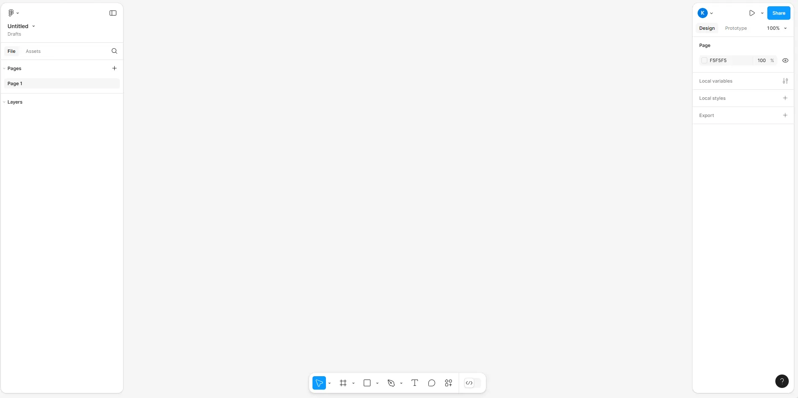

Alors voilà sur quoi on arrive quand on ouvre un design file sur Figma (je vous fais confiance pour arriver jusque là 😉).

On peut définir 4 zones qu'on va utiliser :
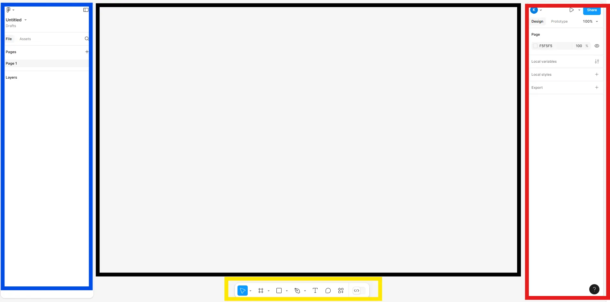

On va avoir :
- <b>L'explorateur</b> : c'est là où seront listés nos composants (textes, images, carrés, cercles...).
- <b>Le bureau</b> : c'est là que s'affiche nos pages et basiquement là où on rajoute nos composants.
- <b>Les paramètres</b> : c'est là que l'on va pouvoir modifier nos composants (couleur, taille, police, épaisseur, opacité...)
- <b>Les outils</b> : ce sont les outils que l'on utilise pour ajouter les composants.

## 2.Fonctionnement des Frames 

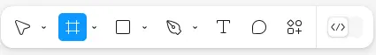

En cliquant sur cet icône dans la partie <b>outils</b> on va pouvoir tracer un rectangle qui définira une **frame**. On peut aussi choisir un type de frame prédéfini dans la partie <b>paramètres</b>.

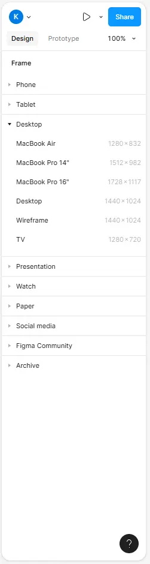

Les frames sont ce qui va nous servir de **zones de rangement** pour tous nos composants.
Elles représentent la taille de nos écrans (écran d'ordinateur, d'iphone, de smartphone...) mais aussi des zones contenant des composants.

Ainsi on va pouvoir mettre des frames dans des frames ce qui va former une hiérarchie, comme avec nos dossiers, visible dans la zone <b>explorateur</b>.

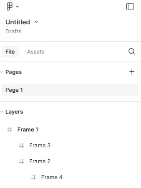

🚨**Petite attention** s'il-vous-plaît !
Utiliser des **FRAMES** plutôt des **formes** quand vous voulez mettre des composants dedans/devant.
Les frames permettent plein de choses dont deux très utiles : avoir le même espacement entre vos composants ou bien tous les centrer dans la frame.

## 3.Composants 

Maintenant que l'on a nos frames, on peut rajouter nos composants avec la partie <b>outils</b>.
Je ne parle ici que de ceux principalement utilisés et de même pour leurs <b>paramètres</b>.

### Formes

Dans les <b>outils</b>, on peut créer différentes formes...

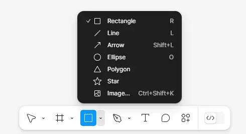

...et sur le <b>bureau</b> cela donne ceci :

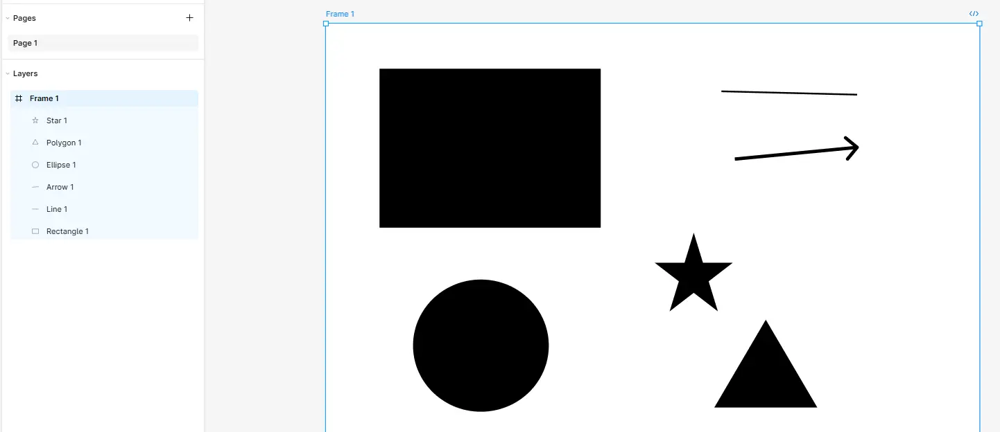

Ensuite dans les <b>paramètres</b>, on peut modifier la couleur, la position dans la frame, les contours...

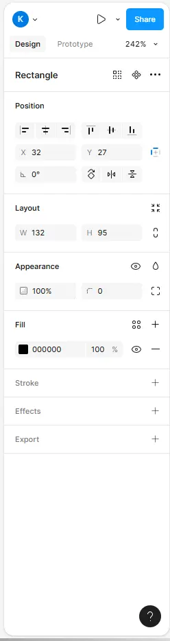

On peut aussi insérer des images mais on va voir qu'on peut faire beaucop plus simple.

### Images

Il suffit de faire `Ctrl + C` et `Ctrl + V`, voilà c'est tout !

Après on peut toujours aller dans les <b>paramètres</b> pour rogner, changer l'opacité, rajouter des contours...

### Textes

On sélectionne l'<b>outil</b> texte ou, plus rapide, on tape `T`

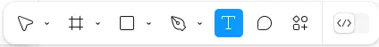

...et dans les <b>paramètres</b> on change la police, la taille...

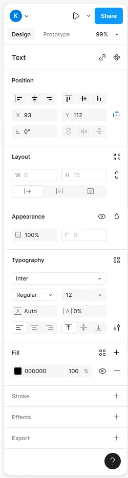

### Icônes

Pour les icônes c'est comme les images, on va faire un `Ctrl + C` et `Ctrl + V` mais **attention**, on copie un icône d'un fichier Figma.

C'est pas trop compliqué, il suffit de chercher "figma free icons" sur le navigateur et d'ouvrir le premier lien. Vous aurez quelque chose de similaire à ceci :

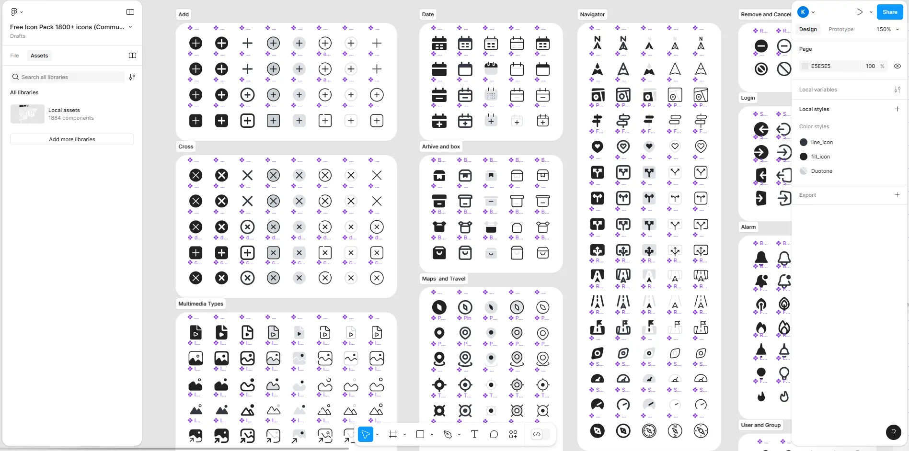

Sinon l'autre solution c'est de sélectionner des icônes via une librairie téléchargée...

## 4. Librairies 

### Présentation

Une librairie c'est très simple, c'est un ensemble de composants stylisés.
De mon côté je me suis plutôt intéressé aux UI Kit qui sont dédiés à la création d'interfaces utilisateurs.
On va y trouver des boutons, des icônes, des barres de navigations, des polices préfaites (pour les différents titres par exemple : h1, h2...) et plein, pleiiin d'autres choses.

Petit exemple avec des composants stylisés de la librairie d'iOS 18 :
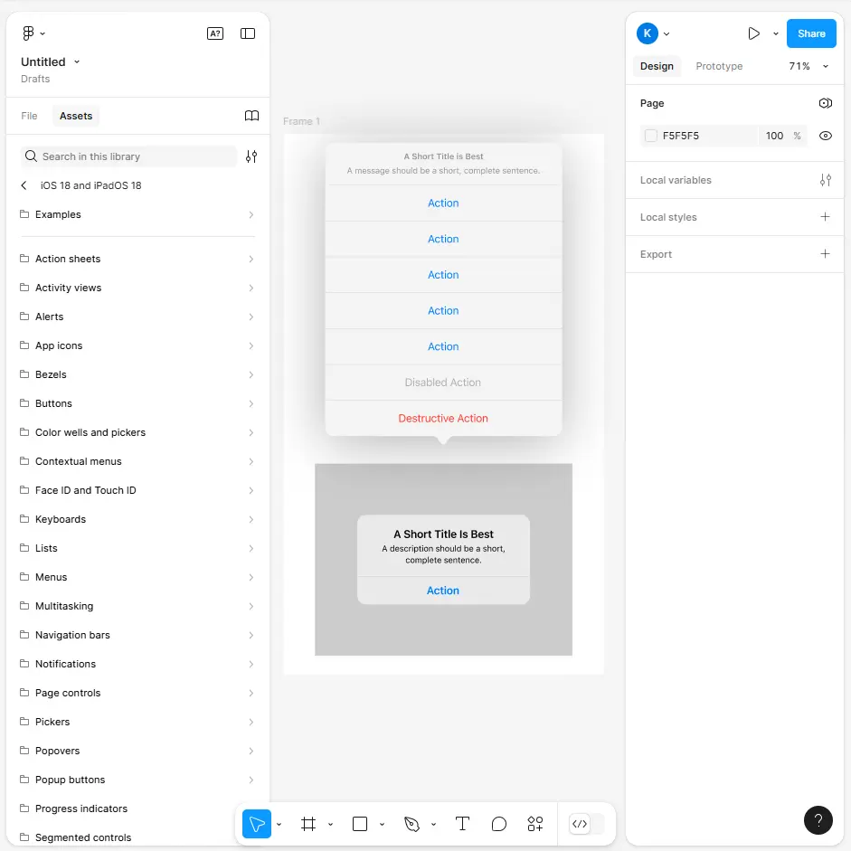

Ce qui est bien avec Figma c'est qu'il y a une communauté où tout le monde peut publier ce qu'il fait et on retrouve à la fois les librairies des composants de google, d'android... mais aussi d'autres réalisées par des particuliers.

### Télécharger une librairie

Dans un premier temps, on revient sur notre compte Figma avec nos fichiers et on va explorer le contenu de la communauté.

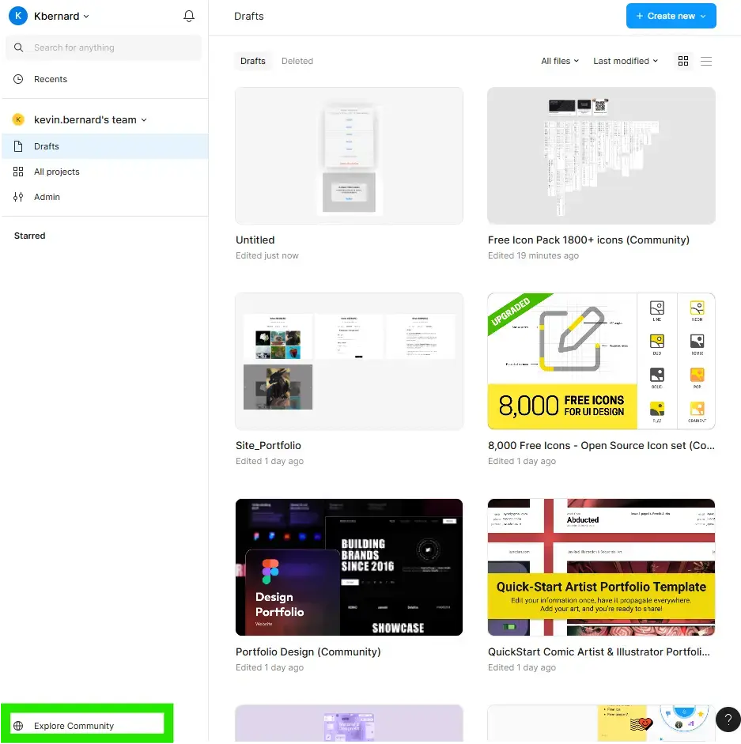

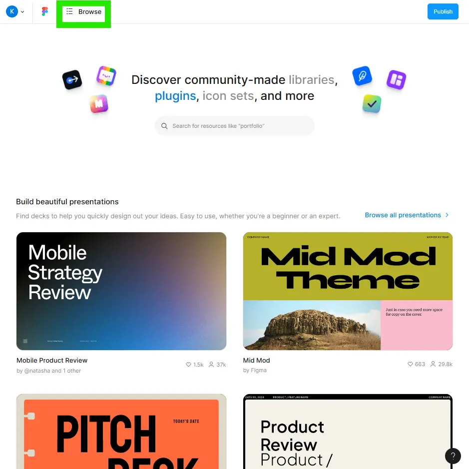

Une fois le UI Kit choisi, il reste plus qu'à l'ouvrir.

On publie la librairie dans son répertoire.
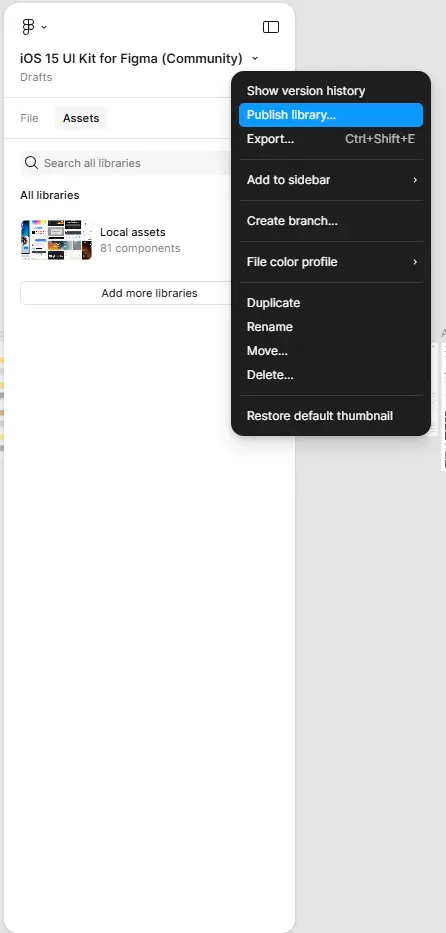

### Ajouter la librairie au projet

On revient sur notre fichier figma et on va sur <b>Assets</b> dans notre <b>explorateur</b>.

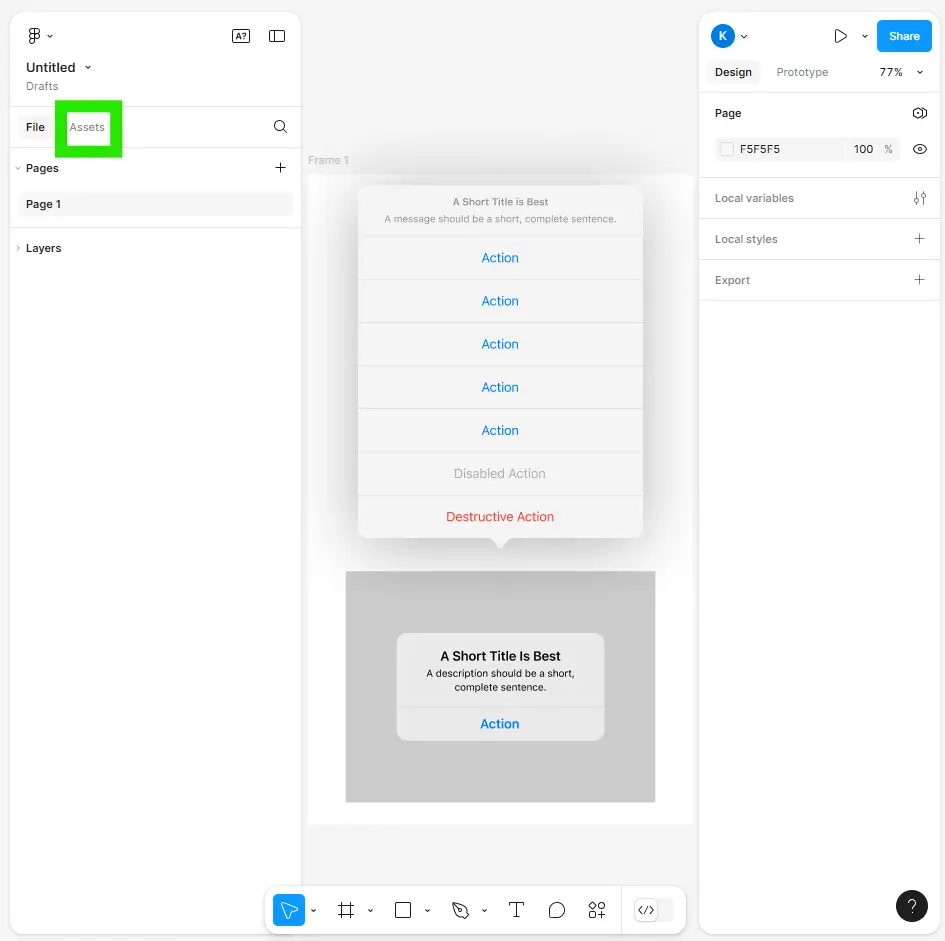

Il ne reste plus qu'à ajouter la librairie :

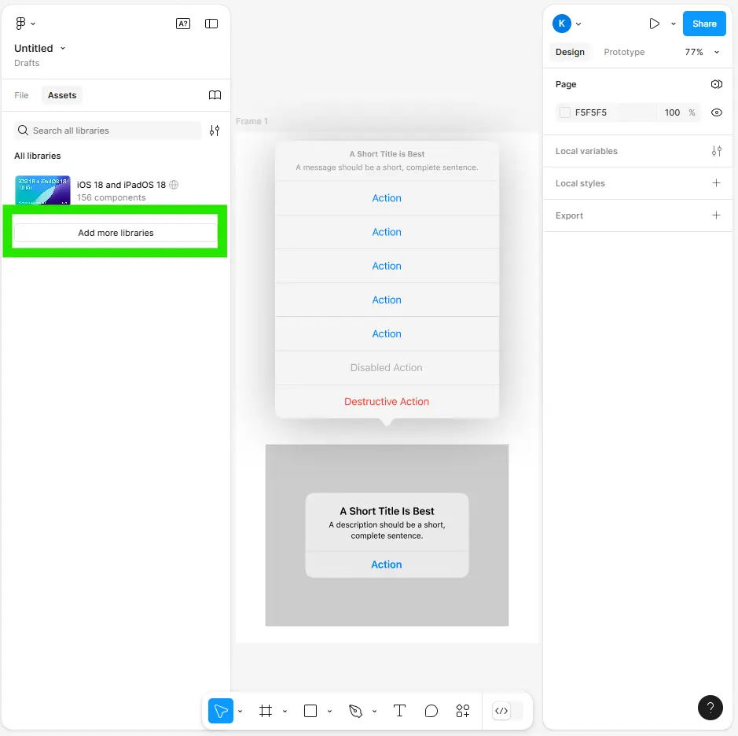

**Remarques :**
On retrouvera les nouveaux composants stylisés toujours dans la partie <b>Assets</b>.

## 5.Conseils pratiques 

Maintenant que l'on a vu tout ce que l'on pouvait mettre dans nos frames :
- formes
- images
- textes
- icônes
- composants stylisés

Il ne nous reste plus qu'à parler des conseils praticos-pratiques dans leur utilisation.

### Organiser ses frames

C'est le truc de base.
Plus nos frames sont organisés, plus c'est lisible et on s'y retrouve.

Je vous conseille d'avoir une frame pour les différentes parties de vos pages : le header, la barre de navigation...
Et surtout **nommer** vos frames.

### Template

Cela fait écho au conseil précédent.
En ayant des frames qui reviennent souvent dans vos pages vous pouvez faire une templates avec ces frames récurrentes pour vous faciliter la vie.

### Raccouris

Liste de raccourcis utiles :
- 'Crtl + D' : duppliquer
- 'Shift' : sélection multiple
- 'F' : ajouter une frame
- 'R' : ajouter un rectangle
- 'T' : ajouter un texte

## 6.Conclusion 

Cela m'a été très utile, et j'ai vraiment pu apprendre et l'utiliser pour mon projet perso.
Clairement, je ferai toujours une maquette sur figma avant de coder.

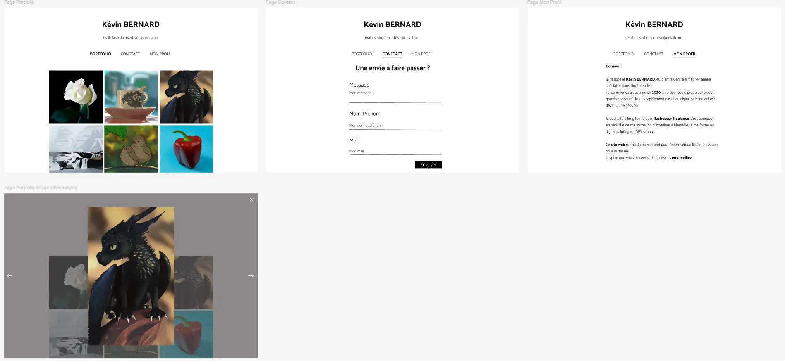