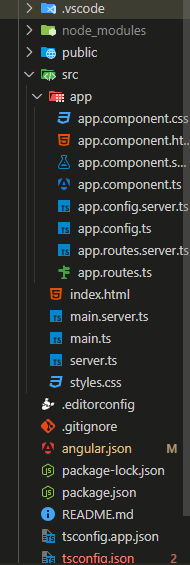



- Connaissances de ce qu'est un Frontend : 2/3 📶
- Connaissances de ce qu'est un Système de composants : 1/3 📶




<b>SOURCES</b>

- [Vidéo Youtube de Zero To Mastery, What is Angular? | Angular Explained in 2 Minutes For BEGINNERS](https://www.youtube.com/watch?v=a6E5pzst2YE)
- [Vidéo Youtube de AltexSoft, Angular Basics, Pros and Cons Explained](https://www.youtube.com/watch?v=y14f_VFsZIA)
- [Site Le Guide Angular | Marmicode](https://guide-angular.wishtack.io/)
- [Vidéo Youtube de Programming with Mosh, Angular Tutorial for Beginners: Learn Angular & TypeScript](https://www.youtube.com/watch?v=k5E2AVpwsko&t=830s)
- [Site de documentation d'Angular](https://angular.dev/overview)
- [Une version française de la documentation d'Angular](https://angular.fr/)



<b> POK & MON </b>  

- [MON 3.1 : Angular de Arthur Louradou](../../../../2023-2024/Louradou-Arthur/mon/temps-3.1/index.md)


## Table des matières

1. [Introduction](#section1)
2. [Qu'est-ce qu'Angular et quand l'utiliser ?](#section2)
3. [Créer un projet Angular](#section3)
4. [Comment ça marche ?](#section4)
5. [Que sont les directives et les pipes ?](#section5)
6. [Comment récupérer des données ?](#section6)
7. [Conclusion](#section7)

## 1. Introduction <a id="section1"></a>

Je fais ce MON pour apprendre un nouveau langage, j'aimerais avoir suffisamment de bases pour confortablement mettre Angular JS dans mon CV.
Je me suis donc posé comme question :

<center><b>Quelles sont les bases d'Angular à maîtriser ?</b></center>

Ce MON retrace ma démarche pour répondre à cette question. Je le fais pour un moi futur qui voudrait apprendre Angular ou revoir les bases.

J'ai utilisé le site [Le Guide Angular | Marmicode](https://guide-angular.wishtack.io/) parce que Arthur Louradou le mentionne dans son [MON 3.1 : Angular](../../../../2023-2024/Louradou-Arthur/mon/temps-3.1/index.md).

## 2. Qu'est-ce qu'Angular et quand l'utiliser ? <a id="section2"></a>

### Petite présentation

Il faut différencier Angular de Angular JS. Angular JS est la première version d'Angular sortie en 2010 écrite en JavaScript et Angular est la deuxième version sortie en 2016 réécrite en TypeScript. Angular JS est basé sur un système de **model-view-controller** et Angular sur un système de **composants** comme React.

Angular est un framework **TypeScript** **open-source** développé par **Google** :

- Il est utilisé par beaucoup d'entreprises dont des grosses entreprises comme Microsoft, Paypal et Samsung (surtout parce que d'abord développées en Angular JS, elles ont souhaité rester avec Angular plutôt que d'aller vers un tout nouveau framework)
- Il reste constamment à jour puisque que Google fait des mises à jour tous les 6 mois

Ce sont 2 raisons pour lesquelles il est intéressant de l'apprendre.

### Quand utiliser Angular ?

J'ai comparé Angular à React et Vue pour savoir quand l'utiliser.

Les caractéristiques d'Angular:

- Complet
- Très verbeux
- Natif TypeScript
- Complexe à apprendre

Angular est utilisé quand on veut réaliser une application complexe de grosse taille surtout en entreprise grâce au cadre robuste qu'il a.

**Petit mémo :** Avec Angular c'est comme si on nous donnait une cuisine toute équipée (four, frigo, mixeur, batteur, grille pain, etc) quand on veut juste cuire des pâtes.
C'est bien quand on veut monter un restaurant mais pas pour un repas simple et rapide.

## 3. Créer un projet Angular <a id="section3"></a>

Maintenant que je savais pourquoi et quand utiliser Angular. Je me suis demandé comment créer un projet Angular.

### Installation

Pour installer Angular, il faut d'abord installer Node.js et npm (Node Package Manager) qui est un gestionnaire de paquets pour JavaScript.
Ensuite, on installe Angular CLI (Command Line Interface) qui est un outil en ligne de commande pour créer, développer et tester des applications Angular.
Enfin, on crée un nouveau projet Angular avec la commande `ng new nom-du-projet`.

```bash
npm install -g @angular/cli
ng new nom-du-projet
```

On a le choix entre plusieurs options : CSS, SCSS, SASS, LESS et la possiblité d'activer le SSR.
Et pour lancer le serveur de développement, on utilise la commande `ng serve`.

Pour plus de renseignement, les informations proviennent de la [documentation officielle d'Angular](https://angular.fr/get_started/installation)

### Structure d'un projet Angular

Ma première question a été de savoir comment s'organise un projet Angular ainsi que les commandes de base pour gérer le projet.



Ce que j'ai jugé bon de retenir :

- src : contient tous les fichiers de l'application et c'est là où l'on code
- src/app : contient tous les composants de l'application
- src/main.ts : point de départ de l'application, c'est là où l'application est lancée

On a plusieurs commandes de Angular CLI pour gérer le projet dont :

- `ng generate component nom-du-composant` : pour générer un composant
- `ng generate service nom-du-service` : pour générer un service
- `ng add nom-du-package` : pour ajouter un package

Plus d'informations sur une [documentation française d'Angular](https://angular.fr/get_started/angular-cli.html).

## 4. Comment ça marche ? <a id="section4"></a>

Je sais comment construire un projet Angular, où je vais coder et quels éléments vont me servir pour coder. Maintenant, je souhaite comprendre comment cela fonctionne, comment un page est construite.

Le composant racine est `app.component` qui est le composant principal de l'application. A ce composant, on peut ajouter une arborescence de composants enfants qui vont venir constituer les pages puis les éléments de ces pages.
Donc 1 page = 1 composant enfant de `app.component` composé de plein de petits composants.

### Les composants

Un composant est une classe décorée par `@Component` qui contient le nom du composant (selector), le lien vers le HTML (templateUrl) et le CSS (styleUrls).

```typescript
@Component({
  selector: 'app-root',
  templateUrl: './app.component.html',
  styleUrls: ['./app.component.css']
})
```

Un composant est organisé sous la forme d'un MVC avec 4 fichiers :

- Un fichier HTML et un fichier CSS pour la vue --> ce qui est affiché à l'utilisateur (nom-du-composant.component.html et nom-du-composant.component.css)
- Un fichier TypeScript pour le contrôleur et le modèle --> gère les données et les événements provoqués par l'utilisateur (nom-du-composant.component.ts)
- Un fichier de test pour tester si le composant marche bien (nom-du-composant.component.spec.ts)

Avec la commande `ng generate component nom-du-composant`, Angular génère automatiquement ces 4 fichiers et update le fichier `app.module.ts` pour ajouter le composant.
Ne sachant pas ce qu'est un module, j'ai cherché à comprendre son rôle.

Plus de détails sur les [composants](https://guide-angular.wishtack.io/angular/composants)

### Les modules

Un module est une classe décorée par `@NgModule` qui contient les composants, les directives et les pipes de l'application.
Autrement dit c'est un fichier qui regroupe des composants, directives et pipes.

```typescript
@NgModule({
  declarations: [
    NomComponent,
    HelloComponent
  ], // liste des composants, directives et pipes que le module regroupe
  exports: [
    NomComponent,
    HelloComponent
  ], // liste des composants, directives et pipes que le module rend accessibles à d'autres modules
  imports: [
    BrowserModule,
  ], // liste des modules ayant des composants, directives et pipes utilisés par les composants, directives et pipes du module (ceux dans declarations)
})
```

Un module est organisé sous la forme de 3 fichiers :

- Un fichier TypeScript pour le contrôleur et le modèle --> gère les données et les événements provoqués par l'utilisateur (nom-du-module.module.ts)
- Un fichier de test pour tester si le module marche bien (nom-du-module.module.spec.ts)
- Un fichier de routage pour gérer les routes de l'application (nom-du-module-routing.module.ts) --> par exemple, si on veut que l'URL /home affiche le composant HomeComponent

Plus de détails sur les [modules](https://guide-angular.wishtack.io/angular/project-structure-and-modules/definition-dun-module)

J'ai compris comment marche un projet Angular, on demande au module de charger le composant adéquat pour afficher la page. (C'est un processus hiérarchique où le module principal charge les modules enfants qui chargent les composants enfants).

Mais en en apprenant sur les modules, j'ai vu qu'il existait des directives et des pipes. Des termes qui reviennent souvent dans la documentation d'Angular mais que je ne connais pas.

## 5. Que sont les directives et les pipes ? <a id="section5"></a>

### Les directives

Une directive est une classe décorée par `@Directive` qui permet de manipuler la vue/le DOM en ajoutant des attributs à des éléments HTML.

Il y en a 2 types :

- Les directives structurelles : elles modifient la structure du DOM en ajoutant ou en supprimant des éléments HTML (ngIf, ngFor, ngSwitch)
- Les directives d'attributs : elles modifient l'apparence ou le comportement d'un élément HTML (ngStyle, ngClass)

```typescript
@Directive({
  selector: '[appHighlight]'
})
export class HighlightDirective {
  constructor(el: ElementRef) {
    el.nativeElement.style.backgroundColor = 'yellow';
  }
}
```

Un exemple de directive qui change la couleur de fond d'un élément HTML en jaune.
On va les utiliser pour ajouter des fonctionnalités à nos composants comme par exemple, si on veut que les éléments d'une liste soient surlignés en jaune.

```html
<ul>
  <li *ngFor="let item of items" appHighlight>{ item }</li>
</ul>
```

Plus de détails sur les directives sur [Le Guide Angular | Marmicode](https://guide-angular.wishtack.io/angular/directives) et dans la [documentation Angular](https://angular.fr/directives/ng-if.html).

### Les pipes

Un pipe est un outil qui permet de transformer les données affichés dans template HTML sans modifier les données dans le composant TypeScript.
Les pipes prennent une **valeur d'entrée**, la transforment et retournent la **valeur transformée**.

Il existe des pipes prédéfinis dont les plus utiles sont :

- `uppercase` : transforme le texte en majuscule
- `date` : transforme une date en une date formatée
- `currency` : transforme un nombre en une monnaie
- `async` : transforme une promesse en une valeur

On peut également créer des pipes personnalisés qu'il faudra alors ajouter dans le module pour qu'ils puissent être utilisés par les composants du module.

Il y a plus de détails sur [Le Guide Angular | Marmicode](https://guide-angular.wishtack.io/angular/pipes) et

---

A partir de ce moment là, je savais comment construire une page, comment la structurer et comment ajouter des fonctionnalités à mes composants et filtrer les données affichées dans mon HTML.
Mais je ne savais pas comment récupérer des données depuis mon HTML.

## 6. Comment récupérer des données ? <a id="section6"></a>

Comment sont gérées les données dans Angular ? Comment récupérer des données depuis un serveur ?

### Les services

Les services sont des classes décorés par @Injectable qui permettent de récupérer des données depuis un serveur, de les manipuler et de les partager entre les composants.  
Par convention, elles sont nommées : `nom-du-service.service.ts`.  
Le service va créer une dépendance pour les composants qui vont l'utiliser (dépendance = quelque chose dont a besoin le composant pour fonctionner).

Le mécanisme qui permet l'échange de dépendances entre différentes parties de l'application (par exemple, service et composant) est appelé **l'injection de dépendances**.

### L'injection de dépendances/Dependency Injection

**Comment ça marche ?**  
Pour gérer l'échange de dépendance, l'**injecteur** vérifie qu'il n'existe pas déjà une instance de la classe service à fournir et si ce n'est pas le cas, il crée une nouvelle instance et la fournit. Et on a souvent **dépendance = service**.

**Comment fournir une dépendance ?**  
On utilise le décorateur `@Injectable` pour indiquer que la classe est un service et avec le décorateur `providedIn: 'root'`, on indique que le service est fourni à l'ensemble de l'application.  
Il existe d'autres possibilités voir [documention Angular](https://angular.dev/guide/di/dependency-injection).

```typescript
@Injectable({
  providedIn: 'root'
})
export class DataService {
  fetchData() {
    return ['item1', 'item2', 'item3'];
  }
}
```

**Comment utiliser une dépendance ?**  
La [documentation](https://angular.dev/guide/di/dependency-injection) offre 2 méthodes, j'ai choisi la recommandée qui est de déclarer le service dans le constructeur du composant.  
Ainsi quand le composant est créé, Angular va automatiquement injecter le service.

```typescript
export class AppComponent {
  items: string[];

  constructor(private dataService: DataService) {
    this.items = this.dataService.fetchData();
  }
}
```

Il y a plus d'explications dans la documentation d'Angular sur la [Dependency Injection](https://angular.dev/guide/di).  
Maintenant je sais comment gérer les données dans Angular, comment récupérer les données dans le composant depuis le service mais je ne sais toujours pas comment récupérer des données depuis un serveur.

### Les requêtes HTTP

Pour récupérer des données depuis un serveur, on utilise le service `HttpClient` qui permet de faire des requêtes HTTP.  
On doit d'abord importer le module `HttpClientModule` dans le module principal de l'application.

```typescript
import { HttpClientModule } from '@angular/common/http';

@NgModule({
  declarations: [
    AppComponent
  ],
  imports: [
    BrowserModule,
    HttpClientModule
  ],
  providers: [],
  bootstrap: [AppComponent]
})
```

Ensuite, on injecte le service `HttpClient` dans le service qui va récupérer les données sous forme d'**observable**.

```typescript
@Injectable({
  providedIn: 'root'
})
export class DataService {
  constructor(private http: HttpClient) {}

  fetchData() {
    return this.http.get('url-du-serveur');
  }
}
```

Pour en apprendre plus sur les requêtes que l'on peut faire avec `HTTPClient`, c'est [ici](https://angular.fr/http/client.html#les-differents-types-de-requetes-http) sur une version française de la documentation d'Angular.

---

Je n'ai pas eu le temps d'aller plus loin, notamment avec la notion d'observable.

## Conclusion <a id="section7"></a>

Pour répondre à ma question :

<center><b>Quelles sont les bases d'Angular à maîtriser ?</b></center>

> Pour moi les bases d'Angular à maîtriser se divisent en 3 parties :
>
> - Compréhension et implémentation du système de composants, modules, directives et pipes
> - Gestion des données avec les services et l'injection de dépendances
> - Récupération des données depuis un serveur avec les requêtes HTTP et les observables
>
> Avec cela on peut récupérer les données, les manipuler et les afficher à l'utilisateur en fonction de ses actions ce qui est le but d'un frontend.

En parallèle, j'ai pu améliorer mes bases en Angular, je ne pense pas cependant avoir assez de connaissances pour dire que je maîtrise les bases d'Angular.