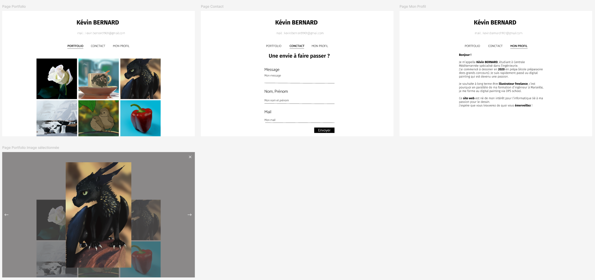
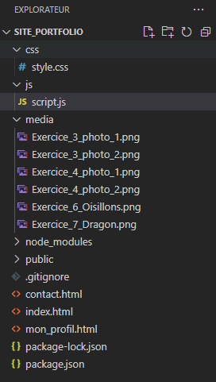
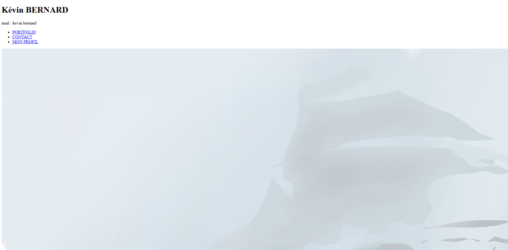
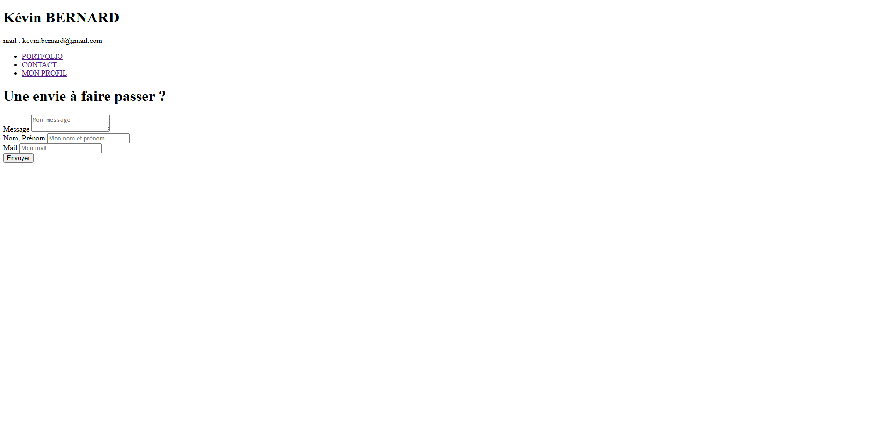
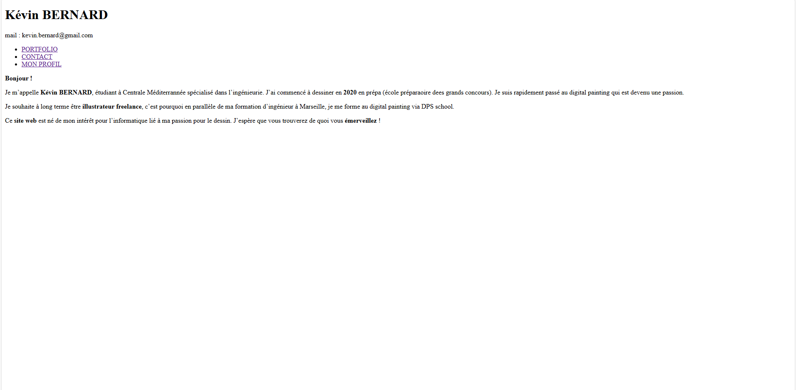
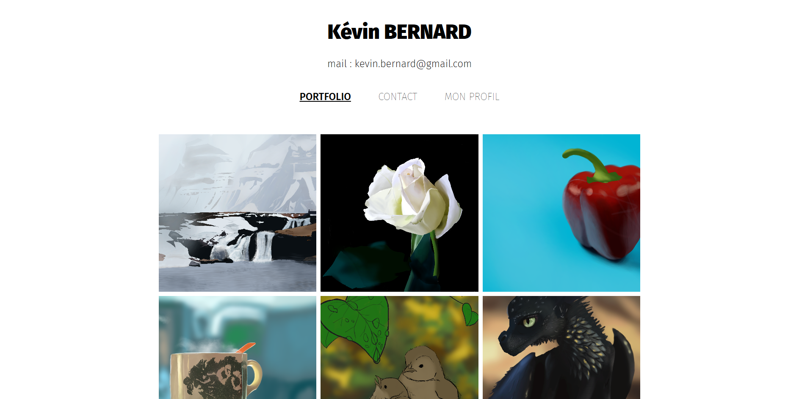
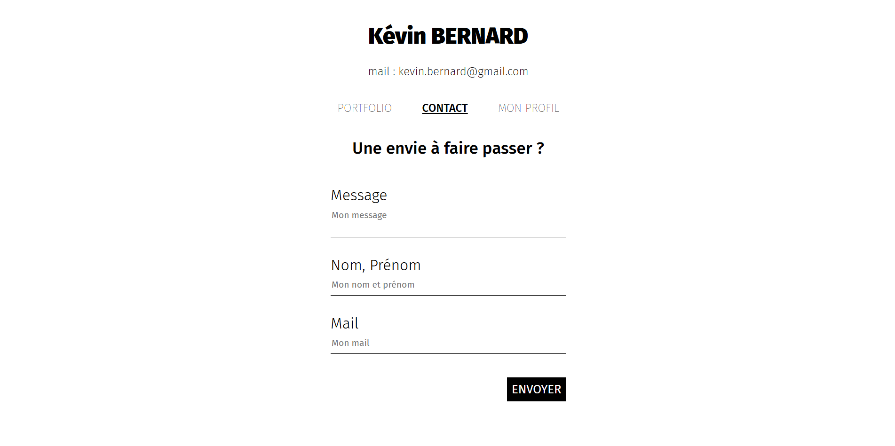
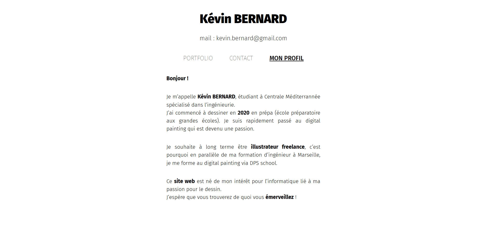



Savoir un peu coder en HTML (balises : a, div, button, ul, li, hX)





<b>SOURCES</b>

- [Sites de portfolio](https://www.ultra-book.com/portfolios)<
- [Créer un Site Web HTML & CSS](https://www.youtube.com/watch?v=EFBufG7TKRE&t=510s)
- [Exemple de formulaire](https://www.youtube.com/watch?v=lR4-DJey_3A)
- [How to import Google Font](https://www.youtube.com/watch?v=E7QPO8P8nls)




<b> POK & MON </b>

- [MON 1.1 : Apprendre à utiliser Figma](../../mon/temps-1.1)



Mon projet à long terme est de travailler en tant qu'**illustrateur free-lance** et je profite de Do-It pour avancer mes compétences en informatique et avancer vers cet objectif.
C'est pour cela que j'ai décidé de créer **mon site web avec mon portfolio.**

## Tâches

### Sprints

#### Sprint 1

- [x] Faire un Mockup sur Figma
- [x] Coder les pages en HTML
- [x] Coder le style en CSS

#### Sprint 2

- [ ] Mettre le contact possible (message, prénom/nom, mail) (<b>estimé : </b>, <b>réel :</b> )
- [ ] Catégories : Tous, illustration, personnages, accessoires, croquis, recherche (<b>estimé : </b>, <b>réel :</b> )
- [ ] Animation des images et de la souris quand cette dernière passe sur les images de la galerie (<b>estimé : </b>, <b>réel :</b> )
- [ ] Animation dans la sélection des images (<b>estimé : </b>, <b>réel :</b> )
- [ ] Icône pour savoir si je suis disponible (cloche ou autre) (<b>estimé : </b>, <b>réel :</b> )

### Horodatage

| Date | Heures passées | Indications |
| -------- | -------- |-------- |
| Samedi 14/09  | 3H45  | Création du Mockup |
| Lundi 16/09 | 2H15 | Création des pages HTML + import font "Fira Sans" |
| Mardi 17/09 | 3H30 | Création du CSS des pages |
| Mercredi 18/09 | 1H30 | Rédaction du POK |

## Contenu

### Premier Sprint

#### Mockup

Dans un premier temps, j'ai réalisé le **Mockup** de mon site web.
Pour cela, j'ai cherché plusieurs exemples de sites qui existaient déjà pour m'en inspirer.



[Sites de portfolio](https://www.ultra-book.com/portfolios)



Une fois mes références en tête, j'ai fait mon **Mockup** sur **Figma** grâce à mon **MON 1.1** :


[MON 1.1 : Apprendre à utiliser Figma](../../mon/temps-1.1)





J'ai créé 3 pages :
- PORTFOLIO
- CONTACT
- MON PROFIL

J'ai rajouté la sélection d'une image que je ferai avec JavaScript dans mon Sprint 2.

#### HTML

Suite à cela j'ai créé mon projet grâce à plusieurs commandes :



[Créer un Site Web HTML & CSS](https://www.youtube.com/watch?v=EFBufG7TKRE&t=510s)



```
PS C:\Users\kevin\3A\Site_Portfolio> npm create vite@latest ./
  Need to install the following packages:
  create-vite@5.5.2
  Ok to proceed? (y) y


  > npx
  > create-vite ./

  √ Package name: ... site-portfolio
  √ Select a framework: » Vanilla
  √ Select a variant: » JavaScript

  Scaffolding project in C:\Users\kevin\3A\Site_Portfolio...
```

Puis j'installe les extensions **npm** pour pouvoir lancer le projet :

```
PS C:\Users\kevin\3A\Site_Portfolio> npm install
```

Ensuite j'ai organisé mon dossier de la manière suivante en prenant les png de mes digitals painting :



Après j'ai codé mes pages simplement et on avait ce premier aperçu :

1. Page PORTFOLIO :


1. Page CONTACT :



[Exemple de formulaire](https://www.youtube.com/watch?v=lR4-DJey_3A)


3. Page MON PROFIL :


#### CSS

Après j'ai stylisé mes pages.
Tout d'abord j'ai fait ce qui était général aux pages : la <b>police</b> et le <b>header</b>.



[How to import Google Font](https://www.youtube.com/watch?v=E7QPO8P8nls)



```
@import url('https://fonts.googleapis.com/css2?family=Fira+Sans:ital,wght@0,100;0,200;0,300;0,400;0,500;0,600;0,700;0,800;0,900;1,100;1,200;1,300;1,400;1,500;1,600;1,700;1,800;1,900&display=swap');

/* Style General */

* {
  font-family: "Fira Sans", sans-serif;
  font-optical-sizing: auto;
  font-weight: 400;
  font-style: normal;
}

h1 {
    font-weight: 900;
    text-align: center;
    margin-top: 50px;
    font-size: 3em;
}

h2 {
    font-weight: 800;
    text-align: center;
}

.mail{
    font-weight: 200;
    text-align: center;
    /* font-style: italic; */
    margin-top: 30px;
    margin-bottom: 50px;
    font-size: 1.5em;
}

b {
    font-weight: 700;
}

ul {
    list-style-type: none;
    text-align: center;
    padding: 0;
}

ul li {
    display: inline;
    margin: 0 30px;
}

ul li a {
    text-decoration: none;
    color: black;
    font-size: 1.5em;
    font-weight: 100;
}

a.mon_profil {
    font-weight: 500;
    text-decoration: underline;
}

a.portfolio {
    font-weight: 500;
    text-decoration: underline;
}

a.contact {
    font-weight: 500;
    text-decoration: underline;
}
```

Après je me suis occupé des pages :

1. **Page PORTFOLIO :**

```
/* Style portfolio */

div.portfolio {
    margin: 70px auto;
    width: 60%;
}

div.portfolio div {
    justify-content: center;
    display: flex;
}

img {
    width: 33%;
    aspect-ratio: 1/1;
    object-fit: cover;
    margin: 5px 5px;
}
```



2. **Page CONTACT :**

```
/* Style contact */

h2.contact {
    margin-top: 50px;
    margin-bottom: 60px;
    font-size: 2.2em;
    font-weight: 500;
}

div.contact {
    margin: 0 auto;
    max-width: 500px;
    width: 60%;
    font-size: 2em;
}

div.contact div {
    border-bottom: 1px solid black;
    margin-bottom: 40px;
}

label {
    font-weight: 300;
    margin: 10px 0;
    width: 100%;
} 
    
input, textarea {
    display: block;
    margin: 10px 0;
    border: none;
    width: 100%;
    font-size: 0.6em;
    resize: none;
}

input:focus, textarea:focus {
    outline: none;
}

button {
    padding: 10px;
    border: none;
    background-color: black;
    color: white;
    font-weight: 400;
    font-size: 0.8em;
    cursor: pointer;
    margin: 10px calc(100% - 125px);
}
```



3. **Page MON PROFIL :**

```
/* Style mon_profil */

div.mon_profil {
    margin: 50px auto;
    max-width: 600px;
    width: 60%;
    font-size: 1.3em;
    text-align: justify;
}

div.mon_profil p {
    margin-bottom: 40px;
    font-weight: 300;
    line-height: 1.5em;
}

div.mon_profil p b {
    font-weight: 700;
}
```



### Retour sur expérience

**Difficultés :**
- J'ai eu du mal à importer le font.
- J'ai beaucoup chercher les paramètres CSS des balises HTML.
- J'ai mis du temps avant de réussir à mettre mon bouton au bout de ligne de mon div.

**Bilan**

Je suis beaucoup monté en compétence et mes bases en HTML & CSS qui étaient bancales sont devenues beaucoup plus solides.

### Second Sprint
