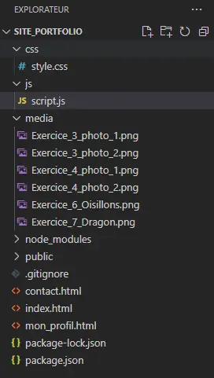
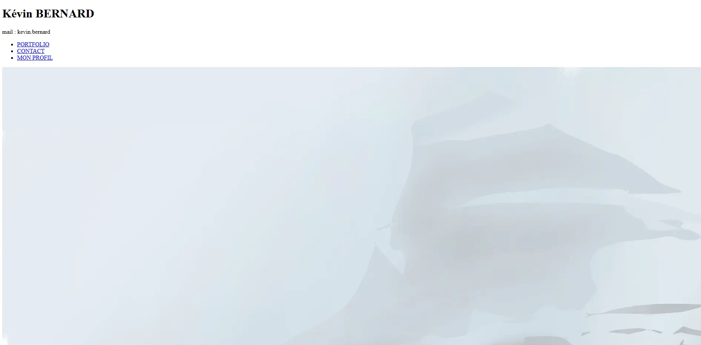
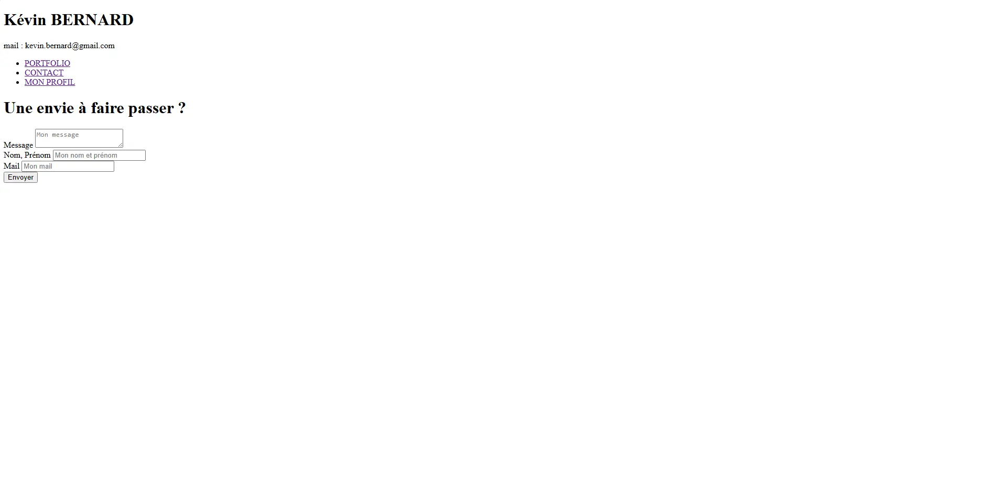
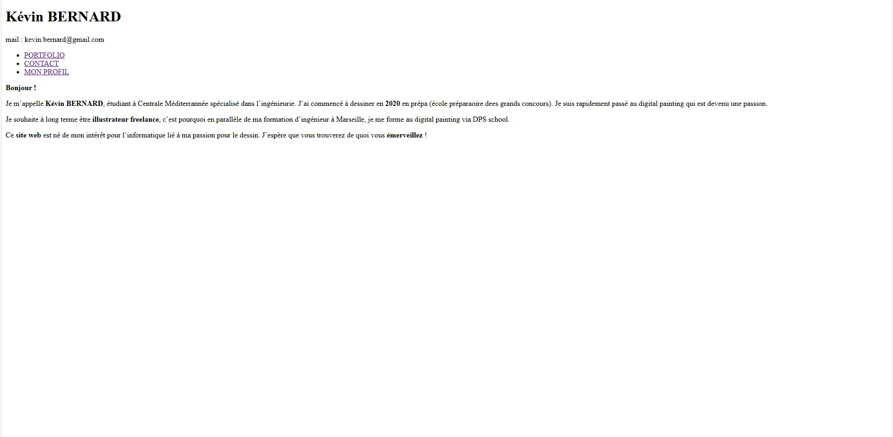
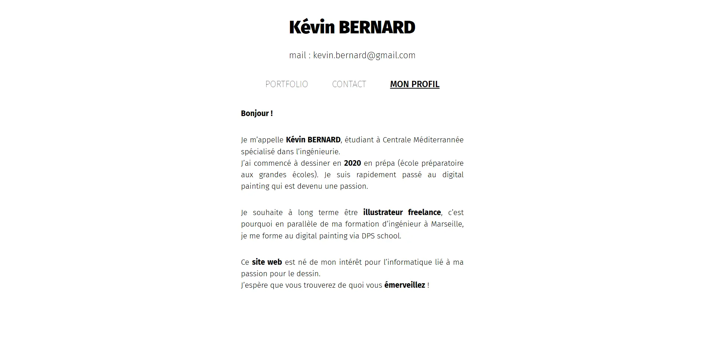
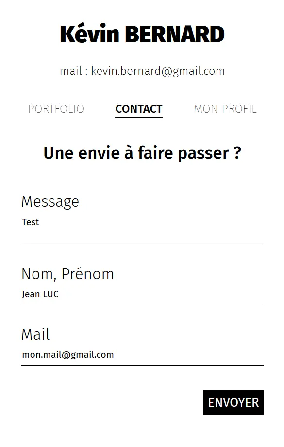
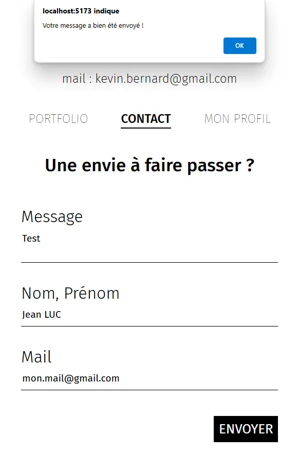
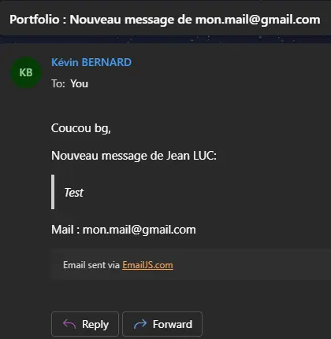
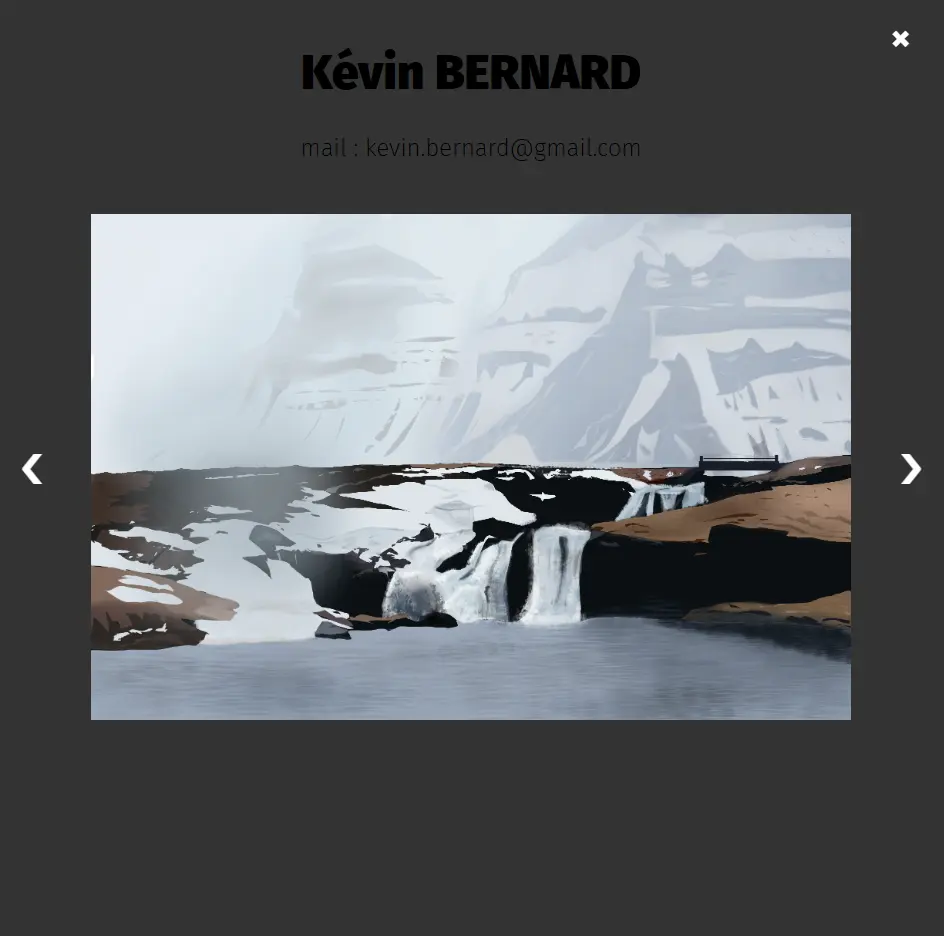
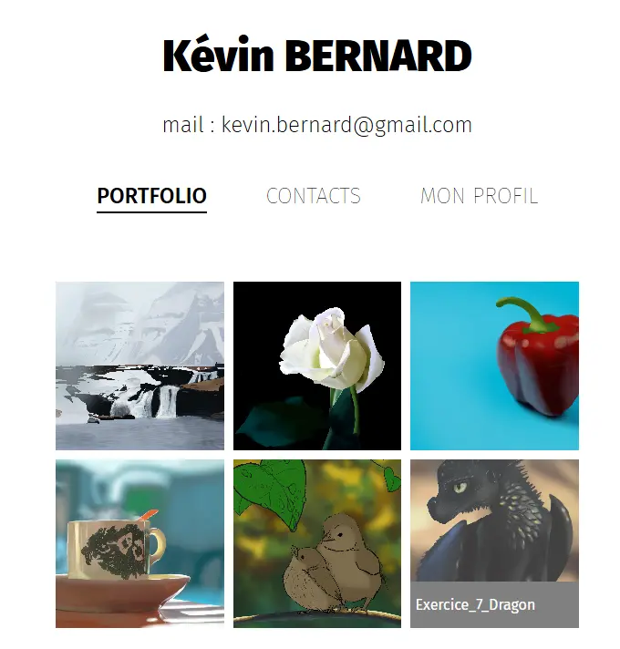



Savoir un peu coder en HTML (balises : a, div, button, ul, li, hX)





<b>SOURCES</b>

- [Sites de portfolio](https://www.ultra-book.com/portfolios)
- [Créer un Site Web HTML & CSS](https://www.youtube.com/watch?v=EFBufG7TKRE&t=510s)
- [Exemple de formulaire](https://www.youtube.com/watch?v=lR4-DJey_3A)
- [How to import Google Font](https://www.youtube.com/watch?v=E7QPO8P8nls)
- [Github avec le projet](https://github.com/KevinBERNARD1901/site_portfolio)
- [Barre mouvante inspiration](https://www.youtube.com/watch?v=aswRKAjjWuE)
- [Tuto Email JS](https://www.youtube.com/watch?v=BgVjild0C9A)
- [Documentation onclick](https://developer.mozilla.org/fr/docs/Web/API/Element/click_event)
- [Documentation hover](https://developer.mozilla.org/fr/docs/Web/API/Element/mouseover_event)




<b> POK & MON </b>

- [MON 1.1 : Apprendre à utiliser Figma](../../mon/temps-1.1)



Mon projet à long terme est de travailler en tant qu'**illustrateur free-lance** et je profite de Do-It pour avancer mes compétences en informatique et avancer vers cet objectif.
C'est pour cela que j'ai décidé de créer **mon site web avec mon portfolio.**

## Tâches

### Sprints

#### Sprint 1

- [x] Faire un Mockup sur Figma
- [x] Coder les pages en HTML
- [x] Coder le style en CSS

#### Sprint 2

- [x] Mettre le contact possible (message, prénom/nom, mail) (<b>estimé : </b>3H, <b>réel :</b> 2H50)
- [x] Ajouter une barre mouvante sur la barre de navigation (<b>estimé : </b>2H, <b>réel :</b> 2H50)
- [ ] Catégories : Tous, illustration, personnages, accessoires, croquis, recherche (<b>estimé : </b>3H, <b>réel :</b> )
- [x] Animation des images et de la souris quand cette dernière passe sur les images de la galerie (<b>estimé : </b>1H, <b>réel :</b> 2H20)
- [x] Animation dans la sélection des images (<b>estimé : </b>1H30, <b>réel :</b> 2H)
- [ ] Icône pour savoir si je suis disponible (cloche ou autre) (<b>estimé : </b>1H30, <b>réel :</b> )

### Horodatage

| Date | Heures passées | Indications |
| -------- | -------- |-------- |
| **Début Sprint 1** |
| Samedi 14/09  | 3H45  | Création du Mockup |
| Lundi 16/09 | 2H15 | Création des pages HTML + import font "Fira Sans" |
| Mardi 17/09 | 3H30 | Création du CSS des pages |
| Mercredi 18/09 | 1H30 | Rédaction du POK |
| Total | 11H |
| **Début Sprint 2** |
| Mercredi 25/09 | 1H30 | Barre qui bouge |
| Vendredi 11/10 | 5H10 | Barre qui bouge + Formulaire Contact + Animation de la sélection des images |
| Lundi 14/10 | 3H30 | Changer d'une image à l'autre + Hover sur une image |
| Total | 10H10 |


## Contenu

### Premier Sprint

#### Mockup

Dans un premier temps, j'ai réalisé le **Mockup** de mon site web.
Pour cela, j'ai cherché plusieurs exemples de sites qui existaient déjà pour m'en inspirer.



[Sites de portfolio](https://www.ultra-book.com/portfolios)



Une fois mes références en tête, j'ai fait mon **Mockup** sur **Figma** grâce à mon **MON 1.1** :


[MON 1.1 : Apprendre à utiliser Figma](../../mon/temps-1.1)




J'ai créé 3 pages :
- PORTFOLIO
- CONTACT
- MON PROFIL

J'ai rajouté la sélection d'une image que je ferai avec JavaScript dans mon Sprint 2.

#### HTML

Suite à cela j'ai créé mon projet grâce à plusieurs commandes :



[Créer un Site Web HTML & CSS](https://www.youtube.com/watch?v=EFBufG7TKRE&t=510s)



```
PS C:\Users\kevin\3A\Site_Portfolio> npm create vite@latest ./
  Need to install the following packages:
  create-vite@5.5.2
  Ok to proceed? (y) y


  > npx
  > create-vite ./

  √ Package name: ... site-portfolio
  √ Select a framework: » Vanilla
  √ Select a variant: » JavaScript

  Scaffolding project in C:\Users\kevin\3A\Site_Portfolio...
```

Puis j'installe les extensions **npm** pour pouvoir lancer le projet :

```
PS C:\Users\kevin\3A\Site_Portfolio> npm install
```

Ensuite j'ai organisé mon dossier de la manière suivante en prenant les png de mes digitals painting :



Après j'ai codé mes pages simplement et on avait ce premier aperçu :

1. Page PORTFOLIO :


1. Page CONTACT :



[Exemple de formulaire](https://www.youtube.com/watch?v=lR4-DJey_3A)


3. Page MON PROFIL :


#### CSS

Après j'ai stylisé mes pages.
Tout d'abord j'ai fait ce qui était général aux pages : la <b>police</b> et le <b>header</b>.



[How to import Google Font](https://www.youtube.com/watch?v=E7QPO8P8nls)



```
@import url('https://fonts.googleapis.com/css2?family=Fira+Sans:ital,wght@0,100;0,200;0,300;0,400;0,500;0,600;0,700;0,800;0,900;1,100;1,200;1,300;1,400;1,500;1,600;1,700;1,800;1,900&display=swap');

/* Style General */

* {
  font-family: "Fira Sans", sans-serif;
  font-optical-sizing: auto;
  font-weight: 400;
  font-style: normal;
}

h1 {
    font-weight: 900;
    text-align: center;
    margin-top: 50px;
    font-size: 3em;
}

h2 {
    font-weight: 800;
    text-align: center;
}

.mail{
    font-weight: 200;
    text-align: center;
    /* font-style: italic; */
    margin-top: 30px;
    margin-bottom: 50px;
    font-size: 1.5em;
}

b {
    font-weight: 700;
}

ul {
    list-style-type: none;
    text-align: center;
    padding: 0;
}

ul li {
    display: inline;
    margin: 0 30px;
}

ul li a {
    text-decoration: none;
    color: black;
    font-size: 1.5em;
    font-weight: 100;
}

a.mon_profil {
    font-weight: 500;
    text-decoration: underline;
}

a.portfolio {
    font-weight: 500;
    text-decoration: underline;
}

a.contact {
    font-weight: 500;
    text-decoration: underline;
}
```

Après je me suis occupé des pages :

1. **Page PORTFOLIO :**

```
/* Style portfolio */

div.portfolio {
    margin: 70px auto;
    width: 60%;
}

div.portfolio div {
    justify-content: center;
    display: flex;
}

img {
    width: 33%;
    aspect-ratio: 1/1;
    object-fit: cover;
    margin: 5px 5px;
}
```


2. **Page CONTACT :**

```
/* Style contact */

h2.contact {
    margin-top: 50px;
    margin-bottom: 60px;
    font-size: 2.2em;
    font-weight: 500;
}

div.contact {
    margin: 0 auto;
    max-width: 500px;
    width: 60%;
    font-size: 2em;
}

div.contact div {
    border-bottom: 1px solid black;
    margin-bottom: 40px;
}

label {
    font-weight: 300;
    margin: 10px 0;
    width: 100%;
} 
    
input, textarea {
    display: block;
    margin: 10px 0;
    border: none;
    width: 100%;
    font-size: 0.6em;
    resize: none;
}

input:focus, textarea:focus {
    outline: none;
}

button {
    padding: 10px;
    border: none;
    background-color: black;
    color: white;
    font-weight: 400;
    font-size: 0.8em;
    cursor: pointer;
    margin: 10px calc(100% - 125px);
}
```


3. **Page MON PROFIL :**

```
/* Style mon_profil */

div.mon_profil {
    margin: 50px auto;
    max-width: 600px;
    width: 60%;
    font-size: 1.3em;
    text-align: justify;
}

div.mon_profil p {
    margin-bottom: 40px;
    font-weight: 300;
    line-height: 1.5em;
}

div.mon_profil p b {
    font-weight: 700;
}
```



#### Retour sur expérience

**Difficultés :**

- J'ai eu du mal à importer le font.
- J'ai beaucoup chercher les paramètres CSS des balises HTML.
- J'ai mis du temps avant de réussir à mettre mon bouton au bout de ligne de mon div.

**Bilan**

Je suis beaucoup monté en compétence et mes bases en HTML & CSS qui étaient bancales sont devenues beaucoup plus solides.

### Second Sprint

#### Barre mouvante

Dans un premier temps j’ai commencé par animer la barre mouvante :
‘Photo avec du rouge’

Au début j’ai essayer de faire 'bouger' ma barre en utilisant du CSS mais j’ai tout de suite compris que si je voulais une animation avec une barre qui se déplace quand ma souris survole les autres liens de ma barre de navigation, j’allais avoir besoin de JavaScript.


[Barre mouvante inspiration](https://www.youtube.com/watch?v=aswRKAjjWuE)


C’était la première fois que j’utilisais JavaScript donc je me suis d’abord renseigner sur la manière de l’utiliser et quelle était la logique du langage de programmation de JavaScript. (Lien)

Après cela j’ai rajouté l’animation pour ma barre.


```
.barre_mouvante {
    position: absolute;
    bottom: 0;
    left: 0;
    width: 50px;
    height: 2px;
    background-color: black;
    transition: left 0.5s ease, width 0.5s ease;
}
```



```
const liens = document.querySelectorAll('nav ul li a');
const barre = document.querySelector('.barre_mouvante');

function change_lien_hover(lien){
    liens.forEach((lien_) => {
        lien_.style.fontWeight = '100';
    });
    lien.style.fontWeight = '500';

    const lien_rect = lien.getBoundingClientRect();
    const navRect = document.querySelector('nav').getBoundingClientRect();

    barre.style.width = `${lien_rect.width}px`;
    barre.style.left = `${lien_rect.left - navRect.left}px`;
}

function set_active_link(){
    const current_page = window.location.pathname.split('/').pop();

    liens.forEach((lien) => {
        const lien_href = lien.getAttribute('href');
        if (lien_href === current_page) {
            change_lien_hover(lien);
        }
    });
}

liens.forEach((lien) => {
    lien.addEventListener('mouseover', () => {
        change_lien_hover(lien);
    });
});

document.querySelector('nav').addEventListener('mouseout', () => {
    set_active_link();
});

set_active_link();
```


#### Contact form

Ensuite, j’ai essayé de m’envoyer un mail avec le contenu du form de ma page contact. J’ai d’abord fait des recherches avec mon MON 1.2 (lien). C'était long de tout tester.

Au début, j’ai pensé à Nodejs mail et je devais mettre mon identifiant et mon mot de passe dans mon JavaScript. Mais du coup, j’avais un problème de confidentialité, pour régler ce souci je pouvais utiliser des variables d’environnement et me créer un serveur backend ou gérer mes variables.

Je ne voulais pas avoir de backend à gérer donc j’ai fait marche arrière pour utiliser une API. J’ai trouvé Email JS qui fonctionnait très bien.(lien)

J'ai perdu beaucoup de temps à faire des allers-retours parce que je ne comprenais pas trop ce que je faisais.






```
<!DOCTYPE html>
<html lang="en">
  <head>
    <meta charset="UTF-8">
    <meta name="viewport" content="width=device-width, initial-scale=1.0">
    <link rel="stylesheet" type="text/css" href="/css/style.css">
    <script type="text/javascript"
        src="https://cdn.jsdelivr.net/npm/@emailjs/browser@4/dist/email.min.js">
    </script>
    <script type="text/javascript">
      (function(){
          emailjs.init({
            publicKey: "oMqq7O7XOuIBpqy1P",
          });
      })();
    </script>
    <script src="js/contact.js"></script>
    <title>Contact</title>
  </head>
  <body>
    <h1>Kévin BERNARD</h1>
    <p class="mail">mail : kevin.bernard@gmail.com</p>
    <nav>
      <ul>
        <li><a href="index.html">PORTFOLIO</a></li>
        <li><a href="contact.html" class="contact">CONTACT</a></li>
        <li><a href="mon_profil.html">MON PROFIL</a></li>
      </ul>
      <div class="barre_mouvante"></div>
    </nav>
    <h2 class="contact">Une envie à faire passer ?</h2>
    <form>
      <div class="contact">
        <div>
          <label for="message">Message</label>
          <textarea name="message" id="message" placeholder="Mon message" required></textarea>
        </div>
        <div>
          <label for="nom_prenom">Nom, Prénom</label>
          <input type="text" name="nom_prenom" id="nom_prenom" placeholder="Mon nom et prénom" required>
        </div>
        <div>
          <label for="mail">Mail</label>
          <input type="text" name="mail" id="mail" placeholder="Mon mail" required>
        </div>
        <button type="button" onclick="send_mail()">ENVOYER</button>
      </div>
    </form>
    <script src="js/script.js"></script>
  </body>
</html>
```



```
function send_mail(){
    let parametres = {
        nom_prenom: document.getElementById("nom_prenom").value,
        mail: document.getElementById("mail").value,
        message: document.getElementById("message").value
    };
    console.log(parametres);

    emailjs.send("service_82grttd", "template_b9hegeg", parametres).then(function() {
        alert("Votre message a bien été envoyé !");
    }).catch(function(error) {
        console.error("Échec de l'envoi : ", error);
        alert("Échec de l'envoi, veuillez réessayer.");
    });    
}
```




[Tuto Email JS](https://www.youtube.com/watch?v=BgVjild0C9A)



#### Animation du hover et de la sélection d’une image

Suite à cela je me suis occupé de la partie animation des images :
- Onclick
- Hover


```
<!DOCTYPE html>
<html lang="en">
  <head>
    <meta charset="UTF-8" />
    <meta name="viewport" content="width=device-width, initial-scale=1.0" />
    <link rel="stylesheet" type="text/css" href="/css/style.css" />
    <title>Portfolio</title>
  </head>
  <body>
    <h1>Kévin BERNARD</h1>
    <p class="mail">mail : kevin.bernard@gmail.com</p>
    <nav>
      <ul>
        <li><a href="index.html" class="portfolio">PORTFOLIO</a></li>
        <li><a href="contact.html">CONTACTS</a></li>
        <li><a href="mon_profil.html">MON PROFIL</a></li>
      </ul>
      <div class="barre_mouvante"></div>
    </nav>
    <div class="portfolio">
      <div>
        
        
        
      </div>
      <div>
        
        
        
      </div>
    </div>
    <div class="media_hover">
      <p id="media_hover_text"></p>
    </div>
    <div id="block_zoom" class="block_zoom">
      <span class="close">&times;</span>
      
      <div class="fleche_gauche">&#10094;</div>
      <div class="fleche_droite">&#10095;</div>
    </div>
    <script src="js/script.js"></script>
    <script src="js/portfolio.js"></script>
  </body>
</html>
```



```
const block_zoom = document.querySelector('#block_zoom');
const image_zoom = document.querySelector('.image_zoom');
const images = document.querySelectorAll('img.media');
const close_button = document.querySelector('.close');
const fleche_gauche = document.querySelector('.fleche_gauche');
const fleche_droite = document.querySelector('.fleche_droite');
const media_hover = document.querySelector('.media_hover');
const media_hover_text = document.querySelector('#media_hover_text');

function getImageZoomIndex() {
    return Array.from(images).findIndex(image => image.src === image_zoom.src);
}

media_hover.addEventListener('mouseover', () => {
    media_hover.style.display = 'flex';
});
media_hover.addEventListener('mouseout', () => {
    media_hover.style.display = 'none';
});
media_hover.addEventListener('click', () => {
    block_zoom.style.display = 'flex';
    image_zoom.src = images[getImageZoomIndex()].src;
    setTimeout(() => {
        block_zoom.style.opacity = '1';
        image_zoom.style.opacity = '1';
    }, 100);
});

images.forEach(image => {
    image.addEventListener('mouseover', () => {
        image_zoom.src = image.src;
        image.style.opacity = '0.8';
        media_hover.style.display = 'flex';
        media_hover_text.innerHTML = image.src.split('/').pop().split('.')[0];
        media_hover.style.left = `${image.getBoundingClientRect().left}px`;
        media_hover.style.bottom = `${window.innerHeight - image.getBoundingClientRect().bottom}px`;
        media_hover.style.width = `${image.getBoundingClientRect().width}px`;
    });
    image.addEventListener('mouseout', () => {
        image.style.opacity = '1';
        media_hover.style.display = 'none';
    });
    image.addEventListener('click', () => {
        block_zoom.style.display = 'flex';
        setTimeout(() => {
            block_zoom.style.opacity = '1';
            image_zoom.style.opacity = '1';
        }, 100);
    });
});

close_button.onclick = () => {
    block_zoom.style.opacity = '0';
    image_zoom.style.opacity = '0';
    setTimeout(() => {
        block_zoom.style.display = 'none';
    }, 500);
};

fleche_gauche.onclick = (e) => {
    e.stopPropagation();
    let index_image_zoom = getImageZoomIndex();
    let max_index = images.length - 1;
    let index = index_image_zoom - 1;
    if (index < 0) {
        index = max_index;
    }
    image_zoom.src = images[index].src;
}

fleche_droite.onclick = (e) => {
    e.stopPropagation();
    let index_image_zoom = getImageZoomIndex();
    let max_index = images.length - 1;
    let index = index_image_zoom + 1;
    if (index > max_index) {
        index = 0;
    }
    image_zoom.src = images[index].src;
}

block_zoom.onclick = () => {
    block_zoom.style.opacity = '0';
    image_zoom.style.opacity = '0';
    setTimeout(() => {
        block_zoom.style.display = 'none';
    }, 500);
}

image_zoom.onclick = (e) => {
    e.stopPropagation();
}
```


Pour le **onclick** :

J'ai quelque peu galéré à prendre toutes les images dans mon JS et je ne voyais pas comment faire pour écouter l'événement onclick d'une image parmie les autres sans devoir faire un copier-coller de la fonction pour chaque image comme j'avais fait pour les liens avec ma barre mouvante.
Finalement j'ai trouver la commande 'for each image in images' de JS.

Ensuite, ce qui a été le plus long était la mise en forme et comment gérer la transition d'opacité et le display none/flex.

Pour la transition d'une image à l'autre avec les flèches, j'avais un problème avec la taille de images qui était de 7 alors que je n'affichais que 6 images sur ma page. Je me suis rendu compte que l'image zoomée après le click était aussi pris en compte dans ma liste "images".



Pour le **hover** :

J'ai eu un peu de mal à faire en sorte d'avoir les coordonnées de l'image qui était survolée par la souris et surtout gérer le fait que si je clique sur le bandeau du hover cela sélectionne la bonne image.
J'avais au début un problème parce que l'accès à la référence de l'image n'étais disponible qu'après l'avoir cliquée alors que si je mettais la référence dès le hover, je l'avais à la fois pour l'événement hover et onclick.





- [Documentation onclick](https://developer.mozilla.org/fr/docs/Web/API/Element/click_event)
- [Documentation hover](https://developer.mozilla.org/fr/docs/Web/API/Element/mouseover_event)



#### Retour sur expérience

**Difficultés :**

- J'ai sous-évalué le temps que j'accordais à chaque tâche de mon projet.
- Je suis parti trop facilement, rapidement dans une direction avec Node.js avant de finalement faire marche arrière.

**Bilan**

Très satisfait de la qualité de ce que j'ai pu faire et à l'avenir j'ai envie de me faire mon propre serveur backend pour gérer mes mails et déjà me renseigner comment gérer les spams et attaques de sites...  
J'ai pu me démystifier de JavaScript ce qui était une des raisons du choix de ce POK.