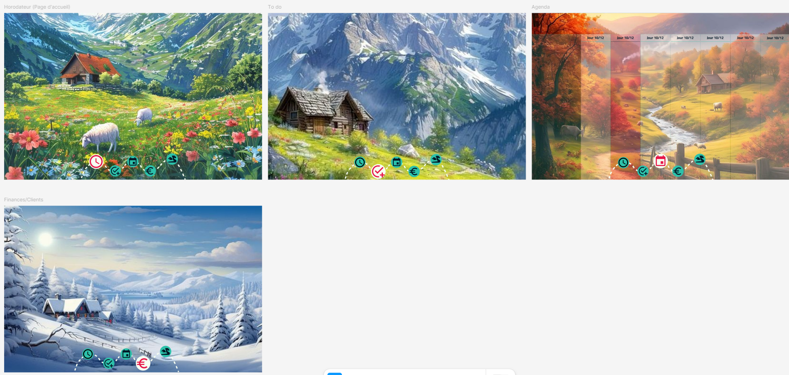
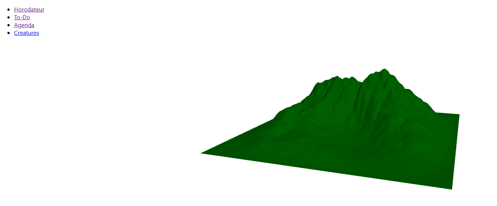
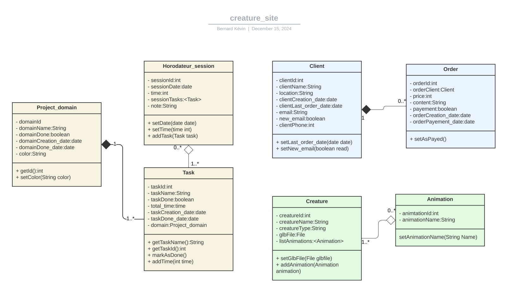


Pas de prérequis pour le moment



<b>SOURCES</b>
- [Awwwards](https://www.awwwards.com/)
- [House of Dreamers de Andrea Giuffrida sur Awwwards](https://www.awwwards.com/sites/house-of-dreamers)
- [Image postée par Maria Rojas sur Pinterest](https://fr.pinterest.com/pin/16255248649915602/)
- [Images de HorizonPeaksDesigns sur www.etsy.com ](https://www.etsy.com/fr/listing/1816504003/24-images-clipart-haute-resolution-de)
- [Tableau peinture paysage nature PARADIS D'AUTOMNE, sur le-petit-fermier.com](https://le-petit-fermier.com/products/tableau-peinture-paysage-nature?variant=50060240290118)
- [Image générée par IA sur fr.freepik.com par pjdesign](https://fr.pinterest.com/pin/391672498864069106/)
- [How to Implement a Blender Model in a React.js Application using Three.js de Matthes.B sur FreeCodeCamp](https://www.freecodecamp.org/news/blender-three-js-react-js/)
- [Vidéo de Youtube de Lucid Software, UML class diagrams](https://www.youtube.com/watch?v=6XrL5jXmTwM)
- [Vidéo Youtube de Cameron McKenzie, Spring Boot, JPA & Hibernate REST based CRUD Web Project with MySQL & Swagger](https://www.youtube.com/watch?v=Rel5ymzBBFE)
- [GitHub du site, creature_site de KevinBERNARD1901](https://github.com/KevinBERNARD1901/creature_site)




<b> POK & MON </b>
- [MON 2.1 : Introduction à React.js, Omar SALAME](https://francoisbrucker.github.io/do-it/promos/2023-2024/Omar-Salame/mon/temps-2.1/)
- [MON 3.1 : Débuter avec React.js, Thomas DUROY](https://francoisbrucker.github.io/do-it/promos/2022-2023/Duroy-Thomas/mon/MON_3.1/)
- [MON 2.1 : Animation 3D en React, Kévin BERNARD](https://francoisbrucker.github.io/do-it/promos/2024-2025/Bernard-Kevin/mon/temps-2.1/)
- [MON 2.2 : Spring Boot, Kévin BERNARD](https://francoisbrucker.github.io/do-it/promos/2024-2025/Bernard-Kevin/mon/temps-2.2/)


<!-- **Liste d'idées:**
- Faire un jeu en mode, réalisation de tâche = évolution de "Pokémon"
- Faire un excel pour gérer mes comptes
- Faire un excel pour gérer mes projets
- Faire un site en react (pourquoi pas le site de notre projet)
- Site avec toutes mes données d'écriture ou avec les stats de ce que j'écris

J'ai décidé de faire les tous en me créant une application qui me permettra de gérer mon activité d'illustrateur.

- J'aurai une page horodateur ou j'inscrirai mes tâches issues de ma TO DO de projets et rendez-vous...
- Ensuite j'aurai mon retroplanning de mes projets et un agenda regroupant mes tâches et tout ce que je veux mettre dedans (anniversaire, rendez-vous...)
- J'aurai une page qui sera dédiée à mon activité d'illustrateur avec mes clients, mes finances.
- La dernière page sera pour la gestion de mes créatures sachant que je mettrai des animations de ces créatures dans les autres pages suivant des actions (scroll de la page, tâche rempli...)
- Faire une carte regroupement la ou se trouve mes clients, voir le POK de Clarisse. Genre une map avec des points plus grands en fonction du nombre de clients qu'il y a dans la zone géographique.

Pour cela j'ai demandé à chatGPT ce qu'il me recommendait :
- Frontend : React.js avec des bibliothèques comme React-Three-Fiber (pour la 3D), FullCalendar (pour l’agenda), Chart.js ou Recharts (pour les finances).
- Backend : Node.js + Express avec une base de données comme MongoDB ou PostgreSQL.
- 3D et Animations : Modélisation et animation des créatures en Blender (export GLTF), puis intégration dans l’application avec Three.js (ou React-Three-Fiber pour les composants React). Utilisation de GSAP pour des animations fluides.
- Gestion des états : Redux pour un état global des tâches, projets, et créatures.
- Mobile et PWA : React Native pour une version mobile native ou PWA pour une app responsive.

J'avais envie de reprendre React donc vraiment bien et Blender aussi. -->

Le but de ce POK est de réaliser un site en React pour gérer mes tâches avec un horodateur, un agenda avec une importation de créatures 3D à partir de Blender. Ce qui peut se résumer à :

<center><b>Comment me créer un site de gestion de tâches attirant en React avec une expérience 3D ?</b></center>

## Tâches

### Sprints

#### Sprint 1

- [x] Création v0 de la maquette de l'application 
- [x] Création des pages

#### Sprint 2

- [x] Création du diagramme de classes UML
- [x] Création de la base de données
- [] Création des méthodes HTTP (pas totalement fini)

### Horodatage

| Date | Heures passées | Indications |
| -------- | -------- |-------- |
| **Début Sprint 1** |
| Mardi 05/11  | 2H45  | Création de la mind map et de la maquette |
| Dimanche 10/11 | 1H | Maquette : page Agenda |
| Jeudi 14/11 | 1H35 | Maquette: inspiration de House of Dreamers |
| Vendredi 15/11 | 1H | Importation du modèle blender sur la page web |
| Vendredi 15/11 | 0H45 | Ajustement de la lumière |
| Lundi 18/11 | 0H45 | Ajustement Caméra, position, taille |
| Mardi 19/11 | 2H15 | Création des pages et ajout de la navigation |
| Total | 9H45 |
| **Début Sprint 2** |
| Vendredi 13/12 | 2H50 | Spring Data JPA |
| Samedi 14/12  | 3H20  | Installation et prise en main Table SQL et injection au backend + Structure API et création du controller/service/repositotry et test de si cela marche |
| Dimanche 15/12 | 3H50 | Création du diagramme de classes UML + Faire la liste des méthodes HTTP |
| Total | 10H |

## Contenu

### Premier Sprint

#### Mind map/Maquette

##### 1ère idée

Sachant que je n'avais aucune référence de laquelle m'inspirer, j'ai décidé de faire une MindMap de toutes mes idées sur Miro pour les organiser.
J'ai classé mes idées en 3 catégories :
- Animations : liste des interactions possibles entre les créatures et mes actions (hover, finir une tâche...)
- Créatures : description des créatures et de comment gamifier la réalisation de tâches. (gagner des pierres pour invoquer de nouvelles créatures par exemple)
- Site : liste des pages et de leurs fonctionnalités/particularités

En parallèle, j'ai avancé le design de ma maquette sur Figma. J'ai fait une barre de navigation et regarder d'autres sites de productivité comme Asana ou Monday.
Initialement, je suis parti sur un site classique avec les créatures qui seraient rajoutées avec des animations comme un tour du tableau de tâche quand je scroll vers le bas.
Il y avait 4 pages :
- Horodateur : horodateur classique
- To do : liste des tâches par thème, projet
- Agenda : calendrier avec les tâches
- Créatures : gestion des créatures

Cela ne m'allait pas, je ne trouvais pas la chose attirante donc j'ai recherché des inspirations de sites en 3D sur Instagram et des sites internets dont le site [Awwwards](https://www.awwwards.com/) où j'ai trouvé le modèle [House of Dreamers](https://www.awwwards.com/sites/house-of-dreamers) de Andrea Giuffrida qui m'a beaucoup plu.

<video controls src="media/houseofdreamers.mp4" title="Title"></video>

---

##### 2e idée

Le modèle House of Dreamers de Andrea Giuffrida m'a donné l'idée de faire un fond 3D avec les créatures dedans.
1. En premier lieu, je me suis dit que j'allais intégrer les informations de mon site à mon décor. Par exemple, il y a un lac avec une cascade et le texte s'affiche sur l'eau. 
Après réflexion, j'ai trouvé cela trop compliqué à rendre intéressant et à faire.
2. J'ai opté pour mettre le texte et mes graphiques par dessus mon décor. Pour le choix de mes décors :
   - **Option 1** : Plusieurs paysages différents -> **avantage** : très créatif; **problèmes** : beaucoup de travail de blender + cohérence entre les pages et le style
   - **Option 2** :  Même paysage avec un changement de saison d'une page à l'autre -> **avantages** : 4 fois moins de travail + cohérence avec les créatures qui sont organisées selon 4 éléments + cohérence des pages; **problème** : je n'aime pas, je trouve cela plat.
   - **Option 3** : Changement d'élément à chaque page, avec un décor correspondant -> **avantage** : cohérence avec les éléments des créatures; **problème** : manque de cohérence visuel entre les pages

J'ai passé beaucoup de temps sur l'apparence possible de mon site, je ne savais pas quoi décidé entre les 3 options.
Sachant que je n'aurai pas le visuel tout de suite puisqu'il faut créer les décors sur Blender, je me suis arrêté là sur la partie design pour me concentrer sur la création du site en React.
Pour l'instant, ma maquette ressemble à cela (option 2):



<b>Sources</b>
- [Image postée par Maria Rojas sur Pinterest](https://fr.pinterest.com/pin/16255248649915602/)
- [Images de HorizonPeaksDesigns sur www.etsy.com ](https://www.etsy.com/fr/listing/1816504003/24-images-clipart-haute-resolution-de)
- [Tableau peinture paysage nature PARADIS D'AUTOMNE, sur le-petit-fermier.com](https://le-petit-fermier.com/products/tableau-peinture-paysage-nature?variant=50060240290118)
- [Image générée par IA sur fr.freepik.com par pjdesign](https://fr.pinterest.com/pin/391672498864069106/)


---

#### Importation module 3D

Ayant clarifier grossièrement à quoi ressemblera mon site, je suis passé à l'implémentation de  mon idée sur React.

Je me suis renseigné sur React et j'ai créé mon projet grâce aux MONs de Thomas DUROY et Omar SALAME.


- [MON 2.1 : Introduction à React.js, Omar SALAME](https://francoisbrucker.github.io/do-it/promos/2023-2024/Omar-Salame/mon/temps-2.1/)
- [MON 3.1 : Débuter avec React.js, Thomas DUROY](../../../../2022-2023/Duroy-Thomas/mon/MON_3.1/index.md)


Ensuite, j'ai téléchargé un [modèle gratuit](https://fr.3dexport.com/3dmodel-aerial-grassy-and-rocky-mountain-5-466915.htm) de Mixalisg depuis 3DEXPORT sous format glb.
J'ai fait les recherches pour mon MON et téléchargé les bibliothèques React Three Fiber et React Three Drei.


- [MON 2.1 : Animation 3D en React, Kévin BERNARD](../../mon/temps-2.1/index.md)


Dans un second temps, j'ai suivi un tutoriel de Matthes.B sur FreeCodeCamp pour importer un document depuis Blender jusqu'à ma page web. Et j'ai jouer avec les paramètres avoir quelque chose de satisfaisant.


[How to Implement a Blender Model in a React.js Application using Three.js de Matthes.B sur FreeCodeCamp](https://www.freecodecamp.org/news/blender-three-js-react-js/)


Avec le temps qu'il me restait, j'ai rajouté les liens avec React-rooter-dom.

Pour le moment cela ressemble à cela :



### Second Sprint

#### Spring

Dans un premier temps, j'ai réalisé mon MON 2.2 sur Spring Boot pour me familiariser avec le backend.


[MON 2.2 : Spring Boot, Kévin BERNARD](https://francoisbrucker.github.io/do-it/promos/2024-2025/Bernard-Kevin/mon/temps-2.2/)


Ce MON m'a pris plus de temps que prévu et j'avais besoin de certaines notions pour avancer dans mon POK. J'ai continué l'apprentissage de Spring Data JPA avec la [Vidéo Youtube de Cameron McKenzie, Spring Boot, JPA & Hibernate REST based CRUD Web Project with MySQL & Swagger](https://www.youtube.com/watch?v=Rel5ymzBBFE).

J'ai ensuite installer et pris en main MySQL puis je l'ai connecté à mon backend avec la propriété :
```Java
spring.jpa.hibernate.ddl-auto = update
```
Propriété pour que mes tables se construisent en fonction des objets que je créerai.

Suite à cela j'ai construit la structure de mon backend avec :
- Controller : fichier avec la gestion de mes routes
- Service : dossier avec les services de mes objets
- Repository : dossier les interfaces repository de mes objets
- Model: dossier contenant mes objets

J'ai vérifié que l'update automatique dans ma base de donnée sur SQL marchait et j'ai crée une route pour vérifier que cela fonctionnait grâce à Postman.

```Java
    @GetMapping("/tasks")
    public Task getTaskById(@RequestParam int id) {
        return taskService.getTaskById(id);
    }
```

#### Diagramme de classes UML

Une fois que j'avais un backend qui fonctionnait il ne me manquait que les données.
La première chose que j'ai faite a été de créer un diagramme de classes UML.
J'ai pris le premier site qui me permettait de faire cela (LucidChart)[https://www.lucidchart.com/pages/fr] parce que je voulais simplement avoir une base simple.




[Vidéo de Youtube de Lucid Software, UML class diagrams](https://www.youtube.com/watch?v=6XrL5jXmTwM)


Après cela, j'ai commencé à faire la liste de mes requêtes HTTP, j'ai atteint les 10H avant de la finir donc elle reste très simple et incomplète.

#### Routes HTTP

**POST**

- Client
  - createClient(@RequestBody Client client): Client

- Creature
  - createCreature(@RequestBody Creature creature): Creature

- Order
  - createOrder(@RequestBody Order order): Order

- Task
  - createTask(@RequestBody Task task): Task

- Horodateur
  - addTaskToSession(@RequestBody Task task): Task


**GET**

- Client
  - getClientById(@PathVariable int clientId): Client
  - getAllClients(): List<Client>

- Creature
  - getCreatureById(@PathVariable int creatureId): Creature
  - getAllCreatures(): List<Creature>

- Order
  - getOrderById(@PathVariable int orderId): Order
  - getAllOrders(): List<Order>

- Task
  - getTaskById(@PathVariable int taskId): Task
  - getTasksByProjectDomain(@RequestParam int domainId): List<Task>

**PUT**

- Client
  - updateClient(@PathVariable int clientId, @RequestBody Client client): Client

- Creature
  - updateCreature(@PathVariable int creatureId, @RequestBody Creature creature): Creature

- Order
  - updateOrder(@PathVariable int orderId, @RequestBody Order order): Order

- Task
  - updateTask(@PathVariable int taskId, @RequestBody Task task): Task

**DELETE**

- Client
  - deleteClient(@PathVariable int clientId): void

- Creature
  - deleteCreature(@PathVariable int creatureId): void

- Order
  - deleteOrder(@PathVariable int orderId): void

- Task
  - deleteTask(@PathVariable int taskId): void


**PATCH**

- patchDomain(String name, String color) : Domain

- Client
  - updateClientEmail(@PathVariable int clientId, @RequestParam boolean newEmail): Client
 
- Creature
  - addAnimationToCreature(@PathVariable int creatureId, @RequestBody Animation animation): Creature

- Order
  - markOrderAsPaid(@PathVariable int orderId): Order

- Task
  - markTaskAsDone(@PathVariable int taskId): Task

---

### Retour sur expérience

**Difficultés :**

- Je me suis perdu et j'ai fait un effet tunnel sur le design de mon site.
- Je n'ai pas bien identifié la priorité de ce que je voulais apprendre.

**Bilan**

Pour le sprint 1, je trouve dommage d'avoir passé autant de temps sur le design. J'aurais aimé toucher plus à React.
Pour le sprint 2, je suis très content car j'ai appris de mon erreur et je trouve que j'ai bien pris en main Spring Boot.
Le fait d'avoir le cours sur Java Gradle m'a beaucoup aidé pour comprendre comment fonctionne Spring Boot notamment pour les interfaces et je trouvais le cours très complémentaire.

De manière globale, c'est la première fois que je fais à la fois le front et le back et cela m'a débloqué.

**Réponse**

Pour répondre à la question :

**Comment me créer un site de gestion de tâches attirant en React avec une expérience 3D ?**

J'ai commencé à créer un site en React avec une expérience 3D en important un modèle Blender. 
Ensuite, j'ai crée le backend avec Spring Boot et j'ai fait un diagramme de classes UML pour structurer mes données avec un début de mes routes HTTP.