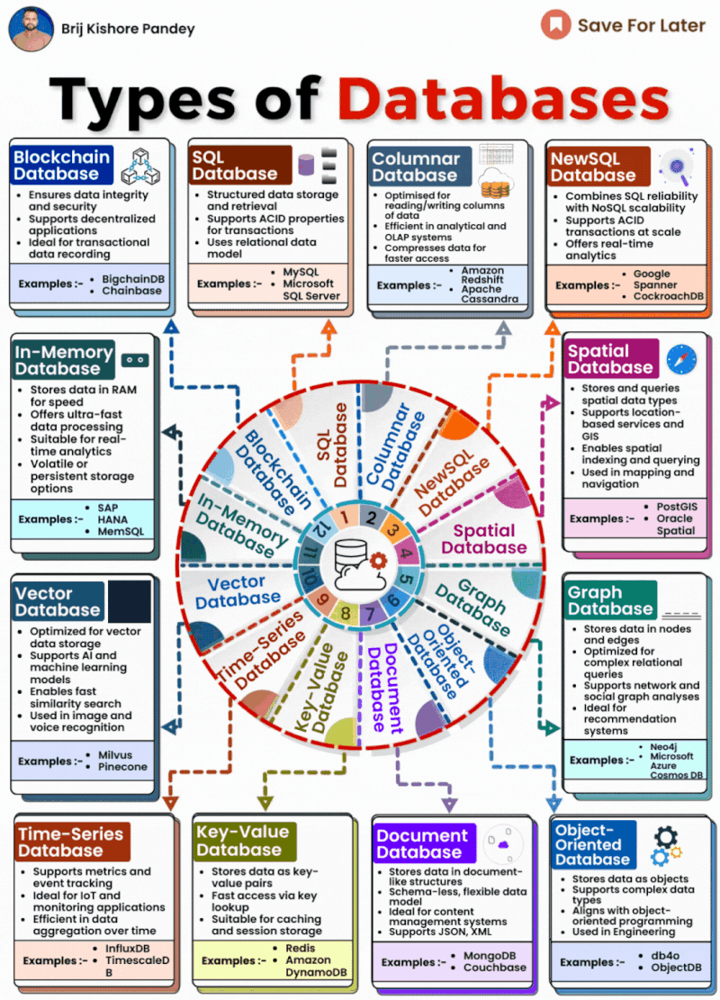
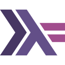
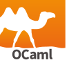
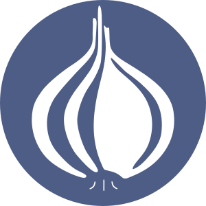

## Concepts
### Web
#### Front-end
La partie d'un site web ou d'une application que l'utilisateur voit et avec laquelle il interagit.
Elle est construite avec des outils comme HTML (pour la structure), CSS (pour le design) et JavaScript (pour le comportement). 

#### Back-end
La partie d'un site web ou d'une application que les utilisateurs ne voient pas.
Elle gère les données, la logique et la communication avec les bases de données et les serveurs. 
Elle communique souvent via des [APIs](#APIs)

#### Site Statique
Un site statique est un type de site web dont le contenu est pré-référencé et qui ne change pas en fonction
des interactions de l'utilisateur. Les pages de ce type de site sont généralement constituées de fichiers HTML,
CSS et JavaScript qui sont servis directement par un serveur web.

### APIs (Interfaces de Programmation d'Applications)
Une API (Interface de Programmation d'Applications) est un ensemble de règles et de protocoles qui permet à
différents logiciels de communiquer entre eux. Elle définit comment les demandes et les réponses sont formatées,
facilitant ainsi l'échange de données entre des applications ou des services.

#### HTTP et HTTPS
HTTP (HyperText Transfer Protocol) est le protocole utilisé pour transférer des données sur le web.
Il permet aux navigateurs de récupérer des pages web à partir de serveurs. HTTPS (HTTP Secure) 
est une version sécurisée de HTTP qui utilise le chiffrement pour protéger les données échangées,
garantissant ainsi la confidentialité et l'intégrité des informations.

#### REST
REST (Representational State Transfer) est un style d'architecture pour la création d'APIs qui utilisent les méthodes
HTTP pour interagir avec des ressources. Les APIs REST sont largement adoptées en raison de leur simplicité et de leur
capacité à fonctionner sur n'importe quel client capable de faire des requêtes HTTP. Elles sont généralement
stateless, ce qui signifie que chaque demande du client contient toutes les informations nécessaires pour traiter cette demande.

#### SOAP
SOAP (Simple Object Access Protocol) est un protocole ancien utilisé pour échanger des informations structurées
entre applications. Il repose sur XML pour le format des messages et est souvent considéré comme plus complexe et
lourd que REST. SOAP est encore utilisé dans certains environnements d'entreprise, mais il a été largement remplacé
par des architectures plus légères comme REST.

#### gRPC
gRPC est un framework open-source de communication entre services qui utilise HTTP/2 pour le transport et 
Protocol Buffers pour la sérialisation des données. Conçu par Google, il est particulièrement adapté aux microservices
en raison de sa performance et de sa capacité à gérer des connexions bidirectionnelles. gRPC est considéré comme
une avancée par rapport à REST et SOAP, offrant des fonctionnalités modernes pour les applications distribuées.
Néanmoins, il induit une complexité considérable.

### Bases de Données
Les bases de données sont des systèmes organisés qui permettent de stocker, gérer et récupérer des données. Elles sont essentielles pour de nombreuses applications, notamment les sites web, les applications mobiles et les logiciels d'entreprise. Les bases de données peuvent être classées en deux grandes catégories : SQL et No-SQL.

#### SQL (Structured Query Language)
SQL est un langage de programmation utilisé pour gérer et manipuler des bases de données relationnelles.
Les bases de données SQL sont organisées en tables, avec des lignes et des colonnes, et elles permettent 
de définir des relations entre les données.

- **Caractéristiques** :
  - **Schéma Défini** : Les bases de données SQL nécessitent un schéma défini, ce qui signifie que la structure des données doit être spécifiée avant l'insertion.
  - **Transactions ACID** : Elles garantissent des transactions fiables avec les propriétés ACID (Atomicité, Cohérence, Isolation, Durabilité).
  - **Requêtes Complexes** : SQL permet d'effectuer des requêtes complexes et des jointures entre plusieurs tables.

- **Exemples de Bases de Données SQL** :
  - **MySQL** : Une des bases de données relationnelles les plus populaires, utilisée pour des applications web et
    des systèmes de gestion de contenu.
  - **PostgreSQL** : Une base de données relationnelle avancée qui prend en charge des fonctionnalités comme
    les requêtes géospatiales et les types de données personnalisés.
  - **SQLite** : Une base de données légère, souvent utilisée pour les applications embarquées et les petites applications.

#### No-SQL (Not Only SQL)
Les bases de données No-SQL sont conçues pour stocker et récupérer des données non structurées ou semi-structurées.
Elles ne nécessitent pas de schéma fixe, ce qui les rend flexibles pour des types de données variés.
Généralement les bases de données No-SQL sont bien plus spécialisées que les BDD SQL.

- **Caractéristiques** :
  - **Flexibilité** : Les bases de données No-SQL permettent d'ajouter des champs sans avoir besoin de modifier un schéma prédéfini.
  - **Scalabilité Horizontale** : Elles sont souvent conçues pour se développer horizontalement en ajoutant des serveurs supplémentaires.
  - **Modèles de Données Variés** : Elles prennent en charge plusieurs modèles de données, notamment les documents, les colonnes, les clés-valeurs et les graphes.

- **Exemples de Bases de Données No-SQL** :
  - **MongoDB** : Une base de données orientée documents qui stocke des données au format JSON.
    Elle est très utilisée pour les applications web modernes.
  - **Cassandra** : Une base de données orientée colonnes, particulièrement adaptée pour gérer de grandes
    quantités de données sur plusieurs serveurs sans point de défaillance unique.
  - **Redis** : Une base de données clé-valeur en mémoire, souvent utilisée pour le caching
    et le stockage de données temporaires.



### Serveurs
Un serveur est un ordinateur ou un système qui fournit des ressources, des données ou des services à
d'autres ordinateurs, appelés clients, sur un réseau. Les serveurs sont essentiels pour héberger des sites web,
des applications, des bases de données et d'autres services en ligne.

L'hébergement de serveurs peut se faire de deux manières principales : sur site (On-Premise) ou dans le Cloud.

#### On-Premise
L'hébergement On-Premise signifie que les serveurs et les infrastructures sont installés et gérés sur le site de
l'entreprise. Cela permet un contrôle total sur le matériel et les logiciels, mais nécessite également des
investissements initiaux importants et des coûts d'entretien continus.

**Avantages**:
- Contrôle total : gestion complète des données et des ressources.
- Sécurité : les entreprises peuvent mettre en place des mesures de sécurité personnalisées.
- Conformité : plus facile de respecter certaines régulations de protection des données.

**Mainframes** : \
Ce sont de grands systèmes informatiques conçus pour gérer des volumes élevés de données et d'applications critiques.
Ils sont principalement utilisés par des grandes entreprises et des organisations gouvernementales pour le traitement
de transactions massives, la gestion de bases de données complexes et l'exécution d'applications essentielles.
*Basiquement, c'est un gros ordinateur, un très gros ordinateur*


#### Cloud
L'hébergement Cloud utilise des serveurs distants situés dans des centres de données gérés par des fournisseurs de
services (comme AWS (Amazon Web Services), Google Cloud, ou Microsoft Azure). Les ressources sont accessibles
via Internet, ce qui permet une scalabilité facile, un déploiement rapide et une facturation à l'utilisation.

**Avantages**:
- Scalabilité : possibilité d'augmenter ou de diminuer les ressources selon les besoins.
- Moins de coûts initiaux : pas besoin d'acheter et de maintenir le matériel.
- Accès à des services avancés : IA, machine learning, et outils d'analyse.

<!-- TODO: Partie sur les OS, parties des outils génériques, controle de version, IDE... -->

## Langages
> Un langage de programmation est un langage informatique destiné à formuler des algorithmes et produire des 
> programmes informatiques qui les appliquent. D'une manière similaire à une langue naturelle, un langage de
> programmation est composé d'un alphabet, d'un vocabulaire, de règles de grammaire, de significations,
> mais aussi d'un environnement de traduction censé rendre sa syntaxe compréhensible par la machine.

*Wikipédia* - [Langage_de_programmation](https://fr.wikipedia.org/wiki/Langage_de_programmation)

### Distinctions
#### Haut Niveau / Bas Niveau
- **Haut Niveau** : \
  Langages de programmation plus faciles à comprendre pour les humains car ils utilisent
  des mots et des symboles similaires au langage quotidien.
  Ils aident les développeurs à écrire des programmes plus rapidement en gérant des tâches complexes,
  comme la gestion de la mémoire, en arrière-plan. Exemple : Python est facile à lire et à écrire.
- **Bas Niveau** : \
  Langages de programmation plus proches de ce qu'un ordinateur comprend réellement (code machine).
  Ils sont plus rapides, mais plus complexes, et les développeurs doivent gérer de nombreux détails, comme la mémoire.
  Exemple : 'C' est rapide, mais plus difficile à utiliser.

#### Compilé / Interprété
- **Compilé** : \
  Le code est entièrement traduit en langage machine (le langage que l'ordinateur comprend) 
  avant d'être exécuté. Cela rend généralement les programmes plus rapides mais nécessite une étape 
  supplémentaire pour "compiler" le code d'abord. Exemple : C++ est compilé.
- **Interprété** : \
  Le code est traduit en langage machine pendant son exécution, ce qui rend les choses plus lentes,
  mais plus faciles à tester et à modifier. Exemple : Python est interprété.

#### Bare Metal / Machine Virtuelle / Conteneur
- **Bare Metal** : Exécution de programmes directement sur le matériel physique d'un ordinateur sans aucune couche intermédiaire.
- **Machine Virtuelle** : Une version logicielle d'un ordinateur qui s'exécute au-dessus d'un matériel réel. Elle agit comme un ordinateur séparé mais partage la même machine physique.
- **Conteneur** : Une manière légère d'exécuter des logiciels en isolation. Les conteneurs regroupent tous les fichiers nécessaires à l'exécution d'une application, facilitant ainsi le déplacement entre les environnements.

### Langages de programmation

**Attribution**

Les images utilisées pour les icônes des languages de programmation sont soit issues directement du
site du language (disponible en lien directement dans le titre) soit issues de
[Flaticon et crées par Freepik](https://www.flaticon.com/free-icons)


####  [C / C++](https://isocpp.org/)
C est un langage de programmation compilé, de bas niveau, utilisé pour les systèmes d'exploitation, les systèmes embarqués et les logiciels nécessitant des performances critiques. C++ est une extension de C, ajoutant la programmation orientée objet.

**Origine** : \
C a été développé par Dennis Ritchie chez Bell Labs en 1972. C++ a été développé par Bjarne Stroustrup en 1985 pour ajouter des fonctionnalités orientées objet à C.

**Frameworks populaires**:
- **Qt** : Un framework multiplateforme pour développer des applications en C++.
- **Boost** : Une collection de bibliothèques qui étend les fonctionnalités de C++.

**Utilisation réelle** : \
Le kernel Linux est écrit entre autres en C.
Le navigateur Chrome et une grande partie de Windows sont écrits en C++.


C, C++, JavaScript, HTML, CSS et bien d'autres parties fondatrices d'internet et de l'informatique
n'existent officiellement que sous la forme de spécifications, des looongs documents qui disent précisément et
exactement ce que le langage doit faire ou pas. Ces spécifications sont ensuite implémentées par de nombreux acteurs
tiers (qui sont d'ailleurs généralement impliqués dans la rédaction et la mise à jour des specs).

Par exemple, en CSS chaque navigateur (en gros) se charge de coder la façon dont les pages
web sont affichées, en respectant au mieux la spécification. Certaines features ne sont disponibles
que sur certaines implémentations eg. [`calc-size`](https://developer.mozilla.org/en-US/docs/Web/CSS/calc-size#browser_compatibility)


####  [C#](https://dotnet.microsoft.com/en-us/languages/csharp) *(.NET)*
C# est un langage de programmation compilé et orienté objet, principalement utilisé pour le développement d'applications
Windows, mais aussi pour les applications web et les jeux vidéo.

**Origine** : \
Développé par Microsoft en 2000 dans le cadre de son initiative .NET, C# est conçu pour être un langage simple et moderne pour les développeurs.

**Frameworks populaires**:
- **ASP.NET** : Un framework pour la création d'applications web dynamiques et de services web.
- **Unity** : Un moteur de développement de jeux vidéo utilisant C# comme langage principal.

**Utilisation réelle** : \
Visual Studio Code, un éditeur de code populaire, a été développé en C# à l'aide du framework Electron.

####  [Bash](https://www.gnu.org/software/bash/)
Bash (Bourne Again Shell) est un shell Unix utilisé pour exécuter des commandes et écrire des scripts d'automatisation.
Il est couramment utilisé pour les tâches d'administration système dans les environnements Linux et Unix.

**Origine** : \
Bash, a été développé en 1989 par Brian Fox dans le cadre du projet GNU.

**Frameworks populaires** : \
Bash n'a pas de framework dédié, mais il est utilisé pour l'automatisation directe des tâches sur les systèmes Unix.

**Utilisation réelle** : \
Les administrateurs système et les ingénieurs DevOps utilisent Bash pour automatiser la gestion
des serveurs et le déploiement de logiciels.

####  [Go](https://go.dev/)
Go est un langage compilé, statiquement typé, conçu pour la simplicité, la concurrence et la scalabilité.
Il est souvent utilisé pour les systèmes distribués et les applications qui nécessitent une haute performance.

**Origine** : \
Go a été développé par des ingénieurs de Google en 2007 pour créer des logiciels efficaces et évolutifs.

**Frameworks populaires**:
- **Gin** : Un framework web minimaliste et rapide pour Go.
- **Beego** : Un framework performant pour le développement rapide d'applications web.

**Utilisation réelle** : \
Docker, la plateforme populaire de conteneurisation, est écrit en Go.
[GoAuth2](https://francoisbrucker.github.io/do-it/promos/2024-2025/Billa-Valentin/pok/temps-1/) est aussi un exemple.


La petite créature que j'ai utilisée est en réalité la mascotte de Go, voici le vrai logo



####  [Haskell](https://www.haskell.org/)
Haskell est un langage de programmation purement fonctionnel, compilé, et à typage statique. Il est connu pour son
utilisation de fonctions immuables, ce qui signifie que les variables ne peuvent pas être modifiées une fois assignées.
Haskell favorise l'écriture de programmes robustes, corrects et concis grâce à son système de types avancé et ses
concepts comme les monades. Il est souvent utilisé dans les domaines nécessitant une grande fiabilité et rigueur,
tels que les systèmes financiers, la vérification formelle et la recherche académique.

**Origine** : \
Haskell a été standardisé en 1990 par un comité international, nommé d'après le logicien Haskell Curry.
Il a été conçu pour être un langage fonctionnel pur, permettant aux chercheurs et développeurs de mieux
explorer les paradigmes de la programmation fonctionnelle.

**Frameworks populaires**:
- **Yesod** : Un framework web puissant et évolutif pour Haskell, conçu pour des applications sécurisées et performantes.
- **Snap** : Un framework web minimaliste pour Haskell, utilisé pour construire des applications web légères.
- **Happstack** : Un autre framework web complet pour Haskell, offrant un grand contrôle pour développer des applications de toutes tailles.

**Utilisation réelle** : \
Haskell est largement utilisé dans le secteur financier pour développer des systèmes de trading automatisé et
des algorithmes à haute fréquence. Par exemple, certaines entreprises de finance comme Standard Chartered utilisent
Haskell pour garantir la fiabilité et la sécurité des systèmes de gestion des risques. Son système de types permet de
réduire les erreurs critiques dans les applications sensibles.

####  [Java](https://www.oracle.com/java/)
Java est un langage de programmation à typage statique, orienté objet, et compilé. Connu pour sa portabilité grâce à la
machine virtuelle Java (JVM), il permet d’écrire une fois du code et de l’exécuter sur n'importe quel système
d'exploitation. Java est un langage de haut niveau, conçu pour être simple, robuste, sécurisé, et indépendant
des plateformes, ce qui en fait un des langages les plus utilisés au monde. Il est particulièrement prisé pour les
applications d’entreprise, les systèmes distribués, et les applications Android.

**Origine** : \
Java a été développé par Sun Microsystems (aujourd'hui détenu par Oracle) et publié en 1995.
Il a été conçu pour être un langage "write once, run anywhere" (WORA), ce qui signifie que le code Java
peut fonctionner sur toute plateforme dotée de la JVM.

**Frameworks populaires**:
- **Spring** : Un framework pour créer des applications Java d'entreprise robustes, évolutives et sécurisées.
- **Hibernate** : Une bibliothèque de mappage objet-relationnel (ORM) qui facilite les interactions avec les bases de données.
- **JavaFX** : Une bibliothèque pour créer des interfaces graphiques modernes et dynamiques.

**Utilisation réelle** : \
Java est largement utilisé pour développer des systèmes backend robustes dans des entreprises comme
Uber, Amazon, et eBay. Il est également essentiel dans le développement d’applications Android (voir ci-dessous).

####  [Kotlin](https://kotlinlang.org/)
Kotlin est un langage de programmation moderne, concis, et polyvalent qui fonctionne également sur la JVM,
tout en étant compatible avec Java. Kotlin est un langage à typage statique et un des principaux langages
utilisés pour le développement Android. Il offre de nombreuses améliorations par rapport à Java, telles que
la null safety, les lambdas, et une syntaxe plus compacte, ce qui le rend plus agréable à utiliser pour les
développeurs tout en réduisant les risques d'erreurs.

**Origine** : \
Kotlin a été créé par JetBrains en 2011, une société de logiciels connue pour ses IDE (comme IntelliJ IDEA).
Il a été conçu pour améliorer l’expérience de développement sur la JVM et a été officiellement adopté par Google en 2017
comme langage principal pour le développement Android.

**Frameworks populaires**:
- **Ktor** : Un framework pour créer des applications web modernes et asynchrones en Kotlin.
- **Android SDK** : Utilisé avec Kotlin pour développer des applications Android performantes et intuitives.
- **Spring** : Compatible avec Kotlin, il permet de tirer parti des fonctionnalités modernes de Kotlin tout en exploitant les outils du framework Spring pour créer des applications robustes.

**Utilisation réelle** : \
Kotlin est aujourd’hui le langage recommandé pour le développement d’applications Android, 
ce qui a conduit des entreprises comme Pinterest et Trello à adopter Kotlin pour leurs applications mobiles.
Son intégration native avec les outils Android et sa compatibilité avec Java en font un choix populaire
pour les nouveaux projets Android.

####  [JavaScript](https://en.wikipedia.org/wiki/JavaScript)
JavaScript est le langage incontournable du web et est le seul langage qui permet de créer des interactions directement
dans le navigateur. Il est interprété, ce qui signifie qu'il est exécuté directement par le moteur JavaScript d'un
navigateur sans nécessiter de compilation préalable. Cela en fait l’un des langages de développement front-end les plus 
utilisés.

**Origine** : \
Développé par Brendan Eich en 1995 chez Netscape, JavaScript est conçu pour ajouter de l'interactivité aux pages web.
Contrairement à ce que suggère son nom, il n'est pas lié au langage Java.

**Frameworks populaires**:
- **React** : Une bibliothèque JavaScript pour la création d'interfaces utilisateur, maintenue par Facebook.
- **Angular** : Un framework de développement d'applications web développé par Google.
- **Vue.js** : Un framework progressif pour créer des interfaces utilisateurs et des applications monopages.

**Utilisation réelle** : \
JavaScript est utilisé par presque tous les sites web pour rendre les pages interactives. Par exemple, des plateformes comme Netflix et YouTube utilisent JavaScript pour gérer les lecteurs vidéo en ligne, la navigation fluide et l’affichage dynamique des données. De plus, les réseaux sociaux tels que Twitter et Facebook reposent fortement sur JavaScript pour offrir des expériences utilisateur réactives et interactives.


Bien que JavaScript ait historiquement été limité aux navigateurs web, il est aujourd’hui aussi couramment
utilisé côté serveur grâce à Node.js. Node.js a été développé en 2009 et permet d'exécuter du code JavaScript
côté serveur. Cela a révolutionné le développement web en permettant aux développeurs d'utiliser un seul langage 
pour gérer à la fois le front-end et le back-end d'une application.

**Utilisation réelle** : \
Node.js est utilisé par des entreprises comme LinkedIn, Uber et PayPal pour gérer les opérations côté serveur.


####  [TypeScript](https://www.typescriptlang.org/)
TypeScript est un sur-ensemble de JavaScript qui ajoute un typage statique, permettant de détecter les erreurs
lors de la compilation. Cela améliore la robustesse et la maintenabilité des projets, surtout à grande échelle.

**Origine** : \
Développé par Microsoft, TypeScript a été lancé en 2012 pour aider à structurer et typer le code JavaScript,
rendant le développement plus sécurisé.

**Utilisation réelle** : \
TypeScript est couramment utilisé dans des entreprises comme Slack, Airbnb, et Microsoft.

####  [Lua](https://www.lua.org/)
Lua est un langage de script léger et rapide, souvent utilisé comme langage embarqué dans d'autres applications,
notamment dans le développement de jeux vidéo et de logiciels.

**Origine** : \
Lua a été développé en 1993 par une équipe de chercheurs brésiliens.
Il est conçu pour être facile à intégrer dans d'autres systèmes, ce qui en fait un langage
parfait pour les environnements embarqués.

**Frameworks populaires**:
- **Love2D** : Un framework pour créer des jeux 2D avec Lua.
- **Corona SDK** : Un framework de développement multi-plateforme pour les applications mobiles et de bureau.

**Utilisation réelle** : \
Lua est le langage de script utilisé dans Roblox, une des plus grandes plateformes de jeux en ligne.

####  [Ocaml](https://ocaml.org/)
OCaml est un langage de programmation fonctionnel, impératif et orienté objet,
connu pour sa rapidité et sa polyvalence. Il est compilé et possède un système de types
fort et statique, avec une syntaxe proche de la programmation mathématique.
OCaml est souvent utilisé dans les domaines comme la finance, les systèmes de sécurité et la recherche,
grâce à ses performances élevées et sa capacité à écrire du code fiable et concis.

**Origine** : \
OCaml, initialement développé en France par l'INRIA en 1996, est une évolution du langage Caml, qui lui-même est une version de ML (Meta Language). Il a été conçu pour la programmation fonctionnelle, mais inclut des fonctionnalités permettant une programmation impérative et orientée objet, ce qui en fait un langage extrêmement flexible.

**Frameworks populaires**:
- **ReasonML** : Une extension syntaxique d'OCaml, soutenue par Facebook, qui permet de rendre OCaml plus accessible pour les développeurs web.
- **Ocsigen** : Un framework complet pour le développement d'applications web riches en OCaml, intégrant un serveur web et un outil de gestion des sessions.
- **Lwt** : Une bibliothèque permettant la programmation asynchrone en OCaml, largement utilisée pour la gestion des processus concurrents et des tâches réseau.

**Utilisation réelle** : \
OCaml est largement utilisé dans l'industrie financière, en particulier par des entreprises comme Jane Street,
qui l'utilise pour développer des systèmes de trading automatisé. OCaml est également utilisé pour développer des
outils d'analyse formelle et des logiciels critiques nécessitant une grande robustesse et sécurité.
Grâce à ses performances élevées et son système de types, OCaml est souvent choisi pour des applications
complexes et performantes.


On fait du OCaml en option informatique de MP !


####  [Perl](https://www.perl.org/)
Perl est un langage de script polyvalent, connu pour ses puissantes capacités de manipulation de texte.
Il est souvent utilisé pour l'administration système, le traitement de fichiers et les tâches automatisées.

**Origine** : \
Créé par Larry Wall en 1987, Perl était à l'origine destiné à gérer la manipulation de texte et
les logs, mais s'est étendu pour devenir un langage généraliste.

**Frameworks populaires**:
- **Dancer** : Un framework léger pour les applications web en Perl.
- **Mojolicious** : Un framework web en temps réel basé sur Perl.

**Utilisation réelle** : \
Le système de billetterie initial de Ticketmaster a été développé en Perl.


Perl n'a pas de logo officiel, j'ai utilisé le logo de la Perl foundation


####  [PHP](https://www.php.net/)
PHP est un langage de script côté serveur conçu pour le développement web dynamique.
Il est particulièrement adapté aux applications qui nécessitent des interactions serveur-serveur.

**Origine** : \
Créé par Rasmus Lerdorf en 1994, PHP a rapidement gagné en popularité
grâce à sa simplicité d'utilisation pour les développeurs web.

**Frameworks populaires**:
- **Laravel** : Un framework web élégant qui simplifie les tâches courantes.
- **Symfony** : Un framework flexible et performant pour des applications web complexes.

**Utilisation réelle** : \
Une énorme partie d'Internet repose sur PHP. Environ 77% des sites web utilisent PHP côté serveur,
principalement grâce à l'influence de WordPress, qui est écrit en PHP. WordPress, le CMS le plus utilisé au monde,
alimente à lui seul plus de 40% des sites web dans le monde. Cela inclut des millions de sites de toutes tailles,
des blogs personnels aux grandes entreprises.

####  [Python](https://www.python.org/)
Python est un langage de programmation de haut niveau, interprété, connu pour sa lisibilité et sa simplicité.
Il est largement utilisé dans de nombreux domaines : développement web, analyse de données, intelligence artificielle,
automatisation de tâches, et plus encore. Python est un langage dynamique, ce qui le rend facile à écrire et à modifier.

**Origine** : \
Python a été créé par Guido van Rossum à la fin des années 1980 et publié officiellement en 1991. Son design met l'accent sur la lisibilité du code, ce qui en fait l'un des langages les plus simples à apprendre pour les débutants.

**Frameworks populaires**:
- **Django** : Un framework web de haut niveau pour créer des applications web sécurisées et évolutives.
- **Flask** : Un micro-framework léger et flexible pour des applications web simples.
- **TensorFlow / PyTorch** : Des bibliothèques populaires pour le développement d'applications d'intelligence artificielle et de machine learning.
- **Pandas** : Un outil puissant pour l'analyse et la manipulation de données.

**Utilisation réelle** : \
Le backend d'Instagram utilise massivement Python pour gérer d'énormes quantités de données utilisateur,
et des géants comme Google et Netflix l'utilisent dans leurs infrastructures.

####  [R](https://www.r-project.org/)
R est un langage de programmation et un environnement dédiés aux statistiques, à l'analyse de données et à la création de graphiques.

**Origine** : \
Développé au début des années 1990 par Ross Ihaka et Robert Gentleman,
R est principalement utilisé dans les statistiques et les sciences des données.

**Frameworks populaires**:
- **Shiny** : Un framework pour créer des applications web interactives directement depuis R.
- **ggplot2** : Une bibliothèque de visualisation de données populaire pour créer des graphiques détaillés.

**Utilisation réelle** : \
R est très utilisé dans le milieu académique et dans les institutions de recherche pour l'analyse de données et
la modélisation statistique.

####  [Ruby](https://www.ruby-lang.org/en/)
Ruby est un langage de programmation interprété, orienté objet, conçu pour être simple et productif.
Il est souvent utilisé pour le développement web et les scripts.

**Origine** : \
Ruby a été créé par Yukihiro Matsumoto en 1995 avec pour objectif de rendre la programmation
plus facile et agréable pour les développeurs.

**Frameworks populaires**:
- **Ruby on Rails** : Un framework web très utilisé qui promeut la convention plutôt que la configuration.
- **Sinatra** : Un framework minimaliste pour construire rapidement des applications simples.

**Utilisation réelle** : \
GitLab, une alternative populaire à Github, est développée en Ruby on Rails.

####  [Rust](https://www.rust-lang.org/)
Rust est un langage compilé conçu pour la vitesse et la sécurité, en particulier dans la gestion
de la mémoire. Il est utilisé dans le développement de systèmes nécessitant haute performance et sécurité.

**Origine** : \
Rust a été développé par Mozilla en 2010 avec pour objectif d'offrir des performances élevées
sans compromis sur la sécurité mémoire.

**Frameworks populaires**:
- **Rocket** : Un framework web pour créer des applications rapides et sécurisées.
- **Actix** : Un puissant système d'acteurs pour développer des serveurs web en Rust.

**Utilisation réelle** : \
Le moteur de rendu Servo du navigateur Firefox de Mozilla est écrit en Rust.
En décembre 2022 il est devenu le premier langage autre que C et assembly à être utilisé dans le
développement du kernel Linux.

####  [Swift](https://www.swift.org/)
Swift est un langage compilé, moderne, conçu par Apple pour remplacer Objective-C dans le développement
d'applications pour iOS, macOS, watchOS et tvOS.

**Origine** : \
Swift a été introduit par Apple en 2014 comme alternative moderne à Objective-C pour le développement
d'applications sur ses plateformes.

**Frameworks populaires**:
- **SwiftUI** : Un framework pour la création d'interfaces utilisateurs sur toutes les plateformes Apple.
- **Vapor** : Un framework web pour développer des applications côté serveur en Swift.

**Utilisation réelle** : \
La majorité des applications iOS modernes, comme Airbnb, sont développées en Swift.

---

### Langages de balisage
Les suivants ne sont pas à proprement parler des languages de programmation, mais plutôt des languages de balisage
<span style="white-space: nowrap">(🇬🇧 "markup langage")</span>.
La distinction ne les rend évidemment pas moins utiles et ils restent des outils fondamentaux.

> En informatique, les langages de balisage représentent une classe de langages spécialisés dans l'enrichissement
> d'information textuelle. Ils utilisent des balises, unités syntaxiques délimitant une séquence de caractères ou
> marquant une position précise à l'intérieur d'un flux de caractères (par exemple un fichier texte).

*Wikipédia* - [Langage de balisage](https://fr.wikipedia.org/wiki/Langage_de_balisage)


<!-- sorry pour la longueur des titres, c'est pas possible de les couper en plusieurs bouts -->
####  [HTML](https://en.wikipedia.org/wiki/HTML) &  [CSS]()
HTML (Hypertext Markup Language) structures the content of web pages, while CSS (Cascading Style Sheets) styles it.
Together, they form the foundation of web development.

**Origine** : \
HTML a été développé en 1993 par Tim Berners-Lee, CSS a suivi en 1996 pour rajouter des styles aux pages de Tim.
Depuis nous en sommes à la HTML5 et CSS3.

**Frameworks Populaires**:
- **Bootstrap**: A front-end framework that simplifies responsive web design using HTML and CSS.
- **Tailwind CSS**: A utility-first CSS framework for rapidly building custom designs.

**Real-World Use**: Nearly every website in existence uses HTML and CSS for its structure and design, including Wikipedia.

#### XML, YAML, JSON, Markdown
- [**XML**](https://en.wikipedia.org/wiki/XML) (*Extensible Markup Language*) : \
  Utilisé des balises pour structurer les données, HTML utilise XML pour sa structuration.
  ```xml
  <note>
    <to>User</to>
    <from>AI</from>
    <message>Hello, World!</message>
  </note>
  ```
  Vous pourrez souvent le trouver dans des fichiers de configurations un poil datés (eg. `.pom`),
  c'était un format très populaire depuis sa création en 1996, mais est en déclin depuis l'arrivée de JSON 
- [**JSON**](https://www.json.org/json-en.html) (*JavaScript Object Notation*) :
  Un format d'échange de données EXTRÊMEMENT populaire (difficile de trouver des API qui ne renvoient pas de JSON) et
  relativement léger, il est basé sur un sous-ensemble du langage de programmation JavaScript
  ```json
  {
    "user": "AI",
    "message": "Hello, World!"
  }
  ```
- [**YAML**](https://yaml.org/) (*YAML Ain't a Markup Language™*) : \
  Un format facilement lisible qu'on retrouve souvent dans les fichiers de configuration
  ```yaml
  user: AI
  message: "Hello, World!"
  ```
- [**Markdown**](https://en.wikipedia.org/wiki/Markdown) : \
  Un format simple pour écrire et formater du texte, largement utilisé dans la documentation.
  Il en existe de multiples variantes, qui ont des fonctionnalités supplémentaires (le site Do_It en est un exemple,
  Discord, Github en sont d'autres), on appelle la version originale ['CommonMark'](https://commonmark.org/)
  ```markdown
  # Heading
  - User: AI
  - Message: "Hello, World!"
  ```
