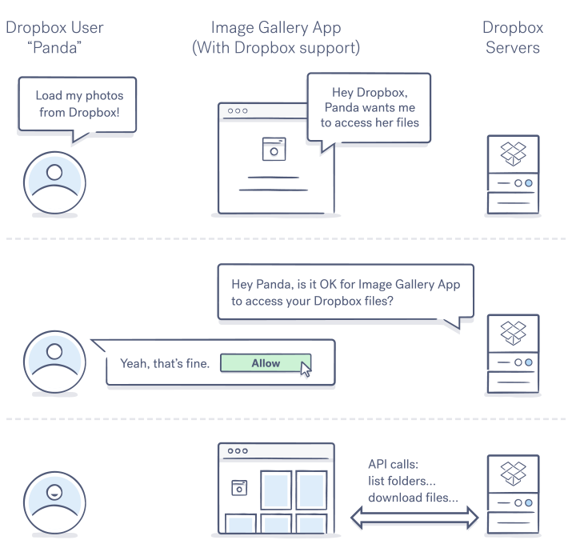
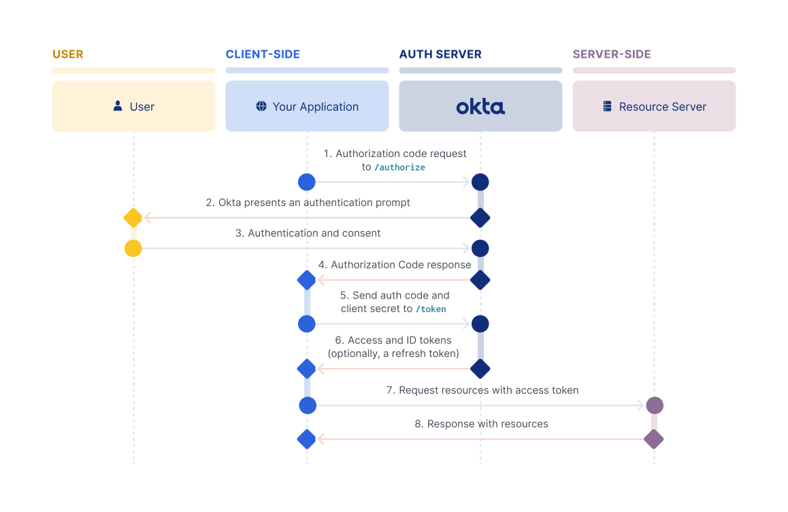


- Bases relativement solides en programmation
- Une idée des différences entre utilisateur, client, serveur
- Quelques concepts d'authentification peuvent aider (token, hash...)  


## Objectifs
Je n'ai jamais codé en Go, mais le langage m'intrigue depuis un moment, c'est pourquoi j'ai envie de tenter de coder un
projet concret pour m'initier aux bases. En l'occurence, ce sera un serveur d'authentification OAuth2, mes connaissances
sur le sujet sont relativement superficielles, c'est pourquoi je souhaite les approfondir au long de ce POK.


Les objectifs sont volontairement très (trop) optimistes, pour être certain de ne pas manquer de contenu !


## À propos de OAuth et Go
OAuth est un protocole d'autorisation utilisé pour permettre à des applications tierces d'accéder aux ressources d'un
utilisateur sans divulguer les identifiants de celui-ci. Il est couramment utilisé pour permettre des connexions via des
services comme Google, Facebook, etc.

Go (ou Golang) est un langage de programmation développé par Google, connu pour sa simplicité, ses performances élevées,
et son support solide pour la concurrence grâce aux goroutines.

## Sprint 1
### Planning Prévisionnel
#### 1.1 Introduction à Go
  - [X] Configurer l'environnement de développement Go.
  - [X] Parcourir les tutoriels de base sur Go.
  - [X] Écrire quelques programmes simples pour se familiariser avec la syntaxe et les concepts de Go.

#### 1.2 Concepts de base d'OAuth2
  - [X] Étudier le protocole OAuth2 (RFC 6749).
  - [X] Comprendre les différents rôles (Client, Ressource Owner, Authorization Server, Resource Server).
  - [X] Examiner les types de flux (Authorization Code, Implicit, Resource Owner Password Credentials, Client Credentials).

#### 1.3 Développement initial
  - [X] Créer un projet Go pour le serveur OAuth2.
  - [X] Implémenter une première version du serveur OAuth2 avec les routes de base pour l'autorisation et les tokens.
  - [X] Tester les premières implémentations avec des clients simples.

*Propositions pour le Sprint 2*
#### 2.1 Tests et Client
  - [ ] Écrire des tests unitaires pour quelques fonctions internes.
  - [ ] Écrire des tests d'intégration pour les routes principales.
  - [ ] Créer une page de connection avec Java Spring Boot Oauth.

#### 2.2 Persistence des données
  - [ ] Choisir et configurer une base de données (ex. MySQL).
  - [ ] Mettre en place les schémas de base pour stocker les utilisateurs, les clients OAuth2, et les tokens.

### Horodatage

| Date           | Heures passées | Indications             |
|----------------|----------------|-------------------------|
| Samedi 07/09   | 2H             | Introduction à Go       |
| Lundi 10/09    | 4H             | Concepts d'OAuth2       |
| Mardi 11/09    | 4H             | Serveur Basique         |
| Mercredi 12/09 | 5H             | Intégration à Redis     |
| Samedi 13/09   | 4H             | Token Rotation          |
| Dimanche 13/09 | 2H             | Fausse Routes Protégées |
| Lundi 13/09    | 4H             | OAuth2.1 & GitHub       |
| **Total**      | **25H**        | **Petit Overtime...**   |

### Rétro

J'ai un peu abusé... le sujet m'intéresse beaucoup et j'avais envie de bien travailler sur un projet pour 
avoir des choses à mettre sur mon GitHub. Étant donné que j'ai tendance à hyper-focus, il va falloir que
je me fixe des limites dures pour le prochain sprint pour éviter d'en faire trop.

Néanmoins, j'ai pu faire le gros du travail de prototypage les 10 premières heures. Travail que j'ai 
ensuite raffiné les heures suivantes dont je parlerais dans des parties supplémentaires.

Mon plan pour le sprint 2 ne change que très peu (encore très fourni) car je n'ai volontairement pas
beaucoup touché à ce qui était prévu pour le second sprint.

Pour mieux respecter les objectifs de temps, je vais utiliser un minuteur plutôt qu'un chronomètre
pour l'horodatage et apposer des estimations de temps aux étapes prévues pour le sprint. 

### Introduction à Go

Quel meilleur endroit pour faire connaissance avec un langage que la doc ?!
J'ai commencé par me balader sur un [tutoriel interfactif](https://go.dev/tour/) disponible sur le site du langage.

On y constate en effet la grande simplicité du langage
- 2 structures de données disponibles par défault (dictionnaires `map[T]T` et arrays `[]T`)
- seules les boucles `for` existent
- pas d'héritage (le type embedding permet une fonctionnalité similaire.)
- seulement deux types de visibilités (public et package private) choisies en fonction de la casse du premier caractère
- les erreurs sont des valeurs

Les channels sont au cœur du langage, mais je n'ai pas trop eu l'occasion d'y toucher.
Elles permettent une grande flexibilité et aisance dans la gestion de l'asynchrone.

Une fois le tutoriel complété, j'ai directement décidé de me mettre les mains à la patte
pour me mettre en conditions réelles.

Pour plus d'informations n'hésitez pas à aller voir les POK&MON existants sur Go

[MON d'Emma](../../../Gonin-Emma/mon/temps-1.1)


### Concepts de base d'OAuth2

OAuth (Open Authorization) est un protocole d'autorisation standardisé permettant à des applications tierces d'accéder
aux ressources d'un utilisateur sans divulguer les identifiants de celui-ci.
OAuth est souvent utilisé pour permettre des connexions via des services comme Google, Facebook, etc.,
tout en renforçant la sécurité.

Voici une image pour illustrer rapidement le rôle du serveur d'authentification (Dropbox dans le cas ci-dessous)

L'objectif premier du protocole OAuth est simple : transmettre un token (~équivalent à une clé numérique)
à une application tierce pour que celle-ci puisse faire des actions en tant que l'utilisateur qui
a consenti à lui donner certains droits. Par exemple, sur l'image d'au-dessus, l'application à le
droit d'accéder aux fichiers dropbox de l'utilisateur.

Comme pour beaucoup de processus de sécurité ou d'authentification, la communication s'établie
en plusieurs étapes, car elle a pour objectif de vérifier tout un tas de choses sur les parties prenantes
que l'on détaillera lors de l'explication du flow authorization code avec PKCE.

Pour mieux comprendre les concepts clés, j'ai passé un long moment à lire la [spécification OAuth2](https://datatracker.ietf.org/doc/html/rfc6749),
suite à quoi j'ai utilisé le [playground OAuth](https://www.oauth.com/playground/) pour tester les différents flows d'authentification.

Plusieurs protocoles sont proposés dans la spécification pour récupérer le token cependant nous
allons nous concentrer sur un seul, principalement, car c'est le plus recommandé et sécurisé,
mais aussi puisque c'est d'après moi le plus intéressant.

#### Protocole avec code autorisation et PKCE 

Ce [playground](https://www.oauth.com/playground/authorization-code.html) est une petite merveille pour mieux comprendre
le protocole utilisé, je conseille de faire une tour dessus avant la lecture des paragraphes suivants.

Ici, okta est le serveur d'authentification et le 'resource server' peut être utilisé pour récupérer des données à partir des tokens fournis par okta.
*Tout à l'heure Dropbox était responsable à la fois de l'authentification et de ressources, ce n'est pas toujours le cas.*

#### Développement Initial


Le code que j'ai écrit lors de ce POK est disponible sur un [répository GitHub](https://github.com/ValentinBilla/GoAuth2.0).


## Sprint 2
### Planning Prévisionnel
#### 2.1 Tests et Client
- [ ] Écrire des tests unitaires pour quelques fonctions internes.
- [ ] Écrire des tests d'intégration pour les routes principales.

#### 2.2 Persistence des données
- [ ] Choisir et configurer une base de données (ex. MySQL).
- [ ] Mettre en place les schémas de base pour stocker les utilisateurs, les clients OAuth2, et les tokens.


- [Site officiel de Go](https://go.dev)
- [Spécification OAuth2.0](https://datatracker.ietf.org/doc/html/rfc6749)
- [Playground OAuth2.0](https://www.oauth.com/playground/)

