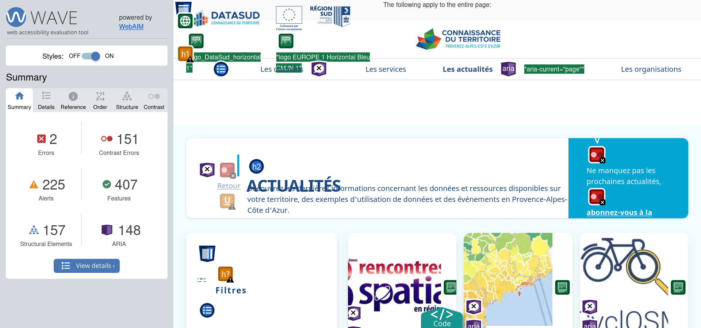



- Quelques bases en HTML / CSS
  

## Objectifs

Comment méthodiquement identifier et résoudre les problèmes d'accessibilités d'un site web ?

Celà fait maintenant un bon moment que je code des sites web néanmoins mon approche de l'accessibilité est encore
vague et inconsistante. C'est pourquoi je voulais initialement faire un MON dédié à celle-ci et les différentes règles
(et/ou lois) à respecter. On m'a finalement proposé l'opportunité de faire un diagnostic de l'accessibilité du site
[Datasud](https://www.datasud.fr) ce qui me semble être un bon moyen de me former au sujet.

## Sprint 1

### Planning Prévisionnel

#### 1.1 Introduction à l'accessibilité et la réglementation en vigueur

- [X] Lecture de l'[introduction à l'accessibilité](https://www.w3.org/WAI/fundamentals/accessibility-intro/fr#evaluate)
  du site W3.
- [X] Lecture du [Diagnostic flash](https://design.numerique.gouv.fr/outils/diagnostic-flash/) au RGAA (suggéré par une
  employée de Datasud par mail)
- [X] Identification des réglementations Françaises et Européennes en vigueur.

#### 1.2 Diagnostic

- [X] Installation d'outils adaptés sur mon navigateur.
- [X] Navigation sur le site Datasud à la recherche de problèmes.
- [X] Proposition de solutions.
  *les deux derniers sont faits en parallèle.*


N'étant pas encore au courant des différentes pages disponibles sur le site, je ne suis pas certain de
tout ce que je vais couvrir lors de mon diagnostic du sprint 1


### Accessibilité

Lors de mes premières heures de POK, j'ai décidé de me renseigner sur les problématiques liées à l'accessibilité.
Tout d'abord, je me suis dirigé vers l'article d'[introduction à l'accessibilité](https://www.w3.org/WAI/fundamentals/accessibility-intro/fr#evaluate)
disponible sur le site de la W3 qui donne un bon résumé du pourquoi de l'accessibilité. Ensuite j'ai rapidement lu le
[Diagnostic flash](https://design.numerique.gouv.fr/outils/diagnostic-flash/) pour le RGAA
(Référentiel Général d’Amélioration de l’Accessibilité), recommandé dans un mail de DataSud afin de m'approprier les 
principales erreurs sur lesquelles rester vigilant.

Finalement, j'ai exploré le MON d'Inès ["Handicap ou pas cap"](/promos/2024-2025/Kebbab-Ines/mon/temps-1.1/), qui s'avère
être une petite mine d'or bibliographique que j'ai utilisée pour me constituer une connaissance considérable sur le sujet.
J'ai passé un peu trop de temps à explorer les différentes annotations ARIA, spécifications CSS et autres thèmes
rétrospectivement un peu trop spécifiques.


Lors de la séance POK&MON du mercredi 20 novembre, j'ai pu discuter avec Juliette de son MON sur les
[dark patterns et manipulation de l'esprit](/promos/2024-2025/Juliette-Kocupyr/pok/temps-2/) qui,
eux aussi, apportent leurs lots de problèmes d'accessibilité !


### Outils

J'ai commencé par installer deux extensions recommandés sur le site du diagnostic flash RGAA:
- HeadingsMap (symbolisée par le pictogramme [h/])
  *visualiser la hiérarchie du document HTML (important pour la navigation au clavier et lecteurs d'écran)*
- Contrast Checker (symbolisée par une roue multicolore)
  *valider les écarts de contraste pour les différentes couleurs du site*
   
J'ai ensuite voulu essayer d'autres outils comme [WAVE](https://wave.webaim.org/) ou [Lighthouse](https://developer.chrome.com/docs/lighthouse/)
dont que j'ai vu mentionnés sur [une discussion Reddit](https://www.reddit.com/r/accessibility/comments/wdgol0/tools_for_accessibility_scans_on_websites/)
relative où un internaute se questionne sur les outils utilisés par ses compères.

Mon expérience avec ces deux derniers ne fut pas très positive, car le long temps de chargement de DataSud soit empêchait
l'analyse soit ne permettait que d'analyser l'accessibilité de la page de chargement...

### Exploration du site


Tout au long de l'exercice, j'ai décidé de naviguer un maximum en utilisant mon clavier et en bloquant le chargement
des images.


Lors de ma première semaine de filière métier, j'ai eu l'occasion de me balader un peu sur le site et donc d'identifier
une sorte de marche à suivre.

J'ai commencé par les pages de documentation disponibles dans l'onglet "Commencer sur DataSud" eg. ["Qu'est-ce que DataSud"](https://www.datasud.fr/portal/commencer).
Étant principalement des explications celles-ci étaient plutôt simples à analyser en terme d'interaction utilisateur ->
pas de formulaires, boutons... je suis donc principalement resté vigilant sur l'organisation hierarchique du contenu, 
l'accessibilité des images et de la facilité de compréhension du texte.

Ensuite, j'ai porté mon œil sur la page d'accueil du site sur laquelle ce qui m'a pris le plus de temps était la 
barre de navigation et son burger menu associé sur téléphone. Ceux-ci n'étaient pas correctement accessibles, entre autre
les sous-menus n'étaient pas accessibles au clavier, j'ai donc fait pas mal de recherches pour apporter une suggestion
d'amélioration. Pour cela, j'ai d'ailleurs tenté d'identifier les technologies utilisées pour coder le site, malheureusement
je n'ai pas trouvé le code source du site sur le [GitHub de DataSud](https://github.com/datasud/) donc je me suis basé 
sur le code source disponible dans l'inspecteur d'élément:
- [React](https://react.dev/) (il est fait mention de 'react-helmet' une librairie React)
- [Tailwind](https://tailwindcss.com/) qui permet d'ajouter des styles directement dans le HTML

Le temps passé sur chaque page complexe s'est avéré beaucoup plus grands que ce que j'estimais initialement pour plusieurs raisons:
- Je testait toujours plusieurs tailles d'écrans
- Faire des recherches sans connaître ou identifier le vocabulaire adapté prend du temps
- Pour chaque élément, je me demande s'il est OK ou si un problème que je ne connais pas encore est présent
- BEAUCOUP d'informations et règles avec lesquelles se familiariser
- Il y a souvent plusieurs solutions possibles à chaque problème et il est difficile de les évaluer sans recul

### Horodatage

| Date           | Heures passées | Indications                      |
|----------------|----------------|----------------------------------|
| Lundi 11/11    | 4H             | Introduction à l'accessibilité   |
| Jeudi 14/11    | 3H             | Déambulages et notes sur le site |
| Vendredi 15/11 | 3H             | -- idem --                       |
| **Total**      | **10H**        |                                  |

## Rétro

Je pense que j'ai passé trop de temps à lire des documents sur l'accessibilité sans vraiment disons aller voir sur le
terrain (je suis très sujet à aller de lien en lien et me perdre dans la documentation).

Sinon, je suis plutôt satisfait de ce que j'ai commencé à produire. Je suis plus méthodique dans ma capacité à repérer
les erreurs d'accessibilité, mais je pense maintenant qu'il n'y pas UNE bonne façon de faire la diagnostique et que
c'est en grande partie un processus empirique qui se simplifie au fur et à mesure que notre connaissance du sujet
s'affine aussi les mêmes problèmes basiques apparaissent souvent eg. `` et deviennent des automatismes.

## Sprint 2

### Planning Prévisionnel

#### 2.1 Diagnostic

- [X] Navigation sur de nouvelles pages du site Datasud.
- [X] Proposition de solutions.
  *les deux derniers sont faits en parallèle.*

### 2.2 Production d'un rapport

- [X] Aggrégation des problèmes identifiés par catégories RGAA.
- [ ] Rédaction du rapport, incluant des suggestions de code d'amélioration.

#### Lighthouse et WAVE

J'ai découvert qu'au lieu d'utiliser les sites, je peux utiliser les extensions qui me permettent d'analyser des 
pages initialement cachée derrière des écrans de chargement.

WAVE est au début dur à appréhender, car il rajoute énormément d'informations à la page, de couleurs etc,
mais des informations très intéressantes.

Au plus j'analyse le site au plus je me rends compte que lister les erreurs semble contre productif sachant qu'il est
possible pour le staff de DataSud de faire tourner WAVE et Lighthouse sur le site pour avoir les détails. Je vais donc
me concentrer sur les pages les plus problématiques, donner des exemples pour les erreurs communes, mais surtout des
solutions !

*Capture d'écran d'une utilisation de WAVE*

### Horodatage

| Date           | Heures passées | Indications                  |
|----------------|----------------|------------------------------|
| Samedi 07/12   | 3H30           | Utilisation de WAVE et notes |
| Dimanche 08/12 | 1H             | -- idem --                   |
| Samedi 14/12   | 2H             | -- idem --                   |
| Lundi 17/12    | 1H             | Rédaction du rapport         |
| Mardi 18/12    | 1H30           | -- idem --                   |
| **Total**      | **9H**         |                              |

## Rétro

Niveau temps, j'ai beaucoup moins maîtrisé la procrastination que lors du sprint précédent, en partie à cause de la
production du livrable qui est généralement un point de friction pour moi... Je m'y suis donc malheureusement
pris en retard pour la rédaction du rapport d'accessibilité ce qui ne m'a pas laissé le temps au moment de demander
des précisions sur les attentes des membres de DataSud quant au contenu précis de celui-ci quand la question s'est
posée. Le rapport n'étant pas satisfaisant, je préfère passer un peu de temps supplémentaire dessus après le rendu du POK
pour le finaliser avant de l'envoyer à DataSud.

Lors du premier sprint, j'ai abandonné trop vite la possibilité d'utiliser WAVE pour les pages de DataSud, ce qui est
très dommage, car l'outil rends le repérage d'erreurs bien plus simple ! Je suis donc satisfait d'avoir décidé de
re-donner leurs chances aux outils d'analyse néanmoins déçus de mon manque d'approfondissements au début du temps.
