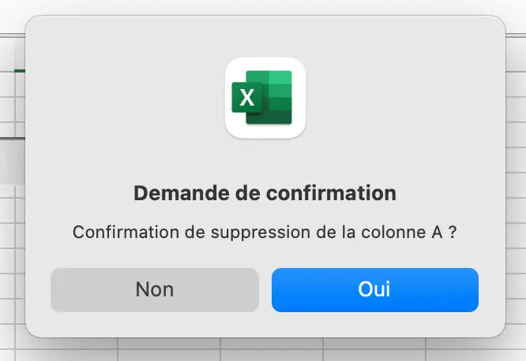
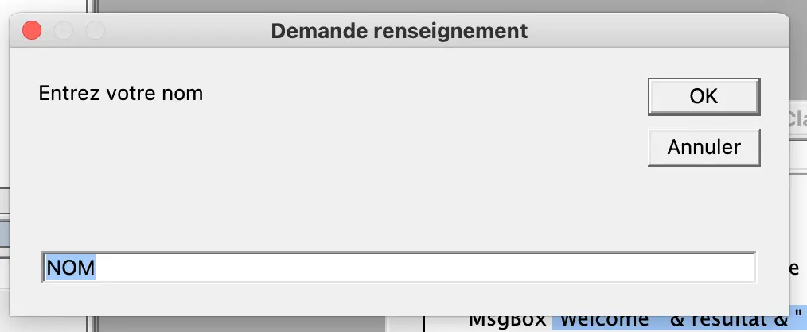
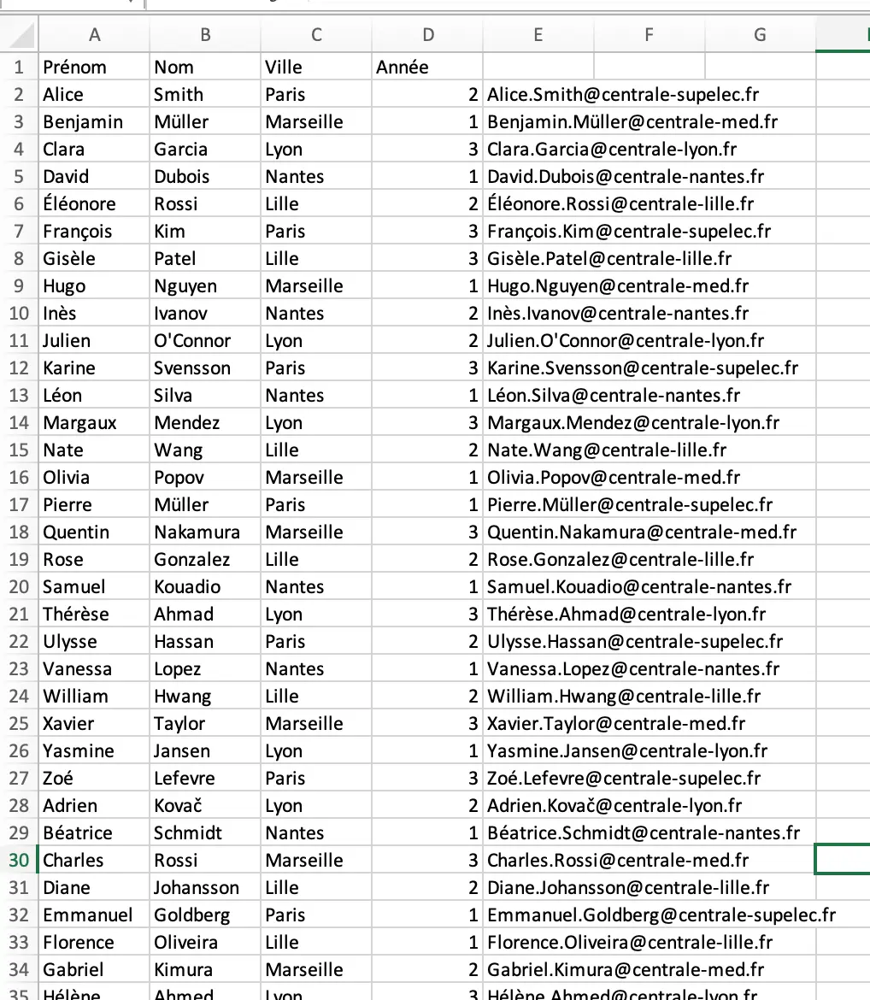
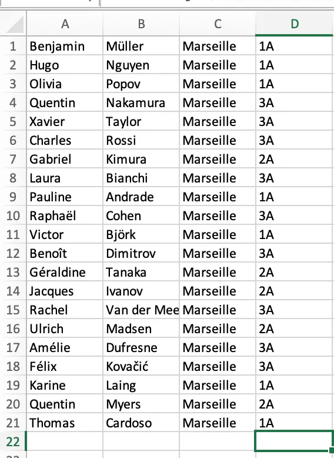



Aucun prérequis




Les lien utiles pour la compréhension de celui-ci.



Ce premier MON fait suite à une problématique rencontrée lors de chacun de mes stages de césure, au cours desquels j'ai été confronté a des "macros" à corriger ou compléter. Ces "macros" permettaient d'automatiser des tâches pouvant être longues et chronophages sur Excel.

- le niveau et les prérequis nécessaires en utilisant la balise [`prerequis`](/cs/contribuer-au-site/#prerequis)
- les autres POK & MON en rapport en utilisant la balise [`lien`](/cs/contribuer-au-site/#lien)


## Table des matières
+ [Introduction](#introduction)
+ [Cas d'emploi du langage VBA](#cas-demploi-du-langage-vba)
    - [Interaction avec l'utilisateur par la création de boîtes de dialogue](#interaction-avec-lutilisateur-par-la-création-de-boîtes-de-dialogue)
    - [Utilisation de variables](#utilisation-de-variables)
    - [Les conditions](#les-conditions)
    - [Les boucles](#les-boucles)
    - [Les tableaux](#les-tableaux)
+ [Application simple](#application-simple)
    - [Inputs](#inputs)
    - [Objectif](#objectif)
    - [Code](#code)
    - [Résultats ](#résultats)
    - [Pistes d'amélioration](#pistes-damélioration)
+ [Sources](#sources)

## Introduction

Le VBA (Visual Basic for Application) est un langage de programmation commun à toutes les applications de la suite Microsoft Office, qui permet d'automatiser des traitements et d'ajouter de nouvelles fonctions afin de répondre à des besoins spécifiques. Cela permet également de personnaliser les documents de travail afin de faciliter la gestion ou le reporting. Dans ce MON, nous nous intéresserons à l'utilisation du langage VBA dans le cadre d'Excel.

## Cas d'emploi du langage VBA

Le langage VBA permet de réaliser un certain nombre d'actions :

### Interaction avec l'utilisateur par la création de boîtes de dialogue

#### MsgBox (Texte, Boutons, Titre)
Cette fonction permet simplement d'afficher un message à l'utilisateur lors de l'exécution de la Macro : 
```
Sub exemple()
    MsgBox "Welcome in this Worksheet!"
End Sub
```

Elle peut également être utilisée pour demander confirmation de réalisation de la Macro : 
```
Sub exemple()
    If MsgBox("Confirmation de suppression de la colonne A ?", vbYesNo, "Demande de confirmation") = vbYes Then
        Columns("A").ClearContents
    End If
End Sub
```
La boîte de dialogue de confirmation qui s'affiche est alors la suivante :



#### InputBox (Texte, Titre, Valeur par défaut)
Cette fonction permet de demander à l'utilisateur de rentrer une valeur dans la boîte de dialogue. Ainsi, le code suivant demande à l'utilisateur de rentrer son nom, avec comme valeur par défaut "NOM", puis affiche le message "Welcome Nom!" :
```
Sub exemple()
    Dim NomUtilisateur As String

    resultat = InputBox("Entrez votre nom", "Demande renseignement", "NOM")

    MsgBox "Welcome " & resultat & "!"
End Sub
```


### Utilisation de variables

Les variables sont utilisées en VBA pour stocker et manipuler des données. Il faut pour cela les déclarer au préalable en précisant leur type.
Le code suivant stock les différents composants de l'adresse de Centrale Méditerranée sous forme de variables pour afficher celle-ci dans une boîte de dialogue :
````
Sub exemple()
    Dim Numero As Integer, Rue As String, Code_Postal As Integer, Ville As String

    Numero = 38
    Rue = Frédéric Joliot Curie
    Code_Postal = 13013
    Ville = Marseille

    MsgBox Numero & "Rue" & Rue & Code_Postal & Ville
End Sub
````

### Les conditions

Les conditions sont utilisées pour vérifier une caractéritsique avant la réalisation d'une Macro, ou alors réaliser une action différente en fonction du type ou de la valeur d'une donnée.

Penons l'exemple d'une feuille excel comprenant respectivement dans les cellule A1, B1 et C1 le prénom, nom et ville de l'école d'un étudiant centralien. Le code suivant permet donc de vérfier que toutes les informations sont bien renseignées (il n'y a pas de case vide), puis de donner l'adresse mail associée dans la celulle D1. Un message d'erreur s'affiche si la ville renseignée ne correspond pas à une école du groupe *Centrale* : 

````
Sub exemple()
    Dim nom As String, prenom As String, ville As String, ecole As String

    If IsEmpty(Range("A1")) Or IsEmpty(Range("B1")) Or IsEmpty(Range("C1")) Then
        MsgBox "Donnée manquante"
    Else
        prenom = Range("A1")
        nom = Range("B1")
        ville = Range("C1")
        Select Case ville
            Case Is = "Marseille"
                ecole = "med"
            Case Is = "Paris"
                ecole = "supelec"
            Case Is = "Lille"
                ecole = "lille"
            Case Is = "Nantes"
                ecole = "nantes"
            Case Is = "Lyon"
                ecole = "lyon"
            Case Else
                MsgBox "Erreur ville"
        End Select
        Range("D1") = prenom & "." & nom & "@centrale-" & ecole & ".fr"
   
    End If
        
End Sub
````
### Les boucles

Les boucles sont utilisées pour répéter des instructions tout en allégant le code, afin de ne pas répéter la même instructions plusieurs fois dans une même macro.

#### Do While
Cette fonction permet de réaliser instruction tant que la condition est vraie :
````
Sub exemple()
    Do While [CONDITION]
        *Instruction*
    Loop
End Sub
````

#### Do Until
Cette fonction permet de réaliser une instruction jusqu'à ce que la condition soit vraie : 
````
Sub exemple()
    Do Until [CONDITION]
        *Instruction*
    Loop
End Sub
````

#### For Next 
Cette fonction permet de réaliser une instruction pour un indice variant d'une valeur à une autre : 
````
Sub exemple()
    Dim k As Integer
        
    For k = 1 To 10
        *Instruction*
        k=k+1
    Next
End Sub
````

### Les tableaux

Les tableaux sont utilisés en langage VBA afin de stocker un grand nombre de valeur contrairement aux variables qui ne permettent le stockage que d'une unique valeur. De plus, stocker les valeurs d'une base de données sous forme de tableau permet d'accéder et de manipuler les données plus facilement.

La fonction suivante permet de créer un tableau avec i lignes et j colonnes : 
```
Sub exemple()
    Dim tableau(i-1,j-1)
End sub
```
On peut ensuite accéder à chaque donnée du tableau en écrivant =
````
tableau(n,m)
````
Avec n le numéro de la ligne et m le numéro de la colonne.

## Application simple

L'objectif de cette dernière partie est de mettre en pratique dans un exemple simple les différents éléments que nous avons vu ci-dessus. Ainsi, le but est de parvenir, à partir d'une base de données contenant une liste d'élèves centraliens, à créer l'adresse mail associée à chacun et extraire les élèves centraliens de Marseille sur une feuille à part afin de simplifier la consultation de leurs informations.

### Inputs
La base donnée servant d'imput comprend 4 colonnes, contenant dans l'ordre les informations suivantes :
+ Prénom
+ Nom
+ Ville (de l'école centrale)
+ Année d'étude (1, 2 ou 3)

Pour cet exemple, la base de données contient 100 étudiants.

### Objectif
L'objectif est d'automatiser un certain nombre d'actions : 
+ Création de l'adresse mail de chaque étudiant comprenant son nomn son prénom et son école
+ L'extraction de la liste des élèves centraliens étudiants à Marseille
+ La création d'une nouvelle feuille affichant ces élèves

### Code
Le code commenté ci-après : 

````
Sub Trie()
    Dim nom As String, prenom As String, ville As String, ecole As String, i As Integer, j As Integer, k As Integer, tableau(99, 3)
    j = 1   'Compteur qui va permettre de créer le tableau des étudiants de centrale Marseille
    k = 1   'Compteur qui va permettre d'afficher les étudiants de centrale Marseille dans une nouvelle feuille
    For i = 1 To 100     'Compteur qui va permettre de passer en revue l'ensemble de la base de données
        prenom = Range("A" & i + 1)
        nom = Range("B" & i + 1)
        ville = LCase(Trim(Range("C" & i + 1)))     'LCase et Trim permettent de comparer lessuites de caractères sans prendre en compte les majuscules ou les espaces
            If ville = "marseille" Then
                ecole = "med"
                
                'Création du tableau pour les élèves de centrale Marseille
                
                tableau(j - 1, 0) = Range("A" & i + 1)
                tableau(j - 1, 1) = Range("B" & i + 1)
                tableau(j - 1, 2) = Range("C" & i + 1)
                tableau(j - 1, 3) = Range("D" & i + 1) & "A"
                j = j + 1
            ElseIf ville = "paris" Then
                ecole = "supelec"
            ElseIf ville = "lille" Then
                ecole = "lille"
            ElseIf ville = "nantes" Then
                ecole = "nantes"
            Else
                ecole = "lyon"
        End If
    Range("E" & i + 1) = prenom & "." & nom & "@centrale-" & ecole & ".fr"  'Création de l'adresse mail
    Next
    
'Affichage du tableau dans une nouvelle feuille "ECM" afin de pouvoir voir les élèves de centrale Marseille

For k = 1 To 100
    Sheets("ECM").Range("A" & k) = tableau(k - 1, 0)
    Sheets("ECM").Range("B" & k) = tableau(k - 1, 1)
    Sheets("ECM").Range("C" & k) = tableau(k - 1, 2)
    Sheets("ECM").Range("D" & k) = tableau(k - 1, 3)
Next
    
End Sub
````

### Résultats
Les résultats obtenus après avoir exécuté la macro sont les suivants : 

*Création des adresses mail*



*Extraction des centraliens de Marseille*



### Pistes d'amélioration
Il est possible d'améliorer le code suivant avec les éléments suivants :
+ Trie des élèves par année, ordre alphabétique et école.
+ Création automatique d'une nouvelle feuille par école pour l'extraction des étudiants.

## Sources
Pour me former au langage VBA, j'ai utilisé les cours [Excel Pratique](https://excel-pratique.com/fr/vba)


