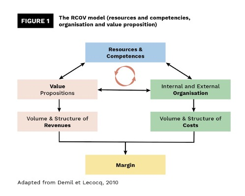



Liste des prérequis du POK ET/OU MON




Les lien utiles pour la compréhension de celui-ci.



Quelques phrases permettant de connaître, sans jargon ni blabla, le contenu de ce MON. On oubliera pas de donner :

- le niveau et les prérequis nécessaires en utilisant la balise [`prerequis`](/cs/contribuer-au-site/#prerequis)
- les autres POK & MON en rapport en utilisant la balise [`lien`](/cs/contribuer-au-site/#lien)

## Table des matières

+ Introduction
+ Business model : définition, modèle, dynamique
  - Définition
  - Modèle RCOV
  - Le business model au centre des réflexions stratégiques
+ La servicisation, un exemple d’évolution du business model
  - Notion et définition
  - Logiques dominantes
+ Évolution du business model : on décortique
  - Qu’est-ce qui déclenche un tel processus ?
  - Vecteurs de réussites
+ Étude de cas : entreprise québécoise de mode féminine : Keystone
  - Le contexte
  - Obstacles de direction
  - Le nouveau business model de Keystone
  - Simple évolution ou transformation du business model ?
+ Conclusion

## Introduction

Dans un contexte économique en constante évolution, les entreprises doivent s'adapter pour survivre et prospérer. Le changement de business model est souvent une réponse stratégique à des bouleversements majeurs tels que l'essor des nouvelles technologies, les mutations des attentes des consommateurs, ou encore la pression concurrentielle accrue. Ce processus complexe consiste à revoir en profondeur la manière dont une organisation crée, distribue et capture de la valeur.
Adopter un nouveau modèle économique peut constituer une opportunité cruciale pour repositionner une entreprise sur le marché, améliorer ses revenus ou anticiper des tendances futures. Cependant, la mutation de business model n’est pas sans risque car elle implique une réorganisation interne, la mobilisation des ressources, et une prise de décision audacieuse face à l’incertitude.
Quelles sont les dynamiques derrières le changement de business model d’une entreprise ? 

## Business model : définition, modèle, dynamique

### Définition
Selon Le Robert, un business model peut se définir comme suit :

Représentation synthétique des aspects majeurs de l’activité d’une entreprise ou d’une organisation.

On peut également parler de modèle économique. 
De manière plus simple, un business model (ou modèle économique), est le choix que fais une organisation pour générer des revenus.

### Modèle RCOV
B. DEMIL et X. LECOCQ définissent un modèle économique au travers d’une vision dynamique, avec l’existence de 3 blocs clés : 
- Ressources et Compétences (RC)
- Structure Organisationnelle (O)
- Proposition de valeur (V)

Ainsi, à partir des ressources et compétences qu’une organisation contrôle, l’entreprise définit donc une ou plusieurs propositions de valeur pour ses clients qui vont lui permettre de générer des revenus. Ces ressources et compétences peuvent être internes, développées par l’entreprise, mais également d’origine extérieure (dans ce cas, les ressources et compétences sont acquises sur le marché). 

Proposition de valeur : déclaration qui décrit les avantages que l’entreprise offre à ses clients par rapport aux produits et services proposés par la concurrence. 

Les propositions de valeurs sont portées par une organisation interne (chaîne de valeur) mais également externes (partenaires), ce qui engendre inévitablement des coûts de support. La structure organisationnelle comprend ainsi les activités réalisées au sein de l’entreprise mais également les relations établies avec d’autres organisations. 

Ainsi, les choix réalisés par une organisation en termes de ressources/compétences, structure organisationnelle et propositions de valeur vont déterminer les coûts et revenus de l’organisation, et ainsi la marge effectuée par celle-ci. 

L’approche RCOV est intéressante dans le cas de notre étude sur les changements / mutations de business model car elle ne considère pas uniquement ces 3 blocs clés mais également les relations qui les connectent. C’est pourquoi on peut parler de modèle dynamique car les blocs sont en interaction permanente. Ainsi, une modification sur l’un des blocs va inévitablement générer des modifications sur les autres blocs. Ce modèle permet de mettre en lumière un des risques du changement de modèle économique, qu’il faut savoir éviter en anticipant au maximum l’impact que va avoir un changement de proposition de valeur par exemple sur la structure organisationnelle et les ressources et compétences. 

### Le business model au centre des réflexions stratégiques
On remarque que la notion de business model est revenu sur le devant de la scène avec l’émergence des technologies de l’information, de la communication et du numérique. En effet ces technologies flexibles ont permis une redéfinition simple et rapide des produits et services, permettant ainsi à certaines entreprises de se réinventer. Le changement de modèle économique est donc un besoin auquel sont confrontées de nombreuses organisations. Cela ne signifie pas forcément changer fondamentalement la proposition de valeur, mais aussi la manière avec laquelle on produit cette proposition de valeur. 

Netflix est un exemple de cette idée : la proposition de valeur de l’organisation n’a pas fondamentalement changé, il s’agit toujours de mettre à disposition du client des films et séries, mais la manière de faire a été modifiée. On passe d’un système de location de DVD à un système d’abonnement et de téléchargement en streaming.

