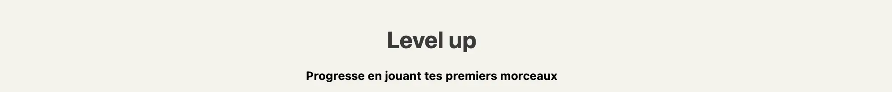
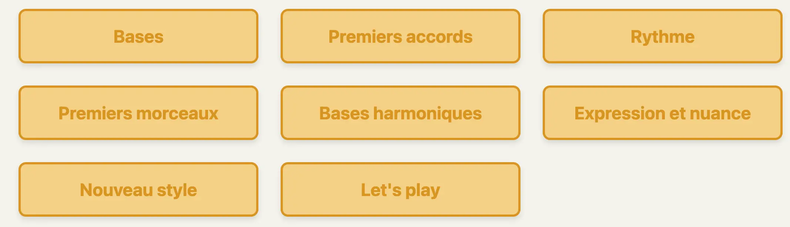



Aucun prérequis




- [w3schools HTML](https://www.w3schools.com/html/default.asp)
- [w3schools JavaScript](https://www.w3schools.com/js/default.asp)




## Introduction
L’objectif de ce MON est de me former aux langages HTML/CSS, dans l’optique de développer l’interface de notre site MusiCoach, objectif final de notre projet 3A. Nous envisageons de faire le front web en React, et n’ayant aucune base en HTML ou CSS, ce MON a pour but de me familiariser avec ce langage. 

Pour le support de formation, je me suis penché sur les MON précédent, et ai décidé d’utiliser le site W3School qui a également été utilisé par Thomas MERLE dans un de ses MON du Temps 1. L’avantage de ce site est qu’il possède un éditeur en ligne permettant de réaliser directement des tests tout au long de l’apprentissage. 

## HTML
### Introduction
HTML signifie Hyper Text Markup Language. Il est utilisé afin de coder la structure d’une page web.
Le langage HTML fonctionne avec un balisage. Ainsi, chaque élément est déclaré avec une balise de départ ("start tag"), et une balise de fin ("end tag"). Cela se présente sous la forme suivante : 
```
<tagname>Le contenu de cette partie</tagname>
```

### Structure
Un certain nombe d'éléments sont obligatoires afin de créer une page web fonctionnelle. On retrouve ceux-ci dans le court code suivant : 
````
<!DOCTYPE html> <!--Donne le type de document-->       
<html>  <!--Marque le début du document html-->
<body>  <!--Introduit le contenu du corps de la page web-->

<h1>Premier titre de la page.</h1>
<p>Premier paragraphe.</p>

</body>
</html>
````
NB: Les balises ```<!--```et ```-->``` encadrent un commentaire. Le contenu entre ces deux balises n'est pris en compte dans la création de la page web.

On note la présence de balises structurelles : 

| Tags  | Explication     |
|-------------|----------------|
| ```<!DOCTYPE html>``` | Déclare le type du document|
| ```<html>``` | Marque le début du document HTML|
| ```<head>``` | contient la metadata (data à propos de la data), il se place entre le ```<html>``` et le ```<body>```|
| ```<body>``` | Contient les éléments relatifs au titre de la page (```<title>```), au style (```<style>```), aux liens de fichiers externes (```<link>```), ou encore à la description de la page et ses mots clés permettant aux moteurs de recherche de référencer la page (```<meta>```) par exemple|

### Elements et attributs
Un element est un "bloc" qui apparaît dans la page web. Il peut être de plusieurs type : titre, paragraphe, lien, image,... 
Un attribut est une précision que l'on apporte afin de modifier l'identité visuelle d'un élément. Afin de ne pas simplement énumérer une liste d'éléments et d'attribus, je vais présenter quelques éléments et attributs dans le cadre de la création d'une page web.

#### Titre & paragraphe

````
<h1 style="color:#3a3a3a;text-align:center">Level up</h1>
<p style="text-align:center"><strong>Progresse en jouant tes premiers morceaux</strong></p>
````
| Element | Explication     |
|-------------|----------------|
| ```<h1>``` à ```<h6>``` | Déclarent un titre en fonction de son importance|
| ```<p>``` | Déclare un paragraphe|
| ```<strong>``` | Met en évidence un texte, qui a une importance particulière. Visuellement, ce texte est affiché en gras.|

| Attribut  | Explication     |
|-------------|----------------|
| ```color```| Couleur du texte d'un élément HTML|
| ```texte-align``` | Alignement du texte d'un élément HTML|

Ainsi, le code précédent permet d'obtenir ceci :


#### Liens
````
 <div class="theme-btn">
            <a href="#C1" class="link-theme">Bases</a>
</div>
````
| Element | Explication     |
|-------------|----------------|
| ```<a>```| Lien hypertexte|
| ```<div>```| Définit une division ou une section dans le document HTML (block-level)|

| Attribut  | Explication     |
|-------------|----------------|
| ```href```| Destination du lien|
| ```class``` | Renvoie à une classe créée eu préalable, permettant de donner l'identité visuelle à l'élément|

Ainsi, le code précédent permet de créer le lien "Bases" suivant : 


#### Images 
````

    <map name="workmap">
        <area shape="cercle" coords="433, 124, 20" href="Clé de sol.webp">
        <area shape="cercle" coords="696, 229, 20" href="Clé de fa.webp">
        <area shape="cercle" coords="1047, 177, 20" href="Clé de ut.webp">
    </map>
````
| Element | Explication     |
|-------------|----------------|
| ``````| Image|
| ```<map>```| Image avec des zones cliquables|
| ```<area>```| Zones cliquable d’une image de type « map »|

| Attribut  | Explication     |
|-------------|----------------|
| ```src```| Fichier source de l'image|
| ```alt``` | Texte alternatif si erreur dans l'affichage de l'image|
| ```usemap```| Définit l'image comme étant une "map"|
| ```shape```| Définit la forme des zones cliquables de la map|
| ```coords```| Définit les coordonnées de la zone cliquable|
| ```width```| Largeur de l'image|
| ```height```| Hauteur de l'image|

Ainsi, le code précédent renvoie cette image, dans laquelle chaque note est cliquable : 


#### Autres éléments 

| Element | Explication     |
|-------------|----------------|
| ```<br>```| Fin de ligne|
| ```<hr>```| Séparateur de paragraphe|
| ```<pre>```| Conserve les retours et sauts à la ligne du code brut|
| ```<b>```| Texte en gras|
| ```<i>```| Texte en italique|
| ```<small>```| Texte plus petit|
| ```<mark>```| Texte à accentuer, surligner|
| ```<del>```| Texte barré, qui a été supprimé d'un document|
| ```<ins>```| Texte qui a été inséré à un document|
| ```<sub>```| Sous texte (texte légèrement en dessous et plus petit)|
| ```<sup>```| Texte en indice|
| ```<blockquote>```| Citation d’une autre source|
| ```<title>```| Ajoute un titre à la page|
| ```<table>```| Tableau|
| ```<td>```| Cellule d’un tableau|
| ```<tr>```| Ligne d’un tableau|
| ```<th>```| Titre d’une colonne d’un tableau|
| ```<ul>```| Liste non ordonnée|
| ```<ol>```| Liste ordonnée|
| ```<li>```| Element d’une liste|

#### Autres attributs

| Attribut  | Explication     |
|-------------|----------------|
| ```style```| Précise le style d’écriture (couleur, police, taille,…)|
| ```lang``` | Langue de la page web|
| ```title```| Affiche des informations supplémentaires lorsque la souris passe dessus|
| ```target```| Comment ouvrir le lien (dans la même fenêtre, une nouvelle fenêtre, …)|
| ```id```| Crée un identifiant unique pour un élément HTML|

Conseil : Une bonne pratique est de toujours mettre les attributs entre guillemets.

## CSS
### Introduction

CSS signifie Cascading Style Sheets. Ce langage permet de définir le style de la page web. On peut définir le style de la page web de trois manière différentes : 
- Inline : on précise le style à l'intérieur des éléments HTML
- Internal : on précise le style en utilisant l'élement ```<style>```dans la section ```<head>```
- External : on précise le style de la page web en utilisant un lien vers un fichier css externe au fichier html. Cette dernière méthode est la plus judicieuse car cela permet de modifier le style de toute une page web en ne modifiant qu'un seul fichier.

### Attributs
Le langage CSS possède également des attributs, qui permettent de donner une identité visuelle aux éléments HTML :

| Attribut  | Explication     |
|-------------|----------------|
| ```background-color```| Définie la couleur du fond d’un éléments HTML|
| ```background-image``` | Définir une image en tant que fond|
| ```color```| Couleur du texte d’un élément HTML|
| ```font-family```| Police du texte d’un élément HTML|
| ```font-size```| Taille du texte d’un élément HTML|
| ```text-align```| Alignement du texte d’une élément HTML|
| ```padding```| Espace à l’intérieur d’une bordure|
| ```margin```| Espace à l’extérieur d’une bordure|
| ```border-radius```| Arrondi les angles d’une bordure|

### Classes
````
.link-theme {
            color : #D89500 ;
            text-decoration:None ;
            font-weight: bold;
            font-size: x-large;
        }
````
Le notion de classe a été évoqué précédemment dans la section *Liens*. En effet, nous avons vu que le style des liens étaient définis par la classe *link-theme*. Nous voyons ci-dessus que la classe *link-theme* contient des informations à propos de :
- La couleur du texte (code D89500 correspondant à du jaune)
- La décoration du texte (les liens sont automatiquement soulignés mais ceci a été supprimé ici en ajoutant *None*)
- Le style du texte (cela a été précisé que le texte doit apparaître en gras)
- La taille du texte (x-large)

Ainsi, n'importe quel éléments faisant appel à la classe *link-theme* aura la même identité visuelle. 

On remarque dans le code complet visible au lien suivant, que dans la section ```<style>```, plusieurs classes sont défini afin de les définir une fois uniquement et d'obtenir une homogénéité dans la page web. Nous aurions également pu utiliser un fichier externe et faire appel à celui-ci afin de définir l'identité visuelle de la page au travers d'un lien.

## Bases de JavaScript
### Introduction
Afin de rendre une page web plus dynamique, je souhaite, sur le temps de MON restant, apprendre quelques bases de JavaScript, qui pourront m’être utile plus tard pour la réalisation d’un site web. Dans notre exemple, l'objectif est ainsi de créer un bouton permettant de faire apparaître la barre latérale du menu sur lagauche afin de ne pas la faire figurer sur la page web au moment de son ouverture mais seulement si l'utilisateur a besoin de naviguer sur d'autres pages. 

Comme vu juste précédemment, le JavaScript permet de modifier du contenu HTML, ou alors le style du contenu. Le code JavaScript, tout comme le code CSS, peut être inclu au sein du fichier HTML (dans ce cas, il est compris entre les brones : ```<script>Code HTML</script>```), mais il peut également provenir d'une source externe (.js) permettant de tenir à jour la partie JavaScript plus aisément. 

### Output
Plusieurs moyens de faire apparaître la donnée existent en JavaScript, regroupés dans le tableau ci-après : 

| Output | Explication     |
|-------------|----------------|
| ```innerHTML```| Modifie le contenu d'un élément HTML|
| ```document.write()``` | Permet d’écrire directement du contenu HTML ou du texte dans le document web pendant son chargement. **Attention** : si la fonction document.write() est appelée après le chargement du document, cela remplace tout le contenu de la page, ce qui n’est pas forcément voulu.|
| ```widow.alert()``` | Affiche la donnée dans une boîte de dialogue.|
| ```widow.print()``` | Imprime le contenu de la page actuelle|

### Evènements
Un évènement peut-être quelque chose que le browser fait, ou alors que l’utilisateur fait.
Il existe plusieurs types d’évènements, dont les principaux sont :

| Output | Explication     |
|-------------|----------------|
| ```onchange```| Un élément HTML a été modifié |
| ```onclick``` | L’utilisateur clique sur un élément HTML|
| ```onmouseover``` | L’utilisateur place sa souris sur un élément HTML|
| ```onmouseout``` | L’utilisateur éloigne sa souris d’un élément HTML|
| ```onkeydown``` | L’utilisateur clique sur une touche particulière du clavier|
| ```onload``` | La page a terminé de charger|

### Apparition de la barre latérale du menu
Dans notre cas, nous souhaitons qu'au chargement de la page, la barre latérale ne soit pas visible. Pour cela, nous devons assigner un identifiant unique à l'ensemble des éléments constituant la barre latérale (```id=barre_latérale```) et modifier la visibilité de ceux-ci au moment du chargement de la page : 
````
<div id="barre_latérale" style="display:none" class="side-barre">
````
Nous créons ensuite un éléments *bouton* qui au clique de la souris, fait apparître les éléments constituants la barre latérale :
````
 <button type="button" onclick="document.getElementById('barre_latérale').style.display='block'">Menu</button>
 ````

Ainsi, au moment du chargement de la page, celle-ci ressemble à ceci : 


*La page est un scroll, permattant d'accéder aux autres sections de cours en dessous, qui sont également accessibles en cliquant sur les boutons jaunes en haut de page*

Une fois que l'on clique sur le bouton *Menu* en haut à gauche, la barre latérale apparaît alors : 


*Lorsque l'on scroll, la barre latérale reste en place afin d'y avoir accès tout au long de la page*

## Code complet 
Le code complet de la page que nous avons construit tout au long de ce MON se trouve au lien [suivant](https://github.com/CharlesCook1/MON2_1).

## Conclusion

Au travers de ce MON, je me suis familiariser avec les bases du codage HTML/CSS/JavaScript afin de créer une page web fonctionnelle. J'ai également vu quelques bases permettant de rendre cette page plus interactive. Tous ces éléments me seront utiles afin de me familiariser plus rapidement au React à l'aide du MON de Sophia CAPDEVIELLE, afin de pouvoir créer le front de notre projet 3A.

