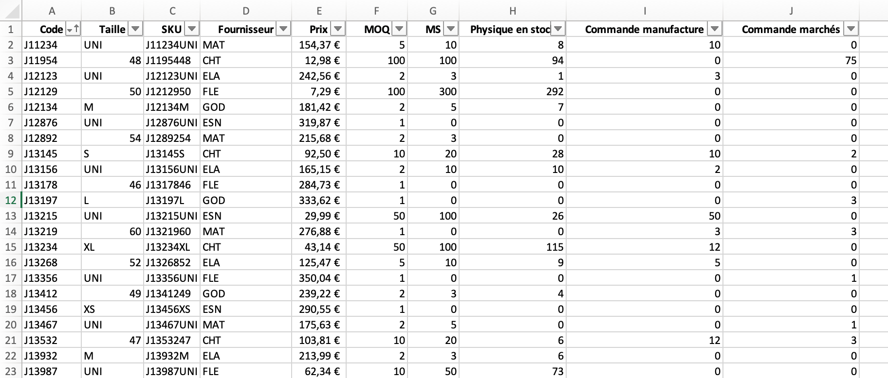



Aucun prérequis




Les lien utiles pour la compréhension de celui-ci.



Au cours de mon stage de césure en tant qu'assistant supply planner, une tâche redondante et chronophage était le passage des commande mensuelles. L'objectif de ce processus est de, à partir de l'état actuel des stocks, les commandes en cours et les minimum stock, créer un bon de commande par manufacture.

- le niveau et les prérequis nécessaires en utilisant la balise [`prerequis`](/cs/contribuer-au-site/#prerequis)
- les autres POK & MON en rapport en utilisant la balise [`lien`](/cs/contribuer-au-site/#lien)

## Tâches

### Sprints

L'objectif de ce POK est la création automatisée de bon de commande par manufacture à partir de de l'état des stocks actuels, regroupant, par référence et taille, la quantité souhaitées, le prix unitaire ainsi que le prix du lot commandé, et la date de livraison souhaitée.

#### Sprint 1

Liste des taches que l'on pense faire. On coche si la tache est réalisée. A la fin du sprint on fait une petite étude post-mortem pour voir ce qui s'est passé et les ajustement à faire pour le prochain sprint, pok.

- [x] (Re)Découverte du langage Python
- [x] Création d'une base de données fictive
- [x] Déterminantion de la forme de l'outil
- [ ] Création d'une première version du code


#### Sprint 2

- [ ] Amélioration du code
- [ ] Mise en forme de l'interface utilisateur
- [ ] Complexification du modèle


### Horodatage

| Date | Heures passées | Indications |
| -------- | -------- |-------- |
| Vendredi 13/09  | 2H  | (Re)Découverte du langage Python |
| Lundi 16/09  | 2H  | (Re)Découverte du langage Python |
| Lundi 16/09  | 1H  | Création de la base de données fictive |
| Lundi 16/09  | 2H  | Début du code |

## Sommaire

+ Présnetation de l'outil
+ Point d'avancement au premier Sprint
+ 

## Présentation de l'outil :
Cet outil à pour but de répondre à plusieurs objectifs utilisateur :
+ L'utilisateur doit pouvoir consulter les quantités de commande recommandées **par** manufacture,
+ L'utilisateur doit pouvoir modifier/valider ces quantités,
+ Les bons de commande doivent être générés automatiquement à parti des quantités modifiées/validées.  

## Point d'avancement au premier Sprint

### Remise à niveau Python
Pour cette partie de remise à niveau, je me suis appuyé sur le site [Automate Boring Stuff With Python](https://automatetheboringstuff.com/#toc)

#### Travailler avec des feuilles Excel
Il est possible de travailler sur Python à partir de classeurs Excel. Pour cela, il faut importer la librairie ```openpyxl```.

##### Ouvrir un classeur Excel
La fonction ```openpyxl.load_workbook()``` permet de charger un classeur Excel. Une fois que celui-ci est chargé, nous pouvons accéder à son contenu et le manipuler ou le modifier.
Il est important de noter que si le fichier contient des formules, il est parfois préférable de lire les valeurs calculées au lieu de lire les formules entrées dans les cellules. Dans ce cas, on précise à l'aide de l'option ```data_only=True```. Ainsi, pour ouvrir le fichier *Exemple* en utilisant les valeurs calculée, on rédige le code suivant : 
```
import openpyxl

wb = openpyxl.load_workbook('Exemple.xsl',data_only=True)
```
De même, si l'on ne souhaite pas faire de modification sur le classeur Excel, il existe l'option ```read_only=True``` permettant de l'ouvrir en lecture seule, ce qui est plus rapide : 
````
import openpyxl

wb = openpyxl.load_workbook('Exemple.xsl',read_only=True)
````

#### Manipuler les feuilles
Une fois le classeur chargé, il est possible d'accéder aux feuilles qui le composent :
````
import openpyxl

wb = openpyxl.load_workbook('Exemple.xsl',data_only=True)

# Obtenir les noms de feuilles composant le classeur
wb.sheetnames

# Accéder à une feuille par son nom 
ws = wb['NameSheet']

# Obtenir le nom d'une feuille comme un type *String*
Nom_feuille = ws.title
````

#### Manipuler les cellules
On peut séléctionner et obtenir la valuer d'une cellule grâce à ses coordonnées : 
````
import openpyxl

wb = openpyxl.load_workbook('Exemple.xsl',data_only=True)

ws = wb['NameSheet']

# Accéder à la cellule A1
Cell = ws['A1']

# Obtenir la valeur, la colonne et la ligne de la cellule A1
Cell.value, Cell.column, Cell.row
````

#### Dimensionner un tableau
Il est possible d'obtenir les dimensions d'un tableau en utilisant les attribut ```max.row```et ```max.column``` qui renvoient respectivmement le numéro de la dernière ligne et de la dernière colonne. 

#### Manipuler lignes et colonnes
Il est possible de séletionner des lignes ou des colonnes d'un coup :
````
import openpyxl

wb = openpyxl.load_workbook('Exemple.xsl',data_only=True)

ws = wb['NameSheet']

# Sélectionner toutes les cellules de A7 à B9
tuple(ws['A7':'B9'])
````

#### Créer un classeur Excel
Nous pouvons créer un nouveau classeur Excel avec la fonction ```openpyxl.Workbook()```. Par défaut, le classeur Excel créé est vide et contient une seule feuille nommé *Sheet*.
````
import openpyxl

# Créer un nouveau classeur
wb = openpyxl.Workbook()
````
Pour renommer le classeur ou la feuille, il suffit d'utiliser les attributs vus précédemment.

#### Créer ou supprimer une feuille
On peut manipuler le nombre de feuilles dans un claseur en en créant ou en en suppimant. Ainsi :
````
import openpyxl

wb = open.pyxl.Workbook()

# Ajouter une nouvelle feuille intitulé "Base de données" en première position
wb.create_sheet(index=0,title='Base de données')

# Supprimer la feuille "Sheet"
del wb['Sheet']
````

Tous ces éléments nous seront utiles pour automatiser la création des bons de commande. 

### Création d'une base de données fictive

#### Order Review
L'objectif de ce POK est d'automatiser la création de bons de commande à partir de l'état actuel des stocks. Ainsi, pour simuler cet exercice il est nécessaire de créer une base de données fictive refletant le niveau de stock. 
Cette bas de donnée doit contenir les éléments suivants :
+ Le code rédérence de chaque produit.
+ La taille de chaque produit. Nous faisons ici l'hypothèse que les produits considérés ont des tailles, et que les niveaux de stocks sont donc indépendants en fonction de la taille. 
+ Les SKU. Il s'agit d'un code unique au niveau référence taille.
+ Le fournisseur. L'objectif est de créer un fichier par fournisseur, il est donc nécessaire de rensigner le fournisseur chargé de la production de chaque référence. 
+ Le prix.
+ Le MOQ (Minimum Order Quantity). Le prix auquel est acheté une référence auprès du fournisseur dépend de la taille de lot, plus celle-ci est grande, plus le fournisseur peut proposer un prix faibleà l'unité. Ainsi, une taille de lot minimale (MOQ) est décidée afin de garantir le prix, et toutes les commandes passées doivent être supérieures au MOQ.
+ Le MS (Minimum Stock). Il s'agit du seuil qui déclenche automatiquement une nouvelle commande afin d'éviter la rupture de stock.
+ Le physique en stock. Il s'agit du stock central physique. 
+ Commandes manufacture. Il s'agit des commandes passées pour le stock central, mais qui n'ont pas encore été livré. Ces quantités n'apparaissent donc pas encore dans le physique disponible. 
+ Commandes marchés. Il s'agit des commandes passées par les différents marchés et qui n'ont pas encore été expédiées.



#### Lead Time
Les bons de commande contiennent également une date de livraison demandée. Cette date de livraison dépend du fournisseur, une seconde feuille dans le classeur recense donc Lead Time en fonction du fournisseur (en mois).

### Calcul des *quantités recommandées*

Les quantités de commande recommandées sont calculés comme suit : 
+ On caclul dans un premier temps le physique disponible. Il s'agit du physique en stock, auquel on ajoute les quantités commandées à la manufacture, et on retranche les quantités commandées par les marchés. Ainsi : $ Physique Dispo = Physique Stock + Commande Manuf - Commande Marchés $

+ Si $ Physique Dispo >= MS $, alors $ Quantité Recommandée = 0 $
+ Si $ Physiue Dispo < MS $ alors $ Quantité Recommandée = MS - Physique Dispo $

