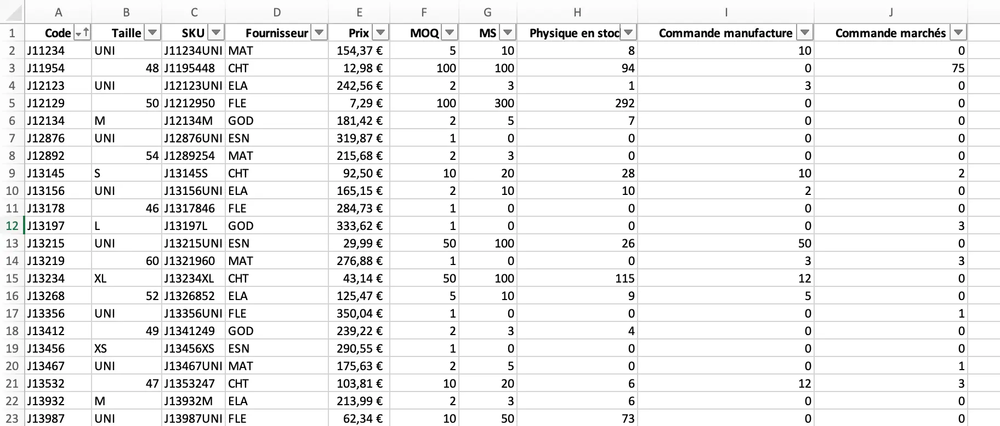



Aucun prérequis




[Automate Boring Stuff With Python](https://automatetheboringstuff.com/#toc)



Au cours de mon stage de césure en tant qu'assistant supply planner, une tâche redondante et chronophage était le passage des commande mensuelles. L'objectif de ce processus est de, à partir de l'état actuel des stocks, les commandes en cours et les minimum stock, créer un bon de commande par manufacture.

- le niveau et les prérequis nécessaires en utilisant la balise [`prerequis`](/cs/contribuer-au-site/#prerequis)
- les autres POK & MON en rapport en utilisant la balise [`lien`](/cs/contribuer-au-site/#lien)

## Tâches

### Sprints

L'objectif de ce POK est la création automatisée de bon de commande par manufacture à partir de de l'état des stocks actuels, regroupant, par référence et taille, la quantité souhaitées, le prix unitaire ainsi que le prix du lot commandé, et la date de livraison souhaitée.

#### Sprint 1

Liste des taches que l'on pense faire. On coche si la tache est réalisée. A la fin du sprint on fait une petite étude post-mortem pour voir ce qui s'est passé et les ajustement à faire pour le prochain sprint, pok.

- [x] (Re)Découverte du langage Python
- [x] Création d'une base de données fictive
- [x] Déterminantion de la forme de l'outil
- [ ] Création d'une première version du code


#### Sprint 2

- [x] Création d'une première version du code
- [x] Amélioration du code
- [x] Mise en forme de l'interface utilisateur
- [x] Complexification du modèle


### Horodatage

| Date | Heures passées | Indications |
| -------- | -------- |-------- |
| Vendredi 13/09  | 2H  | (Re)Découverte du langage Python |
| Lundi 16/09  | 2H  | (Re)Découverte du langage Python |
| Lundi 16/09  | 1H  | Création de la base de données fictive |
| Lundi 16/09  | 2H  | Début du code |
| Mardi 17/09  | 1H  | Suite code |
| Mercredi 18/09  | 2H  | 1ère version des feuilles propositions de commande |
| **Fin du premier sprint** | | |
| Jeudi 26/09  | 2H30  | Finalisation des feuilles propositions de commande  |
| Jeudi 03/10  | 2H  | Code de la partie génération des bons de commande |
| Samedi 05/10  | 2H  | Code de la partie génération des bons de commande |
| Jeudi 10/10  | 2H  | Code de la partie Historisation |
| Vendredi 11/10  | 1H  | Rédaction du rapport |

## Sommaire

+ Contexte
+ Présentation de l'outil
+ Point d'avancement au premier Sprint
    - Remise à niveau Python
        - Travailler avec des feuilles Excel
            - Ouvrir un classeur Excel
            - Manipuler les feuilles
            - Manipuler les cellules
            - Dimensionner un tableau
            - Manipuler lignes et colonnes
            - Créer un classeur Excel
            - Créer ou supprimer une feuille
    - Création d'une base de données fictive
        - Order Review
        - Lead Time
    - Calcul des *quantités recommandées*
    - 1ère version des feuilles de propositions de commande
        - Création et mise en page des feuilles de proposition de commande
        - Calcul de la quantité de commande recommandée par référence
        - Extraction des refs ayant un besoin et trie par manufacture
        - Pistes d'amélioration du code
+ Point d'avancement au second Sprint
    - Ajout d'un code couleur
        - Code de l'ajout du code couleur
    - Création du fichier des bon de commande finaux
        - Objectif
        - Code pour le bons de commande
        - Résultat des bons de commande
    - Historisation des commandes mensuelles
        - Création d'une feuille *Suivi Historique Fournisseur*
        - Synthèse des historiques dans la création des bons de commande
+ Pistes d'amélioration
+ Code complet
    

## Contexte : 
Pour ce POK, nous nous placons dans le cas d'une entreprise qui vend des produits finis. Ces produits sont référencés par numéro de références et par taille. 
La fabrication des produits est effectuée par diverses manufactures. Lorsqu'elle passe une commande à une manufacture, l'entreprise conserve alors les quantités dans un stock central. Les marchés sont les filiales de l'entreprise à l'international, et ce sont elles qui sont en contact direct avec le client final. Afin de répondre à la demande client, une filiale passe une commande à l'entreprise, qui si elle a les quantités nécéssaires en stock centrale, répond directement à la demande. Sinon, l'entreprise passe alors une commande à la manufacture.
Il y a donc 3 niveaux à identifier clairement pour comprendre le déroulement de ce POK : 
- Niveau manufacture
- Niveau entreprise
- Niveau marchés (filiales)

## Présentation de l'outil :
Cet outil à pour but de répondre à plusieurs objectifs utilisateur :
+ L'utilisateur doit pouvoir consulter les quantités de commande recommandées **par** manufacture,
+ L'utilisateur doit pouvoir modifier/valider ces quantités,
+ Les bons de commande doivent être générés automatiquement à parti des quantités modifiées/validées.  

## Point d'avancement au premier Sprint

### Remise à niveau Python
Pour cette partie de remise à niveau, je me suis appuyé sur le site [Automate Boring Stuff With Python](https://automatetheboringstuff.com/#toc)

#### Travailler avec des feuilles Excel
Il est possible de travailler sur Python à partir de classeurs Excel. Pour cela, il faut importer la librairie ```openpyxl```.

##### Ouvrir un classeur Excel
La fonction ```openpyxl.load_workbook()``` permet de charger un classeur Excel. Une fois que celui-ci est chargé, nous pouvons accéder à son contenu et le manipuler ou le modifier.
Il est important de noter que si le fichier contient des formules, il est parfois préférable de lire les valeurs calculées au lieu de lire les formules entrées dans les cellules. Dans ce cas, on précise à l'aide de l'option ```data_only=True```. Ainsi, pour ouvrir le fichier *Exemple* en utilisant les valeurs calculée, on rédige le code suivant : 
```
import openpyxl

wb = openpyxl.load_workbook('Exemple.xsl',data_only=True)
```
De même, si l'on ne souhaite pas faire de modification sur le classeur Excel, il existe l'option ```read_only=True``` permettant de l'ouvrir en lecture seule, ce qui est plus rapide : 
````
import openpyxl

wb = openpyxl.load_workbook('Exemple.xsl',read_only=True)
````

##### Manipuler les feuilles
Une fois le classeur chargé, il est possible d'accéder aux feuilles qui le composent :
````
import openpyxl

wb = openpyxl.load_workbook('Exemple.xsl',data_only=True)

# Obtenir les noms de feuilles composant le classeur
wb.sheetnames

# Accéder à une feuille par son nom 
ws = wb['NameSheet']

# Obtenir le nom d'une feuille comme un type *String*
Nom_feuille = ws.title
````

##### Manipuler les cellules
On peut séléctionner et obtenir la valuer d'une cellule grâce à ses coordonnées : 
````
import openpyxl

wb = openpyxl.load_workbook('Exemple.xsl',data_only=True)

ws = wb['NameSheet']

# Accéder à la cellule A1
Cell = ws['A1']

# Obtenir la valeur, la colonne et la ligne de la cellule A1
Cell.value, Cell.column, Cell.row
````

##### Dimensionner un tableau
Il est possible d'obtenir les dimensions d'un tableau en utilisant les attribut ```max.row```et ```max.column``` qui renvoient respectivmement le numéro de la dernière ligne et de la dernière colonne. 

##### Manipuler lignes et colonnes
Il est possible de séletionner des lignes ou des colonnes d'un coup :
````
import openpyxl

wb = openpyxl.load_workbook('Exemple.xsl',data_only=True)

ws = wb['NameSheet']

# Sélectionner toutes les cellules de A7 à B9
tuple(ws['A7':'B9'])
````

##### Créer un classeur Excel
Nous pouvons créer un nouveau classeur Excel avec la fonction ```openpyxl.Workbook()```. Par défaut, le classeur Excel créé est vide et contient une seule feuille nommé *Sheet*.
````
import openpyxl

# Créer un nouveau classeur
wb = openpyxl.Workbook()
````
Pour renommer le classeur ou la feuille, il suffit d'utiliser les attributs vus précédemment.

##### Créer ou supprimer une feuille
On peut manipuler le nombre de feuilles dans un claseur en en créant ou en en suppimant. Ainsi :
````
import openpyxl

wb = open.pyxl.Workbook()

# Ajouter une nouvelle feuille intitulé "Base de données" en première position
wb.create_sheet(index=0,title='Base de données')

# Supprimer la feuille "Sheet"
del wb['Sheet']
````

Tous ces éléments nous seront utiles pour automatiser la création des bons de commande. 

### Création d'une base de données fictive

#### Order Review
L'objectif de ce POK est d'automatiser la création de bons de commande à partir de l'état actuel des stocks. Ainsi, pour simuler cet exercice il est nécessaire de créer une base de données fictive refletant le niveau de stock. 
Cette bas de donnée doit contenir les éléments suivants :
+ Le code rédérence de chaque produit.
+ La taille de chaque produit. Nous faisons ici l'hypothèse que les produits considérés ont des tailles, et que les niveaux de stocks sont donc indépendants en fonction de la taille. 
+ Les SKU. Il s'agit d'un code unique au niveau référence taille.
+ Le fournisseur. L'objectif est de créer un fichier par fournisseur, il est donc nécessaire de rensigner le fournisseur chargé de la production de chaque référence. 
+ Le prix.
+ Le MOQ (Minimum Order Quantity). Le prix auquel est acheté une référence auprès du fournisseur dépend de la taille de lot, plus celle-ci est grande, plus le fournisseur peut proposer un prix faibleà l'unité. Ainsi, une taille de lot minimale (MOQ) est décidée afin de garantir le prix, et toutes les commandes passées doivent être supérieures au MOQ.
+ Le MS (Minimum Stock). Il s'agit du seuil qui déclenche automatiquement une nouvelle commande pour le stock central afin d'éviter la rupture de stock.
+ Le physique en stock. Il s'agit du stock central physique. 
+ Commandes manufacture. Il s'agit des commandes passées pour le stock central, mais qui n'ont pas encore été livré. Ces quantités n'apparaissent donc pas encore dans le physique en stock. 
+ Commandes marchés. Il s'agit des commandes passées par les différents marchés et qui n'ont pas encore été expédiées. Ces quantités apparaissent donc encore dans le stock central physique. 



#### Lead Time
Les bons de commande contiennent également une date de livraison demandée. Cette date de livraison dépend du fournisseur, une seconde feuille dans le classeur recense donc Lead Time en fonction du fournisseur (en mois).

### Calcul des *quantités recommandées*

Les quantités de commande recommandées sont calculés comme suit : 
+ On caclul dans un premier temps le physique disponible. Il s'agit du physique en stock, auquel on ajoute les quantités commandées à la manufacture, et on retranche les quantités commandées par les marchés. Ainsi : Physique Dispo = Physique Stock + Commande Manuf - Commande Marchés 

+ Si Physique Dispo >= MS , alors Quantité Recommandée = 0 
+ Si Physiue Dispo < MS  alors Quantité Recommandée = MS - Physique Dispo

### 1ère version des feuilles de propositions de commande

Le code suivant permet de créer, à partir de la base de données évoquée précédemment, une feuille par manufacture listant l'ensemble des références nécéssitant une commande auprès de la manufacture, et donnant la quantité de commande recommandée pour chacune des références. 

#### Création et mise en page des feuilles de proposition de commande
````
import openpyxl

wb = openpyxl.load_workbook('/Users/charlescook/Desktop/DO IT/BD POK 1.xlsx',data_only=True)

indice_max = wb['Order Review'].max_row

# Création des feuilles proposition pour chaque manufacture
wb.create_sheet(title='Proposition CHT')
wb.create_sheet(title='Proposition ELA')
wb.create_sheet(title='Proposition ESN')
wb.create_sheet(title='Proposition FLE')
wb.create_sheet(title='Proposition GOD')
wb.create_sheet(title='Proposition MAT')

# Introduction des variables
indice_CHT=2
indice_ELA=2
indice_ESN=2
indice_FLE=2
indice_GOD=2
indice_MAT=2

# Mise en place des en-têtes pour les feuilles propositions
for k in range(1,11):
    wb['Proposition CHT'].cell(row=1,column=k).value=wb['Order Review'].cell(row=1,column=k).value
    wb['Proposition ELA'].cell(row=1,column=k).value=wb['Order Review'].cell(row=1,column=k).value
    wb['Proposition ESN'].cell(row=1,column=k).value=wb['Order Review'].cell(row=1,column=k).value
    wb['Proposition FLE'].cell(row=1,column=k).value=wb['Order Review'].cell(row=1,column=k).value
    wb['Proposition GOD'].cell(row=1,column=k).value=wb['Order Review'].cell(row=1,column=k).value
    wb['Proposition MAT'].cell(row=1,column=k).value=wb['Order Review'].cell(row=1,column=k).value
    
    wb['Proposition CHT'].cell(row=1,column=11).value='Quantité Recommandée'
    wb['Proposition CHT'].cell(row=1,column=12).value='Quantité Corrigée'
    wb['Proposition ELA'].cell(row=1,column=11).value='Quantité Recommandée'
    wb['Proposition ELA'].cell(row=1,column=12).value='Quantité Corrigée'
    wb['Proposition ESN'].cell(row=1,column=11).value='Quantité Recommandée'
    wb['Proposition ESN'].cell(row=1,column=12).value='Quantité Corrigée'
    wb['Proposition FLE'].cell(row=1,column=11).value='Quantité Recommandée'
    wb['Proposition FLE'].cell(row=1,column=12).value='Quantité Corrigée'
    wb['Proposition GOD'].cell(row=1,column=11).value='Quantité Recommandée'
    wb['Proposition GOD'].cell(row=1,column=12).value='Quantité Corrigée'
    wb['Proposition MAT'].cell(row=1,column=11).value='Quantité Recommandée'
    wb['Proposition MAT'].cell(row=1,column=12).value='Quantité Corrigée'
````
Ce code permet de créer une feuille par manufacture et la création des en-têtes. 

#### Calcul de la quantité de commande recommandée par référence
````
for i in range(2,indice_max+1):
    Physique_Stock = wb['Order Review'].cell(row=i,column=8).value
    Commande_Manuf = wb['Order Review'].cell(row=i,column=9).value
    Commande_Marche = wb['Order Review'].cell(row=i,column=10).value
    MS = wb['Order Review'].cell(row=i,column=7).value
    MOQ = wb['Order Review'].cell(row=i,column=6).value
    Manufacture = wb['Order Review'].cell(row=i,column=4).value


    Physique_Dispo = Physique_Stock + Commande_Manuf - Commande_Marche

    if MS>Physique_Dispo :
        R_Qty = MS - Physique_Dispo
        if R_Qty<MOQ :
            R_Qty = MOQ
    else :
        R_Qty = 0
````
R_Qty est la quantité de commande recommandée, qui est nulle si il n'y a pas besoin de commander des pièces, et qui est supérieure ou égale au MOQ (Minimum Order Quantity) si il y a un besoin.

#### Extraction des refs ayant un besoin et trie par manufacture
````
# Copie des refs à commander dans des feuilles séparées par manufacture    

    if R_Qty>0 and Manufacture == 'CHT':
        for j in range(1,11):
            wb['Proposition CHT'].cell(row=indice_CHT,column=j).value=wb['Order Review'].cell(row=i,column=j).value
            wb['Proposition CHT'].cell(row=indice_CHT,column=11).value=R_Qty
        indice_CHT=indice_CHT+1
    if R_Qty>0 and Manufacture == 'ELA':
        for j in range(1,11):
            wb['Proposition ELA'].cell(row=indice_ELA,column=j).value=wb['Order Review'].cell(row=i,column=j).value
            wb['Proposition ELA'].cell(row=indice_ELA,column=11).value=R_Qty
        indice_ELA=indice_ELA+1
    if R_Qty>0 and Manufacture == 'ESN':
        for j in range(1,11):
            wb['Proposition ESN'].cell(row=indice_ESN,column=j).value=wb['Order Review'].cell(row=i,column=j).value
            wb['Proposition ESN'].cell(row=indice_ESN,column=11).value=R_Qty
        indice_ESN=indice_ESN+1  
    if R_Qty>0 and Manufacture == 'FLE':
        for j in range(1,11):
            wb['Proposition FLE'].cell(row=indice_FLE,column=j).value=wb['Order Review'].cell(row=i,column=j).value
            wb['Proposition FLE'].cell(row=indice_FLE,column=11).value=R_Qty
        indice_FLE=indice_FLE+1
    if R_Qty>0 and Manufacture == 'GOD':
        for j in range(1,11):
            wb['Proposition GOD'].cell(row=indice_GOD,column=j).value=wb['Order Review'].cell(row=i,column=j).value
            wb['Proposition GOD'].cell(row=indice_GOD,column=11).value=R_Qty
        indice_GOD=indice_GOD+1
    if R_Qty>0 and Manufacture == 'MAT':
        for j in range(1,11):
            wb['Proposition MAT'].cell(row=indice_MAT,column=j).value=wb['Order Review'].cell(row=i,column=j).value 
            wb['Proposition MAT'].cell(row=indice_MAT,column=11).value=R_Qty
        indice_MAT=indice_MAT+1

wb.save('/Users/charlescook/Desktop/DO IT/fichier_modifié.xlsx') 
````
Ce code permet d'obtenir une feuille par manufacture qui permet de une order review par l'utilisateur chargé du processus de la commande mensuelle. 


#### Pistes d'amélioration du code

Il est possible d'améliorer le code en mettant en place un code couleur en fonction de l'importance de la commande, si cette commande résulte d'un besoin marché (un besoin client), la ligne pourrait être en rouge afin de souligner son importance. C'est une piste à étudier en second sprint.

## Point d'avancement au second Sprint

### Ajout d'un code couleur
L'objectif de l'ajout du code couleur est de faciliter la relecture de la proposition automatique de commande par l'utilisateur. 
Ainsi, le code suivant permet de surligner en jaune les lignes qui concernent des commandes jugées "importantes" car elles répondent à un besoin marché (un besoin client). Les autres commandes sont passées afin que le stock central soit au niveau des MS, il n'y a pas d'attente client derrière celles-ci. 

#### Code de l'ajout du code couleur
````
if Physique_Dispo<0 :
            for l in range(1,13):
                wb['Proposition CHT'].cell(row=indice_CHT,column=l).fill=PatternFill(start_color="FFFF00", end_color="FFFF00", fill_type="solid")
````
Ce code vérifie pour chaque commande passée la valeur du Physique_Dispo. Si celui-ci est négatif, cela signifie que la somme du Stock physique dans le stok central et des commandes déjà passées à la manufacture est inférieure aux quantités passées par les marchés. Ainsi il est urgent de repasser une commande manufacture afin de répondre au besoin client.
Dans ce cas, le code couleur "FFFF00" est attribué à la ligne, soit la couleur jaune. 
Le résultat obtenu est le suivant : 


### Création du fichier des bon de commande finaux

#### Objectif
L'objectif de cette partie est d'avoir un fihcier Excel comprenant tous les bons de commande par manufacture. Ceux-ci doivent contenir les informations suivantes : 
- Code référence
- Taille
- SKU
- Quantité de commande
- Prix du lot
- Date demandée

#### Code pour le bons de commande
````
# Création des bons de commande
for i in range(2,indice_CHT):
    # Prise en compte des valeurs corrigées par l'utilisateur
    if wb2['Proposition CHT'].cell(row=i,column=12).value is None :
        wb2['Proposition CHT'].cell(row=i,column=12).value=wb2['Proposition CHT'].cell(row=i,column=11).value
````
Cette partie copie les quantités de commande finales : la valeur proposée automatiquement s'il n'y a pas eu de modification faite par l'utilisateur, la valeur entrée manuellement par l'utilisateur si un changement a été effectué.

````
    # Calcul des prix de lot
    wb2['Proposition CHT'].cell(row=i,column=13).value = wb2['Proposition CHT'].cell(row=i,column=5).value * wb2['Proposition CHT'].cell(row=i,column=12).value
````
Cette partie calcule le prix de chaque lot en mulitpliant simplement la quantité finale de commande par le prix unitaire.

````
    # Caclul des dates demandées en fonction du lead time de la manufacture
    wb2['Proposition CHT'].cell(row=i,column=14).value = (datetime.now() + relativedelta(months=+3)).strftime('%d/%m/%Y')
````
Cette partie va chercher le lead time par manufacture dans la feuille *Lead Time* et calcul donc la date demandée en fonction de la date à laquelle les bons de commande sont édités. 

Les colonnes restantes qui ne sont pas nécessaires dans le bon de commande sont ensuite supprimées, et un total par manufacture est calculé (un total en nombre de pièces et un total en terme financier). 

#### Résultat des bons de commande
Le résultat obtenu en faisant tourner le code est donc le suivant.


### Historisation des commandes mensuelles
Il peut être intéressant, au niveau de l'analyse et de la vérification avant d'envoyer le bon de commande, d'avoir une vision globale sur les quantités qui ont été commandées lors des précédentes commeandes mensuelles. Pour cela, nous allons tenter de mettre en place un suivi de l'hitorique sur l'année. 
Nous considererons que les commandes mensuelles de janvier à octobre ont été passées. La commande en cours est la commande mensuelle de novembre. 

Cette partie historisation permet notamment de pouvoir comparer les quantités afin de détecter d'éventuelles erreur dans la saisie des commandes des marchés par exemple. 

#### Création d'une feuille *Suivi Historique Fournisseur*
Afin de pouvoir suivre de manière précise l'historique des commandes mensuelles, nous avons créé une feuille Historique : 


La cellule *P2* doit être modifiée de manière manuelle par l'utilisateur, afin de renseigner le commande mensuelle de quelle mois va être passée. Ainsi, cela permet au moment de la génération des bons de commande finaux d'avoir une simulation des quantités par rapport aux précédentes. 

#### Synthèse des historiques dans la création des bons de commande
Au moment de la génération des bons de commande, le code suibvant permet d'entrer les quantités afin de compléter le tableau de suivi : 
````
# Ajout Historique CHT
wb2['Suivi Historique Four'].cell(row=3,column=hst+1).value = total
````
On obtient ainsi le tableau complété suivant : 


Afin d'avoir une présentation plus visuelle de l'évolution des quantités de commande, le code suivant permet de présenter les données sous forme de graphique en barres, par manufacture :
````
# Graphe Historique CHT
refObj=openpyxl.chart.Reference(wb2['Suivi Historique Four'], min_col=2, min_row=3, max_col=13,max_row=3)
seriesObj = openpyxl.chart.Series(refObj, title='Qty commande')
chartObj = openpyxl.chart.BarChart()
chartObj.title = 'Historique CHT'
chartObj.append(seriesObj)
wb2['Suivi Historique Four'].add_chart(chartObj, 'B12')
````

Le résultat obtenu est le suivant : 


## Pistes d'amélioration

Le code, dont la version complète se trouve ci-après, fonctionne. Cependant, de nombreuses lignes se répètent. Dans un objectif d'efficacité et de clareté dans la lecture de celui-ci, il serait intéressant de le simplifier en utilisant des boucles. En effet, chacune des étapes est répétée 6 fois pour chacune des manufactures. Or, si un changement doit être apporté dans le code, il peut être chronophage de répéter ce changement 6 fois à chaque fois. De plus, cela peut également permettre d'améliorer la rapidité d'exécution du code. 
Ainsi, la solution est de créer une liste avec les identifiants de chaque manufacture, et d'utiliser une boucle *for* pour répéter l'opération pour chacun des éléments de la liste. Cette technique permet également d'ajouter facilement de nouvelle manufacture. 

*J'ai tenté d'implémenter cette solution mais je n'y suis pas parvenu, des erreurs empêchaient l'execution du code*

## Code complet

Code pour la partie génération de la proposition des quantités de commande.
````
import openpyxl
from datetime import datetime
from dateutil.relativedelta import relativedelta
from openpyxl.styles import Font
from openpyxl.styles import PatternFill

wb = openpyxl.load_workbook('/Users/charlescook/Desktop/DO IT/BD POK 1.xlsx',data_only=True)

indice_max = wb['Order Review'].max_row

# Création des feuilles proposition pour chaque manufacture
wb.create_sheet(title='Proposition CHT')
wb.create_sheet(title='Proposition ELA')
wb.create_sheet(title='Proposition ESN')
wb.create_sheet(title='Proposition FLE')
wb.create_sheet(title='Proposition GOD')
wb.create_sheet(title='Proposition MAT')

# Introduction des variables
indice_CHT=2
indice_ELA=2
indice_ESN=2
indice_FLE=2
indice_GOD=2
indice_MAT=2


# Mise en place des en-têtes pour les feuilles propositions
for k in range(1,11):
    wb['Proposition CHT'].cell(row=1,column=k).value=wb['Order Review'].cell(row=1,column=k).value
    wb['Proposition ELA'].cell(row=1,column=k).value=wb['Order Review'].cell(row=1,column=k).value
    wb['Proposition ESN'].cell(row=1,column=k).value=wb['Order Review'].cell(row=1,column=k).value
    wb['Proposition FLE'].cell(row=1,column=k).value=wb['Order Review'].cell(row=1,column=k).value
    wb['Proposition GOD'].cell(row=1,column=k).value=wb['Order Review'].cell(row=1,column=k).value
    wb['Proposition MAT'].cell(row=1,column=k).value=wb['Order Review'].cell(row=1,column=k).value
    
    wb['Proposition CHT'].cell(row=1,column=11).value='Quantité Recommandée'
    wb['Proposition CHT'].cell(row=1,column=12).value='Quantité Corrigée'
    wb['Proposition ELA'].cell(row=1,column=11).value='Quantité Recommandée'
    wb['Proposition ELA'].cell(row=1,column=12).value='Quantité Corrigée'
    wb['Proposition ESN'].cell(row=1,column=11).value='Quantité Recommandée'
    wb['Proposition ESN'].cell(row=1,column=12).value='Quantité Corrigée'
    wb['Proposition FLE'].cell(row=1,column=11).value='Quantité Recommandée'
    wb['Proposition FLE'].cell(row=1,column=12).value='Quantité Corrigée'
    wb['Proposition GOD'].cell(row=1,column=11).value='Quantité Recommandée'
    wb['Proposition GOD'].cell(row=1,column=12).value='Quantité Corrigée'
    wb['Proposition MAT'].cell(row=1,column=11).value='Quantité Recommandée'
    wb['Proposition MAT'].cell(row=1,column=12).value='Quantité Corrigée'

for i in range(2,indice_max+1):
    Physique_Stock = wb['Order Review'].cell(row=i,column=8).value
    Commande_Manuf = wb['Order Review'].cell(row=i,column=9).value
    Commande_Marche = wb['Order Review'].cell(row=i,column=10).value
    MS = wb['Order Review'].cell(row=i,column=7).value
    MOQ = wb['Order Review'].cell(row=i,column=6).value
    Manufacture = wb['Order Review'].cell(row=i,column=4).value

    Physique_Dispo = Physique_Stock + Commande_Manuf - Commande_Marche

    if MS>Physique_Dispo :
        R_Qty = MS - Physique_Dispo
        if R_Qty<MOQ :
            R_Qty = MOQ
    else :
        R_Qty = 0
    
# Copie des refs à commander dans des feuilles séparées par manufacture    

    if R_Qty>0 and Manufacture == 'CHT':
        for j in range(1,11):
            wb['Proposition CHT'].cell(row=indice_CHT,column=j).value=wb['Order Review'].cell(row=i,column=j).value
            wb['Proposition CHT'].cell(row=indice_CHT,column=11).value=R_Qty
        if Physique_Dispo<0 :
            for l in range(1,13):
                wb['Proposition CHT'].cell(row=indice_CHT,column=l).fill=PatternFill(start_color="FFFF00", end_color="FFFF00", fill_type="solid")
        indice_CHT=indice_CHT+1
    
    if R_Qty>0 and Manufacture == 'ELA':
        for j in range(1,11):
            wb['Proposition ELA'].cell(row=indice_ELA,column=j).value=wb['Order Review'].cell(row=i,column=j).value
            wb['Proposition ELA'].cell(row=indice_ELA,column=11).value=R_Qty
        if Physique_Dispo<0 :
            for l in range(1,13):
                wb['Proposition ELA'].cell(row=indice_ELA,column=l).fill=PatternFill(start_color="FFFF00", end_color="FFFF00", fill_type="solid")
        indice_ELA=indice_ELA+1
    if R_Qty>0 and Manufacture == 'ESN':
        for j in range(1,11):
            wb['Proposition ESN'].cell(row=indice_ESN,column=j).value=wb['Order Review'].cell(row=i,column=j).value
            wb['Proposition ESN'].cell(row=indice_ESN,column=11).value=R_Qty
        if Physique_Dispo<0 :
            for l in range(1,13):
                wb['Proposition ESN'].cell(row=indice_ESN,column=l).fill=PatternFill(start_color="FFFF00", end_color="FFFF00", fill_type="solid")
        indice_ESN=indice_ESN+1  
    if R_Qty>0 and Manufacture == 'FLE':
        for j in range(1,11):
            wb['Proposition FLE'].cell(row=indice_FLE,column=j).value=wb['Order Review'].cell(row=i,column=j).value
            wb['Proposition FLE'].cell(row=indice_FLE,column=11).value=R_Qty
        if Physique_Dispo<0 :
            for l in range(1,13):
                wb['Proposition FLE'].cell(row=indice_FLE,column=l).fill=PatternFill(start_color="FFFF00", end_color="FFFF00", fill_type="solid")
        indice_FLE=indice_FLE+1
    if R_Qty>0 and Manufacture == 'GOD':
        for j in range(1,11):
            wb['Proposition GOD'].cell(row=indice_GOD,column=j).value=wb['Order Review'].cell(row=i,column=j).value
            wb['Proposition GOD'].cell(row=indice_GOD,column=11).value=R_Qty
        if Physique_Dispo<0 :
            for l in range(1,13):
                wb['Proposition GOD'].cell(row=indice_GOD,column=l).fill=PatternFill(start_color="FFFF00", end_color="FFFF00", fill_type="solid")
        indice_GOD=indice_GOD+1
    if R_Qty>0 and Manufacture == 'MAT':
        for j in range(1,11):
            wb['Proposition MAT'].cell(row=indice_MAT,column=j).value=wb['Order Review'].cell(row=i,column=j).value 
            wb['Proposition MAT'].cell(row=indice_MAT,column=11).value=R_Qty
        if Physique_Dispo<0 :
            for l in range(1,13):
                wb['Proposition MAT'].cell(row=indice_MAT,column=l).fill=PatternFill(start_color="FFFF00", end_color="FFFF00", fill_type="solid")
        indice_MAT=indice_MAT+1

wb.save('/Users/charlescook/Desktop/DO IT/proposition_commande.xlsx')       
````

Code pour la partie génération des bons de comman de finaux et mise à jour de l'historique. 
````
wb2 = openpyxl.load_workbook('/Users/charlescook/Desktop/DO IT/proposition_commande.xlsx',data_only=True)

# Suivi de l'historique
hst=wb2['Suivi Historique Four'].cell(row=2,column=16).value

# Création des bons de commande
for i in range(2,indice_CHT):
    # Prise en compte des valeurs corrigées par l'utilisateur
    if wb2['Proposition CHT'].cell(row=i,column=12).value is None :
        wb2['Proposition CHT'].cell(row=i,column=12).value=wb2['Proposition CHT'].cell(row=i,column=11).value
    # Calcul des prix de lot
    wb2['Proposition CHT'].cell(row=i,column=13).value = wb2['Proposition CHT'].cell(row=i,column=5).value * wb2['Proposition CHT'].cell(row=i,column=12).value
    # Caclul des dates demandées en fonction du lead time de la manufacture
    wb2['Proposition CHT'].cell(row=i,column=14).value = (datetime.now() + relativedelta(months=+3)).strftime('%d/%m/%Y')
# Supression des colonnes 
wb2['Proposition CHT'].delete_cols(4,8)
wb2['Proposition CHT'].cell(row=1,column=4).value='Quantité'
wb2['Proposition CHT'].cell(row=1,column=5).value='Prix lot'
wb2['Proposition CHT'].cell(row=1,column=6).value='Date demandée'
wb2['Proposition CHT'].cell(row=indice_CHT+1,column=3).value='TOTAL'
total=0
total2=0
for j in range(2,indice_CHT):
    total+=wb2['Proposition CHT'].cell(row=j,column=4).value
    total2+=wb2['Proposition CHT'].cell(row=j,column=5).value
wb2['Proposition CHT'].cell(row=indice_CHT+1,column=4).value=total
wb2['Proposition CHT'].cell(row=indice_CHT+1,column=5).value=total2

# Ajout Historique CHT
wb2['Suivi Historique Four'].cell(row=3,column=hst+1).value = total

# Mise en page 
for j in range(1,7) :
    wb2['Proposition CHT'].cell(row=1,column=j).font = Font(bold=True)
    wb2['Proposition CHT'].cell(row=1,column=j).fill=PatternFill(start_color="D3D3D3", end_color="D3D3D3", fill_type="solid")
wb2['Proposition CHT'].title = 'BDC CHT'

# Répétition pour ELA
for i in range(2,indice_ELA):
    if wb2['Proposition ELA'].cell(row=i,column=12).value is None :
        wb2['Proposition ELA'].cell(row=i,column=12).value=wb2['Proposition ELA'].cell(row=i,column=11).value
    wb2['Proposition ELA'].cell(row=i,column=13).value = wb2['Proposition ELA'].cell(row=i,column=5).value * wb2['Proposition ELA'].cell(row=i,column=12).value
    wb2['Proposition ELA'].cell(row=i,column=14).value = (datetime.now() + relativedelta(months=+2)).strftime('%d/%m/%Y')
wb2['Proposition ELA'].delete_cols(4,8)
wb2['Proposition ELA'].cell(row=1,column=4).value='Quantité'
wb2['Proposition ELA'].cell(row=1,column=5).value='Prix lot'
wb2['Proposition ELA'].cell(row=1,column=6).value='Date demandée'
wb2['Proposition ELA'].cell(row=indice_ELA+1,column=3).value='TOTAL'
total=0
total2=0
for j in range(2,indice_ELA):
    total+=wb2['Proposition ELA'].cell(row=j,column=4).value
    total2+=wb2['Proposition ELA'].cell(row=j,column=5).value
wb2['Proposition ELA'].cell(row=indice_ELA+1,column=4).value=total
wb2['Proposition ELA'].cell(row=indice_ELA+1,column=5).value=total2

# Ajout Historique ELA
wb2['Suivi Historique Four'].cell(row=4,column=hst+1).value = total

for j in range(1,7) :
    wb2['Proposition ELA'].cell(row=1,column=j).font = Font(bold=True)
    wb2['Proposition ELA'].cell(row=1,column=j).fill=PatternFill(start_color="D3D3D3", end_color="D3D3D3", fill_type="solid")
wb2['Proposition ELA'].title = 'BDC ELA'

# Répétition pour ESN
for i in range(2,indice_ESN):
    if wb2['Proposition ESN'].cell(row=i,column=12).value is None :
        wb2['Proposition ESN'].cell(row=i,column=12).value=wb2['Proposition ESN'].cell(row=i,column=11).value
    wb2['Proposition ESN'].cell(row=i,column=13).value = wb2['Proposition ESN'].cell(row=i,column=5).value * wb2['Proposition ESN'].cell(row=i,column=12).value
    wb2['Proposition ESN'].cell(row=i,column=14).value = (datetime.now() + relativedelta(months=+2)).strftime('%d/%m/%Y')
wb2['Proposition ESN'].delete_cols(4,8)
wb2['Proposition ESN'].cell(row=1,column=4).value='Quantité'
wb2['Proposition ESN'].cell(row=1,column=5).value='Prix lot'
wb2['Proposition ESN'].cell(row=1,column=6).value='Date demandée'
wb2['Proposition ESN'].cell(row=indice_ESN+1,column=3).value='TOTAL'
total=0
total2=0
for j in range(2,indice_ESN):
    total+=wb2['Proposition ESN'].cell(row=j,column=4).value
    total2+=wb2['Proposition ESN'].cell(row=j,column=5).value
wb2['Proposition ESN'].cell(row=indice_ESN+1,column=4).value=total
wb2['Proposition ESN'].cell(row=indice_ESN+1,column=5).value=total2

# Ajout Historique ESN
wb2['Suivi Historique Four'].cell(row=5,column=hst+1).value = total

for j in range(1,7) :
    wb2['Proposition ESN'].cell(row=1,column=j).font = Font(bold=True)
    wb2['Proposition ESN'].cell(row=1,column=j).fill=PatternFill(start_color="D3D3D3", end_color="D3D3D3", fill_type="solid")
wb2['Proposition ESN'].title = 'BDC ESN'

# Répétition pour FLE
for i in range(2,indice_FLE):
    if wb2['Proposition FLE'].cell(row=i,column=12).value is None :
        wb2['Proposition FLE'].cell(row=i,column=12).value=wb2['Proposition FLE'].cell(row=i,column=11).value
    wb2['Proposition FLE'].cell(row=i,column=13).value = wb2['Proposition FLE'].cell(row=i,column=5).value * wb2['Proposition FLE'].cell(row=i,column=12).value
    wb2['Proposition FLE'].cell(row=i,column=14).value = (datetime.now() + relativedelta(months=+2)).strftime('%d/%m/%Y')
wb2['Proposition FLE'].delete_cols(4,8)
wb2['Proposition FLE'].cell(row=1,column=4).value='Quantité'
wb2['Proposition FLE'].cell(row=1,column=5).value='Prix lot'
wb2['Proposition FLE'].cell(row=1,column=6).value='Date demandée'
wb2['Proposition FLE'].cell(row=indice_FLE+1,column=3).value='TOTAL'
total=0
total2=0
for j in range(2,indice_FLE):
    total+=wb2['Proposition FLE'].cell(row=j,column=4).value
    total2+=wb2['Proposition FLE'].cell(row=j,column=5).value
wb2['Proposition FLE'].cell(row=indice_FLE+1,column=4).value=total
wb2['Proposition FLE'].cell(row=indice_FLE+1,column=5).value=total2

# Ajout Historique FLE
wb2['Suivi Historique Four'].cell(row=6,column=hst+1).value = total

for j in range(1,7) :
    wb2['Proposition FLE'].cell(row=1,column=j).font = Font(bold=True)
    wb2['Proposition FLE'].cell(row=1,column=j).fill=PatternFill(start_color="D3D3D3", end_color="D3D3D3", fill_type="solid")
wb2['Proposition FLE'].title = 'BDC FLE'

# Répétition pour GOD
for i in range(2,indice_GOD):
    if wb2['Proposition GOD'].cell(row=i,column=12).value is None :
        wb2['Proposition GOD'].cell(row=i,column=12).value=wb2['Proposition GOD'].cell(row=i,column=11).value
    wb2['Proposition GOD'].cell(row=i,column=13).value = wb2['Proposition GOD'].cell(row=i,column=5).value * wb2['Proposition GOD'].cell(row=i,column=12).value
    wb2['Proposition GOD'].cell(row=i,column=14).value = (datetime.now() + relativedelta(months=+1)).strftime('%d/%m/%Y')
wb2['Proposition GOD'].delete_cols(4,8)
wb2['Proposition GOD'].cell(row=1,column=4).value='Quantité'
wb2['Proposition GOD'].cell(row=1,column=5).value='Prix lot'
wb2['Proposition GOD'].cell(row=1,column=6).value='Date demandée'
wb2['Proposition GOD'].cell(row=indice_GOD+1,column=3).value='TOTAL'
total=0
total2=0
for j in range(2,indice_GOD):
    total+=wb2['Proposition GOD'].cell(row=j,column=4).value
    total2+=wb2['Proposition GOD'].cell(row=j,column=5).value
wb2['Proposition GOD'].cell(row=indice_GOD+1,column=4).value=total
wb2['Proposition GOD'].cell(row=indice_GOD+1,column=5).value=total2

# Ajout Historique GOD
wb2['Suivi Historique Four'].cell(row=7,column=hst+1).value = total

for j in range(1,7) :
    wb2['Proposition GOD'].cell(row=1,column=j).font = Font(bold=True)
    wb2['Proposition GOD'].cell(row=1,column=j).fill=PatternFill(start_color="D3D3D3", end_color="D3D3D3", fill_type="solid")
wb2['Proposition GOD'].title = 'BDC GOD'

# Répétition pour MAT
for i in range(2,indice_MAT):
    if wb2['Proposition MAT'].cell(row=i,column=12).value is None :
        wb2['Proposition MAT'].cell(row=i,column=12).value=wb2['Proposition MAT'].cell(row=i,column=11).value
    wb2['Proposition MAT'].cell(row=i,column=13).value = wb2['Proposition MAT'].cell(row=i,column=5).value * wb2['Proposition MAT'].cell(row=i,column=12).value
    wb2['Proposition MAT'].cell(row=i,column=14).value = (datetime.now() + relativedelta(months=+2)).strftime('%d/%m/%Y')
wb2['Proposition MAT'].delete_cols(4,8)
wb2['Proposition MAT'].cell(row=1,column=4).value='Quantité'
wb2['Proposition MAT'].cell(row=1,column=5).value='Prix lot'
wb2['Proposition MAT'].cell(row=1,column=6).value='Date demandée'
wb2['Proposition MAT'].cell(row=indice_MAT+1,column=3).value='TOTAL'
total=0
total2=0
for j in range(2,indice_MAT):
    total+=wb2['Proposition MAT'].cell(row=j,column=4).value
    total2+=wb2['Proposition MAT'].cell(row=j,column=5).value
wb2['Proposition MAT'].cell(row=indice_MAT+1,column=4).value=total
wb2['Proposition MAT'].cell(row=indice_MAT+1,column=5).value=total2

# Ajout Historique MAT
wb2['Suivi Historique Four'].cell(row=8,column=hst+1).value = total

for j in range(1,7) :
    wb2['Proposition MAT'].cell(row=1,column=j).font = Font(bold=True)
    wb2['Proposition MAT'].cell(row=1,column=j).fill=PatternFill(start_color="D3D3D3", end_color="D3D3D3", fill_type="solid")
wb2['Proposition MAT'].title = 'BDC MAT'

#Supression des feuilles n'étant pas des bons de commande
del wb2['Order Review']
del wb2['Lead Time']

# Suivi de l'historique

# Graphe Historique CHT
refObj=openpyxl.chart.Reference(wb2['Suivi Historique Four'], min_col=2, min_row=3, max_col=13,max_row=3)
seriesObj = openpyxl.chart.Series(refObj, title='Qty commande')
chartObj = openpyxl.chart.BarChart()
chartObj.title = 'Historique CHT'
chartObj.append(seriesObj)
wb2['Suivi Historique Four'].add_chart(chartObj, 'B12')

# Graphe Historique ELA
refObj=openpyxl.chart.Reference(wb2['Suivi Historique Four'], min_col=2, min_row=4, max_col=13,max_row=4)
seriesObj = openpyxl.chart.Series(refObj, title='Qty commande')
chartObj = openpyxl.chart.BarChart()
chartObj.title = 'Historique ELA'
chartObj.append(seriesObj)
wb2['Suivi Historique Four'].add_chart(chartObj, 'J12')

# Graphe Historique ESN
refObj=openpyxl.chart.Reference(wb2['Suivi Historique Four'], min_col=2, min_row=5, max_col=13,max_row=5)
seriesObj = openpyxl.chart.Series(refObj, title='Qty commande')
chartObj = openpyxl.chart.BarChart()
chartObj.title = 'Historique ESN'
chartObj.append(seriesObj)
wb2['Suivi Historique Four'].add_chart(chartObj, 'B27')

# Graphe Historique FLE
refObj=openpyxl.chart.Reference(wb2['Suivi Historique Four'], min_col=2, min_row=6, max_col=13,max_row=6)
seriesObj = openpyxl.chart.Series(refObj, title='Qty commande')
chartObj = openpyxl.chart.BarChart()
chartObj.title = 'Historique FLE'
chartObj.append(seriesObj)
wb2['Suivi Historique Four'].add_chart(chartObj, 'J27')

# Graphe Historique GOD
refObj=openpyxl.chart.Reference(wb2['Suivi Historique Four'], min_col=2, min_row=7, max_col=13,max_row=7)
seriesObj = openpyxl.chart.Series(refObj, title='Qty commande')
chartObj = openpyxl.chart.BarChart()
chartObj.title = 'Historique GOD'
chartObj.append(seriesObj)
wb2['Suivi Historique Four'].add_chart(chartObj, 'B42')

# Graphe Historique MAT
refObj=openpyxl.chart.Reference(wb2['Suivi Historique Four'], min_col=2, min_row=7, max_col=13,max_row=7)
seriesObj = openpyxl.chart.Series(refObj, title='Qty commande')
chartObj = openpyxl.chart.BarChart()
chartObj.title = 'Historique MAT'
chartObj.append(seriesObj)
wb2['Suivi Historique Four'].add_chart(chartObj, 'J42')

wb2.save('/Users/charlescook/Desktop/DO IT/bon_de_commande.xlsx')
````
