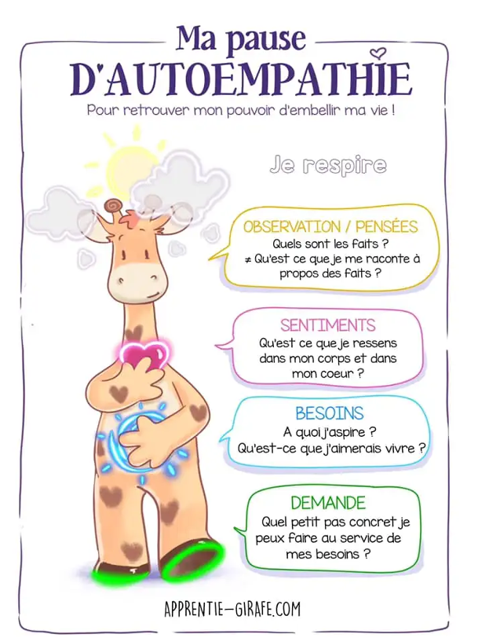



MON débutant, aucun prérequis




- Diaporama "Prise de parole et éloquence" - Tronc commun de 2A Centrale Méditerranée
- [Site CNV France](https://cnvfrance.fr/communication-non-violente/) consulté le 15/01/25
- Ressources internes sur la CNV du LICA - Laboratoire d'Intelligence Collective et Artificielle Marseille
- [Site apprentie girafe](https://apprentie-girafe.com/) consulté le 15/01/25



## Sommaire

- [Eloquence](#e)
- [Communication Non Violente](#cnv)
- [Négociation, engagement](#n)
- [Procédés réthoriques](#r)
- [Faire un bon discours](#d)
- [Conclusion](#ccl)

<h2 id=e> Eloquence</h2>

L'**éloquence** désigne don de la parole, **la facilité de bien s’exprimer**. Et comme l’éloquence vient souvent servir une demande, un but, une cause, c’est aussi l’art de toucher et de persuader par le discours.  
Ayant fait une césure entre ma 2A et 3A, je fais partie des élèves qui n'ont jamais eu la semaine de tronc commun de Centrale pendant laquelle on parle de leadership et d'éloquence. Ainsi, j'ai regardé les slides que mes camarades avaient eu.  Dans ces slides, on apprend que "***Nous retenons 20% de ce que nous avons entendu***" et "***Le non-verbal & para-verbal représentent 70% de notre communication***".

<h2 id=cnv> Communication Non Violente</h2>

### Création et définition de la CNV

“**La violence est l’expression tragique de nos besoins insatisfaits.** Elle est la manifestation de l’impuissance et/ou du désespoir de quelqu'un qui est si peu protégé qu'il pense que ses mots ne suffisent pas pour se faire comprendre. Et donc il attaque, crie, agresse, …” — Marshall Rosenberg

**Marshall Rosenberg** est un psychanalyste américain qui a créé dans les années 70 ce qu’il appelle la “**Communication Non Violente**” abrégée **CNV**. Selon lui, c'est "***le langage et les interactions qui renforcent notre aptitude à donner avec bienveillance et à inspirer aux autres le désir d’en faire autant***". Ainsi, la CNV part du principe que notre nature profonde nous porte à aimer, donner et recevoir dans un esprit de bienveillance.

La CNV, est-ce que c’est être bienveillant ?  
Non ! "La CNV, c’est une pratique de bisounours", "je n’ai pas besoin de la CNV, je ne suis pas violent" sont des phrases que l’on entend souvent. **La CNV, ce n’est pas être gentil, c’est être assertif** : c’est à dire s’affirmer en toute authenticité, tout en respectant l’autre.

### Métaphore de la girafe et du chacal

Pour symboliser les **2 modes de communication opposés**, Marshall Rosenberg utilise la métaphore de la girafe et du chacal :

    Illustration trouvée sur le site apprentie girafe

La **girafe** est l’animal terrestre qui a le plus grand coeur (nécessaire pour pomper le sang jusqu’à son cerveau). Elle symbolise donc le **langage de la bienveillance et du coeur**. Avec son long cou, elle prend de la hauteur et peut voir loin. Elle est donc aussi la métaphore d’un langage empreint de conscience.

Le **chacal** symbolise notre manière habituelle de nous exprimer, à laquelle nous avons été conditionnés dès notre enfance. Un mode de communication **basé sur les jugements, la morale, les étiquettes**, les exigences, le désir d’avoir raison et le déni de responsabilité (c’est l’autre qui est responsable de mon malheur : « je me sens comme ceci, parce que TU as fait cela. »)


Dans la CNV, **la girafe et le chacal ne sont pas le "bien" et le "mal"** : les 2 sont utiles !


### Processus OSBD

La CNV repose sur un processus en 4 étapes nommé  OSBD pour Observation, Sentiment, Besoin, Demande.

#### 1 - Observation
**Que se passe-t-il, d’un point de vue neutre, objectif ?**  
Nous tentons de décrire la situation, les faits, de manière objective comme à travers une **caméra**.  


**Distinguer observation et interprétation** : 
- "il y a du soleil" → observation
- "c'est super, il fait beau" → interprétation  (ex : un agriculteur aurait peut-être envie qu'il pleuve)

**Distinguer observation objective et subjective** : 
- "L'équipe me met à l’écart. Aucun projet ne m’est proposé. Je ne suis pas valorisée" → subjectif, teinté de mon expérience, ressenti et jugements
- "Depuis 6 mois, je n'ai pas rejoint de nouveaux projets. je n'ai pas été invitée à telle réunion d'équipe. Je n'ai pas reçu de feedback positif de mes collègues sur mon dernier travail" → objectif



#### 2 - Sentiment
Quand il se passe l'observation, **comment est-ce que je me sens ?**.   
Sentiments communs : **content, enjoué, aimant, serein, triste, faché, fatigué, apeuré**...  
Attention, ce nous appelons sentiment n’en est d’ailleurs pas toujours car certains sont des "**faux-sentiments**" teintés d’interprétations tels que incompris, rejeté, trahi qui accusent l'autre.

#### 3 - Besoin
Je ressens le sentiment précédent car au fond, **j’ai besoin de quoi ?**  
Le besoin en CNV, est l’énergie qui nous pousse à agir. Les besoins ne sont **pas attachés à un contexte, une personne, un objet, une situation particulière** et ils sont universels : **besoin de survie, intégrité, réalisation, harmonie, affection, coopération, deuil, spiritualité, célébration**. Cependant, il existe une infinité de manières de les satisfaire : c’est ce que l’on appelle des stratégies qui sont propres à chacun de nous.


**Distinguer un besoin d’une stratégie** : j’ai besoin de me nourrir. Je n’ai pas besoin de chocolat. Le chocolat est une stratégie pour me nourrir. D’ailleurs le chocolat peut aussi être une stratégie pour nourrir un besoin différent, de réconfort par exemple.  
  
**Distinguer le besoin chez moi du besoin sur l'autre** :

    Illustration trouvée sur le site apprentie girafe



#### 4 - Demande
Cette demande est **formulée positivement**, (ce que je veux, plutôt que ce que je ne veux pas) et elle est **concrète, précise et ouverte** (si je ne suis pas prêt·e à entendre un « non » à ma demande, alors c’est une exigence et non une demande).

#### Résumé des 4 étapes** 

### Bénéfices de la CNV

En utilisant notre intelligence relationnelle et émotionnelle, la CNV participe à **fluidifier et assainir nos relations de travail**. Finis les jugements moralisateurs, infantilisants, ainsi que la tendance à se victimiser. Elle permet de mieux comprendre ce qui se joue derrière certaines situations conflictuelles : quand les **besoins de chacun sont identifiés** et écoutés, parvenir à des solutions qui respectent chacun est plus facile.


**Que signifie  l'expression "aller sur la colline de l’autre" ?**  
C'est une image souvent employée en CNV. Elle décrit cette situation où deux personnes, chacune sur sa colline, observent un pommier dans la vallée qui les sépare. Comme le soleil brille toujours du même côté, seulement la moitié des pommes sont mûres. Quand la personne qui voit les pommes mûres propose à l’autre de faire un gâteau aux pommes, l’autre rétorque que ce n’est pas possible car les pommes ne sont pas mûres. Tant que chacun reste sur sa colline (= sa vision partielle de la réalité) il peut s’ensuivre une dispute sans fin. Aller sur la colline de l’autre, c’est aller constater qu’effectivement, du point de vue de l’autre, les pommes sont mûres : **c’est vouloir comprendre sa réalité**.


<h2 id=n> Négociation, engagement</h2>

<h2 id=r> Procédés réthoriques</h2>

<h2 id=d> Faire un bon discours</h2>

### Déterminer le contexte et les choix associés à ce discours

1 : définir le contextes, rôles et responsabilités
Se positionner à partir d’un « cahier des charges » qui détermine ce qui est approprié de ce qui ne l’est pas
- Rapports professionnels ?  
- Rapports personnels ?  
- Historique, caractéristiques et spécificités de la situation, de la relation ou de l’interlocuteur ?  

2 : Diagnostiquer les enjeux (individuels et/ou collectifs) propres à la situation, pour identifier les objectifs de la prise de parole
- Informer ?  
- Persuader ?  
- Séduire ?  
- Motiver ?  
- Fédérer ?  
- Divertir ?  
- Débattre ?  
- Célébrer ? 
- Commémorer ? 
- Rendre hommage ?
- Expliquer ? 
- Former ? 
- Sensibiliser ?

3 : choisir des approches et des styles de prise de parole au service de l’atteinte des objectifs
- Narratif
- Interactif
- Expertise
- Vulgarisation
- Rationalité
- Émotionnel

### Bonnes pratiques en prise de parole

1. Le verbal = utilisation du lanage
• Le niveau de langage (soutenu ou familier)
• La structure du langage
• Les figures de style (rhétorique, métaphore…)
• Longueur des phrases
• Le choix des mots (éliminer les mots parasites !)
• Le taux de répétition

2. Le para verbal = utilisation de la voix
• Tonalité et modulation de la voix
• Articulation
• Volume de la voix
• Débit / vitesse de parole
• Silence

3. Le non verbal
Utilisation du corps et de l’espace
• Les déplacements
• Les postures et les attitudes
• La gestuelle
• L’utilisation du regard

**En amont**
L’impact du stress et la charge émotionnelle
La gestion du stress et de ses émotions en amont de sa prise de parole
- Détenir les informations concernant la situation de la prise de parole (Quand? Où? Avec qui? Pour qui? Pourquoi?)
- Maîtriser le contenu
- S’entraîner par la simulation et la répétition
- Préparer la salle, le matériel, les équipements, les supports, sa tenue…
- S’échauffer la voix et le corps, boire
- Respirer profondément
- Projeter une visualisation positive de sa prise de parole
- Se donner le droit à l’imperfection et à l’erreur
- Rationaliser sa prise de parole et ses enjeux, prendre du recul
- Se détacher du jugement des autres
- Créer sa routine, ses rituels

La gestion du stress et de ses émotions **pendant** sa prise de parole
- Respirer
- Prendre le temps
- Trouver des appuis et s’en servir (repères, personnes, supports, visualisations)
- Oser les silences pour se repositionner
- Oser différer certains sujets ou certains points si blocage

La gestion du stress et de ses émotions **après** sa prise de parole
- Demander du feedback
- Repérer ses forces et ses vulnérabilités
- Définir et mettre en œuvre les actions à réaliser pour s’améliorer

**Checklist** à construire

<h2 id=ccl> 👍Conclusion</h2>

## ⌛Horodatage

| Date | Heures passées | Indications |
| -------- | -------- |-------- |
| Mercredi 15/01 | 3h | lecture du cours éloquence de Centrale et rédaction de la partie CNV |