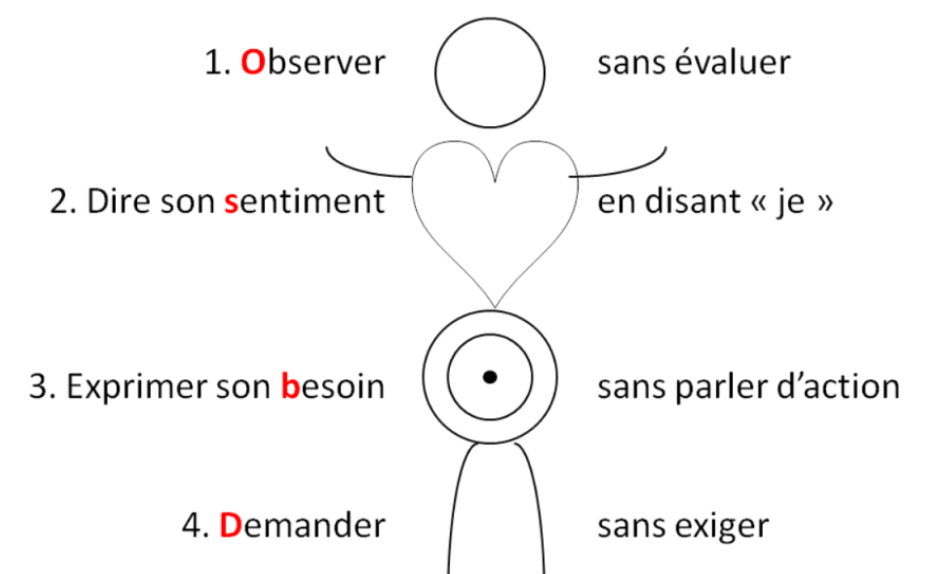
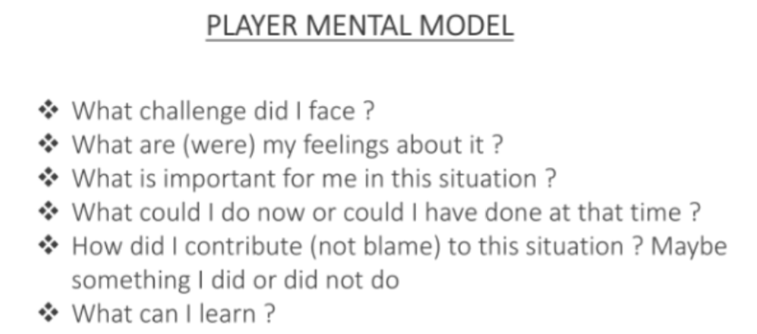
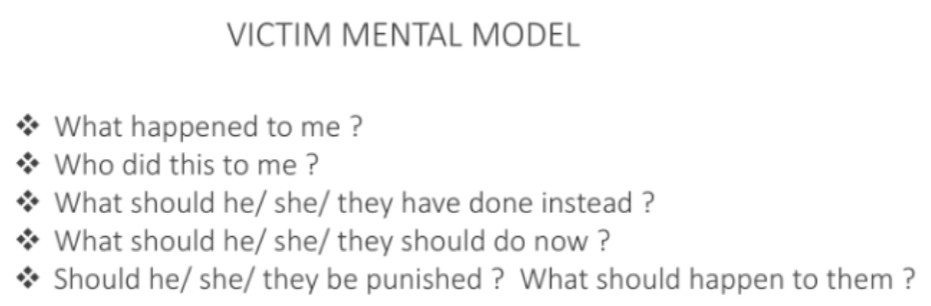
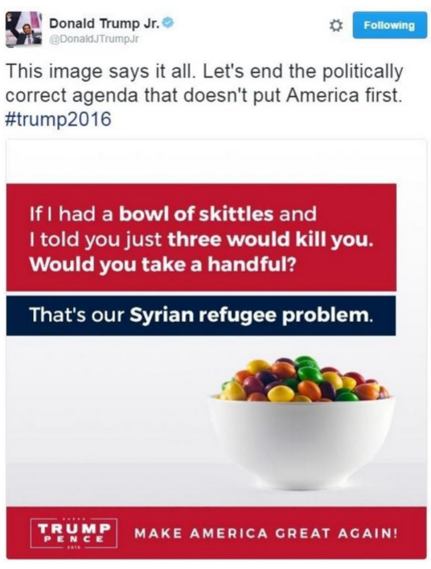



MON débutant, aucun prérequis




- [Site CNV France](https://cnvfrance.fr/communication-non-violente/) consulté le 15/01/25
- Ressources internes sur la CNV du LICA - Laboratoire d'Intelligence Collective et Artificielle Marseille
- [Site apprentie girafe](https://apprentie-girafe.com/) consulté le 15/01/25
- Cours "Equipe Performante" donné en Do_It par Leonardo Santarelli le 25/11/24
- [Les sophismes En économie et en environnement, par Pierre Blackburn et Brigitte Blais](https://www.rncreq.org/pdf/sophismes.pdf)
- [Guide du débrouillard - rhétorique fallacieuse](https://guide-du-debrouillard.fr/rhetorique-fallacieuse/)
- [Top 10 des arguments fallacieux et comment s'en protéger - Panache](https://www.avecpanache.co/post/top-10-des-arguments-fallacieux-et-comment-sen-proteger)
- Diaporama "Prise de parole et éloquence" - Tronc commun de 2A Centrale Méditerranée



## Sommaire

- [Introduction](#intro)
- [Communication Non Violente](#cnv)
- [Négociation & engagement](#n)
- [Les sophismes](#so)
- [Faire un bon discours](#d)
- [Conclusion](#ccl)

<h2 id=intro> 🔎Introduction</h2>

L'**éloquence** désigne don de la parole, **la facilité de bien s’exprimer**. Et comme l’éloquence vient souvent servir une demande ou une cause, c’est aussi l’art de toucher et de persuader par le discours.  
Ayant fait une césure entre ma 2A et 3A, je fais partie des élèves qui n'ont jamais eu la semaine de tronc commun de Centrale pendant laquelle on parle de leadership et d'éloquence. Or, **j'ai toujours été fascinée par le langage**, j'avais d'ailleurs écrit une [mini thèse sur l'influence du langage](https://docs.google.com/document/d/1mdGBEknpjgtIS8IaHEqQSoOL_zh2B8KgVLG04pKsFTA/edit?usp=sharing) en 2A pendant l'électif de Philosophie économique de l’anthropocène par Guillaume Quiquerez.  
Ainsi, je profite de ce MON pour apprendre et mettre au propre tous les conseils pertinents sur l'éloquence avec des parties sur la **CNV**, comment **négocier et obtenir un engagement** d'une personne, les **procédés réthoriques** dont il faut se méfier et **comment faire un bon discours**.

<h2 id=cnv> ☮️Communication Non Violente</h2>

### 💡Création et définition de la CNV

“***La violence est l’expression tragique de nos besoins insatisfaits.*** *Elle est la manifestation de l’impuissance et/ou du désespoir de quelqu'un qui est si peu protégé qu'il pense que ses mots ne suffisent pas pour se faire comprendre. Et donc il attaque, crie, agresse, …*” — Marshall Rosenberg

**Marshall Rosenberg** est un psychanalyste américain qui a créé dans les années 70 ce qu’il appelle la “**Communication Non Violente**” abrégée **CNV**. Selon lui, c'est "***le langage et les interactions qui renforcent notre aptitude à donner avec bienveillance et à inspirer aux autres le désir d’en faire autant***". Ainsi, la CNV part du principe que notre nature profonde nous porte à aimer, donner et recevoir dans un esprit de bienveillance.

Donc la CNV, c’est juste être bienveillant ?  
Non ! "*La CNV, c’est une pratique de bisounours*", "*Je n’ai pas besoin de la CNV, je ne suis pas violent*" sont des phrases que l’on entend souvent. **La CNV, ce n’est pas être gentil, c’est être assertif** : c’est à dire s’affirmer en toute authenticité, tout en respectant l’autre.

### 🦒Métaphore de la girafe et du chacal

Pour symboliser les **2 modes de communication opposés**, Marshall Rosenberg utilise la métaphore de la girafe et du chacal :

    Illustration trouvée sur le site apprentie girafe

La **girafe** est l’animal terrestre qui a le plus grand coeur (nécessaire pour pomper le sang jusqu’à son cerveau). Elle symbolise donc le **langage de la bienveillance et du coeur**. Avec son long cou, elle prend de la hauteur et peut voir loin. Elle est donc aussi la métaphore d’un langage empreint de conscience.

Le **chacal** symbolise notre manière habituelle de nous exprimer, à laquelle nous avons été conditionné dès notre enfance. Un mode de communication **basé sur les jugements, la morale, les étiquettes**, les exigences, le désir d’avoir raison et le déni de responsabilité (c’est l’autre qui est responsable de mon malheur : "*je me sens comme ceci, parce que TU as fait cela.*")


Dans la CNV, **la girafe et le chacal ne sont pas le "bien" et le "mal"** : les 2 sont utiles !


### 📖Processus OSBD

**Quand le comportement de quelqu'un nous gêne** ponctuellement ou nous agace franchement, on peut utiliser la CNV grace à un **processus en 4 étapes** nommé **OSBD** pour Observation, Sentiment, Besoin, Demande.

#### 1 - Observation
**Que se passe-t-il, d’un point de vue neutre, objectif ?**  
Nous tentons de décrire la situation, les faits, de manière objective comme à travers une **caméra**.  


**Distinguer observation et interprétation** : 
- "il y a du soleil" → observation
- "c'est super, il fait beau" → interprétation  (ex : un agriculteur aurait peut-être envie qu'il pleuve)

**Distinguer observation objective et subjective** : 
- "L'équipe me met à l’écart. Aucun projet ne m’est proposé. Je ne suis pas valorisée" → subjectif, teinté de mon expérience, ressenti et jugements
- "Depuis 6 mois, je n'ai pas rejoint de nouveaux projets. je n'ai pas été invitée à telle réunion d'équipe. Je n'ai pas reçu de feedback positif de mes collègues sur mon dernier travail" → objectif



#### 2 - Sentiment
Quand il se passe l'observation, **comment est-ce que je me sens ?**.   
Sentiments communs : **content, enjoué, aimant, serein, triste, faché, fatigué, apeuré**...  
Attention, ce nous appelons sentiment n’en est d’ailleurs pas toujours car certains sont des "**faux-sentiments**" teintés d’interprétations tels que incompris, rejeté, trahi qui accusent l'autre.

#### 3 - Besoin
Je ressens le sentiment précédent car au fond, **j’ai besoin de quoi ?**  
Le besoin en CNV, est l’énergie qui nous pousse à agir. Les besoins ne sont **pas attachés à un contexte, une personne, un objet, une situation particulière** et ils sont universels : **besoin de survie, intégrité, réalisation, harmonie, affection, coopération, deuil, spiritualité, célébration**.  
Cependant, il existe une infinité de **manières de les satisfaire** : c’est ce que l’on appelle des **stratégies** qui sont propres à chacun de nous.


**Distinguer un besoin d’une stratégie** : j’ai besoin de me nourrir. Je n’ai pas besoin de chocolat. Le chocolat est une stratégie pour me nourrir. D’ailleurs le chocolat peut aussi être une stratégie pour nourrir un besoin différent, de réconfort par exemple.  
  
**Distinguer le besoin chez moi du besoin sur l'autre** :

    Illustration trouvée sur le site apprentie girafe



#### 4 - Demande
Après avoir décrit la situation, compris les sentiments que cette situation provoque en nous et compris quel était le besoin sous-jacent à notre mal-être, on peut alors **formuler une demande à l'autre personne**. Cette demande est **formulée positivement**, (ce que je veux, plutôt que ce que je ne veux pas) et elle est **concrète, précise et ouverte** (si je ne suis pas prêt à entendre un « non » à ma demande, alors c’est une exigence et non une demande).

#### Résumé des 4 étapes : le bonhomme OSBD

    Illustration trouvée sur le site "Prof de bonheur"

### 😀Bénéfices de la CNV

En utilisant notre intelligence relationnelle et émotionnelle, la CNV participe à **fluidifier et assainir nos relations**. Finis les jugements moralisateurs, infantilisants, ainsi que la tendance à se victimiser. Elle permet de mieux comprendre ce qui se joue derrière certaines situations conflictuelles : quand les **besoins de chacun sont identifiés** et écoutés, parvenir à des solutions qui respectent chacun est plus facile.


**Que signifie  l'expression "aller sur la colline de l’autre" ?**  
C'est une image souvent employée en CNV. Elle décrit cette situation où deux personnes, chacune sur sa colline, observent un pommier dans la vallée qui les sépare. Comme le soleil brille toujours du même côté, seulement la moitié des pommes sont mûres. Quand la personne qui voit les pommes mûres propose à l’autre de faire un gâteau aux pommes, l’autre rétorque que ce n’est pas possible car les pommes ne sont pas mûres. Tant que chacun reste sur sa colline (= sa vision partielle de la réalité) il peut s’ensuivre une dispute sans fin. Aller sur la colline de l’autre, c’est aller constater qu’effectivement, du point de vue de l’autre, les pommes sont mûres : **c’est vouloir comprendre sa réalité**.


<h2 id=n> 🤝Négociation & engagement </h2>

Cette partie correspond à un résumé de la partie sur le langage du **cours "Equipe Performante"** donné en Do_It par **Leonardo Santarelli** le 25/11/24. En effet, il avait donné plein d'astuces de langage très intéressantes qui ont leur place dans ce MON.

### 💁‍♀️Négociation avec quelqu'un

**Avant la négociation** :  
- Définir mon **BATNA** : **Best Alternative To a Negotiated Agreement**   
C'est notre parachute dans une négociation, il donne une tranquillité pendant la négociation en ayant une alternative. Ne pas le dire à l’autre !  
Ex : si je veux acheter une voiture moins chère, mon BATNA est le prix max où j'achète cette voiture car je sais qu'un autre modèle mieux vaut ce prix max. Sinon, je considère que l'offre n'est pas intéressante et je pars, comme ça je ne risque pas d'avoir un accord que je regrète ensuite car il y avait une meilleure solution.
- **Lister les variables  de négociations**   
La valeur totale d’une négociation peut augmenter si A propose un service qui lui coûte 100 et qui représente 200 aux yeux de B  
Ex : si je négocie un achat, en plus du prix, je peux négocier les délais, les moyens de livraisons, la durée du contrat, une remise future, d'autres articles ajoutés, d'autres trucs qui ont de la valeurs pour l’autre ou qui sont plus simples à changer (j'aide à porter le colis à l'arrivée car je suis plus fort physiquement)...  
Tips : pour négocier le salaire avec son employeur, demander plutôt d’autres avantages sur le logement etc plutôt que sur le salaire car ce dernier répond à une grille salariale
- **Me renseigner au maximum** sur l'autre, si une négociation de ce genre a déjà eu lieu etc

**Pendant la négociation** :
- **Changer les MAIS en ET** “et j’ai un point de vue aussi sur ça”, “**c’est vrai aussi que**” pour ne pas être dans la confrontation
- **Ne pas confondre intérêt et  position**.  
Ex : je demande à ouvrir la porte (position) alors que je veux juste avoir moins chaud (intérêt). Si l'autre refuse, une autre solution possible serait de baisser les radiateurs → bien penser à **découvrir l’intérêt de l’autre** pour envisager toutes les solutions possibles au lieu de juste la position imaginée ! → **demander "pourquoi ?"** quand l'autre personne formule sa requête
- **Ne pas prendre de décision rapidement**, c'est à chaud qu'on peut faire le plus d'erreur

### 📅Demande d'engagement - ex : livrable avant une deadline

Bien insister sur l’**engagement** et la **deadline** ! → sans date, pas d’engagement  
“Est-ce que tu peux t’engager ?” ou “**Est-ce que je peux compter sur toi pour avoir ce rapport lundi soir ?**”  
Terminer par “**Donc je compte sur toi pour avoir le rapport lundi soir.**”
Il n'y a que 3 réponses possibles à un engagement : oui, non, oui conditionnel ! 

**Si la personne n'a pas respecté sa promesse** :  
Demander "**On est d'accord que tu avais bien donné ton engagement pour livrer le rapport avant lundi soir ?**" pour repartir des faits.  
Demander "**Quand as tu réalisé que ça allait être compliqué de réaliser le rapport dans les temps ?**" → "**Pourquoi tu ne m'as pas prévenu à ce moment-là pour qu'on trouve une solution ensemble ?**"  
Terminer par "Je comprends et je ne t'en tiens pas rigueur. Pour la prochaine fois, si tu sens que la deadline sera trop compliquée à tenir **j'aimerai vraiement que tu me préviennes immédiatement** quand tu le réalises s'il-te-plait. **Est-ce que je peux compter sur toi ?**"

### 🙎‍♀️En cas de dispute avec une personne

- Aller voir la personne en **position de learner** ≠ know it all  
Utiliser “**Je pense que**” au lieu de dire que mon interprétation est la vérité et garder en tête l'image d'un **drône** pour porter un regard extérieur sur la situation  
Bien **repartir des faits** pour comprendre le chemin de la personne ( faits → émotions → comportements)
- D’abord **laisser l’autre s’exprimer PUIS s’exprimer** → technique du "pense-écoute" dans mon MON 1.1 intelligence collective

### 🩹Aider quelqu'un qui a eu un problème

**Response-ABLE** : on n'est pas forcément responsable de la situation, mais on a le devoir de réagir à la situation  
**Faute ≠ responsabilité** → ne pas rester bloqué dans “de qui c’est la faute ?” pour ne pas être en mode victime  
Poser les **questions en mode Player** ≠ Victim

    
    

<h2 id=so> 💬Les sophismes </h2>

Un **sophisme** est selon le dictionnaire Larousse un "**argument qui, partant de prémisses vraies, ou jugées telles, aboutit à une conclusion absurde et difficile à réfuter**". Voici ci-dessous les principaux sophismes dont il faut se méfier. Ils sont **notamment très utilisés dans les discours des politiques**.  

### 🏃‍♀️‍➡️La généralisation hâtive

Ce sophisme **consiste à généraliser à partir d'un échantillonnage trop restreint**, voire d'un simple exemple personnel.

Ex : "*Moi il s'avère que j'ai entéré 2 de mes proches avant l'âge de 25 ans qui sont morts de consommation de drogues et tous les 2 avaient commencé par du canabis, des drogues dites "douces" parce que c'est cool...*" - Marlène Schiappa sur la drogue

Que faire face à ce sophisme ?  
On peut rappeler à notre interlocuteur qu’il doit **prouver que les exemples qu’il a étudiés reflètent bien la réalité**. On peut aussi l’inviter à **nuancer sa conclusion généralisée** en **soulignant les paramètres qu’il a omis dans son analyse**. On peut également **montrer que l’inverse de son affirmation est tout aussi plausible** ou bien mettre en évidence des alternatives aux effets moins néfastes.

### 👨‍🎨La caricature

Ce sophisme consiste à **exagérer la position de l'adversaire pour la rendre plus facilement attaquable** en simplifiant ou en radicalisant l'opinion de cette personne (donc en modifiant sa position).

Ex : "*J'entends beaucoup de voix qui s'élèvent pour nous expliquer qu'il faudrait relever la complexité des problèmes contemporains en revenant à la lampe à huile ! Je ne crois pas que le modèle Amish permette de régler les défis de l'écologie contemporaine*" - Emmanuel Macron pour caricaturer les opposants à la 5G

Que faire face à ce sophisme ?  
On peut **verbaliser que l'adversaire utilise une caricature** et insister sur le fait que **ces attaques visent des arguments altérés ou simplifiés** par l’interlocuteur, et non les véritables idées ou positions de la personne concernée.

### ⚖️Le faux dilemme

Il consiste à **piéger l’adversaire dans une fausse alternative** ; il doit choisir entre **A, qui est catastrophique, et B, qui est la position défendue** par le sophiste.C'est **oui ou non**, **vrai ou faux**. Dans une telle logique, il n'y a **aucune place pour la nuance, le cas par cas** ou la complexité d'une question.

Ex : "*Ou bien on suit le modèle américain, ou bien on meurt.*"

Que faire face à ce sophisme ?  
On peut **montrer quelles sont les possibilités qui n'ont pas été envisagées** et montrer ainsi que l'argumentation est incorrecte.  
On peut même **demander à notre interlocuteur de confirmer qu'il y a bien seulement 2 options possibles**. Si il dit "oui", on avance les autres possibilités. Si il dit "non", on lui demandes ses autres options. Ainsi, on **sort du faux dilemme**.

### 📉La pente fatale

Il consiste à **présenter une série de conséquences catastrophiques sans démontrer de lien de cause à effet convaincant** ou en exagérant à outrance.

Ex : "*Si nous acceptons le paquet de cigarettes neutres. Dans 6 mois on vous proposera la bouteille de vin neutre. Et s'en sera fini de nos appellations, de nos terroirs, de nos savoirs-faire*" - Nicolas Sarkozy sur le paquet de cigarettes "neutre"

Que faire face à ce sophisme ?  
On peut **montrer** à notre interlocuteur que le prétendu **lien entre l'action et ses conséquences est faible ou inexistant**.

### ⚔️L'attaque contre la personne

Il consiste à **attaquer une personne plutôt que son argumentation** et prétendre qu’ainsi on a discrédité cette argumentation

Ex : Greta Thundberg fait très souvent l'objet de critiques sur son physique, son âge ou son syndrome d'asperger plutôt que sur les arguments qu'elle avance.

Que faire face à ce sophisme ?  
Il faut **souligner que les allégations ne portent nullement atteinte à l'argumentation** comme telle.

### ↔️Le lien causal douteux

C'est lorsqu’une argumentation utilise un **lien de cause à effet douteux**. Souvent il n'y a **qu'une simple corrélation accidentelle**, ou une cause commune voire un lien totalement inventé.

Ex : "*Dans les années '80, on a libéralisé les marchés et l'économie a pris du mieux. Donc, en continuant à libéraliser les marchés, on assistera à une relance économique*"

Que faire face à ce sophisme ?  
Il faut **montrer à notre interlocuteur pour quelle raison le lien causal de son argumentation est douteux**.

### 🧑‍⚖️La double faute

Il consiste à tenter de **justifier un comportement en soulignant que d’autres font la même chose**, voire pire encore.

Ex : Fred dit "*Il faudrait que le Canada signe le Protocole de Kyoto* ». David répond « *C'est pas grave si on ne le signe pas, les États-Unis ne le signent pas et ils polluent plus que nous*".

Que faire face à ce sophisme ?  
On peut souligner à notre interlocuteur que ce type d'argumentation est incorrect en l'illustrant par un exemple du genre "***on ne justifie pas un meurtre en disant que d'autres en commettent***"  

### 👩‍🌾L'homme de paille

Il consiste à **attribuer des idées ou des paroles (purement inventées et facilement criticable) à ceux que l’on veut dénigrer**.

Ex : "*Pour vous les animaux auraient donc la même valeur que les humains ? Donc pour vous Léonard de Vinci, Mozart ou mère Térésa ne sont pas supérieurs à une blatte, une chauve-souris ou une mygale ?*"

Que faire face à ce sophisme ?  
On peut **dire que ce sont ses mots et non les notres** puis revenir sur notre idée initiale.

### 🏆L'appel à la popularité

Il consiste à **valider une idée en arguant du fait qu’elle est admise comme vraie par un grand nombre de personnes**.

Ex : "*En 1700, la majorité des gens pensaient que l’esclavage était moralement correct. Donc, en 1700, l’esclavage était correct.*"

Que faire face à ce sophisme ?  
Demander de **montrer en quoi "tout le monde" est forcément dans le vrai**, qu'il ne peut pas se tromper. On peut aussi **donner des exemples concrets où la majorité de la population se trompait** (l'esclavage était considéré comme correct, les femmes étaient considérées comme inférieures à l'homme, la saignée était vue comme un remède efficace contre les maladies, le Soleil tournait autour de la Terre...).

### 👩🏽‍🔬Le faux appel à l'autorité

Il consiste à **s'appuyer sur une autorité (personnalité ou domaine d'expertise) alors que celle-ci n'en est pas une** dans le domaine, ou qu'elle est invoquée n'importe comment.

Ex : "*Tu sais que d'après Jean-Claude Van Damme, dans 20 ou 30 ans il n'y aura plus d'eau sur Terre*"

Que faire face à ce sophisme ?  
Demander **en quoi l'autorité citée est légitime et pertinente pour alimenter l'argument**.

### 🥲L'appel au sentiment

Il consiste à **prendre son interlocuteur par les sentiments** au lieu de donner un vrai argument.  

Ex : "*Mesdames et messieurs du jury, regardez cet homme misérable, dans un fauteuil roulant, incapable d'utiliser ses jambes. Un tel homme peut-il vraiment être coupable de détournement de fonds ?*"  

Que faire face à ce sophisme ?  
**Demander de vrais arguments** et dire que la pitié n'est pas un argument valable..

### 🧠L'appel à l'ignorance

Il consiste à dire qu'**une opinion est vraie simplement parce qu'on a pas jusqu'ici prouvé qu'elle est fausse**.  

Ex : "*Prouvez-moi que les extraterrestres n'existent pas, ou alors c'est qu'ils existent.*"

Que faire face à ce sophisme ?
Rappeler que **sans preuve, on ne peut tirer aucune conclusion**. Utiliser la même logique pour prouver que l'argumentation est absurde (ici ça donne "*Prouvez-moi que les extraterrestres existent, sinon c'est qu'ils n'existent pas.*").

### 🤫Le complot

Il consiste à **attribuer un événement à un groupe de personnes, simplement car ce groupe en profite**.

Ex : "*Comme le non l’a emporté au référendum et que cela profite aux docteurs, on peut en conclure que ce sont les docteurs qui ont provoqué la victoire du non au référendum.*"

Que faire face à ce sophisme ?  
Il faut **montrer à notre interlocuteur que son argumentation est simpliste ou inexacte**.

### 🟰La fausse analogie

Il consiste à tenter de **justifier une conclusion sur la base d’une analogie** établie entre deux phénomènes qui ne s’avèrent **pas suffisamment semblables** pour justifier ce procédé.

  
Ex : "Si j'avais un bol de Skittles et que je te disais que trois d'entre eux étaient empoisonnés. En prendrais-tu une poignée entière ? Tel est notre problème avec les réfugiés syriens." - Tweet du fils de Donald Trump pour soutenir la candidature de son père.
  

  

Que faire face à ce sophisme ?  
Il faut **expliquer à notre interlocuteur que les situatsions ne sont pas les mêmes** et donc qu'on ne peut pas tirer des conclusions semblables.

### ♾️Autres sophismes

J'ai croisé plein d'autres sophismes au cours de mes recherches, je ne vais pas les détailler mais je mets ici quelques noms pour les plus curieux : **appel à la peur**, **appel à l'argent**, **appel à l'innovation**, **appel à la tradition**, **appel à la flatterie**, **preuve anecdotique**, **erreur du parieur**, **erreur du perfectionniste**...  
Notamment, ce site [guide du débrouillard - rhétorique fallacieuse](https://guide-du-debrouillard.fr/rhetorique-fallacieuse/) les détaille bien !  

### 💪Etre conscient des sophismes + sauras-tu reconnaître les sophismes ?

**Tout le monde fait des sophismes tous les jours**. Simplement parce que ce sont souvent des **raccourcis pour partager notre point de vue** sans vouloir rentrer dans une argumentation complète et ultra rigoureuse. Cependant, il est **important d'en avoir conscience** pour pas se laisser avoir pas ces sophismes lors de débats. 


**L'esprit critique est un muscle qu'il faut entretenir** donc voici un exo. **Trouve les sophismes** dans cette phrase :  

"*J'ai une amie qui a chopé des puces de lit dans cet hôtel donc si tu y résides tu vas sûrement te faire piquer, aller aux urgences et louper ton avion retour... Soit tu restes avec moi ici, soit tu vas finir aux urgences quoi*"


Là, il y a un super combo : **généralisation hâtive** + **pente glissante** + **faux dilemme** ! Jackpot !



<h2 id=d> 🗣️Faire un bon discours</h2>

Pour rédiger cette partie, je me suis beaucoup inspirée du diaporama du **cours "Prise de parole et éloquence"** donné lors du tronc commun de 2A de Centrale Méditerranée mais auquel je n'avais pas assisté comme tous les autres élèves en césure. J'ai mélangé les conseils dedans avec d'autres sources d'internet et mon expérience personnelle pour rédiger les conseils ci-dessous.  

### ✍️Ecrire son discours

#### Questions à poser quand on nous demande le discours

- **Situation générale** → quel est le contexte du discours (fête, séminaire, intervention extérieure...) ?
- **Objectifs de la prise de parole** → informer, persuader, motiver, fédérer, divertir, débattre, célébrer, rendre hommage, sensibiliser...
- **Niveau de connaissance du public** → pour adapter le vocabulaire
- **Niveau de proximité avec le public** → pour adapter le langage (familier, courant ou soutenu) 
- **Relation avec le demandeur du discours** → a-t-on déjà fait un discours pour lui ?  Qu'est-ce qu'il préfère ?
- **Choix des styles de prise de parole**  → participatif ou naratif, émotionnel ou rationnel, vulgarisation ou expertise...
- **Caractéristiques techniques** → date, horaire, lieu, durée, contact d'une personne sur place, support visuel (autoportant ou non), possibilité d'écrire sur un tableau, retransmission en vidéo, temps d'échange après... ?

#### Etapes pour écrire le discours

1. Savoir les **réponses aux questions** précédentes
2. **Se renseigner sur le sujet** en rassemblant les faits, les dates, les données chiffrées, les anecdotes, les citations, les témoignages…
3. Créer le **plan du discours** en 2 à 4 parties avec des **transitions**
4. **Développer chaque idée** de ce plan avec des exemples
5. Ecrire l'**introduction** et la **conclusion**

#### Conseils d'écriture

**Introduction** avec **accroche**,  **présentation de qui je suis** puis **annonce brève du plan**.  
Ex d'accroches :  
Un hommage : "*mesdames, messieurs, je suis honoré de prendre la parole devant vous ce soir…*"  
Une question  
Une anecdote frappante  
Un chiffre étonnant  
La dramatisation de l’enjeu : "*J’ai quelque chose de très grave à vous dire, aujourd’hui : la liberté a trépassé…*"

**Conclusion** :  
Résumer le discours en **3 points clés max**, sachant que le premier et le dernier seront les mieux retenus  
Faire un **appel au public** (si pertinent) pour l’inciter à passer à l’action, à réfléchir ou à adopter une nouvelle perspective  
Conclure sur une **note positive et inspirante** comme une citation ou un rappel de l'accroche  

Faire des **transitions fluides** : "*après avoir vu l’impact de X, intéressons-nous maintenant à Y*"

**Matérialiser ses exemples** : raconter des exemples concrets avec des références à l'actualité, des anecdotes pro ou perso, des graphiques, des images ou bien utiliser des comparaisons et des métaphores simples...

**Impliquer l'audience** pour qu’elle se sente concernée par vos propos :  
Interpeller "*Mesdames, messieurs, mes chers associés*"  
Intégrer le « *vous* » le plus souvent possible  
Ajouter des phrases du type "*ceux qui sont présents connaissent bien le problème, vous vous souvenez sûrement…*" 

User de la **répétition** pour convaincre  
L’anaphore en répétant le même mot en début de phrase (Martin Luther King Jr : I Have a Dream).  
La redondance qui utilise le même principe, mais avec l’ensemble du champ lexical et permet d’insister sur une idée

Utiliser des **questions rhétoriques** (question sans attente de réponse) pour engager l’auditoire

Utiliser **l'ironie**. Ex : "*Bien sûr, ignorer le problème est la meilleure solution… jusqu’à ce qu’il nous explose au visage.*"

Utiliser la **prosopopée** en donnant la parole à une personne absente, un objet ou une idée. Ex : "*Si la Terre pouvait parler, elle crierait : ‘Protégez-moi !’*"  

Privilégier des **phrases courtes** et un propos concis

Avoir un **support de présentation**  
Les visuels doivent être un complément à votre présentation et non un substitut ! Ils ne sont là que pour renforcer un point important ou pour faciliter la compréhension d’éléments compliqués. Ne pas hésiter à faire apparaître petit à petit les éléments des slides qui ne doivent pas être trop chargées.

**Écrire comme on parle** : un discours n’est pas un texte académique, il doit être naturel à l’oral

**Lire à voix haute** pour vérifier le rythme et ajuster les phrases qui sonnent artificielles

**Relire** le discours à **plusieurs jours d'écarts**, par **ChatGPT** et par des **proches**

### ✅Préparation pour le discours
**En amont** :
- Ecrire son discours grâce à la partie précédente, préparer ses **notes** (police lisible et assez grande), son **matériel**, son **support** (prévoir un backup), sa tenue, sa montre
- S’entraîner à **répéter** son dicours avec un chronomètre → avoir des **points de timing**
- Récapituler les **infos logistiques** → date, horaire, lieu, contact d'une personne sur place, trajet

**Le jour J** :
- Venir en avance pour préparer la salle, le matériel, installer le support, remplir sa gourde etc
- Boire de l'**eau** juste avant
- Utiliser son corps et l'espace avec : les **déplacements**, les **postures**, la **gestuelle**, l’utilisation du **regard**
- Jouer sur les **silences** aux moments importants pour capter l'attention
- Adapter le **débit de parole**, le **volume** et le **ton** de la voix selon les moments
- Avoir un regard sur le **timing**

**Après le discours** :
- Demander du **feedback**
- Repérer les **points à améliorer**

<h2 id=ccl> 👍Conclusion</h2>

J'ai **adoré travailler sur ce sujet** ! Cela faisant longtemps que je voulais en savoir plus sur la CNV, c'était un palsir de remettre au propre les conseils vu en cours "équipe performante" et je suis contente de mieux savoir repérer les sophismes dans des argumentations. Je pense que je regarderai souvent ce MON quand j'aurai besoin d'écrire un discours. J'espère qu'il vous servira aussi !

## ⌛Horodatage

| Date | Heures passées | Indications |
| -------- | -------- |-------- |
| Mercredi 15/01 | 3h | recherche générale sur l'éloquence puis rédaction de la partie CNV |
| Jeudi 16/01 | 3h30 | rédaction de la partie Négociation et engagement puis de la partie Faire un bon discours |
| Vendredi 17/01 | 1h15 | recherches et début rédaction sur la partie sophismes |
| Samedi 18/01 | 2h30 | fin rédaction de la partie sophismes, écriture conclusion et mise en forme du MON |