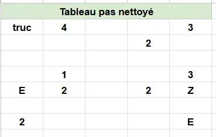
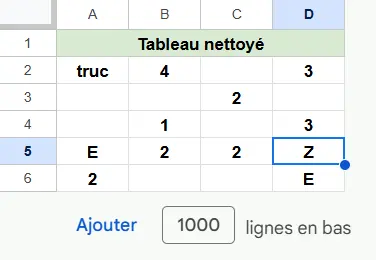
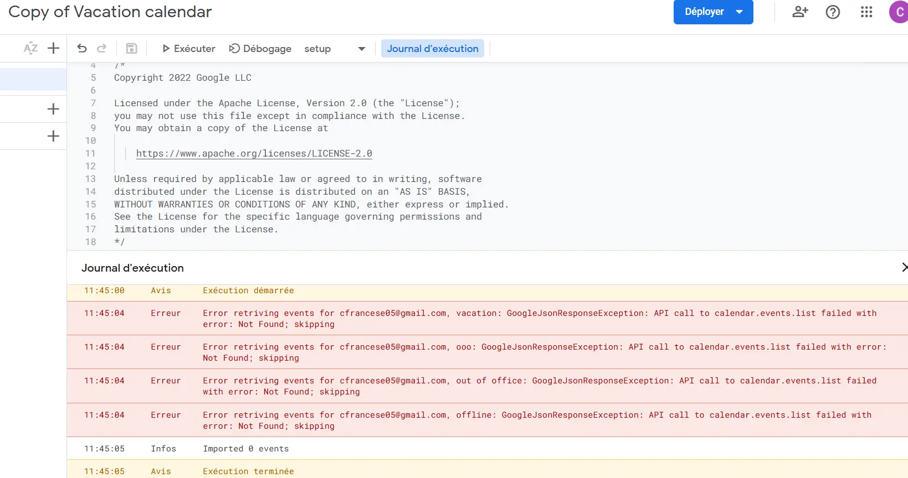



POK débutant : aucun prérequis




- [POK : Un peu d'Excel/Google Sheets pour mourir moins idiot](/promos/2023-2024/TAING-Henri/mon/temps-2-1/)
- [Formation sheets-Pratique.com](https://sheets-pratique.com/fr/cours)
- [Récap fonctions qui existent](https://sheets-pratique.com/fr/fonctions).
- [Générateur de formule pour extraire des données](https://sheets-pratique.com/fr/utilitaires/formule-extraction).
- [Sheets-Pratique : Cours Apps Script](https://sheets-pratique.com/fr/apps-script)
- [Find inspiration with Apps Script samples](https://developers.googleblog.com/en/getting-started-is-the-hardest-part-find-inspiration-with-apps-script-samples/)



Ma **grande sœur illustratrice** s’est lancée il y a moins d'un an dans la vente de carte postale qu’elle dessine et vend à des librairies qui les revendent à des clients. Son talent en art est immense, mais ses connaissances en bureautique sont proches du néant. Or, elle doit gérer de nombreux intermédiaires, comptabiliser les stocks dans chaque librairie, suivre l’évolution de ses ventes et aimerait **savoir plus facilement quelles librairies sont les plus rentables**.
Ainsi je veux utiliser ce POK pour dans un premier temps mieux me former à la suite **Google Sheets** (GS) et améliorer les tableaux que je lui avais déjà créé il y a un an. Puis je compte apprendre **Google Apps Script** (GAS) pour voir si je peux automatiser des fonctions grâce à cet outil.

## 📌Tâches


### 🏃‍➡️Sprints

Objectif général : **optimiser les tableaux de comptabilité** de ma soeur Laura.

#### Sprint 1

- [x] faire l'état de l’art de ce qui existe déjà MON, POK sur GS : 30 min (30 min)
- [x] suivre des tutos sur GS, consulter d’autres ressources et m’écrire une fiche récap des fonctionnalités : 5h30 (5h15)
- [x] récupérer les tableaux GS de Laura et établir un cahier des charges des améliorations à effectuer : 30 min (40 min)
- [x] améliorer les tableaux selon le CDC fixé : 2h (2h30)
- [x] envoyer les tableaux et explications à Laura : pas estimé (30 min)
- [x] rédiger ce que j’ai fait et mettre en forme GitHub : 1h30 (2h)

**Total d'heures sprint 1 : 11h25**  
**Etude post mortem** : dans mon planning intitial, j'avais oublié de prévoir un temps d'envoie des tableaux et d'explications à Laura et j'ai un peu sous-estimé le temps sur google sheet et le temps de rédaction et de prise en main de GitHub.

#### Sprint 2

- [x] faire l'état de l’art de ce qui existe déjà MON, POK sur GAS : 30 min (30 min)
- [x] suivre des tutos sur GAS, consulter d’autres ressources et m’écrire une fiche récap des fonctionnalités : 4h (4h)
- [ ] ~~établir un cahier des charges des améliorations à effectuer : 30 min~~
- [ ] ~~améliorer les tableaux selon le CDC fixé : 3h30~~
- [ ] ~~envoyer les tableaux et explication à Laura : 15 min~~
- [ ] ~~rédiger ce que j’ai fait et mettre en forme GitHub : 1h15~~
- [x] regarder les tableaux de Laura puis choisir et essayer un projet 1 : pas prévu (2h40)
- [x] choisir et réaliser un projet 2 : pas prévu (30 min)
- [x] choisir et essayer un projet 3 : pas prévu (1h)

**Total d'heures sprint 2 : 9h10**  oui, techniquement il manque 50 min mais vu que j'avais dépassé de 1h25 au sprint 1, j'ai bien passé **plus de 20h sur le POK** au total  
**Etude post mortem** : j'ai **changé ce que je voulais faire en milieu de sprint** pour faire des projets plus cohérents avec les outils de GAS. J'ai aussi changé ma manière de faire en écrivant au fur et à mesure sur Github au lieu de tout à la fin. Ainsi le sprint a été très chamboulé.

### ⌛Horodatage

| Date | Heures passées | Indications |
| -------- | -------- |-------- |
| **Sprint 1**
Jeudi 12/09  | 3h30  | Etat de l'art ressources google sheets et début formation |
 Lundi 16/09  | 4h45  | Fin formation, récupération des tableaux de Laura, écriture CDC et début des améliorations des tableaux  |
 Mardi 17/09  | 1h40  | Finalisation des tableaux et envoie des tableaux et d'expication à Laura |
 Mercredi 18/09  | 1h30 | Mise au propre et rédaction sur Github |
| **Sprint 2**
Dimanche 06/10  | 2h30  | Etat de l'art ressources apps script et début formation |
  Lundi 07/10  | 1h | Suite formation |
  Mecredi 09/10  | 3h40 | Fin formation, regardé les tableaux de Laura et tentative projet 1|
  Jeudi 10/10  | 2h | Projets 2 et 3 et mise en forme sur GitHub|



## Sommaire

- [POK : sprint 1](#POK1)
- [POK : sprint 2](#POK2)
- [Conclusion de ce POK 1](#conclusion)

<h2 id=POK1> 1️⃣POK : sprint 1</h2>

### 📖Ressources déjà existantes

La plupart des MON sur les tableaux que j’ai trouvé parlent d’Excel or j’ai décidé de renforcer mes connaissances sur Google Sheets (abrégé GS dans la suite). En effet, je n’ai pas accès à la licence Excel qui est payante (mais que fait Centrale Med ?!) et je pars du principe que Excel et GS sont très proches donc que je pourrai facilement apprendre Excel en entreprise si on m’oblige à l’utiliser. L’important est donc de découvrir toutes les possibilités avec ces tableurs pour ensuite y penser facilement grâce à une **fiche récap de toutes les fonctionnalités pratiques**.



Je suis tombée sur ce MON de Henri [Un peu d'Excel/Google Sheets pour mourir moins idiot](/promos/2023-2024/TAING-Henri/mon/temps-2-1/)  
Dedans, il recommande la formation suivante [Sheets-Pratique.com](https://sheets-pratique.com/fr/cours) que j’ai donc décidé de suivre.



### 🎓Formation

Voici le [tableau d'entrainement](https://docs.google.com/spreadsheets/d/1gqWjpNlDxRKQS0zSzKrygT4uDm_xVV5DqzeDctvrYCQ/edit?usp=sharing) sur lequel j'ai effectué pleins d'exercices au cours de la formation. Il est partagé en mode lecteur donc vous ne pouvez pas le modifier.

Voici ci-dessous ma **fiche récap** de tout ce que j'ai appris ou mieux compris en suivant cette formation et en creusant ailleurs :


#### Fonctionnalités diverses

**Modifier toutes les largeurs de colonnes en même temps** : sélectionner toutes les colonnes avec le curseur ou touche ctrl enfoncée → modifier

**Collage spécial** : coller uniquement au choix valeur, formule, mise en forme conditionnelle…

**Masquer le quadrillage** : affichage → afficher → quadrillage

**Affichage date** : entrer une date 01/04/2024 puis format → nombre → date et heure personnalisée → choisir sa préférence ex : “lun. 1”

**Formes** : déformer forme d’un dessin avec petit losange jaune, déplacer des formes doucement avec Maj + flèches clavier

**Images** : possibilité d’insérer une image dans une cellule et plus de possibilité sur image si insérer à partir d’un dessin (recadrer selon une forme, pivoter etc)
**Word Art** : insertion → dessin → actions → word art

**Liste déroulante** : insertion → liste déroulante
**Données issue d'une liste déroulante définie** : créer la liste de choix possible → sélectionner la plage où il faudra entrer ces choix → données → validation des données → menu déroulant (depuis une plage) → sélectionner la plage des choix

**Historique des versions** : penser à nommer la version actuelle quand j’ai une version que j’aime et que je veux retrouver facilement plus tard

**Protéger des cellules** : données → protéger des feuilles et des plages → saisir la règle

#### Fonctions

[Récap fonctions qui existent](https://sheets-pratique.com/fr/fonctions).

[Générateur de formule pour extraire des données](https://sheets-pratique.com/fr/utilitaires/formule-extraction).

**Utiliser fonction** : chercher une fonction avec bouton ∑ dans la barre d’outil OU insertion → fonction
**Plus d'infos sur les fonctions** : ? en haut à côté de la formule, encore plus de détail possibles

**Fixer une référence dans une formule** : ajouter des $ à la référence.
Ex : $B$8, le 1er $ fixe la colonne lors de la recopie et le 2ème $ fixe la ligne

**Nommer une plage** : sélectionner la plage → la nommer (pratique pour les formules)

**Fonction SI** : SI(expression logique; valeur si true; valeur si false) → ex : renvoie oui si majeur
Ex : =SI(A2>17;"oui";"non") 

**Imbrication de fonction SI** : ex : choix entre 3 tarifs notés en E1, E2 et E3 selon 3 âges
=SI(A2>17;SI(A2>64;$E$3;$E$2);$E$1) → d’abord on voit si il est adulte, si oui on voit si il est retraité et on affiche le bon tarif figé avec les $

**Fonction ET** : ET(test 1; test 2; ...) → renvoie VRAI si tous les tests sont VRAI. Ex : pour vérifier si qqn a entre 18 et 64 ans
=SI(ET(B2>=18;B2<65);"Oui";"Non") 

**Fonction OU** : =OU(test 1; test 2; ...) → renvoie VRAI si au moins un des tests est VRAI

**Fonction RECHERCHEV** : permet d’envoyer automatiquement une valeur selon une autre valeur liée (par exemple le nom d’une ville selon une boutique)
Combiner avec la **fonction SIERREUR** pour ne pas renvoyer le msg d’erreur si pas de donnée
Ex : =SIERREUR(RECHERCHEV(B5;Stock!$A$2:$B$10;2;0);"-")

#### Graphiques

**Graphique** : sélectionner la plage de données → insertion → graphique (si données pas dans le bon sens, cliquer sur "intervertir ligne et colonne")

**Graphique sparkline** : graphique miniature inséré directement dans une cellule
Ex : =SPARKLINE(B2:G2)

#### Mise en forme conditionnelle (MFC)

**MFC** : sélectionner données → format → mise en forme conditionnelle

**Colorier la colonne du mois actuel** : = MOIS(A$1) = MOIS(AUJOURDHUI())
Mise en forme conditionnelle → la formule personnalisée est → 
Bien vérifier que la date est rentrée au format date quitte à modifier son affichage

**Surligner une ligne selon valeur case** : =$A1=$B$6
Mise en forme conditionnelle → la formule personnalisée est → 
Ex : ici c’est la cellule B6 qui contient le mot recherché

**Case à cocher pour choisir d’appliquer la MFC** : modifier la formule de la MFC pour marquer =ET(condition;case figée)
Ex dans le cas ci-dessus : =ET(MOIS(A$1) = MOIS(AUJOURDHUI());$B$8) car la case à cocher est en B8

**Colorer les doublons d’une plage avec MFC** : ajouter MFC et formule personnalisé =NB.SI(plage figée;A2)>1      A2 = cellule en haut à gauche de la plage
Ex : =NB.SI($C$2:$C$19;A2)>1


#### Trier des données

**Trier données selon plusieurs colonnes** : Tout sélectionner → Données → Trier une plage → Options avancées de tri des plages
Aussi la possibilité d’utiliser la fonction SORT

**Filtre** : données → créer un filtre

**Vue filtrée** : Données → Vue filtrée → Créer une vue filtrée (dispo aussi barre d’outils)
Permet aux lecteurs de pouvoir changer de vue pour visualiser les données de manière différente ( ≠ filtre où l'affichage est figé pour les utilisateurs en lecture seule) et permet créer plusieurs vues différentes et de les nommer

**Validation de données** type mail, nombre, date, formule etc : données → validation des données → choisir le critère et le type de msg d’erreur (ex : texte d’une adresse e-mail valide)

#### Tableau croisé dynamique

**TCD** : sélectionner les données avec les en-têtes → insertion → TCD → insérer dans une nouvelle feuille → rentrer les bons paramètres dans l’éditeur de TCD
Ex : ajouter la ligne “produit” → ajouter la ligne “provenance” → ajouter la valeur “nombre d’unités achetées” → ajouter la valeur “prix par unité” et modifier sa fonction en “average” pour avoir la moyenne et non la somme par défaut



### 💡Cahier des charges des améliorations des tableaux de Laura

Maintenant que je suis bien plus à l'aise avec GS, je récupère les tableaux de comptabilité de Laura. Je lui avais créé le tableau [calendrier et compta ancien](https://docs.google.com/spreadsheets/d/1DkWvw-FkCZZZqjcyfCk64FEBDqxFVWs1153f-OzHmgE/edit?gid=957877577#gid=957877577) un an plus tôt et elle l'a un peu modifié entre temps. Vous pouvez voir la version qu'elle utilisait en allant sur la feuille "**Ancien calendrier compta 2024**".

Ensuite, Laura a de son côté créé le deuxième tableau [suivi des factures ancien](https://docs.google.com/spreadsheets/d/1RZB_4vyWY-2KVkbhKPkIwlEmPMH9DsRkCuLGLq1DHOk/edit?gid=653861341#gid=653861341). Là encore, l'ancienne version est visible en cliquant sur la feuille "**Ancien 2024**".

Je vais donc lister toutes les **améliorations possibles de ces 2 tableaux**.

#### Idées tableau suivi des factures

1. **Date** : proposer automatiquement la date du jour et la choisir sur un calendrier au lieu de la rentrer manuellement.
2. **Client** : choisir la librairie concernée par la facture dans une liste de toutes les librairies pour ne pas avoir à rentrer le nom manuellement et faciliter l'exploitation des données (pas d'erreur de nom).
3. **Adresse** : remplir automatiquement la ville selon le nom du client (chaque librairie est dans une ville connue).
4. **Produit facturés** : remplacer la saisie sous forme de texte par 3 colonnes et avoir les totaux de chaque produit à la fin.
5. **Bilan des factures par librairie** : créer un TCD qui permet de voir sur l’année les ventes par ville et par librairie.

#### Idées tableau calendrier et compta

1. **Mail** : ajouter la vérification de mail automatique.
2. **Graphique sparkline** : ajouter un graphique pour chaque librairie pour voir l'évolution des ventes au fil des mois.
3. **Feuille graphique** : déplacer les graphiques sur une nouvelle feuille pour plus de lisibilité car ils sont actuellement dessous le calendrier de la feuille "ancien calendrier compta 2024".

### ✅Améliorations effectuées selon le CDC

#### Amélioration tableau suivi des factures

Vous pouvez accéder aux modifications effectuées en cliquant sur le tableau [suivi des factures nouveau](https://docs.google.com/spreadsheets/d/1RZB_4vyWY-2KVkbhKPkIwlEmPMH9DsRkCuLGLq1DHOk/edit?gid=2019233211#gid=2019233211) sur les feuilles "**Modifié 2024**" et "**Créé bilan 2024**".

1. **Date** : je remarque que ma soeur a mis volontairement les dates à l’envers (mois/jour/année), je dois voir avec elle pourquoi car ça perturbe google sheet. En attendant, je ne préfère par modifier cette partie là.
2. **Client** : je créé un tableau récapitulant les clients et les villes des librairies juste à côté du tableau des factures. Puis j'insère dans la colonne "client" une liste à partir de la plage de données créée pour permettre de choisir la librairie parmis la liste quand on ajoute une ligne de facturation.
3. **Adresse** : grace au tableau intermédiaire contenant le nom des librairies et leur ville ainsi, j'utilise la formule =SIERREUR(RECHERCHEV(C3;$J$3:$K$101;2;0);" ") et le tour est joué !
4. **Produit facturés** : je créé rapidement 3 colonnes et une ligne des totaux avec la fonction SOMME.
5. **Bilan des factures par librairie** : je créé un TCD sur une nouvelle feuille que je nomme "Créé bilan 2024".


#### Amélioration tableau calendrier et compta

Vous pouvez accéder aux modifications effectuées en cliquant sur le tableau [calendrier et compta nouveau](https://docs.google.com/spreadsheets/d/1DkWvw-FkCZZZqjcyfCk64FEBDqxFVWs1153f-OzHmgE/edit?gid=1842762687#gid=1842762687) sur les feuilles "**Modifié calendrier compta 2024**" et "**Créé graphique 2024**".

1. **Mail** : j'ajoute facilement la vérification de mail automatique grace à la validation de données (voir formation).
2. **Graphique sparkline** : en regardant plus précisément le tableau de Laura, je réalise que ces graphiques n’auraient pas d’intérêt car elle reçoit les virements à des moments variées et non tous les mois.
3. **Feuille graphique** : je déplace facilement les graphiques sur une nouvelle feuille que je nomme "Créé graphique 2024".


### 👍Retours de Laura

Elle est **très contente** de ces améliorations et a **immédiatement adopté cette nouvelle version**. Elle aussi regrette l'affichage du TCD dans la feuille "créé bilan 2024" car elle le trouve pas instinctif (on voit mal les séparations entre les villes) mais c'est un modèle imposé par GS donc je ne peux pas améliorer ce point là.

<h2 id=POK2> 2️⃣POK : sprint 2</h2>

### 📖Ressources déjà existantes

J'ai trouvé de nombreux MON sur Google Apps Script que j'ai parcouru pour voir ce qu'il était possible de faire.


De nombreux MON recommandent là encore cette formation [Sheets-Pratique : Cours Apps Script](https://sheets-pratique.com/fr/apps-script) que j’ai donc décidé de suivre.



### 🎓Formation

Comme avec Google Sheet, j'ai passé plusieurs heures à suivre la formation pour mieux comprendre ce langage et rédigé ma **fiche récap** ci-dessous.


#### Divers fonctionnalités et variables

Pour accéder à Apps script, il faut dans Google Sheets cliquer sur **Extensions** > **Apps Script**

**Assigner un script à une forme** : insérer une forme > cliquer sur les trois points à droite > Assigner le script

**let coutTotalAnnuel = 100;** déclarer une variable et lui atribuer une valeur
Nommer les variables en commençant par une minuscule et ajouter les autres mots  en commençant par une majuscule.
Une variable peut stocker des valeurs au format texte entre '', "" ou ``
On retrouve aussi var au lieu de let dans certains codes

**console.log();** tester et vérifier la valeur d'une variable : console.log(coutTotalAnnuel) puis exécuter

**const nbVentesJanvier = 45;** déclarer une constante

**//commentaire** ajouter un commentaire **/*** si plusieurs lignes de commentaires ***/**

**valeur += 1;** ou **valeur++;** augmenter une valeur de +1

**texte1 += + texte2;** concaténe du texte

**let nombre2 = Number('10');** ou **let nombre3 = '10' * 1;** convertir un nombre au format texte

**Math.max** : trouver le max

**setBackground**: applique une couleur de fond (au format CSS) aux cellules
**setFontColor** : applique une couleur (au format CSS) au texte des cellules
**toUpperCase** : met en majuscule
**setFormula** : insère une formule (en anglais) dans la cellule

#### Tableaux

**const monTableau = [];** créer un tableau

**Accéder au valeur d'un tableau** :

```
const texte1 = plageValeurs[0];  
console.log(tableau[1][0]); // affiche la valeur 2ème ligne et 1ère colonne
```

**plageValeurs[0] = 'Sheets';** Modifier une valeur d'un tableau (ici la 1ère valeur)

**plageValeurs.push('pain');** pour ajouter une valeur à la fin  d'un tableau  
**plageValeurs.unshift('pain');** pour ajouter une valeur au début d'un tableau

**pop** : supprime la dernière valeur du tableau et **shift** : supprime la première valeur du tableau

**console.log(listeDeCourses.length);** longueur d'un tableau

#### Feuilles et cellules

**const feuille = SpreadsheetApp.getActive().getSheetByName('Feuille 2');** : accéder à la valeur d'une autre feuille

**Aplatir un tableau** : 
```
const feuille = SpreadsheetApp.getActiveSheet();
const plage = feuille.getRange('A1:C2');
const tableau = plage.getValues().flat();

console.log(tableau); // Affiche [ 1, 2, 3, 4, 5, 6 ] si tableau = [ [ 1, 2, 3], [ 4,5,6] ]
```

**Modifier la valeur d'une cellule** :
```
const feuille = SpreadsheetApp.getActiveSheet();
const cellule = feuille.getRange('A1');
cellule.setValue(1234); // Entre la valeur "1234" dans la cellule A1
// De même, utiliser getValues quand on veut modifier une plage de cellules
```

**activate** : active une feuille ou une cellule

**appendRow** : insère une ligne à la suite des données de la feuille : feuille.appendRow([1, 2, 3]);

**clear** : supprime complètement le contenu et la mise en forme de la feuille ou cellule

**clearContents** : supprime le contenu de la feuille ou cellule (en laissant la mise en forme) 

**deleteRow** : supprime une ligne entière de la feuille (ici, la ligne 17) : feuille.deleteRow(17);

**getActiveCell** : retourne la cellule active de la feuille

**getActiveRange** : retourne la plage de cellules active de la feuille 

**getDataRange** : retourne la plage de cellules de la feuille contenant des données

**getName** : retourne le nom de la feuille

**getRange** : retourne une cellule ou une plage de cellules de la feuille

**getValue** : récupère la valeur de la cellule  
```
const feuille = SpreadsheetApp.getActiveSheet(); // on récupère la feuille active  
const cellule = feuille.getRange('A1'); // puis une constante pour la cellule A1 de la feuille  
const valeur = cellule.getValue(); // on utilise la méthode getValue pour récupérer la valeur
// On peut aussi rentrer le numéro de ligne et de colonne pour getRange : getRange('A1') = getRange(1, 1)
```

**getValues** : récupère les valeurs de la plage de cellules :
```
const plage = feuille.getRange('A1:E2');  
const tableau = plage.getValues(); //retourne un tableau, contenant un tableau pour chaque ligne de la plage
```
**setValue** : définit la valeur de la cellule (idem avec **setValues**)

#### conditions

**if** : teste une condition
**else** : pour effectuer une autre action si la condition est fausse
**else if** : pour ajouter des conditions intermédiaires
```
if (valeurA1 == '') {
  celluleA1.setValue('A compléter');
} else if (valeurA1 > 0) {
  console.log('Valeur = ' + valeurA1);
} else {
  console.log('Valeur non valide');
}
```

**la condition ? valeur si vrai : valeur si faux**
```
const age = 12;
const texte = 'Tarif appliqué : ' + (age < 16 ? 'enfant' : 'adulte');

console.log(texte); // Affiche : "Tarif appliqué : enfant"
```

**for (let i = 1; i <= 12; i++)** : déclaration variable, condition à vérifier, modification variable

**while (tableau.length < 10)** : condition à vérifier

**&&** : équivalent de la fonction Google Sheets ET
**||** : équivalent de la fonction Google Sheets OU

#### fonctions

**function** et **return** :
```
// Calcule la moyenne de 2 nombres
function moyenne(nombre1, nombre2) {
  return (nombre1 + nombre2) / 2;
}
```

**fonction fléchée** : const moyenne = (nombre1, nombre2) => (nombre1 + nombre2) / 2;

**Exos :**

```
function compteur() {
  // Feuille active
  const feuille = SpreadsheetApp.getActiveSheet();
  // Cellule A2
  const celluleCompteur = feuille.getRange('A2');
  // Valeur de la cellule A2 + 1
  const compteur = celluleCompteur.getValue() + 1;
  // Changement de la valeur de la cellule A2
  celluleCompteur.setValue(compteur);
}
```




```
function ajoutLigne() {

  const ss = SpreadsheetApp.getActive(); // Pour éviter d'exécuter "getActive()" à double
  const feuille1 = ss.getSheetByName('Feuille 1');
  const feuille2 = ss.getSheetByName('Feuille 2');

  // Copie les valeurs de la ligne 1 de "Feuille 1" à la suite dans "Feuille 2"
  feuille2.appendRow(feuille1.getRange('1:1').getValues()[0]);
}
```


#### déclencheurs

**onEdit** : après la modification d'une valeur

**onOpen** : à l'ouverture du document

#### menu

[formation sur les menus](https://sheets-pratique.com/fr/apps-script/menus)
Voir dans la formation l'exemple pour convertir des cellules en majuscules ou minuscules

#### boîtes de dialogue

[formation sur les boîtes de dialogue](https://sheets-pratique.com/fr/apps-script/boites-de-dialogue)
**alert** permet d'afficher une boîte de dialogue avec différents paramètres possibles

#### ChatGPT est votre ami

J'ai remarqué en faisant les exercices que ChatGPT est vraiment très compétent pour aider à générer les fonctions, trouver les fomrules. C'est efficient de d'abord demander à ChatGPT de créer la fomrule puis de la personnaliser ou modifier petit à petit.



### 💡Tentatives de projets perso

En regardant mieux les tableaux de ma soeur, je pense qu'il n'y a pas vraiment besoin de les améliorer avec google apps script car il n'a pas beaucoup de choses à automatiser. Je change donc totalement mon sprint pour décider de consacrer les 5h30 qu'il me reste à **travailler sur d'autres projets** dans lesquels je pourrai utiliser mes connaissances et mieux prendre en main cet outil !

J'ai trouvé de l'inspiration en parcourant le [MON d'Antoine](https://francoisbrucker.github.io/do-it/promos/2022-2023/Varnerot-Antoine/mon/google-app-script/) grâce au lien ci-dessous qui présente plusieurs mini projets à faire sur google apps script.


[Find inspiration with Apps Script samples](https://developers.googleblog.com/en/getting-started-is-the-hardest-part-find-inspiration-with-apps-script-samples/)


#### 📬Projet 1 : importer des fichiers dans Google Drive à partir de Google Forms

Pour réaliser ce projet, je vais suivre ce [tuto drive](https://developers.google.com/apps-script/samples/automations/upload-files?hl=fr) directement proposé par Google. L'idée est de réaliser un google form relié à un script qui **permet de choisir l'emplacement où un fichier déposé dans le form sera enregistré dans le Drive**.

J'ai d'abord essayé de suivre le tuto mais alors que j'ai suivi minutieusement chaque étape, **ça ne fonctionnait pas**. J'ai donc essayé de recoder la fonction avec ChatGTPT mais sans plus de succès... **J'ai abandonné** après 2h d'effort.

#### 🧹Projet 2 : nettoyer des données dans une feuille de calcul

Ayant subi un échec cuisant lors du dernier projet, je décide de faire le même projet qu'Antoine avait réalisé dans son MON en me disant que le tuto de Google doit cette fois normalement bien marcher. En plus, j'utiliserai vraiment cette fonctionnalité à l'avenir qui permet de **nettoyer des données en enlèvant les lignes vides et colonnes vides**.
Voici le [tuto nettoyage](https://developers.google.com/workspace/add-ons/samples/clean-sheet?hl=fr) suivi.

Cette fois tout s'est bien passé, c'était même un peu décevant car en 20 min le tuto était fini et tout fonctionnait.  
Voici le **tableau non nettoyé** :


Et ce qu'on obtient **après avoir exécuté le script** avec Google Apps Script :


#### 📅Projet 3 : remplir un agenda de vacances d'équipe

Ce projet a pour but de **créer un agenda de vacances partagé pour que n'importe quel collègue d'une entreprise puisse savoir en un coup d'oeil qui est absent du bureau** plutôt que de devoir aller chercher dans chaque agenda un par un ou de demander aux collègues de remplir un agenda spécifique à leur absence qui serait vite illisible. Cette option aurait été super pratique lors de mon stage au Tiers-Lab des Transitions où l'on fonctionnait justement avec la suite Google.  
Je vais suivre ce [tuto agenda](https://developers.google.com/apps-script/samples/automations/vacation-calendar?hl=fr).

Cette fois c'était tout le contraire du tuto précédent : j'ai passé 1h à suivre les étapes, constaté qu'il y avait des bugs, trouver des solutions, voir apparaître de nouveaux bugs etc. ChatGPT a fait de son mieux, mais même lui est coincé. C'est avec regret que **j'abandonne là aussi ce projet** car je n'ai clairement pas la patience de résoudre tous ces bugs. De ce que je comprends, il y a un problème avec l'une des adresses mail du groupe que j'ai créé mais je ne dispose pas d'autres adresses mail dispo pour tester cette fonctionnalité, donc tant pis.  
Ci-dessous un screen d'un des bugs qui me donne encore des cauchemars :


Si on retient le positif, ce projet non fini m'a quand même permis de **mieux comprendre l'intérêt des Google groupes** pour envoyer plus facilement des emails à un groupe ou donner plus facilement accès à des ressources.

<h2 id=conclusion> 👍 Conclusion de ce POK 1</h2>

A travers ce POK 1, je peux confirmer que **mon amour pour la bureautique est inversement proportionnel à la complexité du code utilisé**. Ainsi, j'adore utiliser des petites formules sur Google Sheet avec des listes déroulantes, des recherches verticales, des mises en formes conditionnelles etc. Mais je déteste travailler sur des codes compliqués sur Google Apps Script car il y a trop de fois où le code que j'écris ou copie ne fonctionne pas et je me sens plus facilement démunie face aux bugs.  
C'était quand même intéressant de découvrir ce langage et en vrai je l'utiliserai sûrement encore, mais à petite dose.  
Je suis donc bien un **profil Do_It de couleur bleu et saumon, le vert c'est pas ce que je préfère**.
