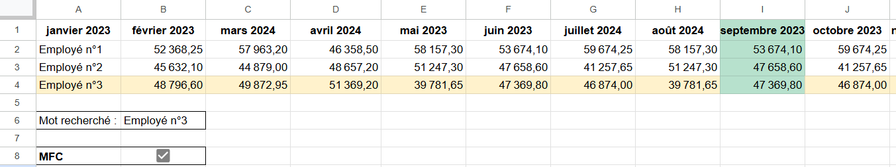



POK débutant : aucun prérequis



Ma **grande sœur illustratrice** s’est lancée il y a moins d'un an dans la vente de carte postale qu’elle dessine et vend à des librairies qui les revendent à des clients. Son talent en art est immense, mais ses connaissances en bureautique sont proches du néant. Or, elle doit gérer de nombreux intermédiaires, comptabiliser les stocks dans chaque librairie, suivre l’évolution de ses ventes et aimerait **savoir plus facilement quelles librairies sont les plus rentables**.
Ainsi je veux utiliser ce POK pour dans un premier temps mieux me former à la suite **Google Sheets** et améliorer les tableaux que je lui avais déjà créé il y a un an. Puis je compte apprendre **Google Apps Script** pour voir si je peux automatiser des fonctions grâce à cet outil (des envoies de mail automatiques par exemple).

## 📌Tâches

### 🏃‍➡️Sprints

Objectif général : **optimiser les tableaux de comptabilité** de ma soeur Laura.

#### Sprint 1

- [x] faire l'état de l’art de ce qui existe déjà MON, POK sur google sheets : 30 min (30 min)
- [x] suivre des tutos sur google sheets, consulter d’autres ressources et m’écrire une fiche récap des fonctionnalités : 5h30 (5h15)
- [x] récupérer les tableaux google sheets de Laura et établir un cahier des charges des améliorations à effectuer : 30 min (40 min)
- [x] améliorer les tableaux selon le CDC fixé : 2h (2h30)
- [x] envoiyer les tableaux et explications à Laura : pas estimé (30 min)
- [x] rédiger ce que j’ai fait et mettre en forme GitHub : 1h30 (2h)

#### Sprint 2

- [ ] faire l'état de l’art de ce qui existe déjà MON, POK sur google apps script : 15 min
- [ ] suivre des tutos sur google apps script, consulter d’autres ressources et m’écrire une fiche récap des fonctionnalités : 4h
- [ ] établir un cahier des charges des améliorations à effectuer : 30 min
- [ ] améliorer les tableaux selon le CDC fixé : 3h30
- [ ] envoyer les tableaux et explication à Laura : 15 min
- [ ] rédiger ce que j’ai fait et mettre en forme GitHub : 1h30

### ⌛Horodatage

| Date | Heures passées | Indications |
| -------- | -------- |-------- |
| Jeudi 12/09  | 3h30  | Etat de l'art ressources google sheets et début formation |
 Lundi 16/09  | 4h45  | Fin formation, récupération des tableaux de Laura, écriture CDC et début des amélioration des tableaux  |
 Mardi 17/09  | 1h40  | Finalisation des tableaux et envoie des tableaux et d'expication à Laura |
 Mercredi 18/09  | 1h30 | Mise au propre et rédaction sur Github |

## 1️⃣POK : sprint 1

### 📖Ressources déjà existantes

La plupart des MON sur les tableaux que j’ai trouvé parlent d’Excel or j’ai décidé de renforcer mes connaissances sur Google Sheets (abrégé GS dans la suite). En effet, je n’ai pas accès à la licence Excel qui est payante (mais que fait Centrale Med ?!) et je pars du principe que Excel et GS sont très proches donc que je pourrai facilement apprendre Excel en entreprise si on m’oblige à l’utiliser. L’important est donc de découvrir toutes les possibilités avec ces tableurs pour ensuite y penser facilement grâce à une **fiche récap de toutes les fonctionnalités pratiques**.



- Je suis tombée sur ce MON de Henri [Un peu d'Excel/Google Sheets pour mourir moins idiot](/promos/2023-2024/TAING-Henri/mon/temps-2-1/)
- 
- Dedans, il recommande la formation suivante [Sheets-Pratique.com](https://sheets-pratique.com/fr/cours) que j’ai donc décidé de suivre.



### 🎓Formation

Voici le [tableau d'entrainement](https://docs.google.com/spreadsheets/d/1gqWjpNlDxRKQS0zSzKrygT4uDm_xVV5DqzeDctvrYCQ/edit?usp=sharing) sur lequel j'ai effectué pleins d'exercices au cours de la formation. Il est partagé en mode lecteur donc vous ne pouvez pas le modifier.

Voici ci-dessous ma **fiche récap** de tout ce que j'ai appris ou mieux compris en suivant cette formation et en creusant ailleurs :

#### Fonctionnalités diverses

**Modifier toutes les largeurs de colonnes en même temps** : sélectionner toutes les colonnes avec le curseur ou touche ctrl enfoncée → modifier

**Collage spécial** : coller uniquement au choix valeur, formule, mise en forme conditionnelle…

**Masquer le quadrillage** : affichage → afficher → quadrillage

**Affichage date** : entrer une date 01/04/2024 puis format → nombre → date et heure personnalisée → choisir sa préférence ex : “lun. 1”

**Formes** : déformer forme d’un dessin avec petit losange jaune, déplacer des formes doucement avec Maj + flèches clavier

**Images** : possibilité d’insérer une image dans une cellule et plus de possibilité sur image si insérer à partir d’un dessin (recadrer selon une forme, pivoter etc)
**Word Art** : insertion → dessin → actions → word art

**Liste déroulante** : insertion → liste déroulante
**Données issue d'une liste déroulante définie** : créer la liste de choix possible → sélectionner la plage où il faudra entrer ces choix → données → validation des données → menu déroulant (depuis une plage) → sélectionner la plage des choix

**Historique des versions** : penser à nommer la version actuelle quand j’ai une version que j’aime et que je veux retrouver facilement plus tard

**Protéger des cellules** : données → protéger des feuilles et des plages → saisir la règle

#### Fonctions

[Récap fonctions qui existent](https://sheets-pratique.com/fr/fonctions).

[Générateur de formule pour extraire des données](https://sheets-pratique.com/fr/utilitaires/formule-extraction).

**Utiliser fonction** : chercher une fonction avec bouton ∑ dans la barre d’outil OU insertion → fonction
**Plus d'infos sur les fonctions** : ? en haut à côté de la formule, encore plus de détail possibles

**Fixer une référence dans une formule** : ajouter des $ à la référence.
Ex : $B$8, le 1er $ fixe la colonne lors de la recopie et le 2ème $ fixe la ligne

**Nommer une plage** : sélectionner la plage → la nommer (pratique pour les formules)

**Fonction SI** : SI(expression logique; valeur si true; valeur si false) → ex : renvoie oui si majeur
Ex : =SI(A2>17;"oui";"non") 

**Imbrication de fonction SI** : ex : choix entre 3 tarifs notés en E1, E2 et E3 selon 3 âges
=SI(A2>17;SI(A2>64;$E$3;$E$2);$E$1) → d’abord on voit si il est adulte, si oui on voit si il est retraité et on affiche le bon tarif figé avec les $

**Fonction ET** : ET(test 1; test 2; ...) → renvoie VRAI si tous les tests sont VRAI. Ex : pour vérifier si qqn a entre 18 et 64 ans
=SI(ET(B2>=18;B2<65);"Oui";"Non") 

**Fonction OU** : =OU(test 1; test 2; ...) → renvoie VRAI si au moins un des tests est VRAI

**Fonction RECHERCHEV** : permet d’envoyer automatiquement une valeur selon une autre valeur liée (par exemple le nom d’une ville selon une boutique)
Combiner avec la **fonction SIERREUR** pour ne pas renvoyer le msg d’erreur si pas de donnée
Ex : =SIERREUR(RECHERCHEV(B5;Stock!$A$2:$B$10;2;0);"-")

#### Graphiques

**Graphique** : sélectionner la plage de données → insertion → graphique (si données pas dans le bon sens, cliquer sur "intervertir ligne et colonne")

**Graphique sparkline** : graphique miniature inséré directement dans une cellule
Ex : =SPARKLINE(B2:G2)

#### Mise en forme conditionnelle (MFC)

**MFC** : sélectionner données → format → mise en forme conditionnelle

**Colorier la colonne du mois actuel** : = MOIS(A$1) = MOIS(AUJOURDHUI())
Mise en forme conditionnelle → la formule personnalisée est → 
Bien vérifier que la date est rentrée au format date quitte à modifier son affichage

**Surligner une ligne selon valeur case** : =$A1=$B$6
Mise en forme conditionnelle → la formule personnalisée est → 
Ex : ici c’est la cellule B6 qui contient le mot recherché

**Case à cocher pour choisir d’appliquer la MFC** : modifier la formule de la MFC pour marquer =ET(condition;case figée)
Ex dans le cas ci-dessus : =ET(MOIS(A$1) = MOIS(AUJOURDHUI());$B$8) car la case à cocher est en B8

**Colorer les doublons d’une plage avec MFC** : ajouter MFC et formule personnalisé =NB.SI(plage figée;A2)>1      A2 = cellule en haut à gauche de la plage
Ex : =NB.SI($C$2:$C$19;A2)>1

#### Trier des données

**Trier données selon plusieurs colonnes** : Tout sélectionner → Données → Trier une plage → Options avancées de tri des plages
Aussi la possibilité d’utiliser la fonction SORT

**Filtre** : données → créer un filtre

**Vue filtrée** : Données → Vue filtrée → Créer une vue filtrée (dispo aussi barre d’outils)
Permet aux lecteurs de pouvoir changer de vue pour visualiser les données de manière différente ( ≠ filtre où l'affichage est figé pour les utilisateurs en lecture seule) et permet créer plusieurs vues différentes et de les nommer

**Validation de données** type mail, nombre, date, formule etc : données → validation des données → choisir le critère et le type de msg d’erreur (ex : texte d’une adresse e-mail valide)

#### Tableau croisé dynamique

**TCD** : sélectionner les données avec les en-têtes → insertion → TCD → insérer dans une nouvelle feuille → rentrer les bons paramètres dans l’éditeur de TCD
Ex : ajouter la ligne “produit” → ajouter la ligne “provenance” → ajouter la valeur “nombre d’unités achetées” → ajouter la valeur “prix par unité” et modifier sa fonction en “average” pour avoir la moyenne et non la somme par défaut

### 💡Cahier des charges des améliorations des tableaux de Laura

Maintenant que je suis bien plus à l'aise avec GS, je récupère les tableaux de comptabilité de Laura. Je lui avais créé le tableau [calendrier et compta ancien](https://docs.google.com/spreadsheets/d/1DkWvw-FkCZZZqjcyfCk64FEBDqxFVWs1153f-OzHmgE/edit?gid=957877577#gid=957877577) un an plus tôt et elle l'a un peu modifié entre temps. Vous pouvez voir la version qu'elle utilisait en allant sur la feuille "**Ancien calendrier compta 2024**".

Ensuite, Laura a de son côté créé le deuxième tableau [suivi des factures ancien](https://docs.google.com/spreadsheets/d/1RZB_4vyWY-2KVkbhKPkIwlEmPMH9DsRkCuLGLq1DHOk/edit?gid=653861341#gid=653861341). Là encore, l'ancienne version est visible en cliquant sur la feuille "**Ancien 2024**".

Je vais donc lister toutes les **améliorations possibles de ces 2 tableaux**.

#### Idées tableau suivi des factures

1. **Date** : proposer automatiquement la date du jour et la choisir sur un calendrier au lieu de la rentrer manuellement.
2. **Client** : choisir la librairie concernée par la facture dans une liste de toutes les librairies pour ne pas avoir à rentrer le nom manuellement et faciliter l'exploitation des données (pas d'erreur de nom).
3. **Adresse** : remplir automatiquement la ville selon le nom du client (chaque librairie est dans une ville connue).
4. **Produit facturés** : remplacer la saisie sous forme de texte par 3 colonnes et avoir les totaux de chaque produit à la fin.
5. **Bilan des factures par librairie** : créer un TCD qui permet de voir sur l’année les ventes par ville et par librairie.

#### Idées tableau calendrier et compta

1. **Mail** : ajouter la vérification de mail automatique.
2. **Graphique sparkline** : ajouter un graphique pour chaque librairie pour voir l'évolution des ventes au fil des mois.
3. **Feuille graphique** : déplacer les graphiques sur une nouvelle feuille pour plus de lisibilité car ils sont actuellement dessous le calendrier de la feuille "ancien calendrier compta 2024".

### ✅Améliorations effectuées selon le CDC

#### Amélioration tableau suivi des factures

Vous pouvez accéder aux modifications effectuées en cliquant sur le tableau [suivi des factures nouveau](https://docs.google.com/spreadsheets/d/1RZB_4vyWY-2KVkbhKPkIwlEmPMH9DsRkCuLGLq1DHOk/edit?gid=2019233211#gid=2019233211) sur les feuilles "**Modifié 2024**" et "**Créé bilan 2024**".

1. **Date** : je remarque que ma soeur a mis volontairement les dates à l’envers (mois/jour/année), je dois voir avec elle pourquoi car ça perturbe google sheet. En attendant, je ne préfère par modifier cette partie là.
2. **Client** : je créé un tableau récapitulant les clients et les villes des librairies juste à côté du tableau des factures. Puis j'insère dans la colonne "client" une liste à partir de la plage de données créée pour permettre de choisir la librairie parmis la liste quand on ajoute une ligne de facturation.
3. **Adresse** : grace au tableau intermédiaire contenant le nom des librairies et leur ville ainsi, j'utilise la formule =SIERREUR(RECHERCHEV(C3;$J$3:$K$101;2;0);" ") et le tour est joué !
4. **Produit facturés** : je créé rapidement 3 colonnes et une ligne des totaux avec la fonction SOMME.
5. **Bilan des factures par librairie** : je créé un TCD sur une nouvelle feuille que je nomme "Créé bilan 2024".

#### Amélioration tableau calendrier et compta

Vous pouvez accéder aux modifications effectuées en cliquant sur le tableau [calendrier et compta nouveau](https://docs.google.com/spreadsheets/d/1DkWvw-FkCZZZqjcyfCk64FEBDqxFVWs1153f-OzHmgE/edit?gid=1842762687#gid=1842762687) sur les feuilles "**Modifié calendrier compta 2024**" et "**Créé graphique 2024**".

1. **Mail** : j'ajoute facilement la vérification de mail automatique grace à la validation de données (voir formation).
2. **Graphique sparkline** : en regardant plus précisément le tableau de Laura, je réalise que ces graphiques n’auraient pas d’intérêt car elle reçoit les virements à des moments variées et non tous les mois.
3. **Feuille graphique** : je déplace facilement les graphiques sur une nouvelle feuille que je nomme "Créé graphique 2024".

### 👍Retours de Laura

Elle est **très contente** de ces améliorations et a **immédiatement adopté cette nouvelle version**. Elle aussi regrette l'affichage du TCD dans la feuille "créé bilan 2024" car elle le trouve pas instinctif (on voit mal les séparations entre les villes) mais c'est un modèle imposé par GS donc je ne peux pas améliorer ce point là.

## 2️⃣POK : sprint 2
