

POK débutant : aucun prérequi




- [MON de Mathis Schultz sur la Business Intelligence](/promos/2023-2024/Mathis%20Schultz/mon/temps-2.2/)
- [MON de Lola Bourdon sur Power BI et Excel pour l'analyse de données](/promos/2023-2024/Lola-Bourdon/mon/temps-2.2)
- [MON de Sarah Sebastien sur My Google Health Assistant](/promos/2023-2024/Sarah-Sebastien/pok/temps-3/)
- [MON de Lola Perdix sur le Data Storytelling](/promos/2024-2025/Lola-Perdrix/mon/temps-1.1/)
- [Vidéo youtube "Looker Studio : Créer Un Tableau de bord Étape Par Étape (ex DATA STUDIO)"](https://www.youtube.com/watch?v=BVBvo9eKK40) consultée le 13/11/24
- [Clé d'activation suite Excel](https://www.cdiscount.com/informatique/logiciels-a-telecharger/microsoft-office-2019-professionnel-plus-32-64-bit/f-10776-auc2008476306891.html?fbclid=IwZXh0bgNhZW0CMTEAAR1kMKsmY04SzI5WHVCoektfvYZ88ODzqjZxbCL6hY0K_Yf-amKgR3ppcFg_aem_3RXFrb1dbSAftki-XwPRcw)
- [Vidéo Youtube "Power BI : Le Guide Ultime | Tutoriel complet pour débutants"](https://www.youtube.com/watch?v=7WACJemR3ck) consultée le 18/11/24



## 📌Tâches


### 🏃‍➡️Sprints

Objectif général : **apprendre l'art de la data visualisation** et plus précisement maitriser les logiciels **Looker Studio** et **Power BI**.

#### Sprint 1

- [x] mieux comprendre ce qu'est la data visualisation et les bons principes : 1h30 (1h)
- [x] suivre un tuto sur looker studio et explorer le logiciel : 1h30 (1h30)
- [x] lister les données que je veux mettre en forme pour ma soeur, réfléchir au visuel : 30 min (20 min)
- [x] préparer les tableaux avec les données qui seront représentés : 45 min (30 min)
- [x] mettre en forme visuelle les données du tableau : 1h30 (1h50)
- [ ] ~~envoyer le résultat à ma soeur et lui expliquer comment bien se l'approprier : 15 min~~
- [x] téléchargement et prise en main Excel + Power BI : pas prévu (2h)
- [x] projet tableau de bord pour ma soeur sur Power BI : pas prévu (2h)
- [x] finalisation rédaction POK : pas prévu (0h50)
- [ ] ~~faire un tableau de bord de mes voyages : 4h~~

**Total d'heures sprint 1 : 10h**    
**Etude post mortem** : j'ai clairement sous estimé la phase de planification de ce premier sprint car j'ai énormément changé ma to do list en cours de route. Je ne pensais pas que Looker Studio serait aussi peu pratique et donc que j'allais aller aussi vite sur Power BI. Je me suis aussi retrouvé à devoir beaucoup travailler lundi 18/11 et ce n'était pas forcément très efficace d'enchaîner autant d'heures.

#### Sprint 2

- [x] réfléchir aux indicateurs que je veux pour le tableau de bord de mes voyages : 1h (30 min)
- [x] créer une base de données adéquate de mes voyages sur Excel : 2h (1h30)
- [x] utiliser Power BI pour créer le tableau de bord souhaité : 3h (1h)
- [ ] trouver un autre petit projet à réaliser et le faire (concert artiste?): 4h

**Total d'heures sprint 2 : ?h**   
**Etude post mortem** :

### ⌛Horodatage

| Date | Heures passées | Indications |
| -------- | -------- |-------- |
| **Sprint 1**
Mardi 12/11  | 1h  | Compréhension de ce qu'est la Data visualisation |
Mercredi 13/11 |0h30  | Début tuto logiciel Looker Studio  |
Vendredi 15/11 |1h40  | Suite tuto logiciel Looker Studio et début du travail sur le tableau pour ma soeur  |
Lundi 18/11 |2h  | Fin du travail sur Looker Studio, critique et recherche de solution  |
Lundi 18/11 |2h  | Téléchargement Excel et tuto + téléchargement Power BI  |
Lundi 18/11 |2h  | Projet tableau de bord pour ma soeur sur Power BI  |
Lundi 18/11 |0h50  | Finalisation rédaction POK |

| **Sprint 2**
Samedi 23/11  | 3h30  | Réflexion indicateur tableau, création tableau et création rapport Power BI |
Dimanche 24/11  | ?  | Power BI |



## Sommaire

- [POK : sprint 1](#POK1)
- [POK : sprint 2](#POK2)
- [Conclusion de ce POK 2](#conclusion)

<h2 id=POK1> 1️⃣POK : sprint 1</h2>

### 📖Ressources déjà existantes

J'ai d'abord regardé différents MON qui traitent de la data visualisation.

- MON de Mathis Schultz sur la [Business Intelligence](/promos/2023-2024/Mathis%20Schultz/mon/temps-2.2/) : il explique ce qu'est le data visualisation et la BI et utilise le logiciel Power BI.  
- MON de Lola Bourdon sur [Power BI et Excel pour l'analyse de données](/promos/2023-2024/Lola-Bourdon/mon/temps-2.2): elle aussi utilise Power BI.
- MON de Sarah Sebastien sur [My Google Health Assistant](/promos/2023-2024/Sarah-Sebastien/pok/temps-3/) : elle utilise Looker Studio, le Power BI de google que je compte utiliser et recommande cette [vidéo youtube](https://www.youtube.com/watch?v=BVBvo9eKK40).  
- MON de Lola Perdix sur le [Data Storytelling](/promos/2024-2025/Lola-Perdrix/mon/temps-1.1/) : elle y explique les différentes techniques de storytelling appliquées aux données

J'ai aussi regardé de mon côté des ressourcespour mieux comprendre la **Dataviz**. Concrètement, celà consiste à **transformer des données brutes en représentations visuelles souvent interactives**. Ce format permet une meilleure compréhension des données et donc une prise de décision simplifiée.

### 👨‍🏫Tuto Looker Studio

J'ai suivi la [vidéo youtube](https://www.youtube.com/watch?v=BVBvo9eKK40) recommandée par Sarah, ce qui m'a permis de travailler sur le tableau de données assez indigeste ci-dessous.

Et d'utiliser Looker Studio pour **transformer ces données en le tableau de bord** ci-dessous. On voit que **tout est dynamique** et donc on peut passer du tableau original à gauche à un tableau où on étudie les chiffres plus en détail à droite (ici j'ai sélectionné le pays Italy et décoché la case tapis).

    
    

### 👩‍🎨Création du tableau de bord des ventes de ma soeur artiste

Liste des données à faire apparaître dans ce tableau de bord : 

- selectionneur de période (mois en cours, année etc)
- selectionneur de villes : toulouse, lyon, marseille etc
- type de produits : carte postale, fable, maison
- graphique à barre par quantité de produit
- graphique diagramme circulaire proportion CA par produit
- tableau récap : ville, CA
- carte de la france avec les villes et ronds proportionnels au CA

Maintenant, il y a plus qu'à ! 

J'ai d'abord récupéré le **tableau de suivi de ses factures** disponible en version lecteur [ici](https://docs.google.com/spreadsheets/d/17s4f0-hIdjs3qSpmg4praJ_pb0rtDBW0TaRWw9w2mg4/edit?gid=2019233211#gid=2019233211). Puis, j'ai commencé à créer le tableau de bord. Pour répondre aux contraintes de Looker Studio, j'ai **modifié un peu les tableaux de ma soeur**. Notamment, j'ai changé les titres des colonnes pour faciliter l'accès aux données. 
J'ai obtenu le **résultat** ci-dessous :

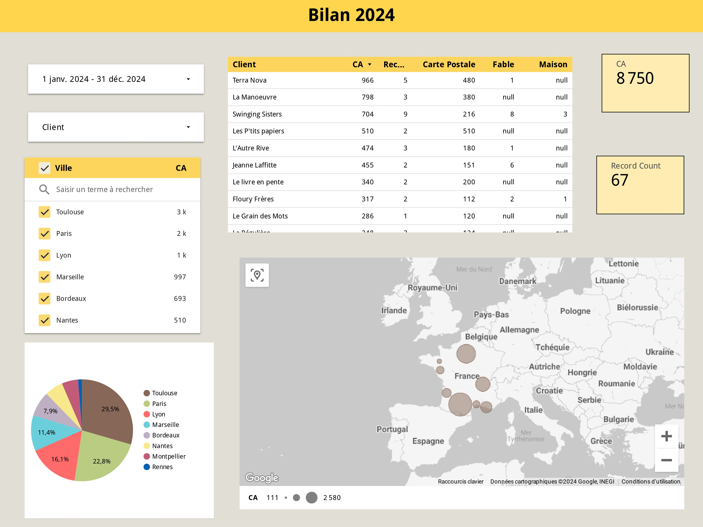

Comme vous pouvez le voir, **le résultat n'est pas celui que j'avais en tête** car j'ai constaté les **limites de Looker Studio** et les **problèmes du tableau de ma soeur**. 

1. Tout d'abord, je n'avais pas de moyen simple de récupérer les informations sur la quantité de cartes postales, affiches fable et affiches maison vendues. En effet, contrairement à l'exemple du tutoriel où 1 ligne correspond à 1 vente et donc à **1 produit**, ma soeur utilise un système où **1 ligne correspond à une facture d'1 librairie mais avec plusieurs produits** (voir le screen ci-dessous). Ainsi, le CA indiqué pour cette vente correspond à la somme des CA pour les différents produits et je ne peux donc **pas accéder au CA précis pour chaque produit**. De plus, vu que les types de **produits sont dans des colonnes différentes** et non dans une même colonne, je ne peux pas faire facilement de somme sur les types de produit et obtenir des graphiques par quantité de produits.

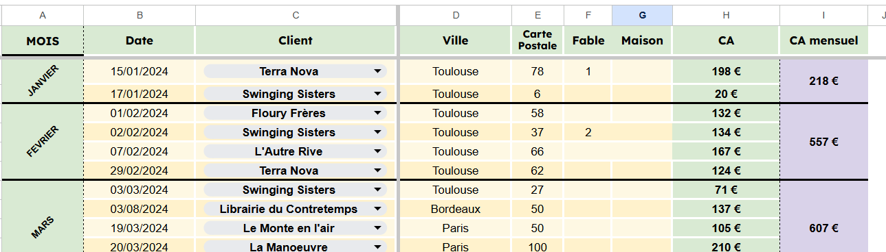

2. Ensuite, la carte de France avec des ronds proportionnels au CA de chaque ville est assez décevante. Elle bug, impossible de faire un zoom intermédiaire sinon les ronds disparaissent et je ne peux pas afficher le CA dans le rond. D'ailleurs, le graphique nommé "graphique géographique" ne fonctionne même pas car ma liste de ville ne correspond pas à une liste de pays et l'option villes n'existe que pour les Etats-Unis. Bref, les **graphiques géographiques sont décevants**.
3. Enfin, le **niveau de personnalisation esthétique est faible**. Je ne peux pas modifier les titres tels que "record count" ou "null" au lieu de "0" dans certains tableaux ce qui les rend peu intuitifs.

Ainsi, j'ai été plutôt **décue des fonctionnalités sur Looker Studio** et je compte donc regarder directement le logiciel **PowerBI** proposé par Microsoft pour comparer.

### 📈Power BI

Contrairement à Looker Studio proposé par Google, Power BI est un logiciel proposé par Microsoft. Or je ne possède pas la suite Microsoft car elle est payante et Centrale n'a visiblement pas trouvé le budget de nous l'offrir... Ainsi j'ai trouvé un moyen de télécharger une **version de Microsoft beaucoup moins chère que l'abonnement officiel** en commandant une [clé d'activation](https://www.cdiscount.com/informatique/logiciels-a-telecharger/microsoft-office-2019-professionnel-plus-32-64-bit/f-10776-auc2008476306891.html?fbclid=IwZXh0bgNhZW0CMTEAAR1kMKsmY04SzI5WHVCoektfvYZ88ODzqjZxbCL6hY0K_Yf-amKgR3ppcFg_aem_3RXFrb1dbSAftki-XwPRcw). Je peux attester personnellement que ce lien fonctionne, car j'ai enfin Excel, Word et Power Point sur mon ordinateur !

Après quelques recherches, je conclus d'essayer la **version gratuite de Power BI Desktop** pour ce travail. En effet, la version gratuite permet de créer de bons visuels, par contre on ne peut pas les partager avec d'autres utilisateurs comme dans la version pro. J'ai commencé par visionner cette [vidéo youtube](https://youtu.be/7WACJemR3ck?si=ctCiS3ExZGLa6LLq) que je trouve très claire. Elle résume ce qu'est Power BI et montre les possibilités avec ce logiciel. Ainsi, je vais essayer de recréer le tableau de bord pour le tableau de ma soeur sur Power BI. J'ai ainsi transformé le google sheet en Excel sur mon ordinateur.

J'ai d'abord **importé les données** sur Power BI Desktop en ouvrant l'Excel de ma soeur. Je remarque directement que la suite **Power BI propose automatiquement des tableaux pertinents** ("tables sugérés") pour le traitement des données donc il n'y a pas besoin de soi-même refaire autant de mise en forme qu'avec Looker Studio. Dans mon cas, j'ai par exemple choisi le table "MOIS" qui correspondait bien à mon usage.

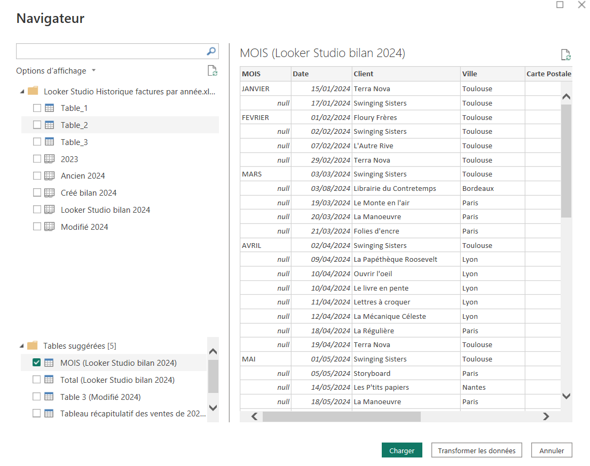

Ensuite, j'ai **nettoyé mes données avec Power Query** (rien besoin de télécharger, Power Query est sugéré automatiquement). Là encore, le logiciel est bien conçu et il est simple de remplacer la valeur "null" par 0 par exemple.

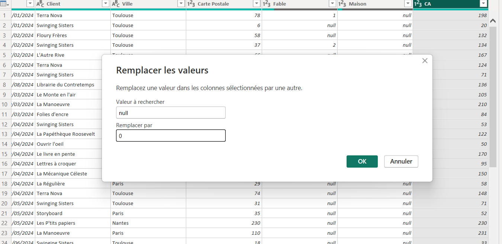

Puis, j'ai travaillé sur le tableau de bord jusqu'à obtenir ce résultat dont je suis plutôt satisfaite : 

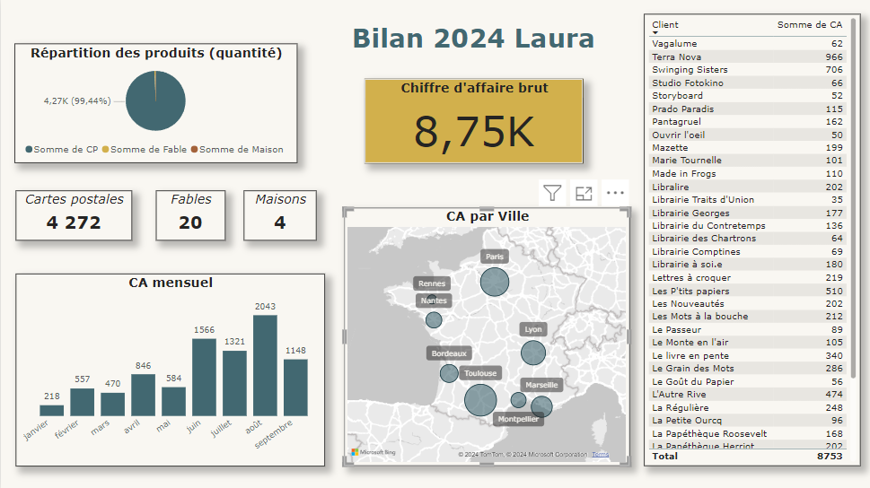

Il s'agit d'un **tableau de bord interactif** donc on peut cliquer directement sur les graphiques pour voir les données qui nous intéressent. Par exemple, voici 3 tableaux de bords selon si on sélectionne : 

- ville = Paris
- mois = juin
- client = Terra Nova

    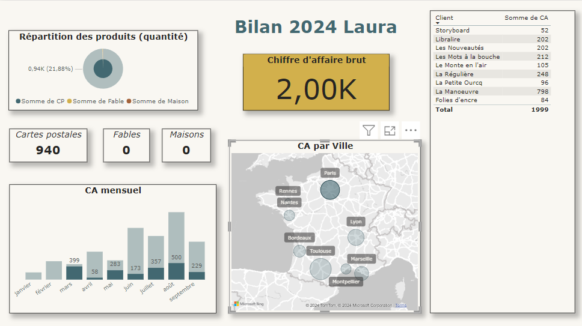
    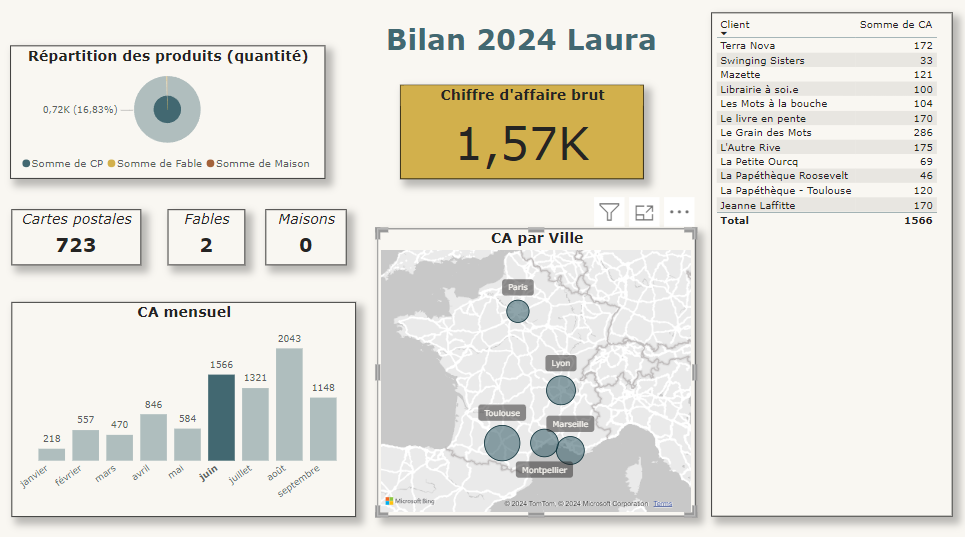

  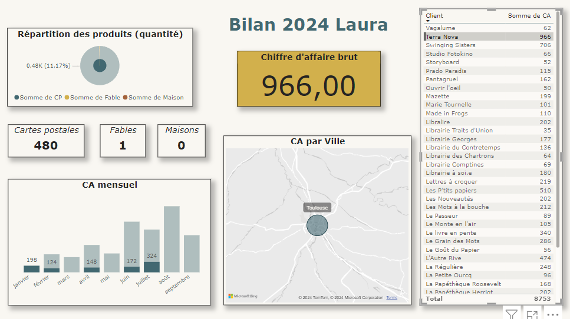

Ainsi, je suis largement convaincue par la **supériorité de PowerBI version gratuite sur Looker Studio quand on veut juste créer des projets pour soi** sans l'intention de les partager à d'autres utilisateur. De plus, **Power Bi est aussi plus souvent utilisé que Looker Studio par les entreprises**, donc je trouve ça plus pertinent de me former à ce logiciel. Ainsi, je ne vais utiliser que Power BI pour le deuxième sprint.

<h2 id=POK2> 2️⃣POK : sprint 2</h2>

### 📈 Choix indicateurs voyages

Avant de créer le tableau Excel de mes voyages à l'étranger, je dois réfléchir à quelles données je veux afficher dans mon tableau de bord pour bien concevoir le tableau.

Le tableau de bord comportera 2 pages : 

1. Voyages à l'étranger en Europe
2. Focus sur le tour du monde en césure

Pour chaque pays lors d'un voyage je vais noter les données suivantes : 

- dates de début et de fin
- durée (calculée avec les dates)
- pays dans une liste déroulante
- villes marquées en français, séparées par une virgule
- contexte : famille / papa / amis / scolaire / Erasmus

Données que je veux dans le tableau de bord :

- Nombre de pays que j'ai visité (au moins 1 nuit sur place)
- Nombre de villes que j'ai visité (au moins 1/2 journée)
- Nombre de jour de voyages
- Diagramme camembert : répartition avec qui j'étais
- Diagramme bâtons : jour de voyage par année
- Diagramme : jour de voyage par pays
- Tableau détail voyage
- Carte de l'Europe avec les pays visités (et villes ?)
- Carte du monde avec les pays visités (et villes ?)

Interaction entre les éléments pour voir facilement les voyages dans un pays, pendant une année ou le contexte.  
Il faut que je trouve un moyen pour représenter différement l'Autriche et la Nouvelle-Zélande qui sont des cas différents (j'ai vécu plusieurs semaines ou mois là bas)

### 🖼️ Création de l'Excel

J'ai commencé par créer un tableau sur Excel avec les données sur mes voyages :

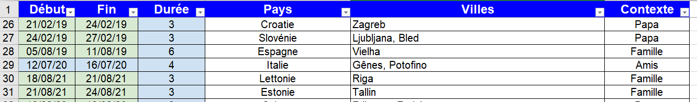

Puis j'ai créé le **tableau de bord** sur Power BI. Le voici sans filtre :

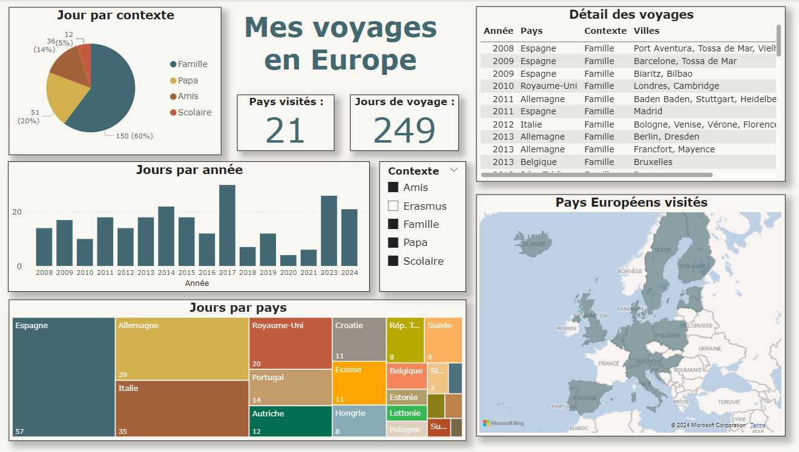

Et voici cee tableau de bord en sélectionnant l'**Allemagne** ou les **voyages avec mes amis** : 

    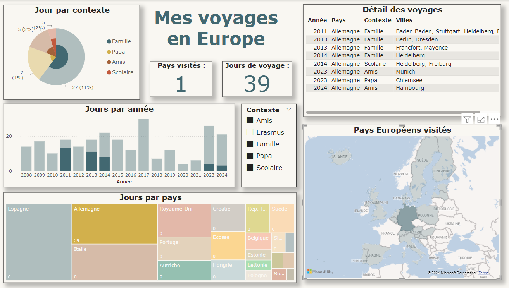
    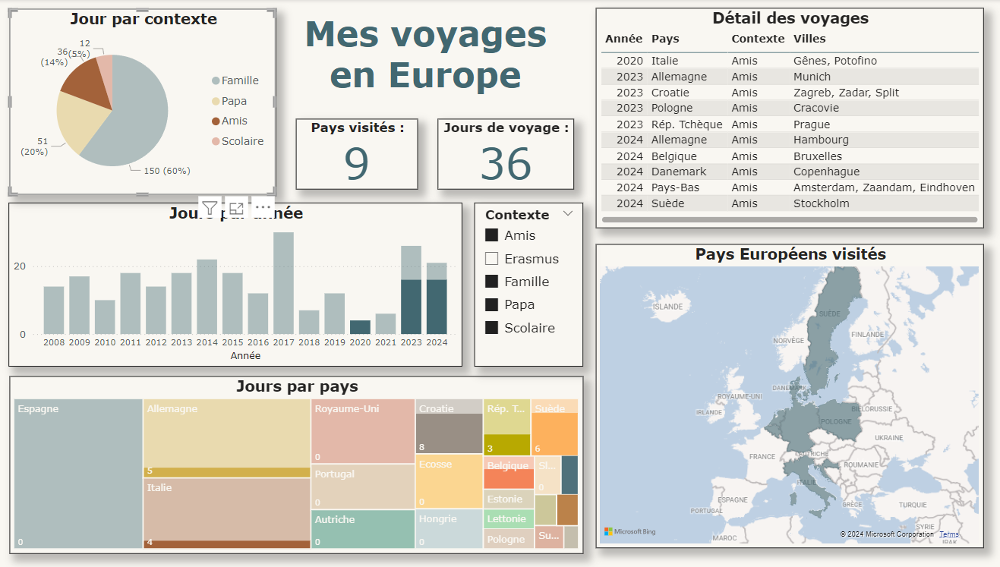

Et voici une **vidéo montrant les interactions directement sur le logiciel Power BI** : 

    <video width="640" height="360" controls>
        <source src="Demo_Voyages_PowerBI.webm" type="video/webm">
        Votre navigateur ne prend pas en charge la balise vidéo.
    </video>

<h2 id=conclusion> 👍 Conclusion de ce POK 2</h2>
