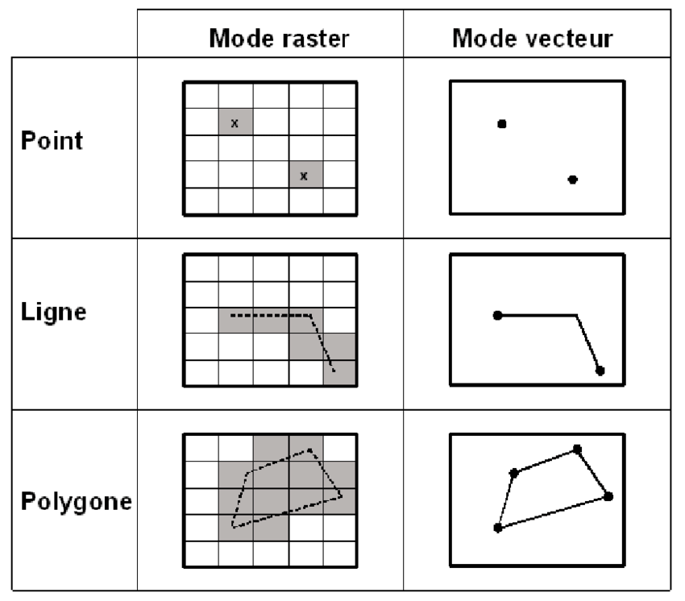
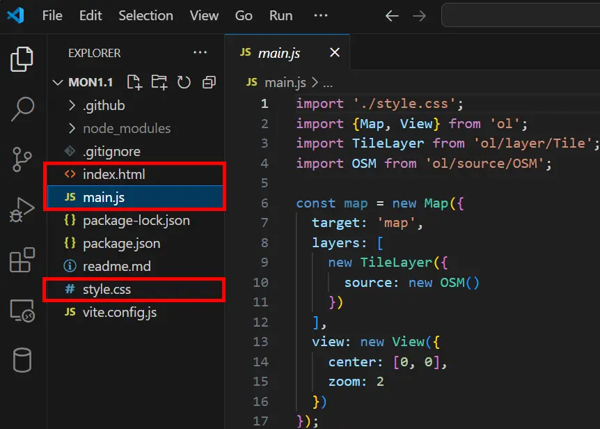
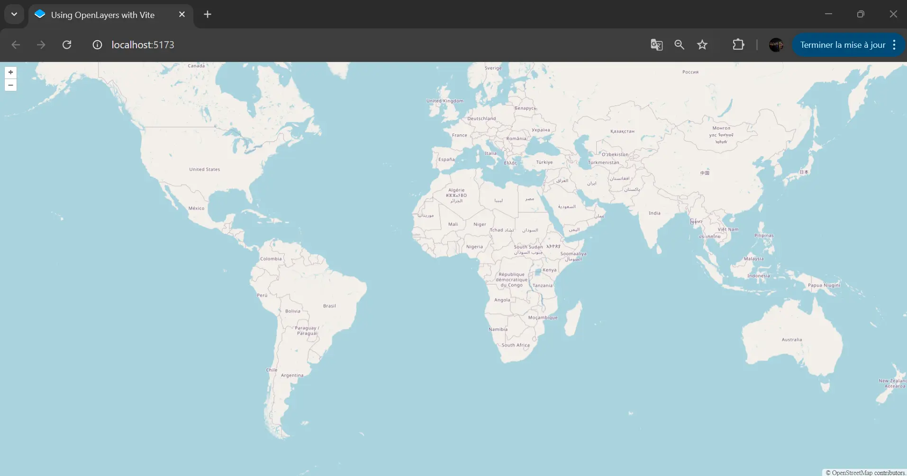
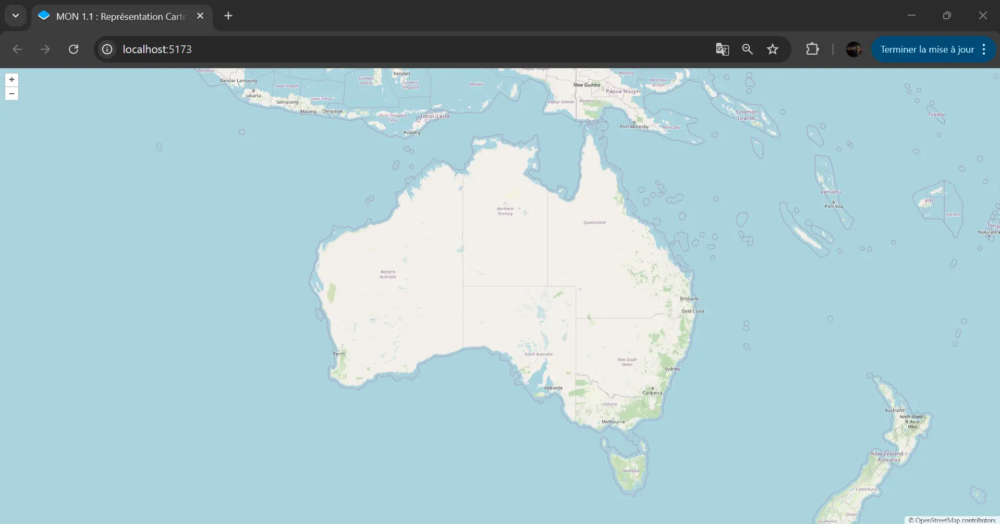
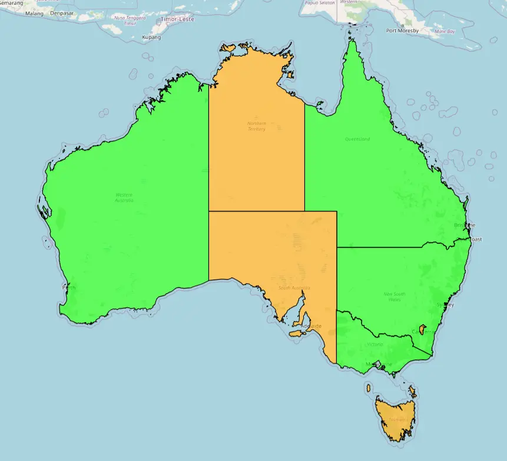
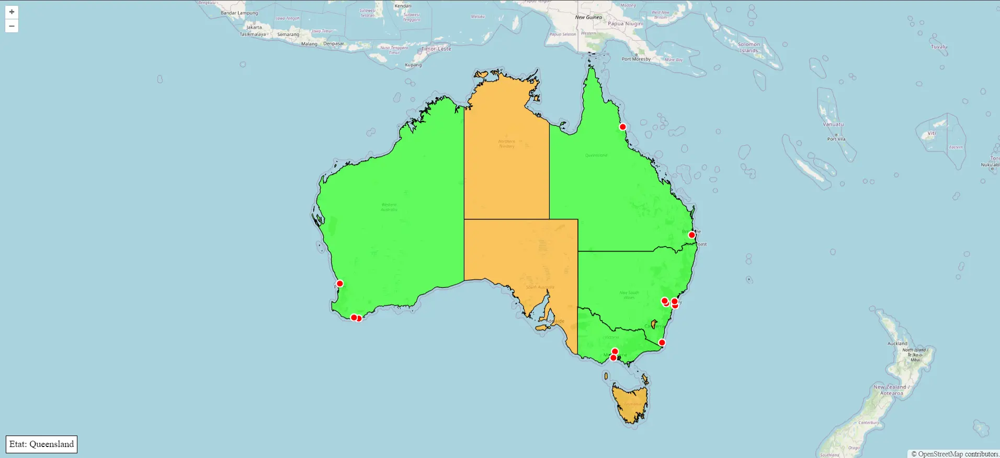
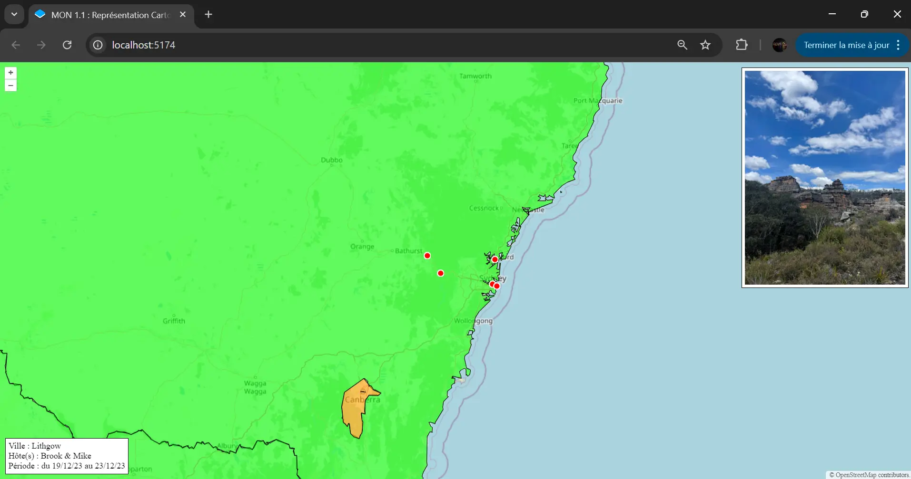



Quelques prérequis en Html, CSS et JavaScript sont nécessaires pour la réalisation de ce MON.




- [Site d'OpenLayers](https://openlayers.org/)
- [Mon projet Github](https://github.com/TitouanCorne/MON1.1)



## Table des matières

1. [Introduction](#section1)
2. [OpenLayers, qu'est-ce que c'est ?](#section2)
3. [Vocabulaire du SIG](#section3)
4. [Mise en route](#section4)
5. [Prise en main d'OpenLayers](#section5)

## 1. Introduction <a id="section1"></a>

Durant mon stage de césure j'aurais aimé apprendre à intégrer une couche SIG dans mon application web. Mais par faute de temps, je n'ai pas eu la chance de pouvoir vraiment m'y intéresser. C'est pourquoi j'ai décidé de consacré ce premier MON à la représentation cartographique Web pour acquérir les bases. L'objectif du MON étant de réaliser une petite architecture web en y intégrant un fond de carte en utilisant OpenLayers.

## 2. OpenLayers, qu'est-ce que c'est ? <a id="section2"></a>

OpenLayers est une API JavaScript Open Source (gratuite) qui permet de représenter facilement des données géographiques sur une page Web.

Une simple connaissance des bases en Html, CSS et JavaScript est nécessaire pour s'approprier et utiliser OpenLayers. Les tutoriels fournis sur leur [site internet](https://openlayers.org/) sont accessibles et permettent de commencer rapidement à jouer avec des fonds de cartes et autres données géographiques.

## 3. Vocabulaire du SIG à connaître <a id="section3"></a>

Pour représenter une carte intéractive, il faut comprendre le système de couches. Par exemple, il y a une première couche qui consiste à afficher un fond de carte, puis on peut par exemple ajouter une couche représentant les capitales de chaque pays repésentées par un point.
Il existe quatre différents types de couches :

- **Les couches de tuiles ('Tile') :** elles  affichent des images prédécoupées organisées en grilles à différents niveaux de zoom. Ces images sont généralement extraites d'un serveur sous forme de tuiles pour chaque niveau de zoom. Le serveur de tuiles fournit ces images en fonction de la zone géographique et du niveau de zoom demandé par le client. Ces couches de tuiles sont souvent utilisées pour afficher des fonds de carte basiques. Pour ma part j'ai utilisé le service OpenStreetMap (parfois abrégé en OSM) pour avoir un fond de carte.
- **Les couches d'images ('Image') :** elles affichent des images non découpées qui peuvent être rendues à des résolutions et des étendues arbitraires. Elles sont moins efficaces en termes de performance que les couches de tuiles, mais peuvent être utiles pour des images ou des cartes spécifiques non découpées. On les utilise principalement lorsqu'on a affaire à une carte spécifique à une certaine échelle ou une image géoréférencée (par exemple une photo aérienne des îles du Frioul). Pour ma part je n'en ai pas utilisées dans ce MON.
- **Les couches vectorielles ('Vector') :** elles affichent les données géographiques sous forme de vecteur. Un vecteur peut être de trois natures différentes : il peut s'agir d'un point (ex : représenter une ville), d'une ligne (ex : représenter un cours d'eau) ou d'un polygone (ex : repésenter une région).
- **Les couches de tuiles vectorielles ('VectorTile') :** comme leur nom l'indique, elles affichent des données vectorielles fournies sous forme de tuiles. Cela permet de gérer de grandes quantités de données vectorielles de manière plus efficace, en les découpant en petites tuiles que la carte charge dynamiquement selon le zoom et la position géographique.

Un **raster** est un format de données géographiques qui représente l'espace sous forme de grille de cellules (ou pixels), où chaque cellule a une valeur spécifique.

 *Représentation des points, lignes et polygones en modes Raster et Vecteur. Source (Chakhar, 2006). Disponible sur [researchgate.net](https://www.researchgate.net/figure/Representation-des-points-lignes-et-polygones-en-modes-Raster-et-Vecteur-Source_fig1_315837966)*

## 4. Mise en route <a id="section4"></a>

En suivant le tutoriel *["Quick Start"](https://openlayers.org/doc/quickstart.html)* pour l'initialisation rapide d'un projet, on arrive rapidement à afficher un fond de carte OpenStreetMap. Les trois petites lignes de commande utilisées sont les suivantes :

`npm create ol-app my-app` pour créer un projet avec l'architecture adaptée à OpenLayers

`cd my-app` pour rentrer dans le dossier du projet

`npm start` pour lancer le projet.

 *Capture d'écran personnelle (2024)*

Les trois fichiers qui vont nous intéresser pour la suite sont index.html, style.css et surtout main.js.

A ce stade lorsqu'on lance le projet (`npm start`), un serveur local se lance et la page web suivante apparaît :

 *Capture d'écran personnelle (2024)*

Nous voilà maintenant avec un fond de carte. On peut facilement depuis le javascript ajuster le centre de la carte, et le zoom.

## 5. Prise en main d'OpenLayers <a id="section5"></a>

A présent pour prendre en main OpenLayers, j'ai décidé de "jouer" avec les différentes fonctionnalités proposées en personnalisant la carte et les vecteurs que je souhaite représenter. J'ai ainsi décidé de représenter l'Australie, et d'ajouter quelques vecteurs qui retracent le voyage que j'ai pu réaliser en césure.

Tout d'abord, j'ai centré la carte sur l'Australie et j'ai ajusté le zoom pour avoir une vision du pays entier.

 *Capture d'écran personnelle (2024)*

Pour réaliser cela, il a fallu que je m'intéresse au système de projection. Le fond de carte OSM est en projection Mercator Web (EPSG:3857) qui est la projection standard utilisée pour la cartographie web. C'est cette projection que Google Maps a adopté à partir de 2005. D'autres systèmes de projections peuvent être utilisés en SIG. Pour ma part je me suis également servi le système EPSG:4326, également connu sous le nom de WGS84, qui est un système de coordonnées utilisé dans les systèmes Google Earth et GPS. En effet, il m'a été plus facile de trouver les coordonnées GPS (longitude, latitude) des différentes villes australiennes que j'ai dans un second temps converties en coordonnées Web Mercator.

Pour transformer les coordonnées du centre de l'Australie de la projection EPSG:3857 à la projection EPSG:4326, j'ai utilisé *Proj4* et *fromLonLat*. *Proj4* est une bibliothèque JavaScript utilisée pour la conversion entre différents systèmes de projection cartographique. Elle permet de transformer des coordonnées d'une projection à une autre. *fromLonLat* est une fonction fournie par OpenLayers qui facilite la conversion de coordonnées géographiques (exprimée en longitude et latitude dans le système EPSG:4326) en coordonnées projetées dans le système EPSG:3857.

``` javascript
import proj4 from 'proj4'; //pour convertir les coordonnées d'une projection à une autre
import {fromLonLat} from 'ol/proj';

// Initialise la projection EPSG:4326 (pour longitude et latitude exprimées en °)
proj4.defs("EPSG:4326", "+proj=longlat +datum=WGS84 +no_defs");
proj4.defs("EPSG:3857", "+proj=merc +lon_0=0 +k=1 +x_0=0 +y_0=0 +datum=WGS84 +units=m +no_defs");

// Coordonnées de l'Autralie en EPSG:4326 (longitude latitude)
const australieCoordonnees = [133, -27]; // [longitude, latitude]

const australieCoordonnees3857 = fromLonLat(australieCoordonnees);
```

Ensuite, j'ai voulu ajouter une couche vectorielle sur mon fond de carte. J'ai alors décidé d'utiliser des polygones pour représenter les différents états australiens. J'ai trouvé ces données sous la forme d'un fichier GeoJson sur ce repository Github : [GeoJson-Data](https://github.com/tonywr71/GeoJson-Data).


GeoJson est un format de fichier qui utilise la norme JSON pour représenter des entités géographiques simples et leurs attributs non spatiaux.


J'ai modifié le fichier GeoJson pour ajouter des informations personnelles. J'ai par exemple ajouté une propriété booléenne "VISITED" pour les états dans lesquels je suis allé (représentés en vert).

 *Capture d'écran personnelle (2024)*

Pour aller plus loin, j'ai créé mon propre fichier GeoJson reprennant d'autres informations telles que les villes visitées, les hôtes qui m'ont accueilli, etc. Voici une partie du fichier créé :

``` json
{
    "type": "FeatureCollection",
    "features": [
      {
        "type": "Feature",
        "properties": {
          "CITY_NAME": "Sydney",
           "TYPE" : "City",
           "PERIOD": "du 09/09/23 au 12/09/23",
           "IMG" : "/img/sydney.webp"
        },
        "geometry": {
          "type": "Point",
          "coordinates": [151.206990, -33.867487]
        }
      },{
        "type": "Feature",
        "properties": {
          "CITY_NAME": "Bondi",
           "TYPE" : "City",
           "HOST" : "Mickey & Steve",
           "PERIOD": "du 25/12/23 au 03/01/24",
           "IMG" : "/img/bondi.webp"
        },
        "geometry": {
          "type": "Point",
          "coordinates": [151.277382, -33.891287]
        }
      },
      {
        "type": "Feature",
        "properties": {
          "CITY_NAME": "Melbourne",
          "TYPE" : "City",
          "HOST" : "Fran",
          "PERIOD": "du 09/09/23 au 12/09/23",
           "IMG" : "/img/melbourne.webp"
        },
        "geometry": {
          "type": "Point",
          "coordinates": [144.946, -37.84]
        }
      },
      // ........... //
      {
        "type": "Feature",
        "properties": {
          "CITY_NAME": "Lithgow",
          "TYPE" : "City",
           "HOST" : "Brook & Mike",
          "PERIOD": "du 19/12/23 au 23/12/23",
           "IMG" : "/img/lithgow.webp"
        },
        "geometry": {
          "type": "Point",
          "coordinates": [150.149994, -33.483334]
        }   
      }
    ]
  }
```


Pour structurer de manière lisible un fichier GeoJson, il est possible d'utiliser l'extension **Prettier - Code formatter** sur vscode.


J'ai également ajouté du code javascript pour pouvoir afficher des informations concernant les différents éléments affichés de manière dynamique. Voici un appercu de la carte sur laquelle j'ai abouti avec ce MON :

 *Capture d'écran personnelle (2024)*

Lorsqu'on zoome vers Sydney et qu'on clique sur le point le plus à l'ouest (Lithgow), on obtient ceci :

 *Capture d'écran personnelle (2024)*

## Sources utiles



- [GitHub de données GeoJson pour l'Australie. Source : tonywr71 (2024)](https://github.com/tonywr71/GeoJson-Data)
- [Site officiel d'OpenLayers (2024)](https://openlayers.org/)


