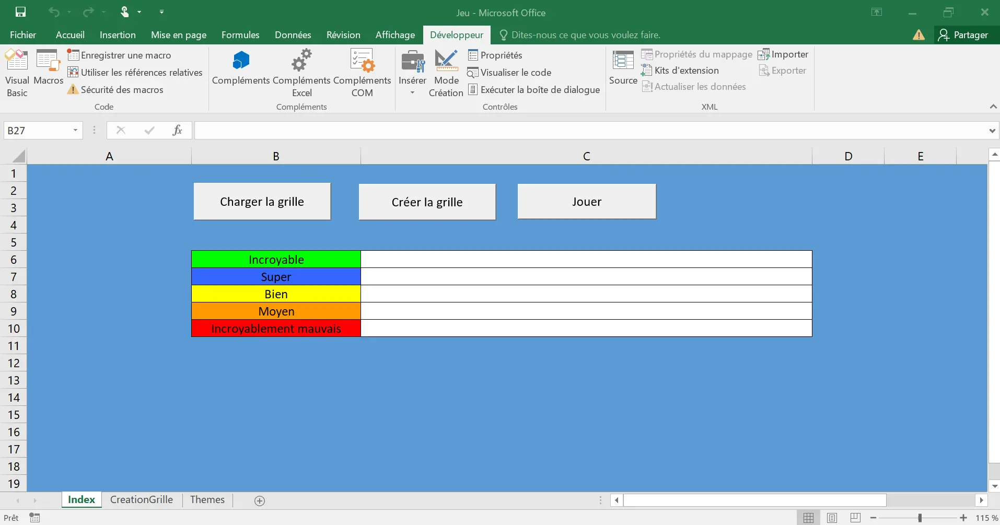
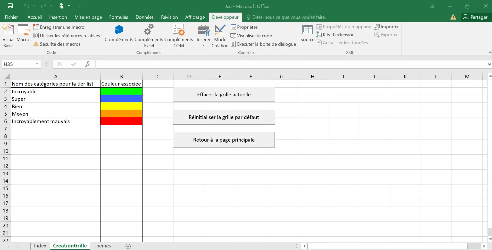
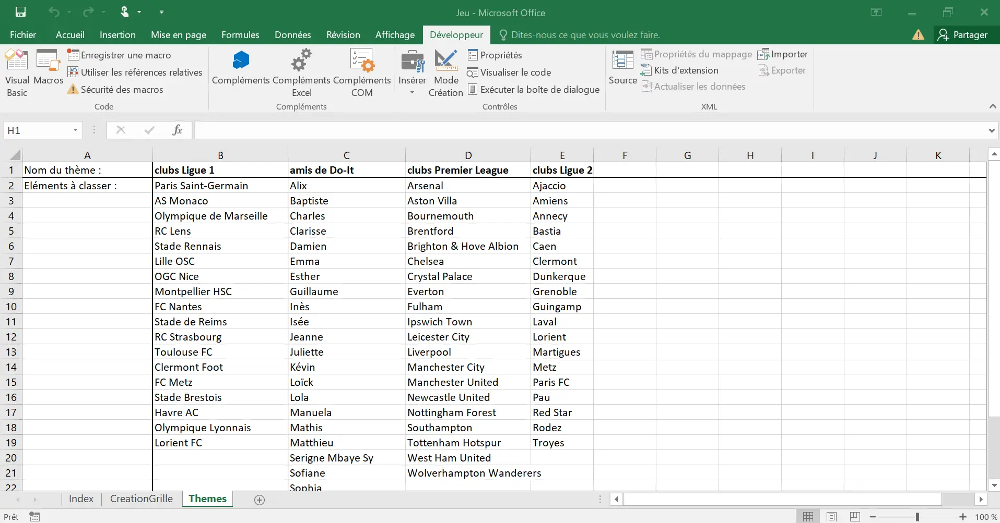



Avoir un Microsoft Excel qui fonctionne.




- [Cours VBA gratuit. Source : Excel-Pratique (2024)](https://excel-pratique.com/fr/vba)
- [Mon projet (github)](https://github.com/TitouanCorne/MON1.2)



## Table des matières

1. [Introduction](#section1)
2. [Les macros et VBA, qu'est-ce que c'est ?](#section2)
3. [Quelques points clés en VBA](#section3)
4. [Mise en pratique avec la création d'un jeu](#section4)

## 1. Introduction <a id="section1"></a>

Dans le monde professionnel, l'un des logiciels les plus importants est **Excel**. Bien que tout le monde connaisse ce logiciel, au moins de nom, seulement une petite partie d'entre eux maîtrisent toutes les fonctionnalités disponibles. Pour ma part, je n'ai jamais vraiment appris à utiliser Excel ; je sais simplement manipuler un tableur et afficher des graphiques. C'est pour cela que j'ai décidé de consacrer ce MON à l'apprentissage des bases des macros qui permettent d'automatiser des tâches. Lors de mon stage de césure, mon collègue de bureau m'a souvent dit : "Excel c'est trop fort, tu peux tout faire avec !".

## 2. Les macros et VBA, qu'est-ce que c'est ? <a id="section2"></a>

Le VBA (Visual Basic for Applications) est un langage proche du VB (Visual Basic). Ce langage de programmation est intégré dans plusieurs applications Microsoft dont Excel. Il permet d'automatiser des tâches par l'intermédiaire de macros qui exécutent des séries d'actions. Par exemple, il est possible d'automatiser la création d'un graphique à partir de données fournies dans un tableur. Ainsi, VBA permet aux utilisateurs de créer des fonctions personnalisées pour répondre à des besoins spécifiques, au-delà des fonctionnalités de base d'Excel.

## 3. Quelques points clés en VBA <a id="section3"></a>

Pour apprendre comment écrire du code en VBA, j'ai utilisé le [MON1.1](../../../Charles-Cook/mon/temps-1.1/index.md) de Charles et j'ai suivi le même cours que lui ([Excel-Pratique : cours VBA gratuit](https://excel-pratique.com/fr/vba)). Ce cours est bien fait, facile à suivre, avec des petits exercices d'entraînement. Je te conseille d'y jeter un coup d'œil si tu souhaites toi aussi apprendre le VBA.

Pour ne pas refaire ce qui a déjà été fait par certains concernant leur MON, je vais simplement mentionner certains 'points clés' qui sont intéressants à voir car on ne retrouve pas exactement la même fonctionnalité ou syntaxe dans d'autres langages de programmation (python, C#, etc).

**Structure conditionnelle :** on note la présence de `Then` et la fin de la structure conditionnelle à l'aide du `End If`.

```vb
If [CONDITION 1] Then '=> SI la condition 1 est vraie ALORS
    'Instructions 1
ElseIf [CONDITION 2] Then '=> SINON, SI la condition 2 est vraie ALORS
    'Instructions 2
Else '=> SINON
    'Instructions 3
End If
```


On remarque qu'on utilise la simple appostrophe pour commenter son code.


**Boucles `While` et `Until` :**

```vb
Do While [CONDITION]
    'Instructions
  Loop
```

```vb
Do Until [CONDITION]
    'Instructions
  Loop
```

```vb
Dim cellule As Range
For Each cellule In Range("A1:B3")
  cellule = cellule.Address
Next     
```


On remarque qu'on utilise des variables (*cellule* dans l'exemple précédent) qui doivent être déclarées en précisant leur type (Integer, String, ...).

Exemple : Dim maVariable As Integer


**Utilisation de `With` pour éviter les répétitions :**

```vb
With Sheets("Index") 'On cache les différents boutons
  .Shapes("BoutonChargerGrille").Visible = False
  .Shapes("BoutonCreerGrille").Visible = False
  .Shapes("BoutonJouer").Visible = False
  .Shapes("BoutonStop").Visible = True
End With
```

Dans l'exemple précédent, l'utilisation de `With` permet d'éviter la répétition de `Sheets("Index")`.

## Mise en pratique avec la création d'un jeu <a id="section4"></a>

Pour apprendre et maîtriser un nouveau langage, il est primordiale de mettre en pratique. C'est pour cela que j'ai décidé de réaliser un petit jeu de Tier-List sur Excel à l'aide des connaissances acquises sur [Excel-Pratique](https://excel-pratique.com/fr/vba).

### Concept du jeu

Le jeu de Tier-List consiste à classer des éléments appartenant à un même thème dans différentes catégories selon ses préférences. Par exemple, si le thème choisi est 'clubs de ligue 1', le joueur devra classer 8 clubs selon ses préférences. Les clubs sont tirés au hasard (8 parmi 18 en ce qui concerne le thème 'club de ligue 1'). Le joueur pourra choisir le nom des différentes catégories. Des catégories par défaut seront proposées (catégories : 'Incroyable', 'Super', 'Bien', 'Moyen', 'Incroyablement mauvais').

### Organisation du projet : les différentes feuilles Excel

 *Capture d'écran personnelle (2024)*

**Feuille n°1 : Index** : Correspond à la feuille principale, c'est là que le jeu se déroule.

**Feuille n°2 : CreationGrille** : Feuilles consacrée au désign de la grille présente sur la feuille *Index*. Le joueur peut changer le nom de chaque catégorie et sa couleur associée. Sur cette feuille, trois boutons sont disponibles :

- *"Effacer la grille actuelle"* pour que le joueur crée ses propres catégories de A à Z.
- *"Réinitialiser la grille par défaut"* pour recharger la grille qui est actuellement affichée sur la capture d'écran qui suit.
- *"Retour à la page principale"* pour être redirigé vers la feuille *Index* et commencer à jouer.

  *Capture d'écran personnelle (2024)*

Chaque bouton est associé à une macro, c'est-à-dire à une fonction.

Pour le bouton *"Effacer la grille actuelle"*, voici le code VBA de la macro associée :

```vb
Sub Retour()
    Sheets("Index").Activate
End Sub
```

Pour le bouton *"Réinitialiser la grille par défaut"*, voici le code VBA de la macro associée :

```vb
Sub GrilleDefaut()
    Sheets("CreationGrille").Cells.Clear 'On nettoie la page dédiée à la création d'une grille
    Sheets("CreationGrille").Activate 'Choix de la feuille à modifier
    Range("A1") = "Nom des catégories pour la tier list" 'Nom des catégories
    Range("A2") = "Incroyable"
    Range("A3") = "Super"
    Range("A4") = "Bien"
    Range("A5") = "Moyen"
    Range("A6") = "Incroyablement mauvais"
    Range("B1") = "Couleur associée" 'Couleur des catégories
    Range("B2").Interior.ColorIndex = 4
    Range("B3").Interior.ColorIndex = 41
    Range("B4").Interior.ColorIndex = 6
    Range("B5").Interior.ColorIndex = 45
    Range("B6").Interior.ColorIndex = 3
    
    StyleColonne 'Ajouter un style aux colonnes (la fonction StyleColonne a été générée toute seule grâce à l'enregistrement d'une macro)
End Sub
```

Pour le bouton *"Effacer la grille actuelle"*, voici le code VBA de la macro associée :

```vb
Sub NouvelleGrille()
    Sheets("CreationGrille").Cells.Clear 'On nettoie la page dédiée à la création d'une grille
    Sheets("CreationGrille").Activate 'Choix de la feuille à modifier
    Range("A1") = "Nom des catégories pour la tier list" 'Nom des catégories
    Range("B1") = "Couleur associée" 'Couleur des catégories
    StyleColonne 'Ajouter un style aux colonnes (la fonction StyleColonne a été générée toute seule grâce à l'enregistrement d'une macro)
End Sub
```


Il existe une fonctionnalité permettant d'enregistrer directement une macro sans écrire le moindre code VBA, simplement en faisant les modifications voulues à la main.


**Feuille n°3 : Themes** : Feuille qui regroupe tous les thèmes de jeu (ex : clubs de ligue 1, sodas, etc).

  *Capture d'écran personnelle (2024)*

Voici une session, sous forme de vidéo, d'une partie du jeu codé :

<div style="display: flex; justify-content: center; align-items: center; height: 480;">
  <video style="max-width: 100%; height: auto;" controls>
    <source src="./video/video.mp4" type="video/mp4">
    Your browser does not support the video tag.
  </video>
</div>

 *Vidéo personnelle (2024)*

## Sources utiles



- [Cours VBA gratuit. Source : Excel-Pratique (2024)](https://excel-pratique.com/fr/vba)
- [Mon projet (github)](https://github.com/TitouanCorne/MON1.2)


