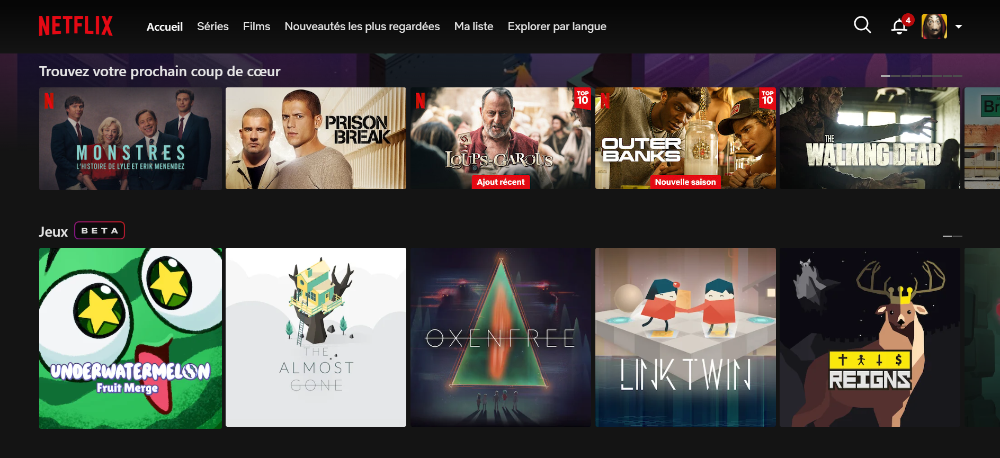
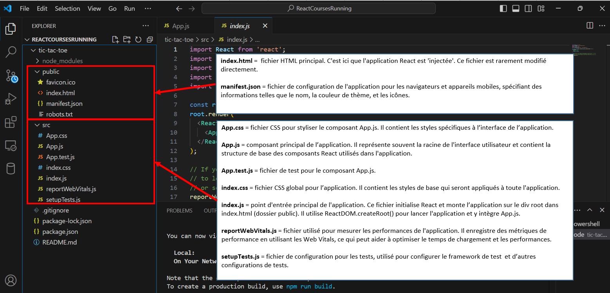
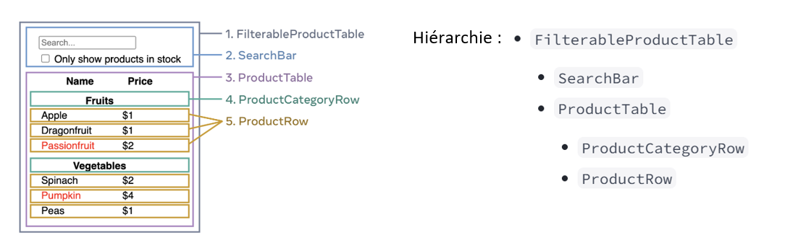
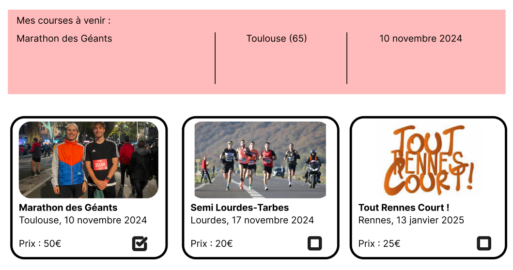
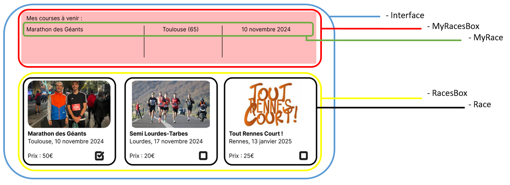
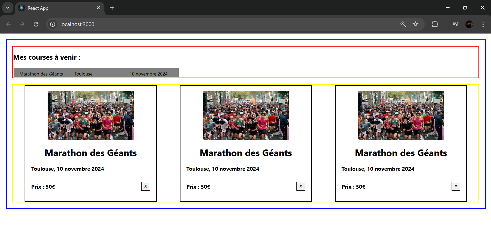



Connaissances du web :

- HTML
- JavaScript (ou encore mieux TypeScript)
- CSS




- [Site officiel](https://react.dev/)
- [GitHub : application pour tester et prendre en main les différents concepts](mettre lien ici)




## Table des matières

- [Table des matières](#table-des-matières)
- [1. React : qu'est ce que c'est ? ](#1-react--quest-ce-que-cest--)
- [2. Synthèse de balisage *JSX* ](#2-synthèse-de-balisage-jsx-)
- [3. Mise en place de l'environnement de travail ](#3-mise-en-place-de-lenvironnement-de-travail-)
- [4. Variables d'état ](#4-variables-détat-)
- [5. Mise en pratique ](#5-mise-en-pratique-)
- [Sources utiles](#sources-utiles)

## 1. React : qu'est ce que c'est ? <a id="section1"></a>

React est une bibliothèque JavaScript open source utilisée pour créer des interfaces utilisateurs. Cette bibliothèque a vu le jour en 2013. Elle est actuellement maintenue par Meta. React est donc utilisé en développement web, côté front.

Parmi les applications connues développées en utilisant React, on retrouve notamment Netflix et Airbnb.

 *Capture d'écran (2024)*

 *Capture d'écran (2024)*

## 2. Synthèse de balisage *JSX* <a id="section2"></a>

La synthèse de balisage *JSX* (JavaScript XML) n'est pas obligatoire, mais elle est très courante dans les projets React pour des raisons de confort.

JSX permet de produire des 'éléments' dans React. À la place de séparer les éléments visuels et la logique en différents fichiers, JSX utilise des **components** (bouts de code réutilisables qui représentent une partie de l’interface utilisateur) qui contiennent à la fois la partie visuelle (HTML) et la logique (fonction JavaScript par exemple).

Pour montrer un exemple de code en JSX :

```
function formatName(user) {
  return user.firstName + ' ' + user.lastName;
}

const user = {
  firstName: 'Harper',
  lastName: 'Perez'
};

const element = (
  <h1>
    Hello, {formatName(user)}!
  </h1>
);
```

On remarque dans l'exemple précédent que le JSX permet d'insérer du balisage dans du JavaScript.



Plus d'informations sur *JSX* : [documentation proposée par Meta](https://legacy.reactjs.org/docs/introducing-jsx.html)


## 3. Mise en place de l'environnement de travail <a id="section3"></a>

Pour créer un nouveau projet en utilisant *Node.js*, il suffit d'exécuter la commande ```npx create-react-app nom-du-projet```.

Une fois le projet créé, on peut lancer l'application avec la commande ```npm start```

Le projet créé a l'architecture suivante :


*Capture d'écran personnelle (2024)*

## 4. Variables d'état <a id="section4"></a>

Les variables d'état (**state**), sont des données qui permettent de gérer et de suivre les informations dynamiques d'un composant. Elles sont essentielles car elles permettent de rendre les composants interactifs et réactifs aux changements.

On utilise le hook (fonction spéciale dont le nom commence par use) **useState** pour créer et gérer l’état.

Exemple illustratif :

```
import React, { useState } from 'react';

function Counter() {
  const [count, setCount] = useState(0); // count est la variable d'état, setCount est la fonction pour mettre à jour l'état

  return (
    <div>
      <p>Le compteur est à : {count}</p>
      <button onClick={() => setCount(count + 1)}>Incrémenter</button>
    </div>
  );
}
```

Il est important de comprendre où placer l'état... Parfois des composants partagent le même état, dans ce cas, il faut déplacer cet état depuis les composants "vers le haut", c'est-à-dire vers le composant parent qui les contient tous. Cette notion est bien expliquée sur le site officiel de React, dans la partie *Démarrage rapide ([Partager des données entre composants](https://fr.react.dev/learn))*.

Voici une capture d'écran qui permet de comprendre la hiérarchie entre les différents composants :


*Exemple repris du site officiel de [React](https://fr.react.dev/learn/thinking-in-react) (2024)*

Lorsqu'on développe une application il est donc important de savoir comment structurer l'état au sein de cette application. Il faut alors considérer l'état comme étant le jeu minimum de données susceptibles de changer dont l'application doit mémoriser. Il est important de ne pas se perdre avec un trop grand nombre d'états, c'est pourquoi on utilise le principe DRY (*Don't Repeat Yourself*). Pour déterminer si une donnée constitue de l'état, il faut se poser les bonnes questions :

- Est-ce que la donnée reste inchangée au fil du temps ? Si oui, ce n’est pas de l’état.
- Est-ce que la donnée est passée depuis un parent via les props ? Si oui, ce n’est pas de l’état.
- Peut-on déterminer/calculer la donnée sur base d’états ou props existants de votre composant ? Si oui, ce n’est pas de l’état.

Ensuite, une autre étape clé est de déterminer où l'état devrait vivre.

On a vu que React utilise un flux de données unidirectionnel (les données descendent le long de la hiérarchie des composants, des parents vers les enfants). Voici les étapes à réaliser pour chaque élément d’état de votre application (étapes tirées du [site officiel de React](https://fr.react.dev/learn/thinking-in-react)) :

1. Identifiez chaque composant qui affiche quelque chose sur base de cet état.
2. Trouvez leur plus proche ancêtre commun : un composant qui est au-dessus d’eux tous dans l’arborescence.
3. Décidez où l’état devrait vivre :

- Le plus souvent, vous pourrez mettre l’état directement dans leur ancêtre commun.
- Vous pouvez aussi le mettre dans un composant au-dessus de leur ancêtre commun.
- Si vous ne trouvez aucun composant dans lequel il semble logique de placer l’état, créez un nouveau composant spécifiquement pour contenir l’état, et insérez-le dans l’arborescence juste au-dessus de leur ancêtre commun.

## 5. Mise en pratique <a id="section5"></a>

Pour une mise en pratique des points étudiés jusqu'à présent, j'ai décidé de développer une interface web assez simple. Cette interface web permet de lister des courses (running) à venir et d'en sélectionner quelques unes en tant que favoris. Voici la maquette du site auquel j'aimerais aboutir :

*Maquette personnelle réalisée sur Figma (2024)*

Pour ce qui concerne les données, j'ai voulu faire au plus simple en créant un tableau d'objet JavaScript regroupant toutes les informations nécessaires. Voici à quoi ressemble le tableau :

```
const COURSES = [
  { name: "Marathon des Géants", place: "Toulouse", date: "10 novembre 2024", price: "50€", img: "./img/marathondesgeants", commitment: true},
  { name: "Semi Lourdes-Tarbes", place: "Lourdes", date: "17 novembre 2024", price: "20€", img: "./img/semilourdestarbes", commitment: false },
  { name: "Tout Rennes Court !", place: "Rennes", date: "13 janvier 2025", price: "25€", img: "./img/toutrennescourt", commitment: false }
];
```

Ensuite, j'ai identifié le nombre de composants et leur hierarchie :

*Capture d'écran personnelle (2024)*

Ensuite, j'ai construit une première version statique, c'est-à-dire que la logique de l'application n'est pas présente dans cette première version (impossibilité d'ajouter des éléments dans sa liste de courses).

Voici le rendu visuel de cette première version :

*Capture d'écran personnelle (2024)*

Le style du site est adapté à ma maquette pour que ce soit plus facile de comprendre où se trouve chaque composant. Le design final viendra en fin de projet, lorsque la logique de l'interface sera implémentée.

Le code du site en statique est disponible sur mon GitHub, le commit s'appelle [*"Première version statique, avec un peu de CSS"*](https://github.com/TitouanCorne/ReactCoursesRunning/commit/36c58423cac59e687a7e0869c2ae683489612ccf)

La prochaine étape consiste à intégrer la logique de l'application.

<div style="display: flex; justify-content: center; align-items: center; height: 480;">
  <video style="max-width: 100%; height: auto;" controls>
    <source src="./video/site-avec-logique.mp4" type="video/mp4">
    Your browser does not support the video tag.
  </video>
</div>

 *Vidéo personnelle (2024)*

Le code écrit jusqu'à ce stade est disponible sur mon GitHub, le commit s'appelle [*"Deuxième version, intégration de la logique"*](https://github.com/TitouanCorne/ReactCoursesRunning/commit/d4e8005855fa53e2cdc53b07dd7bb7561de7e00f)

## Sources utiles



- [Documentation officielle React. Source : React (2024)](https://fr.react.dev/learn)
- [Documentation sur le JSX. Source : Meta Platforms, Inc. (2024)](https://legacy.reactjs.org/docs/introducing-jsx.html)


