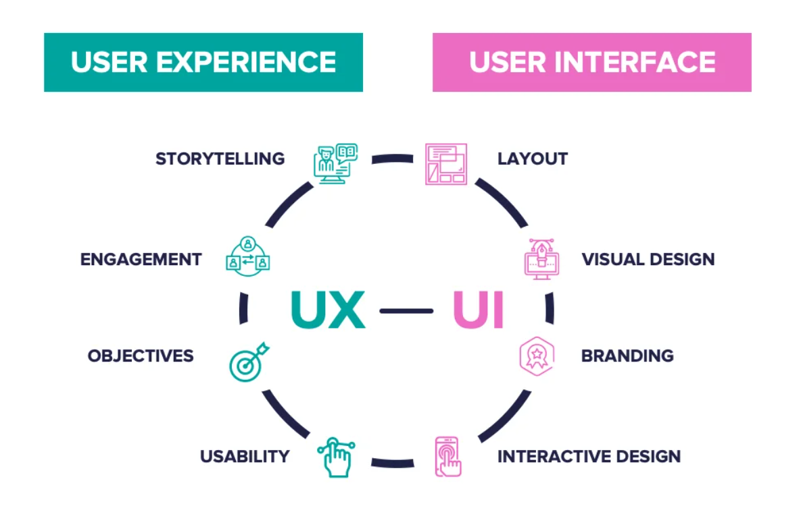
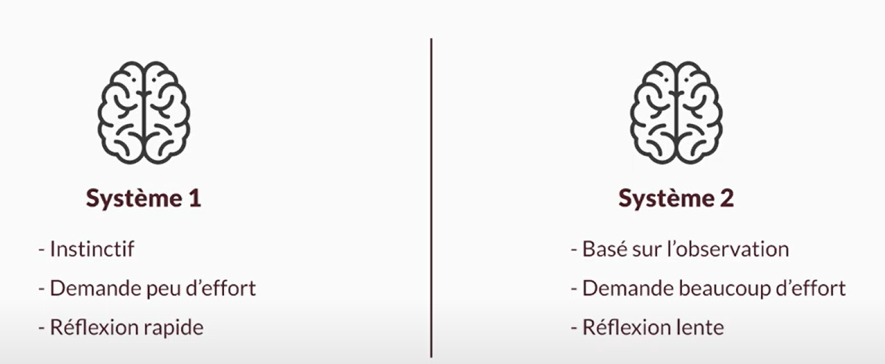



Aucun prérequis n'est nécessaire




Les lien utiles pour la compréhension de celui-ci.



## Table des matières

1. [UX/UI : qu'est ce que c'est ?](#section1)
2. [Figma : qu'est ce que c'est ?](#section2)
3. [Maquette de mon site **Miam'Miam**](#section3)
4. [Pourquoi passer du temps à faire un prototype](#section4)

## 1. UX/UI : qu'est ce que c'est ? 

UX = User Experience
UI = User Interface

 *Similarities Between UI/UX Design. Source : [Aloa Blog](https://aloa.co/blog/user-interface-vs-user-experience) (2024)*

Dans la vidéo youtube de Florent Kiecken ([Formation UX Design : Maîtriser les fondamentaux](https://www.youtube.com/watch?v=UvRVZIUxLyw)), dans la partie dédiée à la psychologie utilisateur, un concept expliqué m'a semblé essentiel et pertinent. Il s'agit de comprendre que l'utilisateur a deux systèmes de pensée :

 *UX - systèmes de pensée. Source : [Florent Kiecken](https://www.youtube.com/watch?v=UvRVZIUxLyw) (2022)*

Le but de l'UX est de garder l'utilisateur dans le système 1 le plus plus souvent possible. Dans ce système, l'utilisateur est dans son confort, il n'a pas besoin de se concentrer, il n'y a pas d'effort à faire. Mais, il est parfois inévitable d'écrire de gros paragraphes qui exigent un effort particulier chez l'utilisateur, c'est-à-dire d'utiliser le système 2. Pour que l'UX soit idéale, il est important que l'utilisateur passe par le système 1 avant d'utiliser le système 2. La transition entre système 1 et 2 doit se faire le plus naturellement possible.

## 2. Figma : qu'est ce que c'est ? 

Figma est un outil de conception graphique disponible en ligne. Il permet notamment de réaliser des prototypes d'applications web. C’est l’un des outils les plus populaires parmi les designers professionnels et les équipes de développement produit grâce à ses fonctionnalités collaboratives, sa simplicité d’utilisation et sa flexibilité.

Figma est assez facile à prendre en main. Pour ma part, j'ai trouvé très intéressant le fait de voir le travail de certains designers web pour comprendre les normes concernant l'UI. Par exemple, je connais les "règles" pour choisir les tailles de police en fonction du type de texte (titre, sous-titre, paragraphe, etc.). Pour faire de la veille sur ce qui se fait en UI, je recommande de regarder le travail de [Basti UI](https://www.youtube.com/c/BastiUI),, que je ne connaissais pas avant qu'Inès m'en parle.

## 3. Maquette de mon site **Miam'Miam** 

Après avoir exploré et expérimenté les différentes fonctionnalités proposées par Figma, j’ai réalisé une maquette pour le site de cuisine **Miam'Miam** :

  <video style="max-width: 100%; height: auto;" controls>
    <source src="./video/maquette.mp4" type="video/mp4">
    Your browser does not support the video tag.
  </video>

 *Vidéo personnelle (2024)*

Ce que j'ai utilisé dans Figma pour construire cette maquette :

- Frames :
Elles permettent une structuration claire des pages. J'ai utilisé des grilles pour positionner correctement chaque élément visuel.
- Composants :
J'ai créé des composants réutilisables (boutons, cartes de recettes).
- Styles globaux :
Ils permmettent d'assurer une identité visuelle uniforme sur l’ensemble des pages.
- Prototypage interactif :
J'ai ajouté des interactions (liens cliquables, transitions entre les frames) pour simuler le parcours utilisateur et valider l'UX.



Si tu veux en savoir plus à propos de **Miam'Miam**, je t'invite à lire mon **[POK2 - Angular - Front-End Framework](https://francoisbrucker.github.io/do-it/promos/2024-2025/Corne-Titouan/pok/temps-2/)**



## 4. Pourquoi passer du temps à faire un prototype ? 

Passer du temps à créer un prototype dans Figma présente plusieurs avantages :

1. **Tester les idées avant le développement avec les utilisateurs**
  Lors de mon stage de césure, j'ai consacré beaucoup de temps au codage d'une application web pour un client. Cependant, avant d'approuver ma solution, le client m'a demandé de revoir certains éléments, comme la position des boutons et d'autres détails d'interface. J'ai alors réalisé que le temps investi dans le développement aurait pu être optimisé si j'avais présenté une maquette interactive et complète de la solution avant de commencer à coder. Un prototype permet de recueillir des retours précis des utilisateurs finaux, évitant ainsi des modifications coûteuses en temps après le développement.

2. **Tester les idées avant le développement avec les développeurs**
  Un prototype n'est pas seulement utile pour les utilisateurs finaux, mais aussi pour les équipes techniques. En impliquant les développeurs dès cette phase, ils peuvent évaluer la faisabilité des idées proposées, suggérer des ajustements techniques, et identifier d'éventuels problèmes avant même que le travail de codage ne commence. Cela permet d'améliorer la communication et d'assurer que la conception est réalisable avec les technologies disponibles.

3. **Communiquer clairement la vision globale du projet**  
  Dans un projet impliquant plusieurs développeurs, il est essentiel que chacun ait une compréhension claire de la vision globale du produit. Même si un développeur est responsable d'une fonctionnalité spécifique, un prototype lui permet de voir où cette fonctionnalité s'intègre dans l'ensemble du projet. Cela réduit les risques de malentendus, garantit une meilleure cohérence dans le développement, et aide à aligner les efforts de l'équipe sur un objectif commun.

4. **Gagner du temps, en préparant au mieux la phase de développement**
  Une fois la maquette réalisée et validée, le développement de l'application devient beaucoup plus fluide. Les développeurs disposent d'un plan précis et peuvent se concentrer sur l'implémentation technique plutôt que sur des questions de conception. Le résultat attendu est clair pour toutes les parties prenantes, ce qui réduit les itérations inutiles et accélère la livraison du produit.



Notes à moi-même : Avant de réaliser ce MON, j'avais tendance à sous-estimer l'importance de la phase de prototypage. Je percevais la création d'une maquette détaillée et interactive comme une perte de temps, pensant qu'il valait mieux passer rapidement au développement.

Ce MON m'a permis de prendre conscience de la véritable valeur du prototypage. J'ai découvert à quel point il est agréable et efficace de coder une application en se référant à une maquette.



## Sources utiles



- [User Interface vs User Experience: What's The Difference ? Source : Aloa Blog (2024)](https://aloa.co/blog/user-interface-vs-user-experience)
- [Formation UX Design : Maîtriser les fondamentaux. Source : Florent Kiecken - SDLV (2022)](https://www.youtube.com/watch?v=UvRVZIUxLyw)
- [Chaîne youtube : Basti UI](https://www.youtube.com/c/BastiUI)


