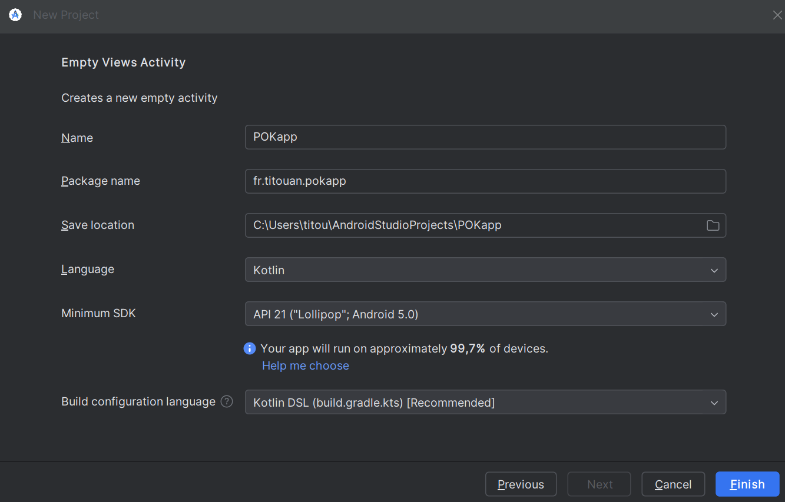
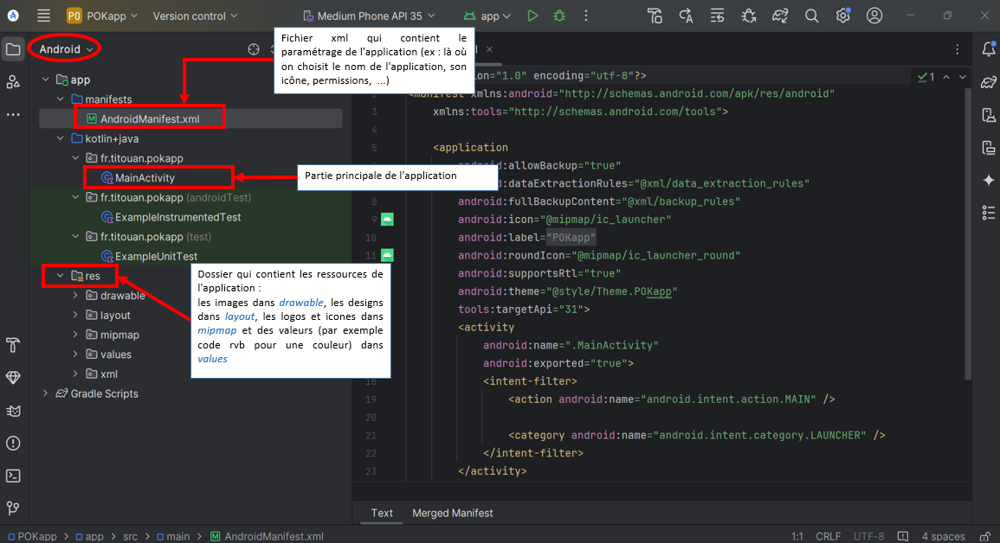
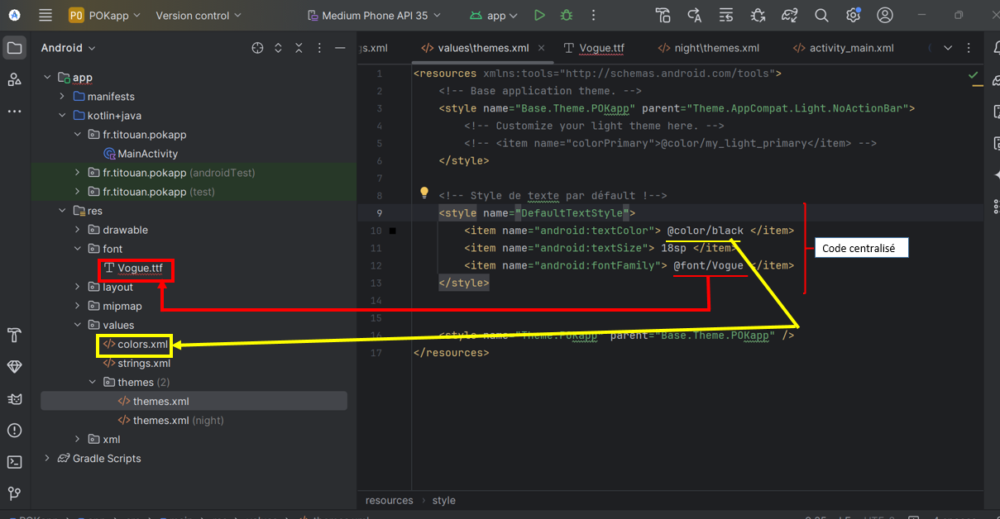
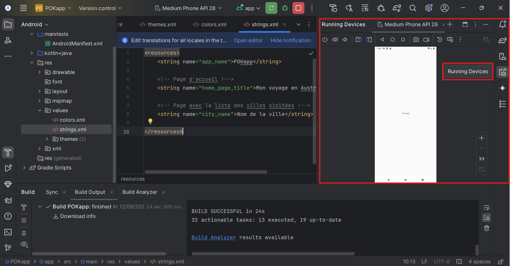
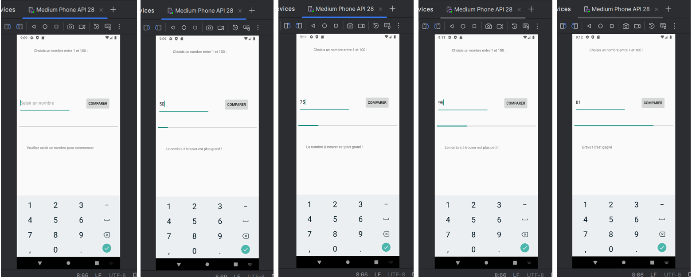



Sans prérequis




Pour coder en lagage Kotlin depuis le web : [Kotlin Playground](https://play.kotlinlang.org/)
[Mon projet sur Github](https://github.com/TitouanCorne/AndroidKotlinFirstApp.git)



## Tâches

- [x] Apprendre les bases de Kotlin en suivant le tuto proposé sur [developer.android.com](https://developer.android.com/codelabs/basic-android-kotlin-compose-first-program?hl=fr#0).
- [x] Mettre en place l'environnement de travail nécessaire au dev Android avec Kotlin sous Windows.
- [x] Developper une application basique (une seule activité).
- [ ] Faire un cahier des charges de l'application qui a pour but de partager des expériences de voyage.
- [ ] Faire des wireframes réalistes pour chaque page de l'application.
- [ ] Mettre en place une base de données (compte utilisateur, textes de blog à afficher, ...).
- [ ] Implémenter l'interface en respectant les wireframes.
- [ ] Gérer l'identification/inscription de l'utilisateur.
- [ ] Implémenter une fonctionnalité permettant à l'utilisateur de 'poster un article sur son feed'.

### Sprints

**But final :** Développer une application Android retraçant mon voyage en Australie.

#### Sprint 1

- [x] Apprendre les bases de Kotlin en suivant le tuto proposé sur [developer.android.com](https://developer.android.com/codelabs/basic-android-kotlin-compose-first-program?hl=fr#0).
- [x] Mettre en place l'environnement de travail nécessaire au dev Android avec Kotlin sous Windows.
- [x] Developper une application basique (une seule activité)

**Analyse post-mortem :**

J'ai réussi à réaliser entièrement la to do list fixée au départ pour ce premier sprint. J'ai abouti sur un livrable qui fonctionne : l'application basique. Il m'a été un peu difficile d'organiser mes recherches sur le langage Kotlin, qui est tout nouveau pour moi. Je me suis senti au début comme étant au pied d'un mur. Mais avec du temps, un peu de prise en main, j'estime avoir compris les bases du langage. Le nombre de ressources dédiées à la programmation Kotlin n'est pas en manque sur internet !

Le second sprint me permettra de bien plus mettre en pratique ses bases et d'en apprendre encore plus !

#### Sprint 2

- [ ] Faire un cahier des charges de l'application que je souhaite réaliser
- [ ] Faire des wireframes réalistes pour chaque page de l'appli
- [ ] Coder

### Horodatage

| Date | Heures passées | Indications |
| -------- | -------- |-------- |
| Jeudi 12/09  | 0H40  | Tuto dev Kotlin (tâche 1) |
| Jeudi 12/09  | 0H20  | Mise en place environnement de travail |
| Jeudi 12/09  | 3H00  | Recherches sur Android Studio/Kotlin |
| Vendredi 13/09 | 1H00  | Recherches sur Android Studio/Kotlin |
| Lundi 16/09 | 4H00  | Prise en main Android Studio/Kotlin |
| Mardi 17/09 | 1H00  | Réalisation application (très) basique |

## Contenu

## Table des matières

1. [Les bases en Kotlin (tâche 1)](#section1)
2. [Mise en place de l'environnement de travail (tâche 2)](#section2)
3. [Créer un émulateur (machine virtuelle)](#section3)
4. [Apprendre à coder sur Android Studio](#section4)

### 1. Les bases en Kotlin <a id="section1"></a>

Pour commencer un petit mot sur Kotlin :

"Kotlin est un langage de programmation moderne qui aide les développeurs à gagner en productivité. Par exemple, Kotlin vous permet d'être plus concis et d'écrire moins de lignes de code pour la même fonctionnalité que les autres langages de programmation. Les applications développées en Kotlin sont également moins susceptibles de planter, ce qui se traduit par une application plus stable et plus robuste pour les utilisateurs. Globalement, Kotlin vous permet de créer de meilleures applications Android et plus rapidement. C'est pourquoi Kotlin prend de l'ampleur dans le secteur et est d'ailleurs le langage utilisé par la majorité des développeurs Android professionnels." (source : l'équipe de formation Google Developers)

Pour me familiariser avec le langage Kotlin, j'ai utilisé un éditeur de code intéractif appelé [Kotlin Playground](https://play.kotlinlang.org/). Celui-ci est directement accessible depuis le Web.


Ici tu retrouves la [liste exhaustive des mots clés Kotlin](https://kotlinlang.org/docs/keyword-reference.html)


Une bonne pratique à adopter : suivre les normes de codage Android de Google pour le codage en Kotlin ("[guide de style](https://developer.android.com/kotlin/style-guide?hl=fr)"). Cela permet d'avoir un code lisible et en accord avec le code écrit par d'autres développeurs dans le cas d'un projet collaboratif.
Voici quelques recommandations du guide de style :

- Les noms de fonctions doivent être en camel case et être des verbes ou des expressions verbales.
- Chaque instruction doit figurer sur une ligne distincte.
- L'accolade ouvrante doit apparaître à la fin de la ligne où la fonction commence.
- Il doit y avoir une espace avant l'accolade ouvrante.
   *Illustration disponible sur [developer.android.com](https://developer.android.com/codelabs/basic-android-kotlin-compose-first-program?hl=fr#6)*

Je vais pour la suite utiliser Kotlin pour la logique de mon application et le langage de données XML pour son contenu.



Un fichier XML (eXtensible Markup Language) est un format de fichier utilisé pour structurer, organiser et stocker des données d'une manière qui soit à la fois lisible par les humains et compréhensible par les machines. Il est basé sur un ensemble de balises (tags) pour décrire les données de manière hiérarchique et flexible. Contrairement à d'autres formats de fichiers, comme HTML qui est plus axé sur la présentation, XML est purement un format de données.

Extensible : en XML, les utilisateurs peuvent créer leurs propres balises pour structurer les données selon leurs besoins. Il n'y a pas de balises prédéfinies comme en HTML.



### 2. Mise en place de l'environnement de travail <a id="section2"></a>

Il faut télécharger l'IDE [Android Studio]() qui permet d'écrire du code mais aussi d'avoir un appercu de l'application et un émulateur (appareil Android fictif).

Une fois téléchargé, j'ai créé un nouveau projet avec les propriétés suivantes :

 *Capture d'écran personnelle*


Il faut veiller à choisir une "Minimum SDK" pas trop récent afin que l'application puisse fonctionner sur une grande majorité d'appareils Android (99,7% des appareils pourront faire fonctionner mon application si on se réfère à la version choisie sur la capture d'écran précédente)


Un projet est alors créé, voici sa structure :

 *Capture d'écran commentée*


Pour avoir exactement la même fenêtre avec la même structure de projet, il faut veiller à sélectionner "Android" en haut à gauche!


Cette structure d'application permet de centraliser certains éléments (dans *res*) qui seront présents à plusieurs endroits dans l'application. Prenons l'exemple d'un style texte qui peut être défini par sa police, sa taille et sa couleur. Bien que ce qui est écrit diffère d'une page à l'autre de l'application, le style du texte lui reste inchangé. Ainsi, la pratique à adopter est de créer un style pour ces textes dans le dossier ressources (*res*) dans le fichier *themes.xml*

 *Capture d'écran commentée*

### 3. Créer un émulateur (machine virtuelle) <a id="section3"></a>

Pour tester son application, il est possible de connecter via USB un appareil Android. Mais il est également possible de créer une machine virtuelle dont on choisit les caractéristiques (type de machine, taille d'écran, résolution, version d'Android, ...).
C'est cette dernière option que j'ai choisie d'utiliser :

 *Capture d'écran depuis Android Studio*

### 4. Apprendre à coder sur Android Studio <a id="section4"></a>

Les chaînes de caractères ne sont pas codées en dur dans la page xml dédiée à l'activité (activity_main.xml). Les chaînes sont définies dans /res/values/strings.xml puis sont appelées à partir du layout. Ainsi dans le fichier strings.xml on retrouve la définition de notre string :

``` xml
<string name="choose_number"> Choisis un nombre entre 1 et 10 :</string>
```

Et dans le fichier activity_main.xml, on fait référence au string défini :

``` xml
<TextView
        android:text="@string/choose_number"
```

Pour apprendre à coder une application basique, j'ai suivi principalement deux tutoriels :

- [TUTO Android : Votre première application Android (mise en oeuvre avec Android Studio)](https://www.youtube.com/watch?v=TCJFoExOBUE)
- [Simple Kotlin App | Android Studio | 2024](https://www.youtube.com/watch?v=XLt_moCoauw)

Le premier tutoriel m'a été utile pour comprendre comment ajouter des éléments de base sur la page principale de l'application (textes, boutons, ...). Cependant pour la logique de l'application, qui doit être codée pour ma part dans le fichier *MainActivity.kt*, j'ai dû adapter ce qui est expliqué dans le tuto car le developpeur code son application en java et non en Kotlin. Bien que cela m'ait fin un rappel intéressant sur le langage java, j'ai dû chercher une aide pour coder correctement en Kotlin. C'est pour cela que le deuxième tuto est intéressant.

Voici l'aperçu l'application (très) basique sur laquelle j'ai abouti :


*Captures d'écran depuis Android Studio*

Cette petite application est un jeu d'estimation. Il faut trouver un nombre entre 1 et 100 en un nombre d'essais limité (10 max). Une barre de progression représente le nombre de tentatives. Une zone de texte (*TextView*) permet de donner des indications sur le nombre à trouver : plus petit ou plus grand !

## Sources utiles



- [liste exhaustive des mots clés Kotlin](https://kotlinlang.org/docs/keyword-reference.html)
- [guide de style](https://developer.android.com/kotlin/style-guide?hl=fr)
- [TUTO Android : Votre première application Android (mise en oeuvre avec Android Studio)](https://www.youtube.com/watch?v=TCJFoExOBUE)
- [Simple Kotlin App | Android Studio | 2024](https://www.youtube.com/watch?v=XLt_moCoauw)
  

