

Sans prérequis




- Pour coder en lagage Kotlin depuis le web : [Kotlin Playground](https://play.kotlinlang.org/)
- Pour télécharger Android Studio : [Android Studio](https://developer.android.com/studio?hl=fr)
- Pour retrouver mon projet sur Github : [Mon projet sur Github](https://github.com/TitouanCorne/AndroidKotlinFirstApp.git)
- Pour récupérer des images libres de droit : [iStock](https://www.istockphoto.com/)



## Tâches

- [x] Apprendre les bases de Kotlin en suivant le tuto proposé sur [developer.android.com](https://developer.android.com/codelabs/basic-android-kotlin-compose-first-program?hl=fr#0).
- [x] Mettre en place l'environnement de travail nécessaire au dev Android avec Kotlin sous Windows.
- [x] Developper une application basique (une seule activité).
- [x] Faire un cahier des charges de l'application qui a pour but de partager des expériences de voyage.
- [x] Faire des wireframes réalistes pour chaque page de l'application.
- [x] Implémenter l'interface en respectant les wireframes.
- [ ] Mettre en place une base de données (compte utilisateur, textes de blog à afficher, ...).
- [ ] Gérer l'identification/inscription de l'utilisateur.
- [ ] Implémenter une fonctionnalité permettant à l'utilisateur de 'poster un article sur son feed'.

### Sprints

**But final :** Développer une application Android retraçant mon voyage en Australie.

#### Sprint 1

- [x] Apprendre les bases de Kotlin en suivant le tuto proposé sur [developer.android.com](https://developer.android.com/codelabs/basic-android-kotlin-compose-first-program?hl=fr#0).
- [x] Mettre en place l'environnement de travail nécessaire au dev Android avec Kotlin sous Windows.
- [x] Developper une application basique (une seule activité)

**Analyse post-mortem (Sprint 1) :**

J'ai réussi à réaliser entièrement la to do list fixée au départ pour ce premier sprint. J'ai abouti sur un livrable qui fonctionne : l'application basique. Il m'a été un peu difficile d'organiser mes recherches sur le langage Kotlin, qui est tout nouveau pour moi. Je me suis senti au début comme étant au pied d'un mur. Mais avec du temps, un peu de prise en main, j'estime avoir compris les bases du langage. Le nombre de ressources dédiées à la programmation Kotlin n'est pas en manque sur internet !

Le second sprint me permettra de bien plus mettre en pratique ses bases et d'en apprendre encore plus !

#### Sprint 2

- [x] Faire un cahier des charges de l'application qui a pour but de partager des expériences de voyage.
- [x] Faire des wireframes réalistes pour chaque page de l'application.
- [x] Implémenter l'interface en respectant les wireframes.
- [ ] Mettre en place une base de données (compte utilisateur, textes de blog à afficher, ...).
- [ ] Gérer l'identification/inscription de l'utilisateur.
- [ ] Implémenter une fonctionnalité permettant à l'utilisateur de 'poster un article sur son feed'.

**Analyse post-mortem (Sprint 2) :**

Au cours des 10 heures dédiées au sprint 2, je n'ai pas pu réaliser l'ensemble des tâches listées dans la to-do list initiale. J'ai réalisé les trois premiers points (ceux qui sont cochés). Cependant les trois autres n'ont pas été abordés par manque de temps.
J'en conclus que l'objectif fixé initialement était trop ambitieux pour le temps réduit du POK.
J'ai rencontré quelques difficultés lors de la phase *"Implémenter l'interface en respectant les wireframes."*. En effet, j'ai fait quelques erreurs qui ont nécessité une prise en charge plus longue. Par exemple, le fait d'avoir laissé des traits d'union (-) dans le nom de mes fonts (ressources) a provoqué certaines erreurs. La résolution d'un problème anodin comme celui-ci peu prendre du temps.

J'en tire plusieurs enseignements :

- être réaliste dans la définition des objectifs d'un projet.
- essayer de prendre en compte les possibles imprévus (marge de temps pour certaines tâches qui semblent compliquées par exemple).
- détailler de manière plus explicite la to-do list en décomposant les "grosses" tâches en plusieurs étapes, plus petites.

### Horodatage

| Date | Heures passées | Indications |
| -------- | -------- |-------- |
| Jeudi 12/09  | 0H40  | Tuto dev Kotlin (tâche 1) |
| Jeudi 12/09  | 0H20  | Mise en place environnement de travail |
| Jeudi 12/09  | 3H00  | Recherches sur Android Studio/Kotlin |
| Vendredi 13/09 | 1H00  | Recherches sur Android Studio/Kotlin |
| Lundi 16/09 | 4H00  | Prise en main Android Studio/Kotlin |
| Mardi 17/09 | 1H00  | Réalisation application (très) basique |
||||
| Samedi 12/10 | 1H00  | Cahier des charges |
| Samedi 12/10 | 1H30  | Figma - wireframes |
| Lundi 14/10 | 2H00 | Ressources Android Studio |
| Mardi 15/10 | 3H30 | Veille + Implémenter l'interface en respectant les wireframes |
| Mercredi 16/10 | 2H00 | Comprendre et implémenter le recyclerView  |

## Contenu

## Table des matières

1. [Les bases en Kotlin (tâche 1)](#section1)
2. [Mise en place de l'environnement de travail (tâche 2)](#section2)
3. [Créer un émulateur (machine virtuelle)](#section3)
4. [Apprendre à coder sur Android Studio](#section4)
5. [Réaliser le cahier des charges](#section5)
6. [Réaliser des wireframes](#section6)
7. [Ajout des ressources de l'application](#section7)
8. [Implémenter l'interface en respectant les wireframes](#section8)

### 1. Les bases en Kotlin <a id="section1"></a>

Pour commencer un petit mot sur Kotlin :

"Kotlin est un langage de programmation moderne qui aide les développeurs à gagner en productivité. Par exemple, Kotlin vous permet d'être plus concis et d'écrire moins de lignes de code pour la même fonctionnalité que les autres langages de programmation. Les applications développées en Kotlin sont également moins susceptibles de planter, ce qui se traduit par une application plus stable et plus robuste pour les utilisateurs. Globalement, Kotlin vous permet de créer de meilleures applications Android et plus rapidement. C'est pourquoi Kotlin prend de l'ampleur dans le secteur et est d'ailleurs le langage utilisé par la majorité des développeurs Android professionnels." (source : l'équipe de formation Google Developers)

Pour me familiariser avec le langage Kotlin, j'ai utilisé un éditeur de code intéractif appelé [Kotlin Playground](https://play.kotlinlang.org/). Celui-ci est directement accessible depuis le Web.


Ici tu retrouves la [liste exhaustive des mots clés Kotlin](https://kotlinlang.org/docs/keyword-reference.html)


Une bonne pratique à adopter : suivre les normes de codage Android de Google pour le codage en Kotlin ("[guide de style](https://developer.android.com/kotlin/style-guide?hl=fr)"). Cela permet d'avoir un code lisible et en accord avec le code écrit par d'autres développeurs dans le cas d'un projet collaboratif.
Voici quelques recommandations du guide de style :

- Les noms de fonctions doivent être en camel case et être des verbes ou des expressions verbales.
- Chaque instruction doit figurer sur une ligne distincte.
- L'accolade ouvrante doit apparaître à la fin de la ligne où la fonction commence.
- Il doit y avoir une espace avant l'accolade ouvrante.
  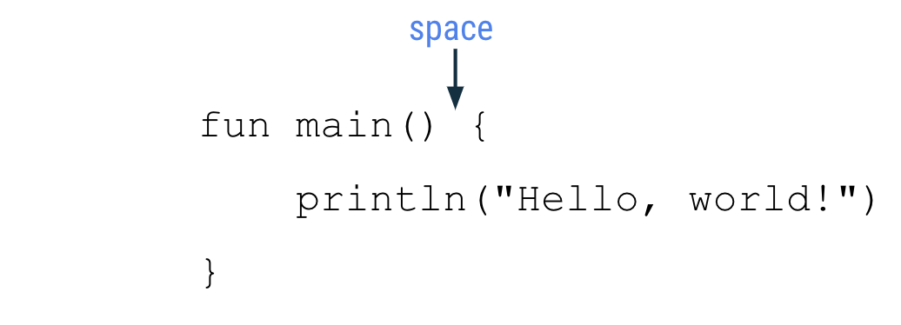 *Illustration disponible sur [developer.android.com](https://developer.android.com/codelabs/basic-android-kotlin-compose-first-program?hl=fr#6)*

Je vais pour la suite utiliser Kotlin pour la logique de mon application et le langage de données XML pour son contenu.



Un fichier XML (eXtensible Markup Language) est un format de fichier utilisé pour structurer, organiser et stocker des données d'une manière qui soit à la fois lisible par les humains et compréhensible par les machines. Il est basé sur un ensemble de balises (tags) pour décrire les données de manière hiérarchique et flexible. Contrairement à d'autres formats de fichiers, comme HTML qui est plus axé sur la présentation, XML est purement un format de données.

Extensible : en XML, les utilisateurs peuvent créer leurs propres balises pour structurer les données selon leurs besoins. Il n'y a pas de balises prédéfinies comme en HTML.



### 2. Mise en place de l'environnement de travail <a id="section2"></a>

Il faut télécharger l'IDE [Android Studio]() qui permet d'écrire du code mais aussi d'avoir un appercu de l'application et un émulateur (appareil Android fictif).

Une fois téléchargé, j'ai créé un nouveau projet avec les propriétés suivantes :

 *Capture d'écran personnelle*


Il faut veiller à choisir une "Minimum SDK" pas trop récent afin que l'application puisse fonctionner sur une grande majorité d'appareils Android (99,7% des appareils pourront faire fonctionner mon application si on se réfère à la version choisie sur la capture d'écran précédente)


Un projet est alors créé, voici sa structure :

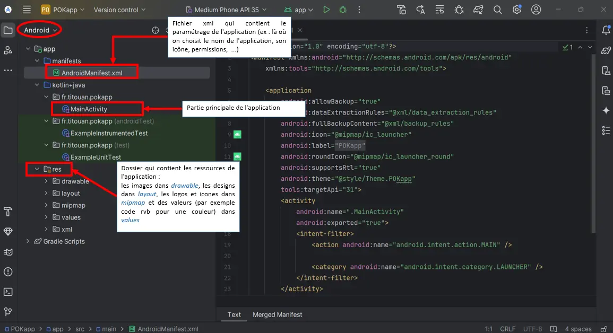 *Capture d'écran commentée*


Pour avoir exactement la même fenêtre avec la même structure de projet, il faut veiller à sélectionner "Android" en haut à gauche!


Cette structure d'application permet de centraliser certains éléments (dans *res*) qui seront présents à plusieurs endroits dans l'application. Prenons l'exemple d'un style texte qui peut être défini par sa police, sa taille et sa couleur. Bien que ce qui est écrit diffère d'une page à l'autre de l'application, le style du texte lui reste inchangé. Ainsi, la pratique à adopter est de créer un style pour ces textes dans le dossier ressources (*res*) dans le fichier *themes.xml*

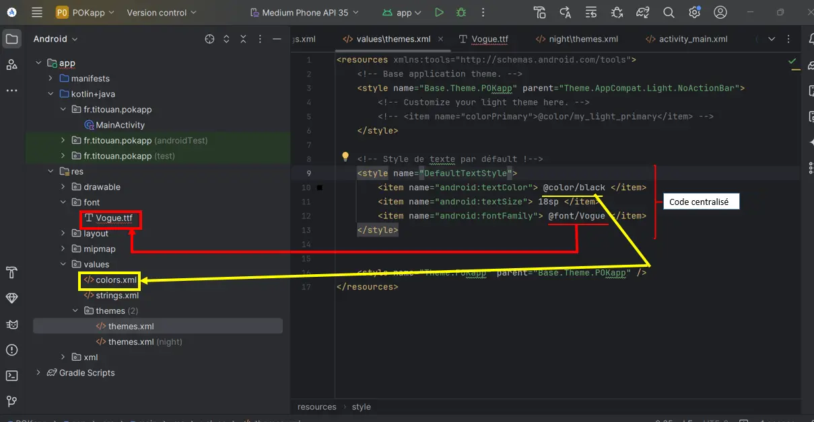 *Capture d'écran commentée*

### 3. Créer un émulateur (machine virtuelle) <a id="section3"></a>

Pour tester son application, il est possible de connecter via USB un appareil Android. Mais il est également possible de créer une machine virtuelle dont on choisit les caractéristiques (type de machine, taille d'écran, résolution, version d'Android, ...).
C'est cette dernière option que j'ai choisie d'utiliser :

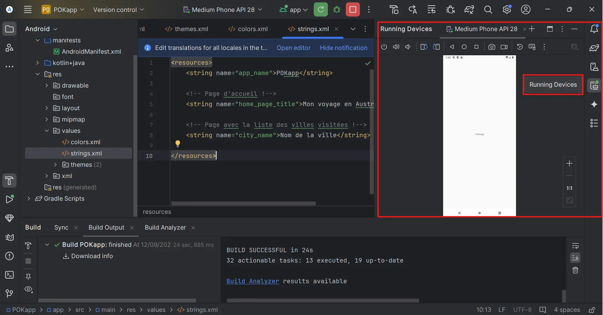 *Capture d'écran depuis Android Studio*

### 4. Apprendre à coder sur Android Studio <a id="section4"></a>

Les chaînes de caractères ne sont pas codées en dur dans la page xml dédiée à l'activité (activity_main.xml). Les chaînes sont définies dans /res/values/strings.xml puis sont appelées à partir du layout. Ainsi dans le fichier strings.xml on retrouve la définition de notre string :

``` xml
<string name="choose_number"> Choisis un nombre entre 1 et 10 :</string>
```

Et dans le fichier activity_main.xml, on fait référence au string défini :

``` xml
<TextView
        android:text="@string/choose_number"
```

Pour apprendre à coder une application basique, j'ai suivi principalement deux tutoriels :

- [TUTO Android : Votre première application Android (mise en oeuvre avec Android Studio)](https://www.youtube.com/watch?v=TCJFoExOBUE)
- [Simple Kotlin App | Android Studio | 2024](https://www.youtube.com/watch?v=XLt_moCoauw)

Le premier tutoriel m'a été utile pour comprendre comment ajouter des éléments de base sur la page principale de l'application (textes, boutons, ...). Cependant pour la logique de l'application, qui doit être codée pour ma part dans le fichier *MainActivity.kt*, j'ai dû adapter ce qui est expliqué dans le tuto car le developpeur code son application en java et non en Kotlin. Bien que cela m'ait fin un rappel intéressant sur le langage java, j'ai dû chercher une aide pour coder correctement en Kotlin. C'est pour cela que le deuxième tuto est intéressant.

Voici l'aperçu l'application (très) basique sur laquelle j'ai abouti :

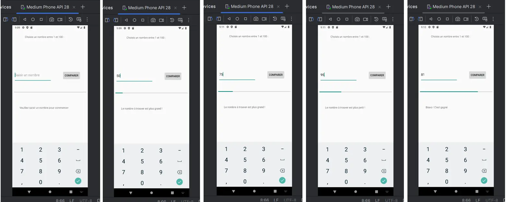
*Captures d'écran depuis Android Studio*

Cette petite application est un jeu d'estimation. Il faut trouver un nombre entre 1 et 100 en un nombre d'essais limité (10 max). Une barre de progression représente le nombre de tentatives. Une zone de texte (*TextView*) permet de donner des indications sur le nombre à trouver : plus petit ou plus grand !

### Sources utiles - Sprint 1



- [liste exhaustive des mots clés Kotlin](https://kotlinlang.org/docs/keyword-reference.html)
- [guide de style](https://developer.android.com/kotlin/style-guide?hl=fr)
- [TUTO Android : Votre première application Android (mise en oeuvre avec Android Studio)](https://www.youtube.com/watch?v=TCJFoExOBUE)
- [Simple Kotlin App | Android Studio | 2024](https://www.youtube.com/watch?v=XLt_moCoauw)
  



Le sprint 1 s'achève à ce niveau.


### 5. Réaliser le cahier des charges <a id="section5"></a>

Avant dans se lancer dans les phases de conception et de réalisation, il est important de bien identifier le besoin client. Celui-ci peut être restitué sous forme de cahier des charges. Il est important que ce document soit clair et complet pour que le besoin client soit bien compris et que l'équipe de dev puisse correctement faire son travail.

Au cours de mon stage de césure, j'ai été amené à développer une application web de la phase de conception à celle de mise en production. Le besoin client n'avait pas bien été défini ce qui a provoqué une grosse perte de temps de mon côté pour revoir certaines fonctionnalités voire en ajouter d'autres auxquelles les clients n'avaient pas pensé initialement.

Pour ce POK, la situation est un peu particulière, je suis à la fois le client et le développeur, mais ça ne fait rien. Dorénavant, je m'efforcerai toujours à recueillir correctement le besoin client dans un premier temps pour avoir une bonne feuille de route. Puis, dans un second temps, je commencerai les phases de conception et de réalisation.

Voici le cahier des charges consacré à l'application *EVASION* que j'ai décidée de développer dans le cadre de ce POK :

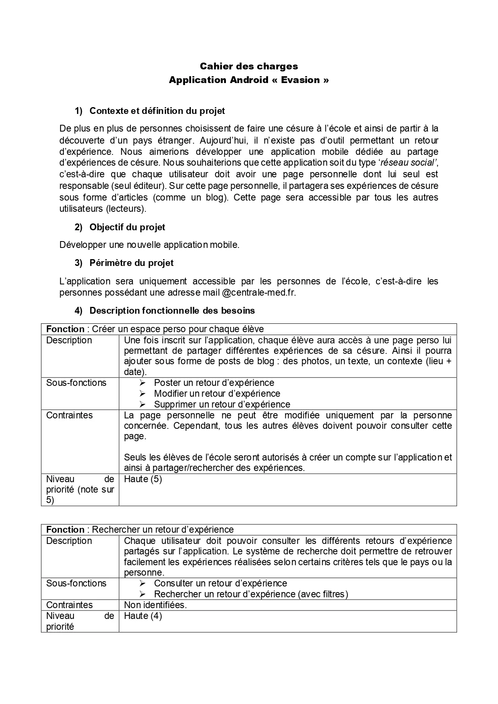


### 6. Réaliser des wireframes <a id="section6"></a>

Pour réaliser des wireframes, j'ai décidé d'utiliser le logiciel d'UI design [Figma](https://www.figma.com). Ce logiciel permet de créer des prototypes de sites web ou d'application.

Après avoir découvert l'outil Figma, voici les wireframes créées :

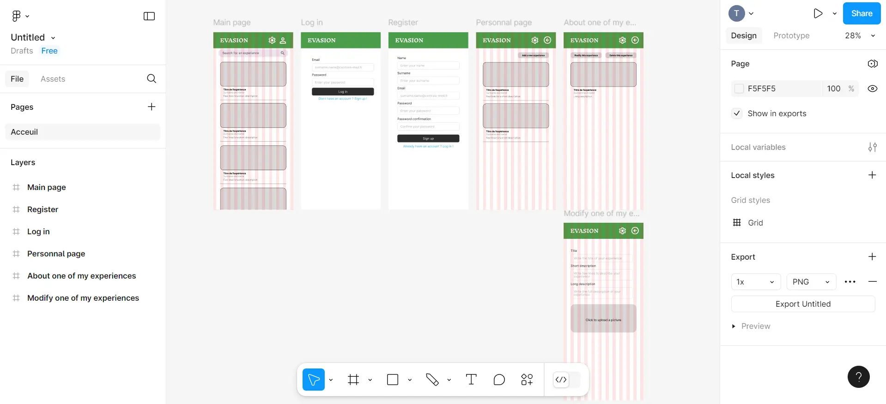

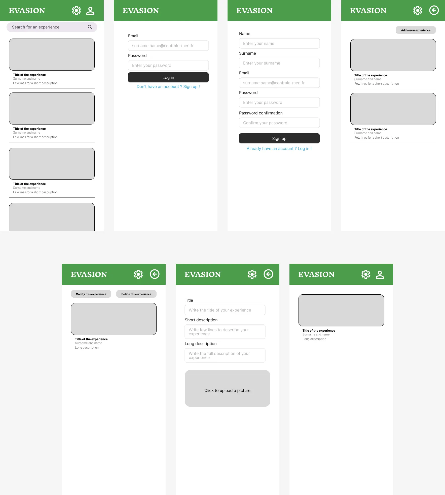

Ces wireframes peuvent encore grandement être améliorés mais, par manque de temps, je ne pouvais pas m'attarder dessus... Dans une situation professionnelle, il aurait été intéressant de montrer ces wireframes au client pour qu'il donne un feedback avant le lancement de la phase de développement.

### 7. Ajout des ressources de l'application <a id="section7"></a>

Une fois la vision du futur rendu de notre application établie (grâce aux wireframes), j'ai commencé à coder le visuel de l'application. J'ai ainsi commencé par définir toutes les couleurs utilisées dans mes wireframes :

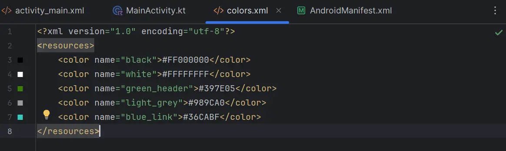

De même, j'ai saisi le contenu textuel (dans le fichier ./res/values/string.xml)   :

``` kotlin
<resources>
    <string name="app_name">Evasion</string>
    <string name="app_name_capital_letters">EVASION</string>

    <!-- Main page -->
    <string name="main_page_exp_title">Title of the experience</string>
    <string name="main_page_exp_author">Surname and name</string>
    <string name="main_page_summary">Few lines for a short description</string>
    <string name="main_page_search_bar">Search for an experience</string>

    <!-- Detail one experience -->
    <string name="detail_one_experience_page_button_delete">Delete this experience</string>
    <string name="detail_one_experience_page_title">Title of the experience</string>
    <string name="detail_one_experience_page_author">Surname and name</string>
    <string name="detail_one_experience_page_description">Long description</string>

    <!-- Log in -->
    <string name="login_page_label_email">Email</string>
    <string name="login_page_input_email">surname.name@centrale-med.fr</string>
    <string name="login_page_label_password">Password</string>
    <string name="login_page_input_password">Enter your password</string>
    <string name="login_page_button_login">Log in</string>
    <string name="login_page_link_to_signup">Don\'t have an account ? Sign up !</string>

    <!-- Sign up -->
    <string name="signup_page_label_name">Name</string>
    <string name="signup_page_input_name">Enter your name</string>
    <string name="signup_page_label_surname">Surname</string>
    <string name="signup_page_input_surname">Enter your surname</string>
    <string name="signup_page_label_email">Email</string>
    <string name="signup_page_input_email">surname.name@centrale-med.fr</string>
    <string name="signup_page_label_password">Password</string>
    <string name="signup_page_input_password">Enter your password</string>
    <string name="signup_page_label_password_confirmation">Password confirmation</string>
    <string name="signup_page_input_password_confirmation">Confirm your password</string>
    <string name="signup_page_button_signup">Sign up</string>
    <string name="signup_page_link_to_login">Already have an account ? Log in !</string>

    <!-- Personal page -->
    <string name="personal_page_button_add_new_experience">Add a new experience</string>
    <string name="personal_page_exp_title">Title of the expérience</string>
    <string name="personal_page_exp_author">Surname and name</string>
    <string name="personal_page_summary">Few lines for a short description</string>
    <string name="personal_page_search_bar">Search for an experience</string>

    <!-- About one of my experiences page -->
    <string name="detail_my_experience_page_button_modify">Modify this experience</string>
    <string name="detail_my_experience_page_button_delete">Delete this experience</string>
    <string name="detail_my_experience_page_title">Title of the experience</string>
    <string name="detail_my_experience_page_author">Surname and name</string>
    <string name="detail_my_experience_page_description">Long description</string>
    <string name="detail_my_experience_page_summary">Long description</string>

    <!-- Modify my experience page -->
    <string name="modify_my_experience_page_button_confirm">Confirm modifications</string>
    <string name="modify_my_experience_page_label_title">Title</string>
    <string name="modify_my_experience_page_input_title">@string/detail_my_experience_page_title</string> <!-- On récupère le titre de l'expérience -->
    <string name="modify_my_experience_page_label_summary">Short description</string>
    <string name="modify_my_experience_page_input_summary">@string/detail_my_experience_page_summary</string> <!-- On récupère le résumé de l'expérience -->
    <string name="modify_my_experience_page_label_description">Long description</string>
    <string name="modify_my_experience_page_input_description">@string/detail_my_experience_page_description</string> <!-- On récupère la description complète de l'expérience -->
    <string name="modify_my_experience_page_change_picture">Click to upload or change the picture</string>

</resources>
```



C'est à ce moment qu'on relève l'importance du temps passé à réaliser des wireframes qui permettent de ne pas se perdre et d'organiser au mieux son espace de travail.
  


Ensuite, j'ai importé tous les icons présents dans mes wireframes (dans le dossier ./res/drawable). J'ai également ajouté une photo pour l'afficher à l'emplacement prévu pour un retour d'expérience.

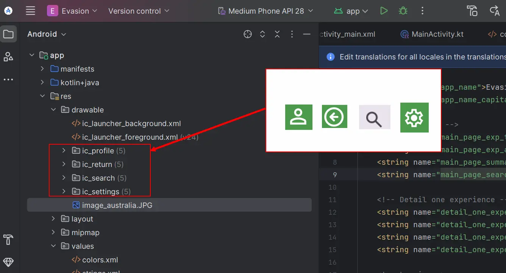

Enfin, après avoir créé un *Android Ressource Directory* pour stocker les différentes polices que je veux utiliser, j'ai défini les différents styles de textes souhaités dans le fichier ./res/values/themes/themes.xml :

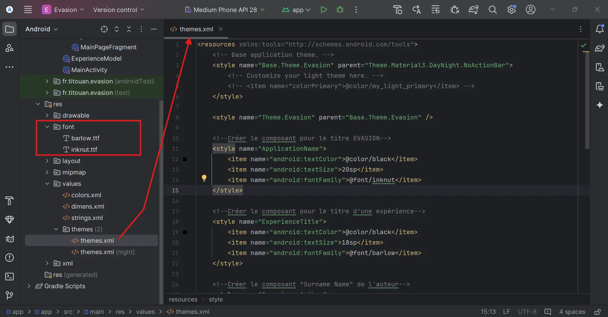



Le nom de fichier des ressources doit être écrit en **minuscules** et seul le caractère **underscore** est autorisé.
  


### 8. Implémenter l'interface en respectant les wireframes <a id="section8"></a>

Ensuite, j'ai commencé à coder l'application en disposant les ressources correctement sur les layouts. Puis, j'ai appelé ces layouts depuis la MainActivity. Cette partie a été (beaucoup) plus longue que prévue parce que, bien que la création de layout semble triviale, c'est en réalité assez dur de prendre en main l'outil lors d'une première utilisation. De plus, j'ai eu du mal à comprendre comment appeler le layout au bon endroit. J'ai aussi eu des difficultés à implémenter la liste variable d'expériences. En effet, dans mes wireframes, sur la page principale, j'ai décidé que l'utilisateur pouvait consulter un nombre variable d'expériences en défilant vers le bas. Pour cette partie, un peu plus technique, j'ai utilisé une vidéo youtube : [créer une application mobile sur Android](https://www.youtube.com/watch?v=WlDzTh4WXek&t=2714s)

## Conclusion du POK

Ce premier POK m'a été utile à la fois sur le plan technique et sur le plan gestion de projet. En effet, sur le plan "technique", j'ai appris les bases du langage de programmation Kotlin et à utiliser Android Studio pour développer une application mobile. Sur le plan "gestion de projet", j'ai pris conscience de ma tendance à sous-estimer le temps nécessaire à l'accomplissement de chaque tâche. De plus, je n'avais pas suffisamment anticipé, voire pas du tout, le temps consacré à la résolution des bugs techniques et des erreurs de code.

### Sources utiles - Sprint 2



- [Cahier des charges, exemple simple à utiliser. Source : site Manager Go!, article rédigé par Laurent GRANGER (16/11/2023)](https://www.manager-go.com/gestion-de-projet/dossiers-methodes/elaborer-un-cdc)
- [Vidéo youtube : Créer une application mobile sur Android (Formation débutant). Source : Graven - Développement (2021)](https://www.youtube.com/watch?v=WlDzTh4WXek&t=2714s)
- [Site officiel Android Studio](https://developer.android.com/studio?hl=fr)
  

