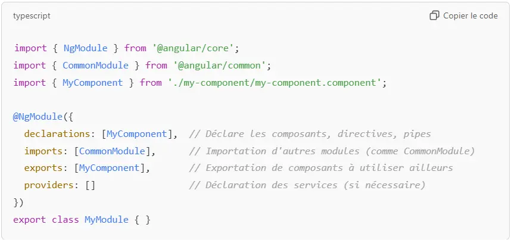



Des connaissances en développement web sont nécessaires (HTML, CSS, JavaScript/TypeScript)




- Doc officielle : [Angular](https://angular.dev/overview)
- Projets Github :
  - [firstApp](https://github.com/TitouanCorne/ApprendreAngular/tree/main/firstApp) - projet dédié à la prise en main d'Angular via les tutos.
  - [Miam'Miam](https://github.com/TitouanCorne/ApprendreAngular/tree/main/CuisineWebSite) - projet du site de cuisine.



## Tâches

- [x] Mettre en place l'environnement de développement.
- [x] Faire la partie [*Essentials*](https://angular.dev/essentials) de la doc officielle.
- [x] Faire la partie [*Start coding!*](https://angular.dev/tutorials/learn-angular) de la doc officielle :
  - [x] Start coding! - Learn Angular in your browser.
  - [x] Start coding! - Build your first app locally.
  - [x] Start coding! - Deferrable Views.
- [x] Créer le cahier des charges du site internet.
- [x] Créer une maquette du site internet.
- [x] Partie développement :
  - [x] Créer les différents composants.
  - [x] Créer un jeu de données de test en local.
  - [x] Créer un service pour récupérer les données (toujours stockées en local pour le moment).
  - [x] Mettre en place le système de routes.
  - [x] Créer un fichier *db.json* qui sera accessible via requêtes HTTP en utilisant JSON Server.

### Sprints

**But final :** Développer un site web de cuisine en Angular.

#### Sprint 1

- [x] Mettre en place l'environnement de développement.
- [x] Faire la partie [*Essentials*](https://angular.dev/essentials) de la doc officielle
- [x] Faire la partie [*Start coding!*](https://angular.dev/tutorials/learn-angular) de la doc officielle
  - [x] Start coding! - Learn Angular in your browser
  - [x] Start coding! - Build your first app locally
  - [x] Start coding! - Deferrable Views
- [x] Créer le cahier des charges du site internet.
- [] Créer une maquette du site internet. (**tâche commencée mais non terminée**)

**Analyse post-mortem (Sprint 1) :**

Ce premier temps de 10 heures m'a permis de découvrir Angular. J'ai pris le temps de suivre l'intégralité des tutoriels disponibles sur leur site. Cela m'a aidé à me familiariser avec les nombreuses notions évoquées au cours de ces exercices. J'ai particulièrement apprécié le fait que ces tutoriels soient bien guidés : je n'ai, à aucun moment, été bloqué.

Je suis satisfait de mon avancement, qui correspond exactement aux objectifs que je m'étais fixés. Ma To-Do list est désormais plus explicite et précise que celle de mon POK1, et c'est une nette amélioration. Le fait d'avoir des tâches bien définies me sera très utile pour le second sprint, qui sera entièrement dédié au développement.

En ce qui concerne la gestion de mon temps de travail, j'ai uniquement précisé, dans la table d'horodatage, le temps effectivement travaillé. Cependant, le temps de restitution sur le site Do-It m'a pris environ 1h30 supplémentaires.

J'ai hâte de commencer à développer mon propre site, place à la créativité !

#### Sprint 2

- [x] Créer une maquette du site internet. (tâche commencée au sprint 1)
- [x] Partie développement :
  - [x] Créer les différents composants
  - [x] Créer un jeu de données de test en local
  - [x] Créer un service pour récupérer les données (toujours stockées en local pour le moment)
  - [x] Mettre en place le système de routes
  - [x] Créer un fichier *db.json* qui sera eccessible via requêtes HTTP en utilisant JSON Server

**Analyse post-mortem (Sprint 2) :**

À la fin de ce second sprint clôturant le POK, je suis globalement satisfait du travail accompli. J'ai réussi à suivre ma to-do list, qui s'est révélée être un outil précieux pour organiser et structurer mes tâches. Elle m'a permis de définir une ligne directrice claire et d'avancer étape par étape.

La tâche 6.3, "Créer les différents composants", a été la plus chronophage. Après quatre heures de travail pour coder les composants, j'ai décidé de m'attaquer aux autres tâches restantes. Bien que mes composants soient fonctionnels, je sais qu'il me serait facile de consacrer encore plusieurs heures à perfectionner leur implémentation, notamment en travaillant davantage sur leur style CSS.

Je peux dire que ce sprint m'a permis de mieux comprendre l'importance de prioriser mes efforts et de trouver un équilibre entre qualité et efficacité pour respecter les délais.

### Horodatage

| Date | Heures passées | Indications |
| -------- | -------- |-------- |
| Mercredi 13/11  | 1H00  | Partie [*Essentials*](https://angular.dev/essentials) (tâche 2) |
| Mercredi 13/11  | 1H00  | Partie [*Essentials*](https://angular.dev/essentials) (tâche 2) |
| Vendredi 15/11  | 2H00  | Partie [*Start coding! - Learn Angular in your browser*](https://angular.dev/tutorials/learn-angular) (tâche 3.1) |
| Samedi 16/11  | 2H00  | Partie [*Start coding! - Build your first app locally*](https://angular.dev/tutorials/first-app) (tâche 3.2) |
| Dimanche 17/11  | 2H00  | Partie [*Start coding! - Build your first app locally*](https://angular.dev/tutorials/first-app) (tâche 3.2) |
| Dimanche 17/11  | 0H30  | Partie [*Start coding! - Deferrable Views*](https://angular.dev/tutorials/first-app) (tâche 3.3) |
| Mardi 19/11  | 0H30  | Partie *Créer un cahier des charges du site internet* (tâche 4) |
| Mardi 19/11  | 1H00  | Partie *Créer une maquette du site internet* (tâche 5) |
| -------- | -------- |-------- |
| Vendredi 29/11  | 1H00  | Partie *Créer une maquette du site internet* (tâche 5) |
| Samedi 30/11  | 4H00  | Partie *Créer les différents composants* (tâche 6.1) |
| Samedi 30/11  | 0H20  | Partie *Créer un jeu de données de test en local* (tâche 6.2) |
| Samedi 07/11  | 0H20  | Partie *Créer un service pour récupérer les données* (tâche 6.3) |
| Samedi 07/12  | 1H00  | Partie *Mettre en place le système de routes* (tâche 6.4) |
| Dimanche 08/12  | 0H20  | Partie *Créer un fichier db.json* (tâche 6.5) |
| Mercredi 11/12  | 3H00  | Partie *Créer les différents composants* (tâche 6.1) |

## Contenu

## Table des matières

1. [Installation d'Angular](#section1)
2. [Les composants](#section2)
3. [Cahier des charges du site de cuisine **Miam'Miam**](#section3)

### 1. Installation d'Angular <a id="section1"></a>

Il faut préalablement avoir Node.js, un IDE (Environnement de Développement Intégré) et un terminal.

Dans un premier temps, il faut installer Angular CLI (Command Line Interface) qui facilite le développement d'applications avec le framework Angular. Angular CLI permet de générer, configurer, développer, tester et déployer des applications Angular de manière efficace, sans se soucier des configurations complexes ou des tâches répétitives.
```npm install -g @angular/cli```

Ensuite, il faut créer un nouveau projet Angular à l'aide de la commande : ```ng new <project-name>```
Il est alors possible de choisir les configurations souhaitées pour le projet.

Le projet est alors créé. Une fois dans le dossier du projet, vous pouvez lancer votre site en local en utilisant la commande ```ng serve```.

Voici l'arborescence de fichiers obtenue :

 *Illustration personnelle (2024)*

### 2. Les composants <a id="section2"></a>

Un composant ou **component** est une unité modulaire de code qui combine un template (structure HTML), du code TypeScript (logique), et des styles CSS pour représenter et gérer une partie de l'interface utilisateur.

Chaque composant Angular est associé à une partie spécifique de l'interface de l'application, et ces composants peuvent être imbriqués les uns dans les autres pour construire des interfaces complexes.

Pour créer un composant, il existe la commande : ```ng generate component <nom-composant>```.

Par exemple, lorsqu'on crée un composant *hello*, on obtient un nouveau dossier comme suit :

 *Capture d'écran personnelle (2024).*

Pour définir le comportement d'un composant ou encore ses données, on utilise l'**état** ou **state**. Ce state représente tout ce que le composant "sait" à un moment donné et qui est susceptible de changer au fil du temps, en réponse à des événements utilisateur, des interactions avec des services, ou d'autres actions.
Voici, un exemple avec les deux propriétés *taskTitle* et *isComplete* :

```
@Component({ ... })
export class TodoListItem {
  taskTitle = '';
  isComplete = false;
}
```

Pour modifier cet état, on peut définir des méthodes à l'intérieur de ce *'class component'* en veillant à bien utiliser le mot **this** :


```
@Component({ ... })
export class TodoListItem {
  taskTitle = '';
  isComplete = false;
  completeTask() {
    this.isComplete = true;
  }
  updateTitle(newTitle: string) {
    this.taskTitle = newTitle;
  }
}
```


Pour afficher du contenu dynamique dans le template (i.e. le rendu html), on utilise des doubles accolades : `<p> Title : {{taskTitle}} </p>` . Ainsi lorsque la valeur de *taskTitle* changera, Angular modifiera le DOM (Document Object Model) pour que le fichier HTML affiche correctement la nouvelle valeur.

Similairement, on peut définir des propriétés CSS de façon dynamique en utilisant des crochets :


```
@Component({
  selector: 'sign-up-form',
  template: `
    <button type="submit" [disabled]="formIsInvalid">Submit</button>
  `
})
export class SignUpForm {
  formIsInvalid = true;
}
```


Il est également possible d'utiliser des conditions **if**, voici un exemple :


```
@Component({
  standalone: true,
  selector: 'user-controls',
  template: `
    @if (isAdmin) {
      <button>Erase database</button>
    } @else {
      <p>You are not authorized.</p>
    }
  `,
})
export class UserControls {
  isAdmin = true;
}
```


Il est aussi possible d'utiliser des boucles **for** :


```
@Component({
  standalone: true,
  selector: 'user-controls',
  template: `
    <ul>
      @for (ingredient of ingredientList; track ingredient.name) {
        <li> {{ ingredient.quantity }} - {{ ingredient.name }}</li>
      }
    </ul>
  `,
})
export class IngredientList {
  ingredientList = [
    {name: 'noodles', quantity: 1},
    {name: 'miso broth', quantity: 1},
    {name: 'egg', quantity: 2},
  ];
}
```


On remarque la présence de la propriété **track** qui correspond à un identifiant unique qu'il faut préciser pour qu'Angular traite correctement chaque élément d'une liste. Nous avions vu qu'il y avait cette même propriété en React, présente sous le nom **key** (cf projets de mon [MON 2.1](https://francoisbrucker.github.io/do-it/promos/2024-2025/Corne-Titouan/mon/temps-2.1/)).

J'ai églament appris de nouveaux concepts sur lesquels, je ne vais pas m'attarder :

- les **vues différées** (**deferrable views**) qui permettent d'optimiser le chargement des différents composants en indiquant à certains qu'ils n'ont pas besoin d'être chargés immediatement pour divers raisons. Illustration :


```
@defer (on viewport) {
      <comments />
      } @placeholder {
      <p>Future comments</p>
      } @loading (minimum 2s) {
      <p>Loading comments...</p>
      }
```


- la **communication intercomposants** avec `@Input` (parent --> enfant) et `@Output` (enfant --> parent)
- la gestion des événements (**Event Handling**) permettant de répondre aux actions des utilisateurs, comme les pressions sur les boutons, les soumissions de formulaires, etc.


```
@Component({
    ...
    template: `<button (click)="greet()">`
})
class AppComponent {
    greet() {
        console.log('Hello !');
    }
}
```


- le chargement les images de façon optimisée avec la directive **NgOptimizedImage**. Par exemple, on décidera de charger l'élément LCP (Largest Contentful Paint) en premier.
- le **routage** pour les applications nécessitant plusieurs pages.
- la gestion de formulaires. Il existe deux sortes de formulaires : **template-driven** ou **reactive**. Angular met à disposition un ensemble d'outils de validation.
- la création d'**interfaces** qui permet de générer un nouveau type de données (utiliser la commande ``ng generate interface <nom-interface>``). J'utilise une interface nommée *housinglocation* dans le projet *fristApp* disponible sur mon [GitHub](https://github.com/TitouanCorne/ApprendreAngular/tree/main/firstApp).
- la directive **ngFor** qui permet d'afficher dynamiquement les données sur un template Angular (i.e. fichier html). Voici un exemple que l'on peut également retrouver dans le projet *fristApp* disponible sur mon [GitHub](https://github.com/TitouanCorne/ApprendreAngular/tree/main/firstApp).


```
<section class="results">
    <app-housing-location
    *ngFor="let housingLocation of housingLocationList"
    [housingLocation]="housingLocation"
    ></app-housing-location>
</section>
```


- la création de classes **services** qui sont utilisées pour transmettre les données à l'application. Les services récupèrent les données depuis un point de terminaison d'API (Application Programming Interface). Les services sont **injectables**  à l'aide du **système d'injection de dépendances (DI) d'Angular** et on peut faire appel à eux depuis différents composants (=> centralisation). Pour générer un nouveau service il faut utiliser la commande ``ng generate service <nom-service>``. Là encore, un exemple (*housing.service.ts*) est présent dans le projet *fristApp* disponible sur mon [GitHub](https://github.com/TitouanCorne/ApprendreAngular/tree/main/firstApp).
- l'utilisation de **template reference variables** qui permettent d'accéder à la valeur saisie dans un input. Illustration avec la variable *#filter* :


```
  <form>
    <input type="text" placeholder="Filter by city" #filter/>
    <button class="primary" type="button" (click)="filterResults(filter.value)">Search</button>
  </form>
```


### 3. Cahier des charges du site de cuisine **Miam'Miam** <a id="section3"></a>


### 4. Choix des différents composants à créer <a id="section4"></a>

Pour choisir quel composants créer, il faut se poser les bonnes questions :

- Est-ce que cette section peut être réutilisée à plusieurs endroits de mon application ?
  
  Ceci améliore la modularité et réduit la duplication de code. Exemple qui s'applique à **Miam'Miam** : une carte de recette (affichant une image, le titre de la recette et le propriétaire de la recette) apparaît plusieurs fois au sein du site. En effet, ces cartes de recettes sont listées sur la page regroupant toutes les recettes. Mais elles apparaissent également lorsqu'on consulte son espace personnel avec ses recettes enregistrées. Ainsi, au lieu de coder cette carte de recette dans plusieurs fichiers, il vaut mieux créer un composant unique. Ce composant sera ensuite personnalisé avec des `@Input()` pour afficher différentes données.

- Est-ce que cette section a une logique ou un comportement distinct ?
  
  Une partie d'une interface ayant une logique distincte et spécifique mérite d'être déclarée en tant que composant. Cela permet d’isoler cette logique pour la rendre facile à comprendre et à tester.

- Est-ce que diviser cette section en plusieurs sous-sections améliore la lisibilité ?
  
  Lorsqu'une section de code est trop longue ou complexe, il est préférable de la scinder en composants plus petits pour une meilleure lisibilité. Par exemple, pour afficher le détail d'une recette, il vaut mieux utiliser plusieurs sous-composants pour les ingrédients, les étapes à réaliser, ...

- Est-ce que cette section pourrait devenir complexe avec le temps ?

  Pour cette dernière question, l'objectif est de prépare le terrain pour des évolutions futures.

### 5. Ne plus utiliser de NgModules <a id="section5"></a>


Comme le montre la capture d'écran, l'équipe Angular recommande d'utiliser des composants autonomes (standalone components) plutôt que les traditionnels NgModule pour tout nouveau code.

Un **NgModule** permet d'organiser et de structurer le code d'une application en regroupant des composants, des services, des directives et des pipes afin de les rendre disponibles à différents endroits de l'application.



Avant, la bonne pratique était d'utiliser des NgModule pour organiser le code en sections logiques. En général, chaque fonctionnalité de l'application correspondait à un module distinct, par exemple, on avait : un module de gestion des utilisateurs, un module de gestion des produits, etc.

Les NgModule permettaient d'optimiser le chargement de l'application en utilisant le *lazy loading* (on charge uniquement les modules nécessaires à un moment donné).

Depuis Angular 14 (i.e. depuit juin 2022), la bonne pratique change et devient d'utiliser essentiellement  des **standalone components**. Ces composants sont plus autonomes, ils n'ont pas besoin d'être inclus dans un NgModule. Cela simplifie le développement et réduit la complexité des applications Angular, surtout pour les petites applications ou pour des composants réutilisables.

Angular évolue vers une structure plus légère et moderne, dans l’esprit des autres frameworks comme React (cf. mon [MON2.1](https://francoisbrucker.github.io/do-it/promos/2024-2025/Corne-Titouan/mon/temps-2.1/)) ou Vue.

### 6. Visualisation du site **Miam'Miam**  <a id="section6"></a>

<div style="display: flex; justify-content: center; align-items: center; height: 480;">
  <video style="max-width: 100%; height: auto;" controls>
    <source src="./video/site.mp4" type="video/mp4">
    Your browser does not support the video tag.
  </video>
</div>

 *Vidéo personnelle (2024)*



Le projet est disponible sur mon [GitHub](https://github.com/TitouanCorne/ApprendreAngular/tree/main/CuisineWebSite), à la fin de ce POK, j'ai fait un commit avec le message "Fin POK2".
  


## Conclusion du POK

Ce deuxième POK m'a permis d'apprendre à développer en Angular, une compétence qui me sera utile pour mon stage de fin d'études. J'ai particulièrement apprécié découvrir cette nouvelle manière d'organiser le Frontend à travers les **composants**. Cette approche modulaire et structurée me correspond bien, je la trouve efficace.

Je vais continuer à développer **Miam'Miam** pour transformer ces notions de base en véritables compétences et expertises.

### Sources utiles



- Doc officielle : [Angular](https://angular.dev/overview)
- Projets Github :
  - [firstApp](https://github.com/TitouanCorne/ApprendreAngular/tree/main/firstApp) - projet dédié à la prise en main d'Angular via les tutos.
  - [Miam'Miam](https://github.com/TitouanCorne/ApprendreAngular/tree/main/CuisineWebSite) - projet du site de cuisine.
  

