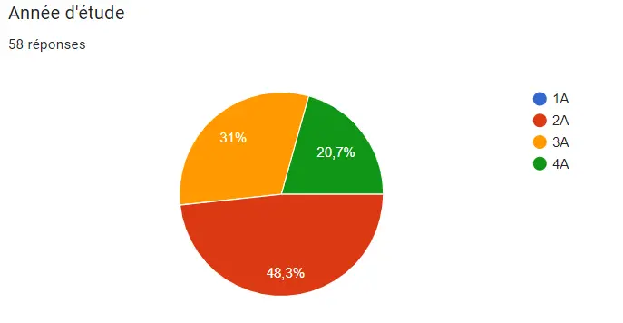
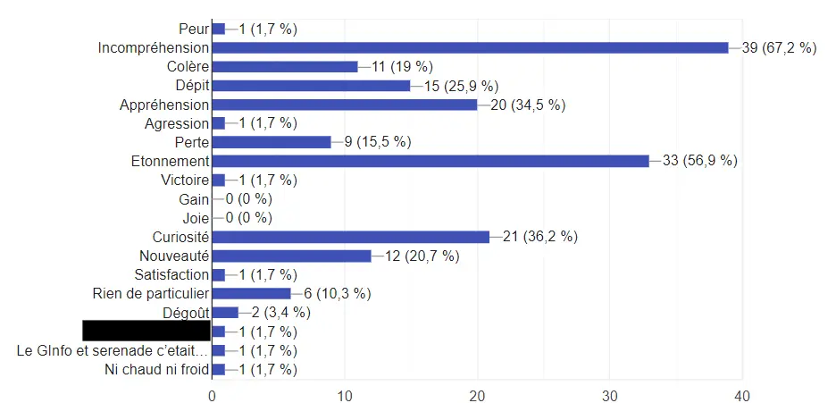
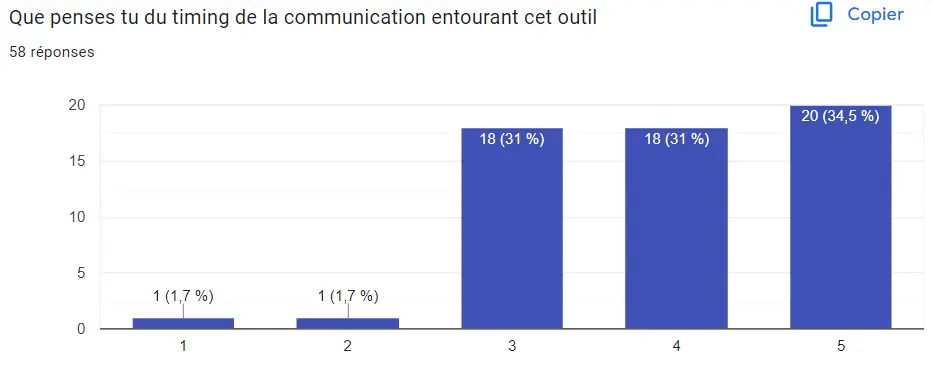


[1] *Comment inciter mes collaborateurs à utiliser l’outil interne pour la gestion de leurs notes de frais ?* https://www.concur.fr/blog/article/comment-inciter-mes-collaborateurs-utiliser-loutil-interne-pour-la-gestion-de-leurs.

[2] *Comment faciliter l’adoption de nouveaux logiciels dans l’entreprise ?* https://www.kostango.com/blog/faciliter-adoption-nouveaux-logiciels-dans-entreprise.

[3] **Lloret, Manon**. *« Conduite du changement : comment faciliter l’adoption d’un nouvel outil ? »* Sharvy, 6 mars 2024, https://www.sharvy.com/blog/conduite-du-changement-comment-faciliter-ladoption-dun-nouvel-outil/.

[4] *« La marguerite sociologique »*. https://www.e-marketing.fr/, 27 novembre 2017, https://www.e-marketing.fr/Thematique/academie-1078/fiche-outils-10154/La-marguerite-sociologique-325571.htm#&utm_source=social_share&utm_medium=share_button&utm_campaign=share_button&utm_content=

[5] *Gestion du changement : courbe de deuil*. https://www.manager-go.com/gestion-de-projet/courbe-du-changement.htm.

[6] **Tonnelé, Arnaud.** *65 outils pour accompagner le changement individuel et collectif*. Eyrolles-Éd. d’Organisation, 2011.


## Contexte

La plupart des expériences professionnelles que j'ai vécues jusqu'à aujourd'hui m'ont amené à mettre en place des outils de suivi, de gestion ou de calcul. Chacun de ces travaux m'a amené à approfondir mes compétences techniques pour acquérir et traiter le besoin. Toutefois, j'ai souvent été confronté à de grandes difficultés et d'importants blocage lors du déploiement des outils que j'avais créés.
Horsmis les aspects esthétiques, ergonomiques et techniques ; il me parait évident que de nombreux autres facteurs conditionnent la réussite du déploiement d'un outil.

## Méthodologie de travail

Afin d'étudier ce sujet, j'ai décidé de mené 3 démarches distinctes :
1. Recherches bibliographiques importantes.
2. Réalisation d'une étude concernant la mise en place du nouvel outil de plannifaction auprès des élèves de 2ème et 3ème année.
3. Synthétiser les résultats de recherches bibliographiques illustrées par les résultats de l'enquête.

## Comment expliquer les situations de blocage face à l'arrivée d'un nouvel outil ?

Toutes les ressources bibliographiques appuyant ce MON mettent en avant les mêmes problématiques et raisons de blocage :
- Peur de l'inconnu
- Peur du manque de comprétences
- Peur changer ses habitudes
- Difficulté à percevoir l'intérêt du nouvel outil
- Sensation de se voir imposer quelque chose
- ...

Le majeur problème qui est pointé est le fait que les besoins psychologiques des collaborateurs ne sont ni respectés, ni même considérés. Au-delà de les considérer, il est nécessaire de les analyser et de savoir y répondre.

### Le changement, une forme de deuil

La plupart des documents que j'ai trouvé, s'accordait à dresser un parralèle entre le changement et le deuil tel que décrit par Elisabeth Kübler-Ross. Elle définit notamment la "Courbe du deuil" détaillant les différentes étapes qu'un individu traverse lors d'un deuil, ou à moindre mesure, d'une perte.


Les étapes du deuil sont normales et doivent être vécues pour une gestion saine du deuil ou de la perte. Bien que chaque individu ne traverse pas les étapes à la même vitesse ou avec la même intensités, chaque étape reste importante.




Le deuil se divise donc d'après E. Kübler-Ross en 5 étapes :
1. ***Le déni*** : Ce n'est pas possible, ils ne vont pas nous imposer un nouvel outil.
2. ***La colère*** : Pourquoi à nous ? Nous travaillons très bien comme ça ! Ils n'y connaissent rien de toutes façons.
3. ***Le marchandage*** : Laissez nous travailler comme nous avons l'habitude de le faire ! Ne changez pas notre outil.
4. ***La dépression, la tristesse*** : Je n'en peux plus. Leur annonce m'a coupé toute motivation. Comment on va faire pour retrouver notre rythme ?
5. ***L'acceptation*** : Nous n'avons pas le choix de toute façon. Ca va aller, nous allons nous débrouiller avec ce nouvel outil.

Les étapes du deuils permettent distinguer des phases d'énergie pour l'individu et donc, des types d'actions à mener pour l'accompagner. Nous les développerons plus tard dans le raisonnement.  Il est donc nécessaire de prendre ce cyle en compte afin d'accompagner au-mieux les collaborateurs dans leur transition.

### Le processus de transition

D'après les travaux de **William Bridges**, présenté dans *65 outils pour accompagner le changement individuel et collectif* [6], les transition d'une situations A à une situation B se font souvent dans la douleur car on ne prend pas en compte cette notion de deuil et le sentiment de perte.

La société occidentale limite les situations de perte. Nous fonctionnons généralement pas accumulation, en voyant chaque transition seulement comme une amélioration et non comme une perte.

Afin d'adopter un nouvel outil, il faut prendre le temps de faire le deuil de l'ancien ou du moins du fonctionnnement sans outil. Il est donc nécesssaire de construire sa transition en trois phases indispensables :

**Phase 1 :** Annonce du changement ; quête de sens ; définition de la méthodlogie de transition, c'est à dire la fin de l'"ancien" et le début du "nouveau".
**Phase 2 :** Période de flou, souvent anxiogène, pendant laquelle on abandonne *"l'ancien"* et accueillons le *"nouveau"*. On perd des répères pour en construire de nouveaux, ce qui nécessite un accompagement et une écoute constante.
**Phase 3 :** Installation définitive du *"nouveau"*. Il est impératif de prendre du recul, d'analyser les étapes difficiles et de reconnaître les efforts réalisés.

### La loi de Z : pourquoi les transition sont mal pensées ?

D'après le même ouvrage, une source fréquente de l'échec d'une transition paisible réside dans le déphasage entre les décideurs et le reste des collaborateurs pendant cette transition.




La loi de Z présentée sur le graphe ci-dessus met en avant le fait que l'équipe en charge de penser le changement d'outil est beaucoup plus avancée dans les processus de deuil et de transition par rapport au reste des collaborateurs. Ainsi, cette équipe à tendance à vouloir passer à une phase de déploiement dès la fin de leurs travaux de réflexion (points tillés verticaux à droite de l'image). Or, afin que la transition soit optimale pour tous les collaborateurs, il faut revenir au point de départ pour chacun des employés. Avoir conscience de cette loi permet de penser la transition dans son intégralité : **toutes les phases pour tous les collaborateurs concernés**.

Communiquer en amont des réunions de travail du comité de direction permet d'anticiper la transition de tous les collaborateurs.


### Les besoins et comportements de l'individu

Le principe de transition et la loi de Z permettent de réellement comprendre et interpréter la courbe du deuil pour difnir les actions à mener :

| Phase | Emotion | Réponse à apporter | Phase de transition |
|-------|---------|--------------------|---------------------|
| Le choc | Déni, colère, peur | Informer : laisser l'individu accueillir la nouvelle (et pas plus) | Phase 1 |
| Remise en question | Marchandage, tristesse, dépression | Guider : montrer la marche à suivre adaptée au besoin de l'individu | Phase 1/2 |
| Remobilisation | Acceptation, découverte de sens | Encourager : montrer son soutien à l'individu | Phase 2/3 |
| Engagement | Volonté et possibilité d'action | Reconnaître : mettre en avant les efforts et les succès | Phase 3 |

Il apparait donc impératif de considérer les besoins psychologiques de chaque individu dans sa démarche de transition. Pour cela, nous pouvons réaliser une analyse comportementale des collaborateurs à partir du modèle ComProfiles par exemple :


Le modèle ComProfiles, développé par Robet Weisz, vise à évaluer la meilleur réponse à apporter aux individus en fonction de deux axes.

**Axe 1 : L'état de l'indivdu**
Un individu peut être en état de croissance émotionnelle, c'est à dire apte à avoir des interactions saines tournée vers l'extérieur ; où, en état de survie émotionnelle, c'est à dire incapable d'intercation saine, l'individu est tourné vers lui et son stresse.

**Axe 2 : Le besoin psychologique**
| Besoin | Profil | Langage relationnel associé |
|--------|--------|-----------------------------|
|Affection|R|Relations|
|Attention|I|Idées|
|Confirmation|S|Structure|
|Considération|V|Valeurs|
On peut analyser ces profiles en croissance et en survie. Les individus peuvent être de profile mixte et avoir des besoins différents en fonction des situtations. Toutefois, ce modèle reste un outil utile pour savoir quelle réponse apporter à un besoin, notamment lorsque le langage émotionelle d'une personne est très différent du notre. Ex : Les profiles S et I sont complètement opposés surtout en mode survie. Lorsque le prmier va se cacher derrière les règles, le second va s'éparpiller.


Notons toutefois qu'il faut aussi adapter sa réponse au comportment de l'individu. Cela permet notamment d'évaluer son avancé dans le processus de deuil. Dans son ouvrage [6], A. Tonnelé évoque une échelle des comportements.





## Méthodologie d'action

Les méthodes et principes énoncés ci-dessous sont issus d'un certain nombre de sites internet d'entreprise proposant des services digitaux. Leur contenu addtionné me paraissant complet et intéressant, j'ai émis l'hypothèse que ces organisations avaient plus intérêt à fournir une aide poussée et utile pour que leur client s'approprient correctement leurs outils, et donc, les utilisent à long terme.

### Méthodologie générale

Au vu des précédentes parties, la mise en place d'un nouvel outil doit être divisé en 3 grandes phases : 
- Phase 1 : Préparation du déploiement
- Phase 2 : Déploiement et transitions
- Phase 3 : L'après déploiement
Chacune de ces phases doit être réalisée en tenant compte des besoins des collaborateurs tels que détaillés précédemment.

### Phase 1 : Préparation du déploiement

#### Comprendre les collaborateurs et leur environnement

Avant d'envisager le changement à effectuer (choix de l'outil, méthode de mise en place...), il faut apprécier la complexité de l'environnement des collaborateurs impactés. Un outil inétessant pour cela est "La marguerite sociologique" [4]. Cette dernière permet de comprendre le système de valeur de l'entreprise ou du service considéré, afin de décider d'une méthode de changement.





Si le système de valeur de l'entreprise est plus tournée vers les rites, les routines, les mythes et les symbolee, alors le projet derva être mis en place en favorisant la collaboration et l'éducation. Sinon, il pourra être plus interventioniste et directif.


Le deuxième cas ne signifie pas qu'il ne faut pas consulter les membres, cela signifie seulement que les collaborateure accpeteront plus facilement l'arrivée de directives !


Il peut être également pertinent de réaliser ou mettre à jour une analyse comportementale de chaque collaborateur afin d'être au fait de leurs besoins psychologiques.

#### Communiquer en amont

La communication doit être transparente. Il faut donc faire savoir à tous les collborateurs qu'un projet de changement ou de mise en place d'un outil va être lancé :
- Annoncer les raisons du changement
- Les objectifs du changement
- Les dates à partir desquelles les collaborateurs auront plus d'informations
  
#### Organiser et anticiper

Il faut alors mettre en place des stratégies :

**Stratégie de communication :** 
Définir les cannaux utilisés, le timing, les relais de l'information au sein de l'organigramme. L'information doit être transpatente et insister sur les bénéfices de la mise en place du nouvel outil comparativement à la situation actuelle, sans cacher l'effort que cela va demander. Il est globalement conseillé de communiquer juste avant, au lancement, au milieu et à la fin de chaque phase.

**Prise en compte du besoin :**
Questionner les futurs utilisateurs est indispensable pour choisir ou créer un outil efficace. C'est indispensable d'un point de vu technique certes, mais aussi d'un point de vu stratégique. En les questionnant, nous les incluons directement dans la démarche et ouvront un canal de communication plus intime et valorisant. De plus, cela permettra de définir la notion de "simplicité". En effet, pour faciliter le déploiement et l'utilisation d'un outil, il faut que ce dernier soit le plus simple d'utilisation **par rapport à l'activité de l'entreprise et ses collaborateurs**.

**Mise à jour des ressources**
Il faut s'assurer que tous les colloborateurs ont les ressources matérielles pour utiliser le nouvel outil. Le cas échéant, il faut anticiper la mise à niveau des outils (ordinateurs, équipements de bureau, de communication...).

**Designer des pilotes :**
Les pilotes seront les ambassadeurs de l'outil sur le terrain. Ils seront formés de manière intensive afin qu'ils maitrisent l'outil et puissent aider leurs collaborateurs. Ils permettront également de tester l'outil en condition réelle. Il faut de surcroit encourager l'essai sans peur de l'échec, lors de la formation des ambassadeurs et lorsqu'ils seront eux-même formateurs.

**Organiser les feed-back :**
Les collaborateurs doivent avoir des temps et des supports spécifiques et connus pour réaliser des retours constructifs. **Attention !** Il ne faut pas seulement mettre à disposition ces ressources, il faut les inciter à les utiliser, en leur demandant explicitement leurs feed-back.

**Organiser la formation de tous les collaborateurs**
Après avoir identifié les besoins (en demandant aux équipes notamment), il faut organiser des sessions de travail par groupe de niveau. Si nécessaire, certaines formations devront être individuelles pour les personnes les plus en difficulté ou les plus réticentes. Lors de ces formations, il est impératif de demander des retours et de rester à l'écoute. Les informations doivent être repérées collectivement afin que chacun puisse y avoir accès facilement. Les outils comme l'analyse selon ComProfiles ou l'échelle des comportements permettront de passer ces étapes plus sereinement.

**Programmer la phase hybride de déploiement :**
Pendant le déploiement, uné période transitoire exite entre l'*avant* et l'*après*. Cela peut correspondre à la cohabitation de deux outils distincts ou simplement aux premiers temps d'utilisation de l'outil. Il faut anticiper communication, procédures et accompagnements afin de définir les nouvelles routines adaptées et personnalisées, tout en prévoyant l'abandon des anciennes.

### Pendant le déploiement

Il s'agit d'une période de flou, au cours de laquelle les habitudes et les repères devront êtres détruits puis reconstruits. Il ne s'agit donc pas d'une simple modification : comme nous l'avons évoqué en définissant les périodes de transition, il faut déconstruire pour reconstruire. Ceci nécessite donc d'identifier les comportements, besoins psychologiques et le positionnement sur la courbe du deuil.

Cette phase est divisée en deux parties

| Partie | Possibilités | Caractéristiques |
|--------|--------------|------------------|
|Cohabitation | Utiliser les deux outils/ou méthodes de fonctionnement | Accompagnement, échange et formations supplémentaires. Il faut montrer les nouveaux rituels à avoir à partir des besoins des collaborateurs et du nouvel outil. |
| Changement définitif | Nouvel outil uniquement | L'ancien outil n'est plus accessible du tout. Cela n'enlève pas la nécessité d'accompagnement persistante notamment auprès des plus réticents|


A la suppression de l'ancien outil, il faut que tous les documents officiels (processus, procédures...) soient à jour !


### Après le déploiement

Une fois que le déploiement est réalisé, il est impératif d'effectuer : 
1. Une clôture significative du déploiement.
2. Reconnaissance des efforts et du chemin parcouru.
3. Félicitations nécessaires.
4. Identification, alayse et mise en lumière des points de blocages rencontrés.

L'après déploiement ne peut avoir lieu que lorsque l'outil a été adopté **PAR TOUS LES COLLABORATEURS**.

## L'enquête

Récemment, l'outil de plannification et de gestion des emplois du temps a été modifié. L'annonce a été faite aux élèves quelques semaines avant la rentrée et j'ai trouvé pertient de leur demander comment ils avaient vécu le début de ce déploiement.


Le questionnaire a été réalisé en milieu de MON. Ma compréhension du sujet était alors plus limitée, ce qui a impacté la qualité du questionnaire dont vous trouverez une partie des résultats ci-dessous.




Presque la moitier des personnes ayant répondu suit actuellement un cursus de 3ème année et l'autre moitier suit un cursus de 2ème année. Le niveau de maturité d'utilisation de l'outil proposé varie donc beaucoup : les 3ème années ont souvent d'autres ressources pour accéder à leur emploi du temps, mais pas à l'emploi du temps des salles par exemple.




On s'aperçoit que les émotions les plus représentées sont des émotions liées à la surprise, à la curiosité et à l'appréhension. Suivent alors les émotions négatives comme la colère ou le dépit. Les émotions positives ne sont quant à elles, que peu représentées.




Près de 35% des personnes interrogées estiment que la communication était trop tardive, 31% pensent qu'elle était un peut trop tardive et 31% qu'elle a été faite au bon moment. En traitant les données, on voit qu'à peu près le même nombre de 2ème années et de 3ème/4ème année pensent que la communication était un peu ou trop tardive. On ne peut donc pas dresser de lien entre l'expérience et le temps nécessaire pour accueillir l'information.




On remarque que 100% des personnes interrogées affirment que l'équipe projet n'a pas essayé de donner "envie" aux utlisateurs. Un indicateur de cela est le manque de fonctionnalités utiles pour les élèves comme la possibilité de voir l'emploi du temps des salles afin de trouver des lieux pour travailler. L'absence de questionnement global, surout au vu du sytème de valeur des élèves de l'école, entraine probablement de plus fortes réticences et blocages.


Les résultats de cette enquête amènent à penser que l'équipe en charge du déploiement de l'outil a été victime des dérives de la loi de Z. La mise en place n'a pas anticipé le décalage entre les cycles de deuil de l'équipe projet et des utilisateurs. De plus, en dehors des problèmes techniques de pertinence des donctionnalités, on s'apperçoit que le manque d'inclusion des élèves dans le projet a entrainé des réticences et est donc probablement voué à entravé le bon déroulement du déploiement.

## Conclusion

La mise en place d'un nouvel outil fait intervenir de nombreuses notions et méthode de la conduite du changement. L'analyse, la prise en compte et l'inclusion des collaborateurs sont des conditon sine qua non au bont déroulé de son deploiement.