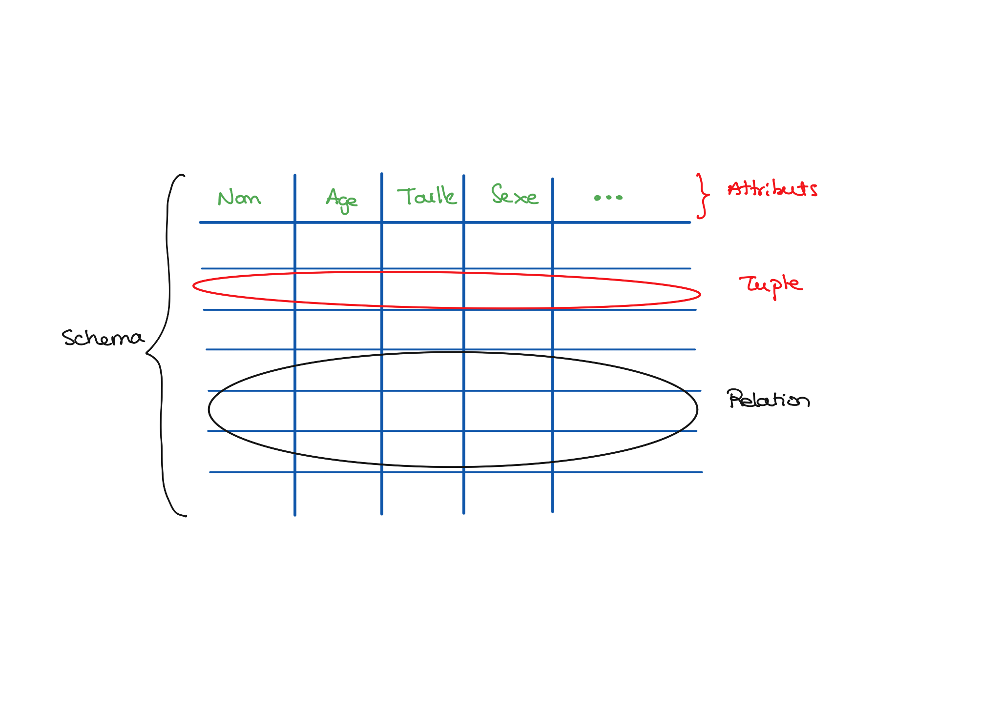



- Un POK très complet sur les bases de donnée : [Lien vers le POK](https://francoisbrucker.github.io/do-it/promos/2024-2025/Matthieu-Dufort/pok/temps-1/)
- Un MON sur les bases de données non relationnelles : [Lien vers le MON](https://francoisbrucker.github.io/do-it/promos/2022-2023/Varnerot-Antoine/mon/bdd-non-relationnelles/)




- **[1]** Qu’est-ce qu’une base de données. https://www.oracle.com/fr/database/definition-base-de-donnees/. 
- **[2]** Cours sur les bases de données : "Bases de données", Catherine Jazzar
- **[3]** Introduction [La théorie de la normalisation relationnelle]. https://stph.scenari-community.org/bdd/nor1-lin/co/nor_1.html.


## Les fondamentaux : que sont les BDD ? Comment les représenter ?
**Définition :** Une base de données est un ensemble d'informations qui est organisé de manière à être facilement accessible, géré et mis à jour. Elle est utilisée par les organisations comme méthode de stockage, de gestion et de récupération de l’informations. 
Les données sont organisées en lignes, colonnes et tableaux et sont indexées pour faciliter la recherche d'informations. Les données sont mises à jour, complétées ou encore supprimées au fur et à mesure que de nouvelles informations sont ajoutées. Elles contiennent généralement des agrégations d'enregistrements ou de fichiers de données, tels que les transactions de vente, les catalogues et inventaires de produits et les profils de clients.[1]

L'ensemble de ce MON se base sur la connaissance du modèle relationnel.

Ressource : [*Théorie et exercices*](https://stph.scenari-community.org/bdd/nor1-lin/co/nor_1.html) Ce site internet fournit un cours intéressant sur le modèle relationnel et propose des exercices d'applicaton intéressants.  
***Attention :*** Certaines explications sous flous et le cours se comprend véritablement grâce aux exercices d'application.
#### **Notions à connaître :**

Notions générales :
- Attribut
- Schema
- Relation  

Modèle relationnel : 
- Dépendance fonctionnelle
- DFE : Dépendance fonctionnelle élémentaire
- Axiomes d'Amstrong
- Fermeture transitive
- Couverture minimale
- Formes normales : 1FN, 2FN, 3FN
- Clé primaire
 


### Réprésentations
On peut représenter un schéma ou une relation de multiples façons.  
- **Entité/association :** Permet de représenter la relation de manière schématique.  
- **Représentation UML :** Permet de représenter la relation de manière schématique et normée.  
- **Schema relationnel :** Permet de représenter la relation sous forme analytique : Eleve(nom, prénom, niveau, GPA).

## Démarche de construction

### 1. Représentation schématique : modèle entité/association

**Objectif :** Représenter graphiquement les données et les besoins de relations entre les données. Pour cela on réfléchit aux différents liens entre attributs : quelles entités sont reliées entre elles et comment ?

- **Ellipse :** Attribut
- **Rectangle :** Entité - Correspond à une relation ou un schéma en fonctiond des cas.
- **Losange :** Association - Représente les liens entre les différents schémas ou relations.
- **[a;b] :** Cardinalité - Accompagné d'un verbe ou d'un adjectif, indique le nombre d'éléments impliqués par une association. La cardinalité se lit de gauche à droite pour l'entité considérée. *Ex : 1 équipe possède 1 à N coureurs ; 1 coureur appartient à 1 équipe ; 1 coureur participe à 0,1,.., ou N étapes.*
- **Attributs soulignés :** Clé primaire de la relation. C.f. ressources ci-avant.



Exemple extrait du cours "Bases de données" de C. Jazzar, page 65


Il faut s'assurer que les clef primaires soient bien définies (C.f. **[2]** et **[3]**).


 
Le modèle UML permet de représenter les interactions entre les schémas et les relations avec une méthode précise. Toutefois, il me semble moins pertinent dans une phase de conception de base de données que le modèle entité/association car moins différenciant visuellement.


### 2. Traduction dans le modèle fonctionnel
#### 2.1. Cas général
- Chaque entité est un schéma. On différencie la clé primaire en la soulignant.
- Chaque association devient un schéma qui ne possède pas de clé primaire. A la place on ajoute les clés primaires des entités rattachés, en les soulignant en pointillés. Ils deviennet des **clés étrangères**.
#### 2.2 Cas de la cardinalité [1,1]
Si une entité possède une **cardinalité [1,1]** alors on ne créera pas de relation pour l'association correspondantes. A la place, cette entité recevra les attributs directement connectés à l'association, ainsi que la clé primaire de l'autre entité en tant que clé étrangère.
### 3. Normalisation
En se basant sur les définitions et les principes énoncés en partie *"Les fondamentaux"*.
#### 3.1. Si les clefs ne sont pas définies ou vérifiées : construction des relations
- Définir une ou la **fermeture transitive**. Permet de lister toutes les dépendances fonctionnelles à disposition.


Ne pas oublier les différentes formes possibles de dépendances fonctionnelles : X => Y **OU** X,Y => Z **OU** X => Y,Z dans le cas de seulement 3 attributs.


- Définir un ou la **couverture minimale**. Permet d'identifier les dépendances fonctionnelles indispensables.
- Définir la ou les **clés candidates**. Pour cela, on se base sur la fermeture transitive : *Quelles dépendances fonctionnelles englobent le plus d'attributs ?"
- Choisir la **clé primaire**.

#### 3.2. Définir la norme et normaliser

**1FN : Première forme normale**  
     ¤ *Vérifier* : Existence d'une clef **&** aucune dépendance non fonctionnelle (un antécédant => une image)  
     ¤ *Normaliser* : Ajouter des attributs en antécédant de la relation afin d'en faire une fonction.

**2FN : Deuxième forme normale**  
     ¤ *Vérifier* : 1FN **&** tout attribut qui n'est pas dans une clef ne dépend pas que d'une partie d'une clef.  
     ¤ *Normaliser* : Décomposer la relation en plusieurs "sous-relations".


Pour éviter toute perte d'information, il peut être nécessaire de créer une relation liant les clés primaires des sous-relations.


**3FN : Troisième forme normale**  
     ¤ *Vérifier* : 2FN **&** toutes les DFE (dépendances fonctionnelles élémentaires) allant vers un attribut qui n'est pas dans une clé proviennent d'une clef.  
     ¤ *Normaliser* : Décomposer la relation en plusieurs relations ou compléter la clef par un autre attribut.


En ajoutant un attribut à une clef, il est possible de perdre la 2FN !!
