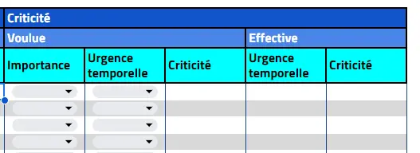


**Niveau :** Basique +  
**Pré-requis:**
- Connaissance de base de Google AppScript, de Google Sheet et de Google Drive.
- Connaissance de base des enjeux de la compétence individuelle en entreprise.


- [MON sur les fonctionnalités de Google AppScript](https://francoisbrucker.github.io/do-it/promos/2024-2025/Damien-Wolbert/mon/temps-1.2/)



[1] **DEJOUX, Cécile.** *Gestion des compétences et GPEC*, 2ème édition, DUNOD, 2013, Les topos

[2] **QUINN James Brian, ANDERSON Phili & FINKELSTEIN Sydney.** *La gestion du capital intellectuel : Comment tirer le meilleur parti des meilleurs*, Editions d'Organisation, 1996.

[3] CEDIP, Secrétariat Général-DRH-. « Compétences individuelles et collectives ». *Secrétariat Général - DRH - CEDIP*, 2 août 2022, https://www.cedip.developpement-durable.gouv.fr/competences-individuelles-et-collectives-a2141.html.

[4] **ARDOUIN, Thierry** *INGENIERIE DE FORMATION : Intégrez les nouveaux modes de formation dans votre pédagogie*, 5ème édition, 2017, DUNOD, Collection formation.



## Contexte

J'ai souvent constaté que le sujet du suivi des compétences des membres d'une orgnanisation est à la fois critique et délicat.
| Contexte | Structure | Observations |
|----------|-----------|--------------|
| Responsable RSE et chargé de mission SI | KSI Centrale Marseille | Les compétences ne sont pas clairement identifiées ou suivies dans chaque pôle. Ce qui rend plus difficile la formation et donc l'activité de la structure ainsi que les passations entre mandats.|
| Stage employé polyvalent | Mairie de Lunel-Viel (34) | Les managers ne connaissent pas les compétences nécessaires ou détenues par les personnes à leur charge. Ils n'ont donc pas de visibilité sur toutes leurs activités réalisables ou non par leurs services. |
| Alternant ingénieur électricien | Service support électricité, Engie Renouvelables | Le manager ne connait pas les réelles compétences de ses agents, ce qui le contraint à les laisser gérer et chosisir leurs missions et projets. Cela déséquilibre complètement le service (*ex : travail sur le même sujet en parralèle*) et bloque toute possibilité de pérennité de la compétence au sein du service (aucun pré-requis ou plan de formation). |

Je trouve donc intéressant de me plonger dans ces problèmatiques afin d'analyser d'où proviennent les points de blocages des structures dans lesquelles j'ai évolué et proposer une solution simple pour résoudre ces porblèmes.

D'autre part, je n'ai jamais pû approfondir l'utilisation de Google Appscript et de toutes possibilités offertes par Google Drive. Je pourrai donc réaliser un certain nombre de parallèles entre ce language de programmation et mes connaissance de VBA (Visual Basic for Application) sur Excel.

## Cadrage

### Objectifs principaux

1. Identifier les enjeux du monitoring des compétences.
2. Identifier les fonctionnalités indispensables à l'implémentation d'un tel outil.
3. Identifier un format et une interface adaptés au plus grand nombre d'utilisateurs, en utilisant des fonctionnalités simples de la suite Google.
4. Identifier une architecture robuste sur Google Drive permettant d'ajouter des foncitonnalités au fur et à mesure.
5. Livrer une maquette fonctionnelle et testée à la fin des 20 heures allouées au POK.

### Monitoring du projet

Le suivi du projet a été réalisé sur un outil personnel développé spécialement pour le suivi des POK et MON. Le contenu est reporté ci-dessous.

#### Back-log

##### Sprint 1

**To-do**

- [x] Recueillir des informations sur le monitoring et le management de la compétence dans la littérature.
- [ ] Recueillir les besoins de différents acteurs responsables du suivi de la montée en compétence des membres de leur organisation.
  - [x] Au sein de KSI Centrale Marseille.
  - [ ] Au sein de différents service d'Engie Renouvelables.
  - [x] Au sein d'une organisation du secteur publique (TBD)
  - [x] Au sein d'une structure de formation.
- [ ] Analsyer les données recueillies à l'étape 2 et réaliser le cahier des charges de l'outil.
- [ ] Réaliser l'architecture fonctionnelle de l'outil.
- [ ] Préparer et tester les templates utilisés sur Google Sheet et/ou Google Doc et/ou Google formular.

**Horodatage**

| Date | Heures passées | Indications | Niveau d'efficacité |
| -------- | -------- |-------- | -------- |
| 11/09/2024 | 0.7h | Cadrage | Intermédiaire |
| 11/09/2024 | 2h | Recherche bibliographique | Elevé |
| 12/09/2024 | 1h | Création d'un questionnaire pour reccueil du besoin | Elevé |
| 13/09/2024 | 0.5h | Tentative de communication avec le responsable du référentiel centralien à Centrale | Elevé |
| 16/09/2024 | 1h | Finalisation du questionnaire + envoie | Elevé |
| 16/09/2024 | 3.7h | Recherches bibliographiques | Elevé |
| 18/09/2024 | 2h | Mise en forme du sprint sur le site Do-It | Elevé |

***Total du sprint :*** *11 heures soit 10% de plus que le temps demandé*  

##### Sprint 2

**To-do**
- [x] Analyser les réponses du questionnaire
- [x] Lister et hiérarchiser les fonctionnalités nécessaires
- [x] Réaliser l'architecture générale de l'outil
- [x] Réaliser l'architecture relative à la gestion des collaborateurs
  - [x] Architecture de l'outil de suivi général
  - [x] Architecture des bases de données relatives aux collaborateurs
- [ ] Realiser l'architecture relative à la gestion de la compétence
  - [ ] Architecture de l'outil de création de référentiels de compétences
  - [ ] Architecture des bases de données relatives aux compétences
- [x] Créer les templates individuels
- [x] Créer le document de suivi général
- [ ] Créer le document de création de référentiel métier
- [x] Coder les fonctions de création relatives à la structure (profiles, postes, équipes, services)
- [ ] Coder les fonctions de modification relatives à la structure (profiles, postes, équipes, services)
- [ ] Coder les fonctions de création relatives aux compétences
- [ ] Coder les fonctions de modification relatives aux compétences

**Horodatage :**
| Date | Heures passées | Indications | Niveau d'efficacité |
| -------- | -------- |-------- | -------- |
| 07/10/2024 | 0.5h | Cadrage du sprint 2 | Elevé |
| 14/10/2024 | 7h | Architecture générale, architecture collaborateurs, architecture bases de données, templates individuels, document de suivi général, fonctions de création pour la structure | Elevé |
| 15/10/2024 | 3,5h | Correction fonctions de création, amélioration templates individuels, tests | Elevé |
| 16/10/2024 | 3,5h | Rédaction sur site de Do_It, derniers tests, REX | Elevé |  
***Total du sprint 2 :*** *14 heures soit 40% de plus que le temps demandé*  

**TOTAL POK 1 :** *25 heures soit 25% de plus que le temps demandé*


## I. Les enjeux du suivi de la compétence individuelle

### I.1. Définitions et caractérisation

Dans son ouvrage *INGENIERIE DE FORMATION : Intégrez les nouveaux modes de formation dans votre pédagogie*, T. ARDOUIN explique que la définition même du mot compétence crée le débat. Il en donne la définition suivante à la page 119 :


**Déf. 1 :** La compétence est la mise en oeuvre de capacités en situation professionnelle qui permet d'exercer convenablement une fonction ou une activité. [4].


D'autre part, Cécile DEJOUX dans son ouvrage *Gestion des compétences et GPEC* sépare dès la définition, compétences individuelles, collectives, organisationelles et territoriales. Dans ce contexte nous noterons la définition suivante :


**Déf. 2 :** La compétence individuelle est la combinaison d'un ensemble de connaissances, savoir-faire et d'aptitudes qui dans un contexte donné, permettent d'aboutir à un niveau de performance attendu et validé.


Lors de l'étude du besoin détaillée plus bas, j'ai demandé aux personnes intérrogées : Comment définissez vous "compétence individuelle" ? Il est intéressant de noter la pluralité des réponses et des points de vue.


- *Savoir faire acquis par l'apprentissage ou la pratique*
- *Aptitude à une tâche d'un individu*
- *Un savoir-faire, quel qu'il soit (et pas juste un savoir)
- Capacité technique ou fonctionnelle qui s'acquiert suite à formation ou expérience qualité humaine*
- *Une qualité qui n'implique que la personne à qui elle est attribuée*
- *Comme une aptitude me concernant uniquement*
- *Un savoir acquis ou développé qui apporte une plus value collective*


Je trouve la définition De C. DEJOUX intéressante car elle montre la diversité des compétences dans leur typologie. Dans son ouvrage [4] elle caractérise la compétence individuelle par 6 points :
1. **Savoir-agir** : Prend son sens par rapport à une action.
2. **Finalisée** : Prend son sens par rapport à un objectif et un résultat. On peut les mesurer et la normer.
3. **Combinatoire** : Se divise et sous-devise en unités.
4. **Contingente** : Dépends des outils et des conditions disponibles lors de sa mise en place.
5. **Dynamique** : Evolue continuellement.
6. **Reconnue collectivement** : Reconnue par un statut, une valeur financière...

D'autre part, elle met en avant la dépendance de la compétence au contexte, au lieu, à la structure. Comme une compétence est reconnue collectivement, sa défintion et sa valeur varient en fonction du temps et de l'espace.


Il faudra donc permettre à l'utilisateur de garder une grande flexibilité dans la façon de définir les compétences.


Elle définit alors 4 catégories :
1. ***Les savoirs*** : Connaissances théotiques de base, souvent associés à des diplomes ou des certificats. **ATTENTION : Je trouve que cette limitation aux diplômes dépend de la culture du pays et de l'organisation que l'on considère.**
2. ***Savoirs-faire*** : Aptitudes pratiques, capacité à maitriser quelque chose, à rendre le savoir opérationnel.
3. ***Savoir être*** : Aptitude sociale, innée ou acquise ; compétence comportementale interpersonnelle.
4. ***Compétences émotionnelles*** : Conscience et maitrise de soi et de ses relations avec les autres. Capacité à percevoir les émotions, les exprimer, les intégrer dans un processus de pensée, de compréhension, de raisonnement.


Il faudra permettre à l'utilisateur de classer les types de compétences tout en fournissant un guide de classification.


Cette dernière classification ne permet cependant pas à un manager de prioriser facilement une compétence au profit d'une autre (pour le recrutement ou la formation interne par exemple). On s'aperçoit notamment quand la caractérisation de C. DEJOUX, deux autres échelles sont à définir :

**Une échelle d'acquisition, de maitrise (caractéristique n°2):**
Au delà d'une échelle d'acquisition de la compétence, quantitative ou qualitative, il peut être intéressant de considérer le niveau d'autonomie d'un individu quant à la mise en application de cette compétence. Dans son ouvrage, T. ARDOUIN définit en page 120, 3 niveaux :
- A : Assiste et applique - Reproduction d'activité envisagées et organisées par d'autres.
- B : Intervient et produit - Production de donnée ou de modes de travail.
- C : Anime et conçoit - Réalisation de mode de travail et de donnée avec la responsabilité d'animé débats et groupes de travail.


Il pourra être pertinent de mettre en place une échelle d'autonomie face à la tâche.


**Une échelle de reconnaissance (caractéristique n°3) :**
Dans un article *Compétences individuelles et collectives* [3] du ministère de la transition écologique et de la cohésion des territoires, nous pouvons trouver des ressources présentant la compétence individuelle comme critique pour une organisation. Ainsi, on peut les classer à la fois par raport à son utilité immédiate mais aussi par rapport à son utilité stratégique, à moyen et long terme. 


Il faudra permettre à l'utilisateur de définir des échelles d'importance actuelles et stratégiques.


### I.2. Notions et outils à considérer

Mes recherches bibliographiques indiquent que certains outils sont a priori indispensables au suivi correcte de la compétence individuelle.

#### Référentiel métier et référentiel de compétence

D'après l'ouvrage *INGENIERIE DE FORMATION : Intégrez les nouveaux modes de formation dans votre pédagogie*, des outils importants du suivi de la compétence sont le référentiel métier et le référentiel de compétence. Le second découlant du premier ce qui donne parfois lieu à l'élaboration d 'un référentiel de compétence-métier.


**Référentiel métier :** Description d'un poste tel qu'il est occupé et tel qu'il devrait être occupé d'après la vision stratégique de l'entreprise. 
Il définit notamment 4 types d'éléments :
- ***Missions*** : Finalité de l'emploi, indique le servie rendu à l’entreprise. Objectif de l’emploi par rapport à l’unité (équipe, service, etc…) dont il fait partie.
- ***Fonctions*** : Combinaison d’activités par thématique ou unité logique. *Ex : Suivi des intervenants pour le responsable activité commerciale de KSI Centrale Marseille.*
- ***Activités*** : Ce que doit faire la personne, exprimé sous forme de verbe d’action. Regroupe les tâches de même type.
- ***Tâches*** : Opérations élémentaires à effectuer à son poste de travail.


**Référentiel de compétence :** Déclinaison du référentiel métier en élements observables en fonction d'une méthode définie.
La méthode de définition des compétences est intrinsèque à la structure et à son activité.



Le cahier des charges fonctionnel devra détailler et justifier une méthodologie de réalisation des référentiels métier chaque poste **ET** permettre une armonisation entre uex.


## II. Besoin fonctionnel

### II.1. Présupposés du besoin : cahier des charges préliminaire

La recherche bibliographique que j'ai réalisée m'a amené identifier plusieurs types de besoins : Esthétisme & accès et Fonctions.

#### A. Besoin esthétiques et accessibilité

| Id | Nom | Description |
|----|-----|-------------|
|**A.1.**| **Accessibilité administrateur** | **Informations visuelles, architecture simple, outil facilement pris en main.**|
|**A.2.**|**Accessibilité collaborateurs**| **Accès facile, présentation rapide des informations importantes.**|

#### B. Besoin fonctionnel

| Id | Nom | Description |
|----|-----|-------------|
|**B.1.** | **Besoin administrateur** | |
|B.1.1.| Référentiel métier et référentiel compétence | Pouvoir définir et modifier facilement le référentiel de compétences-métier de chaque collaborateur en armonisant la méthode de défintion des compétences. |
|B.1.2.| Suivi individuel | Visualiser les compétences de chacun des collaborateurs sur un fichier dédié en indiquant des niveaux d'évaluation pertinents et des objectifs temporels d'évolution |
|B.1.3.|Altertes||
|*B.1.3.1*|*Assurer un suivi régulier*|*Alerter les adminstrateurs lorsque le suivi d'un collaborateur n'a pas été réalisé depuis longtemps.*|
|*B.1.3.2*|*Suivi des objectifs temporels*|*Alerter les adminstrateurs lorsque les échéances fixés sont imminentes.*|
|B.1.3.|Plan de développement individuel|Permettre la mise en place d'un plan de développement individuel pour chaque collaborateur|
|B.1.4.|Dashboard|Fournir un tableau de suivi général des services présentant les informations pertinentes pour un suivi régulier|
|**B.2.**| **Besoin collaborateur**| |
|B.2.1.|Consultation|
|*B.2.1.1.*|*Consultation du référentiel métier*|*Possibilité de consulter son référentiel de compétence avec suffisamment d'information et de clareté, sans pouvoir le modifier directement*|
|*B.2.1.2.*|*Consultation des niveaux de compétences*|*Possibilité de consulter l'évaluation du niveau de chacune de ses compétences ainsi que les échéances correspondantes, sans pourvoir la modifier directement.*|
|*B.2.1.3.*|*Consultation du plan de developpement individuel*|*Possibilité de consulter sont plan de développement individuel.*|
|B.2.2.1.|Demandes|
|*B.2.1.1.*|*Consultation du référentiel métier*|*Pouvoir réaliser une demande de formation*|
|*B.2.1.2.*|*Consultation du référentiel métier*|*Pouvoir réaliser une demande de modification de son référentiel de compétence-métier.*|
|*B.2.1.3.*|*Consultation du référentiel métier*|*Pouvoir réaliser une demande de modification de son plan de développement individuel.*|

### II.2. Etude du besoin auprès d'usagers potentiels

Afin de réaliser un outil adaptable à plusieurs organisations et de hiérarchiser les fonctionnalités par importance, j'ai pris l'intiative de réaliser une étude sur le terrain. Par soucis de temps, je me suis orienté vers un format de formulaire en ligne.

#### Questionnaire


**Réponses :**
- *Savoir faire acquis par l'apprentissage ou la pratique*
- *Aptitude à une tâche d'un individu*
- *Un savoir-faire, quel qu'il soit (et pas juste un savoir)
- Capacité technique ou fonctionnelle qui s'acquiert suite à formation ou expérience qualité humaine*
- *Une qualité qui n'implique que la personne à qui elle est attribuée*
- *Comme une aptitude me concernant uniquement*
- *Un savoir acquis ou développé qui apporte une plus value collective*

On constate qu'une réponse sur deux concerne un savoir-faire. En outre, les notions de qualité humaine, d'individualité et de plus-value interveniennent. On peut donc vérifier que le concept de compétence individuel ne fait pas intervenir les mêmes enjeux dans le raisonnement de chaque personne. Il pourra donc être pertinent de segmenter lest ypologies de compétence : métier, personnelles (dites "propres" dans la suite du projet) et humaines.




*Oui*


50% des participants estiment qu'une certification valide la détention d'une compétence. Il pourra donc être intéressant de faire apparaitre une notion de preuve d'acquisition dans l'outil, permettant de passer outre la notion de certification.





*Oui*


62.5% des participants (5/8) estiment qu'un diplôme ne permet pas de valider une compétence. Il est intéressant de noter que hormis une personne, les participants ont répondu de la même façon qu'à la question précédente.





*Non*


Oui : 50%
Non : 50%
Le réseau et les recommandations peuvent donc influer dans la validation d'une compétence. Dans une version plus avancée, un outil de gestion de la compétence pourrait aussi faire intervenir cette notion de recommandation par un tiers. Cela permettrait tout d'abord d'affirmer ou d'infirmer la recommandation, ensuite, d'anticipier l'évolution de certains collaborateurs.





*Oui*


Oui : 5/8
Non : 3/8
Il semble que l'expérience sur le terrain témoigne d'une plus grande légitimité qu'un diplôme ou une certification.





*Non*


Non : 100%





*Essentiellement non*


75% (6/8) des interrogées n'utilisent pas de référentiel de compétence dans leur organisation. 1 des interrogés ne sait pas à quoi cela correspond.





- Tableau de suivi


Les fonctionnalités porposées qui se sont le plus distinguées sont :
- La posisbilité de réaliser un plan de formation individuelle.
- La possibilité de construire des référentiels compétence-métier.




- Pouvoir fair eune distinction entre compétences apprises et maitrisées
- Pouvoir bénéficier de deux interfaces : manager et managé
- Pouvoir déterminer rapdidement qui possède une compétence déterminée et cartographier les compétences
- S'appuyer sur des exemples concret


### II.3. Formalisation du besoin fonctionnel

Par soucis de temps et afin de construire une maquette fonctionnelle à la fin du temps alloué au projet, il est nécessaire de hiérarchiser les fonctions et de définir celles qui sont indispensables. Le classement ci-dessous a été réalisé en prenant en compte l'importance de la fonction, la difficulté technique de réalisation et la vision à long terme d'implémentation progressive de l'outil.

#### Fonctionnalités indispensables
- Création et modification d'un profile pour chaque collaborateur
- Création et modification de profiles administrateurs
- Suivi des compétences acquises et à acquérir
- Adapatation de l'outil à la structure concernée
- Permettre de s'appuyer sur des exemples concrets : évaluer l'acquisition par l'exemple.
#### Fonctionnalités souhaitables
- Création de référentiels de compétences-métier
- Tableau de bord permettant de visualiser l'avancement des équipes.
- Profil individuel consultable par les collaborateurs
#### Fonctionnalités additionnelles
- Lier les compétences entre elles : déterminer les possibilités données par l'acquisition d'une compétence afin de construire un parcours de formation.
- Faire apparaitre de manière explicite la dernière formation en date de chaque collaborateur
- Identifier les lacunes e chaque collaborateur
- Cartographier les compétences afin de pouvoir répondre aux questions : "Qui sait faire quoi ?" et "Qui sait faire cela ?"

## III - Outil global

[Lien vers la V0](https://docs.google.com/spreadsheets/d/1crOzv51Mt0-jJi2xNZKXNoEiwMz2lBXg7hcZI-SBvUA/edit?usp=drive_link)
[Lien vers le github](https://github.com/DamienWolbert/POK-1---Gestion-de-la-comp-tence)

### III.1 - Architecture générale
L'outil sera construit de sorte à limiter le nombre de programmes à utiliser. Cela passera par la mise en place de modèles de type GSheet. Ces différents modèles graviteront autours d'un fichier centrale regroupant les bases de données et les principales fonctionnalités de personnalisation, suivi et modifications. Toutefois, réalisant une V0 de l'outil, nous considérons les collaborateurs regroupés en équipes, elle-mêmes regroupées en services.
 

### III.2 - Document de suivi général
Le document de suivi général doit regrouper :
- Les fonctionnalités de création et modification des informations de la structure (profiles, équipes, services, postes)
- Les fonctionnalités de création et modification des informations concernant les compétences.
- Toutes les bases de données.
Actuellement, ce document comporte les éléments suivants :

L'onglet ***New*** correspond, à cet étape du projet, aux fonctionnalités correspondant à la structure.  


[Lien vers le document de suivi général](https://docs.google.com/spreadsheets/d/1crOzv51Mt0-jJi2xNZKXNoEiwMz2lBXg7hcZI-SBvUA/edit?usp=sharing)


## IV - Gestion des collaborateurs

### IV.1 - Structure des bases de données

|Nom de la base|Attributs|
|--------------|---------|
|BDD_Postes|Id, Id_service, Id_equipe, Nom|
|BDD_Equipes|Id, Nom, Id_Service, Id_responsable|
|BDD_Services|Id, Nom, Id_responsable|
|BDD_RH|Id, Nom, Prénom, Id_Service, Id_equipe, Id_poste, URL_fiche_perso|
|BDD_Admin|Id_Id_RH|

### IV.2 - Fiche individuelle

[Template d'une fiche individuelle](https://docs.google.com/spreadsheets/d/1jz4QhZDmInLyTs9LAemzIZA6sGFmrF87wcNzQJi8ugY/edit?usp=sharing);


Une fiche individuelle possède 4 éléments principaux :
- Une synthèse permettant de regrouper toutes les informations importantes sur les compétences et objectifs du collaborateur. (Peu de fonctionnalités présentes pour le moment)
- 1 onglet de suivi des compétences propres
- 1 onglet de suivi des compétences métier
- 1 onglet de suivi des compétences humaines

Cette séparation en 3 onglets distincts permettra à terme de modifier les compétences métier d'une personne en cas d'évolution de poste, tout en gardant un accès aux compétences plus globales qu'il a acquises (permis, certification, gestion de projet etc...). De plus, réaliser une remise à zéro des compétences métier lors d'un changement de poste poussera le collaborateur et les administrateurs de l'outil à ré-évaluer les compétences déjà détenues par le prisme du nouveau poste.

Comme visible sur la figure précédente, une compétence est définie par un N°, un nom et une description. L'utilisateur peut définir un nombre de paliers d'acquisition entre 1 et 5 et visualiser l'avancement.  
Pour chaque palier, il peut indiquer la date à laquelle il souhaite que le niveau de compétence soit maitrisé, la date à laquelle il est maitrisé ainsi qu'une typologie de preuve d'acquisition (diplôme, certificat ou expérience).

L'utilisateur peut également saisir une importance et une urgence temporelle pour chaque compétence (Criticité voulue) et vérifier la cohérence des choix des objectifs définis par les paliers (Criticité effective). La criticité effective calcul les temps restant pour l'acquisition des différents niveaux de compétences, et définis l'ugence temporelle porportionnellement à l'écart entre l'échéance la plus courte et l'échéance la plus longue.

Pour se faire, il a été nécessaire de créer des onglets "Back-end", pour réaliser les opérations permettant le calcul évoqué précédemment.

A terme, il faudra envisager de cacher les feuilles de back-end afin de s'assurer que les utilisateurs ne les modifient pas.

### IV.3 - Fonctionnalités
L'onglet ***New*** regroupe les outils suivants :
- Création d'un service
- Création d'une équipe
- Création d'un poste
- Création d'un profile individuel
Comme la plupart des bases de données sont liées, il n'est pas encore possible de créer la totalité des ces éléments de manière complète. En effet, comme les fonctions de modification restent à créer, il manquera au moins un élément, d'au moins un attribut : 
*Exemple : Si nous créons un service, sans avoir préalablement crée de profile, nous ne pourrons pas associer de responsable au service. De même, si nous créons un poste sans avoir créé de service, nous ne pourrons pas affecter de service à ce poste.*

Il n'est pour l'instant pas possible de modifier les informations renseignées autrement qu'en modifiant manuellemnt les bases de données. A terme, l'objectif serait de dupliquer ***New***, de créer des fonctions permettant d'importer les informations présentes dans les bases de données et de créer des fonctions mettant à jour les nouvelles informations entrées par l'utilisateur.  
*Estimation du temps de l'opération : 4 à 5 heures*

## REX

### REX Sprint 1

**GESTION DU TEMPS :** Je pense avoir commencé à travailler sur le POK trop tard, ce qui m'a obligé de condenser mes séances de travail juste avant la deadline.  

**PROGRAMMATION DES TACHES :** Je n'ai pas pris en compte le temps additionnel que prenait la répoonse à une enquête. Ainsi, j'aurais dû d'abord me concentrer sur la conception du formulaire afin de les envoyer le plus rapidement possible.  

**DIMENSIONNEMENT DU PROJET :** Je pense que ce projet est trop ambitieux pour ne solliciter que 10 heures de travail. L'origine de cette erreur de jugement provient sûrement d'une fausse impression de maitrise du sujet. En effet, je ne pensais pas que la recherche documentaire et l'approfondissement du sujet me prendrait autant de temps.  

### REX Sprint 2

**GESTION DU TEMPS GENERALE :** J'ai entammé le sprint 2 beaucoup trop tard. En effet, je me suis basé sur le temps alloué au projet (10h) et pas au temps que le projet tel que défini allait me prendre.  

**GESTION DU TEMPS DE PROGRAMMATION :** La programmation des différentes fonctions et des templates m'a pris plus longtemps que prévu. En effet, bien que mon MON 1.2 m'ait permis de mieux maitriser Google AppScript, j'ai surestimé mes capacités.  

**PROGRAMMATION DES TACHES :** Comme pour le sprint 1, je n'ai pas pris en compte le temps pris par la propagation et l'étude d'un questionnaire. De plus, je n'ai pas pris le temps de relancer d'autres participants potentiels, ce qui a aboutit à un questionnaire peu exploitable, du fait du nombre de réponses. En effet, j'espérais pouvoir récolter une vingtaine de réponses alors que je n'en ai reçu que huit.  

**DIMENSIONNEMENT DU PROJET :** Comme au temps 1, le projet est trop ambitieux pour tenir en 20 heures. Pour le réaliser tel qu'envisagé en début de cadrage, j'estime qu'il me faudrait un total de 30 à 40 heures supplémentaire en omettant le reporting à réaliser sur le site Do-It.

### Pistes d'amélioration pour le POK 2
1. Revoir à la baisse l'objectif des projets.
2. Commencer les sessions de travail en début de temps/demi-temps.
3. Cibles 3 petirs objectifs SMART dès le début du projet et les hiérarchiser.
4. Réaliser un rétroplanning afin de déterminer les ressources temporelles réelles ET DEFINIR COEFFICIENT DE CORRECTION POUR ANTICIPER LES IMPREVUS.
5. Réaliser le reporting sur le sie Do-it au fur et à mesure : à la clôture de chaque bloc/sous-bloc du WBS OU toutes les n-heurs de travail.
6. Ne pas sous-estimer le temps pris par le recueil de données, de témoignages ainsi que le temps de traitement de la donnée récupérée.