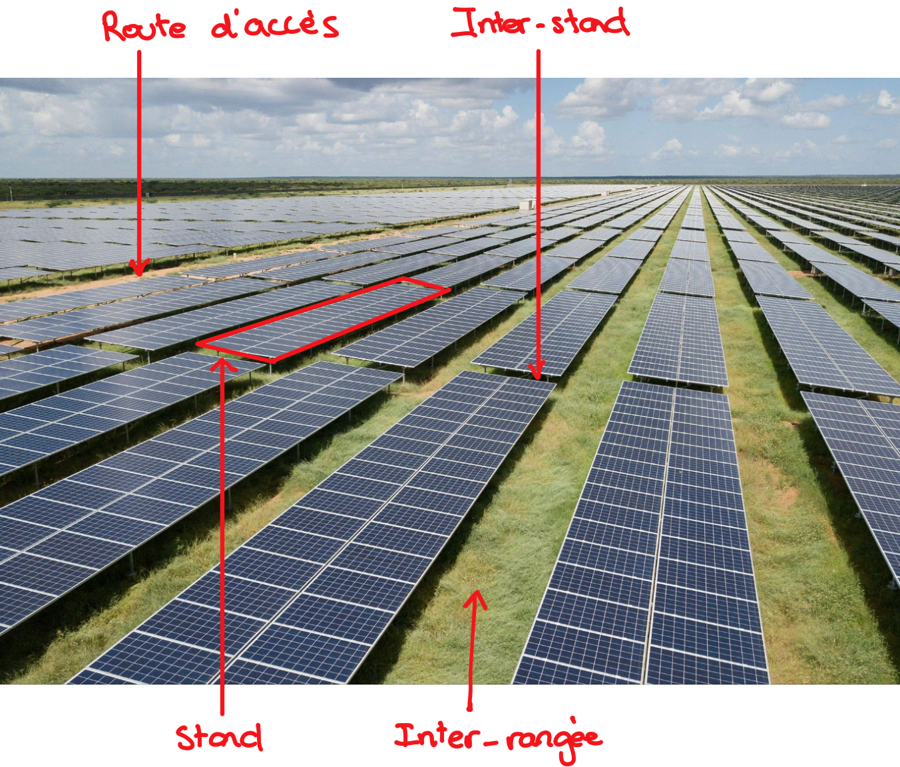
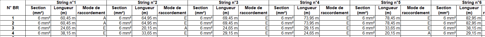



- Programmation en VBA.
- Connaissance de la structure générale d'un parc solaire.



- Fichier Excel à la fin du sprint 1 : [Fichier .xlsm à télécharger](./Sprint%201.zip)
- Fichier Excel à la fin du sprint 2 : [Fichier .xlsm à télécharger](./Sprint%202.zip)


## Cadrage

### Objectifs principaux

1. Réussir à modéliser de manière graphique et visuelle un parc photovoltaïque.
2. Mettre en place un parcours utilisateur simple et agréable.
3. Ajuster le niveau de précision des estimations et outils au temps alloué au projet.

### Monitoring du projet
#### Back-log et horodateur


- [x] Réaliser le cadrage du projet
- [x] Sprint backlog 1
- [x] Brainstorming général
- [X] Recueillir le besoin
- [x] Lister les fonctionnalités principales du système
- [x] Parcours utilisateur rapide
- [x] Définir une première version des interfaces entre le système et l'utilisateur
- [x] Lister les données d'entrées
- [x] Trame des templates de chacune des interfaces
- [x] Trame du template des données de sortie
- [x] Mise au propre des templates des données d'entrée
- [x] Mise au propre des templates des données de sortie
- [x] Rédaction des fonctions permettant la création des templates de grille.
- [x] Rédiger le sprintbacklog 1 sur le site do-it
- [x] Rédiger le CR du sprint 1 sur le site Do-it

| Date | Heures passées | Indications | Niveau d'efficacité |
| -------- | -------- | -------- | -------- |
| 04/11/2024 | 0.5h | Cadrage projet |
| 05/11/2024 | 0.5h | Recueil du besoin auprès d'ingénieurs et projeteurs électriciens |
| 06/11/2024 | 0.5h | Recadrage du projet et rédaction des premières hypothèses fortes. |
| 12/11/2024 | 0.25h | Mise à jour du sprint back-log 1 |
| 12/11/2024 | 3.5h | Interface utilateur et essais |
| 14/11/2024 | 2.5h | Interface utilisateur et essais |
| 18/11/2024 | 2.5h | Interface utilisateur et essais |
| 18/11/2024 | 2h | Rédaction sur le site Do-it en tenant compte des nouvelles consignes. |
| 20/11/2024 | 2h | Rédaction sur le site Do-it en tenant compte des nouvelles consignes. |

***Total du sprint :*** *14h25 soit 43% de plus que le temps alloué*

Le dépassement du quota horaire est dû à la modification des consignes ayant entrainé un changement dans les attentes de rédaction et de raisonnement.





- [x] Rédaction des fonctions informatiques permettant le calcul des longueurs de câble petite section
- [ ] Rédaction des fonctions informatiques permettant le calcul des longueurs de câble grosse section
- [x] Lister les fonctions informatiques a priori nécessaires
- [x] Coder les fonctions d'extraction de donnée d'une grille à l'autre.
- [x] Coder la fonction déterminant le type de câblage des strings.
- [ ] Coder la fonction permettant le calcul des quantités de câble.
- [x] Sprint back-log 2
- [x] Reporting sprint 2 sur site Do-it
- [x] Finalisation du POK
- [x] Rédaction des slides pour revue finale

| Date | Heures passées | Indications |
| -----|----------------|-------------|
| 27/11/2024 | 2h | Sprint backlog 2 ¤ Extraction donnée phase 0 à phase 1 |
| 28/11/2024 | 0.5h | Extraction donnée phase 0 à phase 1 |
| 02/12/2024 | 1.5h | Extraction donnée phase 0 à phase 1 ¤ Extraction donnée phase 1 à phase 2 |
| 04/12/2024 | 2h | Détermination du mode de câblage ¤ Calcul des distances |
| 12/12/2024 | 2.5h | Extraction donnée phase 2 à phase 3 ¤ Extraction donnée phase 3 à phase 4 ¤ Modifications extraction de donnée phase 0 à 1 et 2 à 0 |
| 13/12/2024 | 2h | Vérification de la cohérence des résulats |
| 16/12/2024 | 2h | Reporting sur site Do_it |

***Total du sprint 2 :*** *12.5h soit  25 % de plus que le temps alloué*



**QUOTA HORAIRE TOTAL POK 2 :** 26.75h soit 34% de plus que le temps alloué


#### Analyse post-morterm



**GESTION GENERALE DU TEMPS :** Bonne estimation de la quantité de tâches pour la sprint 1. Il aurait fallu commencer directement une démarche de conception de l'interface utilisateur par l'essai, telle que définie plus bas. Cela aurait permis un gain de temps permettant d'anticiper de potentielles difficultés de programmation durant le sprint 2.  

**DIMENSIONNEMENT DU PROJET :** Projet a priori bien dimensionné. La démarche du sprint 1 va permettre une plus grande efficacité pour le sprint 2 : raisonnement à partir de connaissance détenues et pas des objectifs idéaux à atteindre. 

**DIMENSIONNEMENT DES TACHES :** Division exagérée des tâches entrainant une trop grande rigidité lors de la rédaction (à l'inverse du POK1). A la fin du sprint, toutes les tâches fixées on été réalisées, toutefois ni l'ordre ni la séparation des activités n'ont été réellement suivis.




**GESTION GENERALE DU TEMPS :** Gestion générale améliorée par rapport au sprint 1 et au POK 1. Mais sous-évaluation du temps nécessaire à la rédaction du reporting sur le site Do-it.

**GESTION GENERALE :** Oublie d'un élément de calcul (prise en compte des câbles grande section) et ce dans les templates réalisés en sprint 1 et le sprint back-log 2. Ajouter l'intégralité des tâches correctrices durant le temps 2 aurait pris environ 3 heures supplémentaires. Si l'erreur initiale n'avait pas été commise, alors j'estime une augmentation de seulement 1 heure de la charge de travail : template fait correctement en temps est en heure (peu chronophage), réflexion quant à la méthode de calcul des distances (peu chronophage car déjà mentalisé en début de sprint 1), programmation du calcul et des livrables (se serait appuyé sur le calcul des longueurs petites sections).

**DIMENSIONNEMENT DU PROJET :** Quelques fonctionnalités supprimées car trop ambitieuses pour le temps alloué.





**DIMENSIONNEMENT PROJET :** Plus réaliste qu'au temps 1 et ce grâce à la rédaction d'hypothèses simplificatrices, limitant le projet aux compétences détenues. Réel fonctionnement en mode agile : A GARDER !!  
**DIMENSIONNEMENT TÂCHES:** Plus réaliste qu'au temps 1 mais rédigées de manière trop globales et rigides (par lôts et type de fonctionnalité). In fine, les tâches on été réalisées sans respecter la même segmentation, ni la même granulosité.  
**APPROCHE METHODOLOGIQUE :** Lancement des activités par le test plutôt que par la formalisation. A permis un gain de temps et une meilleure efficacité. Le reporting des activités aurait quand même dû être plus régulier et formel afin de gagner en efficacité lors de la rédaction du livrable sur le site Do-it.



## Vocabulaire et fonctionnement d'un parc photovoltaïque

Afin de comprendre la suite de ce POK, il est nécessaire de s'intier au monde du photovoltaïque ainsi qu'à son vocabulaire. 


Le schema ci-dessous présente la configuration de parc utilisée tout au long du projet (c.f. hypothèses)

**Figure :** « «Folie» ou projet «d’intérêt général»? Un parc solaire XXL à l’étude en France ». parismatch.com, 8 février 2022, https://www.parismatch.com/Actu/Environnement/Folie-ou-projet-d-interet-general-Dans-le-sud-ouest-de-la-France-un-parc-solaire-XXL-a-l-etude-1786628.

- ***String*** : Ensemble de panneaux connectés en série.
- ***BR*** : Boite de raccordement - Organe électrique auquel sont branchés des plusieurs strings en parallèle.
- ***PTR*** : Poste de transformation - Cabinet électrique dans lequel la puissance envoyée par plusieurs BR est convertie par des onduleurs (passage de courant continu à alternatif), puis transformée par un transformateur (augmentation de la tension du signal). Les différents PTR sont connectés en série ou en parallèle au poste de livraison, interface entre le parc et les réseaux d'ENEDIS et/ou de RTE.
- ***Section de câble*** : Section transversale du conducteur d'un câbles. Les **petites sections** correspondents généralement aux câbles de 4, 6 et 10 mm² ; **les grandes sections** correspondent aux section de 185, 240, 300 et 400 mm².
- ***Stand*** : Structure soutenant les panneaux photovoltaïques. Un stand peut supporter plusieurs strings.


## Comment recueillir le besoin ?

| Etapes | Résultats | Difficultés rencontrées |
|--------|-----------|------------------------|
| Discussion avec des projeteurs électriciens et ingénieurs électriciens | Fonctionnalités principales et enjeux du dimenssionnement d'un parc | Les ingénieurs et projeteurs avaient tendance à continuellement sur-enchérir en voyant les potentialités de l'outil. Il était difficile de rester dans le cadre d'un projet de 20h. *Remarque : J'ai chosisi de recueillir ce besoin lors d'un moment informel afin de limiter au plus ce comportement. Cela c'est en effet révélé efficace.*|
| Tests et essais | Tout en appliquant les exigences recuillies précédemment, j'ai pû me rendre compte des difficultés techniques imposées par Excel et ainsi rédiger des hypothèses permettant d'ajuster le projet au cadre du POK.| Tendance à vouloir ajouter des fonctionnalités et donc de la complexité plutôt que de se focaliser sur une maquetter préliminaire.|


Un projeteur électricien est chargé de la réalisation des plans électriques globaux à partir des exigences des inégnieurs électriciens. Il produit souvent des livrables réalisés sur des logiciels comme AutoCAD.


**Hypothèses fortes :**
- Le parc n'utilise qu'une seule technologie d'onduleur : onduleurs centraux, positionnés dans les stations de transformation.
- Les rangées sont positionnées verticalement.
- Les rangées sont soit perpendiculaires soit parallèles aux routes d'accès.
- Les strings sont câblées en entérré si aucune boite de raccordement n'est présente dans l'interrangée à sa gauche ou à sa droite.
- Chaque stand ne contient qu'une seule string.
- Les tranchées solaires (tranchées pour les câbles de petite section) sont perpendiculaires aux stands et passent au niveau des inter-stands.

**Fonctionnalités principales**  
1. Positionner les éléments principaux du parcs de manière graphique en imitant un fonctionnement drag&drop :
   1. Stands
   2. Boites de raccordement (BR)
   3. Poste de transformation (PTR)
   4. Routes d'accès
2. Positionner et caractériser les différentes strings
   1. Affecter les strings aux différentes BR
   2. Sections de câble utilisées pour le raccordement des strings aux boites de raccordement.
3. Déterminer les caractéristiques de design :
   1. Méthodologie de câblage de chaque string : câblage enterrée ou aérien.
   2. Numérotation des éléments.
4. Extraire les données du design dans un tableau :
   1. Caractéristiques de raccordement de chaque string.
   2. Quantités et longueurs totales de câble.

## Comment déterminer le format de l'outil et le raisonement de calcul ?
### Démarche
Le format de l'outil doit répondre à deux critères principaux : facilité d'utilisation et rapidité de développement. 
- **Pour garantir une facilité d'utilisation** : Déterminer le parcours utilisateur en simulant la conception d'un parc photovoltaïque et en testant différentes possibilités. Ce parcours définira par la suite la stratégie de programmation.
- **Pour la rapidité de développement** : Créer des templates permettant de systématiser la méthode et d'accélérer la rédaction du code et tester au fur et à mesure les solutions techniques pouvant à la fois répondre à l'exigence utilisateur et être développée le plus rapidement possible.

### Code et programmation
Afin de créer les différents templates, j'ai rédigé des Sub VBA à partir de petits unitaires.
Exemple : afin de créer une grille satisfaisante, il était nécessaire d'évaluer manuellement la largeur des lignes et colonnes, puis de dimensionner l'intégralité des colonne via un Sub.


Les unités de dimensionnement des lignes et des colonne ne sont pas les même : une colonne de largeur 1 n'a pas la même épaisseur qu'une ligne de hauteur 1. Il est nécessaire de réaliser des opération de propotionnalités si on veut utiliser une épaisseure unitaire commune.

### Résultats
Cette démarche a permis de déterminer le parcours utilisteurs, la stratégie de programmation, les templates nécessaires et fonctionnels ainsi qu'une liste non exhaustive des fonctions à coder.

**Parcours utilisateur :** Segmentation en phases permettant l'utilisations de grilles "simples" et donc copiées depuis des templates.
| **Phase** | **Action utilisateur** | **Interface utilisateur** |
|:-----------:|:------------------------:|:---------------------------:|:-------------------------:|
| **Phase 0** | Complétions des données des équipements : dimension des stands, dimension des routes d'accès... | Template d'inputs |
| **Phase 0bis** | Ouverture de l'outil et appuie sur le bouton "Créer un nouveau design" sur la page d'accueil| Page d'acceuil |
| **Phase 1** | Positionnement des stands, des routes et du PTR | Grille template n°1 |
| **Phase 2** | Positionnement des boites de raccordement sur le modèle défini en phase 1| Grille template n°2 |
| **Phase 3** | Allocation des strings aux différentes BR sur le modèle défini en phase 2 | Grille template n°3 |
| **Phase 4** | Allocation d'une section de câble de raccordement pour chaque string sur le modèle défini en phase 3 | Grilles template n°4.1 et 4.2 |
| **Phase 5** | Lancement du calcul par un bouton de la page d'acceuil | Grilles template n°4.1 |

**Fonctions et éléments à coder :**
- Colorer des cellules en rouge, vert, marron et violet.
- Repérer l'ampleur du parc (dernière ligne et dernière colonne utilisée).
- Créer une grille de phase 2 à partir des informations la grille phase 1.
- Créer une grille de phase 3 à partir des informations la grille phase 2.
- Créer des grilles de phase 4.1 et 4.2 à partir des informations la grille phase 3.
- Parcourir une grille.
- Déterminer la méthode de raccordement d'une string en fonction de la position de la BR à laquelle elle est allouée (aérien ou enterré).
- Numéroter toutes les BR.
- Numéroter toutes les strings.
- Extraire les données de chaque string dans le tableau de sortie (lui-même réalisé à partir d'un modèle).
- Calculer une distance entre deux cellules à partir des données d'entrée (dimension des stands etc...)

Templates et modèles : les templates et modèles sont visibles dans le document [Sprint 1](./Sprint%201.zip).

## Programmation

### Méthodologie
La programmation de toutes les fonctionnalités s'est faite en suivant le chemin utilisateur : une fonction par passage d'une phase à une autre.

Bien que cette méthode permette de créer des fonctionnalités proches du besoin utilisateur, elle ne permet pas forcément d'anticiper les besoins en donnée de la suite du programme.


### Difficulté principales
Le parcours des grilles étant très couteux en temps, il est apparu primordiale d'optimiser ce dernier. Pour cela il a fallu :



**Objectif :** Eviter de devoir déterminer les premières lignes ou colonnes vides pour chaque tableau, voire chaque partie de tableau.  

**Méthode :** Dédier une cellule précise au compte des colonnes utilisées : en première ligne du tableau ou sur une ligne de rang suffisamment grand. *ATTENTION : DANS CE CAS, IL FAUT S'ASSURER QUE LE NOMBRE DE LIGNES UTIILISEES PAR UN TABLEAU EST FINI !!!*

**Exemple :**

On peut ici voir que la cellule en jaune prend comme valeur le nombre de BR déjà renseignée dans le tableau. Ainsi, la fonction chargée de remplir ces données se réfère et met à jour la valeur de cette cellule afin de pouvoir se repérer facilemment dans le tableau. Cela évite de déterminer à chaque nouvelle BR, la première colonne vide.





**Objectif :** Eviter de parcourir plusieurs grilles pour obtenir des informations ou réaliser un calcul.

**Méthode :** A chaque parcours obligatoire/inévitable, reporter les informations sur une grille regroupant toutes les données.  

**Exemple :** Ici, cela a consisté à utiliser les feuilles de la phase 4 comme bases de données.
- La dernière grille (TEM 4.1) comme base de donnée complète du design. Ainsi, à chaque passage d'une phase à une autre (étapes du parcours utilisateur), la grille de la Phase 4.1 reçoit les informations des autres grilles.

- Cela a également consisté en une modification du tableau 4.2 : pour chaque BR et chaque string, j'ai décidé d'ajouter les coordonnées de la string correspondante. Ainsi, lors du calcul de la longueur du câble reliant la string à sa BR, aucun parcours de grille n'était nécessaire (en bleu sur la figure). J'ai réalisé la même opération pour les BR (en jaune sur la figure)



D'autre part, il a été nécessaire de supprimer des fonctionnalités :


La construction de cette fonctionnalité aurait été trop chronophage et peu intéressante. J'ai donc fait le choix de l'omettre.


Cet outil devait initialement calculer les longueurs de câbles reliant les strings aux boites de raccordement (BR) mais également des BR au poste de transformation (PTR). Or, ce dernier aspect a été oublié lors de la conception du template du livrable final. Afin d'ajouter cette fonctionnalité il aurait fallu :
1. Modifier le template final et donc une partie du codeallant de la phase 4 à la phase 5 (livrable final).
2. Concevoir une fonction de calcul de distance déterminant : la position des BR, la position du PTR, la position des raccords au niveau du PTR (cloison du bâtiment acceptant l'entrée de câble).   

Coder ces éléments auraient été chronophage et aurait fait exploser le budget horaire du projet.


## Conslusions méthodologiques


Ne pas formaliser le cachier des charges ou le besoin utilisateur trop tôt : cela permet de bien plonger dans le sujet et de rester efficace. ***On peut aborder préliminairement le sujet par la technique et non par le cadrage et la gestion de projet !***


### Réflexion par le parcours utilisateur
Réfléchir au parcours utilisateur d'un point de vue technique permet de :
- Etablir un cahier des charges techniques réaliste.
- Evaluer la faisabilité, les besoins de formation et les hypothèses simplificatrices nécessaires.
- Anticiper les besoins de stockage de donnée et commencer à concevoir des bases de données.

Il peut être facile de tomber dans l'effet tunnel : oublier des fonctionnalités, oublier de récolter certaines données... **Modifier un template utilisé est plus décourageant que de prendre du temps pour sa conception.**


- **Alterner** les phases de développement pure et les phases de formalisation et de challenge de la démarche.
- **Mettre en place des gardes fou** : variables prenant en compte la position de certaines données. Si cette position change, il ne faudra modifier QUE la valeur de cette variable plutôt que de modifier chaque ligne de code ou elle apparait. *Ex : coordonnées de la cellule contenant la largeur d'une route dans la page d'input.*


### Le parcours de grille et tableau sur Excel
Il est possible d'utiliser Excel comme grille graphique et de créer des simulacres de fonctionnalités de "Drag and drop" ou de dessin. **Toutefois**, il faut veiller à bien définir templates et bases de données pour :
1. Limiter le nombre de parcours de grille.
2. Limiter le temps d'éxécution des programmes.
3. Multiplier les incohérences entre différentes grilles et/ou sources de donnée.

- Utiliser une grille servant de base de donnée et résumant les autres. Elle peut-être remplie en parallèle des parcours inévitables des autres grilles.
- Utiliser des variables d'état pour repérer l'état des tableaux. *Ex : prochaine colonne ou ligne à utiliser*


### Pistes d'amélioration
Pour se rapprocher le plus possible d'un système "Drag and drop", il pourrait être intéressant de créer une page "outil", dans laquelle les différents éléments à insérer dans les grilles sont présents. Le *drage* serait une *copier* et le *drop* un *coller*.
*Exemples : un regroupement de x strings côté à côte, une route pouvant être juxtaposée à x strings,...*

**Conditions de validation de la piste :**
- ***Accessibilité*** : Peut-on faire apparaître cette page comme une fenêtre additionnelle pour éviter de passer d'une page à l'autre trop régulièrement ?
- ***Facilité d'utilisation*** : Est-ce intuitif ? Si le "coller" est fait au mauvais endroit, comment l'indiquer à l'utilisateur ? (Coller une string au niveau d'un inter-rangée par exemple)

## Livrable final

***NB :*** Les feuilles de type "TEM" (i.e. template) n'ont pas été chachées afin de pouvoir observer les différents outils construits et utilisés. [Sprint 2](./Sprint%202.zip).
Les images ci-dessous montrent un cas d'utilisation de l'outil :





















