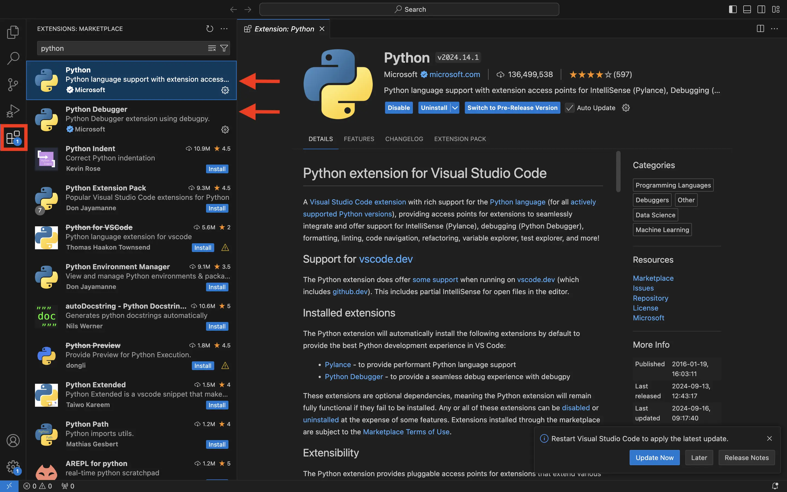
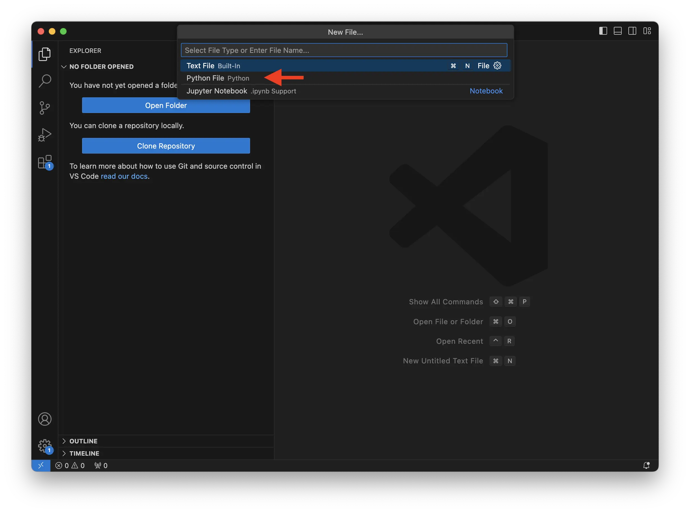
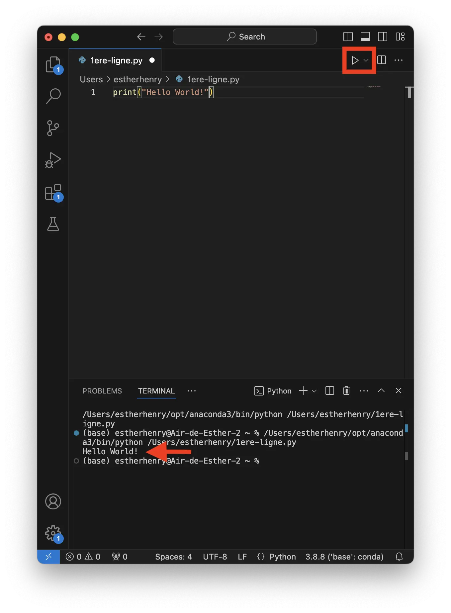


Aucun prérequis, ce MON est justement dédié à reprendre les bases de python



C’est ce livre qui m’a permis de reprendre les bases de python afin de m’en servir pour une étude de shs [Python pour les SHS](https://pur-editions.fr/product/7857/python-pour-les-shs)


## Objectif

1. Reprendre les bases de Python et s'entraîner sur des exemples simples.
2. Les bibliothèques : comprendre le fonctionnement et installer les modules nécessaires.

## Introduction

Python est de plus en plus utilisé en sciences humaines et sociales pour son efficacité dans le traitement et l'analyse de données massives et variées. Grâce à ses nombreuses bibliothèques dédiées à l'analyse textuelle (comme NLTK ou spiCy), il permet d'extraire des informations pertinentes de grands corpus de textes, d'automatiser des tâches répétitives, et de visualiser des données de manière claire et compréhensible. Sa simplicité de syntaxe et sa large communauté d'utilisateurs en font un outil accessible, même pour les chercheurs n'ayant pas de formation technique poussée, tout en offrant une grande flexibilité pour mener des analyses complexes. C'est donc un langage idéal pour se former à l'analyse de données textuelles, ce qui sera à terme le but de ces MON.

## Python : rappel des bases

### Penser comme un ordinateur

Pour rappel, quel que soit le langage de programmation utilisé, il est essentiel de penser comme un ordinateur. Il est inutile de tenter de communiquer avec une machine comme avec un être humain. Il faut donc utiliser un langage adapté, en l'occurrence Python, avec une syntaxe précise et un vocabulaire spécifique pour réaliser des opérations. Heureusement, Python a été conçu comme un langage d'apprentissage, ce qui le rend relativement facile à maîtriser et intuitif à utiliser.

### Comment faire du python ?

#### Où faire du python ?

Comme expliqué précédemment, pour coder, il faut communiquer avec la machine dans son langage, mais où le faire ?

Plusieurs solutions existent, mais il est généralement nécessaire d'utiliser un logiciel capable de traduire notre script (c'est-à-dire le code que l'on rédige sous forme de texte) afin que l'ordinateur puisse l'exécuter.

Dans notre cas, nous avons choisi d'utiliser Visual Studio Code, qui nous permet à la fois d'écrire le code et de visualiser les résultats dans un seul et même outil.


[une vidéo présentant comment installer VS Code](https://www.youtube.com/watch?v=V6NfiMu4eZ0) 


#### Les modules à installer

Une fois VS Code installé, il est nécessaire d’installer un certain nombre de modules afin de pouvoir l’utiliser pour coder en Python. Il est possible d'installer directement des modules via l’interface de VS Code dans la partie **“Extensions”**.

Nous recommandons donc d’installer à minima : **Python** (et **Pylance**, qui s’installera automatiquement) et **Python Debugger** (qui permet de corriger certains bugs) afin de pouvoir exécuter notre code (c'est-à-dire permettre à la machine de nous donner les résultats des opérations demandées dans notre script).



Il peut aussi être utile d’installer **Jupyter**, qui permettra d’enregistrer des fichiers contenant à la fois le script, le résultat de son exécution et des commentaires supplémentaires.

#### Écrire sa première ligne de code

Maintenant que VS Code est correctement installé, vous allez pouvoir écrire votre premier script et l’exécuter pour vérifier que l’installation fonctionne.

Pour ce faire :

- Ouvrez VS Code
- Ouvrez un nouveau fichier (sur macOS, cliquez sur “File” puis “New File …”)
- Sélectionnez “Python File”




Vérifiez alors qu’un fichier Python s’est bien ouvert : le fichier se nomme “quelque-chose **.py**” et en bas à droite de votre fenêtre, il est bien écrit “Python”.


Dans cette fenêtre, vous allez donc pouvoir écrire vos premières lignes de code pour dire bonjour au monde et que l’ordinateur vous l’affiche. Pour ce faire, tapez le code suivant puis cliquez sur la flèche en haut à droite :

```python
print("Hello World !")
```



Vous voyez alors que dans le terminal il est marqué:  Hello World !. Cela signifie que votre code est bien éxecuter et que tout est bien installé.

#### Comprendre l’organisation des fichiers dans votre ordinateur

Pour pouvoir utiliser Python afin de faire de l’analyse de données, il est essentiel de comprendre comment sont organisés vos fichiers dans votre ordinateur. Si cette notion n’est pas claire, il est conseillé de lire ce cours avant de continuer.


[Naviguer dans un système de fichiers](https://francoisbrucker.github.io/cours_informatique/cours/coder-et-d%C3%A9velopper/ordinateur-d%C3%A9veloppement/fichiers-navigation/)


#### Faire des erreurs

Lorsque l’on code, il est inévitable de faire des erreurs, et cela ne doit pas vous faire peur ! En effet, faire des erreurs fait partie du processus d’apprentissage, et il est important de savoir les analyser pour les corriger et pouvoir continuer à coder.

Ainsi, en Python, les erreurs les plus fréquentes sont celles de syntaxe, mais aussi des appels qui ne renvoient rien, ou encore des divisions par zéro.

Quelle que soit la nature de l'erreur, il est essentiel de prendre le temps de lire le message d’erreur qui vous indique la ligne concernée et le type d’erreur. Le mieux est alors d’isoler la ligne et de corriger l’erreur pour voir si la ligne fonctionne à nouveau, puis de tester à nouveau tout le code.


Si vous ne comprenez pas le message d’erreur, pas de panique ! Il est fort probable que l’explication se trouve sur internet. Copiez alors votre message d’erreur dans votre moteur de recherche, et vous trouverez probablement une explication pour vous débloquer.


### Commencer à coder

#### Les variables

Lorsque l’on veut analyser des données, il nous faut des données à stocker quelque part. Dans le code, cela se traduit par des variables qui vont stocker une information (du texte ou des nombres, par exemple) que l’on appelle **objets**, que l’on associe à un nom pour les identifier. Une variable stocke alors un objet à un instant donné, mais celui-ci peut évoluer au fur et à mesure de l’avancement du code. 

Par exemple, on peut créer la variable :

```python
pop_do_it = 25
```

Cette ligne permet de créer la variable pop_do_it et de lui attribuer l’objet nombre ayant la valeur 25 (à l'aide de l'opérateur =).


En Python, on peut mettre des espaces entre les différents éléments du code sans que cela n’en change le sens. Ce sont par contre les sauts de ligne qui sont les véritables ruptures dans le code.



Vous êtes libre de nommer vos variables comme vous le souhaitez, mais en respectant ces règles de base :

- Pas d’espaces
- Pas de caractères spéciaux
- La même variable doit toujours être appelée de la même manière


#### Les types de variable

Il existe différents types de variables permettant de stocker divers objets, voici la liste des principaux :

- **str** : chaîne de caractères (string) permet de stocker du texte entre guillemets

```python
nom = “Henry”
```

-**int** : nombre entier (integer)

```python
age = 22
```

- **float** : nombre à virgule 

```python
pi = 3.14
```

- **bool** : booléen renvoie une valeur vrai ou fausse (True ou False)

```python
mon_est_interessant = True
```

- **list** : liste est une séquence ordonnées d'éléments modifiable, les éléments peuvent être de différents types

```python
eleve = [“Esther”, ”Henry”, 22]
```

- **tuple** : similaire à une liste mais les éléments ne sont pas modifiables

```python
coordonnees = (10, 20)
```

- **dict** : dictionnaire est une collection de paires clé-valeur, où chaque clé est unique

```python
etudiante = {“nom” : “Henry”, “age” : 22, “étudiante” : True}
```

#### Les opérations

En Python, il existe un certain nombre d’opérateurs permettant de faire les opérations de base sur les nombres

| Opérations| Symboles| Exemples |
| -------- | --------- | --------|
| addition | + | 1 + 9 donne 10 |
| soustraction | - | 9 - 1 donne 8 |
| multiplication | * | 2 * 9 donne 18 |
| puissance | ** | 7 ** 2 donne 49 |
| division | / | 18 / 2 donne 9 |
| reste division euclidienne  | % | 9 % 2 donne 1 |
| quotient division eucidienne | // | 9 // 2 donne 4 |

Certaines de ces opérations sont aussi utilisables sur d’autres types de variables, mais attention, ce n’est pas une généralité. Nous verrons notamment ici l’addition sur une variable de type texte.

#### Les variables de type texte

Pour faire de l’analyse de données textuelles, il est préférable de bien maîtriser ce type de variable.

**Les guillemets**
Lorsque l’on veut entrer des variables de type texte, il est essentiel de les saisir entre **guillemets**.


Dans le cas de texte plutôt long où vous risquez d’avoir des guillemets de différents types, il est conseillé d’utiliser les triples guillemets afin d’éviter les erreurs !

Par exemple :

```python
print(“”” "Le bonheur, ce n'est pas d'avoir tout ce que l'on désire, mais d'apprécier ce que l'on a."  - P. Coelho”””)
```

Qui affichera : "Le bonheur, ce n'est pas d'avoir tout ce que l'on désire, mais d'apprécier ce que l'on a."  - P. Coelho



**Les caractères spéciaux**
La gestion des caractères spéciaux est un autre point de vigilance lors de la saisi de données textuelles. En effet certains caractères ont deja un sens en python, il y à donc un risque de confusion si on les utilise. 


Pour eviter la confusion, la solution est de mettre un backslash devant le caractère en question. 
Par exemple pour mettre un % sans un texte on ecrira : 

```python
print(“Le pourcentage de réussite au bac en 2019 est de 88.1\%”)
```

Qui retournera sans erreur : Le pourcentage de réussite au bac en 2019 est de 88.1%


**Faire des opérations sur du texte**
Il est possible de faire des opérations sur des variables de type texte. En effet, l’opérateur `+` permet d’assembler du texte et la fonction `str()` permet de convertir un nombre en texte. Ainsi, on pourrait écrire le texte suivant en partant de différents éléments :

```python
pop_do_it = 25
texte = “Il y a” + str (pop_do_it) + “élèves en Do-It”
print(texte)
```

Qui retournera : Il y a 25 élèves en Do-It

#### Maîtriser les listes et les bibliothèques

Afin d’analyser des données, il est essentiel de maîtriser les listes et les bibliothèques que nous avons définies plus haut.

##### Les listes

Nous allons travailler sur les opérations de base afin de se familiariser avec les listes. Pour ce faire, nous allons utiliser l’exemple d’une recette de gâteau et créer la liste suivante, puis l’afficher :

```python
proportion = [100, 50,100,200,3]
print (proportion)
```


Les éléments d’une liste sont associés à leur position dans la liste, qui commence à 0 pour le premier élément, 1 pour le deuxième, et ainsi de suite… 
Mais aussi -1 pour le dernier, -2 pour l'avant-dernier, etc.


Ainsi, si l’on veut afficher le troisième élément de notre liste, on notera : 

```python
print ( proportion [2] )
```

Une fois notre liste créée, nous allons voir quelques opérations qu’il est possible d’effectuer afin de la modifier :

- La fonction **.append ( )** permet d’ajouter un élément à la fin de la liste.
- La fonction **.remove ( )** permet de retirer un élément de la liste.

Faisons maintenant des petits exercices pour nous entraîner à manipuler les listes.


Modifier la dernière valeur de la liste afin que celle-ci prenne la valeur 2, puis afficher la liste pour vérifier.



```python
proportion [-1]  = 2
print(proportion)
```




Retirer la proportion de chocolat, qui était de 200 grammes, et afficher la liste pour vérifier.



```python
proportion.remove (200)
print(proportion)
```




Ajouter la proportion de citron dans le gâteau qui est de 4 à la fin de la liste et afficher la liste.



```python
proportion.append (4)
print(proportion)
```



##### Les dictionnaires

Pour continuer avec l’exemple de notre gâteau au chocolat, nous allons créer un dictionnaire afin d’associer à chaque ingrédient sa proportion :

```python
recette={“sucre” : 100, “farine” : 50, “beurre” : 100, “chocolat” : 200, “oeuf” : 3}
```

Le dictionnaire fonctionne sur un système de clé/valeur séparés par ":", et pour accéder à une valeur, il faut passer par sa clé. Par exemple, pour afficher la quantité de chocolat :

```python
print(recette [“chocolat”] )
```

Qui retournera : 200

Passons maintenant aux exercices pour manipuler un dictionnaire :


Ajouter la proportion de sel dans notre gâteau, qui est de 1, et afficher la nouvelle recette.



```python
recette[“sel”] = 1
print (recette)
```




Modifier la valeur du chocolat à 250 pour un gâteau plus gourmand et afficher la nouvelle recette.



```python
recette[“chocolat”] = 250
print (recette)
```



##### Les commentaires


Lorsque l’on écrit du code, il peut être utile d’y ajouter des commentaires, que ce soit pour soi-même se souvenir de ce que l’on a fait, ou pour permettre à quelqu’un à qui vous partagez le code de comprendre la logique qui se cache derrière.

Pour ajouter un commentaire, c’est très simple : il suffit d’aller à la ligne et de commencer celle-ci par un #. La ligne en question ne sera donc pas exécutée par la machine.

```python
#Voici ma recette de gâteau favorite !
recette={“sucre” : 100, “farine” : 50, “beurre” : 100, “chocolat” : 200, “oeuf” : 3}
```



#### Opérateurs de condition et de comparaison

Lorsque l’on veut faire de l’analyse de données, il est important de maîtriser les opérateurs de condition et de comparaison, car ce sont eux qui vont nous permettre de s’adapter à telle ou telle situation. Ainsi, les principaux opérateurs de condition et de comparaison sont : 

| Opérations| Symboles| Exemples |
| -------- | --------- | --------|
| égalité| == | type (9) == type (“neuf”) retourne False |
| supérieur | > | 9 > 1 retourne True |
| supérieur ou égal | >= | 1 >=9 retourne False |
| inférieur | < | 7 < 2 retourne False |
| différent | != | type (1) != int retourne False |
| est présent dans  | in | 5 in [1,2,5] retourne True |


Attention = permet d’attribuer une valeur tandis que == est un opérateur de comparaison.


#### Conditions, boucles et fonctions

Après avoir vu comment utiliser nos différentes variables, il est essentiel d’apprendre à organiser son code. Pour ce faire, nous avons besoin des trois blocs suivants :

- Tester une condition
- Répéter une opération
- Construire une fonction

En Python, ces blocs ont la particularité d’être décalés de quatre espaces. Ils sont essentiels, car si vous les oubliez, Python vous renverra un message d’erreur et ne pourra pas exécuter votre code. Par ailleurs, ces alinéas permettent de mieux visualiser vos blocs et de structurer correctement votre code.

##### Condition : si … alors …

Pour tester une condition, on utilise les fonctions **if**, **else** et **elif**. Prenons un exemple pour mieux comprendre.

```python
#Regarder si en Do-It le nombre d’élève est pair et à defaut un multiple de 5
pop_do_it = 25
if pop_do_it % 2 == 0 : 
    print(“Le nombre d’éléve en Do It est pair”)
elif pop_do_it % 5 ==0 : 
    print(“Le nombre d’éléve en Do It est multiple de 5”)
else : 
    print(“Le nombre d’élève en Do It n’est ni pair ni un multiple de 5”)

```

Ici, le code nous retournera : **Le nombre d’élèves en Do It est multiple de 5**.

En effet, le code suit cet ordre :

- Évaluer si le nombre d’élèves, c’est-à-dire 25, est divisible par 2. Si c’est le cas, il retourne "Le nombre d’élèves en Do It est pair" et sort du bloc.
- Si ce n’est pas le cas, il évalue si le nombre d’élèves est divisible par 5. Si c’est le cas, il retourne "Le nombre d’élèves en Do It est multiple de 5" et sort du bloc.
- Enfin, si les deux conditions précédentes ne sont pas vérifiées, il retourne "Le nombre d’élèves en Do It n’est ni pair ni un multiple de 5" et sort du bloc.

Par ailleurs, il est possible de cumuler des conditions grâce aux opérateurs **and** (et) et **or** (ou).

##### Les boucles

Les boucles sont très utiles lorsque l’on veut répéter une opération. En Python, les boucles **for** et **while** permettent de répéter des actions, mais elles s'utilisent différemment. 

La boucle **for** est généralement utilisée pour itérer sur une séquence (comme une liste, un tuple, ou une chaîne de caractères) ou un intervalle de valeurs prédéfini. Elle s'arrête automatiquement lorsque tous les éléments de la séquence ont été parcourus. Par exemple :

```python
for i in range(5):
    print(i)
```

Ou dans une liste :

```python
list=[0,2,5,6,3,8,978]
for p in list :
    print(“Age”, p)
```

La boucle **while**, quant à elle, continue à s'exécuter tant qu'une condition est vraie. Elle est plus flexible, mais doit être contrôlée avec précaution pour éviter des boucles infinies. Par exemple :

```python
i = 0
while i < 5:
    print(i)
    i += 1
```

En résumé, **for** est idéal pour des itérations définies à l'avance, tandis que **while** est utilisé lorsque la répétition dépend d'une condition à évaluer dynamiquement.

##### Construire des fonctions

Une fonction est un bloc de code qui prend des données en entrée, les traite, puis renvoie des résultats modifiés en conséquence.

Quel que soit le contenu de la fonction, elle s’organise toujours de la même manière. Prenons l’exemple d’une fonction qui, peu importe notre liste d’ingrédients, nous renvoie si elle contient du chocolat :

```python
def contient_chocolat (list_ingredient) : 
    for i in list_ingredient : 
        if i == "chocolat" :
            return print("Il y a du chocolat")
    else :
        return print("Il n'y a pas de chocolat")
    
ingredient = ["lait","oeuf","beurre","farine","chocolat","levure"]
contient_chocolat(ingredient)
```

On vient de :

- Définir la fonction `contient_chocolat` grâce à **def ()**.
- Définir les informations d’entrée, ici **list_ingredient**.
- Effectuer les opérations nécessaires pour traiter notre information d’entrée. Ici, nous parcourons la liste avec **for** pour tester chaque élément et voir si l’un d’entre eux est la chaîne de caractères "chocolat".
- Peu importe s’il y a du chocolat ou non, l’essentiel est que nous renvoyons cette information via **return**.
- Dans notre cas, il y a deux options : s’il y a du chocolat, alors nous imprimons "Il y a du chocolat" et nous sortons de la fonction ; sinon, nous continuons et imprimons "Il n'y a pas de chocolat" avant de sortir de la fonction.
- Enfin, nous testons notre fonction avec la liste **ingredient** en appliquant la fonction via **contient_chocolat(ingredient)**, ce qui nous retournera dans ce cas "Il y a du chocolat".

### Les bibliothèques

Une bibliothèque en Python est un ensemble de modules contenant du code pré-écrit, permettant de simplifier et d'accélérer le développement. Elle regroupe des fonctions et des outils déjà développés, que l'utilisateur peut intégrer directement dans ses programmes. Par exemple, la bibliothèque **math** propose des fonctions mathématiques courantes, **requests** facilite les requêtes en ligne, et **Nltk** est utilisée pour l’analyse de données textuelles. En important une bibliothèque dans son code, l'utilisateur peut alors accéder à des fonctions spécialisées, ce qui rend le développement plus rapide et efficace, tout en assurant que le code soit fiable et optimisé.


Le plus simple, si un utilisateur a besoin d’un outil spécifique pour son travail, est de chercher sur internet s’il n’existe pas déjà une bibliothèque correspondante. Il est fort probable que vous trouverez cette information accompagnée de la notice d’utilisation de la bibliothèque.


Nous allons ici voir comment se familiariser avec l’utilisation des bibliothèques en s’appuyant sur l’exemple de **requests**, qui est fortement utilisé pour accéder aux données présentes sur internet.

#### Installer une nouvelle bibliothèque


Pour rappel, si l’on veut faire appel dans notre code à une bibliothèque déjà installée, il faut l’importer avec **import**. Par exemple :

```python
import math as m
m.sqrt(9)
```

Ici, nous donnons à la bibliothèque le nom `m` lors de l’importation, ce qui nous permet par la suite d’y faire appel pour ses différentes fonctions via **m.**.


La méthode la plus simple pour installer une nouvelle bibliothèque est la méthode **pip**, qui va aller chercher dans les bases de données en ligne pour la télécharger.

Pour ce faire, il faut ouvrir un terminal dans VS Code et taper l’instruction suivante, puis appuyer sur Entrée :

```
pip install requests 
```

Une fois `requests` installé, il peut être utile de vérifier que l’installation a bien été effectuée et qu’il n’y a pas eu de bug. Pour cela, ouvrez une nouvelle fenêtre Python et saisissez le code suivant : 

```python
import requests as req
print( req.get(“https://www.lequipe.fr”) )
```

Si tout s’est bien passé, l’ordinateur doit nous retourner : <Response [200]>, ce qui signifie que tout s’est bien déroulé et que la page de l’Équipe a bien été récupérée.


Lorsque l’on utilise une bibliothèque dans un travail que l’on publie, il est important de citer cette bibliothèque pour deux raisons : la reconnaissance envers les créateurs de la bibliothèque et afin que les lecteurs puissent comprendre et utiliser les scripts.


#### Utilisation de la bibliothèque requests

L’objectif de cette partie est de voir comment utiliser certaines fonctions de requests qui pourraient être utiles pour faire de l’analyse de données textuelles par la suite.

##### Récupérer une page internet

Nous allons voir ici comment récupérer une page sur le site internet de l’Équipe et afficher une partie de son contenu.

```python
reponse = req.get("https://www.lequipe.fr")
contenu = reponse.text
print(contenu[100:150])
```

Ce code nous permet alors :

- Via la fonction **.get** de `requests`, de récupérer une page internet via son URL et de la stocker dans `reponse`.
- Via la fonction **.text**, de convertir les données stockées dans `reponse` en chaîne de caractères et de les stocker dans `contenu`.
- Puis d’afficher 50 caractères parmi ceux présents dans la page (tout afficher serait trop lourd).


Lorsque l’on fait trop de requêtes sur la même page, il est possible que l’on soit bloqué. Il faut alors attendre quelques heures avant de pouvoir faire de nouvelles requêtes sur cette page.


##### Vérifier la présence d’un mot sur une page

Pour vérifier qu’un mot est bien présent sur une page, on peut importer la page comme précédemment puis utiliser les fonctions **if** et **in** pour vérifier si le mot est présent ou non :

```python
#Récupérer la page 
url="https://www.lequipe.fr"
reponse = req.get(url)
contenu = reponse.text

#Tester la présence du mot
if "vélo" in contenu :
    print ("Le mot est présent")
else :
    print("Le mot n'est pas présent")
```

##### Un petit exercice pour voir si on a bien compris


Construire une fonction afin d’automatiser la recherche d’un mot dans une page.



```python
def presence_mot(mot,url) :
    reponse = req.get(url)
    contenu = reponse.text
    if mot in contenu :
        print("Le mot est présent")
    else :
        print("Le mot n'est pas présent")
```




Choisir trois sites internet de médias et deux mots, puis tester pour chaque page si les mots sont présents.



```python
pages = ["https://www.lemonde.fr","https://www.lequipe.fr","https://www.causette.fr"]
mots = ["femme","santé"]
resultats = {}
for p in pages : 
    resultats[p]={}
    for j in mots :
        resultats[p][j]=presence_mot(j,p)
print (resultats)
```



### Horodatage

| Date | Heures passées | Indications |
| -------- | --------- | --------|
| Lundi 09/09 | 1H45 | Préparation du sujet (Lecture du livre & Installation de Python) |
| Mardi 10/09 | 3H | Reprendre les bases de python (Théorie & Exercices) |
| Mercredi 11/09 | 3H | Bibliothèques |
| Lundi 16/09 | 4H | Mettre en forme |

### Bibliographie



- [Python pour les SHS](https://pur-editions.fr/product/7857/python-pour-les-shs)
- [Vidéo présentant comment installer VS Code pour python](https://www.youtube.com/watch?v=V6NfiMu4eZ0) 

